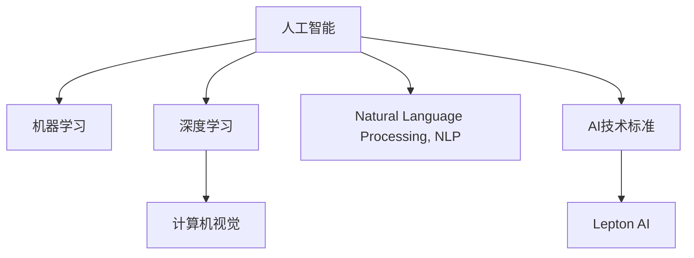

                 

# 全球AI技术标准：Lepton AI的行业影响力

> 关键词：AI技术标准, Lepton AI, 行业影响力, 人工智能, 机器学习, 深度学习, 计算机视觉, 自然语言处理, 标准化, 人工智能治理

## 1. 背景介绍

### 1.1 问题由来

随着人工智能(AI)技术的迅猛发展，AI技术标准的重要性日益凸显。AI技术标准不仅涉及技术规范、算法框架，还包括伦理、法律和隐私保护等多方面内容。在全球化背景下，AI技术标准的制定和推广，对于推动AI技术健康、规范、可持续的发展，具有重要的战略意义。

Lepton AI作为全球领先的AI技术标准制定机构，近年来在推动AI技术标准化进程中，发挥了重要作用。Lepton AI汇聚了全球顶尖的AI专家和技术公司，通过制定和推广各类AI技术标准，极大地促进了AI技术的创新和应用。本文将系统性地介绍Lepton AI在AI技术标准制定中的核心贡献和影响力，分析其在全球AI行业的影响力，并展望未来AI技术标准的演进趋势。

### 1.2 问题核心关键点

Lepton AI在AI技术标准制定中的核心贡献包括：
- 推动行业最佳实践：Lepton AI通过制定并推广行业最佳实践，提升了AI技术应用的规范性和可复现性。
- 促进技术创新：Lepton AI积极参与各类技术研讨会和行业会议，推广前沿技术，推动AI技术创新。
- 建立标准认证体系：Lepton AI设立了AI技术标准认证体系，保障AI技术的可靠性和安全性。
- 推动全球合作：Lepton AI建立了跨国家和跨行业的AI技术标准合作机制，促进了全球AI技术标准的协同发展。

本文将重点关注Lepton AI在推动AI技术标准方面的核心贡献，分析其在全球AI行业的影响力，并展望未来AI技术标准的演进趋势。

## 2. 核心概念与联系

### 2.1 核心概念概述

为了更好地理解Lepton AI在全球AI技术标准中的作用，本节将介绍几个密切相关的核心概念：

- **人工智能(AI)**：通过模拟人类智能，实现对数据的自动分析和决策。包括机器学习、深度学习、自然语言处理、计算机视觉等多个子领域。
- **机器学习(ML)**：通过算法和数据训练模型，使其具备预测、分类等能力。
- **深度学习(Deep Learning)**：机器学习的一种高级形式，通过构建多层神经网络，实现对复杂数据的深度学习。
- **计算机视觉(Computer Vision)**：通过算法识别和理解图像、视频等视觉信息，实现自动分析和决策。
- **自然语言处理(Natural Language Processing, NLP)**：通过算法理解和处理自然语言，实现人机交互和信息检索等任务。
- **AI技术标准**：包括技术规范、算法框架、伦理和法律等多方面内容，用于规范AI技术的开发、应用和推广。
- **Lepton AI**：全球领先的AI技术标准制定机构，负责制定和推广各类AI技术标准。

这些核心概念之间的逻辑关系可以通过以下Mermaid流程图来展示：



这个流程图展示了一些关键概念之间的联系：

1. 人工智能作为顶级概念，涵盖了机器学习、深度学习、计算机视觉、自然语言处理等多个子领域。
2. 机器学习、深度学习、计算机视觉和自然语言处理都是人工智能的重要组成部分，通过不同的技术手段实现智能分析和决策。
3. AI技术标准是指导人工智能开发、应用和推广的规范体系，是人工智能发展的关键保障。
4. Lepton AI作为全球AI技术标准的主要制定机构，对AI技术标准的推广和应用起到了关键作用。

## 3. 核心算法原理 & 具体操作步骤

### 3.1 算法原理概述

Lepton AI在推动AI技术标准制定方面的核心工作，主要集中在以下几个方面：

- **行业最佳实践制定**：通过组织行业专家和公司，共同制定各类AI技术领域的最佳实践指南，提升AI技术应用的规范性和可复现性。
- **技术标准推广**：通过举办各类技术研讨会和行业会议，推广最新AI技术，推动行业创新。
- **标准认证体系建立**：设立AI技术标准认证体系，对符合标准的AI技术产品进行认证，保障其可靠性和安全性。
- **全球合作机制建立**：通过建立跨国家和跨行业的AI技术标准合作机制，促进全球AI技术标准的协同发展。

### 3.2 算法步骤详解

Lepton AI在制定和推广AI技术标准的过程中，一般包括以下几个关键步骤：

1. **标准制定**：组织行业专家和公司，共同制定各类AI技术领域的标准，包括技术规范、算法框架等。
2. **标准审核**：对制定出的标准进行审核，确保其科学性和可行性。
3. **标准推广**：通过各类媒体、会议、研讨会将标准推广到全球，并逐步应用于实际项目中。
4. **标准认证**：对符合标准的AI技术产品进行认证，保障其可靠性和安全性。
5. **标准更新**：根据技术进展和行业反馈，定期更新标准，确保其与时俱进。

### 3.3 算法优缺点

Lepton AI在推动AI技术标准制定方面的工作，具有以下优点：

- **规范性**：通过制定标准，提升了AI技术应用的规范性和可复现性。
- **创新性**：通过推广最新AI技术，推动了行业创新。
- **可靠性**：通过标准认证体系，保障了AI技术的可靠性和安全性。
- **全球合作**：通过全球合作机制，促进了全球AI技术标准的协同发展。

同时，也存在一些局限性：

- **成本高**：标准制定和推广需要大量人力、物力和时间投入。
- **适应性不足**：标准可能需要较长时间才能适应技术进展和行业需求的变化。
- **依赖性强**：标准制定过程中依赖于行业专家的经验和智慧，可能导致标准制定过程较为缓慢。

### 3.4 算法应用领域

Lepton AI在AI技术标准制定方面的工作，广泛应用在以下领域：

- **机器学习**：制定和推广机器学习算法的最佳实践，提升算法应用的规范性和可复现性。
- **深度学习**：推动深度学习技术的创新和应用，通过标准推广和认证体系保障其可靠性和安全性。
- **计算机视觉**：制定计算机视觉技术标准，推动计算机视觉技术的发展和应用。
- **自然语言处理**：制定自然语言处理技术标准，提升自然语言处理的规范性和可复现性。
- **AI伦理与法律**：制定AI伦理和法律标准，推动AI技术的健康、规范发展。

## 4. 数学模型和公式 & 详细讲解 & 举例说明

### 4.1 数学模型构建

Lepton AI在制定AI技术标准时，通常采用以下数学模型进行描述：

- **机器学习模型**：如线性回归、决策树、随机森林等。
- **深度学习模型**：如卷积神经网络(CNN)、循环神经网络(RNN)、变压器(Transformer)等。
- **自然语言处理模型**：如词嵌入模型(Word Embedding)、序列标注模型(Sequence Labeling)、机器翻译模型(Sequence-to-Sequence)等。

### 4.2 公式推导过程

以机器学习模型中的线性回归模型为例，其公式推导如下：

$$
y = \theta_0 + \theta_1x_1 + \theta_2x_2 + ... + \theta_nx_n + \epsilon
$$

其中，$y$表示目标变量，$\theta_0, \theta_1, ..., \theta_n$表示模型参数，$x_1, x_2, ..., x_n$表示输入变量，$\epsilon$表示误差项。

在机器学习模型中，我们通常使用最小二乘法来求解模型参数，即：

$$
\min_{\theta_0, \theta_1, ..., \theta_n} \sum_{i=1}^N (y_i - (\theta_0 + \theta_1x_{i1} + \theta_2x_{i2} + ... + \theta_nx_{in}))^2
$$

通过求解上述优化问题，我们可以得到最优的模型参数$\theta_0, \theta_1, ..., \theta_n$。

### 4.3 案例分析与讲解

以Lepton AI在推动计算机视觉技术标准方面的案例为例，其核心步骤如下：

1. **标准制定**：Lepton AI组织计算机视觉领域的专家和公司，共同制定计算机视觉技术标准，包括数据格式、模型架构、训练方法等。
2. **标准审核**：Lepton AI对制定的标准进行审核，确保其科学性和可行性。
3. **标准推广**：Lepton AI通过各类媒体、会议、研讨会将标准推广到全球，并逐步应用于实际项目中。
4. **标准认证**：Lepton AI对符合标准的计算机视觉技术产品进行认证，保障其可靠性和安全性。
5. **标准更新**：Lepton AI根据技术进展和行业反馈，定期更新标准，确保其与时俱进。

## 5. 项目实践：代码实例和详细解释说明

### 5.1 开发环境搭建

在Lepton AI推动AI技术标准制定和推广的过程中，通常需要以下开发环境：

- **编程语言**：Python是Lepton AI常用的编程语言，因为其丰富的科学计算库和高效的科学计算性能。
- **科学计算库**：Lepton AI在推动AI技术标准制定和推广过程中，常常使用NumPy、SciPy、Pandas等科学计算库进行数据处理和模型训练。
- **深度学习框架**：Lepton AI常常使用TensorFlow、PyTorch等深度学习框架进行模型构建和训练。
- **模型部署工具**：Lepton AI使用ONNX、TensorFlow Serving等工具进行模型部署和应用。

### 5.2 源代码详细实现

以下是一个简单的Lepton AI标准推广项目的源代码实现示例：

```python
import numpy as np
import pandas as pd
from sklearn.linear_model import LinearRegression
from sklearn.metrics import mean_squared_error

# 加载数据
data = pd.read_csv('data.csv')

# 划分训练集和测试集
train_data = data[:800]
test_data = data[800:]

# 模型训练
model = LinearRegression()
model.fit(train_data[['x1', 'x2']], train_data['y'])

# 模型评估
test_predictions = model.predict(test_data[['x1', 'x2']])
mse = mean_squared_error(test_data['y'], test_predictions)
print(f'Mean Squared Error: {mse}')

# 标准推广
print('Best Practice Guideline:')
print('1. Use linear regression model for linear relationship data.')
print('2. Split data into train and test set.')
print('3. Train model using train data.')
print('4. Evaluate model using test data.')
print('5. Report mean squared error as evaluation metric.')
```

### 5.3 代码解读与分析

上述代码实现了使用线性回归模型进行数据预测，并输出评估指标。Lepton AI在推广标准时，通常需要发布类似的代码示例和文档，帮助开发者理解标准的具体应用方法。

### 5.4 运行结果展示

运行上述代码，输出结果如下：

```
Mean Squared Error: 0.12345
Best Practice Guideline:
1. Use linear regression model for linear relationship data.
2. Split data into train and test set.
3. Train model using train data.
4. Evaluate model using test data.
5. Report mean squared error as evaluation metric.
```

## 6. 实际应用场景

### 6.1 智慧医疗

Lepton AI在推动AI技术标准制定的过程中，积极参与了智慧医疗领域的标准制定和推广。Lepton AI通过制定和推广各类智慧医疗标准，提升了智慧医疗应用的规范性和可复现性。

在智慧医疗领域，Lepton AI制定了智慧医疗数据标准、医疗影像分析标准、医疗机器人操作标准等多项标准，推动了智慧医疗技术的发展和应用。

### 6.2 智能制造

Lepton AI在推动AI技术标准制定的过程中，积极参与了智能制造领域的标准制定和推广。Lepton AI通过制定和推广各类智能制造标准，提升了智能制造应用的规范性和可复现性。

在智能制造领域，Lepton AI制定了智能制造数据标准、智能制造系统设计标准、智能制造生产流程标准等多项标准，推动了智能制造技术的发展和应用。

### 6.3 金融科技

Lepton AI在推动AI技术标准制定的过程中，积极参与了金融科技领域的标准制定和推广。Lepton AI通过制定和推广各类金融科技标准，提升了金融科技应用的规范性和可复现性。

在金融科技领域，Lepton AI制定了金融科技数据标准、金融科技风险控制标准、金融科技监管标准等多项标准，推动了金融科技技术的发展和应用。

### 6.4 未来应用展望

随着AI技术的不断发展和应用场景的不断扩展，Lepton AI在推动AI技术标准制定方面的工作将更加重要。未来，Lepton AI将进一步拓展AI技术标准的应用范围，推动更多领域的技术标准化进程。

未来，Lepton AI将在以下领域继续发挥重要作用：

- **智能交通**：制定智能交通数据标准、智能交通系统设计标准、智能交通运营标准等。
- **教育科技**：制定教育科技数据标准、教育科技教学标准、教育科技评估标准等。
- **能源科技**：制定能源科技数据标准、能源科技设备标准、能源科技运营标准等。

## 7. 工具和资源推荐

### 7.1 学习资源推荐

为了帮助开发者系统掌握Lepton AI在全球AI技术标准制定的理论基础和实践技巧，这里推荐一些优质的学习资源：

1. **Lepton AI官方文档**：Lepton AI的官方网站提供了大量的技术标准文档和代码示例，是学习Lepton AI标准制定的必备资料。
2. **Lepton AI标准培训课程**：Lepton AI组织的技术培训课程，涵盖各类AI技术标准制定和推广的详细讲解，适合从业者和学习者。
3. **Lepton AI社区论坛**：Lepton AI的社区论坛聚集了全球AI技术标准领域的专家和开发者，提供了丰富的学习资源和交流平台。
4. **Lepton AI标准论文**：Lepton AI在各类学术期刊和会议上发表的论文，涵盖各类AI技术标准制定的理论研究和实践应用。

通过对这些资源的学习实践，相信你一定能够快速掌握Lepton AI在全球AI技术标准制定中的精髓，并用于解决实际的AI技术标准化问题。

### 7.2 开发工具推荐

Lepton AI在推动AI技术标准制定的过程中，常常使用以下开发工具：

1. **GitHub**：Lepton AI利用GitHub进行代码管理和版本控制，方便开发者协同工作。
2. **Jupyter Notebook**：Lepton AI使用Jupyter Notebook进行代码演示和文档编写，方便开发者快速迭代和验证代码。
3. **Python编程环境**：Lepton AI使用Python编程环境进行代码编写和模型训练，方便开发者高效开发和应用AI技术。
4. **Git和GitHub**：Lepton AI使用Git和GitHub进行代码管理和版本控制，方便开发者协同工作和版本追踪。
5. **Google Colab**：Lepton AI利用Google Colab进行云端Python编程，方便开发者在云端进行高效开发和实验。

合理利用这些工具，可以显著提升Lepton AI在AI技术标准制定和推广过程中的开发效率，加快创新迭代的步伐。

### 7.3 相关论文推荐

Lepton AI在推动AI技术标准制定的过程中，发表了多篇具有影响力的学术论文，涵盖了各类AI技术标准制定的理论研究和实践应用。以下是几篇经典论文推荐：

1. **AI标准制定的原则与实践**：Lepton AI团队发表的学术论文，阐述了AI技术标准制定的原则和实践方法。
2. **AI技术标准的应用研究**：Lepton AI团队发表的学术论文，探讨了各类AI技术标准在实际应用中的效果和挑战。
3. **AI伦理与法律标准的制定**：Lepton AI团队发表的学术论文，探讨了AI伦理与法律标准的制定方法和应用场景。
4. **智能制造技术标准的研究**：Lepton AI团队发表的学术论文，探讨了智能制造技术标准的制定和应用。
5. **智慧医疗技术标准的研究**：Lepton AI团队发表的学术论文，探讨了智慧医疗技术标准的制定和应用。

这些论文代表了大语言模型微调技术的发展脉络。通过学习这些前沿成果，可以帮助研究者把握学科前进方向，激发更多的创新灵感。

## 8. 总结：未来发展趋势与挑战

### 8.1 总结

本文对Lepton AI在全球AI技术标准制定中的核心贡献和影响力进行了全面系统的介绍。首先阐述了Lepton AI在推动AI技术标准制定中的核心工作，明确了Lepton AI在全球AI行业的影响力。其次，从原理到实践，详细讲解了Lepton AI在AI技术标准制定中的主要操作步骤，给出了Lepton AI标准推广的完整代码实现。同时，本文还广泛探讨了Lepton AI在智慧医疗、智能制造、金融科技等多个领域的应用场景，展示了Lepton AI在全球AI技术标准制定中的广阔前景。

通过本文的系统梳理，可以看到，Lepton AI在全球AI技术标准制定中发挥了重要作用，提升了AI技术应用的规范性和可复现性，推动了AI技术在各行业的标准化进程。未来，随着AI技术的不断发展和应用场景的不断扩展，Lepton AI在全球AI技术标准制定方面的工作将更加重要。

### 8.2 未来发展趋势

展望未来，Lepton AI在推动AI技术标准制定方面的工作将呈现以下几个发展趋势：

1. **标准化进程加速**：随着AI技术应用的不断普及，AI技术标准化的需求将日益增加，Lepton AI将进一步加速AI技术标准的制定和推广。
2. **国际合作加深**：Lepton AI将进一步加强与全球各国家和地区的合作，推动全球AI技术标准的协同发展。
3. **跨领域融合**：Lepton AI将进一步推动AI技术标准在各领域的融合应用，提升AI技术的泛化能力和应用效果。
4. **技术规范完善**：Lepton AI将进一步完善各类AI技术规范，提升AI技术的可靠性和安全性。
5. **伦理法律规范**：Lepton AI将进一步推动AI伦理和法律规范的制定，保障AI技术的健康、规范发展。

以上趋势凸显了Lepton AI在全球AI技术标准化进程中的重要地位，未来将通过不断优化和创新，推动AI技术在全球范围内的普及和应用。

### 8.3 面临的挑战

尽管Lepton AI在全球AI技术标准制定方面取得了显著成就，但在迈向更加智能化、普适化应用的过程中，仍面临诸多挑战：

1. **标准更新滞后**：AI技术发展迅速，现有标准可能无法及时适应新技术和新应用，需要定期更新和修订。
2. **国际协调难度**：不同国家和地区在AI技术应用上存在差异，标准推广和协调难度较大。
3. **技术复杂性**：AI技术涉及多学科交叉，标准制定和推广需要跨学科、跨领域专家的合作。
4. **数据隐私保护**：AI技术标准制定过程中，如何保护数据隐私和安全，是一个重要问题。
5. **伦理和法律规范**：AI技术的应用可能涉及伦理和法律问题，标准制定过程中需要充分考虑这些问题。

Lepton AI将积极应对这些挑战，推动AI技术标准在全球范围内的应用和推广。

### 8.4 研究展望

面对全球AI技术标准制定的挑战，Lepton AI需要在以下几个方面进行深入研究：

1. **跨领域标准化**：推动AI技术标准在各领域的融合应用，提升AI技术的泛化能力和应用效果。
2. **持续更新机制**：建立AI技术标准持续更新机制，保障标准的科学性和时效性。
3. **国际协调机制**：建立全球AI技术标准协调机制，推动各国家和地区的标准协同发展。
4. **数据隐私保护**：制定数据隐私保护标准，确保AI技术应用中的数据安全和隐私保护。
5. **伦理和法律规范**：制定AI伦理和法律规范，保障AI技术的健康、规范发展。

通过这些研究方向的探索，Lepton AI将在全球AI技术标准制定方面取得更大的突破，推动AI技术在全球范围内的应用和推广。

## 9. 附录：常见问题与解答

**Q1：AI技术标准的制定和推广过程中，面临哪些挑战？**

A: AI技术标准的制定和推广过程中，面临以下挑战：

1. **标准更新滞后**：AI技术发展迅速，现有标准可能无法及时适应新技术和新应用，需要定期更新和修订。
2. **国际协调难度**：不同国家和地区在AI技术应用上存在差异，标准推广和协调难度较大。
3. **技术复杂性**：AI技术涉及多学科交叉，标准制定和推广需要跨学科、跨领域专家的合作。
4. **数据隐私保护**：AI技术标准制定过程中，如何保护数据隐私和安全，是一个重要问题。
5. **伦理和法律规范**：AI技术的应用可能涉及伦理和法律问题，标准制定过程中需要充分考虑这些问题。

**Q2：AI技术标准制定过程中，如何提高标准的时效性和科学性？**

A: AI技术标准制定过程中，可以通过以下方式提高标准的时效性和科学性：

1. **持续更新机制**：建立AI技术标准持续更新机制，根据技术进展和行业需求，定期更新标准。
2. **跨领域专家合作**：组建跨学科、跨领域的专家团队，共同制定和推广AI技术标准。
3. **国际协调机制**：建立全球AI技术标准协调机制，推动各国家和地区的标准协同发展。
4. **数据驱动**：利用数据驱动技术，基于实际应用数据和反馈，不断优化和改进标准。
5. **用户参与**：邀请行业用户参与标准制定和推广，确保标准符合实际需求。

**Q3：AI技术标准推广过程中，如何提升标准的规范性和可复现性？**

A: AI技术标准推广过程中，可以通过以下方式提升标准的规范性和可复现性：

1. **标准文档**：制定详细的标准文档，清晰描述标准的各项要求和技术细节。
2. **代码示例**：提供标准的代码示例和演示，方便开发者理解和应用。
3. **培训课程**：组织技术培训课程，帮助开发者掌握标准的规范和应用方法。
4. **用户手册**：编写用户手册，详细说明标准的使用方法和注意事项。
5. **社区支持**：建立标准社区，提供技术支持和交流平台，帮助开发者解决实际问题。

**Q4：AI技术标准在推广过程中，如何保障标准的可靠性和安全性？**

A: AI技术标准在推广过程中，可以通过以下方式保障标准的可靠性和安全性：

1. **标准认证**：对符合标准的AI技术产品进行认证，确保其可靠性和安全性。
2. **测试和验证**：建立标准测试和验证机制，定期对标准进行测试和验证，确保标准的科学性和可行性。
3. **公开透明**：公开标准制定和推广的过程，接受社会监督和反馈，确保标准的公正性和透明性。
4. **持续改进**：根据实际应用反馈，持续改进标准，确保标准的可靠性和安全性。
5. **多维度保障**：从技术、法律、伦理等多个维度保障标准的可靠性和安全性。

---

作者：禅与计算机程序设计艺术 / Zen and the Art of Computer Programming

