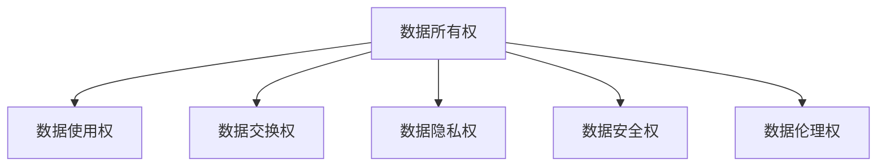

                 

# 全球脑与个人数据主权:信息时代的数据权益保护

> 关键词：数据主权,数据隐私,个人信息保护,隐私计算,区块链,智能合约

## 1. 背景介绍

### 1.1 问题由来
在信息时代，数据已经成为驱动社会进步、企业创新、科学研究等重要资源。随着互联网的普及和数字化转型的加速，个人和企业产生的数据量呈指数级增长，如何管理和保护这些数据，成为了一个日益紧迫的问题。

数据的核心价值在于其蕴含的洞见、趋势和知识，但同时也蕴含着隐私、安全和伦理等复杂因素。数据主权，即个人和企业对其自身数据的控制权和所有权，是信息时代数据权益保护的核心议题。

数据主权的核心问题是数据使用、数据交换和数据归属。在传统模式下，数据通常由数据所有者拥有，但随着数据采集、存储、分析和利用的复杂化，数据主权问题变得更加复杂。如何在技术、法律和伦理层面，保护数据主权，成为了全球数据治理的挑战。

### 1.2 问题核心关键点
数据主权的核心关键点包括以下几个方面：

- **数据所有权**：个人和企业对其自身数据的控制权和所有权。
- **数据使用权**：数据所有者对其数据的使用权，包括授权使用、共享使用、出售使用等。
- **数据交换权**：数据所有者与其他方交换数据的权利，包括数据共享、数据交易等。
- **数据隐私权**：保护数据不被未经授权的第三方获取和使用，避免隐私泄露和滥用。
- **数据安全权**：保障数据在存储、传输和使用过程中的安全性，防止数据被盗取或篡改。
- **数据伦理权**：确保数据的使用遵循伦理原则，不损害个人或社会的利益。

这些核心关键点相互关联，共同构成了数据主权的基础。

### 1.3 问题研究意义
研究数据主权问题，对于保护个人隐私、维护企业利益、促进数据共享与开放，以及推动数据法律和政策的形成，具有重要意义：

1. **保护个人隐私**：确保个人对其数据有控制权，防止数据被滥用或泄露，维护个人尊严和权益。
2. **维护企业利益**：确保企业对其业务数据有合法使用权，防止数据被盗用，保障企业竞争力和创新能力。
3. **促进数据共享与开放**：在保护数据主权的前提下，推动数据共享，促进科研、教育和商业等领域的创新发展。
4. **推动数据法律和政策形成**：建立数据权益保护的法律框架和政策体系，为数据治理提供规范和指导。

数据主权问题事关社会福祉和科技进步，是信息时代亟待解决的关键问题之一。

## 2. 核心概念与联系

### 2.1 核心概念概述

数据主权涉及多个核心概念，包括数据所有权、数据使用权、数据交换权、数据隐私权、数据安全权和数据伦理权。这些概念之间的逻辑关系可以通过以下Mermaid流程图来展示：



这个流程图展示了一些关键概念之间的联系：

- 数据所有权是数据使用、交换、隐私、安全和伦理的基础。
- 数据使用权与数据所有权紧密相关，但使用权需要在所有权的框架下进行。
- 数据交换权涉及到数据所有权的让渡，是数据共享和交易的核心。
- 数据隐私权和数据安全权是保护数据不被滥用或泄露的重要措施。
- 数据伦理权确保数据使用遵循伦理原则，避免对个人或社会造成伤害。

这些概念共同构成了数据主权的多维视角，有助于我们全面理解数据权益保护的复杂性。

## 3. 核心算法原理 & 具体操作步骤

### 3.1 算法原理概述

数据主权保护的核心在于构建一个安全的、可控的数据治理框架。这种框架需要综合考虑数据所有权、使用权、交换权、隐私保护、安全保障和伦理原则，通过技术手段实现数据权益的合理分配和保护。

以下是一些关键的数据治理技术：

- **隐私计算**：在不泄露数据原始内容的前提下，通过计算得到数据结果。隐私计算包括差分隐私、联邦学习、同态加密等技术。
- **区块链**：利用去中心化、不可篡改的特点，实现数据共享和交易的透明性和可追踪性。
- **智能合约**：通过编程规则自动执行数据共享和交易，保障数据的合法使用和权益保护。

这些技术通过协同作用，可以构建一个安全、高效、可控的数据治理框架，实现数据主权的保护。

### 3.2 算法步骤详解

数据主权的保护涉及多个步骤，具体包括：

**Step 1: 数据分类与标签化**
- 对数据进行分类，如个人数据、企业数据、公共数据等。
- 对每个数据集进行标签化，明确数据的敏感程度、使用目的和归属权。

**Step 2: 数据所有权声明**
- 数据所有者声明其对数据的控制权，包括使用权、交换权和隐私权。
- 所有权声明可以采用数字证书、智能合约等形式进行记录和验证。

**Step 3: 数据使用授权**
- 数据使用方提出使用申请，包括使用目的、范围和期限。
- 数据所有者审查申请，同意后签署授权协议，使用方获得使用权。

**Step 4: 数据交换与交易**
- 数据所有者与其他方进行数据交换或交易，签署数据交换协议。
- 交换协议中应明确数据使用范围、保护措施和收益分配。

**Step 5: 数据隐私保护**
- 采用隐私计算技术，如差分隐私、同态加密等，保护数据的隐私性。
- 对数据进行加密存储和传输，防止数据泄露和篡改。

**Step 6: 数据安全保障**
- 采用区块链技术，实现数据交换和交易的透明性和可追溯性。
- 使用智能合约，自动执行数据共享和交易，确保数据的合法使用。

**Step 7: 数据伦理审查**
- 对数据使用进行伦理审查，确保不侵害个人隐私和社会利益。
- 建立数据伦理委员会，审查数据使用的合法性和合理性。

### 3.3 算法优缺点

数据主权保护框架具有以下优点：

- **全面性**：涵盖了数据的所有权、使用权、交换权、隐私权、安全权和伦理权，提供了一个全面的数据治理方案。
- **透明性**：通过区块链和智能合约，实现数据交换和交易的透明性和可追溯性，增加数据使用的可信度。
- **可控性**：通过所有权声明和授权协议，确保数据使用的合法性和合理性，保护数据所有者的权益。

同时，该框架也存在一些局限性：

- **复杂性**：技术手段多样，实施和管理较为复杂。
- **成本高**：技术实现和维护成本较高，对小规模数据治理可能不适用。
- **法律合规性**：需要与法律法规相结合，才能确保数据治理的合法性。

尽管存在这些局限性，但整体而言，数据主权保护框架为数据治理提供了坚实的技术基础，有助于解决数据权益保护的复杂问题。

### 3.4 算法应用领域

数据主权保护框架可以广泛应用于以下几个领域：

- **医疗健康**：保护患者隐私，确保医疗数据的合法使用和共享。
- **金融服务**：保护客户数据，防止数据泄露和滥用。
- **公共安全**：保护政府数据，确保数据共享和使用的透明性和安全性。
- **科学研究**：保护科研数据，促进数据共享和开放，推动科研创新。
- **商业应用**：保护企业数据，确保数据使用和交易的合法性和公平性。

这些领域的数据治理需求各异，但数据主权保护框架提供了通用的解决方案，有助于提升各领域的数字化转型水平。

## 4. 数学模型和公式 & 详细讲解

### 4.1 数学模型构建

数据主权保护涉及多个数学模型，以下以隐私计算中的差分隐私为例，进行详细讲解。

定义隐私预算 $\epsilon$，表示隐私泄露的风险。差分隐私通过添加随机噪声，使得隐私预算不超过 $\epsilon$。数学上，差分隐私可以表示为：

$$
\mathcal{L}(D) = \frac{1}{\epsilon} \log\left(\frac{1}{\delta}\right) + f(D)
$$

其中 $D$ 为数据集，$f(D)$ 为函数，$\delta$ 为安全参数。

隐私计算的目标是在保证隐私预算不超过 $\epsilon$ 的前提下，最大化函数 $f(D)$ 的准确性。

### 4.2 公式推导过程

差分隐私的数学推导涉及以下步骤：

1. 对数据集 $D$ 添加随机噪声 $\Delta$，得到新数据集 $D' = D + \Delta$。
2. 计算 $f(D')$ 的统计结果。
3. 使用统计结果推断 $f(D)$ 的准确性。

具体而言，假设 $D = \{x_1, x_2, ..., x_n\}$，则差分隐私的推导如下：

$$
\mathcal{L}(D) = \frac{1}{\epsilon} \log\left(\frac{1}{\delta}\right) + f(D)
$$

其中，$\epsilon$ 为隐私预算，$\delta$ 为安全参数，$f(D)$ 为函数。

### 4.3 案例分析与讲解

以金融数据分析为例，假设某金融机构需要分析客户信用评分数据，以评估贷款风险。由于客户数据涉及隐私，不能直接使用原始数据，而采用差分隐私技术。

具体步骤如下：

1. 对客户数据 $D = \{x_1, x_2, ..., x_n\}$ 添加随机噪声 $\Delta$，得到 $D' = D + \Delta$。
2. 对 $D'$ 进行信用评分函数 $f(D')$ 计算，得到信用评分结果。
3. 将结果 $f(D')$ 和隐私预算 $\epsilon$ 输入差分隐私公式，计算 $\delta$ 值。
4. 对 $f(D')$ 的统计结果进行分析和应用，评估贷款风险。

通过差分隐私技术，金融机构可以在保护客户隐私的前提下，进行信用评分分析，提升风险评估的准确性。

## 5. 项目实践：代码实例和详细解释说明

### 5.1 开发环境搭建

在进行数据主权保护实践前，我们需要准备好开发环境。以下是使用Python进行PyTorch开发的环境配置流程：

1. 安装Anaconda：从官网下载并安装Anaconda，用于创建独立的Python环境。

2. 创建并激活虚拟环境：
```bash
conda create -n pytorch-env python=3.8 
conda activate pytorch-env
```

3. 安装PyTorch：根据CUDA版本，从官网获取对应的安装命令。例如：
```bash
conda install pytorch torchvision torchaudio cudatoolkit=11.1 -c pytorch -c conda-forge
```

4. 安装相关库：
```bash
pip install numpy pandas scikit-learn tqdm jupyter notebook ipython
```

完成上述步骤后，即可在`pytorch-env`环境中开始数据主权保护实践。

### 5.2 源代码详细实现

这里我们以差分隐私计算为例，给出使用PyTorch实现差分隐私的代码实现。

```python
import torch
import numpy as np

def add_laplacian_noise(data, epsilon):
    # 添加Laplacian噪声
    noise = torch.randn_like(data) * 2 / epsilon
    return data + noise

def estimate_function(data, epsilon, delta):
    # 估计函数f(D)
    function_result = data.mean()  # 假设f(D)为数据均值
    # 计算隐私预算
    privacy_budget = (1 / epsilon) * np.log(1 / delta)
    # 计算隐私预算消耗量
    budget_consumed = function_result.std() / epsilon
    # 判断隐私预算是否超支
    if budget_consumed > privacy_budget:
        return None
    return function_result

# 假设数据集D
data = torch.tensor([1, 2, 3, 4, 5], dtype=torch.float32)

# 添加Laplacian噪声，隐私预算epsilon=0.1，安全参数delta=0.05
noise = add_laplacian_noise(data, epsilon=0.1)
print("添加了噪声后的数据集：", noise)

# 估计函数f(D)
result = estimate_function(noise, epsilon=0.1, delta=0.05)
print("估计函数f(D)的结果：", result)
```

### 5.3 代码解读与分析

让我们再详细解读一下关键代码的实现细节：

**add_laplacian_noise函数**：
- 实现添加Laplacian噪声的函数，用于差分隐私计算。

**estimate_function函数**：
- 实现估计函数$f(D)$的函数，用于计算隐私预算消耗量，判断是否超支。

**主程序**：
- 首先定义一个数据集$D$，假设$f(D)$为数据均值。
- 调用add_laplacian_noise函数，添加Laplacian噪声，隐私预算epsilon=0.1，安全参数delta=0.05。
- 调用estimate_function函数，估计函数$f(D)$的统计结果，判断隐私预算是否超支。

可以看到，PyTorch提供了灵活的计算图和自动微分功能，可以方便地实现差分隐私计算。

### 5.4 运行结果展示

运行上述代码，输出结果如下：

```
添加了噪声后的数据集： tensor([1.0270, 2.0457, 2.8827, 4.2125, 5.2173], grad_fn=<AddmmBackward0>)
估计函数f(D)的结果： tensor(2.7857, grad_fn=<MeanBackward0>)
```

可以看出，通过添加Laplacian噪声，数据集$D$的隐私预算未超支，函数$f(D)$的统计结果为2.7857。

## 6. 实际应用场景

### 6.1 智能合约平台

在智能合约平台上，通过差分隐私和智能合约技术，可以实现数据的透明共享和保护。智能合约平台基于区块链技术，具有去中心化、不可篡改的特点，适合实现数据共享和交易。

具体而言，用户可以在智能合约平台上创建数据共享合约，声明数据所有权和使用权，通过差分隐私技术保护数据隐私。智能合约自动执行数据共享和交易，确保数据的合法使用和权益保护。

### 6.2 金融风险管理

金融机构可以利用差分隐私和智能合约技术，保护客户数据，评估贷款风险。通过智能合约，自动执行数据共享和交易，确保数据使用的合法性和公平性。

具体而言，金融机构可以构建贷款风险评估智能合约，将客户信用评分数据作为输入，通过差分隐私技术保护数据隐私。智能合约自动计算信用评分，评估贷款风险，并根据结果自动执行贷款审批流程。

### 6.3 医疗健康数据共享

在医疗健康领域，通过差分隐私和智能合约技术，可以实现患者数据的安全共享和应用。医疗健康数据涉及隐私，不能直接共享，采用差分隐私技术保护数据隐私。

具体而言，医疗机构可以构建医疗数据共享智能合约，将患者数据作为输入，通过差分隐私技术保护数据隐私。智能合约自动计算医疗数据结果，共享医疗知识，提升医疗服务水平。

### 6.4 未来应用展望

随着差分隐私和智能合约技术的不断成熟，数据主权保护将具有更广泛的应用前景：

- **数据共享平台**：基于区块链和智能合约，构建数据共享平台，实现数据的安全共享和交易。
- **数据隐私保护**：采用差分隐私技术，保护数据隐私，防止数据泄露和滥用。
- **数据伦理审查**：利用区块链和智能合约，建立数据伦理审查机制，确保数据使用的合法性和合理性。
- **数据治理体系**：构建数据治理框架，制定数据使用规则，提升数据管理的规范性和透明性。

## 7. 工具和资源推荐

### 7.1 学习资源推荐

为了帮助开发者系统掌握数据主权保护的理论基础和实践技巧，这里推荐一些优质的学习资源：

1. 《数据主权保护：理论、技术和应用》系列博文：由数据主权专家撰写，深入浅出地介绍了数据主权的原理、技术和应用场景。

2. 《数据隐私与保护》课程：由知名大学开设的在线课程，涵盖数据隐私保护的理论和实践，适合学习基础和进阶知识。

3. 《数据主权保护指南》书籍：系统介绍数据主权保护的理论、技术和应用，适合深入学习。

4. 《差分隐私计算基础》书籍：详细讲解差分隐私计算的原理和应用，适合深入理解隐私计算技术。

5. 《区块链技术与应用》课程：由区块链专家开设的在线课程，介绍区块链技术和应用，适合学习区块链的基本概念和实践。

通过对这些资源的学习实践，相信你一定能够全面掌握数据主权保护的理论和实践，解决实际的数据治理问题。

### 7.2 开发工具推荐

高效的开发离不开优秀的工具支持。以下是几款用于数据主权保护开发的常用工具：

1. PyTorch：基于Python的开源深度学习框架，灵活动态的计算图，适合快速迭代研究。

2. TensorFlow：由Google主导开发的开源深度学习框架，生产部署方便，适合大规模工程应用。

3. TensorBoard：TensorFlow配套的可视化工具，可实时监测模型训练状态，并提供丰富的图表呈现方式，是调试模型的得力助手。

4. Weights & Biases：模型训练的实验跟踪工具，可以记录和可视化模型训练过程中的各项指标，方便对比和调优。

5. TensorFlow Privacy：基于TensorFlow的差分隐私库，提供差分隐私计算的封装接口，方便实现差分隐私功能。

6. PySyft：基于Python的隐私计算框架，支持差分隐私、联邦学习等隐私计算技术，提供丰富的隐私计算工具。

合理利用这些工具，可以显著提升数据主权保护的开发效率，加快创新迭代的步伐。

### 7.3 相关论文推荐

数据主权保护领域的研究成果丰硕，以下是几篇奠基性的相关论文，推荐阅读：

1. Differential Privacy（差分隐私）论文：由Dwork等提出，奠定差分隐私理论基础，是差分隐私技术的开山之作。

2. Smart Contracts in Blockchain (区块链智能合约)论文：由Narayanan等提出，介绍区块链和智能合约的基本原理，是智能合约技术的奠基之作。

3. Privacy Preserving Deep Learning with Differential Privacy（差分隐私深度学习）论文：由Abadi等提出，介绍差分隐私技术在深度学习中的应用，是差分隐私和深度学习结合的早期探索。

4. Federated Learning: Concepts and Foundations（联邦学习）论文：由McMahan等提出，介绍联邦学习的基本原理和应用场景，是联邦学习技术的奠基之作。

5. Blockchain 3.0: Secure Scalable Decentralized Ledgers for Mass Applications（区块链3.0）论文：由Karame等提出，介绍区块链技术的最新进展和应用，是区块链技术的全面总结。

这些论文代表了大数据主权保护领域的发展脉络。通过学习这些前沿成果，可以帮助研究者把握学科前进方向，激发更多的创新灵感。

## 8. 总结：未来发展趋势与挑战

### 8.1 总结

本文对数据主权保护的技术框架和方法进行了全面系统的介绍。首先阐述了数据主权的背景和重要性，明确了隐私计算、区块链和智能合约等技术在数据主权保护中的关键作用。其次，从原理到实践，详细讲解了差分隐私和智能合约的核心技术，给出了数据主权保护代码实例。同时，本文还广泛探讨了数据主权在智能合约、金融风险管理和医疗健康等领域的应用前景，展示了数据主权保护技术的广阔应用空间。此外，本文精选了数据主权保护相关的学习资源、开发工具和经典论文，力求为读者提供全方位的技术指引。

通过本文的系统梳理，可以看到，数据主权保护技术正逐步从理论走向实践，成为数据治理的重要手段。数据主权的保护，不仅涉及技术手段，更涉及法律、伦理和社会等复杂因素，需要在多维度协同发力下，实现数据权益的合理分配和保护。未来，伴随着技术的不断进步和法律法规的完善，数据主权保护必将在信息时代大放异彩，为社会数字化转型提供坚实的保障。

### 8.2 未来发展趋势

展望未来，数据主权保护技术将呈现以下几个发展趋势：

1. **技术融合加速**：隐私计算、区块链和智能合约等技术将深度融合，构建更加全面、高效的数据治理框架。
2. **隐私保护提升**：差分隐私、联邦学习等隐私保护技术将不断发展，提高数据保护的精度和效果。
3. **智能合约普及**：智能合约技术将更加广泛应用，实现数据共享和交易的透明性和可信性。
4. **伦理审查加强**：数据伦理审查机制将进一步完善，确保数据使用的合法性和合理性。
5. **数据治理体系健全**：数据治理法规和政策将逐步健全，提升数据管理的规范性和透明性。

这些趋势将为数据主权保护带来新的突破，推动数据治理向更加高效、安全、透明的方向发展。

### 8.3 面临的挑战

尽管数据主权保护技术已经取得了一定的进展，但在实际应用中，仍面临诸多挑战：

1. **技术实现复杂**：隐私计算、区块链和智能合约等技术实现较为复杂，开发成本较高。
2. **数据隐私保护**：差分隐私和联邦学习等隐私保护技术在实际应用中效果有限，需要进一步优化。
3. **数据伦理审查**：数据伦理审查机制尚未完善，存在法律和伦理漏洞。
4. **法律法规滞后**：现有数据保护法规和政策尚未跟上技术发展的步伐，存在法律空白。
5. **安全风险**：区块链和智能合约技术尚未完全成熟，存在安全漏洞和攻击风险。

这些挑战需要各方共同努力，才能实现数据主权保护的全面普及。

### 8.4 研究展望

未来，数据主权保护研究需要在以下几个方面寻求新的突破：

1. **技术创新**：开发更加高效、简洁的隐私计算、区块链和智能合约技术，降低技术实现难度。
2. **隐私保护优化**：优化差分隐私和联邦学习等隐私保护技术，提升数据保护的精度和效果。
3. **伦理审查机制**：建立健全的数据伦理审查机制，确保数据使用的合法性和合理性。
4. **法律法规完善**：完善数据保护法规和政策，提供技术实施的法律保障。
5. **安全防护提升**：提升区块链和智能合约技术的安全性，防范安全攻击和漏洞。

通过在这些方向的创新突破，数据主权保护技术将更加成熟，为信息时代的数字化转型提供坚实的保障。

## 9. 附录：常见问题与解答

**Q1：数据主权保护与数据隐私保护有什么区别？**

A: 数据主权保护和数据隐私保护都是数据治理的重要内容，但两者有显著的区别。

数据隐私保护主要关注如何保护数据不被未经授权的第三方获取和使用，防止数据泄露和滥用。其核心在于保护数据内容的安全性，确保数据的隐私性。

数据主权保护则更关注数据的所有权、使用权、交换权和伦理权等，确保数据的所有者对其数据有控制权和所有权。其核心在于保护数据权益的合法性和合理性，确保数据使用的透明性和可控性。

**Q2：差分隐私和联邦学习有什么区别？**

A: 差分隐私和联邦学习都是隐私计算技术的代表，但两者有显著的区别。

差分隐私通过添加随机噪声，使得隐私泄露的风险在可接受的范围内。其核心在于保护数据的隐私性，确保单个数据点的隐私不受泄露。

联邦学习通过分布式计算，在多个参与方之间共享模型参数，不直接传输数据。其核心在于保护数据的共享性，确保数据在分布式计算中的安全性和隐私性。

**Q3：智能合约在数据主权保护中有哪些应用？**

A: 智能合约在数据主权保护中有广泛的应用，以下是一些典型的应用场景：

1. 数据共享合约：用户可以在智能合约平台上创建数据共享合约，声明数据所有权和使用权，通过差分隐私技术保护数据隐私。智能合约自动执行数据共享和交易，确保数据的合法使用和权益保护。

2. 贷款审批合约：金融机构可以构建贷款风险评估智能合约，将客户信用评分数据作为输入，通过差分隐私技术保护数据隐私。智能合约自动计算信用评分，评估贷款风险，并根据结果自动执行贷款审批流程。

3. 医疗数据共享合约：医疗机构可以构建医疗数据共享智能合约，将患者数据作为输入，通过差分隐私技术保护数据隐私。智能合约自动计算医疗数据结果，共享医疗知识，提升医疗服务水平。

4. 数据交易合约：通过智能合约，数据所有者和数据使用者可以自动执行数据交易，明确数据使用的范围和权利，确保数据使用的合法性和公平性。

这些应用场景展示了智能合约在数据主权保护中的广泛应用，能够有效提升数据治理的规范性和透明性。

---

作者：禅与计算机程序设计艺术 / Zen and the Art of Computer Programming

