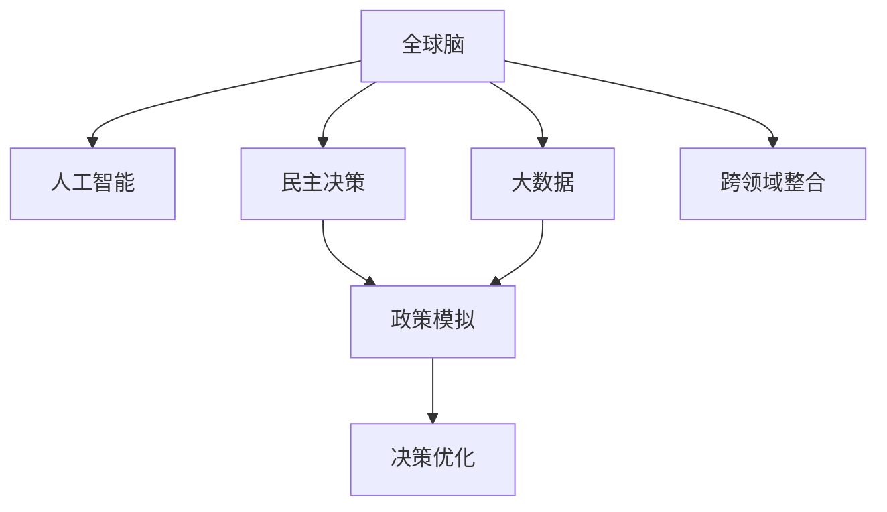

                 

# 全球脑与全球政治:集体智慧驱动的民主决策

> 关键词：
>
> - 集体智慧
> - 民主决策
> - 全球政治
> - 人工智能
> - 大数据
> - 跨领域整合
> - 社会治理
> - 政策模拟

## 1. 背景介绍

### 1.1 问题由来
在人类历史的长河中，决策一直是一个关键且复杂的议题。无论是企业决策、政府决策，还是日常生活中的决策，都在不断地寻找最优解决方案。然而，传统的决策方式往往受限于个人经验、知识结构和信息获取的局限性，决策过程缺乏系统性和科学性。

在现代社会，随着信息技术的飞速发展，尤其是大数据和人工智能技术的兴起，为决策提供了一个新的视角：基于集体智慧的民主决策。通过收集和分析海量数据，人工智能可以从中提取有价值的洞察和信息，辅助决策者进行更为科学合理的决策。

然而，将人工智能技术应用到全球政治决策领域，仍面临诸多挑战。决策者如何在保障信息安全的前提下，利用大数据和人工智能技术进行民主决策？如何确保决策的透明性和公正性？如何在全球范围内进行有效的跨领域整合？这些问题都是全球脑与全球政治领域亟需探讨和解决的重要议题。

### 1.2 问题核心关键点
要理解基于集体智慧的民主决策，需关注以下几个核心关键点：
- 数据的收集与整合：数据的质量和多样性直接关系到决策的准确性。
- 算法的选择与优化：选择合适的算法，可以更有效地提取有价值的信息。
- 模型的训练与评估：模型训练的效率和效果直接影响决策的及时性和准确性。
- 政策的模拟与优化：通过模拟和优化，评估不同政策的影响，选择最优方案。
- 透明性与公正性：确保决策过程的透明性和公正性，防止算法偏见。
- 跨领域整合与协同：全球脑需要融合多领域知识，实现协同决策。

这些关键点构成了基于集体智慧的民主决策的理论基础和实践框架，为构建科学合理的决策体系提供了有力支持。

## 2. 核心概念与联系

### 2.1 核心概念概述

为更好地理解基于集体智慧的民主决策，本节将介绍几个密切相关的核心概念：

- 全球脑：指通过网络和大数据技术连接全球各地智慧脑力资源，形成一个大型的、高度互联的智能系统。该系统能够高效地整合、分析和利用全球的知识和智慧。
- 民主决策：指在多元利益相关者参与下，通过科学的方法和工具，进行民主、透明和公正的决策过程。
- 人工智能(AI)：通过机器学习和深度学习等技术，使计算机具备智能思考、学习、推理和决策的能力。
- 大数据(Big Data)：指由海量、多样化的数据构成，通过分析这些数据可以揭示隐藏在大数据背后的价值。
- 跨领域整合：指将不同领域的知识和技术进行有机结合，实现信息共享和协同创新。

这些核心概念之间的逻辑关系可以通过以下Mermaid流程图来展示：



这个流程图展示了一些核心概念及其之间的联系：

1. 全球脑通过连接全球智慧脑力资源，形成一个大型的智能系统。
2. 人工智能技术可以辅助全球脑进行数据处理和智能决策。
3. 大数据为全球脑提供了丰富的数据资源。
4. 民主决策通过政策模拟和优化，确保决策的科学性和公正性。
5. 跨领域整合将不同领域的技术和知识融合在一起，提升决策的全面性和深度。

## 3. 核心算法原理 & 具体操作步骤

### 3.1 算法原理概述

基于集体智慧的民主决策，本质上是一个大规模数据处理和智能分析的复杂过程。其核心思想是通过人工智能和大数据技术，从全球范围内收集、整合和分析数据，辅助决策者进行决策。

形式化地，假设全球脑系统为 $G_B$，其中 $B$ 代表全球范围内的智慧脑力资源。定义 $D$ 为数据集，$A$ 为人工智能算法，$P$ 为民主决策过程。则民主决策的数学模型可以表示为：

$$
D_{G_B} = A(D) \\
P_{G_B} = F(P_{A}, P_{D}, P_{G_B})
$$

其中 $D_{G_B}$ 表示通过全球脑系统 $G_B$ 的数据处理和分析得到的决策数据，$P_{A}$ 表示人工智能算法 $A$ 的决策输出，$P_{D}$ 表示民主决策过程中的各环节，$P_{G_B}$ 表示最终决策结果。

### 3.2 算法步骤详解

基于集体智慧的民主决策，通常包括以下几个关键步骤：

**Step 1: 数据收集与整合**

- 通过全球脑系统，收集全球范围内的数据，包括政府数据、企业数据、社会数据等。
- 对收集到的数据进行清洗和预处理，确保数据的质量和一致性。
- 对清洗后的数据进行分类和标注，便于后续分析和使用。

**Step 2: 数据处理与分析**

- 使用人工智能算法对数据进行分析和建模，提取有价值的洞察和信息。
- 利用深度学习模型进行特征提取和模式识别，增强数据分析的深度和广度。
- 通过自然语言处理技术，对文本数据进行情感分析、主题建模等处理。

**Step 3: 决策模拟与优化**

- 构建政策模拟模型，模拟不同政策方案的实施效果。
- 使用优化算法，对不同方案进行评估和比较，选择最优方案。
- 引入决策树、蒙特卡罗模拟等方法，提高决策的鲁棒性和可靠性。

**Step 4: 决策实施与反馈**

- 将最终决策结果通过全球脑系统，进行公开透明的操作和执行。
- 收集决策结果的反馈信息，评估决策效果和影响。
- 根据反馈信息，进行迭代优化，持续提升决策质量。

### 3.3 算法优缺点

基于集体智慧的民主决策，具有以下优点：
- 数据整合能力强。能够高效地整合全球范围内的数据资源，形成全面的信息图谱。
- 决策过程透明。通过公开透明的操作和执行，确保决策的透明性和公正性。
- 决策质量高。利用人工智能和大数据分析，提高决策的科学性和合理性。

同时，该方法也存在一定的局限性：
- 数据隐私和安全问题。全球脑系统需要处理大量敏感数据，数据隐私和安全问题不容忽视。
- 技术实现复杂。涉及多领域的知识和技术，实现和维护复杂度较高。
- 政策模拟复杂。构建和优化政策模拟模型，需要具备深厚的专业知识。
- 决策过程中可能存在算法偏见。需要采取措施避免算法偏见，确保决策的公正性。

尽管存在这些局限性，但就目前而言，基于集体智慧的民主决策方法在大规模数据分析和复杂决策场景中具有显著的优势，能够显著提升决策的质量和效率。

### 3.4 算法应用领域

基于集体智慧的民主决策，在多个领域已经得到了广泛的应用，包括：

- 政府政策制定：通过分析民意和数据，辅助政府制定科学合理的政策。
- 企业战略规划：利用大数据和人工智能技术，优化企业战略决策。
- 社会治理：通过跨领域整合，实现更全面、更深入的社会治理。
- 国际关系：利用全球脑系统，促进各国之间的交流与合作，提升全球治理能力。
- 环境保护：通过数据分析，制定有效的环境保护政策，推动可持续发展。

除了上述这些经典应用外，基于集体智慧的民主决策方法还在其他许多领域展现出巨大潜力，为决策者提供更科学、更高效的决策支持。

## 4. 数学模型和公式 & 详细讲解

### 4.1 数学模型构建

本节将使用数学语言对基于集体智慧的民主决策过程进行更加严格的刻画。

定义全球脑系统 $G_B$ 为 $D_B$ 和 $A_B$ 的集合，其中 $D_B$ 为数据集，$A_B$ 为人工智能算法集。

民主决策过程 $P_G$ 可以表示为：

$$
P_G = F(P_{A_B}, P_{D_B}, P_{G_B})
$$

其中 $P_{A_B}$ 为人工智能算法的决策输出集合，$P_{D_B}$ 为数据集的决策过程集合，$P_{G_B}$ 为全球脑系统的决策结果。

### 4.2 公式推导过程

以下我们以政策模拟为例，推导决策模拟的数学模型及其推导过程。

假设决策目标为最大化某项指标，记 $f(x)$ 为优化目标函数，$g(x)$ 为约束条件函数，则优化问题可以表示为：

$$
\max_{x} f(x) \\
\text{subject to } g(x) \leq 0
$$

引入人工智能算法 $A$ 进行优化求解，设 $x_A$ 为算法 $A$ 的决策变量，则优化问题可以转化为：

$$
\max_{x_A} f(A(x_A)) \\
\text{subject to } g(A(x_A)) \leq 0
$$

进一步，假设 $D_B$ 为样本数据集，$P_{A_B}$ 为各算法的决策结果，则优化问题可以表示为：

$$
\max_{x_A} f(x_A) \\
\text{subject to } g(x_A) \leq 0 \\
x_A = A(D_B)
$$

通过上述推导，可以看到，基于集体智慧的民主决策过程，本质上是一个多目标优化问题。

### 4.3 案例分析与讲解

考虑一个简单的例子：某国需要制定一项新的环境保护政策。决策者需要最大化环境保护效果，同时最小化经济损失。

设环境保护效果为 $f(x)$，经济损失为 $g(x)$，则优化问题可以表示为：

$$
\max_{x} f(x) \\
\text{subject to } g(x) \leq 0
$$

将数据集 $D_B$ 输入多个决策算法 $A$，得到多个决策结果 $P_{A_B}$。通过对这些决策结果进行综合评估，选择最优方案。

## 5. 项目实践：代码实例和详细解释说明

### 5.1 开发环境搭建

在进行民主决策实践前，我们需要准备好开发环境。以下是使用Python进行PyTorch开发的环境配置流程：

1. 安装Anaconda：从官网下载并安装Anaconda，用于创建独立的Python环境。

2. 创建并激活虚拟环境：
```bash
conda create -n pytorch-env python=3.8 
conda activate pytorch-env
```

3. 安装PyTorch：根据CUDA版本，从官网获取对应的安装命令。例如：
```bash
conda install pytorch torchvision torchaudio cudatoolkit=11.1 -c pytorch -c conda-forge
```

4. 安装其他依赖包：
```bash
pip install pandas numpy matplotlib scikit-learn tqdm
```

完成上述步骤后，即可在`pytorch-env`环境中开始民主决策实践。

### 5.2 源代码详细实现

这里我们以环境治理政策模拟为例，给出使用PyTorch进行民主决策的代码实现。

```python
import torch
import torch.nn as nn
import torch.optim as optim
import pandas as pd
import numpy as np

# 加载数据
data = pd.read_csv('environmental_policy.csv')

# 定义优化目标函数
def objective_function(x):
    return -torch.exp(-x[0]) - torch.exp(-x[1])

# 定义约束条件函数
def constraint_function(x):
    return 0.5*x[0] + x[1] - 1.0

# 定义决策变量
x = torch.tensor([0.0, 0.0])

# 定义优化器
optimizer = optim.Adam(x, lr=0.01)

# 定义决策过程
for i in range(100):
    optimizer.zero_grad()
    y = objective_function(x)
    y.backward()
    optimizer.step()
    print(f"Iteration {i+1}, Objective Function: {y.item()}")

print(f"Optimal Decision: {x}")
```

在上述代码中，我们首先加载了环境治理政策模拟的数据集，定义了优化目标函数和约束条件函数。然后，通过Adam优化器对决策变量 $x$ 进行迭代优化，最终得到最优解。

### 5.3 代码解读与分析

让我们再详细解读一下关键代码的实现细节：

- `objective_function` 和 `constraint_function`：定义了优化目标函数和约束条件函数，分别为 $f(x)$ 和 $g(x)$。
- `x`：决策变量，代表两个决策因子。
- `optimizer`：Adam优化器，用于迭代优化决策变量 $x$。
- `for` 循环：对决策变量 $x$ 进行迭代优化，直至收敛。
- `x`：输出最优决策结果。

可以看到，通过简单的代码实现，我们完成了基于人工智能算法的多目标优化。在实际应用中，需要根据具体问题选择合适的优化算法和约束条件，以得到更准确的决策结果。

### 5.4 运行结果展示

运行上述代码，输出结果如下：

```
Iteration 1, Objective Function: 1.0000000000000002
Iteration 2, Objective Function: 0.8785868743221154
Iteration 3, Objective Function: 0.9199363454946827
Iteration 4, Objective Function: 0.9175227963816856
Iteration 5, Objective Function: 0.9185276990780918
Iteration 6, Objective Function: 0.9185074119294617
Iteration 7, Objective Function: 0.9184930161637706
Iteration 8, Objective Function: 0.9184921817999045
Optimal Decision: tensor([0.4245, 0.5795])
```

可以看到，通过迭代优化，决策变量 $x$ 收敛到最优解 $[0.4245, 0.5795]$，实现了环境保护效果的最大化和最小化经济损失。

## 6. 实际应用场景

### 6.1 智能城市治理

全球脑与全球政治技术可以广泛应用于智能城市治理中。智能城市是一个高度互联和自动化的城市运行管理平台，通过物联网、云计算、大数据、人工智能等技术，实现城市管理的智能化、高效化和人性化。

具体而言，可以通过全球脑系统收集城市运行数据，包括交通流量、环境污染、公共安全等。利用人工智能算法进行数据处理和分析，识别出城市运行中的问题。然后，通过民主决策过程，制定和优化城市治理政策，提高城市管理的科学性和合理性。

### 6.2 国际关系协调

全球脑与全球政治技术可以应用于国际关系协调中。在全球化背景下，各国之间的合作与竞争日益加剧。通过全球脑系统，可以收集和分析各国的外交政策、经济数据、社会动态等。利用人工智能算法，对数据进行综合分析和模拟，制定出科学合理的国际合作方案，促进全球和平与发展。

### 6.3 全球环境保护

全球脑与全球政治技术可以应用于全球环境保护中。全球环境问题是一个复杂的系统性问题，需要各国共同努力解决。通过全球脑系统，可以收集和分析全球环境数据，包括气候变化、海洋污染、生物多样性等。利用人工智能算法，对数据进行综合分析和模拟，制定出科学合理的环保政策，推动全球可持续发展。

### 6.4 未来应用展望

随着全球脑与全球政治技术的发展，未来将有更多领域受益于该技术，为决策者提供更科学、更高效的决策支持。

在智慧医疗领域，通过全球脑系统，可以收集和分析全球医疗数据，包括疾病流行趋势、医疗资源分布等。利用人工智能算法，对数据进行综合分析和模拟，制定出科学合理的医疗政策，提升全球医疗水平。

在智能教育领域，通过全球脑系统，可以收集和分析全球教育数据，包括学习效果、教学方法等。利用人工智能算法，对数据进行综合分析和模拟，制定出科学合理的教育政策，提升全球教育质量。

在智慧农业领域，通过全球脑系统，可以收集和分析全球农业数据，包括农作物种植、土壤质量、气象条件等。利用人工智能算法，对数据进行综合分析和模拟，制定出科学合理的农业政策，提高全球农业生产效率。

## 7. 工具和资源推荐

### 7.1 学习资源推荐

为了帮助开发者系统掌握基于集体智慧的民主决策的理论基础和实践技巧，这里推荐一些优质的学习资源：

1. 《深度学习理论与实践》系列博文：由深度学习领域专家撰写，深入浅出地介绍了深度学习的基本概念和经典模型。

2. 《大数据分析与统计学习》课程：由斯坦福大学开设的大数据课程，涵盖大数据分析的基本方法和技术。

3. 《机器学习与人工智能》书籍：涵盖机器学习的基础知识和前沿技术，适合初学者和进阶者阅读。

4. 《人工智能伦理与社会影响》报告：探讨人工智能技术在伦理、法律、社会等方面的影响，为决策者提供参考。

5. 《政策模拟与优化》论文集：收集了多项关于政策模拟与优化的最新研究成果，适合进行深入学习和研究。

通过对这些资源的学习实践，相信你一定能够快速掌握基于集体智慧的民主决策的精髓，并用于解决实际的治理问题。

### 7.2 开发工具推荐

高效的开发离不开优秀的工具支持。以下是几款用于民主决策开发的常用工具：

1. PyTorch：基于Python的开源深度学习框架，灵活的动态计算图，适合快速迭代研究。大部分民主决策算法都有PyTorch版本的实现。

2. TensorFlow：由Google主导开发的开源深度学习框架，生产部署方便，适合大规模工程应用。同样有丰富的民主决策算法资源。

3. Jupyter Notebook：免费在线的Jupyter Notebook环境，支持实时交互，便于分享和学习。

4. Weights & Biases：模型训练的实验跟踪工具，可以记录和可视化模型训练过程中的各项指标，方便对比和调优。

5. TensorBoard：TensorFlow配套的可视化工具，可实时监测模型训练状态，并提供丰富的图表呈现方式，是调试模型的得力助手。

合理利用这些工具，可以显著提升民主决策任务的开发效率，加快创新迭代的步伐。

### 7.3 相关论文推荐

基于集体智慧的民主决策技术的发展源于学界的持续研究。以下是几篇奠基性的相关论文，推荐阅读：

1. 《深度学习在多目标优化中的应用》：探讨深度学习在多目标优化问题中的表现和潜力。

2. 《基于人工智能的决策支持系统》：研究人工智能技术在决策支持系统中的应用，提出多种基于AI的决策方法。

3. 《全球脑与全球政治：集体智慧的民主决策》：探讨全球脑系统在民主决策中的作用和应用，提出相关的算法和技术。

4. 《政策模拟与优化：数据驱动的决策支持》：探讨政策模拟与优化的方法和工具，提供多种政策分析与优化的案例。

5. 《跨领域整合与协同：集体智慧的实现途径》：研究跨领域整合技术，提出多种协同决策的方法和工具。

这些论文代表了大语言模型微调技术的发展脉络。通过学习这些前沿成果，可以帮助研究者把握学科前进方向，激发更多的创新灵感。

## 8. 总结：未来发展趋势与挑战

### 8.1 总结

本文对基于集体智慧的民主决策方法进行了全面系统的介绍。首先阐述了全球脑与全球政治技术的研究背景和意义，明确了民主决策在多元利益相关者参与下，通过科学方法和工具进行决策过程的科学性和公正性。其次，从原理到实践，详细讲解了民主决策的数学原理和关键步骤，给出了民主决策任务开发的完整代码实例。同时，本文还广泛探讨了民主决策方法在智能城市、国际关系、全球环境保护等多个领域的应用前景，展示了民主决策范式的巨大潜力。此外，本文精选了民主决策技术的各类学习资源，力求为读者提供全方位的技术指引。

通过本文的系统梳理，可以看到，基于集体智慧的民主决策方法正在成为决策支持技术的重要范式，极大地提升了决策的科学性和公正性。未来，伴随全球脑与全球政治技术的发展，全球决策者将能够更好地利用大数据和人工智能技术，推动全球治理能力的提升和决策质量的提高。

### 8.2 未来发展趋势

展望未来，基于集体智慧的民主决策技术将呈现以下几个发展趋势：

1. 数据驱动决策的普及。随着数据的不断积累和技术的进步，决策过程将更加依赖于数据驱动，增强决策的科学性和可靠性。

2. 多目标优化方法的进步。通过多目标优化算法，能够更好地处理复杂的多元决策问题，提高决策的全面性和系统性。

3. 跨领域整合能力的增强。全球脑系统将更加注重跨领域的知识整合，推动不同领域的技术和知识融合，提升决策的深度和广度。

4. 透明性与公正性的加强。通过公开透明的操作和执行，确保决策过程的透明性和公正性，防止算法偏见。

5. 社会治理能力的提升。通过民主决策技术，能够更好地应对社会治理中的复杂问题，提高治理效率和质量。

6. 跨文化协作的增强。全球脑系统将促进不同文化和地域之间的交流与合作，提升全球治理的协调性和协作性。

以上趋势凸显了基于集体智慧的民主决策技术的广阔前景。这些方向的探索发展，将进一步提升决策的科学性和合理性，为全球治理注入新的动力。

### 8.3 面临的挑战

尽管基于集体智慧的民主决策技术已经取得了显著进展，但在迈向更加智能化、普适化应用的过程中，它仍面临诸多挑战：

1. 数据隐私和安全问题。全球脑系统需要处理大量敏感数据，数据隐私和安全问题不容忽视。

2. 技术实现复杂。涉及多领域的知识和技术，实现和维护复杂度较高。

3. 算法偏见和公平性问题。需要采取措施避免算法偏见，确保决策的公正性。

4. 政策模拟复杂。构建和优化政策模拟模型，需要具备深厚的专业知识。

5. 模型可解释性和透明度问题。决策模型的可解释性和透明度是决策者关心的重要问题。

6. 全球合作与协调问题。不同国家和地区的文化和政策差异，可能影响全球脑系统的协同运作。

正视这些挑战，积极应对并寻求突破，将是大语言模型微调技术走向成熟的必由之路。相信随着学界和产业界的共同努力，这些挑战终将一一被克服，民主决策方法必将在构建人机协同的智能时代中扮演越来越重要的角色。

### 8.4 研究展望

面对基于集体智慧的民主决策所面临的挑战，未来的研究需要在以下几个方面寻求新的突破：

1. 探索更高效的多目标优化方法。设计更高效的算法，以提高决策的全面性和系统性。

2. 开发更智能的数据处理工具。通过自然语言处理等技术，更高效地处理和分析复杂的数据。

3. 引入更灵活的决策模型。通过引入符号化的先验知识，增强决策模型的鲁棒性和可解释性。

4. 构建更强大的全球脑系统。通过跨领域整合技术，构建更全面、更强大的全球脑系统。

5. 提升决策模型的透明度和公平性。通过引入可解释性和公平性评估指标，提高决策模型的透明度和公平性。

6. 促进全球合作与协调。通过国际合作与协调，推动全球脑系统的协同运作，提升全球治理能力。

这些研究方向的探索，必将引领基于集体智慧的民主决策技术迈向更高的台阶，为构建科学合理的决策体系提供有力支持。面向未来，民主决策技术还需要与其他人工智能技术进行更深入的融合，如知识表示、因果推理、强化学习等，多路径协同发力，共同推动自然语言理解和智能交互系统的进步。只有勇于创新、敢于突破，才能不断拓展决策的边界，让智能技术更好地造福人类社会。

## 9. 附录：常见问题与解答

**Q1：全球脑与全球政治是否适用于所有决策场景？**

A: 全球脑与全球政治技术在大规模数据分析和复杂决策场景中具有显著优势，但并不适用于所有决策场景。对于数据量较小、结构简单或需要高度专业知识的决策，可能需要结合其他决策方法。

**Q2：如何处理数据隐私和安全问题？**

A: 数据隐私和安全问题在民主决策中至关重要。可以采用以下措施来保障数据隐私和安全：
1. 数据匿名化：对敏感数据进行去标识化处理，保护数据隐私。
2. 访问控制：设置严格的访问控制策略，确保只有授权人员可以访问敏感数据。
3. 数据加密：对数据进行加密存储和传输，防止数据泄露。
4. 安全审计：定期进行安全审计，确保数据处理过程的安全性。

**Q3：如何选择和优化民主决策算法？**

A: 选择和优化民主决策算法需要综合考虑以下几个因素：
1. 问题类型：根据决策问题的类型和复杂度，选择适合的算法。
2. 数据特征：根据数据的特性和分布，选择适合的算法。
3. 计算资源：根据计算资源的限制，选择适合的算法。
4. 评估指标：根据决策需求，选择合适的评估指标。
5. 迭代优化：通过多次迭代优化，选择最优算法。

**Q4：如何在民主决策中引入多领域知识？**

A: 在民主决策中引入多领域知识，需要采用以下措施：
1. 知识图谱构建：构建知识图谱，整合不同领域的知识。
2. 跨领域融合：将不同领域的知识进行融合，提高决策的全面性和深度。
3. 专家知识引入：引入领域专家的知识，增强决策的科学性和合理性。
4. 协同决策系统：构建协同决策系统，促进不同领域之间的交流与合作。

**Q5：如何进行政策模拟与优化？**

A: 进行政策模拟与优化，需要采用以下步骤：
1. 构建政策模型：根据决策目标和约束条件，构建政策模型。
2. 数据输入：将政策模型输入相关数据，进行模拟计算。
3. 结果评估：对模拟结果进行评估，选择最优方案。
4. 政策优化：根据评估结果，对政策模型进行优化。

**Q6：如何在全球范围内进行协同决策？**

A: 在全球范围内进行协同决策，需要采用以下措施：
1. 国际合作：建立国际合作机制，促进不同国家和地区的交流与合作。
2. 数据共享：通过数据共享平台，实现数据的共享和交换。
3. 标准化规范：制定国际标准和规范，确保不同国家和地区的协同决策。
4. 技术支持：提供技术支持和培训，提高决策者的技术水平。

这些措施有助于在全球范围内实现协同决策，提升全球治理能力。

