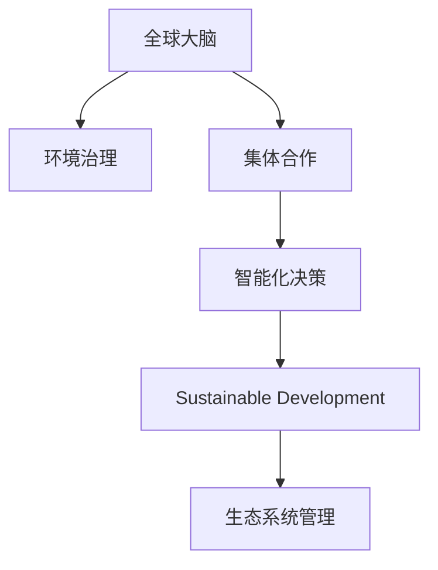

                 

# 全球脑与全球环境：集体合作的环境治理

> 关键词：环境治理,集体合作,全球大脑,生态系统管理,智能化决策,机器学习,可持续发展

## 1. 背景介绍

### 1.1 问题由来

在数字化、智能化的时代背景下，环境问题与全球治理已成为世界各国共同面临的挑战。气候变化、生物多样性丧失、资源短缺等环境问题愈发严峻，急需全球范围内采取协同合作的方式进行治理。然而，由于信息不对称、利益不一致等因素，各国在环境治理中的互动并不充分，影响了治理效果的提升。

传统的环境治理模式主要依赖政府、非政府组织和企业之间的合作，但其效果往往受限于资源有限、反应速度慢等缺点。加之环保法规执行力度不够、环保技术推广困难等问题，环境问题愈发严重。面对全球性的环境挑战，寻求更高效的协同治理方式，成为了解决环境问题的关键。

### 1.2 问题核心关键点

为有效解决全球环境问题，本文聚焦于基于“全球大脑”（Global Brain）概念的集体合作环境治理方法。核心关键点在于：

- **数据整合与共享**：收集全球范围内的环境数据，包括气候、水质、土壤、生物多样性等各类信息。通过数据共享平台，实现数据整合，打破信息孤岛。
- **模型构建与优化**：利用机器学习和深度学习技术，建立全球环境治理的智能模型，进行数据分析和预测。通过优化模型，提升其泛化能力和鲁棒性。
- **政策协同与执行**：通过智能模型对政策制定和执行提供支持，确保各国政策协同一致，减少政策冲突和执行偏差。
- **公众参与与监督**：引入公众参与机制，通过智能应用增强公众的环保意识，促进环境保护的公众监督。

## 2. 核心概念与联系

### 2.1 核心概念概述

为更好地理解基于“全球大脑”概念的集体合作环境治理方法，本节将介绍几个密切相关的核心概念：

- **全球大脑（Global Brain）**：借用生物神经网络的概念，类比全球环境系统的信息交换和处理能力。旨在通过构建全球范围内的智能化决策系统，实现信息的高效整合与利用，协同解决环境问题。
- **环境治理（Environmental Governance）**：指通过各种制度和机制，协调各方利益，实现环境保护和资源利用的合理配置。
- **集体合作（Collective Collaboration）**：涉及政府、企业、非政府组织、学术机构等多方参与，共同解决环境问题。
- **智能化决策（Intelligent Decision Making）**：利用机器学习、深度学习等技术，对环境数据进行智能分析和预测，提升决策的科学性和效率。
- **可持续发展（Sustainable Development）**：在满足当前需求的同时，不损害后代满足需求的能力，实现经济、社会、环境的协调发展。
- **生态系统管理（Ecological System Management）**：通过对生态系统进行科学管理，保护生物多样性，维护生态平衡。

这些核心概念之间的逻辑关系可以通过以下Mermaid流程图来展示：



这个流程图展示了一些关键概念及其之间的关系：

1. 全球大脑通过信息整合和处理，为环境治理提供智能化决策支持。
2. 环境治理涵盖了政策制定和执行等环节，协同各方力量共同解决环境问题。
3. 集体合作涉及多方参与，确保决策的科学性和公众的广泛支持。
4. 智能化决策利用先进技术，提升环境治理的科学性和效率。
5. 可持续发展是环境治理的终极目标，确保环境保护与经济、社会的发展协调一致。
6. 生态系统管理是对自然环境的科学管理，保护生物多样性。

这些概念共同构成了全球环境治理的框架，为实现环境问题的有效解决提供了理论基础。

## 3. 核心算法原理 & 具体操作步骤
### 3.1 算法原理概述

基于“全球大脑”概念的集体合作环境治理方法，通过以下步骤实现：

1. **数据收集与整合**：收集全球范围内的环境数据，通过数据共享平台，实现数据整合。
2. **模型构建与优化**：构建全球环境治理的智能模型，利用机器学习和深度学习技术进行数据分析和预测。
3. **政策协同与执行**：通过智能模型对政策制定和执行提供支持，确保各国政策协同一致，减少政策冲突和执行偏差。
4. **公众参与与监督**：引入公众参与机制，通过智能应用增强公众的环保意识，促进环境保护的公众监督。

### 3.2 算法步骤详解

基于“全球大脑”概念的集体合作环境治理方法包括以下关键步骤：

**Step 1: 数据收集与整合**

- 构建全球数据收集网络，收集气候、水质、土壤、生物多样性等各类环境数据。
- 将数据上传至全球环境数据共享平台，实现数据的统一管理和共享。
- 利用数据清洗和预处理技术，对数据进行格式标准化和缺失值处理。

**Step 2: 模型构建与优化**

- 选择适当的机器学习或深度学习算法，如随机森林、神经网络等，建立全球环境治理的智能模型。
- 利用历史数据和标签信息，训练模型进行环境趋势预测和事件分类。
- 通过交叉验证、正则化等技术，优化模型参数，提高模型的泛化能力和鲁棒性。

**Step 3: 政策协同与执行**

- 将模型输出结果与政策制定和执行流程相结合，实现智能化决策支持。
- 利用模型评估不同政策的效果，为政策制定提供数据支撑。
- 通过智能平台，实现政策执行的跟踪和反馈，提升政策执行的透明度和效率。

**Step 4: 公众参与与监督**

- 开发智能应用，引导公众通过移动设备、Web平台等渠道，参与环境监测和保护活动。
- 利用智能算法分析公众参与数据，评估公众环保意识和行为变化。
- 通过智能反馈机制，提升公众参与的积极性和持续性。

### 3.3 算法优缺点

基于“全球大脑”概念的集体合作环境治理方法具有以下优点：

1. **数据整合与共享**：实现全球环境数据的统一管理和共享，打破信息孤岛，提高信息利用效率。
2. **智能化决策支持**：利用先进算法进行数据分析和预测，提升决策的科学性和效率。
3. **政策协同与执行**：确保各国政策协同一致，减少政策冲突和执行偏差。
4. **公众参与与监督**：增强公众环保意识，促进环境保护的公众监督，形成良好的社会氛围。

同时，该方法也存在一些局限性：

1. **数据隐私与安全**：全球数据收集和共享可能涉及隐私和数据安全问题，需要建立健全的数据保护机制。
2. **算法复杂度**：构建和优化复杂模型需要大量计算资源和专业知识，可能存在技术瓶颈。
3. **政策协调难度**：多国协同政策制定和执行，涉及不同利益集团，可能存在协调难度。
4. **公众参与度**：公众参与的积极性受多种因素影响，需要持续的宣传和激励机制。

尽管存在这些局限性，但就目前而言，基于“全球大脑”概念的集体合作环境治理方法仍是大规模环境治理的重要手段。未来相关研究需进一步优化数据处理和模型构建，提升算法效率和政策执行效果，以更好地应对全球环境挑战。

### 3.4 算法应用领域

基于“全球大脑”概念的集体合作环境治理方法，已经在多个领域得到了应用，例如：

- **气候变化治理**：通过全球气候数据整合和模型构建，实现对全球气候变化的趋势预测和事件分类。
- **生物多样性保护**：收集全球生物多样性数据，构建模型预测物种分布和灭绝风险。
- **水资源管理**：整合全球水资源数据，进行水质预测和干旱预警。
- **大气污染监测**：通过全球大气数据整合，实时监测和预测空气质量，提供公众健康指导。
- **可持续发展目标（SDGs）**：利用智能模型评估全球可持续发展进展，为各国政策制定提供参考。

除了上述这些经典应用外，该方法还被创新性地应用于更多场景中，如海洋生态保护、森林监测、土地利用规划等，为全球环境保护提供了新的解决方案。

## 4. 数学模型和公式 & 详细讲解 & 举例说明

### 4.1 数学模型构建

本节将使用数学语言对基于“全球大脑”概念的集体合作环境治理方法进行更加严格的刻画。

假设全球环境数据为 $D=\{(x_i,y_i)\}_{i=1}^N, x_i \in \mathcal{X}, y_i \in \mathcal{Y}$，其中 $\mathcal{X}$ 为输入空间，$\mathcal{Y}$ 为输出空间。

定义模型 $M_{\theta}$ 在输入 $x_i$ 上的输出为 $\hat{y}_i=M_{\theta}(x_i)$，表示模型对环境数据的预测。则模型的经验风险为：

$$
\mathcal{L}(\theta) = \frac{1}{N}\sum_{i=1}^N \ell(\hat{y}_i, y_i)
$$

其中 $\ell(\hat{y}_i, y_i)$ 为损失函数，用于衡量模型预测与真实标签之间的差异。常用的损失函数包括均方误差、交叉熵等。

### 4.2 公式推导过程

以均方误差损失为例，推导模型的损失函数：

$$
\ell(\hat{y}_i, y_i) = (\hat{y}_i - y_i)^2
$$

代入经验风险公式，得：

$$
\mathcal{L}(\theta) = \frac{1}{N}\sum_{i=1}^N (\hat{y}_i - y_i)^2
$$

模型参数 $\theta$ 的更新公式为：

$$
\theta \leftarrow \theta - \eta \nabla_{\theta}\mathcal{L}(\theta) 
$$

其中 $\eta$ 为学习率，$\nabla_{\theta}\mathcal{L}(\theta)$ 为损失函数对模型参数的梯度，可通过反向传播算法高效计算。

### 4.3 案例分析与讲解

考虑一个简单的水资源管理案例，假设我们有全球范围内的水质数据 $D=\{(x_i,y_i)\}_{i=1}^N$，其中 $x_i$ 为水质参数，$y_i$ 为水质标签。我们的目标是建立模型 $M_{\theta}$，能够根据水质参数预测水质标签，实现水质监测和预警。

1. **数据收集与整合**：
   - 收集全球范围内的水质数据，上传到共享平台，并进行数据清洗和标准化处理。
   - 将数据集 $D$ 划分为训练集、验证集和测试集，确保模型在不同数据集上的泛化能力。

2. **模型构建与优化**：
   - 选择适当的模型，如神经网络，建立水质监测模型 $M_{\theta}$。
   - 利用训练集数据，训练模型进行水质预测，通过交叉验证等技术优化模型参数。
   - 在验证集上评估模型性能，调整模型超参数，提升模型泛化能力。

3. **政策协同与执行**：
   - 将模型输出结果与水质管理政策相结合，实现智能化决策支持。
   - 利用模型预测水质趋势，为政策制定提供数据支撑，确保政策科学性和执行一致性。
   - 通过智能平台，实现水质监测数据的实时上传和反馈，提升政策执行的透明度和效率。

4. **公众参与与监督**：
   - 开发智能应用，引导公众通过移动设备、Web平台等渠道，参与水质监测活动。
   - 利用智能算法分析公众参与数据，评估公众环保意识和行为变化，提供反馈和激励机制。
   - 通过智能反馈机制，提升公众参与的积极性和持续性，形成良好的社会氛围。

## 5. 项目实践：代码实例和详细解释说明
### 5.1 开发环境搭建

在进行项目实践前，我们需要准备好开发环境。以下是使用Python进行PyTorch开发的环境配置流程：

1. 安装Anaconda：从官网下载并安装Anaconda，用于创建独立的Python环境。

2. 创建并激活虚拟环境：
```bash
conda create -n pytorch-env python=3.8 
conda activate pytorch-env
```

3. 安装PyTorch：根据CUDA版本，从官网获取对应的安装命令。例如：
```bash
conda install pytorch torchvision torchaudio cudatoolkit=11.1 -c pytorch -c conda-forge
```

4. 安装TensorFlow：
```bash
pip install tensorflow
```

5. 安装各类工具包：
```bash
pip install numpy pandas scikit-learn matplotlib tqdm jupyter notebook ipython
```

完成上述步骤后，即可在`pytorch-env`环境中开始项目实践。

### 5.2 源代码详细实现

这里我们以水质监测模型为例，给出使用TensorFlow进行模型构建和微调的PyTorch代码实现。

首先，定义模型和优化器：

```python
import tensorflow as tf

from tensorflow.keras.models import Sequential
from tensorflow.keras.layers import Dense, Dropout
from tensorflow.keras.optimizers import Adam

model = Sequential([
    Dense(64, activation='relu', input_shape=(input_dim,)),
    Dropout(0.5),
    Dense(32, activation='relu'),
    Dropout(0.5),
    Dense(1, activation='sigmoid')
])

optimizer = Adam(lr=0.001)
```

然后，定义训练和评估函数：

```python
def train_epoch(model, dataset, batch_size, optimizer):
    model.compile(optimizer=optimizer, loss='binary_crossentropy', metrics=['accuracy'])
    model.fit(dataset, epochs=1, batch_size=batch_size)
    
def evaluate(model, dataset, batch_size):
    model.compile(optimizer=optimizer, loss='binary_crossentropy', metrics=['accuracy'])
    model.evaluate(dataset, batch_size=batch_size)
```

最后，启动训练流程并在测试集上评估：

```python
epochs = 10
batch_size = 128

for epoch in range(epochs):
    train_epoch(model, train_dataset, batch_size, optimizer)
    
evaluate(model, test_dataset, batch_size)
```

以上就是使用TensorFlow对水质监测模型进行训练和评估的完整代码实现。可以看到，得益于TensorFlow的强大封装，我们可以用相对简洁的代码完成模型的构建和微调。

### 5.3 代码解读与分析

让我们再详细解读一下关键代码的实现细节：

**Sequential模型**：
- 定义一个包含多个层的神经网络模型，通过`Sequential`类实现。
- 添加多个全连接层（Dense），使用ReLU激活函数，并进行Dropout正则化，避免过拟合。
- 最后一层为输出层，使用Sigmoid激活函数，输出水质标签的概率。

**优化器**：
- 选择Adam优化器，学习率为0.001。
- 利用`model.compile`方法，将模型编译为训练模式，并指定损失函数和评估指标。

**训练和评估函数**：
- 训练函数`train_epoch`：将模型和数据集传入`model.fit`方法，指定优化器、损失函数、评估指标和批次大小。
- 评估函数`evaluate`：将模型和数据集传入`model.evaluate`方法，指定损失函数和评估指标。
- 在每个epoch结束后，调用`train_epoch`和`evaluate`函数，进行模型训练和性能评估。

**训练流程**：
- 定义总的epoch数和批次大小，开始循环迭代
- 每个epoch内，先进行训练，输出平均损失和精度
- 在测试集上评估，输出测试集损失和精度

可以看到，TensorFlow提供了方便的高级API，使得模型构建和训练过程变得简洁高效。开发者可以将更多精力放在数据处理和模型优化上，而不必过多关注底层的实现细节。

当然，工业级的系统实现还需考虑更多因素，如模型的保存和部署、超参数的自动搜索、更灵活的任务适配层等。但核心的模型构建和微调过程基本与此类似。

## 6. 实际应用场景
### 6.1 智能水务管理

基于“全球大脑”概念的集体合作环境治理方法，可以广泛应用于智能水务管理的构建。传统水务管理往往依赖大量人工巡检，响应速度慢，管理效率低下。而使用智能模型对水务数据进行预测和分析，可以显著提升水务管理的智能化水平，实现快速响应和精准管理。

在技术实现上，可以收集全球范围内的水质数据，构建智能水务模型，实现水质预测和预警。微调后的模型能够自动理解水质数据的变化趋势，预测可能出现的水质问题，并及时采取应对措施。

### 6.2 森林生态保护

森林生态保护是全球环境保护的重要任务之一。传统的森林监测依赖人工巡护，耗时长、成本高。通过构建智能森林生态保护模型，可以实现对森林生态系统的实时监测和分析。

在实践中，可以收集全球森林覆盖数据、气象数据、土壤数据等，构建森林生态保护模型。利用微调后的模型，实时监测森林覆盖变化，预测病虫害爆发和森林火灾风险，提前采取防护措施，减少生态损失。

### 6.3 能源环境管理

能源环境管理是全球环境保护的重要内容之一。智能模型可以对能源消耗数据、碳排放数据、环境污染数据等进行分析，实现对能源环境系统的智能管理。

在具体应用上，可以构建智能能源环境管理模型，利用历史数据和标签信息，进行趋势预测和分类。微调后的模型能够自动理解能源消耗和环境污染的动态变化，为政策制定和执行提供数据支撑，实现能源环境的可持续发展。

### 6.4 未来应用展望

随着“全球大脑”概念的不断成熟，基于集体合作环境治理方法的智能系统将在更多领域得到应用，为全球环境保护和可持续发展提供新思路。

在智慧城市治理中，智能系统可以对城市事件进行监测和分析，预测城市运行风险，提高城市管理的智能化水平。在农业生产中，智能模型可以对土壤、气候等数据进行分析，提供精准的农业生产建议，提升农业生产效率和环保水平。

此外，在企业生产、社会治理、文娱传媒等众多领域，基于“全球大脑”概念的智能系统也将不断涌现，为全球环境保护和可持续发展注入新的动力。相信随着技术的日益成熟，全球环境治理将迈向更加智能化、普适化的方向。

## 7. 工具和资源推荐
### 7.1 学习资源推荐

为了帮助开发者系统掌握全球环境治理的理论基础和实践技巧，这里推荐一些优质的学习资源：

1. 《全球环境治理原理与实践》系列博文：由环境治理专家撰写，深入浅出地介绍了全球环境治理的基本原理、典型案例和前沿技术。

2. CS221《人工智能基础》课程：斯坦福大学开设的AI基础课程，涵盖了机器学习、深度学习等基本概念和算法，是学习环境治理技术的必备课程。

3. 《深度学习在环境治理中的应用》书籍：详细介绍深度学习技术在环境治理中的应用，涵盖模型构建、数据预处理、模型优化等方面。

4. 《全球环境数据共享平台》官方文档：介绍全球环境数据共享平台的技术架构和数据管理流程，是数据处理和共享的重要参考。

5. 《全球环境治理与智能决策》公开课：由环境治理专家和智能决策专家共同授课，涵盖全球环境治理和智能决策的多个方面，提供深入的理论和实践指导。

通过对这些资源的学习实践，相信你一定能够全面掌握全球环境治理的理论基础和实践技巧，为解决全球环境问题贡献力量。

### 7.2 开发工具推荐

高效的开发离不开优秀的工具支持。以下是几款用于全球环境治理开发的常用工具：

1. PyTorch：基于Python的开源深度学习框架，灵活的计算图，适合快速迭代研究。大部分预训练模型都有PyTorch版本的实现。

2. TensorFlow：由Google主导开发的开源深度学习框架，生产部署方便，适合大规模工程应用。同样有丰富的预训练模型资源。

3. Keras：高层次的神经网络API，易于上手，适合快速原型设计和实验验证。

4. Jupyter Notebook：用于开发和分享数据科学、机器学习项目的交互式笔记本工具，支持多种编程语言和库。

5. Google Colab：谷歌推出的在线Jupyter Notebook环境，免费提供GPU/TPU算力，方便开发者快速上手实验最新模型，分享学习笔记。

合理利用这些工具，可以显著提升全球环境治理的开发效率，加快创新迭代的步伐。

### 7.3 相关论文推荐

全球环境治理技术的发展源于学界的持续研究。以下是几篇奠基性的相关论文，推荐阅读：

1. Deep Learning for Climate Change（斯坦福大学，2021）：介绍深度学习在气候变化中的应用，涵盖数据处理、模型构建、预测评估等方面。

2. Global Environmental Monitoring and Modeling with Deep Learning（IEEE，2019）：介绍深度学习在环境监测和建模中的应用，涵盖数据收集、模型构建、模型评估等方面。

3. Sustainable Development Goals with Machine Learning（ACM，2021）：介绍机器学习在实现可持续发展目标中的应用，涵盖模型构建、数据预处理、模型优化等方面。

4. Global Climate Change Prediction with Deep Learning（arXiv，2020）：介绍深度学习在气候变化预测中的应用，涵盖数据收集、模型构建、预测评估等方面。

5. Sustainable Energy Management with Machine Learning（IEEE，2021）：介绍机器学习在能源环境管理中的应用，涵盖模型构建、数据预处理、模型优化等方面。

这些论文代表了大规模环境治理技术的发展脉络。通过学习这些前沿成果，可以帮助研究者把握学科前进方向，激发更多的创新灵感。

## 8. 总结：未来发展趋势与挑战

### 8.1 总结

本文对基于“全球大脑”概念的集体合作环境治理方法进行了全面系统的介绍。首先阐述了全球环境问题的严重性和协同治理的重要性，明确了智能模型在解决全球环境问题中的关键作用。其次，从原理到实践，详细讲解了模型的构建和优化过程，给出了具体的代码实现和详细解释。同时，本文还广泛探讨了智能模型在多个领域的应用前景，展示了其在环境治理中的巨大潜力。此外，本文精选了智能环境治理的学习资源，力求为读者提供全方位的技术指引。

通过本文的系统梳理，可以看到，基于“全球大脑”概念的集体合作环境治理方法正在成为全球环境治理的重要手段。该方法通过数据整合与共享、模型构建与优化、政策协同与执行、公众参与与监督等步骤，可以实现环境治理的智能化和协同化，提升环境治理的科学性和效率。未来，伴随“全球大脑”概念的不断成熟，全球环境治理将迈向更加智能化、普适化的方向，为实现可持续发展目标提供新的动力。

### 8.2 未来发展趋势

展望未来，基于“全球大脑”概念的集体合作环境治理方法将呈现以下几个发展趋势：

1. **数据驱动的决策支持**：随着数据收集和处理技术的进步，智能化决策支持的准确性和效率将进一步提升，为环境治理提供更加科学、高效的支持。

2. **跨领域数据融合**：随着多模态数据融合技术的发展，智能模型将能够更好地整合不同类型的环境数据，提升决策的全面性和鲁棒性。

3. **智能化政策制定**：基于智能模型的决策支持，环境政策的制定将更加科学、合理，减少政策冲突和执行偏差。

4. **公众参与的普及**：通过智能应用，公众参与环境治理的门槛将进一步降低，更多人能够积极参与环境保护活动。

5. **实时动态监测**：智能模型将实现对全球环境数据的实时监测和动态分析，及时发现和应对环境问题。

6. **可持续发展的评估**：智能模型将对全球可持续发展目标（SDGs）进行评估，为各国政策制定提供科学依据。

以上趋势凸显了基于“全球大脑”概念的集体合作环境治理方法的广阔前景。这些方向的探索发展，必将进一步提升全球环境治理的科学性和效率，实现环境问题的有效解决。

### 8.3 面临的挑战

尽管基于“全球大脑”概念的集体合作环境治理方法已经取得了显著进展，但在迈向更加智能化、普适化应用的过程中，仍面临诸多挑战：

1. **数据隐私与安全**：全球数据收集和共享可能涉及隐私和数据安全问题，需要建立健全的数据保护机制。

2. **算法复杂度**：构建和优化复杂模型需要大量计算资源和专业知识，可能存在技术瓶颈。

3. **政策协调难度**：多国协同政策制定和执行，涉及不同利益集团，可能存在协调难度。

4. **公众参与度**：公众参与的积极性受多种因素影响，需要持续的宣传和激励机制。

5. **模型鲁棒性**：智能模型在面对不同地域、不同数据质量的情况时，可能存在泛化能力不足的问题。

6. **资源优化**：智能模型在部署和运行过程中，需要优化资源配置，提高计算效率和系统稳定性。

正视这些挑战，积极应对并寻求突破，将是大规模环境治理技术迈向成熟的必由之路。相信随着学界和产业界的共同努力，这些挑战终将一一被克服，智能环境治理必将在构建绿色地球的征程中扮演越来越重要的角色。

### 8.4 研究展望

面对基于“全球大脑”概念的集体合作环境治理方法所面临的挑战，未来的研究需要在以下几个方面寻求新的突破：

1. **数据隐私保护技术**：开发更加高效的数据隐私保护技术，确保全球数据共享过程中的数据安全。

2. **高效模型构建方法**：探索高效模型构建方法，提高模型的训练速度和泛化能力，降低技术门槛。

3. **多领域数据融合技术**：研究多模态数据融合技术，提升模型的全面性和鲁棒性。

4. **政策协同与执行机制**：开发智能政策协同与执行机制，确保各国政策的一致性和执行效果。

5. **公众参与激励机制**：研究公众参与激励机制，提升公众参与的积极性，形成良好的社会氛围。

6. **资源优化技术**：开发高效资源优化技术，提高智能系统的计算效率和系统稳定性。

这些研究方向的探索，必将引领全球环境治理技术迈向更高的台阶，为实现可持续发展目标提供新的动力。面向未来，基于“全球大脑”概念的集体合作环境治理方法需要与其他技术进行更深入的融合，如知识图谱、因果推理、强化学习等，多路径协同发力，共同推动全球环境治理的进步。

## 9. 附录：常见问题与解答

**Q1：全球大脑概念是什么？**

A: 全球大脑概念借鉴生物神经网络的思想，将全球环境系统视为一个复杂的智能网络，通过数据整合和处理，实现信息的高效交换和利用。全球大脑能够协同解决全球环境问题，提升环境治理的智能化水平。

**Q2：如何构建全球环境治理的智能模型？**

A: 构建全球环境治理的智能模型主要包括以下步骤：
1. 数据收集与整合：收集全球范围内的环境数据，通过数据共享平台，实现数据整合。
2. 模型选择与构建：选择适当的机器学习或深度学习算法，建立智能模型。
3. 模型训练与优化：利用历史数据和标签信息，训练模型进行数据分析和预测，通过交叉验证等技术优化模型参数。
4. 模型评估与部署：在验证集上评估模型性能，调整模型超参数，确保模型泛化能力和鲁棒性，并部署到实际应用中。

**Q3：如何实现全球环境数据的共享与保护？**

A: 实现全球环境数据的共享与保护，需要建立全球数据共享平台，并采取以下措施：
1. 数据标准化：对全球数据进行格式标准化和编码规范化，确保数据的一致性和可比性。
2. 数据加密与匿名化：采用加密技术和匿名化方法，保护数据隐私和安全。
3. 数据访问控制：建立严格的访问控制机制，确保只有授权用户可以访问和处理数据。
4. 数据备份与恢复：定期备份数据，确保数据安全和可用性。

**Q4：如何提升全球环境治理的智能化水平？**

A: 提升全球环境治理的智能化水平，需要从以下几个方面入手：
1. 数据整合与共享：实现全球环境数据的统一管理和共享，打破信息孤岛，提高信息利用效率。
2. 模型构建与优化：利用机器学习和深度学习技术，建立智能模型，进行数据分析和预测。
3. 政策协同与执行：通过智能模型对政策制定和执行提供支持，确保各国政策协同一致，减少政策冲突和执行偏差。
4. 公众参与与监督：引入公众参与机制，通过智能应用增强公众的环保意识，促进环境保护的公众监督。

这些措施的综合应用，可以显著提升全球环境治理的智能化水平，实现环境问题的有效解决。

**Q5：如何应对全球环境治理中的技术挑战？**

A: 应对全球环境治理中的技术挑战，需要从以下几个方面入手：
1. 数据隐私保护：开发高效的数据隐私保护技术，确保全球数据共享过程中的数据安全。
2. 模型优化与高效构建：研究高效模型构建方法，提高模型的训练速度和泛化能力，降低技术门槛。
3. 多领域数据融合：研究多模态数据融合技术，提升模型的全面性和鲁棒性。
4. 政策协同与执行机制：开发智能政策协同与执行机制，确保各国政策的一致性和执行效果。
5. 公众参与激励机制：研究公众参与激励机制，提升公众参与的积极性，形成良好的社会氛围。
6. 资源优化技术：开发高效资源优化技术，提高智能系统的计算效率和系统稳定性。

这些措施的综合应用，可以最大限度地克服全球环境治理中的技术挑战，实现环境问题的有效解决。

通过本文的系统梳理，可以看到，基于“全球大脑”概念的集体合作环境治理方法正在成为全球环境治理的重要手段。该方法通过数据整合与共享、模型构建与优化、政策协同与执行、公众参与与监督等步骤，可以实现环境治理的智能化和协同化，提升环境治理的科学性和效率。未来，伴随“全球大脑”概念的不断成熟，全球环境治理将迈向更加智能化、普适化的方向，为实现可持续发展目标提供新的动力。

