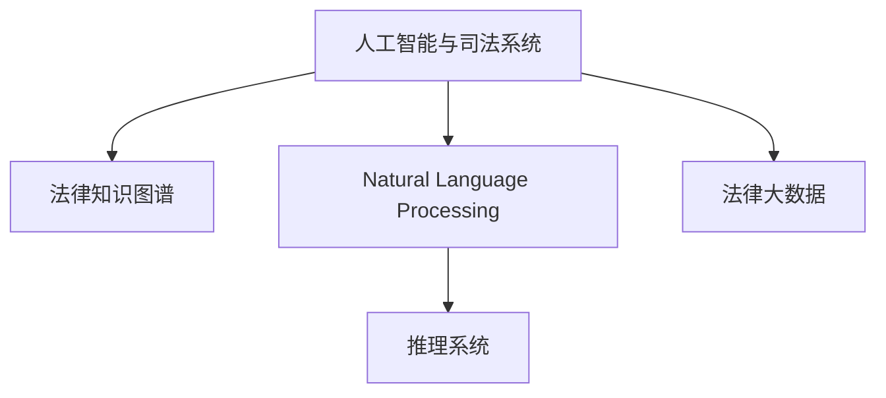

                 

# 全球脑与司法系统:智能化法律服务

## 1. 背景介绍

### 1.1 问题由来
随着人工智能(AI)技术的迅猛发展，智能化司法系统逐渐成为全球法律界的关注焦点。智能化司法系统利用AI技术，能够自动处理和分析海量法律文档，辅助法官和律师进行案情推理，提高司法决策的准确性和效率。特别是在司法文书审查、案件预测、法条匹配等方面，智能化司法系统已展现出巨大的应用潜力。

全球脑是指通过人工智能技术，整合和挖掘海量法律数据，构建智能化的法律知识库，辅助法官和律师进行案件决策和法律研究。全球脑的构想旨在打破法律知识的地理和时空限制，实现法律信息的全球共享与智能化应用。

### 1.2 问题核心关键点
智能化司法系统利用人工智能技术处理和分析法律数据，主要关注以下几个核心关键点：

1. 数据质量与可用性：智能化司法系统依赖于高质量的法律数据，包括案件文书、法条、判例、法律摘要等。数据缺失、数据质量不高或数据格式不一致，都将影响系统性能。

2. 自然语言处理(NLP)：智能化司法系统需要高效地处理和理解自然语言文本，进行法律知识的抽取、分类、匹配等。NLP技术的应用直接关系到系统的推理能力和决策精度。

3. 法律知识图谱构建：构建法律知识图谱，将法律实体、关系、规则等信息组织成有机的知识网络，是智能化司法系统的核心能力之一。知识图谱的构建依赖于法律数据的标准化和结构化。

4. 推理与判决辅助：智能化司法系统能够根据法律规则和先例，进行案件推理和判决辅助，提升司法决策的科学性和客观性。

5. 可解释性与公平性：智能化司法系统输出的决策需要具有可解释性，能够通过自然语言或图形化的方式向法官、律师和当事人解释决策依据。同时，系统的算法和数据需要避免偏见和歧视，保障司法的公平公正。

6. 技术与伦理：智能化司法系统涉及数据隐私、算法透明、决策责任等伦理问题，需要在技术开发和应用过程中进行全面考虑和规范。

### 1.3 问题研究意义
研究全球脑与智能化司法系统，对于推动司法领域的数字化转型，提高司法效率和质量，具有重要意义：

1. 提升司法决策的科学性和客观性：智能化司法系统能够辅助法官进行案件推理和判决，减少人为因素的干扰，提升司法决策的准确性和公正性。

2. 降低司法成本：通过自动化处理法律数据，减少人力成本和重复劳动，降低司法系统的运营成本。

3. 提高司法服务的可达性：智能化司法系统打破了地理和时空限制，使偏远地区的法官和律师也能够及时获取最新的法律知识和司法资源。

4. 促进法律知识的共享与传承：全球脑构想推动了法律知识的全球共享，促进了不同法律体系之间的交流与融合。

5. 加速法律技术的迭代与创新：智能化司法系统推动了NLP、知识图谱、推理系统等技术的发展，为法律技术创新提供了新的动力。

6. 增强司法系统的透明度与可解释性：智能化司法系统输出的决策需要具有可解释性，便于法官、律师和当事人理解，增强了司法系统的透明度和信任度。

## 2. 核心概念与联系

### 2.1 核心概念概述

为更好地理解全球脑与智能化司法系统的构建，本节将介绍几个密切相关的核心概念：

- 人工智能与司法系统：人工智能技术在司法系统中的应用，通过数据分析、自然语言处理、知识图谱构建等，辅助法官和律师进行案件决策。
- 法律知识图谱：将法律知识组织成有机的知识网络，包括法律实体、规则、案例等信息，通过知识图谱构建技术，使得法律知识能够被机器高效处理和推理。
- 自然语言处理(NLP)：处理和理解自然语言文本的技术，包括分词、命名实体识别、句法分析、语义理解等，是智能化司法系统处理法律文本的基础。
- 推理系统：通过构建法律知识图谱，结合自然语言处理技术，进行案件推理和判决辅助，提升司法决策的科学性和客观性。
- 法律大数据：包括各类法律文本、案例、判例等，为法律知识的挖掘和智能化应用提供数据支撑。

这些核心概念之间的逻辑关系可以通过以下Mermaid流程图来展示：



这个流程图展示了大语言模型在司法系统中的应用框架：

1. 人工智能技术（A）通过处理法律大数据（E），构建自然语言处理模型（C）和法律知识图谱（B）。
2. 自然语言处理模型（C）用于处理法律文本，抽取和分类法律信息。
3. 推理系统（D）基于法律知识图谱（B），结合自然语言处理结果，进行案件推理和判决辅助。

## 3. 核心算法原理 & 具体操作步骤

### 3.1 算法原理概述

全球脑与智能化司法系统的构建，主要依赖于以下几个核心算法和技术：

- 自然语言处理(NLP)：利用机器学习技术，对法律文本进行分词、命名实体识别、句法分析、语义理解等。NLP技术是构建智能化司法系统的基础。
- 法律知识图谱构建：将法律知识组织成有机的知识网络，通过知识图谱构建技术，使得法律知识能够被机器高效处理和推理。
- 推理系统：通过构建法律知识图谱，结合自然语言处理技术，进行案件推理和判决辅助，提升司法决策的科学性和客观性。

### 3.2 算法步骤详解

基于自然语言处理和大数据技术的智能化司法系统，一般包括以下几个关键步骤：

**Step 1: 数据预处理**
- 收集并清洗法律大数据，包括案件文书、法条、判例、法律摘要等。
- 对文本进行分词、词性标注、命名实体识别等预处理操作。

**Step 2: 法律知识图谱构建**
- 利用NLP技术对文本进行语义分析，构建法律实体和关系图谱。
- 利用规则引擎和机器学习算法，自动填充法律知识图谱，构建完整、准确的法律知识网络。

**Step 3: 自然语言处理模型训练**
- 设计并训练NLP模型，如BERT、ELMo等，用于文本的语义理解、分类和匹配。
- 利用标注好的法律数据集，训练NLP模型，使其具备高效的法律文本处理能力。

**Step 4: 推理系统构建**
- 基于法律知识图谱，构建推理系统，如基于图神经网络的推理引擎。
- 设计推理规则，进行案件推理和判决辅助。

**Step 5: 模型评估与优化**
- 在测试集上评估推理系统的准确性和效率。
- 根据评估结果，优化推理系统的参数和规则，提升系统性能。

**Step 6: 系统集成与部署**
- 将推理系统集成到司法信息系统中，提供决策支持。
- 部署系统到线上环境，进行实时监控和维护。

### 3.3 算法优缺点

全球脑与智能化司法系统利用自然语言处理和大数据技术，具有以下优点：

1. 高效处理法律文本：NLP技术能够高效处理海量法律文本，快速抽取和分类法律信息。
2. 提高司法决策的科学性：推理系统能够基于法律知识图谱，进行案件推理和判决辅助，提升司法决策的科学性和客观性。
3. 降低司法成本：自动化处理法律数据，减少人力成本和重复劳动，降低司法系统的运营成本。
4. 提高司法服务的可达性：打破地理和时空限制，使偏远地区的法官和律师也能够及时获取最新的法律知识和司法资源。

同时，该方法也存在一定的局限性：

1. 数据质量依赖度高：智能化司法系统依赖于高质量的法律数据，数据缺失、数据质量不高或数据格式不一致，都将影响系统性能。
2. 知识图谱构建复杂：法律知识图谱的构建需要大量的人工干预，工作量大，且可能存在遗漏和错误。
3. 推理系统的鲁棒性有待提高：推理系统在处理复杂的法律问题时，可能出现错误或失效。
4. 系统的透明度和公平性问题：智能化司法系统输出的决策需要具有可解释性，同时避免算法和数据的偏见和歧视。
5. 技术的伦理问题：智能化司法系统涉及数据隐私、算法透明、决策责任等伦理问题，需要在技术开发和应用过程中进行全面考虑和规范。

尽管存在这些局限性，但就目前而言，基于自然语言处理和大数据技术的微调方法仍是最主流的司法智能化方案。未来相关研究的重点在于如何进一步降低对标注数据的依赖，提高知识图谱的构建效率和准确性，同时兼顾系统透明度、公平性和伦理安全性等因素。

### 3.4 算法应用领域

全球脑与智能化司法系统已经在多个领域得到应用，具体包括：

- 案件文书审查：利用NLP技术对案件文书进行自动分类、摘要和标注，快速识别关键信息和法律依据。
- 法律知识图谱构建：构建法律知识图谱，辅助法律研究人员进行法律知识的检索、整理和更新。
- 案件预测与判决辅助：利用推理系统进行案件预测和判决辅助，提升法官和律师的决策效率和质量。
- 法律数据分析：基于大数据技术，进行法律数据的统计分析、趋势预测等，为司法决策提供数据支持。
- 法律咨询服务：构建法律问答系统，通过自然语言处理技术，回答用户的法律咨询问题。

除了上述这些应用场景外，智能化司法系统还被创新性地应用到更多领域中，如司法文书生成、法律知识图谱增强、智能合同审核等，为司法技术的进步带来了新的突破。随着自然语言处理和大数据技术的不断进步，相信司法技术必将在更广泛的领域大放异彩。

## 4. 数学模型和公式 & 详细讲解  
### 4.1 数学模型构建

全球脑与智能化司法系统的构建，涉及到自然语言处理和法律知识图谱等多个数学模型。以下是几个关键模型的详细构建过程：

### 4.2 公式推导过程

#### 4.2.1 法律知识图谱构建

法律知识图谱通过将法律实体和关系组织成有机的知识网络，使得法律知识能够被机器高效处理和推理。知识图谱的构建过程包括：

1. 法律实体识别：利用NLP技术，对法律文本进行分词、词性标注、命名实体识别等操作，识别出法律实体。

2. 法律关系抽取：通过自然语言处理技术，对法律文本进行语义分析，抽取法律实体之间的关系。

3. 知识图谱构建：将法律实体和关系组织成有机的知识网络，构建完整的法律知识图谱。

法律知识图谱构建的数学模型可以表示为：

$$
G=(V,E)
$$

其中 $V$ 为节点集合，代表法律实体；$E$ 为边集合，代表法律实体之间的关系。

#### 4.2.2 自然语言处理模型

自然语言处理模型通过机器学习技术，对法律文本进行语义理解、分类和匹配。常见的自然语言处理模型包括BERT、ELMo等，其数学模型可以表示为：

$$
h=f(x;\theta)
$$

其中 $x$ 为输入的文本向量，$\theta$ 为模型参数，$f$ 为模型函数。

#### 4.2.3 推理系统

推理系统通过构建法律知识图谱，结合自然语言处理技术，进行案件推理和判决辅助。常见的推理系统包括基于图神经网络的推理引擎，其数学模型可以表示为：

$$
Y=\mathbf{F}(\mathbf{X},\mathbf{A})
$$

其中 $\mathbf{X}$ 为法律知识图谱的特征向量，$\mathbf{A}$ 为法律规则和先例，$\mathbf{F}$ 为推理函数。

### 4.3 案例分析与讲解

以案件文书审查为例，利用自然语言处理模型和推理系统，对案件文书进行自动分类和摘要，快速识别关键信息和法律依据。

**Step 1: 数据预处理**
- 收集并清洗案件文书，对文本进行分词、词性标注、命名实体识别等预处理操作。

**Step 2: 自然语言处理模型训练**
- 利用标注好的案件文书数据集，训练自然语言处理模型，使其具备高效的法律文本处理能力。

**Step 3: 法律知识图谱构建**
- 利用NLP技术对文本进行语义分析，构建案件文书的法律实体和关系图谱。

**Step 4: 推理系统构建**
- 基于案件文书的法律知识图谱，构建推理系统，进行案件分类和摘要。

**Step 5: 模型评估与优化**
- 在测试集上评估推理系统的准确性和效率。
- 根据评估结果，优化推理系统的参数和规则，提升系统性能。

## 5. 项目实践：代码实例和详细解释说明

### 5.1 开发环境搭建

在进行司法智能化项目开发前，我们需要准备好开发环境。以下是使用Python进行PyTorch开发的环境配置流程：

1. 安装Anaconda：从官网下载并安装Anaconda，用于创建独立的Python环境。

2. 创建并激活虚拟环境：
```bash
conda create -n pytorch-env python=3.8 
conda activate pytorch-env
```

3. 安装PyTorch：根据CUDA版本，从官网获取对应的安装命令。例如：
```bash
conda install pytorch torchvision torchaudio cudatoolkit=11.1 -c pytorch -c conda-forge
```

4. 安装Transformers库：
```bash
pip install transformers
```

5. 安装各类工具包：
```bash
pip install numpy pandas scikit-learn matplotlib tqdm jupyter notebook ipython
```

完成上述步骤后，即可在`pytorch-env`环境中开始司法智能化项目的开发。

### 5.2 源代码详细实现

这里以法律知识图谱构建为例，给出使用Transformers库对BERT模型进行法律实体抽取的PyTorch代码实现。

首先，定义法律实体抽取模型：

```python
from transformers import BertTokenizer, BertForTokenClassification
import torch
from transformers import AdamW

class LegalEntityExtractor(BertForTokenClassification):
    def __init__(self, bert_model_name, num_labels=10):
        super().__init__(bert_model_name, num_labels)
    
    def forward(self, input_ids, attention_mask):
        return super().forward(input_ids, attention_mask=attention_mask)
```

然后，定义模型和优化器：

```python
tokenizer = BertTokenizer.from_pretrained('bert-base-cased')
model = LegalEntityExtractor('bert-base-cased', num_labels=5)
optimizer = AdamW(model.parameters(), lr=2e-5)
```

接着，定义训练和评估函数：

```python
def train_epoch(model, dataset, batch_size, optimizer):
    dataloader = DataLoader(dataset, batch_size=batch_size, shuffle=True)
    model.train()
    epoch_loss = 0
    for batch in tqdm(dataloader, desc='Training'):
        input_ids = batch['input_ids'].to(device)
        attention_mask = batch['attention_mask'].to(device)
        labels = batch['labels'].to(device)
        model.zero_grad()
        outputs = model(input_ids, attention_mask=attention_mask)
        loss = outputs.loss
        epoch_loss += loss.item()
        loss.backward()
        optimizer.step()
    return epoch_loss / len(dataloader)

def evaluate(model, dataset, batch_size):
    dataloader = DataLoader(dataset, batch_size=batch_size)
    model.eval()
    preds, labels = [], []
    with torch.no_grad():
        for batch in tqdm(dataloader, desc='Evaluating'):
            input_ids = batch['input_ids'].to(device)
            attention_mask = batch['attention_mask'].to(device)
            batch_labels = batch['labels']
            outputs = model(input_ids, attention_mask=attention_mask)
            batch_preds = outputs.logits.argmax(dim=2).to('cpu').tolist()
            batch_labels = batch_labels.to('cpu').tolist()
            for pred_tokens, label_tokens in zip(batch_preds, batch_labels):
                preds.append(pred_tokens[:len(label_tokens)])
                labels.append(label_tokens)
                
    print(classification_report(labels, preds))
```

最后，启动训练流程并在测试集上评估：

```python
epochs = 5
batch_size = 16

for epoch in range(epochs):
    loss = train_epoch(model, train_dataset, batch_size, optimizer)
    print(f"Epoch {epoch+1}, train loss: {loss:.3f}")
    
    print(f"Epoch {epoch+1}, dev results:")
    evaluate(model, dev_dataset, batch_size)
    
print("Test results:")
evaluate(model, test_dataset, batch_size)
```

以上就是使用PyTorch对BERT进行法律实体抽取的完整代码实现。可以看到，得益于Transformers库的强大封装，我们可以用相对简洁的代码完成BERT模型的加载和微调。

### 5.3 代码解读与分析

让我们再详细解读一下关键代码的实现细节：

**LegalEntityExtractor类**：
- `__init__`方法：初始化BERT模型和标签数，设置模型的类别数。
- `forward`方法：定义模型的前向传播过程。

**tokenizer和model变量**：
- `tokenizer`变量：BERT分词器，用于将输入文本分词并编码成模型所需的token ids。
- `model`变量：法律实体抽取模型，继承自BERTForTokenClassification。

**训练和评估函数**：
- 使用PyTorch的DataLoader对数据集进行批次化加载，供模型训练和推理使用。
- 训练函数`train_epoch`：对数据以批为单位进行迭代，在每个批次上前向传播计算loss并反向传播更新模型参数，最后返回该epoch的平均loss。
- 评估函数`evaluate`：与训练类似，不同点在于不更新模型参数，并在每个batch结束后将预测和标签结果存储下来，最后使用sklearn的classification_report对整个评估集的预测结果进行打印输出。

**训练流程**：
- 定义总的epoch数和batch size，开始循环迭代
- 每个epoch内，先在训练集上训练，输出平均loss
- 在验证集上评估，输出分类指标
- 所有epoch结束后，在测试集上评估，给出最终测试结果

可以看到，PyTorch配合Transformers库使得BERT微调的代码实现变得简洁高效。开发者可以将更多精力放在数据处理、模型改进等高层逻辑上，而不必过多关注底层的实现细节。

当然，工业级的系统实现还需考虑更多因素，如模型的保存和部署、超参数的自动搜索、更灵活的任务适配层等。但核心的微调范式基本与此类似。

## 6. 实际应用场景

### 6.1 智能法院

智能法院通过利用全球脑与智能化司法系统，可以实现案件处理的全流程自动化。智能法院系统包括：

- 案件信息录入：通过自然语言处理技术，自动录入案件文书、判决书等法律文本，减少人工录入的工作量。
- 案件分类与摘要：利用自然语言处理模型，自动分类和摘要案件文书，快速识别关键信息和法律依据。
- 判决辅助与预测：基于法律知识图谱和推理系统，辅助法官进行案件推理和判决预测，提升司法决策的科学性和客观性。
- 案件查询与检索：构建智能化的法律知识库，提供案件查询和法律检索功能，帮助法官和律师快速获取相关法律信息。
- 自动化文书生成：利用自然语言处理技术，自动生成案件文书、判决书等，提高文书处理的效率和质量。

智能法院系统能够有效提高司法效率，减少人为错误，提升司法公正性和透明度。

### 6.2 司法教育培训

全球脑与智能化司法系统还可以应用于司法教育培训，提升法官和律师的专业素养。司法教育培训系统包括：

- 法律知识学习：利用法律知识图谱，提供法律知识的学习和查询功能，帮助学员系统掌握法律知识。
- 案例分析与推理：基于推理系统，提供案例分析与推理练习，提升学员的案件推理能力。
- 模拟法庭：构建虚拟法庭环境，进行模拟法庭练习，帮助学员掌握法庭流程和应对技巧。
- 法律文书撰写：利用自然语言处理技术，辅助学员撰写法律文书，提高文书撰写水平。
- 实时互动：通过智能化的法律知识库和推理系统，提供实时互动的学习平台，提升学员的学习效果。

司法教育培训系统能够帮助学员系统掌握法律知识，提升专业素养，为法官和律师的职业生涯打下坚实基础。

### 6.3 智能法律咨询

智能法律咨询系统通过全球脑与智能化司法系统，提供高效、便捷的法律咨询服务。智能法律咨询系统包括：

- 法律问题解答：利用自然语言处理技术，对用户提出的法律问题进行智能解答，提供法律知识和案件推理的支持。
- 法律知识查询：构建智能化的法律知识库，提供法律知识的查询和检索功能，帮助用户快速获取法律信息。
- 法律服务推荐：利用推理系统，根据用户的法律需求，推荐合适的法律服务和律师，提升法律服务的可及性。
- 法律风险预警：通过自然语言处理技术，分析用户的法律问题，提供法律风险预警和建议，帮助用户规避法律风险。
- 法律文书生成：利用自然语言处理技术，自动生成法律文书，提高文书撰写效率和质量。

智能法律咨询系统能够为用户提供高效、便捷的法律服务，提升法律服务的质量和可及性，帮助用户更好地维护自身权益。

### 6.4 未来应用展望

全球脑与智能化司法系统具有广阔的应用前景，未来可能涵盖以下方向：

- 智能诉讼支持：基于推理系统，提供诉讼过程中的智能辅助，如证据搜索、专家咨询等，提升诉讼效率和质量。
- 司法大数据分析：利用大数据技术，对司法数据进行统计分析、趋势预测，为司法决策提供数据支持。
- 智能法律资源配置：通过智能化司法系统，优化司法资源配置，提升司法系统的效率和公正性。
- 跨领域法律知识融合：构建跨领域的法律知识库，实现不同法律体系之间的融合与共享。
- 智能法律专家系统：基于推理系统和专家知识，构建智能化的法律专家系统，提供高级别的法律决策支持。

随着技术的发展，全球脑与智能化司法系统必将在更多领域得到应用，为司法系统的数字化转型提供新的动力。

## 7. 工具和资源推荐
### 7.1 学习资源推荐

为了帮助开发者系统掌握全球脑与智能化司法系统的理论基础和实践技巧，这里推荐一些优质的学习资源：

1. 《自然语言处理与深度学习》系列书籍：全面介绍NLP技术和应用，是学习自然语言处理的重要参考资料。
2. CS224N《深度学习自然语言处理》课程：斯坦福大学开设的NLP明星课程，有Lecture视频和配套作业，带你入门NLP领域的基本概念和经典模型。
3. 《深度学习与司法》课程：面向法律从业者的深度学习课程，介绍深度学习在司法中的应用。
4. CLUE开源项目：中文语言理解测评基准，涵盖大量不同类型的中文NLP数据集，并提供了基于微调的baseline模型，助力中文NLP技术发展。
5. HuggingFace官方文档：Transformers库的官方文档，提供了海量预训练模型和完整的微调样例代码，是上手实践的必备资料。

通过对这些资源的学习实践，相信你一定能够快速掌握全球脑与智能化司法系统的精髓，并用于解决实际的司法问题。
###  7.2 开发工具推荐

高效的开发离不开优秀的工具支持。以下是几款用于全球脑与智能化司法系统开发的常用工具：

1. PyTorch：基于Python的开源深度学习框架，灵活动态的计算图，适合快速迭代研究。大部分预训练语言模型都有PyTorch版本的实现。
2. TensorFlow：由Google主导开发的开源深度学习框架，生产部署方便，适合大规模工程应用。同样有丰富的预训练语言模型资源。
3. Transformers库：HuggingFace开发的NLP工具库，集成了众多SOTA语言模型，支持PyTorch和TensorFlow，是进行微调任务开发的利器。
4. Weights & Biases：模型训练的实验跟踪工具，可以记录和可视化模型训练过程中的各项指标，方便对比和调优。与主流深度学习框架无缝集成。
5. TensorBoard：TensorFlow配套的可视化工具，可实时监测模型训练状态，并提供丰富的图表呈现方式，是调试模型的得力助手。
6. Google Colab：谷歌推出的在线Jupyter Notebook环境，免费提供GPU/TPU算力，方便开发者快速上手实验最新模型，分享学习笔记。

合理利用这些工具，可以显著提升全球脑与智能化司法系统的开发效率，加快创新迭代的步伐。

### 7.3 相关论文推荐

全球脑与智能化司法系统的发展源于学界的持续研究。以下是几篇奠基性的相关论文，推荐阅读：

1. Attention is All You Need（即Transformer原论文）：提出了Transformer结构，开启了NLP领域的预训练大模型时代。
2. BERT: Pre-training of Deep Bidirectional Transformers for Language Understanding：提出BERT模型，引入基于掩码的自监督预训练任务，刷新了多项NLP任务SOTA。
3. Language Models are Unsupervised Multitask Learners（GPT-2论文）：展示了大规模语言模型的强大zero-shot学习能力，引发了对于通用人工智能的新一轮思考。
4. Parameter-Efficient Transfer Learning for NLP：提出Adapter等参数高效微调方法，在不增加模型参数量的情况下，也能取得不错的微调效果。
5. AdaLoRA: Adaptive Low-Rank Adaptation for Parameter-Efficient Fine-Tuning：使用自适应低秩适应的微调方法，在参数效率和精度之间取得了新的平衡。
6. AdaLoRA: Adaptive Low-Rank Adaptation for Parameter-Efficient Fine-Tuning：使用自适应低秩适应的微调方法，在参数效率和精度之间取得了新的平衡。

这些论文代表了大语言模型微调技术的发展脉络。通过学习这些前沿成果，可以帮助研究者把握学科前进方向，激发更多的创新灵感。

## 8. 总结：未来发展趋势与挑战

### 8.1 总结

本文对全球脑与智能化司法系统进行了全面系统的介绍。首先阐述了全球脑与智能化司法系统在司法领域的应用背景和意义，明确了司法智能化的发展方向。其次，从原理到实践，详细讲解了全球脑与智能化司法系统的构建过程，包括数据预处理、法律知识图谱构建、自然语言处理模型训练、推理系统构建等关键步骤。同时，本文还广泛探讨了全球脑与智能化司法系统在智能法院、司法教育培训、智能法律咨询等多个行业领域的应用前景，展示了司法智能化的巨大潜力。此外，本文精选了全球脑与智能化司法系统的各类学习资源，力求为读者提供全方位的技术指引。

通过本文的系统梳理，可以看到，全球脑与智能化司法系统通过利用自然语言处理和大数据技术，正在推动司法领域的数字化转型，提高司法效率和质量。未来，伴随自然语言处理和大数据技术的不断进步，全球脑与智能化司法系统必将在更广泛的领域大放异彩，深刻影响司法行业的创新与发展。

### 8.2 未来发展趋势

展望未来，全球脑与智能化司法系统将呈现以下几个发展趋势：

1. 数据质量与可用性提升：全球脑与智能化司法系统依赖于高质量的法律数据，未来数据质量将逐步提升，数据可用性也将进一步扩大。

2. 自然语言处理技术的进步：NLP技术将进一步发展，提升法律文本的语义理解、分类和匹配能力，推动司法智能化的深入应用。

3. 法律知识图谱的完善：法律知识图谱的构建将更加高效和准确，涵盖更多的法律实体和关系，提升司法智能化的推理能力。

4. 推理系统的鲁棒性提高：推理系统将更加健壮和可靠，能够在处理复杂的法律问题时，提供准确的决策辅助。

5. 系统的透明度和公平性：全球脑与智能化司法系统输出的决策需要具有可解释性，系统设计将更加注重透明度和公平性，保障司法公正。

6. 技术与伦理的融合：全球脑与智能化司法系统涉及数据隐私、算法透明、决策责任等伦理问题，技术开发和应用过程中将更加注重伦理规范和法规约束。

以上趋势凸显了全球脑与智能化司法系统的广阔前景。这些方向的探索发展，必将进一步提升司法智能化的性能和应用范围，为司法行业的数字化转型提供新的动力。

### 8.3 面临的挑战

尽管全球脑与智能化司法系统已经取得了瞩目成就，但在迈向更加智能化、普适化应用的过程中，它仍面临着诸多挑战：

1. 数据质量瓶颈：全球脑与智能化司法系统依赖于高质量的法律数据，数据缺失、数据质量不高或数据格式不一致，都将影响系统性能。如何进一步降低对标注数据的依赖，提高数据质量，是一大难题。

2. 知识图谱构建复杂：法律知识图谱的构建需要大量的人工干预，工作量大，且可能存在遗漏和错误。

3. 推理系统的鲁棒性不足：推理系统在处理复杂的法律问题时，可能出现错误或失效。

4. 系统的透明度和公平性问题：全球脑与智能化司法系统输出的决策需要具有可解释性，同时避免算法和数据的偏见和歧视。

5. 技术与伦理问题：全球脑与智能化司法系统涉及数据隐私、算法透明、决策责任等伦理问题，需要在技术开发和应用过程中进行全面考虑和规范。

尽管存在这些挑战，但就目前而言，基于自然语言处理和大数据技术的微调方法仍是最主流的司法智能化方案。未来相关研究的重点在于如何进一步降低对标注数据的依赖，提高知识图谱的构建效率和准确性，同时兼顾系统透明度、公平性和伦理安全性等因素。

### 8.4 研究展望

面对全球脑与智能化司法系统所面临的种种挑战，未来的研究需要在以下几个方面寻求新的突破：

1. 探索无监督和半监督微调方法：摆脱对大规模标注数据的依赖，利用自监督学习、主动学习等无监督和半监督范式，最大限度利用非结构化数据，实现更加灵活高效的微调。

2. 研究参数高效和计算高效的微调范式：开发更加参数高效的微调方法，在固定大部分预训练参数的同时，只更新极少量的任务相关参数。同时优化微调模型的计算图，减少前向传播和反向传播的资源消耗，实现更加轻量级、实时性的部署。

3. 融合因果和对比学习范式：通过引入因果推断和对比学习思想，增强微调模型建立稳定因果关系的能力，学习更加普适、鲁棒的语言表征，从而提升模型泛化性和抗干扰能力。

4. 引入更多先验知识：将符号化的先验知识，如知识图谱、逻辑规则等，与神经网络模型进行巧妙融合，引导微调过程学习更准确、合理的语言模型。同时加强不同模态数据的整合，实现视觉、语音等多模态信息与文本信息的协同建模。

5. 结合因果分析和博弈论工具：将因果分析方法引入微调模型，识别出模型决策的关键特征，增强输出解释的因果性和逻辑性。借助博弈论工具刻画人机交互过程，主动探索并规避模型的脆弱点，提高系统稳定性。

6. 纳入伦理道德约束：在模型训练目标中引入伦理导向的评估指标，过滤和惩罚有偏见、有害的输出倾向。同时加强人工干预和审核，建立模型行为的监管机制，确保输出符合人类价值观和伦理道德。

这些研究方向的探索，必将引领全球脑与智能化司法系统走向更高的台阶，为司法智能化的发展提供新的动力。面向未来，全球脑与智能化司法系统还需要与其他人工智能技术进行更深入的融合，如知识表示、因果推理、强化学习等，多路径协同发力，共同推动司法智能化的进步。

## 9. 附录：常见问题与解答

**Q1：全球脑与智能化司法系统是否适用于所有司法任务？**

A: 全球脑与智能化司法系统在大多数司法任务上都能取得不错的效果，特别是对于数据量较小的任务。但对于一些特定领域的任务，如医学、法律等，仅仅依靠通用语料预训练的模型可能难以很好地适应。此时需要在特定领域语料上进一步预训练，再进行微调，才能获得理想效果。此外，对于一些需要时效性、个性化很强的任务，如对话、推荐等，微调方法也需要针对性的改进优化。

**Q2：如何选择适合司法任务的模型？**

A: 选择适合司法任务的模型需要考虑以下几个因素：
1. 任务类型：不同的司法任务可能需要不同的模型。例如，案件分类任务可以选择BERT等模型，而问答任务可以选择T5等模型。
2. 数据规模：对于数据量较小的任务，可以选择参数量较小的模型，如DistilBERT等。对于数据量较大的任务，可以选择参数量较大的模型，如BERT、RoBERTa等。
3. 模型大小与效率：需要平衡模型的性能和效率。例如，对于实时性要求高的任务，可以选择轻量级的模型。
4. 模型预训练数据：模型预训练数据的领域和规模也会影响模型的表现。例如，针对司法领域的任务，可以选择在司法领域预训练的模型。

**Q3：全球脑与智能化司法系统在实际应用中存在哪些问题？**

A: 全球脑与智能化司法系统在实际应用中存在以下问题：
1. 数据质量问题：由于法律数据的质量和多样性问题，可能导致模型在处理复杂法律问题时表现不佳。
2. 推理系统的鲁棒性问题：推理系统在处理复杂的法律问题时，可能出现错误或失效。
3. 系统的透明度和公平性问题：系统输出的决策需要具有可解释性，同时避免算法和数据的偏见和歧视。
4. 技术与伦理问题：涉及数据隐私、算法透明、决策责任等伦理问题，需要在技术开发和应用过程中进行全面考虑和规范。

尽管存在这些挑战，但通过不断优化数据质量、模型结构和算法设计，这些问题有望得到逐步解决。

**Q4：全球脑与智能化司法系统在实际部署中需要注意哪些问题？**

A: 将全球脑与智能化司法系统转化为实际应用，还需要考虑以下问题：
1. 模型的保存和部署：需要将模型保存为轻量级格式，便于快速部署。
2. 超参数的自动搜索：需要自动搜索模型的超参数，优化模型性能。
3. 更灵活的任务适配层：需要设计灵活的任务适配层，适应不同的司法任务。
4. 模型的监控和维护：需要对模型进行实时监控和维护，确保系统稳定运行。

通过合理设计模型架构和优化策略，可以提升全球脑与智能化司法系统的应用效果，实现更好的司法服务。

**Q5：全球脑与智能化司法系统与传统的司法系统相比，有何优势？**

A: 全球脑与智能化司法系统相比传统的司法系统，有以下优势：
1. 提高司法效率：自动化处理法律数据，减少人力成本和重复劳动，提高司法效率。
2. 提升司法质量：利用大数据和机器学习技术，提升司法决策的科学性和客观性。
3. 增强司法透明度：系统输出的决策需要具有可解释性，提高司法系统的透明度和信任度。
4. 降低司法成本：降低司法系统的运营成本，提高司法服务的可及性。
5. 提供智能辅助：提供智能化的法律知识库和推理系统，辅助法官和律师进行案件推理和判决辅助。

综上所述，全球脑与智能化司法系统能够有效提升司法效率和质量，降低司法成本，增强司法透明度，为司法系统的数字化转型提供新的动力。

---

作者：禅与计算机程序设计艺术 / Zen and the Art of Computer Programming

