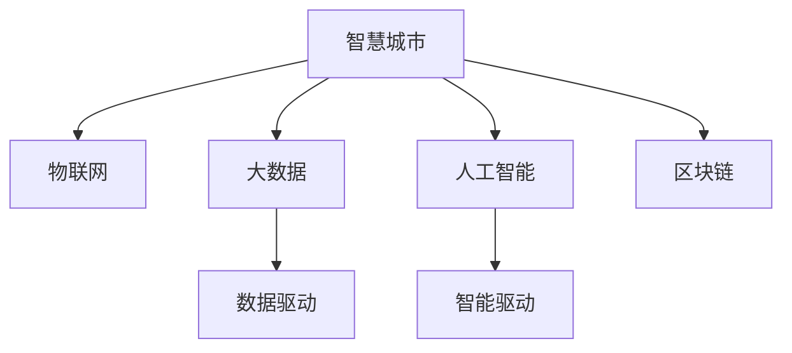

                 

# 全球脑与城市规划:智慧城市的终极形态

> 关键词：全球脑、智慧城市、城市规划、智能基础设施、数据驱动、可持续城市、未来城市形态

## 1. 背景介绍

### 1.1 问题由来
随着全球化进程的加速和技术的飞速发展，智慧城市建设已经成为了各国政府和城市管理者共同追求的目标。智慧城市不仅强调科技手段的应用，更是对城市发展模式的一种深刻变革。在全球范围内，智慧城市的建设正从传统的数据驱动向智能驱动转变，从局部优化向全局协同转变。这其中，“全球脑”概念的提出，为智慧城市建设提供了一个全新的视角。

### 1.2 问题核心关键点
“全球脑”是指通过构建全球范围内的城市数据共享网络，实现信息、资源、服务的互联互通，形成具有智能学习能力的全球网络系统。智慧城市的建设，正是要通过“全球脑”这一新模式，实现城市管理的智能化、精细化、可持续发展。

在实践中，“全球脑”涉及的关键技术包括物联网(IoT)、大数据、人工智能、区块链等。通过这些技术的有机结合，“全球脑”能够为智慧城市提供强大的技术支撑，使其在资源配置、环境监测、公共安全、交通管理等方面实现更高水平的管理和决策。

### 1.3 问题研究意义
研究“全球脑”与智慧城市的关系，对于推动智慧城市建设具有重要的理论意义和实践价值：

1. **理论意义**：通过引入“全球脑”概念，为智慧城市建设提供了全新的理论框架，有助于深化对智慧城市本质和治理模式的认识。
2. **实践价值**：“全球脑”提供了高效的数据共享和协同机制，有助于实现城市管理的智能化和可持续化。

## 2. 核心概念与联系

### 2.1 核心概念概述

为更好地理解“全球脑”与智慧城市之间的关系，本节将介绍几个密切相关的核心概念：

- 智慧城市(Smart City)：利用信息和通信技术，促进城市综合治理、资源优化配置、公共服务提升，实现城市智能化、可持继化发展。
- 物联网(IoT)：通过各种信息传感器和连接技术，实现物体与物体、物体与人之间的信息交互，构建物联网络。
- 大数据(Big Data)：指通过多种渠道收集海量数据，并利用数据分析技术挖掘数据价值，支持科学决策。
- 人工智能(AI)：通过机器学习、深度学习等技术，使计算机具备智能推理和自主学习的能力。
- 区块链(Blockchain)：通过分布式账本和共识机制，实现数据的安全、透明、可追溯。

这些核心概念之间的逻辑关系可以通过以下Mermaid流程图来展示：



这个流程图展示了一些关键概念之间的关系：

1. 智慧城市是目标，物联网、大数据、人工智能和区块链是实现智慧城市的工具。
2. 数据驱动与智能驱动是智慧城市建设的两种主要手段，通过数据驱动实现局部优化，通过智能驱动实现全局协同。

## 3. 核心算法原理 & 具体操作步骤
### 3.1 算法原理概述

“全球脑”与智慧城市之间的关系，本质上是通过数据共享和协同机制，构建全球范围内的智能网络系统。其核心思想是：通过物联网技术采集城市各领域的实时数据，利用大数据和人工智能技术进行分析处理，形成具有智能学习能力的全球网络系统，实现城市管理的智能化、精细化和可持续发展。

### 3.2 算法步骤详解

“全球脑”与智慧城市的关系构建涉及以下几个关键步骤：

**Step 1: 数据采集与集成**

1. **数据采集**：通过物联网设备采集城市各领域的数据，包括交通、环境、能源、公共安全等。
2. **数据集成**：将来自不同领域、不同类型的数据整合到统一的数据平台中，形成全局数据视图。

**Step 2: 数据处理与分析**

1. **数据清洗**：去除噪音、异常值，确保数据的准确性和完整性。
2. **数据存储**：采用大数据存储技术，如Hadoop、Spark等，构建高效、可扩展的数据存储架构。
3. **数据分析**：利用人工智能技术，如图机器学习、深度学习等，对数据进行智能分析和建模。

**Step 3: 协同决策与执行**

1. **决策支持**：利用智能分析和建模结果，支持城市管理者进行科学决策。
2. **智能执行**：通过自动控制和优化系统，实现决策的智能执行，如智能交通控制、能源管理、环境监测等。

**Step 4: 数据共享与反馈**

1. **数据共享**：通过区块链技术，确保数据的安全、透明和可追溯。
2. **反馈机制**：建立数据反馈机制，持续优化数据采集和处理过程，提升系统性能。

### 3.3 算法优缺点

“全球脑”与智慧城市的关系构建具有以下优点：

1. **数据驱动**：通过海量数据的分析和挖掘，能够实现城市的精细化管理。
2. **全局协同**：通过数据共享和协同，实现城市各领域、各层级的协同运作。
3. **智能决策**：利用人工智能技术，提升城市管理决策的智能化水平。
4. **可持续发展**：通过智能驱动，实现城市资源的高效利用和环境保护。

同时，该方法也存在一些局限性：

1. **数据依赖**：数据采集和处理的质量直接影响智慧城市建设的效果。
2. **技术复杂**：需要整合多种技术手段，构建复杂的技术体系。
3. **隐私和安全**：数据共享和协同过程中，隐私和安全问题需要特别注意。
4. **成本高**：数据采集、处理和共享需要高成本的软硬件支持。

尽管存在这些局限性，但“全球脑”与智慧城市的关系构建，正成为智慧城市建设的新范式，为城市管理的智能化、精细化、可持续发展提供了有力支持。

### 3.4 算法应用领域

“全球脑”与智慧城市的关系构建，已经在诸多领域得到了广泛应用：

- **交通管理**：通过智能交通控制，优化交通流量，减少拥堵。
- **环境监测**：通过环境监测系统，实时掌握空气质量、水质、噪音等数据，提升环境治理水平。
- **能源管理**：通过智能电网和能源管理系统，实现能源的高效利用和优化。
- **公共安全**：通过视频监控、人脸识别等技术，提升公共安全管理能力。
- **城市规划**：通过大数据分析，优化城市空间布局，提升城市规划的科学性。
- **智能制造**：通过工业物联网和人工智能技术，提升制造业的智能化水平。

除了上述这些经典领域外，“全球脑”与智慧城市的关系构建，还将拓展到更多新兴领域，如智慧农业、智慧医疗、智慧教育等，为智慧城市建设带来新的突破。

## 4. 数学模型和公式 & 详细讲解 & 举例说明

### 4.1 数学模型构建

假设城市中各领域的数据采集和处理过程可以用数学模型 $M$ 表示，其中 $x$ 为输入数据，$y$ 为输出结果。在智慧城市的管理和决策过程中，数据共享和协同可以通过矩阵 $S$ 和函数 $F$ 实现，其中 $S$ 为数据共享权重矩阵，$F$ 为协同函数。则城市管理的整体模型 $G$ 可以表示为：

$$
G(x) = F(M(Sx))
$$

在实际应用中，$M$、$S$ 和 $F$ 的具体形式需要根据具体问题和数据类型进行选择。

### 4.2 公式推导过程

以交通流量预测为例，假设城市中交通网络的数据采集和处理过程可以用线性回归模型 $M$ 表示，其中 $x$ 为输入的交通数据，$y$ 为预测的交通流量。数据共享权重矩阵 $S$ 可以根据实际需要设定，协同函数 $F$ 可以使用神经网络等模型进行训练。则城市交通流量预测的总体模型 $G$ 可以表示为：

$$
G(x) = F(M(Sx))
$$

其中 $F$ 为神经网络，$M$ 为线性回归模型，$S$ 为数据共享权重矩阵。通过优化 $F$ 和 $M$ 的参数，可以实现对交通流量的准确预测。

### 4.3 案例分析与讲解

在实际应用中，“全球脑”与智慧城市的关系构建需要结合具体问题和数据类型进行优化。以下是一个具体的案例分析：

**案例背景**：某城市需要通过智能交通控制，优化交通流量，减少拥堵。

**数据采集**：通过城市交通监控摄像头、车载GPS设备、交通信号灯等采集实时交通数据。

**数据处理**：将采集的交通数据进行清洗和标准化，通过大数据存储和处理技术，构建全局交通数据视图。

**模型训练**：利用神经网络模型 $F$，对交通数据进行智能分析和建模，预测未来交通流量。

**协同决策**：根据智能分析结果，调整交通信号灯的配时和路线，实现交通流量的优化。

通过上述步骤，城市管理者可以实现智能交通控制，提升城市交通的运行效率，减少交通拥堵。

## 5. 项目实践：代码实例和详细解释说明

### 5.1 开发环境搭建

在进行“全球脑”与智慧城市的关系构建实践前，我们需要准备好开发环境。以下是使用Python进行TensorFlow开发的环境配置流程：

1. 安装Anaconda：从官网下载并安装Anaconda，用于创建独立的Python环境。

2. 创建并激活虚拟环境：
```bash
conda create -n tf-env python=3.7 
conda activate tf-env
```

3. 安装TensorFlow：根据CUDA版本，从官网获取对应的安装命令。例如：
```bash
conda install tensorflow -c pytorch -c conda-forge
```

4. 安装TensorBoard：用于可视化模型训练过程和结果。
```bash
pip install tensorboard
```

5. 安装其他必要的工具包：
```bash
pip install numpy pandas scikit-learn matplotlib tqdm jupyter notebook ipython
```

完成上述步骤后，即可在`tf-env`环境中开始实践。

### 5.2 源代码详细实现

以下是一个使用TensorFlow实现智能交通流量预测的代码实例：

```python
import tensorflow as tf
import numpy as np
from tensorflow.keras import layers, models

# 构建神经网络模型
model = models.Sequential([
    layers.Dense(64, activation='relu', input_shape=(8,)),
    layers.Dense(64, activation='relu'),
    layers.Dense(1)
])

# 定义损失函数和优化器
loss_fn = tf.keras.losses.MeanSquaredError()
optimizer = tf.keras.optimizers.Adam(learning_rate=0.01)

# 加载训练数据和标签
data = np.random.rand(1000, 8)
labels = np.random.rand(1000, 1)

# 训练模型
model.compile(optimizer=optimizer, loss=loss_fn)
history = model.fit(data, labels, epochs=10)

# 使用模型进行预测
new_data = np.random.rand(10, 8)
predictions = model.predict(new_data)
```

这个代码实例展示了如何使用TensorFlow构建和训练一个简单的神经网络模型，用于智能交通流量预测。可以看到，TensorFlow提供了丰富的API，使得模型的构建和训练过程变得非常简便。

### 5.3 代码解读与分析

让我们再详细解读一下关键代码的实现细节：

**神经网络模型定义**：
- `layers.Dense`：定义了两个全连接层，激活函数使用ReLU，输入维度为8，输出维度为64和1。

**损失函数和优化器选择**：
- `tf.keras.losses.MeanSquaredError`：定义了均方误差损失函数。
- `tf.keras.optimizers.Adam`：定义了Adam优化器，学习率为0.01。

**训练数据和标签准备**：
- `np.random.rand`：生成随机数据和标签。

**模型编译和训练**：
- `model.compile`：编译模型，指定优化器和损失函数。
- `model.fit`：训练模型，数据和标签分别为`data`和`labels`，迭代次数为10。

**模型预测**：
- `model.predict`：使用模型对新数据进行预测。

可以看到，TensorFlow使得模型的构建、训练和预测过程变得非常简单，开发者可以专注于模型设计和参数优化。

当然，工业级的系统实现还需考虑更多因素，如模型的保存和部署、超参数的自动搜索、更灵活的任务适配层等。但核心的“全球脑”与智慧城市的关系构建基本与此类似。

## 6. 实际应用场景

### 6.1 智能交通管理

通过“全球脑”与智慧城市的关系构建，可以实现智能交通管理系统的构建。传统的交通管理往往依赖于人工调度，容易产生决策延误和效率低下的问题。智能交通管理系统则可以通过实时数据采集和智能分析，实现交通流量的优化和调度。

在技术实现上，可以构建城市交通监控网络，通过摄像头、GPS设备、交通信号灯等设备采集实时交通数据。然后，利用神经网络等技术对数据进行智能分析和建模，预测交通流量和拥堵情况。最后，通过智能调度系统，自动调整交通信号灯和路线，实现交通流量的优化。

### 6.2 环境监测

智慧城市的环境监测系统，可以通过“全球脑”与智慧城市的关系构建实现。传统的环境监测往往依赖于人工巡检，效率低、成本高。智能环境监测系统则可以通过物联网设备采集环境数据，利用大数据和人工智能技术进行分析和建模。

在技术实现上，可以构建城市环境监测网络，通过传感器、摄像头等设备采集空气质量、水质、噪音等环境数据。然后，利用机器学习等技术对数据进行智能分析和建模，预测环境变化趋势。最后，通过智能调度系统，自动调整环境治理措施，提升环境治理水平。

### 6.3 公共安全

智慧城市的公共安全系统，也可以通过“全球脑”与智慧城市的关系构建实现。传统的公共安全往往依赖于人工巡查和监控，容易产生遗漏和误判。智能公共安全系统则可以通过视频监控、人脸识别等技术，实现实时监控和报警。

在技术实现上，可以构建城市公共安全网络，通过视频监控、人脸识别等设备采集实时安全数据。然后，利用深度学习等技术对数据进行智能分析和建模，识别异常行为和潜在威胁。最后，通过智能报警系统，及时通知相关人员，实现快速响应和处置。

### 6.4 未来应用展望

随着“全球脑”与智慧城市的关系构建技术的发展，未来智慧城市的应用场景将更加丰富和多样化：

1. **智慧农业**：通过物联网技术采集农田数据，利用人工智能技术进行农业生产优化，实现智慧农业。
2. **智慧医疗**：通过物联网设备采集医疗数据，利用大数据和人工智能技术进行疾病预测和诊断，实现智慧医疗。
3. **智慧教育**：通过物联网技术采集教育数据，利用人工智能技术进行教学优化，实现智慧教育。
4. **智慧能源**：通过物联网设备采集能源数据，利用大数据和人工智能技术进行能源管理，实现智慧能源。

以上应用场景只是冰山一角，“全球脑”与智慧城市的关系构建，将为智慧城市建设提供更加广泛的应用前景。

## 7. 工具和资源推荐

### 7.1 学习资源推荐

为了帮助开发者系统掌握“全球脑”与智慧城市的关系构建的理论基础和实践技巧，这里推荐一些优质的学习资源：

1. TensorFlow官方文档：提供了丰富的API文档和教程，是TensorFlow学习的不二之选。

2. TensorFlow Lite：提供了轻量级的机器学习库，适用于移动和嵌入式设备。

3. Google Cloud AI：提供了丰富的机器学习平台和服务，适合大规模应用。

4. Deep Learning Specialization by Andrew Ng：斯坦福大学教授Andrew Ng开设的深度学习课程，全面介绍了深度学习的基本概念和经典模型。

5. AI for Everyone by Andrew Ng：适合非专业人士的学习资源，介绍了人工智能的基本概念和应用场景。

通过对这些资源的学习实践，相信你一定能够快速掌握“全球脑”与智慧城市的关系构建的精髓，并用于解决实际的智慧城市问题。

### 7.2 开发工具推荐

高效的开发离不开优秀的工具支持。以下是几款用于“全球脑”与智慧城市的关系构建开发的常用工具：

1. TensorFlow：基于Python的开源深度学习框架，灵活动态的计算图，适合快速迭代研究。

2. PyTorch：基于Python的开源深度学习框架，动态计算图，灵活高效。

3. Weights & Biases：模型训练的实验跟踪工具，可以记录和可视化模型训练过程中的各项指标。

4. TensorBoard：TensorFlow配套的可视化工具，可实时监测模型训练状态，并提供丰富的图表呈现方式。

5. Google Cloud Platform：谷歌提供的云服务，提供丰富的机器学习工具和平台，适合大规模应用。

合理利用这些工具，可以显著提升“全球脑”与智慧城市的关系构建任务的开发效率，加快创新迭代的步伐。

### 7.3 相关论文推荐

“全球脑”与智慧城市的关系构建技术的发展源于学界的持续研究。以下是几篇奠基性的相关论文，推荐阅读：

1. 《全球脑：智慧城市的数据共享与协同》：提出全球脑概念，探讨智慧城市的数据共享与协同机制。

2. 《基于神经网络的智能交通流量预测》：利用神经网络模型进行智能交通流量预测，提升交通管理水平。

3. 《环境监测系统的深度学习应用》：利用深度学习技术进行环境监测，提升环境治理水平。

4. 《公共安全系统的智能分析与预警》：利用深度学习技术进行公共安全监控，提升公共安全管理水平。

5. 《智慧城市的可持续发展》：探讨智慧城市的可持续发展，提出数据共享和协同的重要性。

这些论文代表了大脑与智慧城市的关系构建技术的发展脉络。通过学习这些前沿成果，可以帮助研究者把握学科前进方向，激发更多的创新灵感。

## 8. 总结：未来发展趋势与挑战

### 8.1 总结

本文对“全球脑”与智慧城市的关系构建方法进行了全面系统的介绍。首先阐述了“全球脑”与智慧城市的关系构建的理论基础和实际应用，明确了“全球脑”在智慧城市建设中的重要意义。其次，从原理到实践，详细讲解了智慧城市管理的数学模型和计算过程，给出了具体的应用案例和代码实现。同时，本文还探讨了“全球脑”与智慧城市的关系构建在未来智慧城市建设中的广泛应用前景。

通过本文的系统梳理，可以看到，“全球脑”与智慧城市的关系构建技术正成为智慧城市建设的新范式，为城市管理的智能化、精细化、可持续发展提供了有力支持。未来，伴随技术的持续演进，“全球脑”与智慧城市的关系构建必将在更多领域得到应用，为城市管理的智能化、可持续化发展提供新的路径。

### 8.2 未来发展趋势

展望未来，“全球脑”与智慧城市的关系构建技术将呈现以下几个发展趋势：

1. **数据融合**：通过数据融合技术，实现不同来源、不同类型数据的深度整合，提升数据质量和使用效率。
2. **模型优化**：开发更加高效、鲁棒的智能分析模型，提升模型的智能推理和决策能力。
3. **分布式计算**：通过分布式计算技术，实现大规模数据的高效处理和分析。
4. **边缘计算**：将智能分析能力下移到边缘设备，提升系统的实时性和响应速度。
5. **安全性**：加强数据隐私和安全防护，防止数据泄露和滥用。
6. **可解释性**：提升模型的可解释性和透明度，增强模型的可信度和可接受性。

这些趋势凸显了“全球脑”与智慧城市的关系构建技术的广阔前景，为智慧城市建设提供了更多可能性和技术保障。

### 8.3 面临的挑战

尽管“全球脑”与智慧城市的关系构建技术已经取得了一定的进展，但在迈向更加智能化、普适化应用的过程中，它仍面临着诸多挑战：

1. **数据质量和完整性**：数据采集和处理过程中的数据质量和完整性问题，直接影响智慧城市管理的准确性和可靠性。
2. **模型复杂性**：智能分析模型复杂，需要高效的计算和存储资源，增加了系统的部署和维护成本。
3. **隐私和安全**：数据共享和协同过程中，隐私和安全问题需要特别注意，防止数据泄露和滥用。
4. **技术协同**：智慧城市建设涉及多个领域的技术协同，需要建立统一的技术标准和规范。
5. **可持续发展**：智慧城市建设需要考虑环境、社会、经济等多方面的可持续发展，避免资源浪费和环境污染。

尽管存在这些挑战，但通过持续的创新和优化，相信“全球脑”与智慧城市的关系构建技术能够不断突破，为智慧城市建设提供更加强大和可持续的技术支撑。

### 8.4 研究展望

面对“全球脑”与智慧城市的关系构建所面临的挑战，未来的研究需要在以下几个方面寻求新的突破：

1. **数据融合技术**：开发更加高效的数据融合算法，实现不同来源、不同类型数据的深度整合。
2. **智能分析模型**：开发更加高效、鲁棒的智能分析模型，提升模型的智能推理和决策能力。
3. **分布式计算技术**：开发更加高效的分布式计算框架，实现大规模数据的高效处理和分析。
4. **边缘计算技术**：开发更加高效的边缘计算技术，提升系统的实时性和响应速度。
5. **隐私和安全技术**：开发更加高效的隐私保护和安全防护技术，确保数据的安全和隐私。
6. **可解释性技术**：开发更加高效的模型可解释性技术，增强模型的可信度和可接受性。

这些研究方向将推动“全球脑”与智慧城市的关系构建技术向更高的层次发展，为智慧城市建设提供更加全面和强大的技术支撑。

## 9. 附录：常见问题与解答

**Q1：“全球脑”与智慧城市的关系构建是否适用于所有智慧城市？**

A: “全球脑”与智慧城市的关系构建在大多数智慧城市中都能取得不错的效果，但需要根据城市的特点和需求进行定制化设计。对于数据质量较高、规模较大的城市，“全球脑”能够实现较好的效果，但对于资源有限、数据量较小的城市，需要适当调整策略，以实现最佳效果。

**Q2：在“全球脑”与智慧城市的关系构建中，数据共享和协同的实现方法有哪些？**

A: 数据共享和协同的实现方法主要包括：
1. 数据标准化：将不同来源的数据进行标准化处理，统一数据格式和单位。
2. 数据融合：通过数据融合技术，实现不同来源、不同类型数据的深度整合。
3. 数据共享协议：制定数据共享协议，规范数据共享和使用的规范和流程。
4. 数据加密：对敏感数据进行加密处理，防止数据泄露和滥用。

**Q3：在“全球脑”与智慧城市的关系构建中，如何确保数据的安全和隐私？**

A: 确保数据安全和隐私的主要方法包括：
1. 数据加密：对敏感数据进行加密处理，防止数据泄露和滥用。
2. 访问控制：通过访问控制技术，限制数据访问权限，防止未授权访问。
3. 审计和监控：建立数据使用审计和监控机制，实时监测数据使用情况。
4. 匿名化处理：对数据进行匿名化处理，防止数据泄露用户隐私。

**Q4：“全球脑”与智慧城市的关系构建在实现过程中，需要注意哪些问题？**

A: “全球脑”与智慧城市的关系构建在实现过程中，需要注意以下几个问题：
1. 数据质量：确保数据采集和处理过程中的数据质量和完整性，避免因数据质量问题导致系统决策错误。
2. 模型复杂性：选择合适的智能分析模型，避免模型过于复杂导致资源浪费和系统瓶颈。
3. 技术协同：确保智慧城市建设中各领域技术的协同，建立统一的技术标准和规范。
4. 可持续发展：确保智慧城市建设对环境、社会、经济等多方面的可持续发展，避免资源浪费和环境污染。

**Q5：“全球脑”与智慧城市的关系构建在智慧城市建设中的应用前景如何？**

A: “全球脑”与智慧城市的关系构建在智慧城市建设中具有广泛的应用前景：
1. 智能交通：通过智能交通控制，优化交通流量，减少拥堵。
2. 环境监测：通过环境监测系统，实时掌握空气质量、水质、噪音等数据，提升环境治理水平。
3. 公共安全：通过视频监控、人脸识别等技术，实现实时监控和报警。
4. 智慧能源：通过物联网设备采集能源数据，利用大数据和人工智能技术进行能源管理，实现智慧能源。
5. 智慧医疗：通过物联网设备采集医疗数据，利用大数据和人工智能技术进行疾病预测和诊断，实现智慧医疗。

总之，“全球脑”与智慧城市的关系构建技术，为智慧城市建设提供了强有力的技术支持，具有广阔的应用前景。

---

作者：禅与计算机程序设计艺术 / Zen and the Art of Computer Programming

