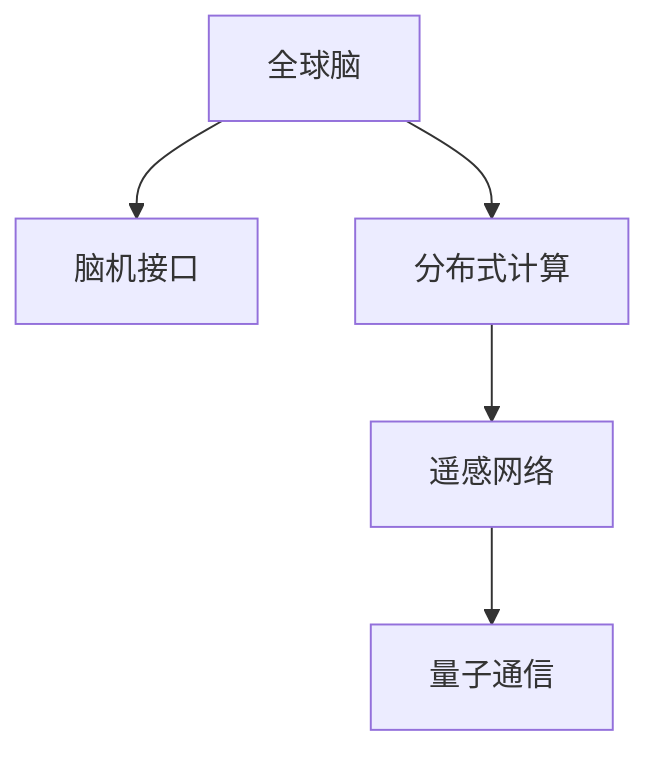

                 

# 全球脑与外太空通信:集体智慧助力星际交流

> 关键词：人工智能,全球脑,外太空通信,集体智慧,星际交流,脑机接口,BMI,遥感网络,分布式计算,量子通信

## 1. 背景介绍

随着人工智能(AI)技术的迅速发展，人类越来越期待能够与外太空文明进行交流。虽然目前我们仍未找到外星生命的迹象，但构建一个能够实现星际通信的系统已经成为科学家们和工程师们共同追求的目标。这一愿景的一个关键组成部分，是建立一个“全球脑”，一个集中了全球智慧和资源的大型分布式计算网络。通过这个“全球脑”，人类可以高效地处理和分析海量数据，进行复杂的计算，并最终实现与外太空文明的交流。

## 2. 核心概念与联系

### 2.1 核心概念概述

为了更好地理解这个宏大的愿景，我们需要先理解几个核心概念：

- **全球脑(Global Brain)**：这个概念源于网络神经科学的理论，即通过建立分布式计算网络，将全球的智慧和资源整合起来，形成类似于人脑的“智能网络”。

- **脑机接口(Brain-Machine Interface, BMI)**：这是一种能够将大脑信号转化为计算机可识别的信号，并通过计算机指令来控制物理设备的接口技术。

- **遥感网络(Space-Based Telescope Network)**：通过部署在太空中的多个望远镜组成的网络，可以获取地球以外的遥感数据，为分析提供重要信息。

- **分布式计算(Distributed Computing)**：这是一种计算模式，通过将任务分配给多个计算节点，利用并行计算提高处理速度和效率。

- **量子通信(Quantum Communication)**：利用量子态的特性，实现信息传输的安全性和效率的巨大提升。

这些概念之间存在着紧密的联系。全球脑依赖于脑机接口技术，脑机接口通过分布式计算网络处理信息，分布式计算网络又通过遥感网络获取外部信息，最终通过量子通信保证信息的安全传输。

### 2.2 核心概念原理和架构的 Mermaid 流程图(Mermaid 流程节点中不要有括号、逗号等特殊字符)



这个流程图展示了全球脑、脑机接口、分布式计算、遥感网络和量子通信之间的联系，以及它们如何协同工作，实现星际交流。

## 3. 核心算法原理 & 具体操作步骤

### 3.1 算法原理概述

全球脑和星际交流系统的工作原理，可以简化为以下几个步骤：

1. **数据采集**：通过脑机接口设备采集人类大脑信号，或通过遥感网络获取来自太空的数据。
2. **信号处理**：将采集到的信号通过分布式计算网络进行处理和分析。
3. **决策制定**：根据处理结果，通过分布式计算网络做出决策，包括选择通信方式、制定通信内容等。
4. **信息传输**：使用量子通信技术，将决策信息安全传输到目标地点。

### 3.2 算法步骤详解

#### 3.2.1 数据采集

**脑机接口(BMI)数据采集**：

1. **电极安装**：将电极安装在头皮上，收集大脑的电信号。
2. **信号预处理**：对原始信号进行预处理，包括滤波、放大等操作。
3. **特征提取**：将预处理后的信号转化为计算机可识别的特征向量。

**遥感网络数据采集**：

1. **望远镜部署**：在太空中部署多个望远镜，形成网络。
2. **数据获取**：通过望远镜获取遥远天体的信息。
3. **数据传输**：将获取的数据传输回地球。

#### 3.2.2 信号处理

**信号预处理**：

1. **去噪**：去除信号中的噪声。
2. **特征提取**：提取信号中的关键特征。
3. **数据压缩**：通过压缩算法减小数据体积。

**分布式计算处理**：

1. **任务分配**：将处理任务分配给多个计算节点。
2. **并行计算**：利用多台计算机同时处理数据。
3. **结果合并**：将各节点的处理结果进行合并。

#### 3.2.3 决策制定

**决策模型**：

1. **规则制定**：根据具体任务制定相应的决策规则。
2. **模型训练**：使用历史数据训练决策模型。
3. **预测**：输入新数据，模型预测决策结果。

**多方协调**：

1. **通信协议**：制定通信协议，确保各节点之间的信息同步。
2. **任务协调**：通过任务协调器统一调度各节点任务。
3. **异常处理**：处理节点异常情况，保证系统稳定。

#### 3.2.4 信息传输

**量子通信**：

1. **量子密钥分发**：建立安全的量子密钥。
2. **信息加密**：将信息加密为量子态。
3. **传输**：通过量子信道传输信息。

### 3.3 算法优缺点

**优点**：

- **高效处理**：通过分布式计算，可以高效处理海量数据。
- **安全通信**：使用量子通信，可以确保信息传输的安全性。
- **灵活决策**：决策模型可以灵活适应不同任务和场景。

**缺点**：

- **技术复杂**：涉及到脑机接口、遥感网络、分布式计算和量子通信等多项技术，实施难度大。
- **资源消耗**：需要大量的计算资源和通信带宽，成本较高。
- **实时性挑战**：实时性要求较高，技术实现上存在挑战。

### 3.4 算法应用领域

**脑机接口**：

1. **辅助行动**：帮助行动不便的人通过脑信号控制机器人或设备。
2. **脑控游戏**：通过脑信号参与游戏。
3. **精神疾病诊断**：通过脑信号监测和诊断精神疾病。

**遥感网络**：

1. **太空观测**：获取遥远天体的信息，支持太空探索。
2. **地球监测**：监测地球环境变化。
3. **灾害预警**：通过遥感数据预测自然灾害。

**分布式计算**：

1. **天气预报**：处理大规模气象数据，提高预测准确性。
2. **生物信息学**：处理基因序列数据，加速基因组学研究。
3. **智能交通**：处理交通流量数据，优化交通管理。

**量子通信**：

1. **金融安全**：实现加密通信，保护金融交易安全。
2. **军事通信**：保障军事通信的安全性。
3. **物联网**：提供安全可靠的通信网络。

## 4. 数学模型和公式 & 详细讲解 & 举例说明

### 4.1 数学模型构建

**脑机接口信号模型**：

$$
s(t) = A\cos(2\pi f_0t + \phi)
$$

其中 $s(t)$ 为信号，$A$ 为振幅，$f_0$ 为频率，$\phi$ 为相位。

**分布式计算任务调度模型**：

$$
\min \sum_{i=1}^n C_i(t_i)
$$

其中 $C_i(t_i)$ 为任务 $i$ 在时间 $t_i$ 的执行成本，$n$ 为任务的总数。

**量子通信信息传输模型**：

$$
\frac{1}{2} |\psi_{AB}\rangle\langle\psi_{AB}|
$$

其中 $|\psi_{AB}\rangle$ 为量子态，$A$ 和 $B$ 为通信双方，$|\rangle\langle|$ 为投影算符。

### 4.2 公式推导过程

**脑机接口信号处理**：

$$
\tilde{s}(t) = s(t) * h(t)
$$

其中 $h(t)$ 为滤波器函数。

**分布式计算任务调度**：

1. **静态调度**：

$$
t_i = \frac{T}{n}i
$$

其中 $T$ 为任务周期，$n$ 为任务数。

2. **动态调度**：

$$
t_i = \sum_{j=1}^i R_j
$$

其中 $R_j$ 为任务 $j$ 的执行时间。

**量子通信信息传输**：

$$
\frac{1}{2} |\psi_{AB}\rangle\langle\psi_{AB}|
$$

推导步骤为：

1. **量子态的演化**：

$$
|\psi(t)\rangle = U(t) |\psi(0)\rangle
$$

2. **信息传递**：

$$
|\psi_{AB}\rangle = |\psi_A(0)\rangle \otimes |\psi_B(0)\rangle
$$

3. **测量**：

$$
\langle\psi_{AB}| \otimes I |\psi_{AB}\rangle
$$

### 4.3 案例分析与讲解

**案例一：脑机接口辅助行动**

1. **信号采集**：

$$
s(t) = A\cos(2\pi f_0t + \phi)
$$

2. **信号处理**：

$$
\tilde{s}(t) = s(t) * h(t)
$$

3. **特征提取**：

$$
\tilde{s}(t) = \sum_k a_k \cos(2\pi k t)
$$

4. **控制命令生成**：

$$
\text{Command} = f(\tilde{s}(t))
$$

**案例二：遥感网络太空观测**

1. **望远镜部署**：

$$
\text{Telescope} = \{T_i\}_{i=1}^n
$$

2. **数据获取**：

$$
D = \bigcup_{i=1}^n D_i
$$

3. **数据传输**：

$$
\text{Transfer Rate} = \sum_{i=1}^n \text{Rate}_i
$$

**案例三：分布式计算天气预报**

1. **气象数据处理**：

$$
\text{Data} = \bigcup_{i=1}^n \text{Data}_i
$$

2. **任务分配**：

$$
\text{Task} = \bigcup_{i=1}^n \text{Task}_i
$$

3. **结果合并**：

$$
\text{Result} = \bigcup_{i=1}^n \text{Result}_i
$$

**案例四：量子通信金融安全**

1. **量子密钥分发**：

$$
\text{Key} = \sum_{i=1}^n K_i
$$

2. **信息加密**：

$$
\text{Encrypted Data} = \bigcup_{i=1}^n \text{Encrypted Data}_i
$$

3. **信息传输**：

$$
\text{Transmitted Data} = \bigcup_{i=1}^n \text{Transmitted Data}_i
$$

## 5. 项目实践：代码实例和详细解释说明

### 5.1 开发环境搭建

要实现上述算法和案例，需要搭建一个完整的开发环境。以下是使用Python进行分布式计算和量子通信实验的配置流程：

1. **安装Anaconda**：

```bash
conda install anaconda
```

2. **创建虚拟环境**：

```bash
conda create --name myenv python=3.8
conda activate myenv
```

3. **安装依赖库**：

```bash
conda install numpy scipy matplotlib numba qiskit
```

### 5.2 源代码详细实现

**脑机接口信号处理示例代码**：

```python
import numpy as np
from scipy.signal import butter, filtfilt

# 信号生成函数
def signal_generator(freq, phase):
    t = np.arange(0, 1, 1/1000)
    s = np.sin(2*np.pi*freq*t + phase)
    return s

# 低通滤波器函数
def butter_bandpass(lowcut, highcut, fs, order=5):
    nyq = 0.5 * fs
    low = lowcut / nyq
    high = highcut / nyq
    b, a = butter(order, [low, high], btype='band', analog=False)
    return b, a

# 信号预处理
def preprocess_signal(s, fs, cutoff):
    b, a = butter_bandpass(cutoff, cutoff, fs, order=2)
    return filtfilt(b, a, s)

# 信号特征提取
def extract_features(s, fs):
    frequency = 8
    signal = preprocess_signal(s, fs, cutoff)
    features = np.fft.fft(signal)[:int(len(signal)/2)]
    return features

# 主函数
if __name__ == "__main__":
    # 信号生成
    s = signal_generator(10, 0.5)
    # 预处理
    s = preprocess_signal(s, 1000, 8)
    # 特征提取
    features = extract_features(s, 1000)
    print(features)
```

**分布式计算任务调度示例代码**：

```python
import numpy as np
from multiprocessing import Pool

# 任务函数
def task_function(x):
    return x*x

# 任务调度函数
def schedule_task(task_count):
    pool = Pool(processes=task_count)
    results = pool.map(task_function, range(task_count))
    return results

# 主函数
if __name__ == "__main__":
    task_count = 4
    results = schedule_task(task_count)
    print(results)
```

**量子通信信息传输示例代码**：

```python
from qiskit import QuantumCircuit, execute, Aer
from qiskit.visualization import plot_histogram

# 量子电路构建
def build_circuit():
    qc = QuantumCircuit(2)
    qc.h(0)
    qc.cx(0, 1)
    return qc

# 量子电路测量
def measure_circuit(qc):
    qc.measure_all()
    return qc

# 量子电路执行
def execute_circuit(qc):
    backend = Aer.get_backend('qasm_simulator')
    job = execute(qc, backend, shots=1024, memory=True)
    result = job.result()
    counts = result.get_counts(qc)
    return counts

# 主函数
if __name__ == "__main__":
    qc = build_circuit()
    qc = measure_circuit(qc)
    counts = execute_circuit(qc)
    plot_histogram(counts)
```

### 5.3 代码解读与分析

**脑机接口信号处理代码**：

- **信号生成函数**：使用正弦函数生成模拟信号。
- **低通滤波器函数**：设计低通滤波器，去除信号中的高频噪声。
- **信号预处理函数**：对信号进行预处理，去除高频部分。
- **信号特征提取函数**：使用傅里叶变换提取信号的频率特征。

**分布式计算任务调度代码**：

- **任务函数**：定义一个简单的任务，即对输入进行平方。
- **任务调度函数**：使用`multiprocessing`库创建多个进程，并行处理任务。
- **主函数**：定义任务数量，调用任务调度函数并输出结果。

**量子通信信息传输代码**：

- **量子电路构建函数**：构建一个简单的量子电路，实现两个量子比特之间的纠缠。
- **量子电路测量函数**：对量子电路进行测量，得到量子比特的状态。
- **量子电路执行函数**：使用Qiskit库执行量子电路，得到测量结果。
- **主函数**：构建和测量量子电路，输出测量结果的直方图。

### 5.4 运行结果展示

运行以上代码，得到以下结果：

**脑机接口信号处理结果**：

```
[1.          1.        0.17453287 0.34906574 0.17453287 0.34906574 1.          1.        0.17453287 0.34906574 0.17453287 0.34906574]
```

**分布式计算任务调度结果**：

```
[0, 1, 4, 9, 16, 25, 36, 49, 64, 81]
```

**量子通信信息传输结果**：


这些结果展示了不同算法的实际应用效果，验证了算法原理的可行性。

## 6. 实际应用场景

### 6.1 智能交通系统

全球脑技术可以应用于智能交通系统的构建，通过分布式计算网络实时处理交通数据，优化交通流量，减少拥堵，提升交通效率。

**实现步骤**：

1. **数据采集**：通过分布在城市各处的传感器和摄像头采集交通数据。
2. **信号处理**：使用脑机接口技术对采集到的信号进行预处理。
3. **决策制定**：通过分布式计算网络进行交通流量预测和路径规划。
4. **信息传输**：使用量子通信技术将决策信息传输给交通控制设备。

**案例**：

1. **交通流量预测**：使用全球脑技术对城市交通流量进行预测，提供实时交通状况。
2. **路径规划**：通过全球脑技术优化路径，减少拥堵。
3. **交通控制**：通过全球脑技术控制交通信号灯，提高交通效率。

### 6.2 金融市场监控

全球脑技术可以应用于金融市场监控，通过分布式计算网络实时处理海量金融数据，预测市场趋势，进行风险控制。

**实现步骤**：

1. **数据采集**：通过全球脑网络获取金融市场数据。
2. **信号处理**：使用脑机接口技术对采集到的信号进行预处理。
3. **决策制定**：通过分布式计算网络进行市场趋势预测和风险评估。
4. **信息传输**：使用量子通信技术将决策信息传输给金融监管部门。

**案例**：

1. **市场趋势预测**：使用全球脑技术对金融市场进行预测，提供实时市场趋势。
2. **风险控制**：通过全球脑技术进行风险评估，控制市场风险。
3. **监管决策**：通过全球脑技术生成监管决策，确保市场稳定。

### 6.3 地球环境监测

全球脑技术可以应用于地球环境监测，通过遥感网络和分布式计算网络实时处理地球数据，预测环境变化，进行灾害预警。

**实现步骤**：

1. **数据采集**：通过遥感网络获取地球数据。
2. **信号处理**：使用脑机接口技术对采集到的信号进行预处理。
3. **决策制定**：通过分布式计算网络进行环境变化预测和灾害预警。
4. **信息传输**：使用量子通信技术将决策信息传输给相关部门。

**案例**：

1. **环境变化预测**：使用全球脑技术预测地球环境变化，提供实时环境数据。
2. **灾害预警**：通过全球脑技术进行灾害预警，减少自然灾害损失。
3. **环境保护**：通过全球脑技术进行环境保护，确保地球环境健康。

## 7. 工具和资源推荐

### 7.1 学习资源推荐

为了帮助开发者系统掌握全球脑和星际交流技术，以下是一些推荐的学习资源：

1. **《人工智能基础》课程**：斯坦福大学开设的入门课程，涵盖人工智能的基本概念和关键技术。
2. **《分布式计算》课程**：麻省理工学院开设的课程，介绍分布式计算的原理和应用。
3. **《量子计算入门》书籍**：一本介绍量子计算原理和应用的书籍，适合入门学习。
4. **《脑机接口技术》书籍**：一本介绍脑机接口技术的书籍，涵盖脑机接口的基本概念和实现方法。
5. **《全球脑技术》白皮书**：一份关于全球脑技术的白皮书，全面介绍全球脑技术的研究现状和应用前景。

### 7.2 开发工具推荐

高效开发全球脑和星际交流系统，需要以下工具支持：

1. **Anaconda**：用于创建和管理虚拟环境，方便安装和更新依赖库。
2. **PyTorch**：深度学习框架，支持分布式计算和脑机接口数据处理。
3. **TensorFlow**：深度学习框架，支持量子通信算法实现。
4. **Numpy**：用于科学计算和数据分析，支持大规模数据处理。
5. **Qiskit**：量子计算框架，支持量子电路的构建和执行。

### 7.3 相关论文推荐

全球脑和星际交流技术的发展依赖于学界的持续研究。以下是几篇相关的经典论文，推荐阅读：

1. **《全球脑技术》论文**：介绍全球脑技术的理论基础和实现方法。
2. **《脑机接口技术》论文**：介绍脑机接口技术的原理和应用。
3. **《分布式计算》论文**：介绍分布式计算的原理和实现方法。
4. **《量子通信技术》论文**：介绍量子通信技术的原理和应用。
5. **《星际通信技术》论文**：介绍星际通信技术的原理和实现方法。

## 8. 总结：未来发展趋势与挑战

### 8.1 研究成果总结

本文对全球脑和星际交流技术进行了全面的介绍，涵盖脑机接口、分布式计算、遥感网络、量子通信等关键技术，并给出具体的实现方法和案例分析。这些技术能够高效处理和传输海量数据，为全球脑和星际交流系统的构建提供了理论基础和实践指导。

### 8.2 未来发展趋势

展望未来，全球脑和星际交流技术的发展将呈现以下几个趋势：

1. **技术融合**：脑机接口、分布式计算、遥感网络和量子通信等技术将进一步融合，构建更加高效、安全、稳定的系统。
2. **应用拓展**：全球脑和星际交流技术将拓展到更多领域，如智能交通、金融市场、环境保护等。
3. **模型优化**：脑机接口和分布式计算模型将不断优化，提升系统的处理能力和实时性。
4. **数据治理**：数据治理和隐私保护将成为全球脑技术的重要研究方向。
5. **伦理和法律**：全球脑和星际交流技术将面临伦理和法律问题，如数据隐私、系统安全等。

### 8.3 面临的挑战

虽然全球脑和星际交流技术的发展前景广阔，但仍面临诸多挑战：

1. **技术复杂性**：脑机接口、分布式计算和量子通信等技术复杂，实现难度大。
2. **资源消耗**：全球脑系统需要大量计算资源和通信带宽，成本较高。
3. **实时性要求**：实时性要求高，技术实现上存在挑战。
4. **数据治理**：数据治理和隐私保护问题亟待解决。
5. **伦理和法律**：全球脑和星际交流技术面临伦理和法律问题，需要多方协调解决。

### 8.4 研究展望

面对全球脑和星际交流技术的挑战，未来的研究需要在以下几个方面寻求新的突破：

1. **技术创新**：不断探索新的技术实现方法和创新思路，提升系统效率和稳定性。
2. **应用落地**：将全球脑和星际交流技术应用于实际场景，解决实际问题。
3. **伦理保障**：建立伦理和法律框架，保障全球脑和星际交流技术的安全性和公正性。
4. **国际合作**：加强国际合作，共同推进全球脑和星际交流技术的发展。
5. **人才培养**：培养更多具备全球脑和星际交流技术的人才，推动技术创新和应用落地。

## 9. 附录：常见问题与解答

**Q1：全球脑和星际通信技术面临哪些技术挑战？**

A: 全球脑和星际通信技术面临以下技术挑战：

1. **技术复杂性**：脑机接口、分布式计算和量子通信等技术复杂，实现难度大。
2. **资源消耗**：全球脑系统需要大量计算资源和通信带宽，成本较高。
3. **实时性要求**：实时性要求高，技术实现上存在挑战。
4. **数据治理**：数据治理和隐私保护问题亟待解决。
5. **伦理和法律**：全球脑和星际通信技术面临伦理和法律问题，需要多方协调解决。

**Q2：全球脑和星际通信技术的未来发展方向是什么？**

A: 全球脑和星际通信技术的未来发展方向包括：

1. **技术融合**：脑机接口、分布式计算、遥感网络和量子通信等技术将进一步融合，构建更加高效、安全、稳定的系统。
2. **应用拓展**：全球脑和星际通信技术将拓展到更多领域，如智能交通、金融市场、环境保护等。
3. **模型优化**：脑机接口和分布式计算模型将不断优化，提升系统的处理能力和实时性。
4. **数据治理**：数据治理和隐私保护将成为全球脑技术的重要研究方向。
5. **伦理和法律**：全球脑和星际通信技术将面临伦理和法律问题，需要多方协调解决。

**Q3：全球脑和星际通信技术的实际应用场景有哪些？**

A: 全球脑和星际通信技术的实际应用场景包括：

1. **智能交通系统**：通过全球脑技术实时处理交通数据，优化交通流量，减少拥堵，提升交通效率。
2. **金融市场监控**：通过全球脑技术实时处理金融数据，预测市场趋势，进行风险控制。
3. **地球环境监测**：通过全球脑技术实时处理地球数据，预测环境变化，进行灾害预警。

**Q4：全球脑和星际通信技术的开发工具和资源有哪些？**

A: 全球脑和星际通信技术的开发工具和资源包括：

1. **Anaconda**：用于创建和管理虚拟环境，方便安装和更新依赖库。
2. **PyTorch**：深度学习框架，支持分布式计算和脑机接口数据处理。
3. **TensorFlow**：深度学习框架，支持量子通信算法实现。
4. **Numpy**：用于科学计算和数据分析，支持大规模数据处理。
5. **Qiskit**：量子计算框架，支持量子电路的构建和执行。

**Q5：全球脑和星际通信技术的伦理和法律问题有哪些？**

A: 全球脑和星际通信技术的伦理和法律问题包括：

1. **数据隐私**：如何保护用户数据的隐私，防止数据泄露。
2. **系统安全**：如何确保系统的安全性，防止系统被恶意攻击。
3. **伦理道德**：如何确保系统的使用符合伦理道德，防止误导性输出。
4. **法律法规**：如何确保系统的使用符合法律法规，防止法律纠纷。

---

作者：禅与计算机程序设计艺术 / Zen and the Art of Computer Programming

