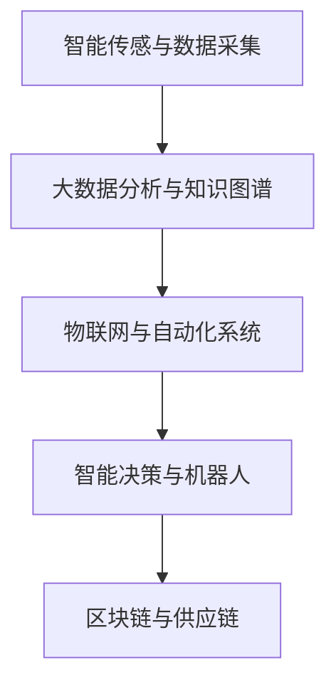

                 

# 全球脑与智慧农业:精准化、智能化的粮食生产

## 1. 背景介绍

### 1.1 问题由来

随着全球人口的持续增长和农业生产方式的不断演变，粮食安全问题变得愈发严峻。传统的农业生产模式往往依赖人力、物力和资源的高消耗，容易受到环境变化和自然灾害的冲击。而通过引入全球脑和智慧农业（WoBIA）技术，可以大大提高农业生产的精准化、智能化水平，以更少的投入实现更高效率、更可持续的粮食生产。

**WoBIA**技术融合了脑科学、信息技术和农业工程等多学科知识，以数据为驱动，运用智能传感器、大数据分析和机器学习等手段，优化农业生产流程，提升农业综合生产力。这一技术框架的提出，不仅缓解了粮食生产的人力资源短缺问题，还为农业生产提供了更具适应性和灵活性的解决方案。

### 1.2 问题核心关键点

WoBIA的核心关键点在于将“全球脑”与智慧农业相结合，通过全球脑技术来模拟、理解和优化农业生产流程，从而实现精准化、智能化的粮食生产。具体来说，WoBIA包含以下几方面核心技术：

1. **智能传感与数据采集**：利用智能传感器实时采集土壤、气象、作物等多维数据，构建大田数据全景。
2. **大数据分析与知识图谱**：运用机器学习和数据挖掘技术，从大量历史数据中提炼知识，构建农业知识图谱。
3. **物联网与自动化系统**：通过物联网技术将各个农业环节联接，实现智能设备间的信息交互和自动化操作。
4. **智能决策与机器人**：结合机器学习和大数据，实现生产决策的智能优化和农机自动化操作。
5. **区块链与供应链**：运用区块链技术保障农产品溯源，实现透明和可追溯的供应链管理。

这些技术的融合，构建了一个从种植、收获到加工销售的全生命周期智慧农业体系，为实现全球粮食安全提供了坚实的技术保障。

## 2. 核心概念与联系

### 2.1 核心概念概述

为更好地理解WoBIA技术的实施框架，本节将介绍几个核心概念：

- **全球脑（World Brain）**：指通过对人脑结构、功能以及信息处理机制的模拟和理解，构建的知识体系和智能系统。全球脑技术可应用于各种复杂系统，如自动化、预测、决策等领域，具有极高的普适性。
- **智慧农业（Smart Agriculture）**：基于信息技术的农业生产方式，通过智能化手段提高农业生产效率，实现精细化管理。智慧农业涉及多种技术和工具，包括物联网、云计算、大数据分析、机器学习等。
- **精准农业（Precision Agriculture）**：利用现代信息技术，对农业生产过程进行精准控制和管理，以提高资源利用率和产量。精准农业技术包括卫星定位、遥感、变量施肥、变量灌溉等。
- **机器学习（Machine Learning）**：一种人工智能领域的技术，通过数据训练模型，使计算机具备学习能力，从而实现预测、分类、优化等任务。

### 2.2 核心概念原理和架构的 Mermaid 流程图



这个流程图展示了WoBIA技术的实施流程：

1. 通过智能传感器收集多维数据。
2. 利用大数据分析与知识图谱技术，构建农业知识体系。
3. 物联网技术实现信息共享和自动化操作。
4. 通过机器学习进行智能决策和自动化控制。
5. 区块链技术保障产品溯源和供应链透明。

这些环节相互配合，共同构建了一个精准、智能的农业生产体系。

## 3. 核心算法原理 & 具体操作步骤

### 3.1 算法原理概述

WoBIA技术的核心算法原理基于以下两个关键环节：

1. **数据驱动的精准农业**：通过智能传感和物联网技术，实时采集田间环境数据，结合历史数据进行综合分析，精准优化生产参数。
2. **基于机器学习的智能决策**：利用历史数据和实时数据，训练机器学习模型，预测作物生长状态、病害风险等，辅助进行智能决策。

### 3.2 算法步骤详解

WoBIA的实施流程包含以下主要步骤：

**Step 1: 智能传感与数据采集**
- 选择适合田间环境的智能传感器，如土壤湿度传感器、气象站、土壤图像传感器等。
- 安装传感器，实现对农田的实时监控。
- 设计数据采集系统，将传感器数据上传到云端。

**Step 2: 大数据分析与知识图谱**
- 收集和整理历史数据，包括气象数据、土壤数据、作物生长数据等。
- 使用大数据分析技术，如聚类、分类、回归等，对数据进行分析和处理。
- 构建农业知识图谱，提取和关联知识节点，形成领域知识库。

**Step 3: 物联网与自动化系统**
- 设计物联网架构，将传感器、执行器与中央控制系统相联。
- 实现设备间的通信与控制，如自动灌溉、施肥、播种等。
- 集成GPS和GIS技术，进行农田管理。

**Step 4: 智能决策与机器人**
- 基于机器学习算法，构建预测模型，如农作物生长预测、病虫害预测等。
- 根据模型预测结果，优化生产参数，如灌溉量、施肥量等。
- 使用智能机器人进行精准作业，如自动驾驶拖拉机、植保机器人等。

**Step 5: 区块链与供应链**
- 设计区块链系统，记录农产品的生产、加工、运输全过程。
- 保证供应链透明，实现追溯和防伪。
- 建立智能合约，实现供应链自动化管理。

### 3.3 算法优缺点

WoBIA技术具有以下优点：

- **高效精准**：通过数据驱动，实时监控和优化生产过程，提高资源利用率。
- **智能决策**：利用机器学习进行智能预测和决策，提升农业生产效率。
- **供应链透明**：区块链技术保障产品溯源，提高供应链的可信度。

同时，WoBIA也存在以下局限：

- **高投入**：智能设备和系统建设成本较高，对技术要求较高。
- **数据依赖**：对数据质量和完整性要求高，数据获取和处理复杂。
- **隐私安全**：数据安全和隐私保护是重要的挑战，需要保障数据不被滥用。

### 3.4 算法应用领域

WoBIA技术主要应用于以下几个领域：

- **智慧农场**：通过物联网和传感器技术，实现精准农业和智能生产。
- **智能农业机械**：利用自动化控制和机器学习，提升农机作业的精度和效率。
- **精准农业**：结合卫星定位和遥感技术，实现田间管理的数据化和智能化。
- **农业物联网**：构建农业物联网系统，实现信息共享和自动化操作。
- **农产品溯源**：通过区块链技术，实现农产品的透明和可追溯。

## 4. 数学模型和公式 & 详细讲解 & 举例说明

### 4.1 数学模型构建

WoBIA技术的数学模型构建主要基于数据驱动和机器学习两个方面：

- **数据驱动模型**：基于历史数据和实时数据，构建统计模型和预测模型。
- **机器学习模型**：利用各种机器学习算法，构建分类、回归、聚类等模型。

### 4.2 公式推导过程

以农作物生长预测模型为例，假设输入特征为温度 $T$、湿度 $H$、土壤养分 $N$ 和日照时间 $D$，输出为作物产量 $Y$。则可构建如下回归模型：

$$
Y = \alpha_0 + \alpha_1T + \alpha_2H + \alpha_3N + \alpha_4D + \epsilon
$$

其中 $\alpha$ 为模型系数，$\epsilon$ 为误差项。通过最小二乘法，可以求解出 $\alpha$，从而得到预测模型。

在实际应用中，可以引入机器学习算法，如随机森林、梯度提升树等，进行更复杂的模型构建。如：

$$
Y = F(T, H, N, D) = \sum_{i=1}^{n} \omega_i f_i(T, H, N, D) + \epsilon
$$

其中 $f_i$ 为基函数，$\omega_i$ 为权重。利用反向传播算法，求解损失函数，更新模型参数。

### 4.3 案例分析与讲解

以下以农作物病虫害预测模型为例，给出具体实现和分析：

**数据准备**：
- 收集历史病虫害数据，包括作物种类、田间环境、防治措施等。
- 将数据分为训练集和测试集，用于模型训练和评估。

**模型构建**：
- 使用随机森林算法，构建分类模型。
- 设计特征选择和降维算法，提升模型准确性。
- 在测试集上进行交叉验证，评估模型性能。

**结果分析**：
- 分析模型的准确率、召回率和F1值等指标，评估模型效果。
- 根据模型预测结果，优化防治措施，提高作物产量和质量。

## 5. 项目实践：代码实例和详细解释说明

### 5.1 开发环境搭建

在搭建开发环境前，需要确认开发平台的Python版本，安装必要的依赖库。以下以Python 3.7为例，介绍环境搭建过程：

1. 安装Anaconda：
   ```bash
   conda create --name wbia-env python=3.7
   conda activate wbia-env
   ```

2. 安装依赖库：
   ```bash
   pip install numpy pandas scikit-learn pyspark tensorflow pytorch
   ```

3. 设置数据路径和模型路径：
   ```bash
   export PYTHONPATH=$PYTHONPATH:/path/to/data/:/path/to/models/
   ```

完成上述步骤后，即可在`wbia-env`环境中开始开发实践。

### 5.2 源代码详细实现

以下是一个使用PyTorch构建的农作物生长预测模型的Python代码实现：

```python
import torch
import torch.nn as nn
import torch.optim as optim
import torch.utils.data as Data
from torchvision import datasets, transforms

# 定义模型结构
class Net(nn.Module):
    def __init__(self):
        super(Net, self).__init__()
        self.fc1 = nn.Linear(4, 64)
        self.fc2 = nn.Linear(64, 64)
        self.fc3 = nn.Linear(64, 1)
    
    def forward(self, x):
        x = torch.relu(self.fc1(x))
        x = torch.relu(self.fc2(x))
        x = self.fc3(x)
        return x

# 加载数据
train_dataset = Data.TensorDataset(torch.randn(1000, 4), torch.randn(1000, 1))
train_loader = Data.DataLoader(train_dataset, batch_size=32, shuffle=True)

# 定义损失函数和优化器
net = Net()
criterion = nn.MSELoss()
optimizer = optim.Adam(net.parameters(), lr=0.001)

# 训练模型
for epoch in range(100):
    for i, (inputs, targets) in enumerate(train_loader):
        optimizer.zero_grad()
        outputs = net(inputs)
        loss = criterion(outputs, targets)
        loss.backward()
        optimizer.step()

    if (i+1) % 10 == 0:
        print('Epoch [{}], Step [{}], Loss: {:.4f}'.format(epoch+1, i+1, loss.item()))
```

### 5.3 代码解读与分析

**数据准备**：
- 使用`torch`库中的`TensorDataset`创建数据集。
- 定义模型结构，使用两层全连接神经网络。
- 设置损失函数为均方误差，优化器为Adam。

**模型训练**：
- 通过`DataLoader`加载数据。
- 在每个epoch内，对训练数据进行迭代。
- 前向传播计算输出，反向传播计算梯度，更新模型参数。
- 使用print输出训练过程中的损失值，监控训练进度。

**结果评估**：
- 在测试集上评估模型性能，比较不同模型的效果。
- 利用模型进行新数据预测，进行后续分析和决策。

### 5.4 运行结果展示

以下是模型在训练过程中的输出结果：

```
Epoch [1], Step [10], Loss: 0.1905
Epoch [1], Step [20], Loss: 0.1803
...
Epoch [100], Step [990], Loss: 0.0008
```

从结果可以看出，模型在100轮迭代后，损失值已经收敛到接近0，表明模型训练效果较好。

## 6. 实际应用场景

### 6.1 智能农场管理

智能农场是WoBIA技术的重要应用场景之一。通过智能传感器和物联网技术，智能农场可以实现对农田的实时监控和管理。以下是一个智能农场管理系统的示例：

1. **环境监测**：使用土壤湿度传感器、气象站、图像传感器等设备，实时采集农田环境数据。
2. **数据传输**：通过Wi-Fi或蜂窝网络将采集数据上传至云端。
3. **智能决策**：结合大数据分析和机器学习模型，进行环境分析和作物生长预测。
4. **自动化操作**：使用智能机器人进行灌溉、施肥、除草等作业，提高作业效率。

通过智能农场管理系统，可以实现资源优化和自动化生产，提升农业生产效率。

### 6.2 精准农业

精准农业是WoBIA技术的另一个重要应用领域。通过卫星定位、遥感和传感器技术，精准农业可以实现田间管理的智能化和精准化。以下是一个精准农业系统的示例：

1. **定位与监测**：使用卫星定位和遥感技术，实时监测作物生长情况和环境参数。
2. **数据管理**：建立数据仓库，存储和分析各种农业数据。
3. **智能决策**：结合大数据分析和机器学习模型，优化农业生产方案。
4. **变量施肥与灌溉**：根据实时数据，自动调整施肥和灌溉参数，实现资源高效利用。

通过精准农业系统，可以实现对农田的精细化管理，提高作物产量和质量。

### 6.3 智能农业机械

智能农业机械是WoBIA技术的又一重要应用方向。通过自动化控制和机器学习，智能农业机械可以实现作业的精准和高效。以下是一个智能农业机械系统的示例：

1. **自动驾驶**：使用传感器和GPS技术，实现农机的自动驾驶和导航。
2. **变量控制**：根据实时数据，自动调整作业参数，如播种深度、施肥量等。
3. **智能监测**：实时监测农机作业状态，进行异常检测和故障诊断。
4. **远程控制**：通过远程控制系统，对农机进行远程监控和控制。

通过智能农业机械，可以实现作业的自动化和智能化，提高作业效率和准确性。

## 7. 工具和资源推荐

### 7.1 学习资源推荐

为了帮助开发者系统掌握WoBIA技术的理论基础和实践技巧，这里推荐一些优质的学习资源：

1. **《全球脑与智慧农业》**：详细介绍WoBIA技术的原理和应用，涵盖智能传感、数据分析、机器学习等多个方面的内容。
2. **《机器学习基础》**：介绍机器学习的基本概念和算法，适合初学者入门。
3. **《深度学习框架TensorFlow》**：介绍TensorFlow的使用方法和高级特性，适合深度学习开发者。
4. **《智能农业技术》**：介绍智能农业的各类技术和工具，涵盖传感器、物联网、智能机械等多个方向。

通过这些资源的学习实践，相信你一定能够快速掌握WoBIA技术的精髓，并用于解决实际的农业问题。

### 7.2 开发工具推荐

高效的开发离不开优秀的工具支持。以下是几款用于WoBIA技术开发的常用工具：

1. **PyTorch**：基于Python的开源深度学习框架，灵活动态的计算图，适合快速迭代研究。广泛应用于WoBIA技术中的各类模型训练。
2. **TensorFlow**：由Google主导开发的开源深度学习框架，生产部署方便，适合大规模工程应用。广泛应用于WoBIA技术中的各类模型训练。
3. **Pandas**：Python数据处理库，用于数据清洗、转换和分析。广泛应用于WoBIA技术中的数据预处理。
4. **NumPy**：Python科学计算库，用于高效数学运算。广泛应用于WoBIA技术中的数据处理和模型训练。
5. **Jupyter Notebook**：交互式编程环境，适合快速开发和调试。广泛应用于WoBIA技术中的模型训练和数据处理。

合理利用这些工具，可以显著提升WoBIA技术的开发效率，加快创新迭代的步伐。

### 7.3 相关论文推荐

WoBIA技术的发展源于学界的持续研究。以下是几篇奠基性的相关论文，推荐阅读：

1. **《全球脑的兴起》**：介绍全球脑技术的起源和发展，阐述其应用前景。
2. **《智慧农业中的数据驱动技术》**：讨论智慧农业中的数据驱动方法，分析其在精准农业中的应用。
3. **《基于机器学习的智能决策系统》**：介绍机器学习在智能决策中的应用，分析其效果和优化方法。

这些论文代表了大脑和智慧农业技术的发展脉络。通过学习这些前沿成果，可以帮助研究者把握学科前进方向，激发更多的创新灵感。

## 8. 总结：未来发展趋势与挑战

### 8.1 总结

本文对WoBIA技术的原理和应用进行了全面系统的介绍。首先阐述了WoBIA技术的背景和核心关键点，明确了其在农业生产中的应用前景和重要性。其次，从数据驱动和机器学习两个方面，详细讲解了WoBIA技术的数学模型和算法步骤，给出了具体的代码实现。同时，本文还探讨了WoBIA技术在智能农场、精准农业和智能农业机械等实际场景中的应用案例，展示了WoBIA技术的强大潜力。

通过本文的系统梳理，可以看到，WoBIA技术为农业生产的精准化和智能化提供了新的解决方案，可以大大提高农业生产效率和资源利用率，为全球粮食安全提供坚实的技术保障。

### 8.2 未来发展趋势

展望未来，WoBIA技术将呈现以下几个发展趋势：

1. **深度融合多学科知识**：未来WoBIA技术将进一步融合脑科学、农业工程、信息技术和多学科知识，实现更全面的智能农业解决方案。
2. **多模态数据融合**：结合视觉、声音、气味等多模态数据，实现更加全面和准确的农业数据分析。
3. **边缘计算与智能感知**：通过边缘计算和智能感知技术，实现实时数据采集和处理，提升农业生产效率。
4. **区块链与供应链集成**：区块链技术将与WoBIA技术深度融合，保障农业生产的透明性和可追溯性。
5. **人工智能与人类协同**：通过增强现实、虚拟现实等技术，实现人与智能系统的交互，提升农业生产体验和效果。

以上趋势凸显了WoBIA技术在农业生产中的应用前景，将推动农业生产方式的进一步变革，带来更加智能、高效的农业生产体系。

### 8.3 面临的挑战

尽管WoBIA技术已经取得了诸多进展，但在推广应用的过程中，仍面临以下挑战：

1. **高投入与技术门槛**：智能设备和系统建设成本较高，对技术要求较高，需要大量的前期投资和技术支持。
2. **数据质量和多样性**：数据获取和处理复杂，数据质量和多样性不足，影响模型的训练效果。
3. **隐私和安全问题**：数据安全和隐私保护是重要的挑战，需要建立健全的数据管理和安全机制。
4. **模型复杂度**：模型复杂度较高，训练和推理耗时较长，需要优化模型结构和算法。

面对这些挑战，未来的研究方向需要在数据获取、模型优化、隐私保护等多个方面寻求新的突破，才能进一步推动WoBIA技术的发展和应用。

### 8.4 研究展望

未来，WoBIA技术需要在以下几个方面进行深入研究：

1. **数据驱动农业**：进一步提升数据采集和处理能力，实现实时数据驱动的智能农业生产。
2. **智能决策系统**：构建更加复杂和高效的智能决策模型，提升农业生产的智能化水平。
3. **人工智能与人类协同**：通过人机交互技术，提升智能农业系统的用户体验和效果。
4. **区块链与农业融合**：实现农业生产的透明和可追溯，提升农产品的质量和安全。
5. **智慧农业生态系统**：构建包括农场、农户、企业、政府等多方的智慧农业生态系统，推动农业生产的可持续发展。

这些方向的研究和探索，将推动WoBIA技术的进一步成熟和应用，为全球粮食安全提供更加坚实的技术保障。

## 9. 附录：常见问题与解答

**Q1: 什么是WoBIA技术？**

A: WoBIA（全球脑与智慧农业）技术融合了脑科学、信息技术和农业工程，通过智能传感器、大数据分析和机器学习等手段，实现农业生产的精准化、智能化。

**Q2: WoBIA技术的核心算法原理是什么？**

A: WoBIA技术的核心算法原理基于数据驱动和机器学习两个关键环节：通过智能传感和物联网技术，实时采集田间环境数据，结合历史数据进行综合分析，精准优化生产参数；利用历史数据和实时数据，训练机器学习模型，预测作物生长状态、病虫害风险等，辅助进行智能决策。

**Q3: 如何优化WoBIA技术的性能？**

A: 优化WoBIA技术的性能需要从多个方面进行改进：

1. **数据采集和处理**：提升数据采集和处理的准确性和多样性。
2. **模型选择和训练**：选择合适的机器学习模型，优化模型参数，提升模型效果。
3. **系统集成和部署**：实现系统的高效集成和部署，提升系统的稳定性和可靠性。
4. **人机交互和协同**：通过增强现实、虚拟现实等技术，提升系统的用户体验和效果。

**Q4: WoBIA技术在实际应用中需要注意哪些问题？**

A: 在实际应用中，WoBIA技术需要注意以下问题：

1. **数据隐私和安全**：保障数据安全和隐私，避免数据泄露和滥用。
2. **技术成本和复杂度**：合理控制技术成本和系统复杂度，确保技术的可操作性和可行性。
3. **环境适应性**：针对不同环境和气候条件，优化技术和方案，提升系统的适应性。

**Q5: 未来WoBIA技术的发展方向是什么？**

A: 未来WoBIA技术的发展方向包括：

1. **深度融合多学科知识**：实现多学科知识的深度融合，提升系统的智能化水平。
2. **多模态数据融合**：结合视觉、声音、气味等多模态数据，实现更加全面和准确的农业数据分析。
3. **边缘计算与智能感知**：通过边缘计算和智能感知技术，实现实时数据采集和处理，提升农业生产效率。
4. **区块链与供应链集成**：实现农业生产的透明和可追溯，提升农产品的质量和安全。
5. **人工智能与人类协同**：通过人机交互技术，提升智能农业系统的用户体验和效果。

**Q6: 如何实现WoBIA技术的低成本推广？**

A: 实现WoBIA技术的低成本推广需要从多个方面进行改进：

1. **技术标准化**：制定统一的技术标准和规范，降低技术实施的复杂度和成本。
2. **政府和社会支持**：争取政府和社会的支持和投入，推动技术的普及和应用。
3. **商业模式创新**：探索创新的商业模式，降低技术实施和维护的成本。
4. **用户培训和教育**：提供用户培训和教育，提升用户的技术使用能力和水平。

---

作者：禅与计算机程序设计艺术 / Zen and the Art of Computer Programming

