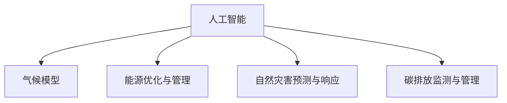

                 

# 全球脑与气候变化:集体行动新可能

## 1. 背景介绍

### 1.1 问题由来

气候变化是全人类面临的重大挑战之一。随着全球温室气体排放的不断增加，极端气候事件频发，全球温度上升，对自然生态系统和人类社会造成严重影响。气候变化带来的影响不仅仅局限于环境问题，还涉及到经济、政治、社会等多个方面，亟需全球共同应对。

人工智能（AI）作为现代科技的前沿领域，在气候变化问题上也有着重要的应用前景。AI技术能够处理大量数据、预测气候变化趋势、优化能源使用等，为应对气候变化提供了新的可能性。

### 1.2 问题核心关键点

1. **气候变化的复杂性**：气候变化是一个复杂的问题，涉及多方面的因素，如自然气候系统、人类活动、环境变化等。如何科学地理解气候变化，制定有效的应对策略，是当前研究的重点。

2. **气候模型与AI结合**：当前的气候模型通常依赖于大量的观测数据和复杂的物理模型。AI技术能够处理大规模数据、提取关键特征、优化模型参数等，有助于提升气候模型的精度和效率。

3. **能源优化与管理**：AI技术在能源优化和管理领域有着广泛应用，通过智能算法优化能源分配和使用，降低能源消耗和碳排放。

4. **自然灾害预测与响应**：AI技术能够通过图像识别、时间序列分析等方法，预测自然灾害的发生，提前制定应对策略，减少灾害损失。

5. **碳排放监测与管理**：AI技术能够通过遥感数据、物联网等手段，实时监测碳排放情况，帮助制定减排政策，提升碳排放管理效率。

## 2. 核心概念与联系

### 2.1 核心概念概述

为更好地理解AI在气候变化中的应用，本节将介绍几个密切相关的核心概念：

- **人工智能**：利用算法和大数据进行自我学习的技术，能够处理复杂问题、自动化决策等。
- **气候模型**：通过数学模型和计算机模拟，预测未来气候变化的趋势和影响。
- **能源优化与管理**：通过AI技术优化能源使用，降低碳排放，实现可持续发展。
- **自然灾害预测与响应**：利用AI技术预测自然灾害的发生，提前采取防范措施，减少灾害损失。
- **碳排放监测与管理**：通过AI技术监测和管理碳排放，实现减排目标。

这些概念之间的逻辑关系可以通过以下Mermaid流程图来展示：



这个流程图展示了几大核心概念及其之间的关系：

1. 人工智能通过数据分析和模型优化，支持气候模型、能源优化、灾害预测等领域的实践。
2. 气候模型为人工智能提供了预测气候变化的基础数据。
3. 能源优化与管理、自然灾害预测与响应、碳排放监测与管理等领域，都依赖于人工智能技术进行处理和优化。

这些概念共同构成了AI在气候变化领域的应用框架，使其能够有效地应对这一全球性挑战。

## 3. 核心算法原理 & 具体操作步骤

### 3.1 算法原理概述

AI在气候变化中的应用，主要通过以下几个核心算法原理：

1. **数据处理与特征提取**：通过收集和处理大量的气候数据、能源数据、碳排放数据等，提取关键特征，为模型训练提供数据支持。
2. **机器学习与深度学习**：利用机器学习算法和深度学习模型，对数据进行分析和预测，提升模型的准确性和泛化能力。
3. **优化算法**：通过优化算法（如梯度下降、遗传算法等），调整模型参数，优化模型性能。
4. **自然语言处理**：利用自然语言处理技术，处理和分析气候变化相关的文本数据，提取有用的信息。
5. **计算机视觉**：通过计算机视觉技术，分析遥感影像、气象数据等，提升气候变化预测的精度。

### 3.2 算法步骤详解

AI在气候变化中的应用一般包括以下几个关键步骤：

**Step 1: 数据收集与预处理**
- 收集气候数据、能源数据、碳排放数据等，进行清洗和标准化处理。
- 处理缺失数据、异常值等问题，确保数据的完整性和一致性。
- 利用数据增强技术，扩充数据集，提升模型的鲁棒性。

**Step 2: 模型选择与训练**
- 根据任务需求，选择合适的机器学习或深度学习模型，如随机森林、支持向量机、卷积神经网络、循环神经网络等。
- 利用训练集数据，对模型进行训练，调整模型参数，提升模型性能。
- 在验证集上评估模型性能，选择最优模型。

**Step 3: 模型优化与验证**
- 使用优化算法（如梯度下降、遗传算法等），进一步优化模型性能。
- 在测试集上验证模型的泛化能力，确保模型具有较好的泛化性能。

**Step 4: 模型应用与反馈**
- 将优化后的模型应用于实际问题，如气候预测、能源优化、灾害预警等。
- 收集反馈数据，对模型进行迭代优化，提升模型性能。

### 3.3 算法优缺点

AI在气候变化中的应用具有以下优点：

1. **高效性**：AI技术能够处理大规模数据，提取关键特征，提升模型的准确性和泛化能力，能够快速应对复杂的气候变化问题。
2. **灵活性**：AI模型可以根据数据和任务的变化，进行动态调整和优化，适应不同的应用场景。
3. **可扩展性**：AI技术可以通过增加数据和计算资源，不断提升模型性能，具有较好的可扩展性。

同时，AI在气候变化中的应用也存在一定的局限性：

1. **数据依赖**：AI模型依赖于高质量的数据，数据的质量和完整性直接影响模型的性能。
2. **模型复杂性**：复杂的AI模型可能面临过拟合问题，需要更多的数据和计算资源进行训练。
3. **可解释性**：AI模型的决策过程往往较为复杂，难以解释其内部的工作机制，缺乏透明度。
4. **伦理问题**：AI技术的应用可能涉及隐私、安全等伦理问题，需要谨慎处理。

尽管存在这些局限性，但AI在气候变化中的应用前景广阔，其高效、灵活、可扩展的特点，使其在应对气候变化方面具有独特的优势。

### 3.4 算法应用领域

AI在气候变化中的应用领域广泛，涵盖了气候预测、能源优化、灾害预警、碳排放监测等多个方面：

1. **气候预测**：利用AI技术预测未来气候变化趋势，如温度、降水量、极端天气等，为政策制定提供科学依据。
2. **能源优化**：通过AI技术优化能源使用，降低能源消耗和碳排放，实现可持续发展。
3. **自然灾害预警**：利用AI技术预测自然灾害的发生，提前采取防范措施，减少灾害损失。
4. **碳排放监测**：通过AI技术实时监测碳排放情况，帮助制定减排政策，提升碳排放管理效率。
5. **环境监测与保护**：利用AI技术监测环境污染、生态变化等，保护生态环境。

## 4. 数学模型和公式 & 详细讲解 & 举例说明

### 4.1 数学模型构建

AI在气候变化中的应用，涉及多个数学模型和公式。以下以气候预测为例，详细讲解其数学模型构建过程。

假设有一组历史气候数据 $D=\{(x_i,y_i)\}_{i=1}^N$，其中 $x_i$ 表示气候特征向量，$y_i$ 表示对应的时间序列值。利用线性回归模型进行气候预测，模型的数学形式如下：

$$
y_i = \theta_0 + \sum_{j=1}^n \theta_j x_{ij} + \epsilon_i
$$

其中，$\theta_0,\theta_j$ 为模型的参数，$\epsilon_i$ 为误差项。

模型的目标是最小化误差项的平方和，即：

$$
\min_{\theta} \sum_{i=1}^N (y_i - \hat{y}_i)^2
$$

其中，$\hat{y}_i = \theta_0 + \sum_{j=1}^n \theta_j x_{ij}$ 为模型对 $y_i$ 的预测值。

### 4.2 公式推导过程

对于上述线性回归模型，利用最小二乘法进行参数估计。模型的代价函数为：

$$
J(\theta) = \frac{1}{2N} \sum_{i=1}^N (y_i - \hat{y}_i)^2
$$

对 $\theta$ 求偏导数，得：

$$
\frac{\partial J(\theta)}{\partial \theta_j} = \frac{1}{N} \sum_{i=1}^N (y_i - \hat{y}_i)x_{ij}
$$

令偏导数为零，解方程得：

$$
\theta_j = \frac{1}{N} \sum_{i=1}^N (y_i - \hat{y}_i)x_{ij}
$$

### 4.3 案例分析与讲解

以碳排放监测为例，利用AI技术进行碳排放预测和优化管理。假设有一组历史碳排放数据 $D=\{(x_i,y_i)\}_{i=1}^N$，其中 $x_i$ 表示影响碳排放的各个因素，$y_i$ 表示实际的碳排放量。利用神经网络模型进行碳排放预测，模型的数学形式如下：

$$
y_i = \theta_0 + \sum_{j=1}^n \theta_j x_{ij} + \epsilon_i
$$

其中，$\theta_0,\theta_j$ 为模型的参数，$\epsilon_i$ 为误差项。

模型的目标是最小化误差项的平方和，即：

$$
\min_{\theta} \sum_{i=1}^N (y_i - \hat{y}_i)^2
$$

其中，$\hat{y}_i = \theta_0 + \sum_{j=1}^n \theta_j x_{ij}$ 为模型对 $y_i$ 的预测值。

利用深度学习技术，构建多层感知机模型，并通过反向传播算法进行参数更新，提升模型的预测能力。

## 5. 项目实践：代码实例和详细解释说明

### 5.1 开发环境搭建

在进行气候变化相关的AI应用开发前，我们需要准备好开发环境。以下是使用Python进行PyTorch开发的环境配置流程：

1. 安装Anaconda：从官网下载并安装Anaconda，用于创建独立的Python环境。

2. 创建并激活虚拟环境：
```bash
conda create -n pytorch-env python=3.8 
conda activate pytorch-env
```

3. 安装PyTorch：根据CUDA版本，从官网获取对应的安装命令。例如：
```bash
conda install pytorch torchvision torchaudio cudatoolkit=11.1 -c pytorch -c conda-forge
```

4. 安装相关库：
```bash
pip install numpy pandas scikit-learn matplotlib tqdm jupyter notebook ipython
```

完成上述步骤后，即可在`pytorch-env`环境中开始AI应用开发。

### 5.2 源代码详细实现

以下是一个使用PyTorch进行气候预测的代码实现：

```python
import torch
import torch.nn as nn
import torch.optim as optim
from sklearn.model_selection import train_test_split
from sklearn.metrics import mean_squared_error
import pandas as pd

# 数据加载
data = pd.read_csv('climate_data.csv')
X = data.iloc[:, :-1].values
y = data.iloc[:, -1].values

# 数据分割
X_train, X_test, y_train, y_test = train_test_split(X, y, test_size=0.2, random_state=42)

# 定义模型
class ClimatePredictor(nn.Module):
    def __init__(self, input_dim, hidden_dim, output_dim):
        super(ClimatePredictor, self).__init__()
        self.fc1 = nn.Linear(input_dim, hidden_dim)
        self.fc2 = nn.Linear(hidden_dim, output_dim)
        self.relu = nn.ReLU()
    
    def forward(self, x):
        x = self.fc1(x)
        x = self.relu(x)
        x = self.fc2(x)
        return x
    
# 定义模型参数
input_dim = X_train.shape[1]
hidden_dim = 32
output_dim = 1
model = ClimatePredictor(input_dim, hidden_dim, output_dim)

# 定义损失函数和优化器
criterion = nn.MSELoss()
optimizer = optim.Adam(model.parameters(), lr=0.001)

# 模型训练
for epoch in range(100):
    optimizer.zero_grad()
    predictions = model(X_train)
    loss = criterion(predictions, y_train)
    loss.backward()
    optimizer.step()
    print(f'Epoch {epoch+1}, Loss: {loss:.4f}')

# 模型评估
predictions = model(X_test)
mse = mean_squared_error(y_test, predictions)
print(f'Test MSE: {mse:.4f}')
```

以上代码实现了利用神经网络模型进行气候预测的基本流程。具体步骤如下：

1. 加载气候数据，并进行数据分割。
2. 定义神经网络模型结构。
3. 定义损失函数和优化器。
4. 进行模型训练，并输出训练损失。
5. 进行模型评估，并输出测试均方误差。

### 5.3 代码解读与分析

让我们再详细解读一下关键代码的实现细节：

**数据加载与分割**：
- 使用pandas库读取气候数据，并将其分割为训练集和测试集。

**模型定义**：
- 定义神经网络模型结构，包含两个全连接层和ReLU激活函数。
- 模型输入为气候特征向量，输出为预测的气候值。

**损失函数与优化器**：
- 使用均方误差损失函数，表示预测值与真实值之间的差异。
- 使用Adam优化器，调整模型参数，最小化损失函数。

**模型训练**：
- 在每个epoch内，前向传播计算预测值，计算损失函数，反向传播更新模型参数。

**模型评估**：
- 使用测试集数据进行模型评估，计算测试均方误差，评估模型性能。

以上代码实现了基本的气候预测模型，通过训练模型，可以提升预测精度。实际应用中，还需进一步优化模型结构和训练策略，提升模型的泛化能力和预测性能。

## 6. 实际应用场景

### 6.1 智慧能源系统

智慧能源系统利用AI技术进行能源优化与管理，提升能源效率，降低碳排放。通过实时监测能源使用情况，优化能源分配和使用，实现能源的智能管理。

具体而言，可以利用AI技术对历史能源使用数据进行分析，建立能源使用模型，预测未来的能源需求和供应情况。利用优化算法（如遗传算法、模拟退火等），调整能源分配策略，实现能源的最优分配和使用。在实际应用中，还可以结合实时监测数据，动态调整能源分配，确保能源的高效利用。

### 6.2 灾害预警系统

自然灾害预警系统利用AI技术预测自然灾害的发生，提前采取防范措施，减少灾害损失。通过收集历史灾害数据、气象数据等，利用机器学习算法和深度学习模型，预测自然灾害的发生时间和影响范围。

具体而言，可以利用图像识别技术对遥感影像进行分析，识别出可能发生自然灾害的区域。结合时间序列分析等技术，预测未来灾害的发生时间和影响范围，提前采取防范措施，减少灾害损失。在实际应用中，还可以结合实时监测数据，动态调整预警策略，确保预警的及时性和准确性。

### 6.3 碳排放监测系统

碳排放监测系统利用AI技术实时监测碳排放情况，帮助制定减排政策，提升碳排放管理效率。通过收集历史碳排放数据、环境数据等，利用机器学习算法和深度学习模型，预测未来的碳排放情况。

具体而言，可以利用神经网络模型对历史碳排放数据进行分析，建立碳排放模型，预测未来的碳排放情况。结合优化算法（如遗传算法、模拟退火等），调整碳排放策略，实现碳排放的最优管理。在实际应用中，还可以结合实时监测数据，动态调整碳排放管理策略，确保碳排放的有效控制。

### 6.4 未来应用展望

随着AI技术的不断进步，全球脑与气候变化的应用前景将更加广阔。未来，AI技术将在以下几个方面得到更广泛的应用：

1. **全球气候变化的监测与预测**：利用AI技术监测全球气候变化情况，预测未来的气候变化趋势，为政策制定提供科学依据。
2. **智慧城市的建设**：利用AI技术提升智慧城市的管理水平，实现能源优化、交通管理、灾害预警等功能的智能化。
3. **全球碳排放管理**：利用AI技术实时监测全球碳排放情况，制定科学的减排政策，推动全球碳中和目标的实现。
4. **自然资源的保护**：利用AI技术监测自然资源的利用情况，优化资源分配，实现自然资源的可持续利用。
5. **生态系统的保护**：利用AI技术监测生态系统的变化情况，保护生态环境，实现生态系统的可持续发展。

未来，全球脑与气候变化的应用将更加广泛，AI技术将为解决气候变化问题提供更加科学、高效、智能的解决方案。

## 7. 工具和资源推荐

### 7.1 学习资源推荐

为了帮助开发者系统掌握AI在气候变化中的应用，这里推荐一些优质的学习资源：

1. **Coursera《机器学习》课程**：由斯坦福大学教授Andrew Ng主讲，系统讲解机器学习的基本概念和应用。
2. **edX《深度学习》课程**：由MIT教授Tommi Jaakkola主讲，讲解深度学习的基本原理和应用。
3. **《Deep Learning》书籍**：由深度学习领域的专家Ian Goodfellow、Yoshua Bengio和Aaron Courville合著，全面介绍了深度学习的基本概念和应用。
4. **《Python深度学习》书籍**：由François Chollet合著，介绍了利用Python和Keras实现深度学习的全过程。
5. **Kaggle平台**：提供大量机器学习竞赛和数据集，是实践AI技术的绝佳平台。

通过对这些资源的学习实践，相信你一定能够快速掌握AI在气候变化领域的应用方法，并用于解决实际的气候问题。

### 7.2 开发工具推荐

高效的开发离不开优秀的工具支持。以下是几款用于AI开发常用的工具：

1. **PyTorch**：基于Python的开源深度学习框架，灵活性高，适用于各种类型的深度学习任务。
2. **TensorFlow**：由Google主导开发的开源深度学习框架，支持多种硬件平台，适用于大规模深度学习任务。
3. **Scikit-learn**：Python的机器学习库，提供了丰富的机器学习算法和工具，适用于各种机器学习任务。
4. **Jupyter Notebook**：交互式的开发环境，支持多种编程语言，方便开发者进行实验和共享代码。
5. **GitHub**：代码托管平台，提供版本控制和协作开发功能，方便开发者进行项目管理和代码共享。

合理利用这些工具，可以显著提升AI开发效率，加快创新迭代的步伐。

### 7.3 相关论文推荐

AI在气候变化中的应用研究近年来得到了广泛关注。以下是几篇奠基性的相关论文，推荐阅读：

1. **《Climate change detection and attribution: The need for comprehensive risk assessment》**：探讨了气候变化检测和归因的科学方法和应用，为气候变化研究和政策制定提供了科学依据。
2. **《Deep Learning for Climate Change Detection and Prediction》**：介绍了利用深度学习技术进行气候变化检测和预测的方法，展示了深度学习在气候变化研究中的巨大潜力。
3. **《Climate Change Mitigation and Adaptation Using Artificial Intelligence》**：探讨了AI技术在气候变化减排和适应中的作用，展示了AI技术在气候变化应用中的前景。
4. **《Machine Learning in Climate Science》**：介绍了机器学习在气候科学中的应用，展示了机器学习在气候变化研究中的重要性。

这些论文代表了大数据、深度学习在气候变化研究中的应用趋势，通过学习这些前沿成果，可以帮助研究者把握学科前进方向，激发更多的创新灵感。

## 8. 总结：未来发展趋势与挑战

### 8.1 总结

本文对AI在气候变化中的应用进行了全面系统的介绍。首先阐述了气候变化的复杂性及其对人类社会的巨大影响，明确了AI技术在气候变化应对中的独特价值。其次，从原理到实践，详细讲解了AI在气候变化中的应用过程，给出了代码实例和详细解释。同时，本文还广泛探讨了AI在智慧能源、灾害预警、碳排放监测等多个领域的应用前景，展示了AI技术在应对气候变化中的巨大潜力。此外，本文精选了AI在气候变化领域的各类学习资源，力求为读者提供全方位的技术指引。

通过本文的系统梳理，可以看到，AI技术在气候变化应对中具有广阔的应用前景，其高效、灵活、可扩展的特点，使其在应对气候变化方面具有独特的优势。未来，伴随AI技术的不断进步，全球脑与气候变化的应用将更加广泛，AI技术将为解决气候变化问题提供更加科学、高效、智能的解决方案。

### 8.2 未来发展趋势

展望未来，AI在气候变化中的应用将呈现以下几个发展趋势：

1. **更加精准的气候预测**：利用深度学习和大数据技术，提升气候预测的精度和可靠性。
2. **更加智能的能源管理**：利用AI技术优化能源分配和使用，提升能源效率，降低碳排放。
3. **更加高效的灾害预警**：利用AI技术预测自然灾害的发生，提前采取防范措施，减少灾害损失。
4. **更加全面的碳排放监测**：利用AI技术实时监测碳排放情况，制定科学的减排政策，推动全球碳中和目标的实现。
5. **更加智能的智慧城市管理**：利用AI技术提升智慧城市的管理水平，实现能源优化、交通管理、灾害预警等功能的智能化。

这些趋势凸显了AI技术在应对气候变化中的重要作用，为实现全球可持续发展提供了新的技术路径。

### 8.3 面临的挑战

尽管AI在气候变化中的应用前景广阔，但在迈向更加智能化、普适化应用的过程中，它仍面临着诸多挑战：

1. **数据质量问题**：气候变化涉及大量的观测数据和模拟数据，数据质量直接影响AI模型的性能。需要更多的高质量数据进行训练和验证。
2. **模型复杂性**：大规模的AI模型可能面临过拟合问题，需要更多的数据和计算资源进行训练。需要开发更加高效、可扩展的模型和算法。
3. **伦理问题**：AI技术的应用可能涉及隐私、安全等伦理问题，需要谨慎处理。需要制定相应的伦理规范和法律制度。
4. **成本问题**：大规模的AI模型训练和部署需要大量的计算资源和成本投入。需要寻找更加高效、低成本的解决方案。
5. **技术普及问题**：AI技术需要具备一定的技术背景和应用能力，推广应用难度较大。需要加强技术普及和人才培养。

正视AI在气候变化应用中面临的这些挑战，积极应对并寻求突破，将是大规模应用AI技术的重要保障。相信随着技术的不断进步和应用推广，AI在气候变化应对中将发挥越来越重要的作用。

### 8.4 研究展望

面对AI在气候变化应用中面临的挑战，未来的研究需要在以下几个方面寻求新的突破：

1. **数据质量提升**：加强气候数据的质量控制，提高数据采集和处理效率，确保数据的完整性和一致性。
2. **模型优化**：开发更加高效、可扩展的AI模型和算法，减少计算资源消耗，降低成本。
3. **伦理规范制定**：制定AI技术应用的伦理规范和法律制度，确保技术应用符合伦理道德。
4. **技术普及推广**：加强技术普及和人才培养，提升AI技术的推广应用水平。
5. **跨学科合作**：加强AI技术与气候科学的跨学科合作，推动技术的创新和应用。

这些研究方向将为AI在气候变化应对中提供新的思路和方法，推动全球可持续发展目标的实现。

## 9. 附录：常见问题与解答

**Q1: AI在气候变化中的应用前景如何？**

A: AI技术在气候变化中的应用前景非常广阔。利用AI技术进行气候预测、能源管理、灾害预警、碳排放监测等，可以为应对气候变化提供新的解决方案。AI技术的高效、灵活、可扩展的特点，使其在应对气候变化方面具有独特的优势。未来，随着技术的不断进步，AI在气候变化中的应用将更加广泛和深入。

**Q2: 使用AI进行气候预测有哪些挑战？**

A: 使用AI进行气候预测面临的主要挑战包括：
1. 数据质量问题：气候变化涉及大量的观测数据和模拟数据，数据质量直接影响AI模型的性能。
2. 模型复杂性：大规模的AI模型可能面临过拟合问题，需要更多的数据和计算资源进行训练。
3. 伦理问题：AI技术的应用可能涉及隐私、安全等伦理问题，需要谨慎处理。
4. 成本问题：大规模的AI模型训练和部署需要大量的计算资源和成本投入。

**Q3: 如何提升AI在气候变化应用中的数据质量？**

A: 提升AI在气候变化应用中的数据质量，可以从以下几个方面入手：
1. 加强数据采集和处理：提高数据采集的自动化和标准化水平，减少人为误差。
2. 数据清洗和预处理：处理缺失数据、异常值等问题，确保数据的完整性和一致性。
3. 数据增强技术：通过数据增强技术，扩充数据集，提升模型的鲁棒性。
4. 多源数据融合：结合多源数据进行融合分析，提高数据的准确性和代表性。

**Q4: 如何开发高效的AI模型？**

A: 开发高效的AI模型，可以从以下几个方面入手：
1. 模型优化算法：选择合适的优化算法，如梯度下降、遗传算法等，调整模型参数，优化模型性能。
2. 模型剪枝和压缩：去除不必要的层和参数，减小模型尺寸，加快推理速度。
3. 混合精度训练：将浮点模型转为定点模型，压缩存储空间，提高计算效率。
4. 分布式训练：利用分布式计算资源，提升模型训练速度和性能。

**Q5: 如何提高AI在气候变化应用中的安全性？**

A: 提高AI在气候变化应用中的安全性，可以从以下几个方面入手：
1. 数据隐私保护：加强数据隐私保护，确保数据的匿名化和加密处理。
2. 模型鲁棒性提升：引入对抗样本和鲁棒训练技术，提高模型的鲁棒性，防止模型被恶意攻击。
3. 系统安全性设计：设计安全、可靠的系统架构，确保系统的稳定性和安全性。
4. 伦理规范制定：制定AI技术应用的伦理规范和法律制度，确保技术应用符合伦理道德。

这些回答针对AI在气候变化应用中的常见问题，提供了具体的解决方案和方法，有助于解决实际应用中的问题。

