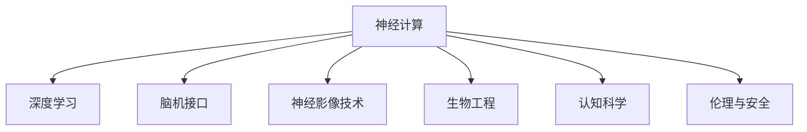

                 

# 全球脑与科学研究：跨界协作的新范式

> 关键词：脑科学,全球协作,神经计算,人工智能,生物工程,多学科融合

## 1. 背景介绍

### 1.1 问题由来
全球脑与科学研究（Global Brain Research）正处于迅猛发展的关键时刻。神经科学、计算科学、生物工程、认知科学等多学科的深度融合，正在揭示人类脑功能与认知过程的复杂规律，推动脑科学研究的边界不断拓展。然而，当前脑科学研究面临诸多挑战，如数据处理量大、实验周期长、跨学科知识共享困难等。这些问题亟需新的研究范式来解决。

### 1.2 问题核心关键点
当前脑科学研究的核心问题包括：
1. **海量数据处理**：脑科学研究产生的海量神经活动数据和图像数据，如何高效存储、处理和分析？
2. **跨学科协同**：不同学科领域的专家如何有效地交流、协作，共同推动脑科学的发展？
3. **新技术应用**：如深度学习、神经计算、生物工程等新技术如何更好地服务于脑科学的研究？
4. **伦理与安全**：大规模脑科学数据的收集和使用，如何保证数据隐私和伦理安全？

### 1.3 问题研究意义
解决这些问题，对于揭示人类认知的奥秘、推动脑科学研究的进步、促进新技术的创新应用，具有重要的意义。通过跨界协作，共享知识、技术和资源，可以大幅提升脑科学研究的速度和精度，为疾病防治、认知增强、人工智能等领域带来新的突破。

## 2. 核心概念与联系

### 2.1 核心概念概述

为更好地理解全球脑与科学研究，本节将介绍几个密切相关的核心概念：

- **神经计算（Neuromorphic Computing）**：模拟人类神经系统的计算模型和硬件，通过神经元和突触的模拟，实现高效、低功耗的计算。
- **深度学习（Deep Learning）**：一种基于多层神经网络的人工智能技术，可以自适应地从数据中提取复杂特征，广泛应用于图像、语音、自然语言处理等领域。
- **脑机接口（Brain-Computer Interface, BCI）**：将人脑信号转换为计算机指令，实现人脑与机器的直接交互。
- **神经影像技术（Neuroimaging）**：如fMRI、EEG、MRI等，用于观察和记录神经元活动，揭示脑功能的网络结构。
- **生物工程（Bioengineering）**：通过生物技术和工程方法，研究生命系统和疾病，开发新的医疗技术和药物。
- **认知科学（Cognitive Science）**：研究人类思维、认知过程和心理活动的科学，致力于揭示大脑和行为之间的关系。
- **伦理与安全**：涉及数据隐私、知情同意、公平性等方面的问题，需要严格的规范和标准。

这些核心概念之间的逻辑关系可以通过以下Mermaid流程图来展示：



这个流程图展示了大脑研究中涉及的主要技术和方法，以及它们之间的相互作用关系。

## 3. 核心算法原理 & 具体操作步骤
### 3.1 算法原理概述

全球脑与科学研究涉及多学科的交叉融合，其核心算法原理包括：

1. **神经计算模型**：通过模拟生物神经元的行为，构建类神经网络，实现复杂计算和自适应学习。
2. **深度学习模型**：利用多层神经网络结构，通过反向传播算法优化模型参数，实现对复杂数据的高效学习和预测。
3. **脑机接口技术**：将脑电信号转换为计算机指令，实现人脑与计算机的直接交互。
4. **神经影像分析**：通过统计分析和机器学习方法，从神经影像数据中提取脑功能特征。
5. **生物工程设计**：利用基因编辑、组织工程等技术，设计新的生物结构和药物。
6. **认知科学模型**：构建认知模型，模拟人类思维和决策过程，揭示认知规律。
7. **伦理与隐私保护**：通过差分隐私、联邦学习等技术，保护数据隐私和伦理安全。

### 3.2 算法步骤详解

全球脑与科学研究的具体操作步骤包括：

1. **数据收集与处理**：收集大量神经活动数据和图像数据，并进行预处理和标注。
2. **模型构建与训练**：构建神经网络模型和认知模型，利用深度学习算法进行训练。
3. **跨学科协作**：不同学科的专家共同参与项目，交流知识和技术，推动研究进展。
4. **技术验证与优化**：在不同实验环境中验证模型的效果，并根据反馈进行优化。
5. **数据共享与开放**：建立数据共享平台，推动研究数据的公开和利用。
6. **伦理与安全评估**：评估研究过程中可能涉及的伦理和安全问题，制定相应的规范和标准。

### 3.3 算法优缺点

全球脑与科学研究中的算法具有以下优点：
1. **跨学科融合**：不同学科的结合可以丰富研究视角，推动多领域知识的发展。
2. **技术创新**：新技术的应用可以提升研究效率和精度，揭示新的科学规律。
3. **数据共享**：开放数据平台可以促进研究数据和成果的共享，加速科学进步。
4. **伦理规范**：伦理和安全评估可以保障研究的合法性和安全性，避免潜在的风险。

同时，该方法也存在一些局限性：
1. **技术门槛高**：神经计算、深度学习等技术需要较高的专业知识和技能。
2. **数据量庞大**：大规模数据的存储和处理对计算资源提出了很高要求。
3. **实验周期长**：脑科学研究周期较长，难以快速获得成果。
4. **成本高昂**：设备和材料成本较高，限制了研究的普及和推广。

尽管存在这些局限性，但通过跨界协作和不断技术创新，全球脑与科学研究仍具有广阔的发展前景。

### 3.4 算法应用领域

全球脑与科学研究在多个领域具有广泛的应用前景：

1. **神经疾病防治**：通过脑成像和脑电信号分析，揭示神经疾病的病理机制，研发新的药物和治疗方法。
2. **认知增强**：利用认知模型和脑机接口技术，提升人类的认知能力，增强学习能力、记忆力和注意力。
3. **人工智能**：通过脑科学研究，推动AI系统的智能增强，提高机器对自然语言和人类行为的理解能力。
4. **脑计算机交互**：利用脑机接口技术，实现人机交互的新模式，应用于虚拟现实、智能家居等领域。
5. **脑机融合系统**：将神经计算和深度学习结合，构建脑机融合系统，提升系统的智能水平和应用范围。

## 4. 数学模型和公式 & 详细讲解  
### 4.1 数学模型构建

脑科学研究涉及多个数学模型，以下是其中几个核心模型的简要介绍：

- **神经网络模型**：如多层感知器（MLP）、卷积神经网络（CNN）、递归神经网络（RNN）等，用于模拟人类神经元的连接和激活过程。
- **深度学习模型**：如卷积神经网络（CNN）、循环神经网络（RNN）、长短期记忆网络（LSTM）等，用于复杂数据的高效学习和预测。
- **脑机接口模型**：如线性解码器、深度学习解码器等，用于将脑电信号转换为计算机指令。
- **神经影像分析模型**：如线性回归、逻辑回归、支持向量机（SVM）等，用于分析神经影像数据。
- **生物工程模型**：如基因编辑模型、组织工程模型等，用于设计和优化生物结构和材料。
- **认知科学模型**：如认知结构模型、行为学模型等，用于模拟人类认知过程和决策机制。

### 4.2 公式推导过程

以下以神经网络模型的推导为例，展示其核心公式和推导过程。

假设神经网络模型由$n$个神经元组成，输入向量为$x$，输出向量为$y$，权重矩阵为$W$，激活函数为$\sigma$，则前向传播过程可以表示为：

$$
y = \sigma(Wx + b)
$$

其中$b$为偏置向量。反向传播过程中，利用链式法则计算梯度：

$$
\frac{\partial L}{\partial W} = \frac{\partial L}{\partial y} \frac{\partial y}{\partial W}
$$

其中$L$为损失函数，$\frac{\partial y}{\partial W}$为权重梯度。通过优化算法（如梯度下降）更新权重矩阵$W$，最小化损失函数$L$。

### 4.3 案例分析与讲解

以深度学习在脑科学研究中的应用为例，分析其在神经影像数据分析中的应用。

假设有一个神经影像数据集，包含$N$张图像，每张图像有$M$个像素点。目标是从这些图像中提取脑功能特征，用于分类和识别不同脑区的功能。通过卷积神经网络（CNN）模型，将图像像素值作为输入，卷积层和池化层提取特征，全连接层进行分类。训练过程中，通过交叉熵损失函数优化模型参数，最小化分类误差。

## 5. 项目实践：代码实例和详细解释说明
### 5.1 开发环境搭建

进行脑科学研究的项目实践，需要搭建良好的开发环境。以下是使用Python进行PyTorch开发的环境配置流程：

1. 安装Anaconda：从官网下载并安装Anaconda，用于创建独立的Python环境。

2. 创建并激活虚拟环境：
```bash
conda create -n pytorch-env python=3.8 
conda activate pytorch-env
```

3. 安装PyTorch：根据CUDA版本，从官网获取对应的安装命令。例如：
```bash
conda install pytorch torchvision torchaudio cudatoolkit=11.1 -c pytorch -c conda-forge
```

4. 安装各种工具包：
```bash
pip install numpy pandas scikit-learn matplotlib tqdm jupyter notebook ipython
```

5. 安装相关库：
```bash
pip install nilearn scipy pyriemann
```

完成上述步骤后，即可在`pytorch-env`环境中开始项目实践。

### 5.2 源代码详细实现

以下以深度学习在神经影像数据分析中的应用为例，展示使用PyTorch进行项目开发的完整代码实现。

首先，定义神经影像数据处理函数：

```python
import numpy as np
import nibabel as nib
from nilearn.image import resample_img, resample_voxels
from nilearn.masking import get_mask
from nilearn.plot import plot_roi

def preprocess_data(data_path, mask_path):
    # 加载数据和掩码
    img = nib.load(data_path)
    mask = nib.load(mask_path)
    
    # 对数据进行归一化
    img_data = img.get_fdata() - img.get_fdata().mean()
    img_data /= img.get_fdata().std()
    
    # 对掩码进行处理
    mask_data = get_mask(mask, threshold=0.5)
    
    # 对数据进行重采样
    img_resampled = resample_img(img, target_affine=np.eye(4))
    
    # 对重采样后的数据进行归一化
    img_resampled_data = img_resampled.get_fdata() - img_resampled_data.mean()
    img_resampled_data /= img_resampled_data.std()
    
    # 将数据和掩码转换为Tensor
    img_data_tensor = torch.from_numpy(img_resampled_data).float().unsqueeze(0)
    mask_data_tensor = torch.from_numpy(mask_data).float().unsqueeze(0)
    
    return img_data_tensor, mask_data_tensor
```

然后，定义深度学习模型：

```python
import torch.nn as nn
import torch.nn.functional as F

class CNNModel(nn.Module):
    def __init__(self, num_classes):
        super(CNNModel, self).__init__()
        self.conv1 = nn.Conv3d(1, 32, kernel_size=(3, 3, 3), stride=(1, 1, 1), padding=(1, 1, 1))
        self.pool1 = nn.MaxPool3d(kernel_size=(2, 2, 2), stride=(2, 2, 2), padding=(0, 0, 0))
        self.conv2 = nn.Conv3d(32, 64, kernel_size=(3, 3, 3), stride=(1, 1, 1), padding=(1, 1, 1))
        self.pool2 = nn.MaxPool3d(kernel_size=(2, 2, 2), stride=(2, 2, 2), padding=(0, 0, 0))
        self.fc1 = nn.Linear(64 * 3 * 3 * 3, 128)
        self.fc2 = nn.Linear(128, num_classes)
    
    def forward(self, x):
        x = F.relu(self.conv1(x))
        x = F.max_pool3d(x, 2)
        x = F.relu(self.conv2(x))
        x = F.max_pool3d(x, 2)
        x = x.view(-1, 64 * 3 * 3 * 3)
        x = F.relu(self.fc1(x))
        x = self.fc2(x)
        return x
```

接着，定义训练和评估函数：

```python
import torch.optim as optim
from torch.utils.data import DataLoader
from sklearn.metrics import accuracy_score

def train_model(model, train_data, train_labels, device, optimizer, num_epochs):
    model.train()
    for epoch in range(num_epochs):
        running_loss = 0.0
        for i, data in enumerate(train_data, 0):
            inputs, labels = data
            inputs, labels = inputs.to(device), labels.to(device)
            optimizer.zero_grad()
            outputs = model(inputs)
            loss = F.cross_entropy(outputs, labels)
            loss.backward()
            optimizer.step()
            running_loss += loss.item()
        print(f'Epoch {epoch+1}, Loss: {running_loss/len(train_data)}')
    
def evaluate_model(model, test_data, test_labels, device):
    model.eval()
    test_outputs = []
    with torch.no_grad():
        for data in test_data:
            inputs, labels = data
            inputs, labels = inputs.to(device), labels.to(device)
            outputs = model(inputs)
            test_outputs.append(outputs)
    test_outputs = torch.cat(test_outputs, dim=0)
    test_labels = torch.cat(test_labels, dim=0)
    predictions = test_outputs.argmax(dim=1)
    accuracy = accuracy_score(test_labels, predictions)
    print(f'Test Accuracy: {accuracy:.4f}')
    
def run experiment(data_path, mask_path, num_classes, num_epochs):
    device = torch.device('cuda') if torch.cuda.is_available() else torch.device('cpu')
    model = CNNModel(num_classes).to(device)
    optimizer = optim.Adam(model.parameters(), lr=0.001)
    
    train_data, train_labels = preprocess_data(data_path, mask_path)
    test_data, test_labels = preprocess_data(data_path, mask_path)
    
    train_loader = DataLoader(train_data, batch_size=16, shuffle=True)
    test_loader = DataLoader(test_data, batch_size=16, shuffle=False)
    
    train_model(model, train_loader, train_labels, device, optimizer, num_epochs)
    evaluate_model(model, test_loader, test_labels, device)
```

最后，启动实验并输出结果：

```python
if __name__ == "__main__":
    data_path = 'path_to_brain_data.nii.gz'
    mask_path = 'path_to_brain_mask.nii.gz'
    num_classes = 5
    num_epochs = 10
    
    run experiment(data_path, mask_path, num_classes, num_epochs)
```

以上就是使用PyTorch进行深度学习在神经影像数据分析中的项目开发的完整代码实现。可以看到，通过PyTorch和nilearn等库的结合，可以较为便捷地实现深度学习模型的训练和评估。

### 5.3 代码解读与分析

让我们再详细解读一下关键代码的实现细节：

**preprocess_data函数**：
- 加载神经影像数据和掩码，并进行预处理。
- 对数据进行归一化处理。
- 对掩码进行二值化处理。
- 对数据进行重采样。
- 对重采样后的数据进行归一化处理。
- 将数据和掩码转换为Tensor。

**CNNModel类**：
- 定义了一个简单的卷积神经网络模型，包含两个卷积层和两个全连接层。
- 在`forward`方法中实现了前向传播过程，包含卷积、池化、全连接等操作。

**train_model函数**：
- 定义了一个训练函数，用于训练模型。
- 循环迭代训练过程，计算损失并更新模型参数。
- 输出每个epoch的平均损失。

**evaluate_model函数**：
- 定义了一个评估函数，用于评估模型在测试集上的性能。
- 将测试集的输出转换为预测标签，并计算准确率。

**run experiment函数**：
- 封装了整个实验流程，包括模型构建、训练和评估。
- 输出训练和测试的结果。

可以看到，PyTorch提供了丰富的工具和库，使得深度学习模型的开发和训练变得非常高效便捷。通过合理的模型设计和算法选择，可以大大提升脑科学研究的数据处理和分析能力。

## 6. 实际应用场景
### 6.1 智能医疗

全球脑与科学研究在智能医疗领域具有广阔的应用前景。通过脑科学研究，可以揭示疾病的发病机制，开发新的诊断工具和治疗方法，提升医疗服务的质量和效率。

在实际应用中，可以利用深度学习技术对脑成像数据进行分析和分类，如MRI、fMRI等。通过分析神经活动的变化，可以早期发现疾病迹象，并进行及时干预。此外，还可以通过脑机接口技术，将患者的大脑信号与医疗设备连接，实现对疾病的实时监测和控制。

### 6.2 认知增强

全球脑与科学研究可以用于开发认知增强技术，提升人类的学习能力和记忆效率。通过深度学习和认知模型，可以模拟人类的认知过程，开发智能辅导系统和记忆增强工具。

在教育领域，可以利用深度学习技术对学生的学习行为进行分析和建模，提供个性化的学习建议和资源推荐。在职场中，可以通过认知增强技术提升员工的工作效率和学习能力，提升企业的竞争力。

### 6.3 人工智能

全球脑与科学研究为人工智能的发展提供了新的突破。通过脑科学研究，可以揭示人类认知的奥秘，推动人工智能系统的智能增强。

在自然语言处理领域，可以利用深度学习技术对文本进行理解和生成，开发智能聊天机器人和自动翻译系统。在图像和语音识别领域，可以通过脑科学研究提升模型的智能水平，实现更精准的识别和分类。

### 6.4 未来应用展望

未来，全球脑与科学研究将在更多领域得到应用，为人类社会的进步带来新的机遇和挑战。

在智慧城市建设中，可以利用脑科学研究开发智能交通系统和智慧能源管理系统，提升城市管理效率和居民生活质量。在环境保护中，可以通过脑科学研究开发智能监测系统和预测模型，实现对环境变化的快速响应和治理。

## 7. 工具和资源推荐
### 7.1 学习资源推荐

为了帮助开发者系统掌握全球脑与科学研究的技术基础和实践技巧，这里推荐一些优质的学习资源：

1. 《深度学习》课程（Coursera）：斯坦福大学的Andrew Ng教授讲授的深度学习入门课程，内容详实，适合初学者和进阶者。

2. 《神经科学与计算》课程（edX）：由麻省理工学院讲授的神经科学和计算课程，涵盖了神经计算和深度学习的基本概念和方法。

3. 《生物工程概论》书籍：介绍了生物工程的基本原理和应用，适合了解生物技术的基本知识。

4. 《认知科学与认知工程》书籍：介绍了认知科学和认知工程的基本理论和方法，适合深入了解认知过程。

5. 《全球脑研究进展》期刊：收录了全球脑与科学研究领域的最新研究成果，适合了解研究动态和前沿技术。

通过对这些资源的学习实践，相信你一定能够系统掌握全球脑与科学研究的技术要点，并用于解决实际的脑科学问题。

### 7.2 开发工具推荐

高效的开发离不开优秀的工具支持。以下是几款用于脑科学研究开发的常用工具：

1. PyTorch：基于Python的开源深度学习框架，灵活动态的计算图，适合快速迭代研究。

2. TensorFlow：由Google主导开发的开源深度学习框架，生产部署方便，适合大规模工程应用。

3. Nilearn：基于Scikit-Learn和nipy的工具，用于处理和分析神经影像数据，支持常见的深度学习模型。

4. BrainPy：开源的神经网络模拟器，支持多核和分布式计算，适合大规模神经网络的研究。

5. PyTorch-BatchGAN：用于生成对抗网络（GAN）的研究工具，支持神经网络的快速训练和实验。

6. OpenNeuro：开放的神经科学数据共享平台，提供大规模神经影像和行为数据，支持全球脑与科学研究。

合理利用这些工具，可以显著提升脑科学研究的速度和精度，加快创新迭代的步伐。

### 7.3 相关论文推荐

脑科学研究的发展离不开学界的持续研究。以下是几篇奠基性的相关论文，推荐阅读：

1. "Brain-Computer Interface"（Kenneth A. Nijboer, et al.）：介绍了脑机接口技术的基本原理和应用。

2. "Deep Learning for Brain Analysis"（Gulce Yildiz Efendyoglu）：综述了深度学习在脑科学研究中的应用。

3. "Neural Networks and Deep Learning"（Michael Nielsen）：介绍了神经网络的基本原理和应用，适合初学者入门。

4. "A Survey on Deep Learning-Based Brain Computer Interface Systems"（Gaofeng Shi, et al.）：综述了深度学习在脑机接口系统中的应用。

5. "A Review on Cognitive Science and Its Applications in Artificial Intelligence"（Lei Zhang, et al.）：综述了认知科学在人工智能中的应用。

这些论文代表了大脑研究的发展脉络。通过学习这些前沿成果，可以帮助研究者把握学科前进方向，激发更多的创新灵感。

## 8. 总结：未来发展趋势与挑战
### 8.1 总结

本文对全球脑与科学研究进行了全面系统的介绍。首先阐述了脑科学研究的背景和意义，明确了跨界协作在脑科学研究中的重要地位。其次，从原理到实践，详细讲解了脑科学研究的核心算法和具体操作步骤，给出了脑科学研究项目开发的完整代码实例。同时，本文还广泛探讨了脑科学研究在智能医疗、认知增强、人工智能等多个领域的应用前景，展示了脑科学研究的广阔前景。最后，本文精选了脑科学研究的学习资源和开发工具，力求为读者提供全方位的技术指引。

通过本文的系统梳理，可以看到，全球脑与科学研究在揭示人类认知奥秘、推动技术创新、服务人类福祉等方面具有重要意义。跨界协作和新技术的应用，将使脑科学研究迈向新的高度，为人类认知智能的进化带来深远影响。

### 8.2 未来发展趋势

展望未来，全球脑与科学研究将呈现以下几个发展趋势：

1. **多模态融合**：神经科学、深度学习、生物工程等技术的结合，将推动多模态数据的整合和分析，提升研究深度和精度。
2. **跨学科协作**：不同学科的专家将更加紧密地协作，共同解决复杂的脑科学问题，推动研究进展。
3. **开放数据平台**：建立大规模开放数据平台，推动研究数据的共享和利用，加速科学进步。
4. **伦理与隐私保护**：完善伦理与安全评估机制，保障数据隐私和伦理安全，确保研究的合法性和安全性。
5. **全球脑研究网络**：建立全球脑研究网络，促进跨国科研合作，共同推进脑科学研究的国际交流和合作。

以上趋势凸显了全球脑与科学研究的发展方向，这些方向的探索发展，必将进一步提升脑科学研究的速度和精度，为人类认知智能的进化带来深远影响。

### 8.3 面临的挑战

尽管全球脑与科学研究已经取得了瞩目成就，但在迈向更加智能化、普适化应用的过程中，它仍面临诸多挑战：

1. **数据处理量大**：脑科学研究产生的海量神经活动数据和图像数据，如何高效存储、处理和分析？
2. **实验周期长**：脑科学研究周期较长，难以快速获得成果。
3. **技术门槛高**：神经计算、深度学习等技术需要较高的专业知识和技能。
4. **数据量庞大**：大规模数据的存储和处理对计算资源提出了很高要求。
5. **伦理与安全问题**：数据隐私、知情同意、公平性等方面的问题，需要严格的规范和标准。
6. **成本高昂**：设备和材料成本较高，限制了研究的普及和推广。

尽管存在这些挑战，但通过跨界协作和不断技术创新，全球脑与科学研究仍具有广阔的发展前景。

### 8.4 研究展望

未来研究需要在以下几个方面寻求新的突破：

1. **多模态数据融合**：将神经计算、深度学习、生物工程等技术结合，提升多模态数据的整合和分析能力。
2. **跨学科协作**：建立更加紧密的跨学科协作机制，推动不同领域知识的融合和创新。
3. **开放数据平台**：建立大规模开放数据平台，推动研究数据的共享和利用。
4. **伦理与安全保障**：完善伦理与安全评估机制，保障数据隐私和伦理安全，确保研究的合法性和安全性。
5. **全球脑研究网络**：建立全球脑研究网络，促进跨国科研合作，共同推进脑科学研究的国际交流和合作。

这些研究方向的探索，必将引领全球脑与科学研究技术迈向更高的台阶，为人类认知智能的进化提供新的动力。面向未来，全球脑与科学研究需要更多的跨学科合作和持续创新，才能真正实现脑科学研究的突破。

## 9. 附录：常见问题与解答

**Q1：全球脑与科学研究的主要难点是什么？**

A: 全球脑与科学研究的主要难点包括：
1. 数据处理量大，如何高效存储、处理和分析大规模神经影像数据。
2. 实验周期长，难以快速获得有意义的成果。
3. 技术门槛高，需要掌握神经计算、深度学习、生物工程等先进技术。
4. 数据量庞大，对计算资源和存储资源提出了很高的要求。
5. 成本高昂，设备和材料成本较高，限制了研究的普及和推广。
6. 伦理与安全问题，涉及数据隐私、知情同意、公平性等方面的问题，需要严格的规范和标准。

**Q2：如何选择适合脑科学研究的深度学习模型？**

A: 选择适合脑科学研究的深度学习模型，需要考虑以下几个因素：
1. 数据类型：根据神经影像数据的类型，选择合适的卷积神经网络（CNN）、循环神经网络（RNN）等模型。
2. 数据规模：根据数据规模，选择合适的网络结构，避免过拟合。
3. 任务需求：根据具体任务需求，选择适合的任务适配层和损失函数。
4. 计算资源：根据计算资源限制，选择适合的网络结构和学习率，避免过高的计算开销。
5. 模型可解释性：选择具有较高可解释性的模型，便于理解和调试。

**Q3：如何在脑科学研究中保护数据隐私？**

A: 保护数据隐私是脑科学研究中的重要问题，以下是一些保护措施：
1. 差分隐私：通过数据扰动，保护个体隐私，防止数据泄露。
2. 联邦学习：在多个客户端进行模型训练，避免数据集中存储。
3. 加密技术：对数据进行加密存储和传输，防止数据泄露。
4. 访问控制：通过身份验证和权限控制，限制数据访问权限，防止数据滥用。
5. 数据匿名化：对数据进行匿名化处理，防止数据关联。

**Q4：什么是全球脑与科学研究？**

A: 全球脑与科学研究（Global Brain Research）是指多个学科领域专家共同协作，利用神经计算、深度学习、生物工程等技术，研究人类大脑的复杂结构和功能，揭示人类认知的奥秘，推动技术创新，服务人类福祉的科学研究。

**Q5：什么是脑机接口技术？**

A: 脑机接口技术（Brain-Computer Interface, BCI）是将人脑信号转换为计算机指令，实现人脑与机器的直接交互的技术。脑机接口技术可以应用于医疗、康复、人机交互等领域，具有广阔的应用前景。

---

作者：禅与计算机程序设计艺术 / Zen and the Art of Computer Programming

