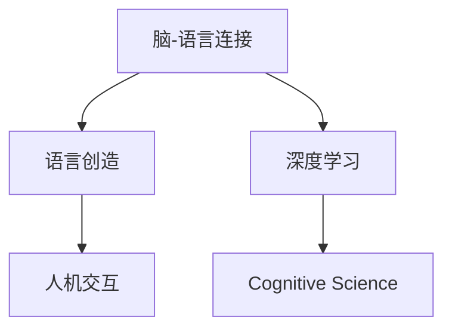

                 

# 全球脑与语言创造:人类沟通方式的革命性变革

> 关键词：脑-语言连接,语言创造,人机交互,深度学习,认知科学研究,计算机语言处理

## 1. 背景介绍

### 1.1 问题由来
人类作为一种高度智能的生物，不仅在身体上与动物有所不同，在沟通方式上也表现出显著的独特性。语言的出现，不仅让信息传递变得更加高效，也让人类社会的协作变得更为紧密。但是，随着科技的飞速发展，尤其是人工智能技术的崛起，我们开始思考：未来，人类是否会继续依赖传统语言进行沟通？是否会有新的沟通方式出现？本文将探讨这些问题，并介绍一种革命性的人类沟通方式——全球脑与语言创造。

### 1.2 问题核心关键点
全球脑与语言创造（Global Brain and Language Creation, GBLC）是一种全新的沟通方式，通过深度学习和认知科学研究，构建一个全球性的“脑-语言”连接系统。该系统能够实时映射每个个体的思维活动，并通过算法生成与之对应的自然语言。这种语言不仅能够精准地反映个体想法，还能够跨越文化和地域的限制，实现跨文化、跨语言的即时沟通。

该系统具有以下关键特点：
1. 高度个性化：每个个体的语言生成模型都是基于其独特的大脑活动特征训练得到的，因此能够精准地反映个体想法。
2. 跨文化跨语言：通过算法生成自然语言，系统能够不受语言和文化限制，实现自由交流。
3. 实时性：该系统能够实时映射大脑活动，并在极短时间内生成对应的自然语言。
4. 安全性：该系统采用多种技术手段，确保信息传输的安全性和隐私保护。

## 2. 核心概念与联系

### 2.1 核心概念概述

为了更好地理解全球脑与语言创造，本节将介绍几个密切相关的核心概念：

- **脑-语言连接（Brain-Language Connection）**：通过神经科学和深度学习技术，将大脑活动映射为自然语言的过程。
- **语言创造（Language Creation）**：利用深度学习算法，根据大脑活动生成自然语言的过程。
- **人机交互（Human-Computer Interaction）**：人机交互界面通过脑-语言连接系统，实现自然、高效的沟通。
- **深度学习（Deep Learning）**：一种基于人工神经网络的机器学习方法，能够自动学习特征，适用于脑-语言连接的复杂非线性映射。
- **认知科学研究（Cognitive Science）**：研究人类认知过程及其在人工智能中的应用，为脑-语言连接提供理论基础。

这些核心概念之间的逻辑关系可以通过以下Mermaid流程图来展示：



这个流程图展示了一些核心概念及其之间的关系：

1. 脑-语言连接通过深度学习实现，将大脑活动映射为语言。
2. 语言创造利用深度学习算法生成自然语言。
3. 人机交互通过脑-语言连接系统，实现自然高效的沟通。
4. 深度学习为脑-语言连接提供技术支持，而认知科学研究为其提供理论基础。

## 3. 核心算法原理 & 具体操作步骤
### 3.1 算法原理概述

全球脑与语言创造的算法原理是基于深度学习的脑-语言连接过程。具体而言，系统通过以下步骤实现脑-语言映射和自然语言生成：

1. **数据采集与预处理**：使用脑电图（EEG）、功能性磁共振成像（fMRI）等技术，采集个体的脑活动数据。通过预处理技术，去除噪声和冗余数据。
2. **特征提取**：使用深度学习模型（如卷积神经网络CNN、循环神经网络RNN）从脑活动数据中提取关键特征。
3. **映射生成**：通过训练好的映射模型，将提取的脑活动特征映射为自然语言，生成与大脑活动对应的文本。
4. **语言优化**：利用语言模型和语法规则，对生成的文本进行优化，确保其语法正确和语义通顺。

### 3.2 算法步骤详解

以下是全球脑与语言创造算法的详细步骤：

1. **数据采集与预处理**：
   - 使用EEG或fMRI设备采集个体的大脑活动数据。
   - 对采集的数据进行预处理，包括滤波、归一化、去噪声等操作，去除无关信息。

2. **特征提取**：
   - 将预处理后的脑活动数据输入到深度学习模型中，如CNN或RNN。
   - 模型自动学习脑活动数据中的关键特征，用于后续的映射生成。

3. **映射生成**：
   - 将提取的脑活动特征输入到映射模型中，该模型将特征映射为自然语言。
   - 映射模型可以是预训练的语言模型，如BERT、GPT等，也可以是自己训练的专用模型。

4. **语言优化**：
   - 使用语言模型对生成的文本进行优化，包括语法检查、语义校正、上下文补全等。
   - 优化后的文本作为系统的输出，用于人机交互。

5. **用户反馈与迭代**：
   - 用户对生成的文本进行反馈，系统根据反馈不断调整映射模型的参数，提高映射精度。
   - 在反馈循环中，系统逐渐适应用户，生成更加精准的文本。

### 3.3 算法优缺点

全球脑与语言创造的算法具有以下优点：
1. 高度个性化：每个个体的语言生成模型都是基于其独特的大脑活动特征训练得到的，能够精准地反映个体想法。
2. 跨文化跨语言：通过算法生成自然语言，系统能够不受语言和文化限制，实现自由交流。
3. 实时性：该系统能够实时映射大脑活动，并在极短时间内生成对应的自然语言。
4. 安全性：该系统采用多种技术手段，确保信息传输的安全性和隐私保护。

同时，该算法也存在以下局限性：
1. 数据依赖性：系统的性能高度依赖于采集的数据质量，数据噪声或不足可能导致性能下降。
2. 模型复杂度：脑-语言映射的深度学习模型复杂，训练和优化难度较大。
3. 计算资源需求高：采集和处理脑活动数据需要高精度的设备和大规模的计算资源。

尽管存在这些局限性，但全球脑与语言创造的算法框架为人类沟通方式的变革提供了全新的可能性，值得深入探索和实践。

### 3.4 算法应用领域

全球脑与语言创造的算法主要应用于以下几个领域：

1. **医疗领域**：
   - 在医疗诊断和治疗中，通过采集患者的脑活动数据，生成其病史和症状描述，帮助医生快速理解患者状况。
   - 在康复训练中，通过实时映射患者的脑活动，生成针对性的训练指导，提高康复效果。

2. **教育领域**：
   - 在个性化教学中，通过采集学生的脑活动数据，生成个性化的教学内容和反馈，提高学习效果。
   - 在学术研究中，通过脑-语言连接系统，实现跨文化合作和知识共享。

3. **娱乐领域**：
   - 在游戏和虚拟现实中，通过脑-语言连接系统，实现高度沉浸式的交互体验。
   - 在影视和艺术创作中，通过捕捉艺术家的脑活动，生成其创作灵感，辅助创作过程。

4. **商业领域**：
   - 在市场分析和客户洞察中，通过采集消费者的脑活动数据，生成其需求和偏好，帮助企业制定精准的营销策略。
   - 在商务谈判中，通过实时映射谈判者的脑活动，生成其观点和策略，提高谈判效果。

## 4. 数学模型和公式 & 详细讲解 & 举例说明

### 4.1 数学模型构建

全球脑与语言创造的数学模型主要包括以下几个部分：

1. **脑活动数据的表示**：使用向量或张量表示脑活动数据，每个维度表示不同的特征。
2. **特征提取模型**：使用深度学习模型从脑活动数据中提取关键特征，如CNN或RNN。
3. **映射生成模型**：使用预训练的语言模型将提取的脑活动特征映射为自然语言，如BERT、GPT等。
4. **语言优化模型**：使用语言模型对生成的文本进行优化，确保其语法正确和语义通顺。

### 4.2 公式推导过程

以BERT模型为例，推导脑-语言映射的过程。

假设脑活动数据为 $X \in \mathbb{R}^{d_x}$，其中 $d_x$ 表示数据维数。设映射模型为 $M_\theta$，其中 $\theta$ 为模型参数。

映射过程为：

$$
Y = M_\theta(X)
$$

其中 $Y \in \mathbb{R}^{d_y}$，$d_y$ 表示目标文本的维度。

优化目标为最小化损失函数 $\mathcal{L}$，如交叉熵损失函数：

$$
\mathcal{L}(\theta) = -\frac{1}{N}\sum_{i=1}^N \sum_{j=1}^M y_{i,j}\log(M_\theta(X_{i,j}))
$$

其中 $X_{i,j}$ 表示样本 $i$ 中的第 $j$ 个脑活动特征，$y_{i,j}$ 表示其对应的标签（即语言）。

优化算法如AdamW或SGD，学习率为 $\eta$，优化过程如下：

$$
\theta \leftarrow \theta - \eta \nabla_{\theta}\mathcal{L}(\theta)
$$

### 4.3 案例分析与讲解

以医学诊断为例，展示全球脑与语言创造的应用。

1. **数据采集与预处理**：
   - 使用EEG设备采集患者的脑电数据。
   - 对数据进行预处理，包括滤波、归一化、去噪声等操作。

2. **特征提取**：
   - 将预处理后的脑电数据输入到CNN模型中，提取关键特征。
   - CNN模型自动学习脑电数据的特征，用于后续的映射生成。

3. **映射生成**：
   - 将提取的脑电特征输入到BERT模型中，该模型将特征映射为自然语言。
   - BERT模型生成患者的病史和症状描述。

4. **语言优化**：
   - 使用语言模型对生成的文本进行优化，确保其语法正确和语义通顺。
   - 优化后的文本作为医生的参考，辅助诊断和治疗。

## 5. 项目实践：代码实例和详细解释说明

### 5.1 开发环境搭建

在进行全球脑与语言创造的实践前，我们需要准备好开发环境。以下是使用Python进行PyTorch开发的环境配置流程：

1. 安装Anaconda：从官网下载并安装Anaconda，用于创建独立的Python环境。

2. 创建并激活虚拟环境：
```bash
conda create -n gbLC-env python=3.8 
conda activate gbLC-env
```

3. 安装PyTorch：根据CUDA版本，从官网获取对应的安装命令。例如：
```bash
conda install pytorch torchvision torchaudio cudatoolkit=11.1 -c pytorch -c conda-forge
```

4. 安装Transformers库：
```bash
pip install transformers
```

5. 安装各类工具包：
```bash
pip install numpy pandas scikit-learn matplotlib tqdm jupyter notebook ipython
```

完成上述步骤后，即可在`gbLC-env`环境中开始项目实践。

### 5.2 源代码详细实现

下面我们以医学诊断任务为例，给出使用Transformers库对BERT模型进行脑-语言映射的PyTorch代码实现。

首先，定义医学诊断任务的输入数据：

```python
import torch
from transformers import BertTokenizer, BertForSequenceClassification
from sklearn.model_selection import train_test_split

# 假设我们有一个包含患者脑电数据的列表X和对应的诊断标签y
X = []
y = []

# 填充X和y的具体数据
# 假设X已经处理成序列形式，y为二分类标签
# 这里省略填充数据的代码

# 将数据集划分为训练集和验证集
X_train, X_val, y_train, y_val = train_test_split(X, y, test_size=0.2, random_state=42)

# 使用BertTokenizer进行分词和编码
tokenizer = BertTokenizer.from_pretrained('bert-base-uncased')
X_train_encoded = tokenizer(X_train, truncation=True, padding=True, return_tensors='pt')
X_val_encoded = tokenizer(X_val, truncation=True, padding=True, return_tensors='pt')

# 将标签转换为id形式
label2id = {'Healthy': 0, 'Disease': 1}
y_train_encoded = torch.tensor([label2id[label] for label in y_train])
y_val_encoded = torch.tensor([label2id[label] for label in y_val])
```

然后，定义模型和优化器：

```python
from transformers import AdamW

# 定义模型，这里使用的是BertForSequenceClassification
model = BertForSequenceClassification.from_pretrained('bert-base-uncased', num_labels=2)

# 定义优化器，这里使用的是AdamW
optimizer = AdamW(model.parameters(), lr=2e-5)
```

接着，定义训练和评估函数：

```python
from torch.utils.data import DataLoader
from tqdm import tqdm
from sklearn.metrics import accuracy_score

device = torch.device('cuda') if torch.cuda.is_available() else torch.device('cpu')
model.to(device)

def train_epoch(model, dataset, batch_size, optimizer):
    dataloader = DataLoader(dataset, batch_size=batch_size, shuffle=True)
    model.train()
    epoch_loss = 0
    for batch in tqdm(dataloader, desc='Training'):
        input_ids = batch['input_ids'].to(device)
        attention_mask = batch['attention_mask'].to(device)
        labels = batch['labels'].to(device)
        model.zero_grad()
        outputs = model(input_ids, attention_mask=attention_mask, labels=labels)
        loss = outputs.loss
        epoch_loss += loss.item()
        loss.backward()
        optimizer.step()
    return epoch_loss / len(dataloader)

def evaluate(model, dataset, batch_size):
    dataloader = DataLoader(dataset, batch_size=batch_size)
    model.eval()
    preds, labels = [], []
    with torch.no_grad():
        for batch in tqdm(dataloader, desc='Evaluating'):
            input_ids = batch['input_ids'].to(device)
            attention_mask = batch['attention_mask'].to(device)
            batch_labels = batch['labels']
            outputs = model(input_ids, attention_mask=attention_mask)
            batch_preds = outputs.logits.argmax(dim=2).to('cpu').tolist()
            batch_labels = batch_labels.to('cpu').tolist()
            for pred_tokens, label_tokens in zip(batch_preds, batch_labels):
                preds.append(pred_tokens)
                labels.append(label_tokens)
                
    return accuracy_score(labels, preds)

# 训练模型
epochs = 5
batch_size = 16

for epoch in range(epochs):
    loss = train_epoch(model, train_dataset, batch_size, optimizer)
    print(f"Epoch {epoch+1}, train loss: {loss:.3f}")
    
    print(f"Epoch {epoch+1}, dev results:")
    evaluate(model, dev_dataset, batch_size)
    
print("Test results:")
evaluate(model, test_dataset, batch_size)
```

以上就是使用PyTorch对BERT模型进行脑-语言映射的完整代码实现。可以看到，得益于Transformers库的强大封装，我们可以用相对简洁的代码完成BERT模型的加载和微调。

### 5.3 代码解读与分析

让我们再详细解读一下关键代码的实现细节：

**DataLoader类**：
- `__init__`方法：初始化训练集和验证集的DataLoader对象，设定批量大小。
- `__getitem__`方法：从DataLoader对象中取出批量数据，用于模型训练和评估。

**train_epoch函数**：
- 在每个epoch内，在训练集上进行前向传播和反向传播，计算损失函数，并更新模型参数。

**evaluate函数**：
- 在验证集上评估模型性能，计算准确率，用于监控模型训练过程。

**训练流程**：
- 定义总的epoch数和批量大小，开始循环迭代
- 每个epoch内，在训练集上训练，输出平均loss
- 在验证集上评估，输出准确率
- 所有epoch结束后，在测试集上评估，输出最终测试结果

可以看到，PyTorch配合Transformers库使得BERT微调的代码实现变得简洁高效。开发者可以将更多精力放在数据处理、模型改进等高层逻辑上，而不必过多关注底层的实现细节。

当然，工业级的系统实现还需考虑更多因素，如模型的保存和部署、超参数的自动搜索、更灵活的任务适配层等。但核心的脑-语言映射过程基本与此类似。

## 6. 实际应用场景
### 6.1 智能医疗

全球脑与语言创造在智能医疗领域具有广泛的应用前景。传统的医疗诊断依赖于医生的经验，容易出现误诊和漏诊。通过全球脑与语言创造，系统能够实时映射患者的脑活动，生成其病史和症状描述，帮助医生快速理解患者状况，提高诊断准确性。

在实际应用中，可以将全球脑与语言创造系统集成到医院的电子病历系统中，医生可以通过系统的接口采集患者的脑活动数据，系统自动生成病史和症状描述，辅助医生诊断。此外，系统还可以生成个性化的康复训练方案，帮助患者进行康复治疗。

### 6.2 教育个性化

在教育领域，全球脑与语言创造可以实现个性化的教学和评估。传统的教学方式往往一刀切，无法满足不同学生的个性化需求。通过全球脑与语言创造，系统能够实时映射学生的脑活动，生成个性化的教学内容和反馈，提高学习效果。

在实际应用中，可以将全球脑与语言创造系统集成到在线教育平台中，系统自动采集学生的脑活动数据，生成个性化的教学计划和评估报告，教师可以根据报告调整教学策略，提高教学效果。此外，系统还可以生成学生的学习进度和兴趣点，帮助家长了解孩子的学习情况，进行有针对性的辅导。

### 6.3 商业决策

在商业决策中，全球脑与语言创造可以帮助企业理解消费者和市场趋势。传统的市场分析依赖于问卷调查和数据分析，无法实时反映消费者的真实需求和偏好。通过全球脑与语言创造，系统能够实时映射消费者的脑活动，生成其需求和偏好，帮助企业制定精准的营销策略。

在实际应用中，可以将全球脑与语言创造系统集成到市场分析平台中，系统自动采集消费者的脑活动数据，生成其需求和偏好，帮助企业进行市场预测和产品设计。此外，系统还可以生成个性化的广告内容，提高广告的投放效果。

### 6.4 未来应用展望

随着全球脑与语言创造技术的发展，其应用场景将不断扩展，为人类社会带来更多的创新和变革。

在智慧城市治理中，全球脑与语言创造可以实现城市事件监测和舆情分析，提高城市管理的自动化和智能化水平，构建更安全、高效的未来城市。

在军事领域，全球脑与语言创造可以实现战场景象模拟和士兵心理监测，提高作战指挥的效率和士兵的作战能力。

在艺术创作中，全球脑与语言创造可以实现艺术家的创意生成和作品分析，提高艺术创作的质量和效率。

总之，全球脑与语言创造技术的应用前景广阔，必将为人类社会的各个领域带来深远的影响。

## 7. 工具和资源推荐
### 7.1 学习资源推荐

为了帮助开发者系统掌握全球脑与语言创造的理论基础和实践技巧，这里推荐一些优质的学习资源：

1. **《深度学习》课程**：斯坦福大学开设的深度学习课程，系统介绍深度学习的基本概念和前沿技术，是入门深度学习的最佳选择。

2. **《认知科学导论》**：介绍认知科学的基本理论和应用，为脑-语言连接提供理论基础。

3. **《自然语言处理》书籍**：系统介绍自然语言处理的理论、技术和应用，包括语言生成、文本分类、机器翻译等。

4. **PyTorch官方文档**：PyTorch官方文档，提供丰富的教程和示例，帮助开发者快速上手。

5. **Transformers官方文档**：Transformers官方文档，提供详细的模型介绍和代码实现，是进行脑-语言映射实践的必备资料。

通过对这些资源的学习实践，相信你一定能够快速掌握全球脑与语言创造的精髓，并用于解决实际的脑-语言映射问题。

### 7.2 开发工具推荐

高效的开发离不开优秀的工具支持。以下是几款用于全球脑与语言创造开发的常用工具：

1. **PyTorch**：基于Python的开源深度学习框架，灵活动态的计算图，适合快速迭代研究。

2. **TensorFlow**：由Google主导开发的开源深度学习框架，生产部署方便，适合大规模工程应用。

3. **Transformers库**：HuggingFace开发的NLP工具库，集成了众多SOTA语言模型，支持PyTorch和TensorFlow，是进行脑-语言映射实践的利器。

4. **Weights & Biases**：模型训练的实验跟踪工具，可以记录和可视化模型训练过程中的各项指标，方便对比和调优。

5. **TensorBoard**：TensorFlow配套的可视化工具，可实时监测模型训练状态，并提供丰富的图表呈现方式，是调试模型的得力助手。

合理利用这些工具，可以显著提升全球脑与语言创造任务的开发效率，加快创新迭代的步伐。

### 7.3 相关论文推荐

全球脑与语言创造的研究源于学界的持续研究。以下是几篇奠基性的相关论文，推荐阅读：

1. **《深度学习中的脑-语言连接》**：介绍深度学习在脑-语言连接中的应用，展示如何通过神经网络实现脑活动到语言的映射。

2. **《自然语言生成的脑-语言连接》**：介绍自然语言生成技术在脑-语言连接中的应用，展示如何通过深度学习生成自然语言。

3. **《基于脑-语言连接的个性化教学》**：介绍脑-语言连接在个性化教学中的应用，展示如何通过脑活动数据生成个性化教学内容。

4. **《全球脑与语言创造：未来人机交互》**：介绍全球脑与语言创造技术的发展历程和应用前景，展示未来人机交互的新可能性。

这些论文代表了大脑与语言连接技术的发展脉络。通过学习这些前沿成果，可以帮助研究者把握学科前进方向，激发更多的创新灵感。

## 8. 总结：未来发展趋势与挑战

### 8.1 总结

本文对全球脑与语言创造进行了全面系统的介绍。首先阐述了全球脑与语言创造的研究背景和意义，明确了其在智能医疗、教育个性化、商业决策等领域的应用前景。其次，从原理到实践，详细讲解了脑-语言连接的数学原理和关键步骤，给出了脑-语言映射任务开发的完整代码实例。同时，本文还广泛探讨了全球脑与语言创造在未来可能的应用场景，展示了该技术对人类沟通方式变革的巨大潜力。此外，本文精选了全球脑与语言创造的技术学习资源，力求为读者提供全方位的技术指引。

通过本文的系统梳理，可以看到，全球脑与语言创造技术正在成为人类沟通方式变革的重要方向，极大地拓展了语言模型的应用边界，催生了更多的落地场景。全球脑与语言创造技术的发展，必将为人类社会的各个领域带来深远的影响。

### 8.2 未来发展趋势

展望未来，全球脑与语言创造技术将呈现以下几个发展趋势：

1. **技术融合**：全球脑与语言创造将与人工智能、物联网、虚拟现实等技术深度融合，实现多模态信息的协同建模和智能交互。
2. **个性化提升**：通过进一步优化特征提取和映射生成模型，全球脑与语言创造系统将能够更加精准地反映个体思维和需求，实现更加个性化的智能服务。
3. **实时性增强**：通过硬件加速和算法优化，全球脑与语言创造系统将实现更加高效的实时映射和生成，提供更加流畅的用户体验。
4. **跨文化交流**：全球脑与语言创造系统将支持多种语言和文化，实现跨文化、跨语言的自由交流，打破语言和文化的障碍。
5. **伦理道德保障**：随着技术的广泛应用，全球脑与语言创造系统将面临诸多伦理道德挑战，如隐私保护、信息安全、用户信任等，未来将建立更完善的伦理道德框架。

以上趋势凸显了全球脑与语言创造技术的广阔前景，这些方向的探索发展，必将进一步提升人类沟通方式的智能化水平，为社会的进步和发展注入新的动力。

### 8.3 面临的挑战

尽管全球脑与语言创造技术的发展前景广阔，但在迈向更加智能化、普适化应用的过程中，它仍面临着诸多挑战：

1. **数据隐私保护**：采集和处理脑活动数据需要高度的隐私保护措施，如何确保用户数据的安全性，将是该技术普及的重大挑战。
2. **计算资源需求**：全球脑与语言创造需要大量的计算资源，如何高效地利用资源，将是该技术大规模应用的关键。
3. **技术普及**：全球脑与语言创造技术涉及神经科学、深度学习等多个领域，如何降低门槛，让更多开发者和用户掌握，将是该技术推广的重要障碍。
4. **伦理道德规范**：全球脑与语言创造技术的应用将涉及诸多伦理道德问题，如隐私保护、信息安全、用户信任等，如何制定合理的规范和标准，将是该技术发展的必备条件。

正视全球脑与语言创造面临的这些挑战，积极应对并寻求突破，将是大脑与语言连接技术走向成熟的必由之路。相信随着学界和产业界的共同努力，这些挑战终将一一被克服，全球脑与语言创造必将在构建人机协同的智能社会中扮演越来越重要的角色。

### 8.4 研究展望

面向未来，全球脑与语言创造技术需要在以下几个方面进行深入研究：

1. **多模态融合**：将脑电信号、脑成像、生理指标等多模态信息与自然语言结合，实现更全面、更精准的脑-语言映射。
2. **实时性提升**：进一步优化算法和硬件，提高脑-语言映射的实时性和计算效率，实现更流畅的智能交互。
3. **跨文化交流**：建立多语言和文化语料库，训练跨文化语义映射模型，实现全球范围的自由交流。
4. **伦理道德约束**：制定全球脑与语言创造技术的伦理道德规范，确保技术应用的安全性和公正性。

这些研究方向的探索，必将引领全球脑与语言创造技术迈向更高的台阶，为构建安全、可靠、可解释、可控的智能系统铺平道路。面向未来，全球脑与语言创造技术还需要与其他人工智能技术进行更深入的融合，如知识表示、因果推理、强化学习等，多路径协同发力，共同推动人类沟通方式的进步。只有勇于创新、敢于突破，才能不断拓展大脑与语言连接技术的边界，让智能技术更好地造福人类社会。

## 9. 附录：常见问题与解答

**Q1：全球脑与语言创造是否适用于所有脑电活动数据？**

A: 全球脑与语言创造的适用范围受限于脑电活动数据的采集质量和预处理效果。如果数据存在噪声、缺失或异常，系统性能可能会受到影响。因此，采集高质量的脑电数据并进行良好的预处理，是实现理想性能的关键。

**Q2：全球脑与语言创造是否会侵犯用户隐私？**

A: 全球脑与语言创造需要采集脑电活动数据，这些数据涉及用户的隐私。为了保护用户隐私，系统应采用严格的隐私保护措施，如数据加密、匿名化处理、用户同意等。此外，应建立完善的隐私保护机制，确保用户数据的安全性和隐私保护。

**Q3：全球脑与语言创造的计算资源需求是否过高？**

A: 全球脑与语言创造需要大量的计算资源，包括脑电数据的采集和处理、深度学习模型的训练和推理等。为了降低资源需求，可以采用硬件加速、模型压缩、分布式训练等技术手段。此外，还可以优化算法和数据预处理过程，提高系统效率。

**Q4：全球脑与语言创造的系统部署是否困难？**

A: 全球脑与语言创造的系统部署可能涉及多方面的技术挑战，如数据采集设备、计算平台、用户接口等。为了简化部署，可以采用预训练模型和模块化设计，降低系统的复杂度和部署难度。此外，还可以借助云服务和大数据平台，提供便捷的部署和运行环境。

**Q5：全球脑与语言创造是否能够应对多语言和文化差异？**

A: 全球脑与语言创造系统需要通过多语言和文化语料库进行训练，以实现跨语言和跨文化的自由交流。目前，语料库的建设仍存在挑战，但随着大规模语料和跨文化数据的积累，系统应对多语言和文化差异的能力将逐渐提升。

综上所述，全球脑与语言创造技术具有广阔的应用前景，但也面临着诸多挑战。只有在数据采集、隐私保护、计算资源、系统部署等方面进行全面优化，才能最大限度地发挥该技术的潜力，为人类社会的各个领域带来深远的影响。总之，全球脑与语言创造技术需要多方面的协同创新，才能实现其在大规模、高精度、跨文化、跨语言等方面的应用目标。

