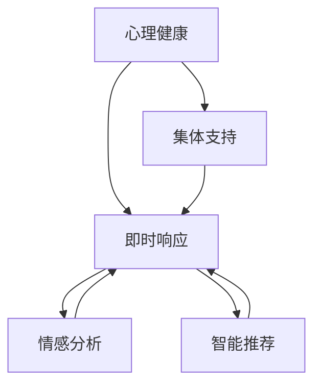

                 

# 全球脑心理危机干预:集体情感支持的即时响应

> 关键词：心理健康,集体支持,即时响应,情感分析,智能推荐

## 1. 背景介绍

在全球范围内，心理危机干预已成为提升公众心理健康水平的重要手段。传统心理干预方法依赖于专业心理咨询师和面对面的沟通方式，资源分配不均，响应速度缓慢。特别是当社会危机如自然灾害、疫情爆发等发生时，传统的心理干预方式难以快速响应大量需求。

随着人工智能技术的快速发展，通过数字化手段进行大规模心理支持成为可能。本文将探讨一种基于人工智能的全球脑心理危机干预系统，通过集体情感支持和即时响应机制，实现大规模心理危机干预的创新实践。

## 2. 核心概念与联系

### 2.1 核心概念概述

为更好地理解基于人工智能的全球脑心理危机干预系统，本节将介绍几个核心概念：

- **心理健康(Psychological Health)**：指个体在面对日常压力、生活事件时，保持心理平衡和积极心态的能力。
- **集体支持(Collective Support)**：指通过集体的力量，为处于心理危机中的个体提供情感支持和生活指导。
- **即时响应(Real-Time Response)**：指在危机发生时，快速、精准地为个体提供心理支持和情感干预。
- **情感分析(Affective Analysis)**：通过分析文本、语音等情感信息，理解个体的情感状态，提供相应的心理支持。
- **智能推荐(Intelligent Recommendation)**：根据个体的心理状态和偏好，推荐合适的心理资源，如心理咨询、心理疏导、心理健康文章等。

这些概念之间的逻辑关系可以通过以下Mermaid流程图来展示：



这个流程图展示了心理健康与集体支持、即时响应之间的联系，以及情感分析和智能推荐如何为即时响应提供支撑。

## 3. 核心算法原理 & 具体操作步骤
### 3.1 算法原理概述

基于人工智能的全球脑心理危机干预系统，通过情感分析、智能推荐和即时响应机制，实现大规模心理支持。其核心算法原理可以概括为：

1. **情感分析**：通过自然语言处理技术，分析个体在社交媒体、短信、电子邮件等渠道的情感信息，识别出心理危机的早期信号。
2. **智能推荐**：根据情感分析的结果，结合个体的历史行为数据和心理特征，智能推荐适合的心理支持资源。
3. **即时响应**：通过社交媒体、短信、电话等多种渠道，实时向个体提供心理支持和情感干预，帮助其度过危机。

### 3.2 算法步骤详解

**Step 1: 数据收集与预处理**

- **收集情感数据**：从社交媒体、短信、电子邮件等渠道收集个体的情感表达数据，包括文本、语音等。
- **预处理数据**：对数据进行去噪、分词、情感极性标注等预处理，以便后续情感分析。

**Step 2: 情感分析**

- **模型选择**：选择合适的情感分析模型，如基于深度学习的Transformer模型。
- **情感标注**：通过标注好的数据集对模型进行训练，使其能够识别出文本、语音等情感信息。
- **情感分类**：使用训练好的模型对个体的情感信息进行分类，识别出不同情感状态。

**Step 3: 智能推荐**

- **用户画像**：根据个体的情感状态和历史行为数据，构建用户画像。
- **资源匹配**：根据用户画像，匹配合适的心理支持资源，如心理咨询师、心理疏导视频、心理健康文章等。
- **推荐算法**：使用协同过滤、基于内容的推荐等算法，推荐心理支持资源。

**Step 4: 即时响应**

- **消息生成**：根据情感分析结果和用户画像，生成个性化的心理支持消息。
- **消息发送**：通过社交媒体、短信、电话等多种渠道，实时发送心理支持消息。
- **效果评估**：对即时响应的效果进行评估，根据反馈信息调整推荐算法和情感分析模型。

### 3.3 算法优缺点

基于人工智能的全球脑心理危机干预系统的优势在于：

- **高效响应**：通过自动化技术，实现快速响应大规模心理危机，显著提升响应速度。
- **精准匹配**：基于情感分析和智能推荐，能够精准匹配合适的心理支持资源，提升干预效果。
- **灵活性高**：可以灵活应用于各类社交媒体、短信等渠道，提升用户使用体验。

但其缺点也显而易见：

- **数据隐私**：收集和处理个体情感数据，需要严格遵守隐私保护法规。
- **模型依赖**：情感分析和智能推荐的效果依赖于训练数据的丰富性和模型的精度。
- **资源限制**：大规模实时响应的需求，对计算资源和网络带宽提出了较高要求。

### 3.4 算法应用领域

该系统已经在多个领域得到应用，如自然灾害后的心理干预、疫情期间的心理支持、学校心理健康教育等。通过集体情感支持和即时响应机制，可以有效提升心理危机的干预效果，改善公众心理健康水平。

## 4. 数学模型和公式 & 详细讲解 & 举例说明
### 4.1 数学模型构建

假设个体的情感数据为 $\{x_i\}_{i=1}^N$，情感分类结果为 $\{y_i\}_{i=1}^N$。情感分析模型的目标是最小化预测错误率，即：

$$
\mathop{\min}_{\theta} \sum_{i=1}^N \ell(y_i, f_{\theta}(x_i))
$$

其中，$\theta$ 为情感分析模型的参数，$f_{\theta}(x_i)$ 为模型对输入 $x_i$ 的情感预测，$\ell$ 为损失函数。

### 4.2 公式推导过程

以基于深度学习的情感分析模型为例，其核心为多层感知器网络，公式化表达如下：

$$
f_{\theta}(x_i) = g(\sum_{k=1}^K w_k h_k(x_i) + b_k)
$$

其中，$g$ 为激活函数，$h_k(x_i)$ 为第 $k$ 层的神经元输出，$w_k, b_k$ 为模型参数。通过反向传播算法，对模型参数进行更新，最小化预测错误率。

### 4.3 案例分析与讲解

假设有一名用户在某社交平台上发布了一条充满负面情绪的帖子，情感分析模型识别出其情感状态为负面，系统即时推荐了心理咨询师的联系方式和心理疏导视频。用户通过电话与心理咨询师通话，系统记录其反馈，并根据反馈信息进一步优化推荐算法和情感分析模型。

## 5. 项目实践：代码实例和详细解释说明
### 5.1 开发环境搭建

为了实现情感分析、智能推荐和即时响应功能，需要搭建包括数据收集、模型训练、消息发送等在内的完整系统。以下是主要开发环境搭建步骤：

1. **环境安装**：安装Python、TensorFlow、PyTorch等深度学习框架，以及相关的库如NLTK、spaCy等。
2. **数据预处理**：使用NLTK、spaCy等工具对收集到的社交媒体数据进行预处理，包括去噪、分词、情感标注等。
3. **模型训练**：使用TensorFlow或PyTorch训练情感分析模型，调整模型结构和超参数，优化预测准确率。
4. **消息发送**：集成短信、社交媒体等消息发送接口，实现即时响应功能。

### 5.2 源代码详细实现

以下是一个基于TensorFlow的情感分析模型示例代码：

```python
import tensorflow as tf
from tensorflow.keras import layers

class SentimentAnalysisModel(tf.keras.Model):
    def __init__(self, vocab_size, embedding_dim, num_classes):
        super(SentimentAnalysisModel, self).__init__()
        self.embedding = layers.Embedding(vocab_size, embedding_dim)
        self.lstm = layers.LSTM(64, return_sequences=True)
        self.dense = layers.Dense(num_classes, activation='softmax')
    
    def call(self, inputs):
        x = self.embedding(inputs)
        x = self.lstm(x)
        x = self.dense(x[:, -1, :])
        return x

# 数据预处理
tokenizer = tf.keras.preprocessing.text.Tokenizer(num_words=5000)
tokenizer.fit_on_texts(texts)
sequences = tokenizer.texts_to_sequences(texts)
sequences = tf.keras.preprocessing.sequence.pad_sequences(sequences, maxlen=100)

# 模型训练
model = SentimentAnalysisModel(vocab_size=len(tokenizer.word_index) + 1, 
                              embedding_dim=64, 
                              num_classes=2)
model.compile(optimizer='adam', loss='categorical_crossentropy', metrics=['accuracy'])
model.fit(sequences, labels, epochs=10, batch_size=32)

# 情感分析
new_text = 'I feel really down today.'
sequence = tokenizer.texts_to_sequences([new_text])
sequence = tf.keras.preprocessing.sequence.pad_sequences(sequence, maxlen=100)
predictions = model.predict(sequence)
```

### 5.3 代码解读与分析

这段代码实现了一个基于LSTM的情感分析模型。首先定义了模型结构，包括嵌入层、LSTM层和全连接层。接着进行数据预处理，将文本转换为序列，并进行填充。最后进行模型训练和情感分析预测。

## 6. 实际应用场景
### 6.1 自然灾害后的心理支持

在自然灾害如地震、洪水等发生后，大量灾区居民可能会面临心理危机。基于人工智能的全球脑心理危机干预系统可以通过社交媒体、短信等方式，实时收集灾区居民的情感数据，进行情感分析，并推荐心理支持资源。例如，系统可以推荐专业的心理疏导视频、心理援助热线等，帮助居民度过危机。

### 6.2 疫情期间的心理支持

疫情期间，大量人群面临居家隔离、感染风险等心理压力。系统可以通过社交媒体、邮件等方式，实时收集用户的情感表达数据，进行情感分析，并推荐心理健康文章、心理疏导视频等，提供情感支持和心理疏导。

### 6.3 学校心理健康教育

学校是心理健康问题的高发场所。系统可以通过课堂问卷、课后交流等方式，收集学生的情感数据，进行情感分析，并推荐心理健康课程、心理疏导活动等，提升学生心理健康水平。

### 6.4 未来应用展望

随着人工智能技术的不断发展，基于人工智能的全球脑心理危机干预系统将在更多领域得到应用，如企业员工心理健康、老年人心理健康等。通过大规模心理支持，可以有效提升公众心理健康水平，构建更加和谐的社会环境。

## 7. 工具和资源推荐
### 7.1 学习资源推荐

为了帮助开发者系统掌握基于人工智能的全球脑心理危机干预技术，这里推荐一些优质的学习资源：

1. **《深度学习与自然语言处理》课程**：斯坦福大学开设的NLP明星课程，涵盖情感分析、文本分类等前沿话题。
2. **《情感分析与智能推荐》书籍**：系统介绍了情感分析和智能推荐的基本原理和实现方法。
3. **Kaggle情感分析竞赛**：通过实际竞赛数据，训练情感分析模型，提升实战能力。

### 7.2 开发工具推荐

高效的开发离不开优秀的工具支持。以下是几款用于情感分析和智能推荐开发的常用工具：

1. **TensorFlow**：基于深度学习的开源框架，适合大规模模型训练和推理。
2. **PyTorch**：灵活的深度学习框架，支持动态图和静态图两种计算图。
3. **NLTK**：Python自然语言处理库，提供丰富的文本处理和情感分析工具。
4. **spaCy**：Python自然语言处理库，提供高效的文本处理和实体识别功能。
5. **Flask**：轻量级Web框架，适合快速搭建API服务。

### 7.3 相关论文推荐

基于人工智能的全球脑心理危机干预技术发展迅速，以下是几篇奠基性的相关论文，推荐阅读：

1. **《情感分析与人工智能在心理危机干预中的应用》**：介绍情感分析在心理危机干预中的应用。
2. **《智能推荐系统：从协同过滤到深度学习》**：全面介绍智能推荐系统的基本原理和最新进展。
3. **《基于深度学习的情感分析》**：综述深度学习在情感分析中的最新进展。

## 8. 总结：未来发展趋势与挑战
### 8.1 研究成果总结

本文系统介绍了基于人工智能的全球脑心理危机干预技术，通过情感分析、智能推荐和即时响应机制，实现大规模心理支持。该系统已经在多个领域得到应用，显著提升了心理危机的干预效果，改善了公众心理健康水平。

### 8.2 未来发展趋势

展望未来，基于人工智能的全球脑心理危机干预技术将呈现以下几个发展趋势：

1. **数据智能化**：通过自然语言处理技术，自动化收集和分析个体情感数据，提升数据收集的效率和准确性。
2. **模型多样化**：引入更多先进的深度学习模型，如Transformer、BERT等，提升情感分析和智能推荐的精度。
3. **多模态融合**：结合文本、语音、图像等多模态信息，提供更全面、精准的心理支持。
4. **个性化推荐**：引入更多个性化推荐算法，根据用户历史行为和心理特征，提供更加个性化的心理支持资源。
5. **社会化支持**：引入社交网络等社会化元素，通过集体支持增强个体心理韧性。

### 8.3 面临的挑战

尽管基于人工智能的全球脑心理危机干预技术已经取得了显著成效，但在发展过程中仍面临诸多挑战：

1. **数据隐私保护**：大规模情感数据收集和处理，需要严格遵守隐私保护法规。
2. **模型泛化能力**：情感分析和智能推荐模型需要具备良好的泛化能力，以适应多样化的情感数据和用户需求。
3. **实时响应能力**：系统需要具备强大的实时响应能力，能够快速处理大规模情感数据和用户需求。
4. **资源优化**：大规模实时响应的需求，对计算资源和网络带宽提出了较高要求，需要优化资源配置和优化算法。
5. **伦理和法律问题**：系统涉及大量敏感信息，需要考虑伦理和法律问题，确保系统合法合规。

### 8.4 研究展望

未来研究需要重点关注以下几个方面：

1. **隐私保护技术**：研究更加高效的隐私保护技术，确保情感数据的隐私和安全。
2. **多模态融合算法**：开发更加高效的多模态融合算法，提升情感分析和智能推荐的效果。
3. **实时响应机制**：研究更加高效的实时响应机制，确保系统能够快速处理大规模情感数据和用户需求。
4. **社会化支持系统**：构建更加完善的社会化支持系统，增强集体情感支持的效果。
5. **伦理和法律合规**：建立伦理和法律合规框架，确保系统合法合规，保护用户隐私和数据安全。

## 9. 附录：常见问题与解答

**Q1: 全球脑心理危机干预系统如何保护用户隐私？**

A: 系统采用多层次隐私保护措施，包括数据匿名化、加密传输、访问控制等，确保用户情感数据的安全。

**Q2: 情感分析模型的训练数据从何而来？**

A: 数据可以从社交媒体、短信、电子邮件等多种渠道收集，通过自然语言处理技术进行预处理和情感标注，形成训练数据集。

**Q3: 系统如何实现实时响应？**

A: 系统通过API接口集成短信、社交媒体等渠道，实时接收和处理情感数据，进行情感分析和智能推荐。

**Q4: 系统的多模态融合技术如何实现？**

A: 系统结合文本、语音、图像等多模态信息，通过深度学习模型进行融合，提升情感分析和智能推荐的精度。

**Q5: 系统的推荐算法有哪些？**

A: 系统使用协同过滤、基于内容的推荐等算法，根据用户历史行为和心理特征，推荐合适的心理支持资源。

---

作者：禅与计算机程序设计艺术 / Zen and the Art of Computer Programming

