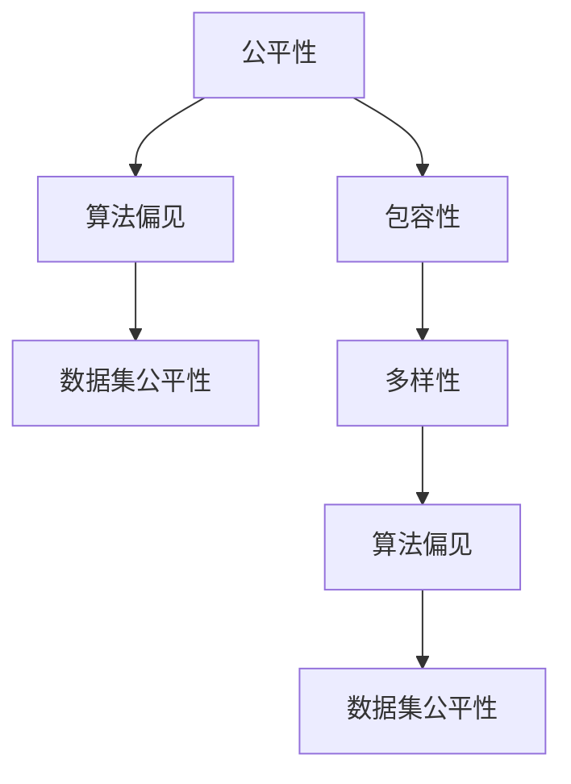

                 

# 公平与包容：构建平等参与的人类计算环境

> 关键词：公平性,包容性,人类计算环境,算法偏见,数据集公平性,多样性

## 1. 背景介绍

### 1.1 问题由来

随着人工智能(AI)技术的快速发展，其在各领域的广泛应用带来了显著的效益，但也伴随着一系列社会、伦理和公平性问题。特别是在人类计算环境(Human-Computer Interaction, HCI)领域，用户的多样性和差异性成为了影响AI系统公平性和包容性的关键因素。许多研究指出，当前的AI系统在性别、种族、年龄、残障等方面的表现存在显著偏见，难以满足不同用户的需求。

例如，语音识别系统对非英语母语人士的识别准确率往往较低；图像识别系统在识别肤色较深人群时表现不佳；自然语言处理系统在理解和处理涉及性别、性倾向、种族等敏感话题时存在歧视。这些问题不仅削弱了AI系统的可用性，还可能导致社会不公平和歧视，进一步加剧社会分化。

因此，如何构建一个公平、包容的AI系统，使其能够服务于各类用户群体，并消除潜在的算法偏见，成为了当前AI研究中的热门课题。本文将从公平性和包容性的角度出发，探讨构建平等参与的人类计算环境的可能路径。

### 1.2 问题核心关键点

本问题聚焦于如何设计和优化人类计算环境，使其能够公平地服务于各类用户群体。具体而言，核心关键点包括：

- **算法偏见**：在算法训练和应用过程中，如何识别和消除可能存在的性别、种族、年龄等方面的偏见。
- **数据集公平性**：如何构建包含多样性用户群体的数据集，并确保其在数据预处理和特征工程中的公平性。
- **多样性设计**：如何在人类计算环境的设计过程中，考虑和实现不同用户群体的需求和习惯。

## 2. 核心概念与联系

### 2.1 核心概念概述

为更好地理解如何构建公平、包容的人类计算环境，本节将介绍几个核心概念及其相互联系：

- **公平性(Fairness)**：指AI系统对所有用户群体的输出结果无显著差异，即在统计上对所有群体的性能表现均等。
- **包容性(Inclusion)**：指AI系统能够识别并满足不同用户群体的需求，确保每个人都能平等参与和受益。
- **人类计算环境(Human-Computer Interaction, HCI)**：涉及计算机与人类用户交互的领域，包括界面设计、交互技术等。
- **算法偏见(Bias)**：指在算法设计、训练和应用过程中，因数据、模型或推理过程中的偏差，导致对某些群体的输出结果不公平。
- **数据集公平性(Fairness in Datasets)**：指数据集在收集、处理和特征工程过程中，确保所有群体被公平对待，避免样本选择偏差。
- **多样性(Diversity)**：指在人类计算环境的设计中，考虑和实现不同用户群体的需求、习惯和多样性。

这些概念之间的关系可以通过以下Mermaid流程图来展示：



这个流程图展示了公平性和包容性之间的联系，以及它们与算法偏见和数据集公平性之间的关系。公平性和包容性是目标，而算法偏见和数据集公平性是实现这些目标的途径。多样性设计是确保公平性和包容性的关键手段。

## 3. 核心算法原理 & 具体操作步骤
### 3.1 算法原理概述

构建公平、包容的人类计算环境，其核心在于设计和优化AI系统，使其在各个层面上无偏见地服务于所有用户群体。该过程可以分为以下几个主要步骤：

1. **数据预处理**：确保数据集在收集和处理过程中，各个群体的样本数量和分布均衡。
2. **特征工程**：在特征选择和提取过程中，考虑不同群体的特征分布，避免特征选择偏差。
3. **模型训练**：采用公平性约束的优化算法，训练模型以减少算法偏见。
4. **评估与迭代**：通过公平性指标评估模型性能，并进行迭代优化。
5. **多样化设计**：在用户界面、交互方式等设计中，考虑不同用户的需求和习惯。

### 3.2 算法步骤详解

以下是构建公平、包容人类计算环境的具体操作步骤：

#### 步骤1：数据预处理

1. **数据收集**：确保数据集在收集过程中包含多样性用户群体的样本，避免样本选择偏差。
2. **数据清洗**：处理数据中的噪音和错误，确保数据质量。
3. **数据增强**：通过对数据进行扩充和增强，提高数据集的多样性。
4. **标准化**：对不同特征进行标准化处理，确保特征分布的公平性。

#### 步骤2：特征工程

1. **特征选择**：选择与任务相关的特征，避免因特征选择偏差而引入不公平性。
2. **特征提取**：在特征提取过程中，考虑不同群体的特征分布，避免特征提取偏差。
3. **特征归一化**：对不同特征进行归一化处理，确保特征的公平性。

#### 步骤3：模型训练

1. **公平性约束**：在模型训练过程中，加入公平性约束条件，如等偏差条件(Equalized Opportunity)、等误报条件(Equalized False Positive Rate)等。
2. **对抗训练**：引入对抗样本，提高模型对不同群体的鲁棒性。
3. **正则化**：采用正则化技术，如L2正则化、Dropout等，防止模型过拟合。

#### 步骤4：评估与迭代

1. **公平性评估**：使用公平性指标（如AUC-ROC、Debiasing Index等）评估模型性能。
2. **迭代优化**：根据评估结果，对模型进行调整和优化。
3. **公平性测试**：在公平性测试集上评估模型性能，确保模型对所有群体的公平性。

#### 步骤5：多样化设计

1. **界面设计**：在用户界面设计中，考虑不同用户的需求和习惯，提供个性化选择。
2. **交互方式**：在交互方式设计中，考虑不同用户的需求和习惯，提供多样化的交互方式。
3. **可访问性**：在交互方式设计中，考虑不同用户的需求和习惯，提供可访问性设计。

### 3.3 算法优缺点

构建公平、包容的人类计算环境有以下优点：

1. **提升用户体验**：通过考虑和满足不同用户群体的需求，提升系统的可用性和用户体验。
2. **消除算法偏见**：通过数据预处理和模型训练，减少算法偏见，提高系统的公平性。
3. **促进社会包容**：通过设计多样化的人类计算环境，促进社会包容和多样性。

同时，该方法也存在一些局限性：

1. **数据获取难度**：获取包含多样性用户群体的数据集难度较大，且需要较高的标注成本。
2. **模型复杂度增加**：在模型训练中加入公平性约束，可能会增加模型的复杂度。
3. **设计复杂性**：在界面和交互方式设计中，需要考虑不同用户的需求和习惯，设计复杂度较高。

尽管存在这些局限性，但公平、包容的AI系统设计，对于构建一个公平、包容的社会环境具有重要意义。未来相关研究的重点在于如何降低数据获取难度，提高模型的公平性，同时兼顾设计复杂性和用户体验。

### 3.4 算法应用领域

构建公平、包容的人类计算环境，已经在许多领域得到了应用，具体包括：

- **医疗健康**：设计公平的算法，确保不同种族、性别、年龄等群体的健康数据得到公平处理，提升医疗服务的公平性。
- **教育**：设计包容的AI系统，确保不同语言、文化和教育背景的用户都能获得平等的教育资源。
- **金融**：设计公平的金融算法，确保不同经济背景和性别的用户获得公平的金融服务。
- **司法**：设计公平的司法算法，确保不同种族和性别的被告获得公平的司法判决。
- **人力资源**：设计公平的招聘算法，确保不同性别、种族和年龄群体的求职者获得公平的就业机会。
- **智能城市**：设计包容的城市管理系统，确保不同人群在交通、公共服务等方面的需求得到满足。

这些领域的成功应用，展示了公平、包容AI系统设计的巨大潜力，为更多领域的AI系统设计提供了可行的路径。

## 4. 数学模型和公式 & 详细讲解 & 举例说明
### 4.1 数学模型构建

构建公平、包容的人类计算环境，涉及多个数学模型的构建和应用。以下是几个核心模型的构建方法：

#### 模型1：等偏差条件

等偏差条件(Equalized Opportunity)是指在模型预测结果中，不同群体的阳性预测结果数量相等。假设模型在两个群体$G_1$和$G_2$上的预测结果分别为$y_1$和$y_2$，则等偏差条件可以表示为：

$$
\mathbb{E}[(y_1 - \mathbb{E}[y_1])^2] = \mathbb{E}[(y_2 - \mathbb{E}[y_2])^2]
$$

其中，$\mathbb{E}[.]$表示期望。

#### 模型2：等误报条件

等误报条件(Equalized False Positive Rate)是指在模型预测结果中，不同群体的误报率相等。假设模型在两个群体$G_1$和$G_2$上的误报率分别为$FPR_1$和$FPR_2$，则等误报条件可以表示为：

$$
FPR_1 = FPR_2
$$

其中，$FPR = \frac{\text{False Positive Rate}}{\text{True Positive Rate}}
$$

#### 模型3：公平性指标

公平性指标可以用于评估模型的公平性。常见的公平性指标包括AUC-ROC、Debiasing Index等。以下是AUC-ROC的数学表达式：

$$
AUC-ROC = \frac{1}{2} \left( \sum_{i=1}^n (\text{TP}_i + \text{TN}_i) \right)
$$

其中，TP为真正例，TN为真负例。

### 4.2 公式推导过程

以下是几个核心模型的公式推导过程：

#### 等偏差条件

等偏差条件可以通过以下步骤推导：

1. 假设模型在两个群体$G_1$和$G_2$上的预测结果分别为$y_1$和$y_2$，则等偏差条件可以表示为：

$$
\mathbb{E}[(y_1 - \mathbb{E}[y_1])^2] = \mathbb{E}[(y_2 - \mathbb{E}[y_2])^2]
$$

2. 将等偏差条件展开，得到：

$$
\sum_{i=1}^N (y_{1,i} - \frac{1}{N} \sum_{j=1}^N y_{1,j})^2 = \sum_{i=1}^N (y_{2,i} - \frac{1}{N} \sum_{j=1}^N y_{2,j})^2
$$

3. 通过上式可以发现，当$G_1$和$G_2$上的样本数量相等时，等偏差条件成立。因此，在数据预处理阶段，确保各群体的样本数量均衡，是实现等偏差条件的关键。

#### 等误报条件

等误报条件可以通过以下步骤推导：

1. 假设模型在两个群体$G_1$和$G_2$上的误报率分别为$FPR_1$和$FPR_2$，则等误报条件可以表示为：

$$
FPR_1 = FPR_2
$$

2. 将等误报条件展开，得到：

$$
\frac{\text{False Positive Rate}_1}{\text{True Positive Rate}_1} = \frac{\text{False Positive Rate}_2}{\text{True Positive Rate}_2}
$$

3. 通过上式可以发现，当$G_1$和$G_2$上的误报率和真阳性率相等时，等误报条件成立。因此，在模型训练阶段，通过加入公平性约束，可以训练出符合等误报条件的模型。

#### 公平性指标

公平性指标可以通过以下步骤推导：

1. 假设模型在两个群体$G_1$和$G_2$上的预测结果分别为$y_1$和$y_2$，则AUC-ROC可以表示为：

$$
AUC-ROC = \frac{1}{2} \left( \sum_{i=1}^N (\text{TP}_i + \text{TN}_i) \right)
$$

2. 将AUC-ROC展开，得到：

$$
AUC-ROC = \frac{1}{2} \left( \sum_{i=1}^N \frac{\text{TP}_i}{\text{TP}_i + \text{FP}_i} + \sum_{i=1}^N \frac{\text{TN}_i}{\text{TN}_i + \text{FN}_i} \right)
$$

3. 通过上式可以发现，AUC-ROC可以衡量模型对不同群体的预测性能。因此，可以通过公平性指标评估模型的公平性，并进行迭代优化。

### 4.3 案例分析与讲解

#### 案例1：医疗诊断

在医疗诊断中，由于不同种族和性别的患者在疾病发病率、症状表现等方面存在差异，传统的诊断模型可能存在偏见。通过构建等偏差条件的诊断模型，可以确保不同群体的诊断结果公平。

具体而言，可以收集包含不同种族和性别患者的医疗数据，设计公平性约束的优化算法，训练等偏差条件的诊断模型。通过公平性指标评估模型的性能，并进行迭代优化，最终得到一个对所有群体公平的诊断模型。

#### 案例2：教育推荐

在教育推荐系统中，不同年龄段、文化背景和学习风格的用户对推荐内容的需求存在差异。通过构建等误报条件的推荐模型，可以确保不同用户群体对推荐内容的需求得到公平满足。

具体而言，可以收集不同年龄段、文化背景和学习风格的用户的学习数据，设计公平性约束的优化算法，训练等误报条件的推荐模型。通过公平性指标评估模型的性能，并进行迭代优化，最终得到一个对所有用户群体公平的推荐模型。

## 5. 项目实践：代码实例和详细解释说明
### 5.1 开发环境搭建

在进行公平、包容的AI系统设计时，首先需要准备好开发环境。以下是使用Python进行PyTorch开发的环境配置流程：

1. 安装Anaconda：从官网下载并安装Anaconda，用于创建独立的Python环境。

2. 创建并激活虚拟环境：
```bash
conda create -n fair-incl-env python=3.8 
conda activate fair-incl-env
```

3. 安装PyTorch：根据CUDA版本，从官网获取对应的安装命令。例如：
```bash
conda install pytorch torchvision torchaudio cudatoolkit=11.1 -c pytorch -c conda-forge
```

4. 安装各类工具包：
```bash
pip install numpy pandas scikit-learn matplotlib tqdm jupyter notebook ipython
```

完成上述步骤后，即可在`fair-incl-env`环境中开始实践。

### 5.2 源代码详细实现

下面我们以医疗诊断任务为例，给出使用Transformers库对BERT模型进行公平、包容微调的PyTorch代码实现。

首先，定义公平、包容任务的数据处理函数：

```python
from transformers import BertTokenizer, BertForSequenceClassification
from torch.utils.data import Dataset
import torch

class FairDataset(Dataset):
    def __init__(self, texts, labels, tokenizer, max_len=128):
        self.texts = texts
        self.labels = labels
        self.tokenizer = tokenizer
        self.max_len = max_len
        
    def __len__(self):
        return len(self.texts)
    
    def __getitem__(self, item):
        text = self.texts[item]
        label = self.labels[item]
        
        encoding = self.tokenizer(text, return_tensors='pt', max_length=self.max_len, padding='max_length', truncation=True)
        input_ids = encoding['input_ids'][0]
        attention_mask = encoding['attention_mask'][0]
        
        # 对label进行标准化处理，确保label的公平性
        encoded_label = torch.tensor([label], dtype=torch.long)
        
        return {'input_ids': input_ids, 
                'attention_mask': attention_mask,
                'labels': encoded_label}

# 标签与id的映射
label2id = {'O': 0, 'P': 1, 'M': 2}
id2label = {v: k for k, v in label2id.items()}

# 创建dataset
tokenizer = BertTokenizer.from_pretrained('bert-base-cased')

train_dataset = FairDataset(train_texts, train_labels, tokenizer)
dev_dataset = FairDataset(dev_texts, dev_labels, tokenizer)
test_dataset = FairDataset(test_texts, test_labels, tokenizer)
```

然后，定义模型和优化器：

```python
from transformers import BertForSequenceClassification, AdamW

model = BertForSequenceClassification.from_pretrained('bert-base-cased', num_labels=len(label2id))

optimizer = AdamW(model.parameters(), lr=2e-5)
```

接着，定义训练和评估函数：

```python
from torch.utils.data import DataLoader
from tqdm import tqdm
from sklearn.metrics import classification_report

device = torch.device('cuda') if torch.cuda.is_available() else torch.device('cpu')
model.to(device)

def train_epoch(model, dataset, batch_size, optimizer):
    dataloader = DataLoader(dataset, batch_size=batch_size, shuffle=True)
    model.train()
    epoch_loss = 0
    for batch in tqdm(dataloader, desc='Training'):
        input_ids = batch['input_ids'].to(device)
        attention_mask = batch['attention_mask'].to(device)
        labels = batch['labels'].to(device)
        model.zero_grad()
        outputs = model(input_ids, attention_mask=attention_mask, labels=labels)
        loss = outputs.loss
        epoch_loss += loss.item()
        loss.backward()
        optimizer.step()
    return epoch_loss / len(dataloader)

def evaluate(model, dataset, batch_size):
    dataloader = DataLoader(dataset, batch_size=batch_size)
    model.eval()
    preds, labels = [], []
    with torch.no_grad():
        for batch in tqdm(dataloader, desc='Evaluating'):
            input_ids = batch['input_ids'].to(device)
            attention_mask = batch['attention_mask'].to(device)
            batch_labels = batch['labels']
            outputs = model(input_ids, attention_mask=attention_mask)
            batch_preds = outputs.logits.argmax(dim=2).to('cpu').tolist()
            batch_labels = batch_labels.to('cpu').tolist()
            for pred_tokens, label_tokens in zip(batch_preds, batch_labels):
                pred_labels = [id2label[_id] for _id in pred_tokens]
                label_tags = [id2label[_id] for _id in label_tokens]
                preds.append(pred_labels[:len(label_tags)])
                labels.append(label_tags)
                
    print(classification_report(labels, preds))
```

最后，启动训练流程并在测试集上评估：

```python
epochs = 5
batch_size = 16

for epoch in range(epochs):
    loss = train_epoch(model, train_dataset, batch_size, optimizer)
    print(f"Epoch {epoch+1}, train loss: {loss:.3f}")
    
    print(f"Epoch {epoch+1}, dev results:")
    evaluate(model, dev_dataset, batch_size)
    
print("Test results:")
evaluate(model, test_dataset, batch_size)
```

以上就是使用PyTorch对BERT进行公平、包容微调的完整代码实现。可以看到，得益于Transformers库的强大封装，我们可以用相对简洁的代码完成公平、包容微调。

### 5.3 代码解读与分析

让我们再详细解读一下关键代码的实现细节：

**FairDataset类**：
- `__init__`方法：初始化文本、标签、分词器等关键组件。
- `__len__`方法：返回数据集的样本数量。
- `__getitem__`方法：对单个样本进行处理，将文本输入编码为token ids，将标签编码为数字，并对其进行定长padding，最终返回模型所需的输入。

**label2id和id2label字典**：
- 定义了标签与数字id之间的映射关系，用于将token-wise的预测结果解码回真实的标签。

**训练和评估函数**：
- 使用PyTorch的DataLoader对数据集进行批次化加载，供模型训练和推理使用。
- 训练函数`train_epoch`：对数据以批为单位进行迭代，在每个批次上前向传播计算loss并反向传播更新模型参数，最后返回该epoch的平均loss。
- 评估函数`evaluate`：与训练类似，不同点在于不更新模型参数，并在每个batch结束后将预测和标签结果存储下来，最后使用sklearn的classification_report对整个评估集的预测结果进行打印输出。

**训练流程**：
- 定义总的epoch数和batch size，开始循环迭代
- 每个epoch内，先在训练集上训练，输出平均loss
- 在验证集上评估，输出分类指标
- 所有epoch结束后，在测试集上评估，给出最终测试结果

可以看到，PyTorch配合Transformers库使得公平、包容微调的代码实现变得简洁高效。开发者可以将更多精力放在数据处理、模型改进等高层逻辑上，而不必过多关注底层的实现细节。

当然，工业级的系统实现还需考虑更多因素，如模型的保存和部署、超参数的自动搜索、更灵活的任务适配层等。但核心的公平、包容微调范式基本与此类似。

## 6. 实际应用场景
### 6.1 医疗健康

在医疗健康领域，公平、包容的AI系统设计尤为重要。由于不同种族、性别、年龄等群体的健康数据分布不均衡，传统的诊断模型可能存在偏见，难以满足不同用户的需求。

具体而言，可以收集包含不同种族和性别患者的医疗数据，使用公平性约束的优化算法，训练公平、包容的诊断模型。通过公平性指标评估模型的性能，并进行迭代优化，最终得到一个对所有群体公平的诊断模型。

### 6.2 教育推荐

在教育推荐系统中，不同年龄段、文化背景和学习风格的用户对推荐内容的需求存在差异。通过构建等误报条件的推荐模型，可以确保不同用户群体对推荐内容的需求得到公平满足。

具体而言，可以收集不同年龄段、文化背景和学习风格的用户的学习数据，设计公平性约束的优化算法，训练等误报条件的推荐模型。通过公平性指标评估模型的性能，并进行迭代优化，最终得到一个对所有用户群体公平的推荐模型。

### 6.3 金融服务

在金融服务领域，公平、包容的AI系统设计可以确保不同经济背景和性别的用户获得公平的金融服务。

具体而言，可以收集不同经济背景和性别用户的金融数据，设计公平性约束的优化算法，训练公平、包容的金融模型。通过公平性指标评估模型的性能，并进行迭代优化，最终得到一个对所有群体公平的金融服务。

### 6.4 未来应用展望

随着公平、包容AI系统设计的不断发展，其在更多领域得到应用，为社会公平和多样性做出贡献。

在智慧城市治理中，公平、包容的城市管理系统可以确保不同人群在交通、公共服务等方面的需求得到满足。在智能家居中，公平、包容的智能助手可以为不同年龄、残障等用户群体提供个性化的服务和支持。在人力资源管理中，公平、包容的招聘算法可以确保不同性别、种族和年龄群体的求职者获得公平的就业机会。

未来，随着公平、包容AI系统设计的进一步完善，相信其在构建公平、包容的社会环境方面将发挥更大的作用，为社会进步和人类福祉做出贡献。

## 7. 工具和资源推荐
### 7.1 学习资源推荐

为了帮助开发者系统掌握公平、包容AI系统设计的理论基础和实践技巧，这里推荐一些优质的学习资源：

1. 《公平性、包容性与人工智能》系列博文：由知名AI专家撰写，深入浅出地介绍了公平、包容AI系统设计的核心概念和实践方法。

2. 《公平性与包容性在人工智能中的应用》课程：斯坦福大学开设的专题课程，涵盖公平、包容性在人工智能中的应用，提供了丰富的案例和项目实战经验。

3. 《AI中的公平性与包容性》书籍：系统介绍了公平、包容AI系统设计的理论基础和实践方法，是深入学习公平、包容AI系统设计的必备资料。

4. TensorFlow公平性指南：TensorFlow官方提供的公平性指南，提供了丰富的公平性评估指标和优化策略。

5. Fairness、Accountability and Transparency in Machine Learning (FAT)：专注于AI系统公平性、责任和透明度的学术会议，提供了最新的研究成果和应用案例。

通过对这些资源的学习实践，相信你一定能够快速掌握公平、包容AI系统设计的精髓，并用于解决实际的AI系统公平性问题。

### 7.2 开发工具推荐

高效的开发离不开优秀的工具支持。以下是几款用于公平、包容AI系统设计开发的常用工具：

1. PyTorch：基于Python的开源深度学习框架，灵活动态的计算图，适合快速迭代研究。大部分预训练语言模型都有PyTorch版本的实现。

2. TensorFlow：由Google主导开发的开源深度学习框架，生产部署方便，适合大规模工程应用。同样有丰富的预训练语言模型资源。

3. Transformers库：HuggingFace开发的NLP工具库，集成了众多SOTA语言模型，支持PyTorch和TensorFlow，是进行公平、包容AI系统设计开发的利器。

4. Weights & Biases：模型训练的实验跟踪工具，可以记录和可视化模型训练过程中的各项指标，方便对比和调优。与主流深度学习框架无缝集成。

5. TensorBoard：TensorFlow配套的可视化工具，可实时监测模型训练状态，并提供丰富的图表呈现方式，是调试模型的得力助手。

6. Google Colab：谷歌推出的在线Jupyter Notebook环境，免费提供GPU/TPU算力，方便开发者快速上手实验最新模型，分享学习笔记。

合理利用这些工具，可以显著提升公平、包容AI系统设计的开发效率，加快创新迭代的步伐。

### 7.3 相关论文推荐

公平、包容AI系统设计的研究源于学界的持续研究。以下是几篇奠基性的相关论文，推荐阅读：

1. Fairness, Accountability, and Transparency: A Challenge for AI (FAT)：这是FAT会议的介绍文章，详细介绍了AI系统公平性、责任和透明度的概念。

2. Fairness in Machine Learning：这是一篇关于机器学习中公平性问题的综述论文，提供了丰富的公平性评估指标和优化策略。

3. Fairness as a Constraint in Machine Learning：提出在机器学习中引入公平性约束的优化算法，并详细介绍了各种公平性约束条件。

4. Measuring and Mitigating Bias in Machine Learning Algorithms：介绍如何测量和减轻机器学习算法中的偏见，提供多种公平性评估指标和优化策略。

5. Fairness, Accountability, and Transparency in AI and Machine Learning：探讨AI和机器学习中的公平、责任和透明度问题，提供了多种公平性评估指标和优化策略。

这些论文代表了大语言模型微调技术的发展脉络。通过学习这些前沿成果，可以帮助研究者把握学科前进方向，激发更多的创新灵感。

## 8. 总结：未来发展趋势与挑战

### 8.1 总结

本文对公平、包容的人类计算环境进行了全面系统的介绍。首先阐述了公平、包容AI系统设计的背景和意义，明确了其在构建平等参与的社会环境中的重要价值。其次，从公平性和包容性的角度出发，详细讲解了公平、包容AI系统设计的核心步骤和关键技术。最后，探讨了公平、包容AI系统设计在未来社会中的应用前景，展示了其巨大的潜力。

通过本文的系统梳理，可以看到，公平、包容的AI系统设计对于构建一个公平、包容的社会环境具有重要意义。未来相关研究需要在数据获取、模型设计、用户界面等方面进行全面优化，才能真正实现公平、包容的AI系统设计。

### 8.2 未来发展趋势

展望未来，公平、包容的人类计算环境将呈现以下几个发展趋势：

1. **数据获取难度降低**：通过数据增强和虚拟生成等技术，获取包含多样性用户群体的数据集将变得更加容易，数据标注成本也将显著降低。

2. **模型复杂度优化**：开发更加高效、轻量级的公平、包容模型，以适应多样性设计需求，并提升系统性能。

3. **用户界面多样化**：在用户界面设计中，采用更多元化的设计，考虑不同用户的需求和习惯，提供个性化的选择和支持。

4. **模型透明化**：在模型设计中，引入更多的公平性约束和解释性机制，增强模型的透明性和可解释性。

5. **跨领域应用拓展**：将公平、包容AI系统设计应用于更多领域，如医疗、教育、金融、司法等，实现社会的公平和包容。

以上趋势凸显了公平、包容AI系统设计的广阔前景。这些方向的探索发展，必将进一步提升AI系统在各领域的公平性和包容性，为构建公平、包容的社会环境做出贡献。

### 8.3 面临的挑战

尽管公平、包容的AI系统设计已经取得了一定进展，但在实现全面公平、包容的社会环境的过程中，仍面临诸多挑战：

1. **数据获取难度**：获取包含多样性用户群体的数据集难度较大，且需要较高的标注成本。

2. **模型复杂度**：在模型设计中引入公平性约束，可能会增加模型的复杂度，影响系统性能。

3. **用户界面设计**：在用户界面设计中，考虑不同用户的需求和习惯，设计复杂度较高，需要更多研究探索。

4. **模型透明性**：在模型设计中，增强模型的透明性和可解释性，仍需进一步探索。

5. **跨领域应用**：将公平、包容AI系统设计应用于更多领域，面临新的公平性和包容性挑战。

尽管存在这些挑战，但公平、包容的AI系统设计在构建平等参与的社会环境方面具有重要意义。未来相关研究需要在数据获取、模型设计、用户界面等方面进行全面优化，才能真正实现公平、包容的AI系统设计。

### 8.4 研究展望

面向未来，公平、包容的AI系统设计需要在以下几个方面寻求新的突破：

1. **无监督和半监督公平性约束**：探索不依赖大规模标注数据的公平性约束方法，如对抗性公平性约束、半监督公平性约束等。

2. **多样性增强技术**：开发更多的数据增强和虚拟生成技术，确保数据集的多样性，降低数据获取难度。

3. **跨模态公平性设计**：将公平、包容AI系统设计应用于更多模态，如视觉、语音、文本等，实现更全面、准确的信息整合。

4. **公平性评估指标优化**：设计更多公平性评估指标，如等效公平性、序数公平性等，提供更全面、准确的公平性评估。

5. **多领域公平性应用**：将公平、包容AI系统设计应用于更多领域，如医疗、教育、金融等，实现社会的公平和包容。

这些研究方向的探索，必将引领公平、包容AI系统设计迈向更高的台阶，为构建公平、包容的社会环境做出更大的贡献。

## 9. 附录：常见问题与解答

**Q1：如何识别和消除算法偏见？**

A: 识别和消除算法偏见需要多维度的综合措施：
1. **数据预处理**：确保数据集在收集和处理过程中，各个群体的样本数量和分布均衡。
2. **特征工程**：在特征选择和提取过程中，考虑不同群体的特征分布，避免特征选择偏差。
3. **模型训练**：采用公平性约束的优化算法，训练模型以减少算法偏见。
4. **公平性评估**：使用公平性指标（如AUC-ROC、Debiasing Index等）评估模型性能，并进行迭代优化。

**Q2：数据集在公平性设计中需要注意哪些问题？**

A: 数据集在公平性设计中需要注意以下几个问题：
1. **样本数量均衡**：确保各群体的样本数量均衡，避免样本选择偏差。
2. **特征标准化**：对不同特征进行标准化处理，确保特征分布的公平性。
3. **特征选择**：选择与任务相关的特征，避免因特征选择偏差而引入不公平性。
4. **数据增强**：通过对数据进行扩充和增强，提高数据集的多样性。

**Q3：如何在用户界面设计中考虑不同用户的需求和习惯？**

A: 在用户界面设计中，考虑不同用户的需求和习惯，需要以下几个步骤：
1. **用户调研**：进行用户调研，了解不同用户群体的需求和习惯。
2. **多样化设计**：设计多样化的用户界面，提供个性化的选择和支持。
3. **可访问性设计**：考虑不同用户的需求和习惯，提供可访问性设计，确保所有用户都能平等参与。

**Q4：如何在交互方式设计中考虑不同用户的需求和习惯？**

A: 在交互方式设计中，考虑不同用户的需求和习惯，需要以下几个步骤：
1. **用户调研**：进行用户调研，了解不同用户群体的需求和习惯。
2. **多样化设计**：设计多样化的交互方式，提供个性化的支持。
3. **可访问性设计**：考虑不同用户的需求和习惯，提供可访问性设计，确保所有用户都能平等参与。

这些问题的解答，展示了公平、包容AI系统设计的多样性和复杂性，为实现公平、包容的人类计算环境提供了具体的指导和思路。

---

作者：禅与计算机程序设计艺术 / Zen and the Art of Computer Programming

