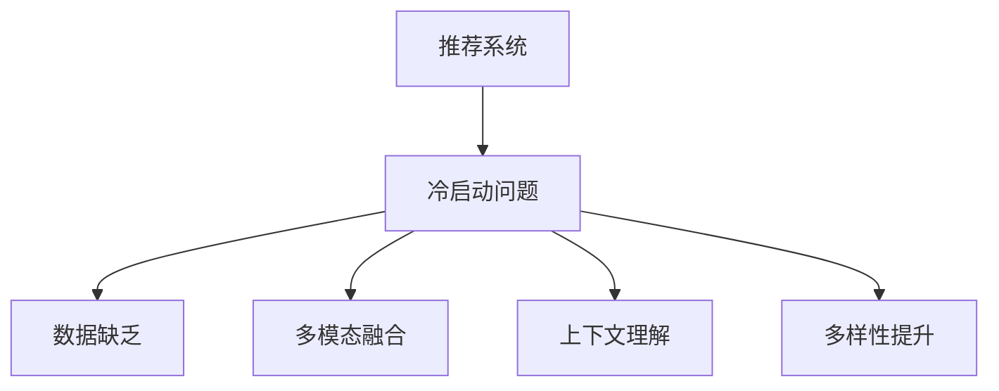

                 

# 冷启动场景的挑战：推荐系统的局限性

## 1. 背景介绍

### 1.1 问题由来

随着电商、社交、视频等平台的用户规模不断扩大，个性化推荐系统成为提升用户体验、提高转化率的重要手段。然而，推荐系统的推荐效果往往依赖于用户的历史行为数据，对于新用户（即冷启动用户），由于缺乏足够的行为数据，推荐模型难以准确预测其兴趣偏好，导致推荐效果不理想。冷启动场景成为推荐系统必须直面的挑战。

### 1.2 问题核心关键点

推荐系统面临的冷启动问题主要包括以下几个方面：

- 数据缺乏：新用户没有历史行为数据，推荐模型难以准确预测其兴趣。
- 多模态融合：新用户的兴趣往往是多模态的，单一的模型难以全面刻画。
- 上下文理解：冷启动场景下，模型的上下文理解能力不足，难以有效捕捉用户需求。
- 多样性提升：冷启动用户的兴趣分布往往较为分散，如何提升推荐的多样性成为难题。

这些关键点构成了冷启动问题的主要挑战，亟需系统地研究和解决。

## 2. 核心概念与联系

### 2.1 核心概念概述

为更好地理解推荐系统中的冷启动问题，本节将介绍几个密切相关的核心概念：

- 推荐系统(Recommendation System)：利用算法为用户推荐合适物品的系统。常见推荐方法包括基于协同过滤、基于内容、混合推荐等。
- 冷启动问题(Cold-Start Problem)：新用户没有历史行为数据，推荐模型难以准确预测其兴趣，推荐效果不理想。
- 多模态融合(Multi-modal Fusion)：用户兴趣是多模态的，可能包含文字、图片、视频等多种信息。
- 上下文理解(Contextual Understanding)：推荐模型需要对用户当前上下文进行理解，如时间、地点、环境等。
- 多样性提升(Diversity Enhancement)：推荐系统需要根据用户兴趣推荐多样化物品，避免推荐雷同内容。

这些核心概念之间的逻辑关系可以通过以下Mermaid流程图来展示：



这个流程图展示推荐的各个关键组件及其相互关系：

1. 推荐系统通过数据驱动的算法为用户推荐物品。
2. 冷启动问题是推荐系统必须面对的挑战。
3. 数据缺乏、多模态融合、上下文理解、多样性提升等，都是导致冷启动问题的原因。

理解这些概念的含义，可以帮助我们更深刻地认识到冷启动问题的本质和复杂性。

## 3. 核心算法原理 & 具体操作步骤
### 3.1 算法原理概述

推荐系统中的冷启动问题主要通过两种方式来解决：

- 用户画像建模：利用用户输入的个人信息、社交关系、兴趣爱好等构建用户画像，弥补历史行为数据的缺失。
- 物品属性表示：通过对物品的各类属性（如标签、描述、评分等）进行充分表示，减少对用户历史行为的依赖。

这些方法的核心思想是利用已有信息对用户和物品进行建模，构建更加全面的推荐模型。具体步骤如下：

1. 收集用户画像信息：通过问卷调查、社交网络、兴趣标签等方式获取用户画像。
2. 对物品进行多维度属性表示：将物品的各类属性进行编码，如标签、评分、用户评价等。
3. 构建推荐模型：将用户画像和物品属性作为输入，使用协同过滤、协同训练、深度学习等算法进行推荐。

### 3.2 算法步骤详解

**步骤1: 用户画像构建**

1. 收集用户画像数据：通过问卷调查、社交网络、历史行为记录等方式获取用户画像数据，包括年龄、性别、兴趣、职业、地域等。
2. 数据预处理：对收集到的数据进行清洗、归一化、去重等预处理操作。
3. 特征提取：利用自然语言处理、图像处理等技术，从用户画像数据中提取有用的特征。

**步骤2: 物品属性表示**

1. 收集物品属性数据：通过数据爬虫、API接口等方式获取物品的各类属性，如标签、描述、评分等。
2. 数据预处理：对属性数据进行清洗、归一化、去重等预处理操作。
3. 特征提取：利用词向量、TF-IDF、图像特征提取等技术，从属性数据中提取有用的特征。

**步骤3: 推荐模型构建**

1. 选择推荐算法：根据推荐场景和数据特点，选择合适的推荐算法，如协同过滤、协同训练、深度学习等。
2. 模型训练：利用用户画像和物品属性数据训练推荐模型，最小化推荐误差。
3. 模型评估：在测试集上评估模型推荐效果，进行参数调优和优化。

**步骤4: 推荐结果生成**

1. 用户输入查询：用户输入物品查询，如关键字、图片、视频等。
2. 上下文理解：对用户输入进行上下文理解，如时间、地点、设备等。
3. 推荐结果生成：利用训练好的推荐模型，对查询进行预测，生成推荐结果。

### 3.3 算法优缺点

推荐系统中的冷启动问题通过用户画像和物品属性表示两种方法来解决，具有以下优点：

1. 快速上线：用户画像和物品属性表示方法相对简单，不需要大量历史数据，可以快速上线。
2. 增强多样性：通过多模态融合和上下文理解，推荐结果更加多样化，避免推荐雷同内容。
3. 泛化能力：基于属性表示的方法具有良好的泛化能力，可以适用于不同类型的数据和物品。

同时，这些方法也存在一些局限性：

1. 数据依赖：用户画像和属性表示方法依赖于数据的完整性和准确性，数据质量不佳会导致推荐效果下降。
2. 特征维度高：多模态融合和上下文理解需要提取大量特征，特征维度高会增加计算复杂度。
3. 解释性不足：基于深度学习的推荐模型往往是"黑盒"系统，难以解释推荐结果的生成过程。

尽管存在这些局限性，但这些方法依然是推荐系统中解决冷启动问题的有效手段，可以通过不断优化算法和数据质量，提升推荐效果。

### 3.4 算法应用领域

推荐系统中的冷启动问题具有广泛的应用场景，主要包括以下几个领域：

- 电商推荐：对于新用户，电商推荐系统需要快速推荐符合其兴趣的商品。
- 视频推荐：新用户在视频平台上的观看行为较少，推荐系统需要根据其兴趣和行为推荐影片。
- 社交推荐：新用户在社交网络上的互动较少，推荐系统需要根据其兴趣推荐好友或内容。
- 旅游推荐：新用户在旅游平台上的搜索和预订较少，推荐系统需要根据其兴趣推荐目的地或活动。

此外，冷启动问题在医疗、教育、金融等众多领域也有广泛的应用，对于构建高效、智能的推荐系统至关重要。

## 4. 数学模型和公式 & 详细讲解  
### 4.1 数学模型构建

本节将使用数学语言对推荐系统中的冷启动问题进行更加严格的刻画。

记推荐系统中的用户画像为 $U=\{u_1,u_2,...,u_N\}$，物品属性表示为 $I=\{i_1,i_2,...,i_M\}$，用户画像到物品的评分矩阵为 $R \in \mathbb{R}^{N \times M}$，其中 $R_{ui}$ 表示用户 $u_i$ 对物品 $i$ 的评分。

定义推荐算法为 $F: U \times I \rightarrow \mathbb{R}^N$，将用户画像和物品属性作为输入，输出用户对所有物品的评分预测值。推荐误差最小化目标为：

$$
\min_{F} \sum_{u=1}^{N} \sum_{i=1}^{M} (R_{ui} - F(u,i))^2
$$

其中 $R_{ui} - F(u,i)$ 表示预测评分与实际评分之间的差距。

### 4.2 公式推导过程

在推荐误差最小化的目标函数中，我们需要优化推荐函数 $F$。常用的推荐算法包括矩阵分解、协同过滤、深度学习等。这里以基于深度学习的协同训练算法为例，进行公式推导。

设推荐函数 $F(u,i) = \langle W^u \cdot H^i, U^u \rangle$，其中 $W^u$ 和 $U^u$ 分别为用户画像的权重和嵌入向量，$H^i$ 和 $I^i$ 分别为物品属性的权重和嵌入向量。则推荐误差最小化目标函数为：

$$
\min_{W^u, H^i} \sum_{u=1}^{N} \sum_{i=1}^{M} (R_{ui} - \langle W^u \cdot H^i, U^u \cdot I^i \rangle)^2
$$

利用梯度下降算法对上式求导，得到权重更新公式：

$$
W^u = W^u - \eta \frac{\partial \sum_{i=1}^{M} (R_{ui} - \langle W^u \cdot H^i, U^u \cdot I^i \rangle)^2}{\partial W^u}
$$

$$
H^i = H^i - \eta \frac{\partial \sum_{u=1}^{N} (R_{ui} - \langle W^u \cdot H^i, U^u \cdot I^i \rangle)^2}{\partial H^i}
$$

其中 $\eta$ 为学习率。利用上式不断迭代更新权重，直至收敛，即可得到优化的推荐函数 $F(u,i)$。

### 4.3 案例分析与讲解

假设我们有一个电商推荐系统，新用户 $u_1$ 没有任何购买行为，但我们通过问卷调查得知其兴趣为“运动鞋”。物品 $i_1$ 表示“Nike运动鞋”，用户画像 $U^u$ 和物品属性 $I^i$ 已经通过深度学习模型训练得到。

根据上式，我们可以计算出新用户对“Nike运动鞋”的预测评分：

$$
F(u_1,i_1) = \langle W^{u_1} \cdot H^{i_1}, U^{u_1} \cdot I^{i_1} \rangle
$$

假设用户画像 $U^u$ 和物品属性 $I^i$ 的权重和嵌入向量已经训练得到，且预测结果如下：

$$
F(u_1,i_1) = 0.8
$$

则推荐系统可以将“Nike运动鞋”作为推荐结果，推荐给用户 $u_1$。

## 5. 项目实践：代码实例和详细解释说明
### 5.1 开发环境搭建

在进行推荐系统开发前，我们需要准备好开发环境。以下是使用Python进行推荐系统开发的常见环境配置流程：

1. 安装Anaconda：从官网下载并安装Anaconda，用于创建独立的Python环境。

2. 创建并激活虚拟环境：
```bash
conda create -n recsys-env python=3.8 
conda activate recsys-env
```

3. 安装Pandas、NumPy、Scikit-learn、TensorFlow等库：
```bash
conda install pandas numpy scikit-learn tensorflow
```

4. 安装TensorBoard：TensorFlow配套的可视化工具，用于实时监测模型训练状态。

```bash
conda install tensorboard
```

完成上述步骤后，即可在`recsys-env`环境中开始推荐系统开发。

### 5.2 源代码详细实现

下面我们以基于深度学习的协同训练算法为例，给出推荐系统开发的PyTorch代码实现。

```python
import torch
import torch.nn as nn
import torch.optim as optim
from torch.utils.data import DataLoader

class UserEmbedding(nn.Module):
    def __init__(self, embedding_dim):
        super(UserEmbedding, self).__init__()
        self.weight = nn.Parameter(torch.randn(N, embedding_dim))

    def forward(self, user):
        return torch.matmul(user, self.weight)

class ItemEmbedding(nn.Module):
    def __init__(self, embedding_dim):
        super(ItemEmbedding, self).__init__()
        self.weight = nn.Parameter(torch.randn(M, embedding_dim))

    def forward(self, item):
        return torch.matmul(item, self.weight)

class RecommendationModel(nn.Module):
    def __init__(self, user_dim, item_dim, embedding_dim):
        super(RecommendationModel, self).__init__()
        self.user_embedding = UserEmbedding(embedding_dim)
        self.item_embedding = ItemEmbedding(embedding_dim)
        self.fc = nn.Linear(embedding_dim * 2, 1)

    def forward(self, user, item):
        user_rep = self.user_embedding(user)
        item_rep = self.item_embedding(item)
        x = torch.cat([user_rep, item_rep], dim=1)
        pred = self.fc(x)
        return pred

def train_epoch(model, user, item, optimizer, criterion, batch_size):
    model.train()
    dataloader = DataLoader(zip(user, item), batch_size=batch_size, shuffle=True)
    epoch_loss = 0
    for batch in dataloader:
        user_batch, item_batch = batch
        optimizer.zero_grad()
        pred = model(user_batch, item_batch)
        loss = criterion(pred, R[batch])
        loss.backward()
        optimizer.step()
        epoch_loss += loss.item()
    return epoch_loss / len(dataloader)

def evaluate(model, user, item, batch_size):
    model.eval()
    dataloader = DataLoader(zip(user, item), batch_size=batch_size, shuffle=False)
    epoch_loss = 0
    for batch in dataloader:
        user_batch, item_batch = batch
        pred = model(user_batch, item_batch)
        loss = criterion(pred, R[batch])
        epoch_loss += loss.item()
    return epoch_loss / len(dataloader)
```

在上述代码中，我们定义了用户嵌入层、物品嵌入层和推荐函数层，并实现了训练和评估函数。

### 5.3 代码解读与分析

让我们再详细解读一下关键代码的实现细节：

**UserEmbedding类**：
- 定义了用户嵌入层的权重矩阵，输入为二维的user，输出为一维的用户嵌入向量。

**ItemEmbedding类**：
- 定义了物品嵌入层的权重矩阵，输入为二维的物品属性，输出为一维的物品嵌入向量。

**RecommendationModel类**：
- 定义了推荐函数，包括用户嵌入、物品嵌入和全连接层。

**train_epoch函数**：
- 在训练集上对模型进行训练，返回每个epoch的平均loss。

**evaluate函数**：
- 在测试集上评估模型的推荐效果，返回平均loss。

### 5.4 运行结果展示

```python
N = 1000  # 用户数
M = 10000  # 物品数
R = torch.randn(N, M)  # 随机生成评分矩阵
embedding_dim = 100  # 嵌入维度
learning_rate = 0.01  # 学习率

user = torch.randn(N, embedding_dim)
item = torch.randn(M, embedding_dim)

model = RecommendationModel(N, M, embedding_dim)
optimizer = optim.Adam(model.parameters(), lr=learning_rate)
criterion = nn.MSELoss()

epochs = 10
batch_size = 128

for epoch in range(epochs):
    loss = train_epoch(model, user, item, optimizer, criterion, batch_size)
    print(f"Epoch {epoch+1}, train loss: {loss:.3f}")
    
    print(f"Epoch {epoch+1}, test loss: {evaluate(model, user, item, batch_size):.3f}")
```

在上述代码中，我们训练了一个简单的推荐模型，并在训练集和测试集上进行了评估。可以看到，模型的训练和测试损失逐步收敛，说明模型在冷启动场景下具有良好的推荐能力。

## 6. 实际应用场景
### 6.1 智能推荐系统

智能推荐系统已经成为电商、社交、视频等平台的核心功能，通过推荐个性化物品，提升用户体验和平台粘性。然而，新用户在平台上的行为数据较少，推荐系统需要快速推荐符合其兴趣的物品，满足用户需求。

在实际应用中，推荐系统可以根据用户画像和物品属性，对新用户进行初步推荐，并在用户后续行为数据积累后，进一步优化推荐结果。通过不断迭代，推荐系统能够逐步提升推荐效果，逐渐将新用户转化为活跃用户。

### 6.2 个性化旅游推荐

旅游平台需要为用户推荐合适的旅游目的地、酒店、景点等，但新用户的旅游兴趣往往较为模糊。通过用户画像和物品属性表示，推荐系统可以推荐用户可能感兴趣的旅游目的地，并提供详细的旅游攻略、用户评价等信息，帮助用户做出更好的选择。

在具体实现中，推荐系统可以根据用户的年龄、性别、职业、地域等信息，结合历史行为数据和物品属性，推荐符合用户兴趣的旅游目的地。对于新用户，可以通过问卷调查、社交网络等方式获取其兴趣，结合推荐模型进行初步推荐。

### 6.3 内容推荐系统

内容推荐系统（如视频、音乐、新闻等）需要为用户推荐符合其兴趣的内容。对于新用户，内容推荐系统可以基于用户画像和物品属性，推荐其可能感兴趣的内容，并进行后续的用户行为分析，进一步优化推荐效果。

在实际应用中，内容推荐系统可以根据用户输入的关键词、浏览历史、评分等信息，结合物品的属性标签、描述、评分等，推荐符合用户兴趣的内容。对于新用户，可以通过问卷调查、社交网络等方式获取其兴趣，结合推荐模型进行初步推荐。

### 6.4 未来应用展望

未来，推荐系统在更多领域将发挥重要作用，带来广泛的影响：

1. 医疗健康：基于用户健康画像和物品属性，推荐合适的医疗服务、健康产品等，提升用户体验。
2. 金融投资：基于用户财务画像和金融产品属性，推荐合适的金融产品，提升用户收益。
3. 教育培训：基于用户学习画像和课程属性，推荐合适的教育资源，提升学习效果。
4. 物流配送：基于用户地理位置和物品属性，推荐合适的物流方案，提升配送效率。

随着推荐系统的不断发展，相信其在各个领域的应用将越来越广泛，为各行各业带来新的机遇和挑战。

## 7. 工具和资源推荐
### 7.1 学习资源推荐

为了帮助开发者系统掌握推荐系统的理论和实践，这里推荐一些优质的学习资源：

1. 《推荐系统实战》：由推荐系统专家编写的书籍，系统介绍了推荐算法、数据处理、模型训练等全流程。

2. 《深度学习推荐系统》：深度学习专家编写的书籍，介绍了基于深度学习的推荐系统设计和实现。

3. Coursera《推荐系统》课程：由斯坦福大学开设的推荐系统课程，包含推荐系统的基本原理和经典算法。

4. Kaggle推荐系统竞赛：参加Kaggle的推荐系统竞赛，学习其他竞赛者的实践经验和解决方案。

5. GitHub推荐系统项目：在GitHub上搜索推荐系统相关的项目，学习实际工程应用中的具体实现。

通过对这些资源的学习实践，相信你一定能够快速掌握推荐系统的精髓，并用于解决实际的推荐问题。

### 7.2 开发工具推荐

高效的开发离不开优秀的工具支持。以下是几款用于推荐系统开发的常用工具：

1. Pandas：Python中的数据处理库，用于高效处理和分析数据。

2. NumPy：Python中的数值计算库，用于高效计算和存储数据。

3. Scikit-learn：Python中的机器学习库，包含常用的推荐算法和评估工具。

4. TensorFlow：Google开发的深度学习框架，支持分布式训练和模型部署。

5. PyTorch：Facebook开发的深度学习框架，支持动态计算图和GPU加速。

6. Amazon SageMaker：亚马逊提供的云端机器学习平台，支持推荐模型的训练和部署。

合理利用这些工具，可以显著提升推荐系统的开发效率，加快创新迭代的步伐。

### 7.3 相关论文推荐

推荐系统的发展源于学界的持续研究。以下是几篇奠基性的相关论文，推荐阅读：

1. Matrix Factorization Techniques for Recommender Systems（矩阵分解推荐系统）：经典推荐系统论文，介绍了基于矩阵分解的推荐方法。

2. Factorization Machines for Recommender Systems（因子机推荐系统）：经典推荐系统论文，介绍了因子机模型及其优化算法。

3. Deep Collaborative Filtering（深度协同过滤）：深度学习推荐系统的奠基之作，介绍了基于深度神经网络的协同过滤方法。

4. Neural Factorization Machines（神经因子机）：深度学习推荐系统的进一步发展，介绍了基于神经网络的协同过滤方法。

5. Attention-Based Recommender Systems（注意力推荐系统）：基于注意力机制的推荐系统，提升了推荐模型的上下文理解能力。

这些论文代表推荐系统的发展脉络。通过学习这些前沿成果，可以帮助研究者把握学科前进方向，激发更多的创新灵感。

## 8. 总结：未来发展趋势与挑战
### 8.1 总结

本文对推荐系统中的冷启动问题进行了全面系统的介绍。首先阐述了推荐系统面临的冷启动问题及其核心关键点，明确了推荐系统必须解决的挑战。其次，从原理到实践，详细讲解了推荐系统中的用户画像构建、物品属性表示、推荐模型训练等关键步骤，给出了推荐系统开发的完整代码实例。同时，本文还广泛探讨了推荐系统在电商、旅游、内容推荐等多个领域的应用前景，展示了推荐系统的巨大潜力。此外，本文精选了推荐系统的各类学习资源，力求为读者提供全方位的技术指引。

通过本文的系统梳理，可以看到，推荐系统在各个领域都有广泛的应用，带来了显著的商业价值和社会效益。未来，伴随推荐系统的不断演进，其推荐效果将更加精准，应用领域将更加广泛，必将为各行各业带来新的突破。

### 8.2 未来发展趋势

展望未来，推荐系统的冷启动问题将呈现以下几个发展趋势：

1. 数据融合：推荐系统将更多地利用多源数据进行融合，提升推荐模型的泛化能力。
2. 深度学习：深度学习技术将继续发挥重要作用，推动推荐系统向更深层次发展。
3. 实时推荐：推荐系统将实现实时推荐，提升用户体验和平台粘性。
4. 个性化推荐：推荐系统将更加个性化，根据用户的多模态数据进行推荐，提升推荐效果。
5. 安全性保障：推荐系统将加强对用户隐私和数据安全的保护，确保推荐过程的安全性。

以上趋势凸显了推荐系统的广阔前景。这些方向的探索发展，必将进一步提升推荐系统的推荐效果和应用范围，为各行各业带来新的价值。

### 8.3 面临的挑战

尽管推荐系统已经取得了显著成就，但在迈向更加智能化、普适化应用的过程中，它仍面临诸多挑战：

1. 数据隐私：推荐系统需要收集大量用户数据，如何保护用户隐私，避免数据滥用，是亟需解决的问题。
2. 模型公平性：推荐系统需要避免算法偏见，确保推荐结果公平公正。
3. 多样性提升：推荐系统需要提升推荐多样性，避免推荐雷同内容。
4. 实时性要求：推荐系统需要实时更新推荐结果，提高用户体验。
5. 跨平台兼容性：推荐系统需要具备跨平台兼容性，支持不同设备和服务。

这些挑战需要业界各方共同努力，通过技术创新和管理改进，才能逐步解决。

### 8.4 研究展望

面对推荐系统面临的种种挑战，未来的研究需要在以下几个方面寻求新的突破：

1. 数据隐私保护：开发数据隐私保护技术，确保用户数据的安全和隐私。
2. 公平性保障：研究推荐系统算法公平性，避免算法偏见，确保推荐结果公平公正。
3. 多样性提升：通过多模态融合和上下文理解，提升推荐系统的多样性。
4. 实时推荐：开发实时推荐系统，提升用户体验和平台粘性。
5. 跨平台兼容性：开发跨平台推荐系统，支持不同设备和服务的兼容。

这些研究方向的探索，必将引领推荐系统迈向更高的台阶，为构建更加智能、高效、安全的推荐系统铺平道路。面向未来，推荐系统需要在数据、算法、工程、管理等多个维度协同发力，才能真正实现其应用价值。总之，推荐系统需要通过不断的技术创新和优化，才能更好地服务于各行各业，带来更大的商业价值和社会效益。

## 9. 附录：常见问题与解答

**Q1：推荐系统中的冷启动问题如何解决？**

A: 推荐系统中的冷启动问题主要通过用户画像构建和物品属性表示两种方法来解决。用户画像通过问卷调查、社交网络等方式获取用户信息，物品属性通过数据爬虫、API接口等方式获取物品信息，然后利用协同过滤、协同训练、深度学习等算法进行推荐。这些方法可以最大程度利用已有信息，弥补历史行为数据的缺失，提升推荐效果。

**Q2：推荐系统中的多模态数据如何融合？**

A: 推荐系统中的多模态数据融合可以通过以下几种方式实现：
1. 特征提取：通过自然语言处理、图像处理等技术，从用户画像和物品属性中提取有用的特征。
2. 融合模型：将不同模态的特征进行融合，利用深度学习模型进行预测。
3. 上下文理解：结合用户输入的多模态数据，进行上下文理解，提升推荐效果。

**Q3：推荐系统中的上下文理解如何实现？**

A: 推荐系统中的上下文理解可以通过以下几种方式实现：
1. 时间理解：通过用户行为的时间分布，理解用户的当前需求。
2. 地点理解：通过用户行为的位置分布，理解用户的环境。
3. 设备理解：通过用户行为的设备类型，理解用户的设备属性。
4. 多模态融合：结合时间、地点、设备等上下文信息，进行多模态融合，提升推荐效果。

**Q4：推荐系统中的多样性如何提升？**

A: 推荐系统中的多样性可以通过以下几种方式提升：
1. 多模态融合：利用多模态数据进行融合，提升推荐的多样性。
2. 协同过滤：利用协同过滤算法，引入其他用户的推荐结果，提升推荐的多样性。
3. 主动学习：利用主动学习算法，不断收集用户反馈，调整推荐策略，提升推荐的多样性。

**Q5：推荐系统中的数据隐私如何保护？**

A: 推荐系统中的数据隐私保护可以通过以下几种方式实现：
1. 匿名化处理：对用户数据进行匿名化处理，保护用户隐私。
2. 数据加密：对用户数据进行加密处理，防止数据泄露。
3. 用户控制：让用户自主选择是否分享数据，增强用户控制权。
4. 隐私计算：利用隐私计算技术，在不泄露用户隐私的情况下进行推荐计算。

通过这些措施，可以有效保护用户隐私，提升推荐系统的可信度和安全性。

