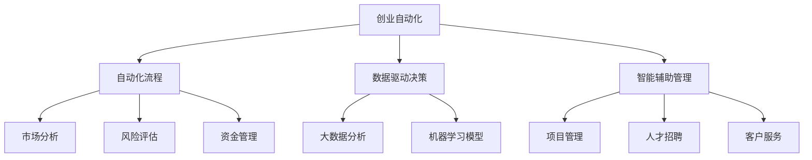

                 

# 创业自动化与传统创业模式的对比

> 关键词：创业自动化, 创业模式, 软件工程, 人工智能, 数据驱动, 传统创业

## 1. 背景介绍

### 1.1 问题由来

随着信息技术的快速发展，创业领域发生了深刻的变革。传统的创业模式往往依赖于人力密集型的管理和决策过程，容易受限于管理者的经验和直觉，效率较低且决策质量不稳定。而自动化技术的应用，尤其是人工智能和大数据分析技术，为创业提供了新的可能性。

创业自动化是一种利用先进技术手段，实现创业过程自动化、智能化、数据驱动化的方式。它通过软件工具、机器学习模型、数据分析等手段，优化决策过程，提升创业效率和成功率。

### 1.2 问题核心关键点

创业自动化的核心关键点包括：

- 自动化流程：将创业过程的关键环节（如市场分析、风险评估、资金管理等）进行自动化，减少人工干预。
- 数据驱动决策：通过大量数据分析和机器学习模型，优化创业决策，降低人为误判。
- 智能辅助管理：利用人工智能技术，提供智能化的项目管理、人才招聘、客户服务等功能。
- 数据安全与隐私保护：确保创业过程中产生的大量数据的安全性和隐私性，防止数据泄露和滥用。

这些关键点构成了创业自动化的主要框架，有助于创业公司更好地把握市场机会，降低风险，提升竞争力。

## 2. 核心概念与联系

### 2.1 核心概念概述

为更好地理解创业自动化与传统创业模式的对比，本节将介绍几个密切相关的核心概念：

- **创业自动化**：利用先进技术手段，优化创业过程，提升效率和成功率。包括自动化流程、数据驱动决策、智能辅助管理等。
- **传统创业模式**：以人力为主导的创业过程，依赖个人经验、直觉和资源分配，过程相对缓慢且不透明。
- **软件工程**：将软件开发的流程、方法和工具应用于创业管理，提升创业效率和可维护性。
- **人工智能**：利用机器学习、深度学习等技术，实现创业过程的智能化和自动化。
- **数据驱动决策**：通过大数据分析和机器学习模型，进行数据驱动的创业决策，提高决策的科学性和准确性。
- **项目管理**：创业过程中需要综合管理多个任务和项目，确保项目按时按质完成。
- **人才招聘**：创业公司需要寻找合适的人才，提升团队竞争力。
- **客户服务**：提供高效、个性化的客户服务，提升客户满意度。

这些核心概念之间的逻辑关系可以通过以下Mermaid流程图来展示：



这个流程图展示了创业自动化的核心概念及其之间的关系：

1. 创业自动化利用软件工程和人工智能技术，实现了创业过程的自动化、智能化。
2. 自动化流程、数据驱动决策、智能辅助管理等模块，构成了创业自动化的主要功能。
3. 通过市场分析、风险评估、资金管理等子模块，使创业决策更加科学和全面。

## 3. 核心算法原理 & 具体操作步骤
### 3.1 算法原理概述

创业自动化的核心算法原理主要包括以下几个方面：

- **自动化流程算法**：通过流程定义和任务编排，实现创业过程的自动化。例如，使用工作流管理系统（如Zapier、Trello等）来自动化任务流程。
- **数据驱动决策算法**：利用大数据分析和机器学习模型，进行创业决策。例如，通过分析市场数据、用户反馈、竞争对手情况等，进行市场预测和风险评估。
- **智能辅助管理算法**：使用人工智能技术，提供智能化的项目管理、人才招聘、客户服务等功能。例如，使用聊天机器人提供客户服务，使用推荐系统进行人才招聘。

这些算法共同构成了创业自动化的技术基础，实现了创业过程的自动化、智能化和数据驱动化。

### 3.2 算法步骤详解

以下是创业自动化常用的算法步骤：

1. **需求分析**：明确创业过程中需要自动化的环节，例如市场分析、风险评估、资金管理等。
2. **流程设计**：设计自动化的流程和任务，例如使用工作流管理系统定义任务、编排流程。
3. **数据准备**：收集和整理创业过程中需要的数据，例如市场数据、用户反馈、竞争对手情况等。
4. **模型训练**：利用大数据分析和机器学习模型，训练决策模型。例如，使用回归模型进行市场预测，使用分类模型进行风险评估。
5. **模型部署**：将训练好的模型部署到实际应用中，例如集成到项目管理系统中，进行实时决策。
6. **持续优化**：根据实际效果反馈，不断优化算法和模型，提高自动化和智能化的水平。

### 3.3 算法优缺点

创业自动化技术具有以下优点：

- **效率提升**：自动化流程和数据驱动决策，大大提升了创业过程的效率。
- **决策科学**：数据驱动的决策，降低了人为误判的风险，提高了决策的科学性。
- **智能化管理**：利用人工智能技术，提供智能化的项目管理、人才招聘、客户服务等功能，提升了团队和客户管理的水平。

同时，创业自动化技术也存在一定的局限性：

- **初始成本高**：引入自动化技术和数据驱动决策，需要一定的技术储备和资源投入。
- **数据依赖性强**：依赖于高质量的数据，数据质量不佳会影响自动化效果。
- **技术复杂度高**：需要综合运用多种技术手段，包括软件工程、人工智能、数据分析等，对技术要求较高。
- **安全风险**：自动化系统可能存在数据泄露和隐私保护的风险，需要加强安全措施。

### 3.4 算法应用领域

创业自动化的应用领域非常广泛，涵盖了创业过程的多个环节：

- **市场分析**：通过市场数据和竞争对手分析，预测市场趋势和机会。
- **风险评估**：利用大数据和机器学习模型，评估创业项目的风险。
- **资金管理**：自动化资金筹集、使用和监控，确保资金高效运转。
- **项目管理**：自动化任务分配、进度跟踪和风险监控，确保项目按时按质完成。
- **人才招聘**：通过数据分析和推荐系统，高效匹配合适的人才。
- **客户服务**：利用聊天机器人等智能工具，提供高效、个性化的客户服务。

这些应用领域展示了创业自动化的广泛适用性，提升了创业公司的整体运营效率和竞争力。

## 4. 数学模型和公式 & 详细讲解 & 举例说明

### 4.1 数学模型构建

为了更好地理解创业自动化的数学模型，本节将介绍几个常用的数学模型：

- **回归模型**：用于预测市场趋势和机会。
- **分类模型**：用于评估创业项目的风险。
- **聚类模型**：用于分析用户行为和需求。

### 4.2 公式推导过程

以下是回归模型的推导过程：

假设市场数据为 $(x_1, y_1), (x_2, y_2), ..., (x_n, y_n)$，其中 $x_i$ 为市场特征，$y_i$ 为市场表现。假设回归模型为 $y = \beta_0 + \beta_1 x_1 + ... + \beta_k x_k + \epsilon$，其中 $\beta_0, \beta_1, ..., \beta_k$ 为模型参数，$\epsilon$ 为误差项。

利用最小二乘法，求解模型参数 $\beta_0, \beta_1, ..., \beta_k$，使得预测值与真实值之间的误差最小化：

$$
\min_{\beta} \sum_{i=1}^n (y_i - (\beta_0 + \beta_1 x_{1i} + ... + \beta_k x_{ki}))^2
$$

通过求解上述优化问题，可以得到模型参数 $\beta_0, \beta_1, ..., \beta_k$，进而构建回归模型。

### 4.3 案例分析与讲解

以下是一个基于回归模型进行市场预测的案例分析：

假设某创业公司希望预测下一季度市场需求，已收集到过去两年的市场数据。将市场数据分为训练集和测试集，利用训练集构建回归模型，并使用测试集进行验证。

具体步骤如下：

1. **数据预处理**：清洗数据，去除异常值和缺失值，进行标准化处理。
2. **特征选择**：选择对市场预测有影响的特征，如季节性因素、竞争对手情况等。
3. **模型训练**：使用训练集数据，构建回归模型，求解模型参数。
4. **模型验证**：使用测试集数据，评估模型预测效果。
5. **模型应用**：将构建好的模型应用于实际的市场预测中。

通过数据驱动的回归模型，创业公司可以更科学地预测市场需求，做出更准确的创业决策。

## 5. 项目实践：代码实例和详细解释说明

### 5.1 开发环境搭建

在进行创业自动化实践前，我们需要准备好开发环境。以下是使用Python进行创业自动化开发的环境配置流程：

1. 安装Anaconda：从官网下载并安装Anaconda，用于创建独立的Python环境。

2. 创建并激活虚拟环境：
```bash
conda create -n startup python=3.8 
conda activate startup
```

3. 安装创业自动化相关的库：
```bash
pip install scikit-learn pandas numpy plotly dash
```

完成上述步骤后，即可在`startup`环境中开始创业自动化实践。

### 5.2 源代码详细实现

以下是使用Python和Scikit-learn库构建回归模型进行市场预测的代码实现：

```python
import pandas as pd
from sklearn.model_selection import train_test_split
from sklearn.linear_model import LinearRegression
from sklearn.metrics import mean_squared_error

# 读取市场数据
data = pd.read_csv('market_data.csv')

# 数据预处理
data = data.dropna()
data = data.drop(['date'], axis=1)

# 特征选择
X = data[['feature1', 'feature2', 'feature3']]
y = data['market_sales']

# 划分训练集和测试集
X_train, X_test, y_train, y_test = train_test_split(X, y, test_size=0.2, random_state=42)

# 构建回归模型
model = LinearRegression()
model.fit(X_train, y_train)

# 模型验证
y_pred = model.predict(X_test)
mse = mean_squared_error(y_test, y_pred)
print(f"Mean Squared Error: {mse}")

# 模型应用
new_data = pd.DataFrame({'feature1': [1, 2, 3], 'feature2': [4, 5, 6], 'feature3': [7, 8, 9]})
new_data = new_data.dropna()
new_data = new_data.drop(['date'], axis=1)
predictions = model.predict(new_data)
print(f"Predictions: {predictions}")
```

以上是使用Scikit-learn库构建回归模型进行市场预测的完整代码实现。可以看到，通过简短的代码，我们实现了市场数据的预处理、模型训练、验证和应用。

### 5.3 代码解读与分析

让我们再详细解读一下关键代码的实现细节：

**数据预处理**：
- 通过`dropna()`去除缺失值，通过`drop()`去除无用特征。

**模型训练**：
- 使用`train_test_split()`将数据划分为训练集和测试集。
- 构建`LinearRegression`模型，并通过`fit()`方法拟合训练集数据。

**模型验证**：
- 使用`predict()`方法预测测试集数据，通过`mean_squared_error()`计算预测值与真实值之间的均方误差。

**模型应用**：
- 将新数据输入模型，通过`predict()`方法进行预测。

可以看到，使用Scikit-learn库进行创业自动化的实践，代码实现简洁高效，易于理解和维护。

## 6. 实际应用场景

### 6.1 智能招聘

智能招聘是创业自动化的一个重要应用场景。传统的招聘方式依赖于HR的经验和直觉，效率较低且成本较高。而通过自动化技术，可以显著提升招聘效率和质量。

具体而言，可以通过以下步骤实现智能招聘：

1. **需求分析**：明确招聘岗位的职责、要求和期望。
2. **流程设计**：设计自动化的招聘流程，包括简历筛选、面试安排、候选人评估等。
3. **数据准备**：收集和整理招聘数据，例如候选人的简历、面试记录等。
4. **模型训练**：利用机器学习模型，进行候选人评估和匹配。
5. **模型部署**：将训练好的模型集成到招聘系统中，实现自动化招聘。
6. **持续优化**：根据招聘效果反馈，不断优化模型和流程。

通过智能招聘系统，创业公司可以高效地找到合适的人才，提升团队竞争力。

### 6.2 客户服务

客户服务是创业过程中不可或缺的一部分，传统的人力客服方式效率较低，且难以满足客户的个性化需求。利用自动化技术，可以实现高效的客户服务。

具体而言，可以通过以下步骤实现客户服务自动化：

1. **需求分析**：明确客户服务的目标和需求，例如常见问题解答、问题诊断、个性化推荐等。
2. **流程设计**：设计自动化的客户服务流程，包括问题识别、解答生成、对话管理等。
3. **数据准备**：收集和整理客户服务数据，例如常见问题、回答、对话记录等。
4. **模型训练**：利用机器学习模型，进行问题识别和回答生成。
5. **模型部署**：将训练好的模型集成到客户服务系统中，实现自动化客服。
6. **持续优化**：根据客户反馈，不断优化模型和流程。

通过客户服务自动化，创业公司可以提供高效、个性化的客户服务，提升客户满意度。

### 6.3 财务分析

财务分析是创业过程中关键的环节，传统的手工分析方式效率低且易出错。通过自动化技术，可以实现高效的财务分析。

具体而言，可以通过以下步骤实现财务分析自动化：

1. **需求分析**：明确财务分析的目标和需求，例如预算编制、成本控制、收益预测等。
2. **流程设计**：设计自动化的财务分析流程，包括数据收集、数据分析、报表生成等。
3. **数据准备**：收集和整理财务数据，例如收入、支出、利润等。
4. **模型训练**：利用机器学习模型，进行财务预测和分析。
5. **模型部署**：将训练好的模型集成到财务分析系统中，实现自动化分析。
6. **持续优化**：根据财务分析效果反馈，不断优化模型和流程。

通过财务分析自动化，创业公司可以高效地进行财务预测和分析，确保资金健康运转。

### 6.4 未来应用展望

随着创业自动化的不断发展，未来将涌现更多应用场景，带来更大的商业价值：

1. **智能采购**：通过自动化技术，实现供应链的优化和采购决策的智能化。
2. **智能营销**：利用大数据和机器学习，进行市场细分和个性化营销。
3. **智能决策支持**：通过智能化的决策支持系统，辅助创业决策，提高决策的科学性。
4. **智能运营管理**：利用自动化技术，提升运营管理的效率和效果。

未来，创业自动化将成为创业公司的重要竞争力，为创业过程带来更多的创新和价值。

## 7. 工具和资源推荐
### 7.1 学习资源推荐

为了帮助开发者系统掌握创业自动化的理论基础和实践技巧，这里推荐一些优质的学习资源：

1. 《创业自动化：从理论到实践》系列博文：由创业自动化技术专家撰写，深入浅出地介绍了创业自动化的理论基础和实践技巧。

2. 《软件工程与创业管理》课程：由知名高校开设的课程，系统讲解了软件工程在创业管理中的应用，包括自动化流程、数据驱动决策等。

3. 《人工智能在创业中的应用》书籍：详细介绍了人工智能技术在创业自动化中的各种应用，包括市场预测、风险评估、客户服务等。

4. HuggingFace官方文档：提供了丰富的创业自动化相关资料和样例代码，是学习创业自动化的必备资源。

5. GitHub开源项目：提供了大量创业自动化相关的开源项目，包括市场预测、客户服务、财务分析等。

通过对这些资源的学习实践，相信你一定能够快速掌握创业自动化的精髓，并用于解决实际的创业问题。

### 7.2 开发工具推荐

高效的开发离不开优秀的工具支持。以下是几款用于创业自动化开发的常用工具：

1. Python：灵活的编程语言，广泛用于数据科学和机器学习项目。
2. Scikit-learn：开源的机器学习库，提供了多种常用算法和工具。
3. Pandas：数据处理和分析库，方便数据清洗和预处理。
4. Plotly：数据可视化工具，支持交互式图表和动态展示。
5. Dash：Web应用开发框架，方便构建自动化系统的Web界面。
6. TensorFlow和PyTorch：深度学习框架，支持构建和训练各种机器学习模型。

合理利用这些工具，可以显著提升创业自动化的开发效率，加快创新迭代的步伐。

### 7.3 相关论文推荐

创业自动化技术的发展源于学界的持续研究。以下是几篇奠基性的相关论文，推荐阅读：

1. "创业自动化的数学模型与应用"：详细介绍了创业自动化的数学模型，包括回归模型、分类模型、聚类模型等。

2. "智能招聘系统设计与实现"：介绍了智能招聘系统的设计思路和实现方法，包括简历筛选、面试安排、候选人评估等。

3. "客户服务自动化技术与应用"：详细介绍了客户服务自动化的技术原理和应用案例，包括问题识别、回答生成、对话管理等。

4. "财务分析自动化系统设计与实现"：介绍了财务分析自动化的设计思路和实现方法，包括数据收集、数据分析、报表生成等。

这些论文代表了大创业自动化技术的发展脉络。通过学习这些前沿成果，可以帮助研究者把握学科前进方向，激发更多的创新灵感。

## 8. 总结：未来发展趋势与挑战
### 8.1 总结

本文对创业自动化的理论基础和实践方法进行了全面系统的介绍。首先阐述了创业自动化的背景和意义，明确了创业自动化在提升创业效率和成功率方面的独特价值。其次，从原理到实践，详细讲解了创业自动化的数学模型和关键步骤，给出了创业自动化任务开发的完整代码实例。同时，本文还探讨了创业自动化的应用场景，展示了创业自动化的广泛适用性。

通过本文的系统梳理，可以看到，创业自动化技术正在成为创业公司的重要竞争力，极大地提升了创业过程的效率和成功率。未来，伴随创业自动化技术的不断进步，必将为创业过程带来更多的创新和价值。

### 8.2 未来发展趋势

展望未来，创业自动化的发展趋势包括：

1. **自动化程度提升**：随着技术的不断进步，创业自动化的自动化程度将不断提高，更多的创业过程将实现自动化。
2. **智能化水平提升**：利用人工智能技术，实现更加智能化的创业决策和运营管理。
3. **数据驱动决策**：数据驱动的决策将越来越重要，利用大数据分析和机器学习模型，进行更加科学和准确的决策。
4. **多模态融合**：利用多模态数据（如文本、图像、语音等），进行更全面和深入的创业分析。
5. **平台化服务**：将创业自动化技术封装为平台服务，提供通用化的解决方案，方便更多企业使用。

这些趋势展示了创业自动化的广阔前景，相信未来将有更多的创业公司受益于自动化技术，提升运营效率和竞争力。

### 8.3 面临的挑战

尽管创业自动化技术已经取得了显著进展，但在实现过程中仍面临诸多挑战：

1. **初始成本高**：引入自动化技术和数据驱动决策，需要一定的技术储备和资源投入，对中小企业来说可能存在一定的负担。
2. **数据质量问题**：创业数据往往质量参差不齐，数据质量问题会影响自动化效果。
3. **技术复杂度高**：需要综合运用多种技术手段，包括软件工程、人工智能、数据分析等，对技术要求较高。
4. **安全风险**：自动化系统可能存在数据泄露和隐私保护的风险，需要加强安全措施。

这些挑战需要创业公司积极应对，加强技术储备和资源投入，提高数据质量和安全性，才能更好地利用创业自动化技术，提升创业效率和成功率。

### 8.4 研究展望

未来的研究需要在以下几个方面寻求新的突破：

1. **模型优化**：不断优化创业自动化的模型和算法，提高自动化效果。
2. **技术集成**：将创业自动化技术与业务需求紧密结合，提供更全面和高效的解决方案。
3. **多模态融合**：利用多模态数据，进行更全面和深入的创业分析。
4. **智能化管理**：利用人工智能技术，实现更加智能化的创业决策和运营管理。
5. **平台化服务**：将创业自动化技术封装为平台服务，提供通用化的解决方案，方便更多企业使用。

这些研究方向的探索，必将引领创业自动化技术迈向更高的台阶，为创业过程带来更多的创新和价值。

## 9. 附录：常见问题与解答

**Q1：创业自动化是否适用于所有创业公司？**

A: 创业自动化适用于大多数创业公司，特别是那些需要高效、科学决策和管理的公司。但对于一些传统行业，可能受到技术限制和资源限制，难以实现完全的自动化。

**Q2：如何选择合适的创业自动化工具？**

A: 选择创业自动化工具时，需要考虑以下几个因素：
1. 是否易于上手，是否有完善的文档和社区支持。
2. 是否具备足够的算法和功能，能否满足业务需求。
3. 是否具有良好的扩展性和可定制性，能否根据具体需求进行调整。
4. 是否具有良好的性能和稳定性，能否应对大规模数据和高并发请求。

**Q3：创业自动化如何保障数据安全和隐私？**

A: 创业自动化系统需要综合考虑数据安全和隐私保护，具体措施包括：
1. 数据加密，防止数据泄露。
2. 访问控制，限制数据访问权限。
3. 匿名化处理，保护个人隐私。
4. 定期备份，防止数据丢失。

**Q4：创业自动化是否需要专业的技术团队？**

A: 创业自动化需要一定的技术储备和资源投入，建议组建专业的技术团队，负责系统的开发、部署和维护。对于中小型企业，可以考虑外包或第三方服务，降低技术门槛。

通过本文的系统梳理，可以看到，创业自动化技术正在成为创业公司的重要竞争力，极大地提升了创业过程的效率和成功率。未来，伴随创业自动化技术的不断进步，必将为创业过程带来更多的创新和价值。

