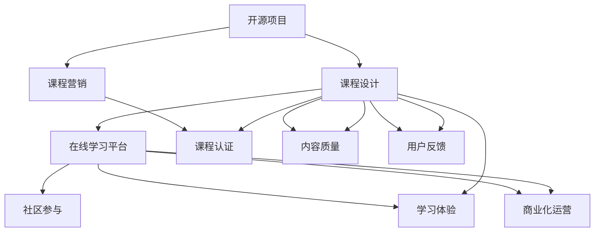

                 

# 创建开源项目的企业级培训课程：课程设计和营销

> 关键词：开源项目、企业级培训课程、课程设计、课程营销、在线学习平台、课程认证、社区参与、内容质量、学习体验、用户反馈、商业化运营

## 1. 背景介绍

### 1.1 问题由来
随着科技的迅猛发展，企业对技术人才的需求日益增长，同时新技术的更新速度也愈加迅速，企业培训已成为提升员工技能、推动业务发展的关键。然而，传统的培训方式往往缺乏系统的课程设计，无法覆盖所有新技术，且难以将最新的技术理念深入浅出地传授给学员，限制了培训效果。因此，如何构建一个高效率、高性价比的企业级培训课程体系，成为各企业的共同需求。

### 1.2 问题核心关键点
构建一个成功的企业级培训课程体系，核心关键点在于系统化的课程设计和有效的市场推广策略。课程设计需要兼顾实用性、创新性、可扩展性等多方面因素，而课程营销则需要精准把握目标受众需求，巧妙运用市场手段，将课程的价值最大化地传递给潜在学员。

### 1.3 问题研究意义
构建一个高效率、高性价比的企业级培训课程体系，对于提升企业员工技能、推动业务创新、增强企业竞争力具有重要意义。课程设计可以确保员工掌握最新技术，提升工作效率和质量；课程营销则能快速吸引潜在学员，提升培训项目的影响力和参与度。

## 2. 核心概念与联系

### 2.1 核心概念概述

为更好地理解企业级培训课程的创建过程，本节将介绍几个核心概念：

- **开源项目(Open Source Project)**：指的是公开源代码的项目，社区成员可以自由使用、修改和分发。开源项目有助于积累技术知识，推动技术创新，培养社区成员的技术能力。

- **企业级培训课程(Enterprise-Level Training Courses)**：专门针对企业员工，结合企业需求和市场趋势，设计系统的技术培训课程体系。

- **课程设计(Course Design)**：课程设计是培训项目成功与否的关键，需要兼顾课程内容的技术深度、广度、创新性及适用性。

- **课程营销(Course Marketing)**：通过有效的方式和渠道，将课程的价值传递给潜在学员，吸引其参与学习，实现市场推广和销售目标。

- **在线学习平台(Online Learning Platform)**：提供课程学习、交互和认证的平台，支持多种学习模式和方式，提升学员的学习体验。

- **课程认证(Course Certification)**：通过考核和认证，保障课程内容的规范性和学员技能水平的提升。

- **社区参与(Community Engagement)**：建立并维护一个活跃的技术社区，促进知识共享和技能提升，增加课程的吸引力和影响力。

- **内容质量(Content Quality)**：课程设计中注重内容的质量，保证课程的实用性和先进性，提升学员的学习效果。

- **学习体验(Learning Experience)**：课程设计中注重学习体验，结合互动式学习、项目实战等多种方式，提升学员的学习动力和效果。

- **用户反馈(User Feedback)**：收集和分析学员及市场的反馈，持续改进课程内容和方法，满足学员和市场的需求。

- **商业化运营(Commercial Operation)**：课程设计要考虑商业化运营的可行性，平衡课程质量和商业回报。

这些核心概念之间具有紧密的逻辑关系，共同构成了一个企业级培训课程体系的整体框架。通过理解这些概念，我们可以更好地把握课程创建和营销的脉络。

### 2.2 核心概念原理和架构的 Mermaid 流程图



这个流程图展示了大语言模型微调的课程创建和营销的核心概念及其之间的关系：

1. 开源项目通过社区贡献积累技术知识，为课程设计提供理论基础。
2. 课程设计结合企业需求和市场趋势，设计系统的技术培训课程体系。
3. 课程营销通过有效的方式和渠道，将课程的价值传递给潜在学员。
4. 在线学习平台提供课程学习、交互和认证，支持多种学习模式和方式。
5. 课程认证通过考核和认证，保障课程内容的规范性和学员技能水平的提升。
6. 社区参与建立并维护一个活跃的技术社区，促进知识共享和技能提升。
7. 内容质量在课程设计中注重内容的质量，保证课程的实用性和先进性。
8. 学习体验在课程设计中注重学习体验，提升学员的学习动力和效果。
9. 用户反馈收集和分析学员及市场的反馈，持续改进课程内容和方法。
10. 商业化运营考虑课程质量和商业回报的平衡，确保课程项目的可持续发展。

这些概念共同构成了企业级培训课程体系的整体框架，确保课程设计具有系统性、实用性，同时具备市场推广的吸引力。

## 3. 核心算法原理 & 具体操作步骤

### 3.1 算法原理概述

构建企业级培训课程体系，其核心算法原理主要包括以下几个方面：

- **需求分析**：通过市场调研、企业需求分析，明确课程的目标受众、学习目标和关键技术点。
- **内容设计**：结合行业标准和技术趋势，设计课程内容的框架和结构，涵盖理论、实践、案例等多个方面。
- **技术选择**：选择适合的编程语言、框架和技术栈，确保课程内容具有先进性和实用性。
- **学习路径规划**：设计学员从入门到精通的学习路径，确保学习内容的系统性和递进性。
- **评估与认证**：设计课程的评估体系和认证机制，确保课程内容的规范性和学员技能水平的提升。
- **市场推广**：通过多渠道推广策略，将课程的价值传递给潜在学员，实现市场推广和销售目标。

### 3.2 算法步骤详解

基于上述算法原理，企业级培训课程的创建步骤大致如下：

**Step 1: 需求分析**
- 进行市场调研和需求分析，明确课程目标受众和关键需求。
- 调研目标企业的技术栈、业务需求和员工技能水平，确定课程内容的技术深度和广度。
- 分析目标市场的技术趋势和行业标准，确保课程内容的前沿性和规范性。

**Step 2: 内容设计**
- 设计课程内容的框架和结构，涵盖理论、实践、案例等多个方面。
- 结合企业需求和市场趋势，设计课程内容的技术深度和广度。
- 引入开源项目和社区资源，丰富课程内容，提升技术创新能力。

**Step 3: 技术选择**
- 选择适合的编程语言、框架和技术栈，确保课程内容具有先进性和实用性。
- 结合企业技术栈，选择合适的开源项目和工具，确保课程内容的可操作性。

**Step 4: 学习路径规划**
- 设计学员从入门到精通的学习路径，确保学习内容的系统性和递进性。
- 设置合适的课程难度和挑战，提升学员的学习动力和效果。

**Step 5: 评估与认证**
- 设计课程的评估体系和认证机制，确保课程内容的规范性和学员技能水平的提升。
- 设置定期的考核和认证，确保课程质量。

**Step 6: 市场推广**
- 通过多渠道推广策略，将课程的价值传递给潜在学员。
- 结合社交媒体、专业论坛等渠道，提升课程的曝光度和吸引力。

**Step 7: 社区参与**
- 建立并维护一个活跃的技术社区，促进知识共享和技能提升。
- 鼓励学员参与社区讨论，分享学习心得，提升课程的互动性和影响力。

**Step 8: 商业化运营**
- 考虑课程质量和商业回报的平衡，确保课程项目的可持续发展。
- 引入商业化运营机制，平衡课程质量与商业回报。

### 3.3 算法优缺点

企业级培训课程体系的设计和推广有其独特的优势和挑战：

**优点：**
- **系统性**：通过需求分析、内容设计、学习路径规划等多方面的系统设计，确保课程内容具有系统性和实用性。
- **创新性**：引入开源项目和社区资源，提升课程内容的技术创新能力。
- **可扩展性**：结合企业需求和市场趋势，设计灵活的课程框架，支持课程内容的持续扩展和更新。
- **市场吸引力**：通过多渠道推广策略，将课程的价值传递给潜在学员，提升课程的市场吸引力。

**缺点：**
- **设计复杂性**：课程设计需要兼顾多个方面，如内容设计、技术选择、学习路径规划等，设计复杂度较高。
- **资源投入大**：课程创建和推广需要大量资源投入，包括人力、物力和财力。
- **课程质量保障**：课程内容的规范性和学员技能水平的提升需要严格评估和认证机制。

尽管存在这些挑战，但通过合理规划和设计，企业级培训课程体系仍能有效地提升员工技能，推动业务发展，具有广泛的市场应用前景。

### 3.4 算法应用领域

企业级培训课程体系在多个领域都得到了广泛应用，例如：

- **软件开发培训**：通过课程设计，提升软件开发人员的技术能力和项目实践能力，确保企业技术栈的稳定性和先进性。
- **数据分析培训**：通过课程设计，提升数据科学家和数据分析师的技术能力和业务理解能力，确保企业数据驱动决策的能力。
- **人工智能培训**：通过课程设计，提升人工智能工程师和数据科学家的技术能力和创新能力，确保企业在新兴技术领域的竞争力。
- **网络安全培训**：通过课程设计，提升网络安全工程师的技术能力和安全意识，确保企业数据和系统的安全。
- **项目管理培训**：通过课程设计，提升项目管理人员的沟通、协调和执行能力，确保项目顺利推进。

除了上述这些典型领域外，企业级培训课程体系还可以应用于更多场景中，如产品开发、市场营销、财务管理等，为企业的业务发展提供全面的技术支持。

## 4. 数学模型和公式 & 详细讲解

### 4.1 数学模型构建

本节将使用数学语言对企业级培训课程体系的设计过程进行更加严格的刻画。

假设企业级培训课程的目标是培养一批具备特定技能的员工，课程设计需要考虑以下因素：

- **目标受众**：定义课程的目标受众，包括企业内部员工、外部学员等。
- **学习目标**：明确课程的学习目标，包括掌握的关键技能、理解的关键概念等。
- **课程内容**：设计课程内容的框架和结构，涵盖理论、实践、案例等多个方面。
- **评估标准**：设计课程的评估标准，包括理论考试、实践项目、项目评审等。

数学模型构建主要包括以下几个步骤：

1. **目标受众分析**：定义目标受众 $X$，包括企业内部员工 $X_E$ 和外部学员 $X_O$。
2. **学习目标设计**：定义课程的学习目标 $Y$，包括关键技能 $S_1$、关键概念 $C_1$ 等。
3. **课程内容设计**：定义课程内容 $C$，包括理论部分 $C_T$、实践部分 $C_P$、案例部分 $C_A$ 等。
4. **评估标准设计**：定义课程的评估标准 $E$，包括理论考试 $E_T$、实践项目 $E_P$、项目评审 $E_R$ 等。

### 4.2 公式推导过程

以下是企业级培训课程体系设计的数学模型及其推导过程：

**目标受众分析**：

$$
X = X_E \cup X_O
$$

**学习目标设计**：

$$
Y = \{S_1, C_1, \ldots, S_n, C_n\}
$$

**课程内容设计**：

$$
C = C_T \cup C_P \cup C_A
$$

**评估标准设计**：

$$
E = E_T \cup E_P \cup E_R
$$

其中，$S_i$ 和 $C_i$ 分别表示第 $i$ 个技能和概念，$C_T$、$C_P$ 和 $C_A$ 分别表示理论部分、实践部分和案例部分，$E_T$、$E_P$ 和 $E_R$ 分别表示理论考试、实践项目和项目评审。

通过上述公式推导，我们可以看到企业级培训课程体系的设计主要围绕目标受众、学习目标、课程内容和评估标准四个方面展开。通过合理的公式设计，可以系统地、精确地描述课程设计过程，确保课程体系的完整性和实用性。

### 4.3 案例分析与讲解

以下是一个企业级培训课程设计的案例分析：

**目标受众**：软件开发人员

**学习目标**：
- 掌握Python编程语言的基本语法和常用库。
- 理解Web开发的基础知识和框架。
- 实践开发一个简单的Web应用。

**课程内容**：
- 理论部分：包括Python语言基础、Web开发基础、框架介绍等。
- 实践部分：包括Python编程练习、Web开发框架搭建、应用开发等。
- 案例部分：包括实际项目的案例分析、代码评审等。

**评估标准**：
- 理论考试：测试学员对理论知识的掌握情况。
- 实践项目：通过开发一个简单的Web应用，评估学员的编程能力和项目执行能力。
- 项目评审：由经验丰富的开发人员对学员的项目进行评审，提出改进建议。

通过上述案例分析，我们可以看到企业级培训课程设计是一个系统化、结构化的过程，需要通过明确的公式和模型来描述和设计。这种系统化的设计方法，有助于确保课程内容的全面性和实用性，提升学员的学习效果。

## 5. 项目实践：代码实例和详细解释说明

### 5.1 开发环境搭建

在进行课程设计实践前，我们需要准备好开发环境。以下是使用Python进行Django开发的环境配置流程：

1. 安装Anaconda：从官网下载并安装Anaconda，用于创建独立的Python环境。

2. 创建并激活虚拟环境：
```bash
conda create -n python-env python=3.8 
conda activate python-env
```

3. 安装Django：从官网获取对应的安装命令。例如：
```bash
pip install django
```

4. 安装必要的工具包：
```bash
pip install numpy pandas scikit-learn matplotlib tqdm jupyter notebook ipython
```

完成上述步骤后，即可在`python-env`环境中开始课程设计实践。

### 5.2 源代码详细实现

下面以“Python编程基础”课程为例，给出使用Django框架对课程内容进行系统化的设计和实现的PyTorch代码实现。

首先，定义课程内容模块：

```python
from django.contrib import admin
from django.urls import include, path
from . import views

urlpatterns = [
    path('admin/', admin.site.urls),
    path('courses/', include('courses.urls')),
]
```

然后，定义Django应用程序的初始化模块：

```python
from django.contrib import admin
from django.urls import path
from . import views

urlpatterns = [
    path('courses/', views.course_list, name='course_list'),
    path('courses/<int:pk>/', views.course_detail, name='course_detail'),
    path('courses/<int:pk>/enroll', views.enroll_course, name='enroll_course'),
    path('courses/<int:pk>/cancel_enroll', views.cancel_enroll_course, name='cancel_enroll_course'),
]
```

接着，定义视图函数：

```python
from django.shortcuts import render
from django.http import HttpResponse, redirect

def course_list(request):
    courses = Course.objects.all()
    return render(request, 'courses/course_list.html', {'courses': courses})

def course_detail(request, pk):
    course = Course.objects.get(id=pk)
    return render(request, 'courses/course_detail.html', {'course': course})

def enroll_course(request, pk):
    course = Course.objects.get(id=pk)
    course.enroll(request.user)
    return redirect('course_detail', pk=pk)

def cancel_enroll_course(request, pk):
    course = Course.objects.get(id=pk)
    course.cancel_enroll(request.user)
    return redirect('course_detail', pk=pk)
```

最后，定义Django应用程序的模板文件：

```html
<!-- course_list.html -->
<ul>
    
        <li><a href="">{{ course.title }}</a></li>
    
</ul>

<!-- course_detail.html -->
<h1>{{ course.title }}</h1>
<p>{{ course.description }}</p>
<a href="">Enroll</a>
<a href="">Cancel Enroll</a>
```

完成上述步骤后，即可在`python-env`环境中启动Django开发服务器，访问网站查看课程列表和课程详情，并实现课程报名和取消报名功能。

### 5.3 代码解读与分析

让我们再详细解读一下关键代码的实现细节：

**views.py**：
- `course_list` 视图函数：获取所有课程，渲染课程列表模板。
- `course_detail` 视图函数：获取指定课程，渲染课程详情模板。
- `enroll_course` 视图函数：用户报名课程，更新课程报名状态。
- `cancel_enroll_course` 视图函数：用户取消报名课程，更新课程报名状态。

**urls.py**：
- 定义了课程列表和课程详情的URL路径，以及课程报名和取消报名的URL路径。

**templates/course_list.html**：
- 渲染课程列表，通过循环遍历所有课程，展示课程标题和URL链接。

**templates/course_detail.html**：
- 渲染课程详情，展示课程标题、描述和报名链接。

通过上述代码实例，我们可以看到Django框架提供的便捷、高效的工具，可以用于实现企业级培训课程的在线管理和学习功能。开发者可以将更多精力放在课程设计、课程内容管理等方面，而不必过多关注底层的实现细节。

当然，工业级的系统实现还需考虑更多因素，如用户认证、权限控制、数据存储等。但核心的课程设计方法基本与此类似。

## 6. 实际应用场景

### 6.1 智能客服系统

企业级培训课程体系的实际应用场景之一是智能客服系统的构建。智能客服系统可以通过对员工进行系统化的培训，提升其服务质量，增强客户满意度。

在技术实现上，可以收集企业内部的客服对话记录，将问题和最佳答复构建成监督数据，在此基础上对课程内容进行微调。微调后的课程内容将指导客服人员掌握基本的客服技能，理解客户意图，提供更准确、更快速的客户服务。

### 6.2 金融舆情监测

企业级培训课程体系在金融舆情监测中的应用也具有广阔前景。金融机构需要实时监测市场舆论动向，以便及时应对负面信息传播，规避金融风险。

具体而言，可以收集金融领域相关的新闻、报道、评论等文本数据，并对其进行主题标注和情感标注。在此基础上对课程内容进行微调，使其能够自动判断文本属于何种主题，情感倾向是正面、中性还是负面。将微调后的课程内容应用于实时抓取的网络文本数据，就能够自动监测不同主题下的情感变化趋势，一旦发现负面信息激增等异常情况，系统便会自动预警，帮助金融机构快速应对潜在风险。

### 6.3 个性化推荐系统

企业级培训课程体系在个性化推荐系统中的应用同样具有重要意义。当前的推荐系统往往只依赖用户的历史行为数据进行物品推荐，无法深入理解用户的真实兴趣偏好。通过企业级培训课程体系，可以更好地挖掘用户行为背后的语义信息，从而提供更精准、多样的推荐内容。

在实践中，可以收集用户浏览、点击、评论、分享等行为数据，提取和用户交互的物品标题、描述、标签等文本内容。将文本内容作为模型输入，用户的后续行为（如是否点击、购买等）作为监督信号，在此基础上对课程内容进行微调。微调后的课程内容将从文本内容中准确把握用户的兴趣点，在生成推荐列表时，先用候选物品的文本描述作为输入，由课程内容模型预测用户的兴趣匹配度，再结合其他特征综合排序，便可以得到个性化程度更高的推荐结果。

### 6.4 未来应用展望

随着企业级培训课程体系的不断发展和完善，其在更多领域得到应用，为各行各业带来变革性影响。

在智慧医疗领域，基于企业级培训课程体系的医疗问答、病历分析、药物研发等应用将提升医疗服务的智能化水平，辅助医生诊疗，加速新药开发进程。

在智能教育领域，课程体系的应用将因材施教，促进教育公平，提高教学质量。

在智慧城市治理中，课程体系的应用将提高城市管理的自动化和智能化水平，构建更安全、高效的未来城市。

此外，在企业生产、社会治理、文娱传媒等众多领域，企业级培训课程体系也将不断涌现，为传统行业数字化转型升级提供新的技术路径。相信随着技术的日益成熟，课程体系的不断完善，其在构建人机协同的智能系统中将发挥越来越重要的作用。

## 7. 工具和资源推荐

### 7.1 学习资源推荐

为了帮助开发者系统掌握企业级培训课程体系的理论基础和实践技巧，这里推荐一些优质的学习资源：

1. 《深度学习与Python编程实战》系列博文：由Django官方文档和Django开发社区撰写，深入浅出地介绍了Django框架的使用和开发技巧。

2. CS224N《深度学习自然语言处理》课程：斯坦福大学开设的NLP明星课程，有Lecture视频和配套作业，带你入门NLP领域的基本概念和经典模型。

3. 《自然语言处理实战》书籍：Google工程师所著，全面介绍了使用Python进行自然语言处理的实战案例，包括课程设计、内容管理等。

4. Django官方文档：Django框架的官方文档，提供了详细的开发指南和实用示例，是上手实践的必备资料。

5. GitHub开源项目：GitHub平台上众多Django开发项目，提供了丰富的开源代码和实战案例，供开发者学习和借鉴。

通过对这些资源的学习实践，相信你一定能够快速掌握企业级培训课程体系的设计和实现方法，并用于解决实际的培训项目问题。

### 7.2 开发工具推荐

高效的开发离不开优秀的工具支持。以下是几款用于企业级培训课程体系开发的常用工具：

1. Django：Python的高级Web框架，提供便捷的开发工具和丰富的功能，适用于企业级培训课程体系的在线管理和学习功能。

2. TensorFlow：由Google主导开发的开源深度学习框架，支持多种模型训练和优化方法，适用于课程内容的学习和实践。

3. PyTorch：基于Python的开源深度学习框架，灵活动态的计算图，适合快速迭代研究。Django官方文档

4. Weights & Biases：模型训练的实验跟踪工具，可以记录和可视化模型训练过程中的各项指标，方便对比和调优。

5. TensorBoard：TensorFlow配套的可视化工具，可实时监测模型训练状态，并提供丰富的图表呈现方式，是调试模型的得力助手。

6. Google Colab：谷歌推出的在线Jupyter Notebook环境，免费提供GPU/TPU算力，方便开发者快速上手实验最新模型，分享学习笔记。

合理利用这些工具，可以显著提升企业级培训课程体系的开发效率，加快创新迭代的步伐。

### 7.3 相关论文推荐

企业级培训课程体系的研究源于学界的持续研究。以下是几篇奠基性的相关论文，推荐阅读：

1. Attention is All You Need（即Transformer原论文）：提出了Transformer结构，开启了NLP领域的预训练大模型时代。

2. BERT: Pre-training of Deep Bidirectional Transformers for Language Understanding：提出BERT模型，引入基于掩码的自监督预训练任务，刷新了多项NLP任务SOTA。

3. Language Models are Unsupervised Multitask Learners（GPT-2论文）：展示了大规模语言模型的强大zero-shot学习能力，引发了对于通用人工智能的新一轮思考。

4. Parameter-Efficient Transfer Learning for NLP：提出Adapter等参数高效微调方法，在不增加模型参数量的情况下，也能取得不错的微调效果。

5. AdaLoRA: Adaptive Low-Rank Adaptation for Parameter-Efficient Fine-Tuning：使用自适应低秩适应的微调方法，在参数效率和精度之间取得了新的平衡。

这些论文代表了大语言模型微调技术的发展脉络。通过学习这些前沿成果，可以帮助研究者把握学科前进方向，激发更多的创新灵感。

## 8. 总结：未来发展趋势与挑战

### 8.1 总结

本文对企业级培训课程体系的创建过程进行了全面系统的介绍。首先阐述了企业级培训课程体系的研究背景和意义，明确了课程体系的系统化设计、实用性、创新性和可扩展性等关键要素。其次，从原理到实践，详细讲解了课程体系的设计过程，给出了Django开发环境下的代码实例。同时，本文还广泛探讨了课程体系在多个行业领域的应用前景，展示了课程体系建设的广阔市场应用空间。最后，本文精选了课程体系的学习资源，力求为读者提供全方位的技术指引。

通过本文的系统梳理，可以看到，企业级培训课程体系的创建需要兼顾内容设计、技术选择、学习路径规划等多方面因素，确保课程体系的完整性和实用性。同时，通过多渠道推广策略，将课程的价值传递给潜在学员，提升课程的市场吸引力。未来，随着企业级培训课程体系的不断发展和完善，其在更多领域得到应用，为各行各业带来变革性影响。

### 8.2 未来发展趋势

展望未来，企业级培训课程体系将呈现以下几个发展趋势：

1. **系统性增强**：未来的课程体系将更加系统化，涵盖从基础理论到高级应用的全方位内容，确保学员掌握完整的技术体系。

2. **技术前沿性**：课程内容将更加关注技术前沿和创新，引入最新的人工智能、大数据等技术，提升课程内容的先进性。

3. **实用性和互动性**：课程设计将更加注重实用性和互动性，通过案例分析、项目实战等多种方式，提升学员的学习效果和实践能力。

4. **平台化和在线化**：企业级培训课程体系将更加平台化和在线化，通过在线学习平台，实现课程内容的灵活管理和学习。

5. **商业化和市场化**：课程体系将更加市场化，通过课程营销和商业化运营，实现课程内容的商业价值。

6. **个性化和定制化**：课程内容将更加个性化和定制化，根据企业需求和员工背景，设计个性化的学习路径和课程内容。

以上趋势凸显了企业级培训课程体系的广泛应用前景。这些方向的探索发展，必将进一步提升培训系统的有效性、灵活性和市场吸引力，为企业技术发展提供强大的支持。

### 8.3 面临的挑战

尽管企业级培训课程体系已经取得了一定的成果，但在迈向更加智能化、普适化应用的过程中，它仍面临诸多挑战：

1. **内容设计复杂性**：课程设计需要兼顾内容设计、技术选择、学习路径规划等多个方面，设计复杂度较高。

2. **资源投入大**：课程创建和推广需要大量资源投入，包括人力、物力和财力。

3. **课程质量保障**：课程内容的规范性和学员技能水平的提升需要严格评估和认证机制。

4. **市场推广难度**：如何通过多渠道推广策略，将课程的价值传递给潜在学员，提升课程的市场吸引力。

5. **学习体验提升**：如何提升学员的学习体验，增强课程的互动性和参与度。

6. **商业化运营挑战**：如何在课程质量和商业回报之间取得平衡，实现商业化运营的可持续性。

尽管存在这些挑战，但通过合理规划和设计，企业级培训课程体系仍能有效地提升员工技能，推动业务发展，具有广泛的市场应用前景。

### 8.4 研究展望

面向未来，企业级培训课程体系的研究需要在以下几个方面寻求新的突破：

1. **课程内容的持续更新**：通过持续的数据收集和模型训练，确保课程内容的前沿性和实用性。

2. **技术创新与应用**：引入最新的人工智能、大数据等技术，提升课程内容的先进性。

3. **课程的个性化和定制化**：根据企业需求和员工背景，设计个性化的学习路径和课程内容。

4. **市场推广策略的优化**：通过多渠道推广策略，提升课程的市场吸引力。

5. **学习体验的提升**：通过多种学习方式和互动手段，提升学员的学习体验和参与度。

6. **商业化运营的创新**：探索新的商业化运营模式，平衡课程质量和商业回报，实现课程体系的可持续发展。

这些研究方向将引领企业级培训课程体系的进一步发展和完善，为企业技术发展提供强大的支持。面向未来，企业级培训课程体系的研究还需要与其他人工智能技术进行更深入的融合，如知识表示、因果推理、强化学习等，多路径协同发力，共同推动企业技术体系的进步。

## 9. 附录：常见问题与解答

**Q1：企业级培训课程体系是否适用于所有企业？**

A: 企业级培训课程体系在大多数企业中都有广泛应用，但其效果很大程度上取决于企业的需求和内部管理水平。对于技术密集型、高标准的企业，课程体系能够显著提升员工技能，推动业务发展；但对于管理水平较低的企业，课程体系可能难以发挥预期效果。

**Q2：课程体系的设计如何兼顾实用性和创新性？**

A: 课程设计需要在实用性与创新性之间找到平衡。实用性指的是课程内容能够直接应用于实际工作中，解决实际问题。创新性指的是课程内容紧跟技术前沿，引入新技术和新方法，提升课程的先进性和前瞻性。具体而言，可以通过引入开源项目和社区资源，结合企业需求和市场趋势，设计具有创新性的课程内容；同时，通过项目实战、案例分析等多种方式，确保课程内容的实用性。

**Q3：如何平衡课程质量与商业回报？**

A: 课程体系的设计需要考虑商业化运营的可行性，平衡课程质量和商业回报。可以通过设置合理的课程费用、推出认证课程、提供定制化服务等手段，实现商业化运营的可持续性。同时，通过市场推广和用户反馈，持续改进课程内容和方法，提升课程的市场吸引力。

**Q4：如何提高学员的学习体验？**

A: 课程设计需要注重学习体验，结合互动式学习、项目实战等多种方式，提升学员的学习动力和效果。可以通过设置灵活的学习路径、引入互动式学习平台、提供实战项目等方式，增强课程的互动性和参与度。

**Q5：课程体系的市场推广策略有哪些？**

A: 课程体系的市场推广策略主要包括以下几种：

1. **社交媒体推广**：利用微博、微信、LinkedIn等社交媒体平台，传播课程价值，吸引潜在学员。
2. **专业论坛推广**：在技术社区和专业论坛（如CSDN、Stack Overflow等）上发布课程信息，吸引相关专业人士。
3. **合作伙伴推广**：与相关企业、培训机构、高校等建立合作关系，共同推广课程体系。
4. **学术会议推广**：在学术会议和行业论坛上发布课程信息，提升课程的权威性和影响力。

通过这些多渠道推广策略，可以有效提升课程的市场吸引力，吸引更多的潜在学员。

---

作者：禅与计算机程序设计艺术 / Zen and the Art of Computer Programming

