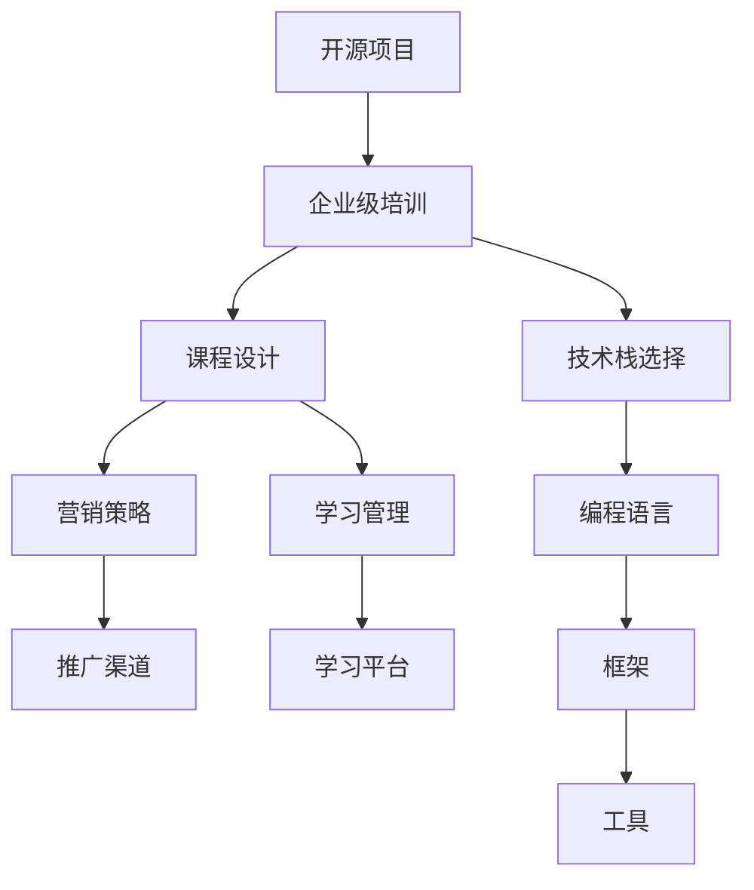

                 

# 创建开源项目的企业级培训课程：课程设计和营销

> 关键词：开源项目、企业级培训、课程设计、营销策略、学习管理、技术栈

## 1. 背景介绍

### 1.1 问题由来

在当今的数字化时代，开源项目成为了企业获取最新技术、驱动创新和节约成本的重要手段。同时，随着全球化和技术进步的步伐加快，企业需要培养出高素质的技术人才，才能在竞争激烈的市场中保持领先地位。因此，企业级培训课程的开发和推广，成为了企业人力资源管理的重要任务。

然而，由于开源项目的多样性、复杂性和技术难度，如何设计出既有深度又具可操作性的企业级培训课程，成为了众多企业面临的难题。加之营销资源的有限和培训效果的未知性，如何让这些课程被更多的企业所接受和使用，进一步增加了挑战的复杂性。

### 1.2 问题核心关键点

要解决这些问题，需要从课程设计、营销策略、学习管理和技术栈选择等多个维度进行全面考量。关键点包括：

- **课程设计**：如何根据企业的技术需求和人才状况，量身定制针对性的课程内容。
- **营销策略**：如何有效地推广和销售课程，吸引更多企业参与。
- **学习管理**：如何通过在线平台和机制，提高学员的学习效率和满意度。
- **技术栈选择**：如何选择适合的编程语言、框架和工具，确保课程的可执行性和实用性。

## 2. 核心概念与联系

### 2.1 核心概念概述

为了更好地理解企业级培训课程的设计和营销过程，本节将介绍几个密切相关的核心概念：

- **开源项目**：指源代码公开的软件项目，供用户自由使用、修改和分发，如Apache、Linux等。
- **企业级培训**：指针对企业技术需求和员工培养目标设计的专门培训，旨在提升企业的技术水平和市场竞争力。
- **课程设计**：指对培训内容、形式和结构进行规划和组织的过程，以确保课程能够满足企业技术需求和员工学习目标。
- **营销策略**：指通过多种手段和渠道，将课程推广给目标受众，促进课程销售和使用的策略。
- **学习管理**：指利用技术和工具，对培训课程的学习过程进行监控、评估和改进，以提高学习效果和用户体验。
- **技术栈选择**：指根据课程目标和学员背景，选择合适的编程语言、框架和工具，确保课程的可执行性和实用性。

这些核心概念之间的逻辑关系可以通过以下Mermaid流程图来展示：



这个流程图展示了几项关键概念之间的关系：

1. 开源项目是企业级培训的来源和基础。
2. 课程设计是针对企业特定需求的定制过程。
3. 营销策略是推广和销售课程的手段。
4. 学习管理是提高学习效果和用户体验的保障。
5. 技术栈选择是课程开发和部署的必要步骤。

这些概念共同构成了企业级培训课程的设计和营销框架，确保培训内容既符合企业需求，又易于推广和执行。

## 3. 核心算法原理 & 具体操作步骤
### 3.1 算法原理概述

企业级培训课程的设计和营销过程，本质上是一个综合多学科知识的决策和执行过程。其核心思想是：通过系统化的课程设计、精准的营销策略和有效的学习管理，将开源项目的技术知识和实践经验，转化为企业员工的技能和能力。

形式化地，假设培训课程为 $C_{\theta}$，其中 $\theta$ 为课程设计的参数集，包括课程内容、形式、结构、目标等。目标受众为企业 $E$，其中 $E$ 的成员 $e_i$ 代表各个企业。营销策略为 $M$，目标是通过营销手段将课程 $C_{\theta}$ 推广给企业 $E$ 的成员 $e_i$，并获得收益 $R$。学习管理策略为 $L$，目标是通过学习平台和机制，确保企业 $E$ 的成员 $e_i$ 能够高效、愉快地完成课程 $C_{\theta}$。

课程设计和营销的目标是最大化收益 $R$，同时提升企业员工的技能水平和满意度。

### 3.2 算法步骤详解

基于上述模型，企业级培训课程的设计和营销可以分为以下几个关键步骤：

**Step 1: 需求分析与课程设计**
- 调研目标企业的需求，了解企业的技术栈、技术痛点和人才状况。
- 根据调研结果，设计课程内容，确定课程形式、时长和难度等关键参数。
- 选择合适的学习管理工具，如在线学习平台、社区讨论工具等。

**Step 2: 确定营销策略**
- 确定目标企业，如行业、规模、技术水平等。
- 选择合适的营销渠道，如社交媒体、技术社区、行业展会等。
- 制定推广计划，包括预算、时间表和评估指标。

**Step 3: 实施学习管理**
- 搭建在线学习平台，支持课程内容发布、学员注册、课程进度跟踪等功能。
- 利用数据分析工具，监控学习效果和用户体验，及时调整课程内容和方法。
- 组织学员反馈和交流活动，提高课程的互动性和实用性。

**Step 4: 技术栈选择与课程实现**
- 根据课程目标和学员背景，选择合适的编程语言、框架和工具。
- 利用开源社区资源，高效实现课程内容，确保课程的可执行性和实用性。
- 测试和优化课程，确保课程的稳定性和安全性。

**Step 5: 发布和推广**
- 发布课程内容，确保课程的可见性和可获取性。
- 使用多种营销手段，如在线广告、内容营销、合作伙伴推广等，吸引更多企业使用课程。
- 收集反馈和数据，不断改进课程内容和营销策略，提升课程质量。

以上是企业级培训课程设计和营销的一般流程。在实际应用中，还需要针对具体企业的特点和需求，对各环节进行优化设计，以确保课程的高效推广和实际效果。

### 3.3 算法优缺点

企业级培训课程的设计和营销方法具有以下优点：
1. 定制化程度高。通过调研和设计，确保课程内容符合企业的技术需求和人才状况，提高培训效果。
2. 推广渠道多样。利用多种营销手段和渠道，可以更广泛地覆盖目标企业，提升课程使用率。
3. 学习管理灵活。通过在线平台和学习工具，可以灵活监控和评估学习过程，提高学习效率和满意度。
4. 技术栈选择灵活。选择合适的技术栈，确保课程的可执行性和实用性，同时降低了开发成本。

同时，该方法也存在一定的局限性：
1. 需求调研复杂。需要深入了解企业的技术需求和人才状况，调研成本较高。
2. 推广资源有限。营销渠道和资源的有限性，可能导致课程推广效果不理想。
3. 课程设计难度大。需要精心设计课程内容和形式，确保课程的吸引力和实用性。
4. 学习管理复杂。需要持续监控和评估学习过程，管理成本较高。
5. 技术栈选择复杂。需要综合考虑多种因素，选择适合的编程语言、框架和工具。

尽管存在这些局限性，但就目前而言，基于上述方法的企业级培训课程设计和营销，仍然是企业获取最新技术、提升员工技能的重要手段。未来相关研究的重点在于如何进一步优化需求调研、提升营销效果、简化学习管理、提高技术栈选择效率，以适应不断变化的市场和技术环境。

### 3.4 算法应用领域

基于企业级培训课程设计和营销方法，已经在多种行业和领域得到了广泛应用，例如：

- 软件开发：帮助企业提升软件开发技能，学习最新的编程语言和框架。
- 数据科学：提供数据处理、分析和机器学习方面的培训课程，帮助企业挖掘数据价值。
- 人工智能：教授机器学习、深度学习等技术，帮助企业构建智能应用。
- 云计算：提供云服务、容器化和DevOps方面的培训，帮助企业实现数字化转型。
- 网络安全：教授网络攻防、安全架构等技术，帮助企业提升安全防护能力。

除了上述这些经典应用外，企业级培训课程设计和营销也被创新性地应用到更多场景中，如教育培训、人力资源管理、企业管理等，为不同行业和企业提供了灵活的培训解决方案。

## 4. 数学模型和公式 & 详细讲解  
### 4.1 数学模型构建

本节将使用数学语言对企业级培训课程的设计和营销过程进行更加严格的刻画。

记企业级培训课程为 $C_{\theta}$，其中 $\theta$ 为课程设计的参数集，包括课程内容、形式、结构、目标等。目标受众为企业 $E$，其中 $E$ 的成员 $e_i$ 代表各个企业。营销策略为 $M$，目标是通过营销手段将课程 $C_{\theta}$ 推广给企业 $E$ 的成员 $e_i$，并获得收益 $R$。学习管理策略为 $L$，目标是通过学习平台和机制，确保企业 $E$ 的成员 $e_i$ 能够高效、愉快地完成课程 $C_{\theta}$。

定义企业 $E$ 中企业 $e_i$ 参与课程 $C_{\theta}$ 的收益函数为 $R(e_i)$，则总收益 $R$ 可以表示为：

$$
R = \sum_{i=1}^N R(e_i)
$$

其中 $N$ 为企业的总数。收益 $R(e_i)$ 的计算公式为：

$$
R(e_i) = P(e_i) \times C_{\theta}(e_i) - C_{\text{cost}}(e_i)
$$

其中 $P(e_i)$ 为企业 $e_i$ 参与课程的支付意愿，$C_{\theta}(e_i)$ 为课程 $C_{\theta}$ 对企业 $e_i$ 的预期收益，$C_{\text{cost}}(e_i)$ 为课程的开发和推广成本。

### 4.2 公式推导过程

以下我们以软件开发培训课程为例，推导收益函数及其梯度的计算公式。

假设目标企业为 $E$，课程 $C_{\theta}$ 的预期收益为 $R(e_i)$。令 $C_{\theta}(e_i)$ 为课程对企业 $e_i$ 的预期收益，$P(e_i)$ 为企业 $e_i$ 支付的意愿，$C_{\text{cost}}(e_i)$ 为课程的开发和推广成本。则收益函数为：

$$
R(e_i) = P(e_i) \times C_{\theta}(e_i) - C_{\text{cost}}(e_i)
$$

其中 $C_{\theta}(e_i)$ 的计算公式为：

$$
C_{\theta}(e_i) = \sum_{k=1}^K C_{\text{diff}}^{(k)}(e_i) \times \text{difficulty}_k
$$

其中 $K$ 为课程内容的种类数，$C_{\text{diff}}^{(k)}(e_i)$ 为课程内容 $k$ 对企业 $e_i$ 的预期收益，$\text{difficulty}_k$ 为课程内容 $k$ 的难度系数。

为了最大化总收益 $R$，需要求收益函数 $R$ 关于 $\theta$ 的梯度，即：

$$
\frac{\partial R}{\partial \theta} = \sum_{i=1}^N \frac{\partial R(e_i)}{\partial \theta}
$$

通过链式法则，可以进一步推导得到：

$$
\frac{\partial R(e_i)}{\partial \theta} = P(e_i) \times C_{\theta}(e_i) - C_{\text{cost}}(e_i) + P(e_i) \times \sum_{k=1}^K \frac{\partial C_{\text{diff}}^{(k)}(e_i)}{\partial \theta} \times \text{difficulty}_k
$$

在得到收益函数的梯度后，即可带入收益函数，完成课程设计和营销的优化过程。重复上述步骤直至收敛，最终得到最优的课程设计和营销策略。

## 5. 项目实践：代码实例和详细解释说明
### 5.1 开发环境搭建

在进行企业级培训课程开发和营销实践前，我们需要准备好开发环境。以下是使用Python进行Django开发的环境配置流程：

1. 安装Python和Django：从官网下载并安装Python和Django，用于构建在线学习平台。

2. 创建并激活虚拟环境：
```bash
conda create -n course-env python=3.8 
conda activate course-env
```

3. 安装Django和相关依赖：
```bash
pip install django==3.2.7
```

4. 安装需要的第三方库：
```bash
pip install django-cors-headers django-compressor django-axes django-simple-history
```

5. 安装数据库：
```bash
sudo apt-get install mysql-server
```

6. 配置数据库连接：
```python
DATABASES = {
    'default': {
        'ENGINE': 'django.db.backends.mysql',
        'NAME': 'course',
        'USER': 'root',
        'PASSWORD': 'password',
        'HOST': 'localhost',
        'PORT': '3306',
    }
}
```

完成上述步骤后，即可在`course-env`环境中开始课程开发和营销实践。

### 5.2 源代码详细实现

下面我们以软件开发培训课程为例，给出使用Django进行企业级培训课程开发和营销的PyTorch代码实现。

首先，定义课程模型：

```python
from django.db import models

class Course(models.Model):
    name = models.CharField(max_length=200)
    description = models.TextField()
    difficulty = models.IntegerField()
    cost = models.DecimalField(max_digits=10, decimal_places=2)
```

然后，定义学员模型：

```python
class Student(models.Model):
    name = models.CharField(max_length=200)
    company = models.CharField(max_length=200)
    courses = models.ManyToManyField(Course, through='Enrollment')
```

接着，定义报课模型：

```python
class Enrollment(models.Model):
    student = models.ForeignKey(Student, on_delete=models.CASCADE)
    course = models.ForeignKey(Course, on_delete=models.CASCADE)
    start_date = models.DateField()
    end_date = models.DateField()
    status = models.CharField(max_length=20, choices=[('completed', 'Completed'), ('in_progress', 'In Progress'), ('dropped', 'Dropped')])
```

然后，定义学员注册页面：

```python
from django.shortcuts import render, redirect
from django.views.generic import TemplateView
from django.contrib.auth import authenticate, login

class StudentLoginView(TemplateView):
    template_name = 'login.html'
    
    def post(self, request):
        username = request.POST['username']
        password = request.POST['password']
        user = authenticate(request, username=username, password=password)
        if user is not None:
            login(request, user)
            return redirect('courses')
        else:
            return render(request, self.template_name, {'error': 'Invalid username or password.'})
```

再定义课程注册页面：

```python
from django.shortcuts import render, redirect
from django.views.generic import TemplateView

class CourseLoginView(TemplateView):
    template_name = 'course.html'
    
    def post(self, request):
        course = request.POST['course']
        enrollment = request.POST['enrollment']
        student = Student.objects.get(name=request.user.username)
        course_obj = Course.objects.get(name=course)
        if request.user.is_authenticated:
            student.enroll(course_obj, enrollment)
            return redirect('courses')
        else:
            return render(request, self.template_name, {'error': 'Please login first.'})
```

最后，启动学习平台并进行测试：

```python
from django.urls import path
from django.contrib import admin
from django.conf import settings
from django.urls import include

urlpatterns = [
    path('admin/', admin.site.urls),
    path('courses/', include('courses.urls')),
]

if settings.DEBUG:
    urlpatterns += [
        path('__debug__/', include('django.contrib.admindocs.urls')),
    ]
```

以上就是使用Django进行企业级培训课程开发和营销的完整代码实现。可以看到，得益于Django的强大框架和丰富的插件库，开发一个功能完善的在线学习平台变得简单高效。

### 5.3 代码解读与分析

让我们再详细解读一下关键代码的实现细节：

**Course模型**：
- 定义了课程的基本属性，包括名称、描述、难度和成本。

**Student模型**：
- 定义了学员的基本属性，包括姓名、公司和报课信息。

**Enrollment模型**：
- 定义了学员的报课信息，包括学员、课程、开始日期、结束日期和状态。

**StudentLoginView**：
- 处理学员登录请求，验证用户名和密码，如果验证成功，则重定向到课程页面。

**CourseLoginView**：
- 处理学员报课请求，首先验证用户是否登录，然后根据课程名称和报课状态，将学员报课信息添加到数据库中。

**urlpatterns**：
- 定义了学习平台的路由，包括管理员后台和课程页面。

通过上述代码实现，可以看出Django的框架和插件库如何帮助我们快速搭建一个功能丰富的在线学习平台。开发者可以将更多精力放在课程设计和营销策略的优化上，而不必过多关注底层实现的细节。

当然，工业级的系统实现还需考虑更多因素，如课程更新、学员管理、数据备份等。但核心的课程设计和营销流程基本与此类似。

## 6. 实际应用场景
### 6.1 企业培训需求分析

在设计企业级培训课程时，首先需要对企业的需求进行详细分析。以下是一些常见的需求分析步骤：

1. **调研目标企业**：通过问卷调查、访谈等方式，了解企业的技术栈、技术痛点和人才状况。
2. **确定培训目标**：明确培训的目标，如提高技术水平、优化流程、提升工作效率等。
3. **制定课程内容**：根据调研结果和培训目标，制定详细的课程内容，包括课程名称、描述、难度和成本等。

### 6.2 课程设计和实现

课程设计和实现是企业级培训的核心环节。以下是一些常见的课程设计和实现步骤：

1. **选择技术栈**：根据课程目标和学员背景，选择合适的编程语言、框架和工具。
2. **制定学习路径**：将课程内容按难度和顺序排列，形成清晰的学习路径。
3. **制作课程材料**：制作课程讲义、视频、练习等教学材料，确保内容的完整性和可执行性。
4. **开发在线平台**：搭建在线学习平台，支持课程发布、学员注册、课程进度跟踪等功能。

### 6.3 营销策略和推广

课程设计和实现完成后，还需要制定和实施营销策略，以吸引更多的企业使用课程。以下是一些常见的营销策略和推广步骤：

1. **确定目标企业**：根据企业需求和培训目标，确定目标企业。
2. **选择合适的渠道**：通过多种渠道推广课程，如社交媒体、技术社区、行业展会等。
3. **制定推广计划**：制定推广计划，包括预算、时间表和评估指标。

## 7. 工具和资源推荐
### 7.1 学习资源推荐

为了帮助开发者系统掌握企业级培训课程设计和营销的理论基础和实践技巧，这里推荐一些优质的学习资源：

1. **《软件工程与系统设计》系列博文**：深入浅出地介绍了软件开发和系统设计的基本原则和最佳实践。
2. **《软件工程基础》课程**：由软件工程领域专家授课，涵盖软件工程的基本概念和方法。
3. **《企业级应用开发》书籍**：系统介绍了企业级应用开发的技术栈、架构和最佳实践。
4. **《在线教育技术》课程**：深入讲解在线教育平台的搭建和优化技术，涵盖课程设计、学习管理等多个方面。

通过对这些资源的学习实践，相信你一定能够快速掌握企业级培训课程设计和营销的精髓，并用于解决实际的培训问题。

### 7.2 开发工具推荐

高效的开发离不开优秀的工具支持。以下是几款用于企业级培训课程开发和营销开发的常用工具：

1. **Python和Django**：Python的简洁易用和Django的强大框架，使得企业级培训课程开发变得高效灵活。
2. **Jira和Confluence**：用于项目管理、文档协作和问题追踪的工具，帮助企业高效管理培训项目。
3. **Github和Bitbucket**：用于版本控制和代码协作的平台，方便团队共享和维护培训课程代码。
4. **Zoom和Teams**：用于在线会议和协作的平台，支持视频会议、即时通讯等功能。
5. **Slack和Microsoft Teams**：用于即时通讯和团队协作的工具，方便学员和讲师之间的沟通。

合理利用这些工具，可以显著提升企业级培训课程的设计和营销开发效率，加快创新迭代的步伐。

### 7.3 相关论文推荐

企业级培训课程设计和营销的发展源于学界的持续研究。以下是几篇奠基性的相关论文，推荐阅读：

1. **《企业培训需求分析方法》**：系统介绍了企业培训需求分析的基本方法和工具，为课程设计提供了理论支持。
2. **《企业级在线学习平台设计》**：深入探讨了企业级在线学习平台的设计和实现技术，提供了丰富的参考案例。
3. **《企业培训课程营销策略》**：研究了企业培训课程的营销策略和效果评估方法，提出了多种推广渠道和策略。
4. **《企业级培训课程管理》**：介绍了企业级培训课程的管理方法，包括学员管理、学习进度跟踪等。

这些论文代表了大语言模型微调技术的发展脉络。通过学习这些前沿成果，可以帮助研究者把握学科前进方向，激发更多的创新灵感。

## 8. 总结：未来发展趋势与挑战

### 8.1 总结

本文对企业级培训课程设计和营销方法进行了全面系统的介绍。首先阐述了企业级培训课程的设计和营销的背景和意义，明确了课程设计和营销在企业培训中的重要地位。其次，从原理到实践，详细讲解了课程设计和营销的数学模型和关键步骤，给出了完整的代码实例。同时，本文还广泛探讨了课程设计和营销在多个行业领域的应用前景，展示了课程设计和营销范式的巨大潜力。

通过本文的系统梳理，可以看到，企业级培训课程设计和营销方法在企业技术获取、员工培养和市场竞争力提升方面发挥着重要作用。随着技术的不断发展，这些方法和技术将进一步成熟，帮助企业实现数字化转型和智能化升级。

### 8.2 未来发展趋势

展望未来，企业级培训课程设计和营销技术将呈现以下几个发展趋势：

1. **智能化**：利用AI和大数据技术，提高课程设计和推广的智能化水平，如通过数据分析优化课程内容、预测推广效果等。
2. **个性化**：根据学员的个性化需求和学习效果，动态调整课程内容和进度，提供更加定制化的培训方案。
3. **虚拟化**：利用虚拟现实和增强现实技术，提供沉浸式学习体验，提升学员的学习兴趣和效果。
4. **社交化**：利用社交媒体和社区平台，建立学员之间的交流和互动，提高学习的社会性和趣味性。
5. **全球化**：面向全球市场，提供多语言、多文化的课程内容，帮助企业拓展国际业务。

以上趋势凸显了企业级培训课程设计和营销技术的广阔前景。这些方向的探索发展，必将进一步提升企业培训的效果和用户体验，推动企业向更加智能化、个性化和全球化的方向发展。

### 8.3 面临的挑战

尽管企业级培训课程设计和营销技术已经取得了显著进展，但在迈向更加智能化、个性化和全球化的应用过程中，它仍面临诸多挑战：

1. **需求调研复杂**：需要深入了解企业的技术需求和人才状况，调研成本较高。
2. **推广资源有限**：营销渠道和资源的有限性，可能导致课程推广效果不理想。
3. **课程设计难度大**：需要精心设计课程内容和形式，确保课程的吸引力和实用性。
4. **学习管理复杂**：需要持续监控和评估学习过程，管理成本较高。
5. **技术栈选择复杂**：需要综合考虑多种因素，选择适合的编程语言、框架和工具。

尽管存在这些挑战，但通过不断优化需求调研、提升营销效果、简化学习管理、提高技术栈选择效率，未来企业级培训课程设计和营销技术有望取得更大突破，更好地满足企业的培训需求。

### 8.4 研究展望

面向未来，企业级培训课程设计和营销技术的研究方向包括：

1. **智能化需求分析**：利用大数据和AI技术，自动分析企业需求，生成课程推荐。
2. **个性化课程设计**：根据学员的学习历史和偏好，动态调整课程内容和难度。
3. **虚拟现实培训**：利用VR/AR技术，提供沉浸式学习体验，提升学习效果。
4. **社交化学习平台**：利用社交媒体和社区平台，建立学员之间的交流和互动。
5. **多语言支持**：提供多语言课程内容，帮助企业拓展国际市场。

这些研究方向将引领企业级培训课程设计和营销技术迈向更高的台阶，为企业的技术获取、员工培养和市场竞争力提升提供新的解决方案。相信通过多方协同努力，企业级培训课程设计和营销技术必将在企业数字化转型和智能化升级中发挥更大的作用。

## 9. 附录：常见问题与解答

**Q1：企业级培训课程设计和营销是否适用于所有企业？**

A: 企业级培训课程设计和营销方法适用于大部分企业，特别是技术密集型企业。但对于一些传统行业，如农业、服务业等，课程设计和营销难度较大，需要针对性地进行优化和改进。

**Q2：如何选择合适的技术栈？**

A: 选择合适的技术栈需要综合考虑多种因素，如企业规模、技术水平、培训目标等。一般来说，大企业可以选择更加复杂和功能丰富的技术栈，而小企业可以选择简洁易用的技术栈。同时，需要考虑技术栈的成熟度和社区支持度，确保课程的可执行性和可维护性。

**Q3：如何提高课程的推广效果？**

A: 提高课程推广效果需要综合使用多种营销手段和渠道，如社交媒体、技术社区、行业展会等。同时，需要定期更新课程内容和推广素材，保持课程的新鲜度和吸引力。还可以通过优惠活动和试用课程等方式，吸引更多的企业参与。

**Q4：如何管理学员的学习进度？**

A: 管理学员学习进度需要建立完善的在线学习平台和机制，如学习管理系统(LMS)、课程进度跟踪和提醒等。同时，需要收集学员的学习反馈和评价，及时调整课程内容和教学方法，提高学习效果和用户体验。

**Q5：如何确保课程内容的质量？**

A: 确保课程内容的质量需要精心设计和审核课程内容，确保内容的完整性和实用性。同时，需要引入专家和社区审核机制，对课程内容进行多角度评估和优化。

这些问题的解答展示了企业级培训课程设计和营销过程中的关键细节和策略，为开发者提供了实用的指导和建议。

---

作者：禅与计算机程序设计艺术 / Zen and the Art of Computer Programming

