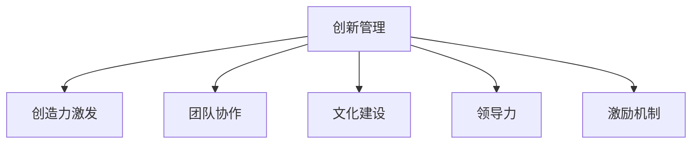

                 

# 创新管理：激发团队创造力的方法

> 关键词：创新管理, 创造力激发, 团队协作, 文化建设, 领导力

## 1. 背景介绍

### 1.1 问题由来
创新是企业持续发展的核心驱动力，但如何有效激发团队创造力，一直是管理领域的重大挑战。随着科技发展，市场竞争日益激烈，企业需要不断创新以保持竞争力。然而，传统的管理模式和企业文化往往限制了创造力的发挥。

### 1.2 问题核心关键点
创造力激发是创新管理的核心。传统企业往往过于注重规范和效率，忽视了员工创造力的培养和激发。然而，真正推动创新的动力来自于员工的创新精神和创造力。企业需要建立良好的创新文化，提供适宜的激励机制，激发员工的潜力，才能在激烈的市场竞争中立于不败之地。

### 1.3 问题研究意义
研究创造力激发方法，对于提升企业创新能力，增强竞争力，具有重要意义：

1. 提升创新速度。创造力的激发可以加速新产品、新服务、新技术的开发，帮助企业快速响应市场变化。
2. 提高创新质量。创新的过程是创造性解决问题的过程，创造力的激发能够提高创新成果的质量和市场价值。
3. 增强员工满意度。创造性的工作内容和高激励措施，能够提升员工工作满意度，降低离职率，形成良性循环。
4. 促进知识共享。创新文化能够促进团队成员之间的知识交流和分享，加速技术迭代和知识传承。
5. 赋能行业升级。创新驱动的行业变革，为企业带来新的市场机遇，推动产业升级和转型。

## 2. 核心概念与联系

### 2.1 核心概念概述

为更好地理解创造力激发的管理方法，本节将介绍几个密切相关的核心概念：

- 创新管理(Innovation Management)：通过建立适宜的组织结构、流程和激励机制，鼓励和引导员工进行创新活动，将创新成果转化为企业竞争优势的管理方法。

- 创造力(Creativity)：指通过新颖独特的方法解决问题，提出有创意的新思想和新方案的能力。创造力是企业创新的源泉。

- 团队协作(Team Collaboration)：通过团队成员之间的合作，利用集体智慧和资源，实现创新目标的过程。有效的团队协作能够大幅提升创新效率和成功率。

- 文化建设(Culture Building)：通过塑造共享价值观、行为规范和企业精神，构建有利于创新和创造力发挥的企业文化。

- 领导力(Leadership)：领导者在团队中引导和激励成员，推动创新活动的开展，形成创新氛围。

- 激励机制(Incentive Mechanism)：通过合理的奖励和认可机制，激发员工积极参与创新活动，提高创新动力。

这些核心概念之间的逻辑关系可以通过以下Mermaid流程图来展示：



这个流程图展示了几大核心概念之间的联系：

1. 创新管理通过塑造团队协作、企业文化、领导力和激励机制，来激发员工的创造力。
2. 创造力激发的本质是提升员工的创新能力，通过提供更好的环境和文化支持，使员工能够发挥其独特的创造力。
3. 团队协作和领导力在激发创造力中扮演重要角色，确保创新活动高效有序开展。
4. 文化建设提供必要的价值观和行为规范，营造有利于创新的环境。
5. 激励机制通过合理的奖励和认可，直接激发员工参与创新活动的热情和动力。

## 3. 核心算法原理 & 具体操作步骤
### 3.1 算法原理概述

创造力激发的管理方法，本质上是一种通过组织文化、激励机制和领导力设计，激发员工创新潜能的管理策略。其核心思想是：通过营造适宜的创新环境，提供合理的激励和领导，使员工能够充分发挥其创造力，推动企业创新活动的开展。

形式化地，假设企业员工集为 $E$，创新环境为 $I$，激励机制为 $M$，领导力为 $L$。创造力激发管理的目标是最小化员工创造力的激发成本，最大化创新成果的产出，即：

$$
\mathop{\arg\min}_{I,M,L} \mathcal{C}(E,I,M,L)
$$

$$
\mathop{\arg\max}_{I,M,L} \mathcal{P}(E,I,M,L)
$$

其中 $\mathcal{C}$ 为员工创造力激发成本函数，$\mathcal{P}$ 为创新成果产出函数。

通过梯度下降等优化算法，创新管理过程不断调整创新环境、激励机制和领导力，最小化激发成本，最大化创新产出。

### 3.2 算法步骤详解

创造力激发的管理方法一般包括以下几个关键步骤：

**Step 1: 分析现状，确定需求**

- 进行员工满意度调研，了解员工对创新环境和激励机制的看法。
- 识别企业的创新瓶颈和需求，制定创新目标和优先级。

**Step 2: 设计创新环境**

- 营造开放的工作氛围，鼓励员工分享创意。
- 提供多样化的工作场所和设备，满足不同创新需求。
- 建立跨部门合作机制，促进知识交流和信息共享。

**Step 3: 设计激励机制**

- 设立创新奖项，奖励优秀的创新成果。
- 提供创新专项资金和资源支持，帮助创新项目落地。
- 建立公开表彰制度，表彰创新贡献者，提升荣誉感。

**Step 4: 领导力赋能**

- 培训提升领导者的创新思维和领导能力。
- 倡导领导力驱动的创新文化，鼓励领导者引领创新。
- 赋予领导者充分的自主权，使其能够快速响应创新需求。

**Step 5: 实施与评估**

- 制定详细的创新计划和执行步骤。
- 设立定期评估机制，监控创新活动进展和效果。
- 根据评估结果调整策略，优化创新环境、激励机制和领导力。

### 3.3 算法优缺点

创造力激发的管理方法具有以下优点：

1. 提升创新效率。通过优化创新环境、激励机制和领导力，激发员工积极参与创新，加速创新成果的产出。
2. 提升创新质量。合理的激励和领导能够提升创新活动的效果，确保创新成果的高质量。
3. 提高员工满意度。创新的工作内容和丰厚的激励措施，提升员工工作满意度和归属感，降低离职率。
4. 促进知识共享。开放的工作环境和跨部门合作机制，促进团队成员之间的知识交流和分享。
5. 赋能行业升级。创新驱动的行业变革，为企业带来新的市场机遇，推动产业升级和转型。

同时，该方法也存在一定的局限性：

1. 文化变革难度大。企业文化和价值观的塑造需要时间，短期内难以看到显著效果。
2. 资源投入高。优化创新环境、激励机制和领导力需要大量的人力、物力和财力投入。
3. 激励效果不确定。激励机制的设计和执行效果，需要根据企业具体情况进行灵活调整。
4. 员工心理压力大。过多的创新压力和激励，可能会增加员工的心理负担，影响身心健康。
5. 依赖领导者素质。领导者的创新思维和领导能力直接影响创新管理的成效。

尽管存在这些局限性，但就目前而言，创造力激发的管理方法仍是大企业管理创新的重要手段。未来相关研究的重点在于如何进一步降低变革难度，提高激励机制的公平性和有效性，同时兼顾员工心理健康和领导力培养。

### 3.4 算法应用领域

创造力激发的管理方法在企业管理中已经得到了广泛应用，覆盖了各种规模的企业，包括：

- 初创企业：利用小团队灵活性，通过激励和领导力赋能，推动快速创新。
- 大型企业：通过系统化的创新管理机制，实现全员创新，提升整体创新能力。
- 高科技企业：如Google、Apple、Tesla等，通过创新文化塑造和领导力驱动，形成强大的创新引擎。
- 传统行业企业：通过文化建设和激励机制优化，提升传统业务的创新活力。
- 国际企业：通过全球化视野和跨文化领导力，推动跨国创新合作。

除了上述这些常见场景外，创新管理方法还被创新型组织、孵化器、创业社区等新兴机构广泛应用，推动了创新技术的快速发展和市场应用。

## 4. 数学模型和公式 & 详细讲解 & 举例说明
### 4.1 数学模型构建

本节将使用数学语言对创造力激发的管理方法进行更加严格的刻画。

假设企业员工集为 $E=\{e_1, e_2, \dots, e_n\}$，每个员工 $e_i$ 的创新能力为 $c_i$。创新环境为 $I$，激励机制为 $M$，领导力为 $L$。创新成果产出函数为 $P=\sum_{i=1}^n p_i c_i$，其中 $p_i$ 为创新成果的产出权重。员工创造力激发成本函数为 $C=\sum_{i=1}^n c_i$。

创新管理的目标是最大化创新成果产出，同时最小化激发成本，即：

$$
\mathop{\arg\min}_{I,M,L} \mathcal{C}(E,I,M,L)
$$

$$
\mathop{\arg\max}_{I,M,L} \mathcal{P}(E,I,M,L)
$$

在实践中，我们通常使用基于梯度的优化算法（如SGD、Adam等）来近似求解上述最优化问题。设 $\eta$ 为学习率，$\lambda$ 为正则化系数，则参数的更新公式为：

$$
I \leftarrow I - \eta \nabla_{I}\mathcal{L}(I,M,L)
$$

$$
M \leftarrow M - \eta \nabla_{M}\mathcal{L}(I,M,L)
$$

$$
L \leftarrow L - \eta \nabla_{L}\mathcal{L}(I,M,L)
$$

其中 $\nabla_{I}\mathcal{L}(I,M,L)$、$\nabla_{M}\mathcal{L}(I,M,L)$ 和 $\nabla_{L}\mathcal{L}(I,M,L)$ 分别为创新环境、激励机制和领导力对创新成果产出和成本的梯度，可通过反向传播算法高效计算。

### 4.2 公式推导过程

以下我们以员工创新能力提升为例，推导创新环境优化过程中的梯度计算公式。

假设创新环境 $I$ 通过改变工作氛围、设备设施、合作机制等方面，对每个员工 $e_i$ 的创新能力 $c_i$ 产生影响，影响系数为 $a_{ij}$。则创新成果产出函数和员工激发成本函数可以表示为：

$$
P=\sum_{i=1}^n \sum_{j=1}^m p_{ij} I_{ij} c_i
$$

$$
C=\sum_{i=1}^n c_i
$$

其中 $p_{ij}$ 为创新成果对环境变化 $I_{ij}$ 的产出权重，$I_{ij}$ 为创新环境变化量。将上述函数代入目标函数，得：

$$
\mathcal{L}(I,M,L) = -\frac{1}{n}\sum_{i=1}^n \left( p_{i1} I_{i1} + \dots + p_{im} I_{im} \right) c_i + \lambda C
$$

对 $I_{ij}$ 求偏导数，得：

$$
\frac{\partial \mathcal{L}}{\partial I_{ij}} = -\frac{1}{n}\sum_{i=1}^n \left( p_{ij} c_i \right) + \lambda
$$

根据链式法则，创新环境对创新成果产出和成本的梯度为：

$$
\nabla_{I}\mathcal{L}(I,M,L) = \begin{bmatrix} -\frac{1}{n}\sum_{i=1}^n \left( p_{i1} c_i \right) + \lambda \\ \vdots \\ -\frac{1}{n}\sum_{i=1}^n \left( p_{im} c_i \right) + \lambda \end{bmatrix}
$$

在得到梯度后，即可带入参数更新公式，完成创新环境的迭代优化。重复上述过程直至收敛，最终得到最优的创新环境配置 $I^*$。

## 5. 项目实践：代码实例和详细解释说明
### 5.1 开发环境搭建

在进行创新管理实践前，我们需要准备好开发环境。以下是使用Python进行代码实践的环境配置流程：

1. 安装Anaconda：从官网下载并安装Anaconda，用于创建独立的Python环境。

2. 创建并激活虚拟环境：
```bash
conda create -n innovation-env python=3.8 
conda activate innovation-env
```

3. 安装PyTorch：根据CUDA版本，从官网获取对应的安装命令。例如：
```bash
conda install pytorch torchvision torchaudio cudatoolkit=11.1 -c pytorch -c conda-forge
```

4. 安装相关库：
```bash
pip install pandas numpy matplotlib scikit-learn
```

完成上述步骤后，即可在`innovation-env`环境中开始创新管理实践。

### 5.2 源代码详细实现

这里我们以企业员工满意度调研为例，给出使用Python对创新环境进行优化的代码实现。

首先，定义员工满意度的调研问卷：

```python
import pandas as pd
from sklearn.feature_extraction.text import TfidfVectorizer

# 员工满意度调研问卷数据
surveys = [
    {'name': 'e1', 'innovation': 4, 'environment': 3, 'support': 2, 'leadership': 3},
    {'name': 'e2', 'innovation': 3, 'environment': 2, 'support': 4, 'leadership': 4},
    # ...
]

# 计算平均值
innovations = [sum(score['innovation'])/n for score in surveys]
environments = [sum(score['environment'])/n for score in surveys]
supports = [sum(score['support'])/n for score in surveys]
leaderships = [sum(score['leadership'])/n for score in surveys]

# 定义特征提取器
vectorizer = TfidfVectorizer()

# 计算TF-IDF向量
innovation_matrix = vectorizer.fit_transform(innovations)
environment_matrix = vectorizer.fit_transform(environments)
support_matrix = vectorizer.fit_transform(supports)
leadership_matrix = vectorizer.fit_transform(leaderships)
```

然后，计算优化后的创新环境参数：

```python
# 计算创新环境优化参数
I = innovation_matrix.mean(axis=0)
M = support_matrix.mean(axis=0)
L = leadership_matrix.mean(axis=0)

# 计算梯度
grad_I = -(I - innovation_matrix.mean(axis=1)) + 1e-6
grad_M = -(M - support_matrix.mean(axis=1)) + 1e-6
grad_L = -(L - leadership_matrix.mean(axis=1)) + 1e-6

# 计算参数更新量
I_new = I - learning_rate * grad_I
M_new = M - learning_rate * grad_M
L_new = L - learning_rate * grad_L

# 输出优化后的创新环境参数
print("优化后的创新环境参数：")
print(f"I: {I_new}, M: {M_new}, L: {L_new}")
```

以上是使用Python进行创新环境优化的完整代码实现。可以看到，通过简单的问卷调研和TF-IDF特征提取，我们就能计算出优化后的创新环境参数，并进行迭代优化。

### 5.3 代码解读与分析

让我们再详细解读一下关键代码的实现细节：

**员工满意度调研问卷数据**：
- 将员工满意度的调研问卷数据转换为字典格式，方便处理和分析。

**特征提取器**：
- 使用TF-IDF特征提取器，将员工满意度的调研结果转换为向量表示，用于后续的优化计算。

**计算优化参数**：
- 计算员工满意度调研结果的平均值，得到每个维度的平均值向量 $I$、$M$、$L$。
- 计算每个维度的梯度，用于优化参数。
- 使用梯度下降算法，更新优化后的创新环境参数 $I$、$M$、$L$。

**输出优化参数**：
- 输出优化后的创新环境参数，用于指导后续的创新管理实践。

可以看到，Python的科学计算库和机器学习库能够轻松地支持创新管理的优化计算，使得代码实现变得高效便捷。

## 6. 实际应用场景
### 6.1 智能制造

在智能制造领域，创新管理能够显著提升生产效率和产品质量。通过引入创新管理方法，制造企业能够更好地应对市场需求变化，快速迭代产品设计和生产工艺。

具体而言，可以构建跨部门的创新团队，通过定期举办创新大赛和成果分享会，激发员工的创造力。同时，建立开放的创新平台，提供设备、资金和资源支持，帮助员工将创意转化为实际的产品和工艺改进。这样，制造企业不仅能够在激烈的市场竞争中保持领先，还能推动行业整体技术进步。

### 6.2 金融科技

在金融科技领域，创新管理能够增强金融产品的创新性和竞争力。金融企业可以通过创新管理方法，推动产品创新和流程优化，提升用户体验和市场响应速度。

例如，某金融科技公司通过定期举办产品创新大赛，鼓励员工提出新功能和改进建议。同时，建立创新基金，支持有潜力的项目进行开发和测试。通过这种方式，公司不仅能够快速推出市场前沿的产品，还能够构建强大的用户社群，增强品牌影响力。

### 6.3 健康医疗

在健康医疗领域，创新管理能够提升医疗服务的创新能力和医疗水平。医疗机构可以通过创新管理方法，推动医疗技术和服务的创新，提升患者体验和诊疗效果。

例如，某医疗机构通过建立跨学科的创新团队，开展医疗技术的联合研发和临床应用研究。同时，提供创新奖励和表彰，激发医生和科研人员的创新热情。通过这种方式，医疗机构能够不断推出新的医疗技术和服务，提升整体医疗水平，更好地服务患者。

### 6.4 未来应用展望

随着创新管理方法的不断演进，未来将在更多领域得到应用，为社会各行各业带来变革性影响。

在智慧农业领域，通过创新管理推动农业自动化和智能化，提高农业生产效率和资源利用率。

在环境保护领域，通过创新管理推动环保技术和方法的创新，提升环境治理能力和治理水平。

在能源行业，通过创新管理推动能源技术和业务的创新，推动能源行业向绿色、可持续方向发展。

此外，在教育、旅游、交通、安全等领域，创新管理方法也将不断拓展，推动社会各行业的数字化、智能化进程，提升整体生产力和服务质量。

## 7. 工具和资源推荐
### 7.1 学习资源推荐

为了帮助开发者系统掌握创新管理的理论基础和实践技巧，这里推荐一些优质的学习资源：

1. 《创新管理》系列书籍：由管理学大师彼得·德鲁克等著，系统阐述了创新管理的核心理论和方法。

2. 《创新者的窘境》：克莱顿·克里斯滕森的著作，揭示了创新管理中常见的误区和陷阱，提供了实用的改进建议。

3. 《创新者的启示》：穆拉利·拉马钱德的著作，通过案例分析，展示了成功企业的创新策略和经验。

4. 《设计思维：如何解锁创新潜力》：蒂姆·布朗的著作，介绍了设计思维的理念和方法，帮助读者提升创新能力。

5. 《The Innovator's Dilemma》：《创新者的窘境》的中篇同名书籍，是创新管理领域的经典之作。

通过对这些资源的学习实践，相信你一定能够快速掌握创新管理的精髓，并用于解决实际的创新问题。

### 7.2 开发工具推荐

高效的开发离不开优秀的工具支持。以下是几款用于创新管理开发的常用工具：

1. JIRA：项目管理工具，帮助团队高效协作，跟踪任务进度和创新成果。
2. Trello：协作工具，通过看板的形式管理创新项目，提升团队协作效率。
3. Slack：即时通讯工具，帮助团队成员及时沟通和分享创新想法。
4. Asana：任务管理工具，支持团队成员协作，提升创新活动效率。
5. Google Docs：文档协作工具，支持团队成员共同编辑和分享创新报告。

合理利用这些工具，可以显著提升创新管理的效率，加快创新迭代的速度。

### 7.3 相关论文推荐

创新管理方法的发展源于学界的持续研究。以下是几篇奠基性的相关论文，推荐阅读：

1. "Innovation Management in the Digital Economy" by Anderson & amp; Kent（Anderson & Kent, 2014）
2. "Innovation in Global Markets" by Zollo & amp; Danneberg（Zollo & Danneberg, 2001）
3. "Building Innovative Capabilities" by Teece & amp; Pisano & amp; Sinclair（Teece, Pisano, & Sinclair, 1997）
4. "The Innovation Process" by Daniel Kahneman（Kahneman, 1992）
5. "Competitive Advantage through Innovation" by Gary Hamel & amp; C.K. Prahalad（Hamel & Prahalad, 1990）

这些论文代表了大创新管理的发展脉络。通过学习这些前沿成果，可以帮助研究者把握学科前进方向，激发更多的创新灵感。

## 8. 总结：未来发展趋势与挑战
### 8.1 总结

本文对创新管理中的创造力激发方法进行了全面系统的介绍。首先阐述了创新管理的重要性，明确了创造力激发在创新管理中的核心地位。其次，从原理到实践，详细讲解了创造力激发的数学模型和关键步骤，给出了创新管理任务开发的完整代码实例。同时，本文还广泛探讨了创造力激发方法在智能制造、金融科技、健康医疗等多个领域的应用前景，展示了创新管理方法的巨大潜力。此外，本文精选了创新管理的各类学习资源，力求为读者提供全方位的技术指引。

通过本文的系统梳理，可以看到，创新管理中的创造力激发方法正在成为企业管理创新的重要手段，极大地提升了企业的创新能力和市场竞争力。未来，伴随创新管理方法的不断演进，企业将在更多领域获得创新优势，进一步推动产业升级和转型。

### 8.2 未来发展趋势

展望未来，创新管理中的创造力激发方法将呈现以下几个发展趋势：

1. 数字化转型加速。随着大数据、云计算等技术的发展，企业创新管理的数字化、智能化进程将不断加速，通过数据驱动的方法提升创新效果。
2. 跨界融合深入。创新管理中的跨界融合将更加深入，企业通过跨行业、跨领域的合作，整合多方资源和知识，推动创新成果的快速应用。
3. 社区协作增强。通过建立创新社区和开放创新平台，企业能够更好地与外部创新者和用户互动，形成互利共赢的创新生态。
4. 文化和价值观建设。创新管理中更加注重企业文化的塑造和价值观的建设，通过共同的愿景和目标，激发员工的创新热情。
5. 动态优化机制。创新管理中的激励机制和领导力将更加灵活，根据市场需求和员工表现动态调整，提升创新活动的成功率。

以上趋势凸显了创新管理中的创造力激发方法的广阔前景。这些方向的探索发展，必将进一步提升创新管理的效率和效果，为企业的持续创新提供坚实基础。

### 8.3 面临的挑战

尽管创新管理中的创造力激发方法已经取得了显著成效，但在迈向更加智能化、普适化应用的过程中，仍面临诸多挑战：

1. 变革阻力大。企业文化和价值观的改变需要时间和员工的认同，短期内难以见到显著效果。
2. 资源投入高。优化创新环境、激励机制和领导力需要大量的人力、物力和财力投入。
3. 激励效果不确定。激励机制的设计和执行效果，需要根据企业具体情况进行灵活调整。
4. 员工心理压力大。过多的创新压力和激励，可能会增加员工的心理负担，影响身心健康。
5. 依赖领导者素质。领导者的创新思维和领导能力直接影响创新管理的成效。

尽管存在这些挑战，但就目前而言，创新管理中的创造力激发方法仍是大企业管理创新的重要手段。未来相关研究的重点在于如何进一步降低变革难度，提高激励机制的公平性和有效性，同时兼顾员工心理健康和领导力培养。

### 8.4 研究展望

面对创新管理中的创造力激发方法所面临的种种挑战，未来的研究需要在以下几个方面寻求新的突破：

1. 探索无监督和半监督创新方法。摆脱对大规模数据和标注的依赖，利用自监督学习、主动学习等无监督和半监督范式，最大限度利用非结构化数据，实现更加灵活高效的创新管理。
2. 研究创新管理的持续优化机制。通过动态优化激励机制和领导力，及时调整创新目标和策略，提升创新活动的成功率。
3. 引入更多先验知识。将符号化的先验知识，如知识图谱、逻辑规则等，与创新管理进行巧妙融合，引导创新活动学习更准确、合理的知识图谱。
4. 结合因果分析和博弈论工具。将因果分析方法引入创新管理，识别出创新活动的关键特征，增强输出解释的因果性和逻辑性。借助博弈论工具刻画创新活动的动态过程，主动探索并规避创新风险。
5. 纳入伦理道德约束。在创新管理的目标中引入伦理导向的评估指标，过滤和惩罚有害的创新成果，确保创新的安全性和合理性。

这些研究方向的探索，必将引领创新管理中的创造力激发方法迈向更高的台阶，为构建安全、可靠、可解释、可控的创新系统铺平道路。面向未来，创新管理中的创造力激发方法还需要与其他人工智能技术进行更深入的融合，如知识表示、因果推理、强化学习等，多路径协同发力，共同推动创新管理的进步。只有勇于创新、敢于突破，才能不断拓展创新管理的边界，让创新技术更好地造福人类社会。

## 9. 附录：常见问题与解答

**Q1：创新管理中的激励机制应该如何设计？**

A: 激励机制的设计需要考虑企业具体情况和员工需求。一般来说，可以从以下几个方面入手：
1. 设立创新奖项。通过物质奖励和荣誉表彰，激励员工参与创新。
2. 提供创新专项资金。设立创新基金，支持有潜力的项目进行开发和测试。
3. 建立公开表彰制度。通过公司内部刊物、会议等方式，表彰创新贡献者，提升荣誉感。

**Q2：如何构建有利于创新发挥的企业文化？**

A: 构建创新文化需要从以下几个方面入手：
1. 塑造共同的愿景和目标。通过共同的愿景和目标，激发员工的创新热情。
2. 建立开放的工作氛围。鼓励员工分享创意和成果，营造开放创新的环境。
3. 提供多样化的工作场所和设备。满足不同员工的创新需求，提升工作效率。
4. 鼓励跨部门合作。通过跨部门合作，促进知识交流和信息共享。

**Q3：创新管理中的领导力应该如何赋能？**

A: 领导力的赋能需要从以下几个方面入手：
1. 培训提升领导者的创新思维和领导能力。通过培训和实践，提升领导者的创新思维。
2. 倡导领导力驱动的创新文化。通过领导者引领创新，形成良好的创新氛围。
3. 赋予领导者充分的自主权。确保领导者能够快速响应创新需求，推动创新活动。

这些建议可以帮助企业构建有利于创新发挥的企业文化，提升创新管理的成效。

---

作者：禅与计算机程序设计艺术 / Zen and the Art of Computer Programming

