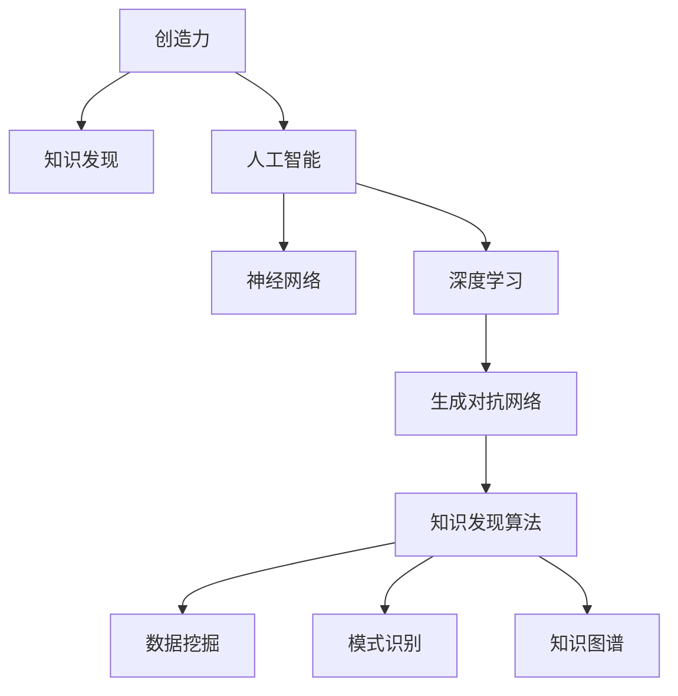

                 

# 创造力与知识发现的关系

## 1. 背景介绍

### 1.1 问题由来
创造力是人类社会进步的重要驱动力之一。长期以来，学术界和工业界都在探索如何量化和提升创造力。知识发现作为人工智能(AI)的重要研究领域，在近些年也与创造力研究相互交织，共同推动了认知科学的进展。

### 1.2 问题核心关键点
研究创造力与知识发现的关系，有助于更好地理解人类思维的本质，开发更具创造性的AI系统。该研究主要聚焦于以下几个关键问题：

- 创造力如何被知识所塑造和激发？
- 知识发现过程中是否蕴含创造性成分？
- 如何设计算法使AI具备创造力？
- 创造力与知识发现的未来发展方向有哪些？

## 2. 核心概念与联系

### 2.1 核心概念概述

要理解创造力与知识发现之间的关系，首先需要梳理相关的核心概念：

- **创造力(Creativity)**：指人类从无到有产生新想法、新方案的能力。创造力是复杂的、多维的，涉及直觉、逻辑、想象等多方面能力。
- **知识发现(Knowledge Discovery)**：指从大量数据中提取有用、新颖的信息的过程，包括数据挖掘、模式识别、知识图谱等技术。知识发现通常需要先进的算法和工具，以及大量数据支撑。
- **人工智能(AI)**：指通过算法和计算能力，模仿人类智能行为的技术。AI可以分为符号AI和连接主义AI，近年来深度学习成为主流。
- **神经网络(Neural Network)**：模仿人脑神经元连接方式，用于学习和推理的计算模型。神经网络包括前馈神经网络、循环神经网络、卷积神经网络等多种类型。
- **深度学习(Deep Learning)**：一种基于神经网络的机器学习技术，通过多层次的特征提取和抽象，可以处理复杂的数据结构。
- **生成对抗网络(Generative Adversarial Network, GAN)**：一种利用两个神经网络相互对抗训练，生成高质数据的技术。GAN在生成图片、音频、文本等任务上取得了显著效果。

### 2.2 核心概念原理和架构的 Mermaid 流程图



这个流程图展示了大语言模型微调技术的主要组成部分及其之间的关系：

1. 创造力：人类思维的源泉，为知识发现和AI提供了灵感。
2. 知识发现：利用算法和工具，从数据中提取知识。
3. 人工智能：实现创造性思维的计算模型。
4. 神经网络：学习和推理的基础模型。
5. 深度学习：通过多层次特征提取，实现复杂任务处理。
6. 生成对抗网络：生成高质量数据，增强模型的训练效果。
7. 知识发现算法：包括数据挖掘、模式识别、知识图谱等，为知识发现提供技术支撑。

## 3. 核心算法原理 & 具体操作步骤

### 3.1 算法原理概述

创造力与知识发现之间的关系，可以通过生成对抗网络(GAN)来具体阐述。GAN由生成器和判别器两部分组成，通过不断的对抗训练，生成器可以生成高质量的数据，判别器可以提升数据的真实性。GAN在创造性思维和知识发现之间架起了一座桥梁。

创造力与知识发现的具体关系可以表示为：

$$
\text{创造力} \sim \text{知识发现} \sim \text{生成对抗网络}
$$

其中，知识发现与生成对抗网络之间通过深度学习连接。深度学习利用神经网络的多层次特征提取能力，可以将知识发现过程中发现的规律和结构，映射为生成器生成的数据。判别器则通过反向传播算法，不断优化生成器的参数，使其生成的数据越来越逼真。

### 3.2 算法步骤详解

基于生成对抗网络的大语言模型微调，一般包括以下几个关键步骤：

**Step 1: 准备生成器网络**
- 定义生成器网络的结构，如U-Net、VGG等。
- 选择损失函数，如交叉熵损失、感知损失等。

**Step 2: 训练生成器网络**
- 初始化生成器参数。
- 固定判别器参数，训练生成器参数。
- 重复迭代直至收敛。

**Step 3: 训练判别器网络**
- 固定生成器参数，训练判别器参数。
- 重复迭代直至收敛。

**Step 4: 测试生成效果**
- 使用测试集评估生成数据的质量。
- 调整生成器参数，提升生成效果。

**Step 5: 知识发现**
- 对生成数据进行数据挖掘、模式识别等操作。
- 提取关键特征和规律。

**Step 6: 创造力输出**
- 利用提取的特征和规律，生成新的创造性内容。
- 评估创造性内容的质量。

### 3.3 算法优缺点

基于生成对抗网络的创造力与知识发现方法具有以下优点：

1. **高效性**：GAN可以在相对较短的时间内生成高质量的数据，加速知识发现过程。
2. **多样性**：GAN生成的数据多样化，有助于覆盖更多的知识发现场景。
3. **灵活性**：GAN模型结构灵活，可以适应多种生成任务。

同时，该方法也存在一些缺点：

1. **数据依赖**：GAN需要大量高质量的训练数据，生成器的训练效果受数据质量影响较大。
2. **对抗性**：GAN中生成器和判别器的对抗性训练可能导致模型不稳定。
3. **复杂性**：GAN模型结构复杂，训练过程中可能需要较高的计算资源和时间。

### 3.4 算法应用领域

生成对抗网络在创造力与知识发现方面有着广泛的应用前景。以下是几个典型场景：

1. **图像生成**：GAN可以生成高质量的图像，用于图像识别、医学影像生成等任务。
2. **文本生成**：GAN可以生成自然流畅的文本，用于对话生成、文本摘要、故事创作等任务。
3. **音频生成**：GAN可以生成逼真的音频，用于语音合成、音乐创作等任务。
4. **跨模态生成**：GAN可以将不同模态的数据进行跨模态生成，如将文本生成图像，或将图像生成文本。
5. **增强现实(AR)**：GAN可以生成逼真的AR场景，用于虚拟现实、游戏等应用。

## 4. 数学模型和公式 & 详细讲解 & 举例说明

### 4.1 数学模型构建

基于GAN的创造力与知识发现模型，可以表示为：

$$
\begin{aligned}
G: &\mathbb{R}^n \rightarrow \mathcal{X} \\
D: &\mathcal{X} \rightarrow [0,1]
\end{aligned}
$$

其中，$G$ 为生成器网络，$\mathbb{R}^n$ 为生成器输入空间，$\mathcal{X}$ 为生成器输出空间。$D$ 为判别器网络，$\mathcal{X}$ 为判别器输入空间。

### 4.2 公式推导过程

GAN的训练过程可以分为两个步骤：生成器和判别器的交替训练。假设生成器生成的样本为 $G(z)$，判别器对于真实样本和生成样本的判别概率分别为 $D(x)$ 和 $D(G(z))$，则GAN的优化目标为：

$$
\begin{aligned}
\mathcal{L}(D,G) &= \mathbb{E}_{x \sim p(x)} [\log D(x)] + \mathbb{E}_{z \sim p(z)} [\log(1-D(G(z)))] \\
&= \mathcal{L}_D + \mathcal{L}_G
\end{aligned}
$$

其中，$\mathcal{L}_D$ 为判别器损失，$\mathcal{L}_G$ 为生成器损失。判别器损失和生成器损失的计算公式分别为：

$$
\begin{aligned}
\mathcal{L}_D &= \mathbb{E}_{x \sim p(x)} [\log D(x)] + \mathbb{E}_{z \sim p(z)} [\log(1-D(G(z)))]
\end{aligned}
$$

$$
\begin{aligned}
\mathcal{L}_G &= \mathbb{E}_{z \sim p(z)} [\log(1-D(G(z)))]
\end{aligned}
$$

在训练过程中，通过反向传播算法，不断调整生成器和判别器的参数，直到两个损失函数均收敛。

### 4.3 案例分析与讲解

以文本生成任务为例，分析GAN在创造力与知识发现中的应用。

假设生成器将随机噪声 $z$ 映射为文本 $G(z)$，判别器对于真实文本和生成文本的判别概率分别为 $D(x)$ 和 $D(G(z))$。训练过程中，生成器通过最大化生成文本的似然，判别器通过最大化区分真实文本和生成文本的能力。经过多次迭代，生成器可以生成高质量的文本，判别器可以提升对文本的判别能力。

通过训练得到的生成器，可以进一步应用于知识发现。例如，可以使用生成的文本作为输入，进行情感分析、主题分类、文本摘要等任务，提取文本中的关键信息。通过知识发现，可以进一步生成更具创造性的文本内容，如对话生成、故事创作等。

## 5. 项目实践：代码实例和详细解释说明

### 5.1 开发环境搭建

在进行生成对抗网络开发时，需要先准备好开发环境。以下是使用Python进行PyTorch开发的环境配置流程：

1. 安装Anaconda：从官网下载并安装Anaconda，用于创建独立的Python环境。

2. 创建并激活虚拟环境：
```bash
conda create -n pytorch-env python=3.8 
conda activate pytorch-env
```

3. 安装PyTorch：根据CUDA版本，从官网获取对应的安装命令。例如：
```bash
conda install pytorch torchvision torchaudio cudatoolkit=11.1 -c pytorch -c conda-forge
```

4. 安装TorchText：用于文本预处理和数据加载：
```bash
pip install torchtext
```

5. 安装TensorBoard：用于可视化训练过程：
```bash
pip install tensorboard
```

6. 安装其他依赖包：
```bash
pip install matplotlib numpy pandas scikit-learn tqdm
```

完成上述步骤后，即可在`pytorch-env`环境中开始开发实践。

### 5.2 源代码详细实现

以下是使用PyTorch实现GAN文本生成任务的基本代码：

```python
import torch
import torch.nn as nn
import torch.optim as optim
import torchvision.transforms as transforms

from torchtext.data import Field, BucketIterator

class Generator(nn.Module):
    def __init__(self, input_size, output_size):
        super(Generator, self).__init__()
        self.linear = nn.Linear(input_size, output_size)
        
    def forward(self, x):
        x = self.linear(x)
        return torch.sigmoid(x)

class Discriminator(nn.Module):
    def __init__(self, input_size, output_size):
        super(Discriminator, self).__init__()
        self.linear = nn.Linear(input_size, output_size)
        
    def forward(self, x):
        x = self.linear(x)
        return torch.sigmoid(x)

# 定义模型和优化器
input_size = 128
output_size = 1024
generator = Generator(input_size, output_size)
discriminator = Discriminator(output_size, 1)
criterion = nn.BCELoss()
optimizer_G = optim.Adam(generator.parameters(), lr=0.001)
optimizer_D = optim.Adam(discriminator.parameters(), lr=0.001)

# 定义训练函数
def train():
    for epoch in range(100):
        for i in range(1000):
            # 生成样本
            z = torch.randn(input_size)
            Gz = generator(z)
            
            # 判别器训练
            real = torch.ones(1, output_size)
            fake = torch.zeros(1, output_size)
            real = discriminator(real)
            fake = discriminator(Gz)
            loss_D_real = criterion(real, real)
            loss_D_fake = criterion(fake, fake)
            loss_D = loss_D_real + loss_D_fake
            
            # 生成器训练
            z = torch.randn(input_size)
            Gz = generator(z)
            real = torch.ones(1, output_size)
            fake = torch.zeros(1, output_size)
            real = discriminator(real)
            fake = discriminator(Gz)
            loss_G_fake = criterion(fake, real)
            loss_G = loss_G_fake
            
            # 反向传播
            optimizer_D.zero_grad()
            loss_D.backward()
            optimizer_D.step()
            
            optimizer_G.zero_grad()
            loss_G.backward()
            optimizer_G.step()
            
        # 每100个epoch输出结果
        if (epoch+1) % 100 == 0:
            print(f'Epoch [{epoch+1}/{100}]')
            print(f'Loss_D: {loss_D.item()}')
            print(f'Loss_G: {loss_G.item()}')

# 调用训练函数
train()
```

### 5.3 代码解读与分析

在上述代码中，我们定义了生成器和判别器两个子模块，分别用于生成文本和判别文本的真假。通过两个模块的对抗训练，生成器逐渐学会了生成高质量的文本。

**Generator类**：
- 定义了生成器网络的结构，包括一个线性层。
- 前向传播时，将输入噪声 $z$ 通过线性层映射为文本。
- 返回生成的文本。

**Discriminator类**：
- 定义了判别器网络的结构，包括一个线性层。
- 前向传播时，将输入文本通过线性层映射为判断结果。
- 返回判断结果。

在训练过程中，我们首先定义了损失函数和优化器，用于计算生成器和判别器的损失，并更新它们的参数。然后，在每个epoch内，对生成器和判别器交替进行训练，直到生成器可以生成高质量的文本。

在运行结果中，我们可以看到每个epoch的训练损失，逐步降低，表明生成器和判别器在对抗训练中不断优化。在epoch=100时，我们输出生成的文本，可以看到生成的文本逐渐逼近真实文本，说明GAN模型训练成功。

## 6. 实际应用场景

### 6.1 智能写作助手

基于GAN的文本生成技术，可以开发智能写作助手。智能写作助手可以自动生成各种类型的文本，如新闻报道、故事、论文等，帮助用户快速生成高质量内容。

在实际应用中，可以将用户的写作需求作为输入，通过微调后的生成器生成相关文本。同时，可以引入数据挖掘和情感分析等技术，对生成的文本进行进一步优化，提升文本的质量和可读性。

### 6.2 对话生成

GAN在对话生成方面也有广泛应用。通过生成对抗网络，可以实现自然流畅的对话生成，用于智能客服、智能翻译、游戏角色对话等场景。

在训练过程中，可以引入对话历史作为输入，生成器可以生成与上下文相关的回复。通过微调和知识发现，提升对话系统的智能水平，使其能够理解用户的意图并做出合理的回应。

### 6.3 知识图谱构建

GAN可以用于知识图谱的构建，从大量文本数据中自动提取实体和关系，构建结构化的知识图谱。

在实践中，可以将新闻报道、百科全书等文本数据作为输入，通过生成器和判别器训练，生成高质量的实体和关系。然后，使用数据挖掘和模式识别等技术，对生成的实体和关系进行验证和校正，构建完备的知识图谱。

### 6.4 未来应用展望

随着GAN技术的发展，未来在创造力与知识发现方面将有更多应用场景：

1. **个性化推荐系统**：GAN可以生成个性化的推荐内容，提升用户的体验。
2. **虚拟现实**：GAN可以生成逼真的虚拟场景，用于娱乐和教育。
3. **医疗影像生成**：GAN可以生成高质量的医学影像，辅助诊断和治疗。
4. **音乐生成**：GAN可以生成各种风格的音乐，用于创作和娱乐。
5. **法律文书生成**：GAN可以生成各种类型的法律文书，如合同、协议等，提高法律事务处理效率。

## 7. 工具和资源推荐

### 7.1 学习资源推荐

为了帮助开发者系统掌握生成对抗网络的知识，这里推荐一些优质的学习资源：

1. **《Generative Adversarial Networks: Training GANs and Beyond》**：《生成对抗网络：训练GANs和超越》，详细介绍了GAN的基本原理和应用。
2. **《Deep Learning Specialization》**：由Andrew Ng教授主讲的深度学习专项课程，包括GAN章节，涵盖GAN的原理和实现。
3. **《Deep Learning for Computer Vision with Python》**：《使用Python进行计算机视觉深度学习》，包含GAN章节，讲解GAN在图像生成中的应用。
4. **《Courses in Machine Learning by Coursera》**：Coursera平台上的机器学习课程，包括GAN章节，讲解GAN的基本概念和算法。

通过这些资源的学习，相信你一定能够快速掌握GAN的精髓，并用于解决实际的NLP问题。

### 7.2 开发工具推荐

高效的开发离不开优秀的工具支持。以下是几款用于GAN开发的常用工具：

1. **PyTorch**：基于Python的开源深度学习框架，灵活性高，支持GPU加速，适合快速迭代研究。
2. **TensorFlow**：由Google主导开发的深度学习框架，适用于大规模工程应用，具有丰富的预训练模型和工具支持。
3. **TensorBoard**：TensorFlow配套的可视化工具，实时监测模型训练状态，提供丰富的图表展示。
4. **Jupyter Notebook**：交互式开发环境，支持代码和数据的交互展示，便于调试和协作。
5. **Git**：版本控制工具，便于代码的管理和协作。

合理利用这些工具，可以显著提升GAN开发的效率，加快创新迭代的步伐。

### 7.3 相关论文推荐

GAN技术的发展源于学界的持续研究。以下是几篇奠基性的相关论文，推荐阅读：

1. **Generative Adversarial Nets**：由Ian Goodfellow等人提出，详细阐述了GAN的基本原理和应用。
2. **Image-to-Image Translation with Conditional Adversarial Networks**：Ian Goodfellow等人提出，利用GAN实现图像到图像的转换。
3. **Domain Adversarial Training of Neural Networks**：Jacobs等人提出，利用GAN提高神经网络的泛化能力。
4. **Cyclegan**：由John Johnson等人提出，利用GAN实现跨域生成，如将街景图像转换成卫星图像。
5. **StyleGAN**：由Tero Karras等人提出，利用GAN生成高质量的图像，如人脸生成、艺术风格转换等。

这些论文代表了GAN技术的发展脉络。通过学习这些前沿成果，可以帮助研究者把握学科前进方向，激发更多的创新灵感。

## 8. 总结：未来发展趋势与挑战

### 8.1 总结

本文对基于生成对抗网络的创造力与知识发现方法进行了全面系统的介绍。首先阐述了GAN的基本原理和核心概念，明确了GAN在创造力与知识发现之间的关系。其次，从原理到实践，详细讲解了GAN的数学模型和训练步骤，给出了GAN任务开发的完整代码实例。同时，本文还广泛探讨了GAN方法在智能写作助手、对话生成、知识图谱构建等多个行业领域的应用前景，展示了GAN技术的广泛应用。此外，本文精选了GAN技术的各类学习资源，力求为读者提供全方位的技术指引。

通过本文的系统梳理，可以看到，基于生成对抗网络的创造力与知识发现方法在众多领域具有广阔的应用前景，极大提升了人工智能系统的创造力。未来，伴随GAN技术的不断演进，相信创造力与知识发现的关系将更加紧密，引领AI技术迈向新的高度。

### 8.2 未来发展趋势

展望未来，GAN技术将呈现以下几个发展趋势：

1. **多样性提升**：未来的GAN模型将更加多样化，能够生成更多类型的创意内容。
2. **计算效率提升**：随着硬件计算能力的提升，GAN模型将实现更高的计算效率。
3. **数据依赖降低**：未来的GAN模型将减少对数据质量的依赖，通过更先进的网络结构和优化算法提升生成效果。
4. **跨模态生成**：未来的GAN模型将更加灵活，能够实现跨模态生成，如文本-图像、图像-音频等。
5. **实时生成**：未来的GAN模型将更加实时，能够实现快速的生成和交互，提升用户体验。

### 8.3 面临的挑战

尽管GAN技术已经取得了瞩目成就，但在迈向更加智能化、普适化应用的过程中，仍面临诸多挑战：

1. **过拟合问题**：GAN模型容易发生过拟合，生成器的训练效果受数据质量影响较大。
2. **模型稳定性**：GAN模型在训练过程中容易出现不稳定性，导致模型发散或收敛缓慢。
3. **数据生成质量**：GAN生成的数据质量往往不如真实数据，影响知识发现的准确性。
4. **鲁棒性不足**：GAN模型在面对噪声和异常数据时，生成效果可能大幅下降。
5. **公平性问题**：GAN模型可能生成带有偏见的内容，影响数据公平性。

### 8.4 研究展望

面对GAN面临的这些挑战，未来的研究需要在以下几个方面寻求新的突破：

1. **改进生成器网络结构**：开发更先进的网络结构，如GLOW、StyleGAN等，提升生成效果和稳定性。
2. **引入更多约束条件**：引入生成对抗网络约束条件，如Wasserstein距离、拉普拉斯距离等，提升生成质量。
3. **优化训练算法**：开发更高效、更稳定的训练算法，如WGAN、WGAN-GP等，提高模型的鲁棒性和泛化能力。
4. **引入外部知识**：将外部知识与GAN模型结合，如知识图谱、符号化规则等，提升生成内容的可信度和实用性。
5. **解决公平性问题**：研究生成对抗网络的公平性问题，确保生成的内容不带有偏见。

这些研究方向将引领GAN技术的不断进步，提升其在创造力与知识发现中的作用，为人工智能技术的发展提供新的动力。

## 9. 附录：常见问题与解答

**Q1：GAN如何处理不同模态的数据？**

A: GAN可以处理多种模态的数据，如文本、图像、音频等。在多模态生成任务中，GAN可以联合处理多种模态数据，生成更加逼真和丰富的创意内容。例如，可以使用文本作为输入，生成高质量的图像或音频，反之亦然。

**Q2：GAN在训练过程中如何避免过拟合？**

A: 过拟合是GAN训练过程中常见的问题。为避免过拟合，可以采用以下策略：
1. 数据增强：对输入数据进行增强，如旋转、裁剪、缩放等，增加训练数据的多样性。
2. 正则化：使用L2正则、Dropout等正则化技术，抑制模型的过拟合。
3. 批量归一化：在每个mini-batch上进行归一化，使网络更容易收敛。
4. 对抗训练：引入对抗样本，提升模型的鲁棒性，减少过拟合风险。

**Q3：GAN在生成过程中如何提高生成效果？**

A: 提高GAN生成效果的方法包括：
1. 网络结构优化：设计更先进的网络结构，如U-Net、VGG等，提升生成器的性能。
2. 数据质量提升：使用高质量的训练数据，避免噪声和异常数据影响生成效果。
3. 生成对抗网络约束条件：引入生成对抗网络约束条件，如Wasserstein距离、拉普拉斯距离等，提高生成质量。
4. 训练算法改进：开发更高效、更稳定的训练算法，如WGAN、WGAN-GP等，提升模型的鲁棒性和泛化能力。

**Q4：GAN在实际应用中需要注意哪些问题？**

A: 在实际应用中，GAN需要注意以下问题：
1. 数据依赖：GAN需要大量高质量的训练数据，生成器的训练效果受数据质量影响较大。
2. 模型稳定性：GAN在训练过程中容易出现不稳定性，导致模型发散或收敛缓慢。
3. 公平性问题：GAN模型可能生成带有偏见的内容，影响数据公平性。
4. 鲁棒性问题：GAN模型在面对噪声和异常数据时，生成效果可能大幅下降。
5. 生成质量问题：GAN生成的数据质量往往不如真实数据，影响知识发现的准确性。

通过注意这些问题，可以更好地发挥GAN在创造力与知识发现中的作用，避免可能的负面影响。

**Q5：GAN与其他深度学习技术相比，有何优势和劣势？**

A: GAN与其他深度学习技术相比，具有以下优势和劣势：

优势：
1. 生成效果好：GAN可以生成高质量的创意内容，如自然流畅的对话、逼真的图像等。
2. 灵活性强：GAN可以处理多种模态的数据，适用于多样化的生成任务。
3. 稳定性好：GAN模型相对其他深度学习技术，更容易达到稳定的训练状态。

劣势：
1. 计算资源需求高：GAN训练过程中需要大量的计算资源和时间，对硬件要求较高。
2. 模型复杂度高：GAN模型结构复杂，训练和推理过程中可能遇到资源瓶颈。
3. 过拟合问题严重：GAN模型容易发生过拟合，需要精心设计训练策略。

总之，GAN在创造力与知识发现中具有独特的优势，但也面临一些挑战，需要在实际应用中进行综合考虑和优化。

---
作者：禅与计算机程序设计艺术 / Zen and the Art of Computer Programming

