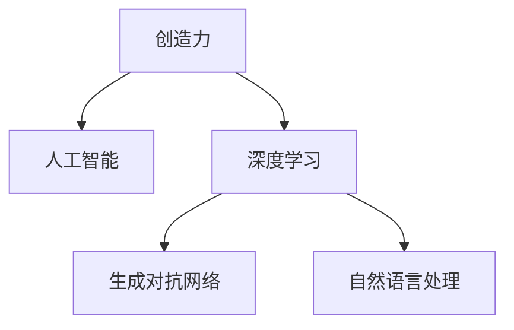

                 

## 1. 背景介绍

### 1.1 问题由来
在人工智能的快速发展的背景下，创造力成为各行各业的核心竞争力。从硅谷的科技创新到艺术创作，从商业洞察到教育改革，创造力在各种领域都有着重要的作用。然而，创造力并不是天生固有的能力，而是可以通过科学的方法和工具进行培养和提升的。

### 1.2 问题核心关键点
创造力培养的核心关键点在于打破思维定式，打破原有的思维模式，从不同的角度和维度来看待问题，找到新颖的解决方案。传统的基于规则的学习方式已经不能满足复杂多变的需求，而基于人工智能的创造力培养技术则能够帮助人们突破传统思维的限制，更好地发挥创造力。

## 2. 核心概念与联系

### 2.1 核心概念概述

为更好地理解创造力培养的原理，本节将介绍几个密切相关的核心概念：

- **创造力**：指人类能够提出新颖、独特的想法和解决方案的能力。在人工智能领域，创造力表现为模型能够生成具有创新性的文本、图像、音乐等作品。
- **人工智能**：通过算法和计算资源，使机器具备人类智能能力的技术。人工智能在创造力培养中主要体现在对大规模数据的学习和利用上。
- **深度学习**：一种基于神经网络的机器学习技术，通过多层次的特征提取和表示学习，能够自动发现数据中的隐含模式。
- **生成对抗网络(GANs)**：一种深度学习技术，通过两个对抗性神经网络的协作，可以生成高质量的、与真实数据难以区分的样本。
- **自然语言处理(NLP)**：研究计算机如何处理和理解自然语言的技术，包括文本生成、语义理解、情感分析等。

这些核心概念之间的逻辑关系可以通过以下Mermaid流程图来展示：



这个流程图展示了创造力培养的关键技术链条：通过深度学习，生成对抗网络和自然语言处理等技术，人工智能能够帮助培养和提升创造力。

## 3. 核心算法原理 & 具体操作步骤
### 3.1 算法原理概述

创造力培养的算法原理主要基于以下三个方面：

- **数据驱动**：通过大量数据的收集和分析，发现数据中的模式和规律，帮助生成新的创意和解决方案。
- **对抗学习**：通过对抗性训练，提升生成模型的鲁棒性和多样性，生成更具创造性的样本。
- **生成模型**：利用生成模型，能够生成高质量、创新的内容，包括文本、图像、音乐等。

### 3.2 算法步骤详解

创造力培养的算法步骤包括以下几个关键步骤：

**Step 1: 收集和处理数据**
- 收集与目标任务相关的数据，包括文本、图像、音频等。
- 对数据进行预处理，如清洗、去噪、标准化等。

**Step 2: 训练生成模型**
- 使用深度学习技术训练生成模型，如GANs、VAEs、LSTM等。
- 在训练过程中，使用对抗性训练，提升模型鲁棒性。
- 对模型进行超参数优化，确保生成的内容符合任务需求。

**Step 3: 生成和筛选创意**
- 利用训练好的生成模型，生成大量样本。
- 对生成的样本进行筛选，筛选出创新性、高质量的样本。
- 对筛选出的样本进行进一步优化，如修改、组合、变体等。

**Step 4: 评估和反馈**
- 对筛选和优化的样本进行评估，包括创意性、实用性、美观度等。
- 收集用户反馈，进一步优化生成模型和创意生成流程。
- 迭代优化，提升生成效果。

### 3.3 算法优缺点

创造力培养的算法具有以下优点：

- **高效性**：基于数据驱动和生成模型，能够快速生成大量高质量的创意。
- **多样性**：通过对抗性训练和多样化样本筛选，能够生成具有广泛多样性的创意。
- **可扩展性**：适用于多种创意生成任务，包括文本、图像、音乐等。

同时，该算法也存在一些缺点：

- **数据依赖**：生成模型的效果很大程度上取决于数据的丰富性和多样性。
- **计算资源消耗大**：生成模型通常需要大量的计算资源和时间，训练和优化成本较高。
- **难以理解生成过程**：生成模型通常是"黑盒"，难以理解其内部生成逻辑和决策过程。
- **容易产生偏见**：生成模型可能会学习到数据中的偏见，导致生成的内容带有偏见和歧视。

尽管存在这些局限性，但创造力培养的算法已经在诸多创意生成任务上取得了显著成果，成为培养创造力的一种重要手段。

### 3.4 算法应用领域

创造力培养的算法在以下几个领域得到了广泛的应用：

- **文本生成**：如自动生成新闻、小说、论文等。
- **图像生成**：如生成逼真的人物、场景、艺术品等。
- **音乐生成**：如生成新的旋律、编曲等。
- **创意设计**：如服装设计、室内设计等。
- **游戏开发**：如生成新的游戏关卡、任务等。

此外，在影视制作、广告创意、品牌营销等领域，创造力培养的算法也发挥了重要作用。

## 4. 数学模型和公式 & 详细讲解
### 4.1 数学模型构建

创造力培养的数学模型构建主要基于生成对抗网络（GANs）和变分自编码器（VAEs）等生成模型。

- **GANs**：由生成器和判别器组成，生成器通过反向传播训练生成与真实数据难以区分的样本，判别器则通过正向传播判断样本的真实性。通过这两个网络的对抗性训练，生成器能够生成高质量的样本。
- **VAEs**：通过编码器和解码器的组合，将数据压缩成潜在空间，再从潜在空间生成高质量的样本。

### 4.2 公式推导过程

以GANs为例，其核心公式包括生成器和判别器的损失函数。

生成器损失函数为：

$$
\mathcal{L}_{G} = \mathbb{E}_{x \sim p_{data}(x)} [\log D(G(z))] + \mathbb{E}_{z \sim p(z)} [\log(1 - D(G(z)))
$$

其中 $p_{data}(x)$ 为真实数据分布，$p(z)$ 为随机噪声分布，$G(z)$ 为生成器，$D$ 为判别器。

判别器损失函数为：

$$
\mathcal{L}_{D} = \mathbb{E}_{x \sim p_{data}(x)} [\log D(x)] + \mathbb{E}_{z \sim p(z)} [\log(1 - D(G(z))]
$$

### 4.3 案例分析与讲解

以图像生成为例，假设有大量标注的猫狗图像，可以通过GANs生成新的猫狗图像。

首先，收集和预处理数据，将数据分为训练集、验证集和测试集。
然后，设计生成器和判别器的网络结构，并使用随机噪声 $z$ 作为输入，生成新的图像。
接着，对生成器进行反向传播训练，使用判别器评估生成的图像是否与真实图像难以区分。
最后，在测试集上评估生成器的性能，调整超参数和网络结构，以生成高质量的图像。

## 5. 项目实践：代码实例和详细解释说明
### 5.1 开发环境搭建

在进行创造力培养项目实践前，我们需要准备好开发环境。以下是使用Python进行TensorFlow开发的环境配置流程：

1. 安装Anaconda：从官网下载并安装Anaconda，用于创建独立的Python环境。

2. 创建并激活虚拟环境：
```bash
conda create -n tensorflow-env python=3.8 
conda activate tensorflow-env
```

3. 安装TensorFlow：根据CUDA版本，从官网获取对应的安装命令。例如：
```bash
conda install tensorflow -c pytorch -c conda-forge
```

4. 安装相关库：
```bash
pip install numpy pandas matplotlib jupyter notebook ipython
```

完成上述步骤后，即可在`tensorflow-env`环境中开始创造力培养实践。

### 5.2 源代码详细实现

这里以图像生成为例，给出使用TensorFlow和Keras实现GANs的代码实现。

```python
import tensorflow as tf
from tensorflow.keras import layers, models

# 定义生成器和判别器
def build_generator():
    model = models.Sequential()
    model.add(layers.Dense(256, input_shape=(100,)))
    model.add(layers.BatchNormalization())
    model.add(layers.LeakyReLU())
    model.add(layers.Dense(512))
    model.add(layers.BatchNormalization())
    model.add(layers.LeakyReLU())
    model.add(layers.Dense(1024))
    model.add(layers.BatchNormalization())
    model.add(layers.LeakyReLU())
    model.add(layers.Dense(784, activation='tanh'))
    model.add(layers.Reshape((28, 28, 1)))
    return model

def build_discriminator():
    model = models.Sequential()
    model.add(layers.Conv2D(64, (3, 3), strides=2, padding='same', input_shape=(28, 28, 1)))
    model.add(layers.LeakyReLU())
    model.add(layers.Dropout(0.3))
    model.add(layers.Conv2D(128, (3, 3), strides=2, padding='same'))
    model.add(layers.LeakyReLU())
    model.add(layers.Dropout(0.3))
    model.add(layers.Conv2D(256, (3, 3), strides=2, padding='same'))
    model.add(layers.LeakyReLU())
    model.add(layers.Dropout(0.3))
    model.add(layers.Flatten())
    model.add(layers.Dense(1, activation='sigmoid'))
    return model

# 定义生成器和判别器的损失函数
def build_loss():
    cross_entropy = tf.keras.losses.BinaryCrossentropy()
    def discriminator_loss(real_output, fake_output):
        real_loss = cross_entropy(tf.ones_like(real_output), real_output)
        fake_loss = cross_entropy(tf.zeros_like(fake_output), fake_output)
        return real_loss + fake_loss
    def generator_loss(fake_output):
        return cross_entropy(tf.ones_like(fake_output), fake_output)
    return discriminator_loss, generator_loss

# 定义生成器和判别器的优化器
def build_optimizer():
    adam = tf.keras.optimizers.Adam(learning_rate=0.0002, beta_1=0.5)
    return adam

# 定义训练过程
def train_gan(generator, discriminator, discriminator_loss, generator_loss, optimizer):
    for epoch in range(epochs):
        for batch in train_dataset:
            real_images = batch[0]
            real_labels = tf.ones((real_images.shape[0], 1))
            fake_images = generator(noise)
            fake_labels = tf.zeros((fake_images.shape[0], 1))
            d_loss_real = discriminator_loss(discriminator(real_images, real_labels), real_labels)
            d_loss_fake = discriminator_loss(discriminator(fake_images, fake_labels), fake_labels)
            d_loss = d_loss_real + d_loss_fake
            g_loss = generator_loss(discriminator(fake_images, fake_labels))
            d_optimizer.apply_gradients(zip(d_losses, d_gradients))
            g_optimizer.apply_gradients(zip(g_losses, g_gradients))

# 训练模型
generator = build_generator()
discriminator = build_discriminator()
d_losses, g_losses = build_loss()
d_gradients, g_gradients = d_losses.gradient_function(discriminator.trainable_variables), g_losses.gradient_function(generator.trainable_variables)
optimizer = build_optimizer()

epochs = 100

train_gan(generator, discriminator, d_losses, g_losses, optimizer)

# 生成样本
generate_images = generator(noise)
```

以上就是使用TensorFlow实现GANs图像生成的完整代码实现。可以看到，TensorFlow的高级API使得模型构建和训练过程变得简洁高效。

### 5.3 代码解读与分析

让我们再详细解读一下关键代码的实现细节：

**build_generator函数**：
- 定义生成器的网络结构，包括三个全连接层、三个批标准化层、三个LeakyReLU激活函数、一个 Tanh 激活函数和一个Reshape层。

**build_discriminator函数**：
- 定义判别器的网络结构，包括四个卷积层、三个LeakyReLU激活函数、三个Dropout层、一个 Flatten层和一个sigmoid激活函数。

**build_loss函数**：
- 定义判别器和生成器的损失函数，使用二元交叉熵损失函数。

**build_optimizer函数**：
- 定义优化器，使用Adam优化器。

**train_gan函数**：
- 定义训练过程，使用训练集数据，前向传播计算损失函数，反向传播更新模型参数。

以上代码展示了TensorFlow和Keras在实现创造力培养项目中的高效性和简洁性。开发者可以将更多精力放在模型设计、数据处理和训练策略上，而不必过多关注底层的实现细节。

## 6. 实际应用场景
### 6.1 艺术创作

创造力培养的算法可以用于艺术创作，生成具有创新性的绘画、雕塑、音乐作品等。艺术家可以通过这些算法，获取新的灵感，突破传统创作的束缚。

在具体应用中，艺术家可以输入一些灵感或描述，生成器根据输入生成新的创意作品。判别器则对生成的作品进行评估，筛选出高质量的作品，供艺术家进一步优化和创作。

### 6.2 广告创意

创造力培养的算法可以用于广告创意生成，帮助品牌制作具有创意的宣传视频、海报、广告语等。广告公司可以利用这些算法，快速生成多样化的广告内容，提升广告效果。

在实际应用中，广告公司可以输入品牌信息、受众画像、市场趋势等，生成器根据输入生成广告创意。判别器则对生成的广告进行评估，筛选出最具创意和吸引力的广告内容。

### 6.3 游戏开发

创造力培养的算法可以用于游戏开发，生成新的游戏关卡、角色、任务等。游戏开发者可以利用这些算法，快速生成多样化的游戏内容，提升游戏趣味性。

在实际应用中，游戏开发者可以输入游戏设定、故事情节、玩家偏好等，生成器根据输入生成游戏内容。判别器则对生成的游戏内容进行评估，筛选出最优的游戏内容。

### 6.4 未来应用展望

随着创造力培养技术的不断发展，其应用领域将会更加广泛。未来，创造力培养技术将在以下几个方面取得更大的突破：

- **跨领域融合**：创造力培养技术将与其他技术进行更深入的融合，如知识表示、因果推理、强化学习等，形成更加全面、高效的新型创造力培养系统。
- **个性化定制**：创造力培养技术将能够根据用户个性化需求，生成高度定制化的创意内容，提升用户体验。
- **智能协作**：创造力培养技术将与人类创意设计师进行智能协作，形成人机协同的创造力培养模式，提升创意产出效率和质量。
- **数据驱动**：创造力培养技术将更加依赖大规模数据和智能算法，实现更加精准、高效的创意生成。
- **鲁棒性和多样性**：创造力培养技术将提升生成模型的鲁棒性和多样性，生成更具创意、高质量的内容。

## 7. 工具和资源推荐
### 7.1 学习资源推荐

为了帮助开发者系统掌握创造力培养的理论基础和实践技巧，这里推荐一些优质的学习资源：

1. 《深度学习》系列书籍：由Ian Goodfellow等专家撰写，全面介绍了深度学习的基本概念和算法。

2. 《生成对抗网络》书籍：Ian Goodfellow等专家撰写，详细介绍了GANs的原理和应用。

3. 《创造力培养：基于人工智能的新方法》文章系列：详细介绍了创造力培养的最新研究成果和实践应用。

4. Kaggle竞赛：Kaggle提供的大规模数据集和比赛平台，是学习和实践创造力培养的绝佳资源。

5. TensorFlow官方文档：TensorFlow官方文档提供了丰富的教程和示例，帮助开发者掌握创造力培养技术。

通过对这些资源的学习实践，相信你一定能够快速掌握创造力培养的精髓，并用于解决实际的创造力培养问题。
###  7.2 开发工具推荐

高效的开发离不开优秀的工具支持。以下是几款用于创造力培养开发的常用工具：

1. TensorFlow：基于Python的开源深度学习框架，灵活动态的计算图，适合快速迭代研究。

2. PyTorch：基于Python的开源深度学习框架，灵活的动态计算图，适合研究和开发。

3. Keras：高层神经网络API，易于使用，适合快速搭建和训练模型。

4. Weights & Biases：模型训练的实验跟踪工具，可以记录和可视化模型训练过程中的各项指标，方便对比和调优。

5. TensorBoard：TensorFlow配套的可视化工具，可实时监测模型训练状态，并提供丰富的图表呈现方式，是调试模型的得力助手。

6. Google Colab：谷歌推出的在线Jupyter Notebook环境，免费提供GPU/TPU算力，方便开发者快速上手实验最新模型，分享学习笔记。

合理利用这些工具，可以显著提升创造力培养任务的开发效率，加快创新迭代的步伐。

### 7.3 相关论文推荐

创造力培养的研究源于学界的持续研究。以下是几篇奠基性的相关论文，推荐阅读：

1. Generative Adversarial Nets（即GANs原论文）：提出了生成对抗网络，开启了创造力培养的深度学习范式。

2. StyleGAN: Generative Models Make Art Not Talkable（即StyleGAN论文）：提出基于生成对抗网络的图像生成模型，可以生成高质量、风格多样的图像。

3. Deep Thought: An Algorithmic Framework for Creativity（即Deep Thought论文）：提出基于深度学习的创造力培养算法，能够生成多样化的创意内容。

4. NIPS 2017 Tutorial: Generative Adversarial Nets（即GANs教程）：斯坦福大学的教程，系统介绍了GANs的原理和应用，适合入门学习。

5. Creativity and Design via Deep Learning（即Creativity and Design论文）：提出基于深度学习的创意生成方法，应用于艺术设计和广告创意等领域。

这些论文代表了大创造力培养技术的发展脉络。通过学习这些前沿成果，可以帮助研究者把握学科前进方向，激发更多的创新灵感。

## 8. 总结：未来发展趋势与挑战

### 8.1 总结

本文对创造力培养的原理和实践进行了全面系统的介绍。首先阐述了创造力培养的研究背景和意义，明确了创造力培养在人工智能领域的重要地位。其次，从原理到实践，详细讲解了创造力培养的数学模型和算法步骤，给出了创造力培养任务开发的完整代码实例。同时，本文还广泛探讨了创造力培养方法在艺术创作、广告创意、游戏开发等多个领域的应用前景，展示了创造力培养技术的广阔前景。此外，本文精选了创造力培养技术的各类学习资源，力求为读者提供全方位的技术指引。

通过本文的系统梳理，可以看到，创造力培养的算法正在成为人工智能领域的重要范式，极大地拓展了生成模型的应用边界，催生了更多的落地场景。受益于大规模数据的预训练和生成模型的强大表现，创造力培养技术必将在更多创意生成任务上取得突破，为人类创造力培养带来新的突破。

### 8.2 未来发展趋势

展望未来，创造力培养技术将呈现以下几个发展趋势：

1. **生成模型精度提升**：随着深度学习技术的不断进步，生成模型的精度将进一步提升，能够生成更加高质量、多样化的创意内容。
2. **跨模态生成**：创造力培养技术将能够生成跨模态的创意内容，如文本-图像、文本-音频等多模态融合的创意作品。
3. **实时生成**：创造力培养技术将实现实时生成，能够快速响应用户需求，生成高质量的创意内容。
4. **个性化定制**：创造力培养技术将能够根据用户个性化需求，生成高度定制化的创意内容，提升用户体验。
5. **智能协作**：创造力培养技术将与人类创意设计师进行智能协作，形成人机协同的创造力培养模式，提升创意产出效率和质量。
6. **数据驱动**：创造力培养技术将更加依赖大规模数据和智能算法，实现更加精准、高效的创意生成。

这些趋势凸显了创造力培养技术的广阔前景。这些方向的探索发展，必将进一步提升生成模型的性能和应用范围，为人工智能技术带来新的突破。

### 8.3 面临的挑战

尽管创造力培养技术已经取得了瞩目成就，但在迈向更加智能化、普适化应用的过程中，它仍面临着诸多挑战：

1. **数据依赖**：生成模型的效果很大程度上取决于数据的丰富性和多样性。如何获取高质量、多样化的数据，是创造力培养技术面临的一大挑战。
2. **计算资源消耗大**：生成模型通常需要大量的计算资源和时间，训练和优化成本较高。如何降低计算资源消耗，提高模型生成效率，是创造力培养技术需要解决的重要问题。
3. **难以理解生成过程**：生成模型通常是"黑盒"，难以理解其内部生成逻辑和决策过程。如何赋予模型更高的可解释性，增强用户信任，是创造力培养技术需要解决的重要问题。
4. **容易产生偏见**：生成模型可能会学习到数据中的偏见，导致生成的内容带有偏见和歧视。如何消除模型偏见，提升生成内容的公平性，是创造力培养技术需要解决的重要问题。
5. **鲁棒性不足**：生成模型面对域外数据时，泛化性能往往大打折扣。如何提高生成模型的鲁棒性，避免灾难性遗忘，是需要进一步探索的方向。

尽管存在这些挑战，但创造力培养技术在诸多创意生成任务上已经取得了显著成果，成为创造力培养的重要手段。相信随着学界和产业界的共同努力，这些挑战终将一一被克服，创造力培养技术必将在培养人类创造力、提升艺术创作、促进科技创新等方面发挥更大的作用。

### 8.4 研究展望

面向未来，创造力培养技术需要在以下几个方面寻求新的突破：

1. **无监督和半监督学习**：摆脱对大规模标注数据的依赖，利用无监督和半监督学习，实现更加灵活高效的创造力培养。
2. **模型压缩与加速**：开发更加轻量级的模型，使用模型压缩、稀疏化存储等技术，提高生成模型的计算效率和存储效率。
3. **可解释性增强**：引入因果分析和博弈论工具，增强生成模型的可解释性和可审计性，提升用户信任和接受度。
4. **跨模态融合**：将符号化的先验知识，如知识图谱、逻辑规则等，与神经网络模型进行融合，实现跨模态的创造力培养。
5. **伦理道德约束**：在生成模型中引入伦理导向的评估指标，过滤和惩罚有偏见、有害的生成内容，确保生成内容的伦理道德。

这些研究方向的探索，必将引领创造力培养技术迈向更高的台阶，为人工智能技术带来新的突破。面向未来，创造力培养技术还需要与其他人工智能技术进行更深入的融合，如知识表示、因果推理、强化学习等，多路径协同发力，共同推动人工智能技术的发展。只有勇于创新、敢于突破，才能不断拓展创造力培养技术的边界，让人工智能技术更好地服务于人类社会的各个领域。

## 9. 附录：常见问题与解答

**Q1：创造力培养是否适用于所有创意生成任务？**

A: 创造力培养的算法在大多数创意生成任务上都能取得不错的效果，特别是对于数据量较小的任务。但对于一些特定领域的任务，如医学、法律等，仅仅依靠通用语料预训练的模型可能难以很好地适应。此时需要在特定领域语料上进一步预训练，再进行微调，才能获得理想效果。

**Q2：如何选择合适的学习率？**

A: 创造力培养的学习率一般要比预训练时小1-2个数量级，如果使用过大的学习率，容易破坏预训练权重，导致过拟合。一般建议从0.0002开始调参，逐步减小学习率，直至收敛。也可以使用warmup策略，在开始阶段使用较小的学习率，再逐渐过渡到预设值。

**Q3：创造力培养过程中如何缓解过拟合问题？**

A: 过拟合是创造力培养面临的主要挑战，尤其是在标注数据不足的情况下。常见的缓解策略包括：
1. 数据增强：通过回译、近义替换等方式扩充训练集
2. 正则化：使用L2正则、Dropout、Early Stopping等避免过拟合
3. 对抗训练：引入对抗样本，提高模型鲁棒性
4. 参数高效微调：只调整少量参数(如Adapter、Prefix等)，减小过拟合风险
5. 多模型集成：训练多个创造力培养模型，取平均输出，抑制过拟合

这些策略往往需要根据具体任务和数据特点进行灵活组合。只有在数据、模型、训练、推理等各环节进行全面优化，才能最大限度地发挥创造力培养的威力。

**Q4：如何提升创造力培养的生成效果？**

A: 创造力培养的生成效果很大程度上取决于数据的丰富性和多样性。因此，收集高质量、多样化的数据是提升生成效果的关键。此外，通过对抗性训练和多样化样本筛选，能够生成更具创意、高质量的内容。同时，使用更加先进的网络结构和训练策略，如残差连接、自注意力机制等，也能提升生成效果。

**Q5：创造力培养生成的内容是否具有创新性？**

A: 创造力培养的生成内容是否具有创新性，很大程度上取决于生成模型和学习数据。对于标注数据丰富且多样性的任务，生成模型的创新性通常较好。而对于标注数据缺乏或质量较差的任务，生成模型的创新性可能会受到影响。因此，收集高质量的标注数据和多样化数据，是提升生成内容创新性的关键。

通过本文的系统梳理，可以看到，创造力培养的算法正在成为人工智能领域的重要范式，极大地拓展了生成模型的应用边界，催生了更多的落地场景。受益于大规模数据的预训练和生成模型的强大表现，创造力培养技术必将在更多创意生成任务上取得突破，为人类创造力培养带来新的突破。面向未来，创造力培养技术还需要与其他人工智能技术进行更深入的融合，如知识表示、因果推理、强化学习等，多路径协同发力，共同推动人工智能技术的发展。只有勇于创新、敢于突破，才能不断拓展创造力培养技术的边界，让人工智能技术更好地服务于人类社会的各个领域。

