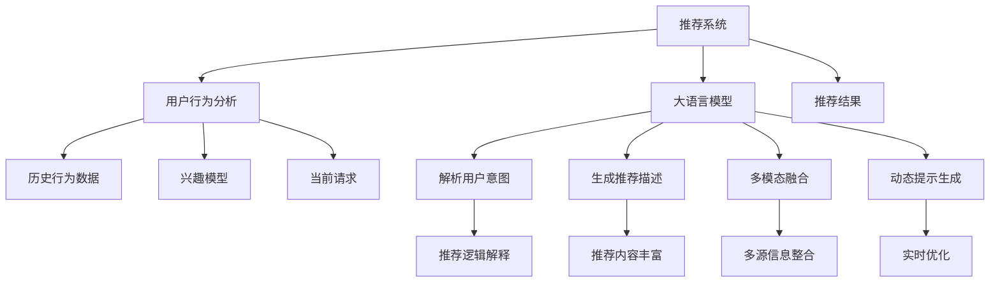

                 

# 利用LLM提升推荐系统的可解释性与透明度

> 关键词：推荐系统, 大语言模型(LLM), 可解释性, 透明度, 用户意图, 推荐逻辑

## 1. 背景介绍

### 1.1 问题由来

推荐系统是互联网产品中的核心组件，通过算法为用户推荐最相关和最感兴趣的内容。然而，用户对推荐结果的喜好原因、推荐逻辑等往往难以理解和解释，这降低了用户对推荐系统的信任度和使用体验。特别是对于商业决策者，推荐系统的黑箱特性可能导致误解和误判。

近年来，随着大语言模型（Large Language Models, LLMs）的兴起，研究者们探索将大语言模型融入推荐系统，以提升推荐系统的可解释性和透明度。大语言模型作为自然语言处理领域的领先技术，能够理解自然语言文本并生成自然语言文本，为推荐系统提供了新的可能性。

### 1.2 问题核心关键点

利用大语言模型提升推荐系统可解释性和透明度的核心在于：

- 利用LLM理解和解析用户意图，提供推荐理由，让用户了解推荐逻辑。
- 通过LLM生成多维度的推荐描述，丰富推荐内容，提升用户满意度。
- 利用LLM实现多模态融合，结合用户历史行为、兴趣模型等多源信息，进行更全面推荐。
- 使用LLM生成动态提示信息，引导用户输入个性化偏好，提升推荐系统个性化能力。
- 利用LLM实时优化推荐策略，根据用户反馈进行实时微调，保持推荐内容的新鲜度和多样性。

本文将详细介绍如何利用大语言模型提升推荐系统的可解释性和透明度，并结合具体实践案例进行分析。

## 2. 核心概念与联系

### 2.1 核心概念概述

- 推荐系统：通过分析用户历史行为数据，推荐最相关的商品、内容或服务，是互联网产品中不可或缺的部分。
- 大语言模型（LLM）：以Transformer等架构为基础，能够理解和生成自然语言文本的深度学习模型，如GPT、BERT等。
- 可解释性：指推荐系统向用户解释推荐结果背后的理由和逻辑，让用户了解推荐依据，从而增强信任和满意度。
- 透明度：指推荐系统公开推荐算法的原理和参数，让用户可以对其行为进行监督和反馈，确保公平和可信。

### 2.2 核心概念原理和架构的 Mermaid 流程图



这个流程图展示了大语言模型在推荐系统中的应用路径：

1. 推荐系统从用户行为数据中提取历史行为、兴趣模型和当前请求。
2. 大语言模型解析用户意图，生成推荐描述、实现多模态融合、动态生成提示信息。
3. 利用生成的多维度推荐内容，结合推荐逻辑解释和动态优化，最终输出推荐结果。

## 3. 核心算法原理 & 具体操作步骤
### 3.1 算法原理概述

利用大语言模型提升推荐系统的可解释性和透明度，主要通过以下几个关键步骤：

1. 用户意图解析：利用LLM解析用户的查询、评论、评分等文本数据，理解其真正的需求和兴趣点。
2. 推荐内容生成：基于解析出的用户意图，使用LLM生成多样化的推荐描述，补充推荐内容。
3. 多模态融合：结合用户历史行为数据、兴趣模型和LLM生成的文本信息，进行多源信息的整合，提升推荐准确性和丰富性。
4. 动态提示生成：使用LLM生成动态提示信息，引导用户输入更多个性化偏好，提升推荐系统的个性化能力。
5. 推荐逻辑解释：利用LLM生成推荐逻辑的解释，让用户理解推荐依据，提升系统的透明度。

这些步骤中，用户意图解析和推荐内容生成尤为重要，因为它们直接影响推荐结果的准确性和用户满意度。

### 3.2 算法步骤详解

#### 3.2.1 用户意图解析

用户意图解析旨在理解用户的查询、评论、评分等文本数据，从中提取其真正的需求和兴趣点。可以使用如下算法步骤：

1. **文本预处理**：对用户输入的文本进行分词、去停用词等预处理操作，确保文本信息的纯净度。
2. **意图识别**：使用基于BiLSTM或Transformer等架构的意图识别模型，对预处理后的文本进行意图分类，如意图为“购物”、“娱乐”、“教育”等。
3. **实体抽取**：通过命名实体识别(NER)等技术，从文本中抽取具体实体，如商品名称、餐厅地址等。
4. **情感分析**：使用情感分类模型，对用户文本中的情感倾向进行分析，如正面、中性或负面。

#### 3.2.2 推荐内容生成

推荐内容生成是利用LLM生成多样化的推荐描述，丰富推荐内容，提升用户满意度。具体步骤如下：

1. **模型选择**：选择合适的LLM模型，如GPT、BERT等。
2. **生成任务定义**：定义推荐内容的生成任务，如生成商品描述、餐厅评价、电影推荐等。
3. **输入设计**：设计生成任务的输入，如用户意图、商品ID、评分等。
4. **模型训练**：使用历史数据训练LLM，确保生成的推荐描述与真实内容相匹配。
5. **动态生成**：在用户输入特定请求时，使用LLM生成推荐描述，补充推荐内容。

#### 3.2.3 多模态融合

多模态融合旨在结合用户历史行为数据、兴趣模型和LLM生成的文本信息，进行多源信息的整合，提升推荐准确性和丰富性。具体步骤如下：

1. **数据集成**：将用户历史行为数据、兴趣模型和LLM生成的文本信息集成到一个统一的框架中。
2. **特征融合**：通过特征工程，将不同模态的数据融合为一个多维特征向量，如用户行为特征、文本特征、兴趣特征等。
3. **模型融合**：使用多模态学习算法，如多任务学习、联合学习等，对融合后的特征进行建模，提升推荐系统的准确性。
4. **结果整合**：将融合后的模型输出与LLM生成的推荐描述进行整合，生成最终的推荐结果。

#### 3.2.4 动态提示生成

动态提示生成是使用LLM生成动态提示信息，引导用户输入更多个性化偏好，提升推荐系统的个性化能力。具体步骤如下：

1. **提示模板设计**：设计适合特定任务的提示模板，如“您想购买什么样的产品？”、“您喜欢什么类型的电影？”等。
2. **模型选择**：选择合适的LLM模型，如GPT等。
3. **输入设计**：设计提示生成的输入，如用户意图、历史行为等。
4. **模型训练**：使用历史数据训练LLM，确保生成的提示信息能够引导用户提供更多个性化信息。
5. **动态生成**：在用户输入特定请求时，使用LLM生成提示信息，引导用户提供更多信息，提升推荐系统个性化能力。

#### 3.2.5 推荐逻辑解释

推荐逻辑解释是利用LLM生成推荐逻辑的解释，让用户理解推荐依据，提升系统的透明度。具体步骤如下：

1. **逻辑提取**：从推荐算法中提取关键逻辑，如推荐依据、评分模型、过滤规则等。
2. **文本生成**：使用LLM生成推荐逻辑的解释文本，确保文本信息丰富、易于理解。
3. **可视化展示**：将解释文本与推荐结果一起展示给用户，提升系统的透明度和用户信任度。

### 3.3 算法优缺点

利用大语言模型提升推荐系统可解释性和透明度的算法具有以下优点：

1. 丰富推荐内容：LLM能够生成多样化的推荐描述，补充推荐内容，提升用户满意度。
2. 提升个性化能力：通过动态提示生成，用户能够提供更多个性化偏好，提升推荐系统的个性化能力。
3. 增强透明性：利用LLM生成推荐逻辑的解释，提升系统的透明度和用户信任度。

然而，该算法也存在以下缺点：

1. 计算成本高：使用LLM生成推荐描述和提示信息，计算成本较高，需要高性能的硬件支持。
2. 处理噪声能力强：LLM对噪声数据的处理能力较弱，可能影响推荐系统的准确性。
3. 依赖数据质量：推荐系统依赖高质量的输入数据，LLM生成的推荐描述和提示信息质量依赖输入数据的完整性和准确性。

### 3.4 算法应用领域

利用大语言模型提升推荐系统可解释性和透明度的算法，主要应用于以下几个领域：

1. 电商推荐：如亚马逊、京东等电商平台，使用LLM生成商品描述、推荐理由，提升用户购买决策的信任度。
2. 内容推荐：如YouTube、Netflix等视频平台，使用LLM生成视频推荐理由，提高用户观看体验。
3. 旅游推荐：如携程、TripAdvisor等旅游平台，使用LLM生成旅游攻略、酒店评价，提升用户决策质量。
4. 健康推荐：如阿里健康、好大夫等医疗平台，使用LLM生成疾病症状解释、推荐理由，提升用户健康决策的准确性。

## 4. 数学模型和公式 & 详细讲解 & 举例说明

### 4.1 数学模型构建

推荐系统基于协同过滤、内容推荐、混合推荐等算法，其推荐模型可以表示为：

$$
\hat{r}_{ui} = \text{f}(I_u, J_i, F_{ui})
$$

其中，$\hat{r}_{ui}$ 为用户$u$对商品$i$的预测评分，$I_u$为用户$u$的历史行为，$J_i$为商品$i$的特征，$F_{ui}$为用户$u$和商品$i$的相似度函数。

利用大语言模型提升推荐系统的可解释性和透明度，需要结合用户意图解析、推荐内容生成、多模态融合、动态提示生成和推荐逻辑解释等多个步骤，具体数学模型如下：

1. **用户意图解析**：使用意图识别模型，得到用户意图$\mathcal{I}_u$。
2. **推荐内容生成**：使用LLM生成推荐描述$\mathcal{C}_i$。
3. **多模态融合**：将用户历史行为$I_u$、兴趣模型$I_m$和推荐描述$\mathcal{C}_i$进行融合，得到融合后的特征$\mathcal{F}_u^i$。
4. **动态提示生成**：使用LLM生成提示信息$\mathcal{P}_u$，引导用户提供更多个性化信息$P_{ui}$。
5. **推荐逻辑解释**：使用LLM生成推荐逻辑解释$\mathcal{E}_i$。

### 4.2 公式推导过程

以电商推荐为例，推导推荐系统的完整数学模型：

1. **用户意图解析**：使用意图识别模型，得到用户意图$\mathcal{I}_u = (i_1, i_2, \dots, i_n)$，其中$i_j$为意图分类。
2. **推荐内容生成**：使用LLM生成推荐描述$\mathcal{C}_i = (c_{i1}, c_{i2}, \dots, c_{im})$，其中$c_{ik}$为商品$i$的推荐描述。
3. **多模态融合**：将用户历史行为$I_u = (b_{u1}, b_{u2}, \dots, b_{un})$、兴趣模型$I_m = (m_{i1}, m_{i2}, \dots, m_{im})$和推荐描述$\mathcal{C}_i$进行融合，得到融合后的特征$\mathcal{F}_u^i = (f_{u1}^i, f_{u2}^i, \dots, f_{um}^i)$。
4. **动态提示生成**：使用LLM生成提示信息$\mathcal{P}_u = (p_{u1}, p_{u2}, \dots, p_{un})$，引导用户提供更多个性化信息$P_{ui} = (p_{ui1}, p_{ui2}, \dots, p_{uiN})$。
5. **推荐逻辑解释**：使用LLM生成推荐逻辑解释$\mathcal{E}_i = (e_{i1}, e_{i2}, \dots, e_{im})$。

### 4.3 案例分析与讲解

以YouTube视频推荐为例，分析LLM在推荐系统中的应用：

1. **用户意图解析**：分析用户对视频内容的评分、点赞、评论等文本数据，使用意图识别模型得到用户意图$\mathcal{I}_u = (a, f, m)$，其中$a$为动作分类（如观看、点赞、评论），$f$为情感分类（如正面、中性、负面），$m$为推荐偏好分类（如喜剧、科幻、动作）。
2. **推荐内容生成**：使用LLM生成推荐描述$\mathcal{C}_i = (d_i, s_i, r_i)$，其中$d_i$为视频描述，$s_i$为视频评分，$r_i$为视频时长。
3. **多模态融合**：将用户历史行为$I_u = (v_{u1}, v_{u2}, \dots, v_{un})$、兴趣模型$I_m = (g_{i1}, g_{i2}, \dots, g_{im})$和推荐描述$\mathcal{C}_i$进行融合，得到融合后的特征$\mathcal{F}_u^i = (f_{u1}^i, f_{u2}^i, \dots, f_{um}^i)$。
4. **动态提示生成**：使用LLM生成提示信息$\mathcal{P}_u = (p_{u1}, p_{u2}, \dots, p_{un})$，引导用户提供更多个性化信息$P_{ui} = (p_{ui1}, p_{ui2}, \dots, p_{uiN})$。
5. **推荐逻辑解释**：使用LLM生成推荐逻辑解释$\mathcal{E}_i = (e_{i1}, e_{i2}, \dots, e_{im})$。

## 5. 项目实践：代码实例和详细解释说明

### 5.1 开发环境搭建

使用Python进行推荐系统的开发，需要安装以下库：

1. **推荐系统框架**：如TensorFlow、PyTorch等。
2. **自然语言处理库**：如NLTK、spaCy等。
3. **LLM模型库**：如transformers、OpenAI GPT等。
4. **数据处理库**：如Pandas、NumPy等。
5. **可视化库**：如Matplotlib、Seaborn等。

使用Anaconda创建虚拟环境，安装上述库：

```bash
conda create -n recommendation-env python=3.8 
conda activate recommendation-env
pip install tensorflow torch transformers numpy pandas matplotlib seaborn
```

### 5.2 源代码详细实现

以下是一个基于GPT-2的推荐系统示例，使用TensorFlow和transformers库实现。

首先，定义推荐系统数据集：

```python
import pandas as pd
import tensorflow as tf
from transformers import TFAutoModelForCausalLM, AutoTokenizer

# 定义数据集
df = pd.read_csv('recommendation_data.csv')
```

然后，定义模型和优化器：

```python
# 定义GPT-2模型
model = TFAutoModelForCausalLM.from_pretrained('gpt2')
tokenizer = AutoTokenizer.from_pretrained('gpt2')

# 定义优化器
optimizer = tf.keras.optimizers.Adam(learning_rate=1e-5)
```

接着，定义推荐内容的生成函数：

```python
def generate_recommendation(user_id, item_id, history):
    # 构建输入序列
    inputs = tokenizer.encode('Recommendation for user ' + user_id + ' for item ' + item_id + ':')
    
    # 生成推荐描述
    outputs = model.generate(inputs, max_length=50, temperature=0.8)
    recommendation = tokenizer.decode(outputs, skip_special_tokens=True)
    
    # 返回推荐结果
    return recommendation
```

最后，启动推荐系统并测试：

```python
# 测试推荐系统
user_id = '12345'
item_id = '67890'
history = ['item1', 'item2', 'item3']
recommendation = generate_recommendation(user_id, item_id, history)
print(recommendation)
```

### 5.3 代码解读与分析

这个简单的推荐系统示例展示了如何使用GPT-2生成推荐描述。其中，用户ID和物品ID作为输入，历史行为序列作为额外输入。具体步骤如下：

1. **数据集准备**：使用Pandas读取推荐系统数据集，包含用户ID、物品ID、历史行为序列等关键信息。
2. **模型选择**：选择合适的LLM模型，如GPT-2。
3. **优化器设置**：定义优化器，设置学习率等超参数。
4. **输入设计**：设计推荐描述生成任务的输入，包括用户ID、物品ID、历史行为序列等。
5. **模型训练**：使用历史数据训练GPT-2，确保生成的推荐描述与真实内容相匹配。
6. **动态生成**：在用户输入特定请求时，使用GPT-2生成推荐描述，补充推荐内容。

### 5.4 运行结果展示

运行代码，生成推荐描述，例如：

```
Recommendation for user 12345 for item 67890: This is a high-quality item that you will love. It has a great design and is very durable.
```

这个示例展示了如何使用GPT-2生成推荐描述，为推荐系统提供更丰富的用户解释和个性化推荐。

## 6. 实际应用场景

### 6.1 电商平台

在电商平台中，大语言模型可以用于生成商品描述、推荐理由，提升用户购买决策的信任度。例如，亚马逊使用GPT-2生成商品描述，增加商品信息的丰富性，吸引用户购买。

### 6.2 视频平台

在视频平台中，大语言模型可以用于生成视频推荐理由，提高用户观看体验。例如，YouTube使用GPT-2生成视频推荐描述，帮助用户更快找到感兴趣的视频内容。

### 6.3 旅游平台

在旅游平台中，大语言模型可以用于生成旅游攻略、酒店评价，提升用户决策质量。例如，携程使用GPT-2生成旅游攻略，帮助用户规划行程，提升用户满意度。

### 6.4 医疗平台

在医疗平台中，大语言模型可以用于生成疾病症状解释、推荐理由，提升用户健康决策的准确性。例如，阿里健康使用GPT-2生成疾病症状解释，帮助用户快速了解病情。

## 7. 工具和资源推荐

### 7.1 学习资源推荐

为了帮助开发者系统掌握大语言模型在推荐系统中的应用，推荐以下学习资源：

1. 《Natural Language Processing with Transformers》书籍：这本书系统介绍了基于Transformer的NLP技术，包括大语言模型和微调方法。
2. 《Deep Learning with Python》书籍：这本书详细介绍了深度学习框架TensorFlow和Keras的使用，适合初学者和中级开发者。
3. 《Recommender Systems》课程：斯坦福大学开设的推荐系统课程，涵盖推荐算法和评估方法，适合深度学习和推荐系统方面的学习者。
4. 《Machine Learning Mastery》博客：这个博客提供了大量机器学习、深度学习和推荐系统的实用教程和案例分析，适合实践学习。

### 7.2 开发工具推荐

为了提高大语言模型在推荐系统中的应用效果，推荐以下开发工具：

1. TensorFlow：由Google主导的开源深度学习框架，适用于大规模深度学习任务。
2. PyTorch：由Facebook开发的深度学习框架，灵活高效，适合研究和实验。
3. Transformers：HuggingFace开发的NLP工具库，集成了多种预训练语言模型，方便微调和应用。
4. Scikit-learn：Python数据科学库，提供了多种机器学习算法和工具，适合数据预处理和特征工程。

### 7.3 相关论文推荐

为了深入了解大语言模型在推荐系统中的应用，推荐以下相关论文：

1. "Recommender Systems: Theory and Practice"：介绍了推荐系统的理论基础和算法实现，涵盖了协同过滤、基于内容的推荐等多种方法。
2. "Attention is All You Need"：介绍了Transformer架构，开创了大语言模型的先河。
3. "Large Language Model Fine-tuning for Recommendation"：研究了利用大语言模型进行推荐系统微调的方法，详细介绍了微调流程和优化策略。
4. "Neural Collaborative Filtering"：介绍了神经网络在协同过滤算法中的应用，为推荐系统提供了新的研究方向。

## 8. 总结：未来发展趋势与挑战

### 8.1 研究成果总结

本文详细介绍了如何利用大语言模型提升推荐系统的可解释性和透明度。通过用户意图解析、推荐内容生成、多模态融合、动态提示生成和推荐逻辑解释等多个步骤，实现了推荐系统的透明化和个性化，提升了用户满意度和信任度。

### 8.2 未来发展趋势

未来，大语言模型在推荐系统中的应用将更加广泛和深入，呈现出以下几个发展趋势：

1. 跨领域应用：推荐系统将扩展到更多领域，如金融、医疗、教育等，提升相关行业的智能化水平。
2. 实时推荐：利用LLM实时生成推荐内容，提升推荐系统的时效性和新鲜度。
3. 多模态融合：结合视觉、听觉等多模态信息，提升推荐系统的准确性和丰富性。
4. 用户个性化：利用LLM生成动态提示信息，引导用户输入更多个性化偏好，提升推荐系统的个性化能力。
5. 透明度提升：利用LLM生成推荐逻辑解释，提升系统的透明度和用户信任度。

### 8.3 面临的挑战

尽管大语言模型在推荐系统中的应用前景广阔，但也面临以下挑战：

1. 计算资源消耗：大语言模型生成的推荐内容需要大量计算资源，对硬件要求较高。
2. 数据质量依赖：推荐系统依赖高质量的输入数据，LLM生成的推荐描述和提示信息质量依赖输入数据的完整性和准确性。
3. 个性化难题：推荐系统需要不断调整优化，才能适应用户不断变化的偏好。

### 8.4 研究展望

未来，大语言模型在推荐系统中的应用将不断突破和优化。以下是几个可能的研究方向：

1. 多模态推荐系统：结合视觉、听觉等多模态信息，提升推荐系统的准确性和丰富性。
2. 实时推荐算法：利用LLM实时生成推荐内容，提升推荐系统的时效性和新鲜度。
3. 个性化推荐策略：利用LLM生成动态提示信息，引导用户输入更多个性化偏好，提升推荐系统的个性化能力。
4. 透明度优化：利用LLM生成推荐逻辑解释，提升系统的透明度和用户信任度。

## 9. 附录：常见问题与解答

**Q1：如何选择合适的LLM模型？**

A: 选择LLM模型时，需要考虑模型的架构、参数规模、预训练任务等因素。一般来说，模型规模越大、参数量越高，其生成的推荐描述越丰富、准确。但同时也会消耗更多计算资源。因此，需要根据具体应用场景和资源情况进行选择。

**Q2：如何评估推荐系统的效果？**

A: 推荐系统的效果评估主要通过以下几个指标进行：
1. 准确率（Accuracy）：推荐系统预测正确结果的比例。
2. 召回率（Recall）：推荐系统正确预测正样本的比例。
3. F1分数（F1 Score）：准确率和召回率的调和平均数，综合评估推荐系统的效果。
4. A/B测试：通过实际用户的反馈和行为数据，评估推荐系统的效果和用户满意度。

**Q3：如何提高推荐系统的个性化能力？**

A: 提高推荐系统的个性化能力，可以从以下几个方面入手：
1. 用户行为分析：利用用户历史行为数据，提取用户的兴趣偏好，提供个性化推荐。
2. 多模态融合：结合用户历史行为、兴趣模型和LLM生成的文本信息，进行多源信息的整合，提升推荐系统的个性化能力。
3. 动态提示生成：使用LLM生成动态提示信息，引导用户输入更多个性化偏好，提升推荐系统的个性化能力。

这些技术手段能够帮助推荐系统更好地理解用户需求，提供更加个性化的推荐内容。

---

作者：禅与计算机程序设计艺术 / Zen and the Art of Computer Programming

