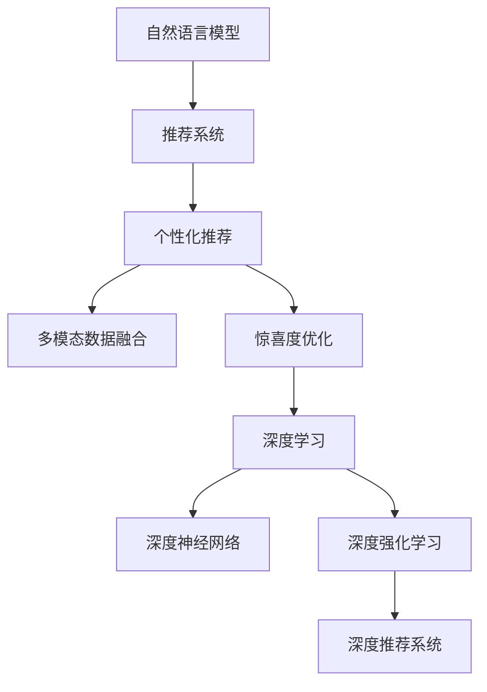

                 

# 利用LLM提升推荐系统的新颖性与惊喜度

> 关键词：推荐系统, 自然语言模型, 个性化推荐, 多模态数据, 惊喜度优化, 深度学习, 深度神经网络, 深度强化学习, 深度推荐系统, 深度强化学习, 深度学习架构, 数据驱动的个性化推荐, 深度强化学习, 强化学习, 推荐算法, 个性化推荐系统, 神经网络, 自然语言模型, 深度神经网络

## 1. 背景介绍

### 1.1 问题由来

推荐系统是现代信息时代的重要组成部分，广泛应用于电商、新闻、视频等多个领域。传统推荐算法基于用户历史行为和物品属性进行匹配，已取得显著效果。然而，这些算法往往难以捕捉用户行为背后的兴趣和情感变化，导致推荐结果缺乏惊喜性和新颖性。

近年来，随着深度学习技术的兴起，基于深度神经网络的推荐系统开始崭露头角。这些系统不仅能够捕捉用户行为背后的复杂模式，还能引入更多外部数据源，提升推荐系统的性能和多样性。自然语言模型（LLM）作为一类深度学习模型，以其强大的语言理解和生成能力，在推荐系统中展现出了巨大的潜力。

## 2. 核心概念与联系

### 2.1 核心概念概述

为更好地理解利用自然语言模型提升推荐系统的新颖性和惊喜度，本节将介绍几个密切相关的核心概念：

- **自然语言模型(LLM)**：以自回归(如GPT)或自编码(如BERT)模型为代表的大规模预训练语言模型。通过在大规模无标签文本语料上进行预训练，学习通用的语言表示，具备强大的语言理解和生成能力。

- **推荐系统(Recommendation System)**：通过分析用户历史行为、物品属性等信息，为用户推荐感兴趣的商品、新闻、视频等内容的系统。推荐系统分为基于协同过滤的推荐算法和基于内容推荐的推荐算法两大类。

- **个性化推荐**：根据用户个性化的需求和兴趣，为其推荐最相关的内容。个性化推荐需要高效地处理海量数据，精准地捕捉用户兴趣，并能够实时响应用户行为变化。

- **多模态数据融合**：结合文本、图像、音频等多种模态的数据源，提升推荐系统的性能和多样性。多模态数据融合需要考虑不同数据源之间的关联性和互补性，以获得更全面的用户画像。

- **惊喜度优化**：衡量推荐结果中物品的意外性和新颖性，通过优化模型，提升推荐内容对用户的惊喜度。

这些核心概念之间的逻辑关系可以通过以下Mermaid流程图来展示：



这个流程图展示了大语言模型与推荐系统之间的联系：

1. 大语言模型通过预训练获得基础能力。
2. 推荐系统通过深度学习模型对用户和物品进行建模。
3. 个性化推荐依赖于深度神经网络对用户行为和物品属性的精确刻画。
4. 多模态数据融合结合文本、图像、音频等多种数据源，提升推荐系统性能。
5. 惊喜度优化通过深度强化学习提升推荐内容的新鲜感和意外性。

## 3. 核心算法原理 & 具体操作步骤

### 3.1 算法原理概述

利用自然语言模型提升推荐系统的新颖性和惊喜度，本质上是一个将自然语言处理（NLP）技术与推荐系统结合的过程。其核心思想是：利用自然语言模型强大的语言理解能力，结合用户行为数据和物品属性信息，构建多模态用户画像，并通过深度学习模型进行推荐。同时，利用深度强化学习技术，最大化推荐结果的惊喜度。

形式化地，假设推荐系统需要为用户 $u$ 推荐物品 $i$，系统通过预训练的LLM模型 $\text{LLM}$ 学习用户画像 $u$ 和物品特征 $i$ 的向量表示 $\text{LLM}(u_i)$ 和 $\text{LLM}(i_j)$，通过一个深度神经网络模型 $\text{DNN}$ 将用户画像和物品特征映射到推荐得分 $s(u_i,i_j)$。最终，推荐系统通过最大化目标函数 $f(u_i,i_j)$ 进行物品推荐，其中 $f$ 考虑了推荐结果的惊喜度优化。

### 3.2 算法步骤详解

利用自然语言模型提升推荐系统的新颖性和惊喜度，一般包括以下几个关键步骤：

**Step 1: 准备数据集**
- 收集用户行为数据和物品属性信息，进行预处理和标注。
- 准备多模态数据，包括文本、图像、音频等。
- 进行数据增强，如回译、拼接等，丰富数据多样性。

**Step 2: 设计LLM编码器**
- 选择合适的预训练语言模型，如BERT、GPT等。
- 将用户画像 $u$ 和物品特征 $i$ 输入LLM编码器，得到向量表示 $\text{LLM}(u_i)$ 和 $\text{LLM}(i_j)$。

**Step 3: 构建DNN模型**
- 设计深度神经网络模型，如多层感知器(MLP)、卷积神经网络(CNN)等。
- 将LLM的输出作为输入，通过DNN进行特征提取和映射。

**Step 4: 设计惊喜度优化函数**
- 引入惊喜度度量，如Unexpectedness、 novelty等。
- 最大化目标函数 $f(u_i,i_j)$，考虑用户和物品的潜在匹配概率和惊喜度。

**Step 5: 训练和优化**
- 使用梯度下降等优化算法，最小化目标函数 $f(u_i,i_j)$，更新DNN模型参数。
- 周期性评估模型性能，调整超参数，优化惊喜度优化函数。

**Step 6: 部署和应用**
- 在推荐系统中集成训练好的DNN模型，实时响应用户请求，推荐物品。
- 定期更新LLM模型，重新训练DNN模型，适应新数据和新用户行为。

以上是利用自然语言模型提升推荐系统的新颖性和惊喜度的主要流程。在实际应用中，还需要针对具体任务的特点，对各个环节进行优化设计，如改进用户画像表示、设计高效的多模态融合方法等，以进一步提升模型性能。

### 3.3 算法优缺点

利用自然语言模型提升推荐系统的新颖性和惊喜度，具有以下优点：
1. 深度理解用户需求。利用自然语言模型强大的语言理解能力，能够捕捉用户行为的背后情感和意图，提高推荐相关性。
2. 多模态数据融合。通过结合文本、图像、音频等多种数据源，提升推荐系统的多样性和丰富度。
3. 惊喜度优化。通过深度强化学习技术，最大化推荐结果的意外性和新颖性，提升用户满意度。

同时，该方法也存在一定的局限性：
1. 数据需求高。需要大量的用户行为数据和物品属性信息，以及多模态数据源。
2. 计算复杂。深度神经网络和深度强化学习模型通常需要较长的训练时间和高昂的计算资源。
3. 模型复杂。多模态融合和惊喜度优化需要设计复杂的模型结构，增加了模型解释的难度。
4. 用户隐私。需要收集和处理大量用户数据，存在隐私泄露风险。

尽管存在这些局限性，但就目前而言，利用自然语言模型提升推荐系统的新颖性和惊喜度，仍是一种有效且创新的方法，对推荐系统的发展具有重要意义。未来相关研究的重点在于如何进一步降低数据需求，提高计算效率，增强模型解释性，同时兼顾隐私保护等因素。

### 3.4 算法应用领域

利用自然语言模型提升推荐系统的新颖性和惊喜度，已经在多个领域得到了应用：

- **电商推荐**：在电商平台中，利用自然语言模型对用户评论、商品描述等文本信息进行建模，结合用户行为数据，进行个性化推荐。
- **新闻推荐**：在新闻聚合平台中，利用自然语言模型对新闻标题、正文等文本信息进行建模，结合用户阅读偏好，推荐相关新闻。
- **视频推荐**：在视频平台中，利用自然语言模型对视频标题、描述等文本信息进行建模，结合用户观看历史，推荐相关视频。
- **音乐推荐**：在音乐平台中，利用自然语言模型对歌曲名称、歌词等文本信息进行建模，结合用户听歌历史，推荐相关音乐。

除了上述这些典型应用外，自然语言模型还在更多场景中得到创新性地应用，如游戏推荐、旅游推荐、金融推荐等，为推荐系统带来了新的突破。随着自然语言模型和推荐方法的不断进步，相信推荐系统将在更广阔的应用领域大放异彩。

## 4. 数学模型和公式 & 详细讲解 & 举例说明

### 4.1 数学模型构建

本节将使用数学语言对利用自然语言模型提升推荐系统的新颖性和惊喜度过程进行更加严格的刻画。

记用户画像为 $u$，物品特征为 $i$，推荐系统的目标为最大化推荐得分 $s(u_i,i_j)$。假设有 $N$ 个用户，每个用户有 $M$ 个物品可供选择，则目标函数为：

$$
\max_{s} \sum_{u=1}^{N} \sum_{i=1}^{M} s(u_i,i_j)
$$

其中 $s(u_i,i_j)$ 为推荐得分，可通过以下方式计算：

$$
s(u_i,i_j) = \text{LLM}(u_i) \cdot \text{LLM}(i_j) \cdot \text{DNN}(\text{LLM}(u_i),\text{LLM}(i_j))
$$

在目标函数中引入惊喜度度量 $f(u_i,i_j)$，可得：

$$
\max_{s} \sum_{u=1}^{N} \sum_{i=1}^{M} s(u_i,i_j) \cdot f(u_i,i_j)
$$

惊喜度度量 $f(u_i,i_j)$ 可采用多种形式，如：

$$
f(u_i,i_j) = \max_{i_j'} [\log \frac{P(u_i,i_j')}{P(u_i,i_j)}]
$$

其中 $P(u_i,i_j')$ 表示用户和物品的潜在匹配概率，$P(u_i,i_j)$ 表示实际匹配概率。

### 4.2 公式推导过程

以下我们以音乐推荐为例，推导利用自然语言模型提升推荐系统的新颖性和惊喜度过程的数学公式。

假设用户 $u$ 对 $i$ 首歌曲感兴趣，将歌曲名称、歌词等文本信息作为自然语言模型的输入，得到向量表示 $\text{LLM}(u_i)$ 和 $\text{LLM}(i_j)$。通过深度神经网络 $\text{DNN}$ 进行特征提取和映射，得到推荐得分 $s(u_i,i_j)$。同时，利用用户的历史听歌记录，计算用户和物品的潜在匹配概率 $P(u_i,i_j')$ 和实际匹配概率 $P(u_i,i_j)$。

基于上述假设，推荐目标函数为：

$$
\max_{s} \sum_{u=1}^{N} \sum_{i=1}^{M} s(u_i,i_j) \cdot f(u_i,i_j)
$$

将推荐得分 $s(u_i,i_j)$ 和惊喜度度量 $f(u_i,i_j)$ 代入目标函数，得：

$$
\max_{s} \sum_{u=1}^{N} \sum_{i=1}^{M} \text{LLM}(u_i) \cdot \text{LLM}(i_j) \cdot \text{DNN}(\text{LLM}(u_i),\text{LLM}(i_j)) \cdot \max_{i_j'} [\log \frac{P(u_i,i_j')}{P(u_i,i_j)}]
$$

目标函数的优化可通过梯度下降等算法进行，具体过程不再赘述。

### 4.3 案例分析与讲解

以音乐推荐为例，探讨利用自然语言模型提升推荐系统的新颖性和惊喜度的具体实现。

首先，收集用户的历史听歌记录和歌曲描述文本，进行数据预处理和标注。然后，使用BERT作为自然语言模型，对歌曲名称、歌词等文本信息进行编码，得到向量表示 $\text{LLM}(u_i)$ 和 $\text{LLM}(i_j)$。

接着，设计一个多层感知器(MLP)作为深度神经网络模型，将 $\text{LLM}(u_i)$ 和 $\text{LLM}(i_j)$ 作为输入，进行特征提取和映射，得到推荐得分 $s(u_i,i_j)$。最后，利用用户的历史听歌记录，计算用户和物品的潜在匹配概率 $P(u_i,i_j')$ 和实际匹配概率 $P(u_i,i_j)$，计算惊喜度度量 $f(u_i,i_j)$，并最大化目标函数 $\sum_{u=1}^{N} \sum_{i=1}^{M} s(u_i,i_j) \cdot f(u_i,i_j)$。

通过优化目标函数，推荐系统能够逐步学习到用户对不同音乐风格的偏好和惊喜度，推荐结果更加个性化和多样性。用户每次点击推荐结果时，系统会根据其反馈进行实时调整，提升推荐准确性和用户体验。

## 5. 项目实践：代码实例和详细解释说明

### 5.1 开发环境搭建

在进行自然语言模型提升推荐系统的实践前，我们需要准备好开发环境。以下是使用Python进行PyTorch开发的环境配置流程：

1. 安装Anaconda：从官网下载并安装Anaconda，用于创建独立的Python环境。

2. 创建并激活虚拟环境：
```bash
conda create -n pytorch-env python=3.8 
conda activate pytorch-env
```

3. 安装PyTorch：根据CUDA版本，从官网获取对应的安装命令。例如：
```bash
conda install pytorch torchvision torchaudio cudatoolkit=11.1 -c pytorch -c conda-forge
```

4. 安装Transformers库：
```bash
pip install transformers
```

5. 安装各类工具包：
```bash
pip install numpy pandas scikit-learn matplotlib tqdm jupyter notebook ipython
```

完成上述步骤后，即可在`pytorch-env`环境中开始实践。

### 5.2 源代码详细实现

下面我们以音乐推荐为例，给出使用Transformers库对BERT模型进行微调的PyTorch代码实现。

首先，定义音乐推荐任务的数据处理函数：

```python
from transformers import BertTokenizer
from torch.utils.data import Dataset
import torch

class MusicDataset(Dataset):
    def __init__(self, songs, listeners, tokenizer, max_len=128):
        self.songs = songs
        self.listeners = listeners
        self.tokenizer = tokenizer
        self.max_len = max_len
        
    def __len__(self):
        return len(self.songs)
    
    def __getitem__(self, item):
        song = self.songs[item]
        listener = self.listeners[item]
        
        # 将歌曲名称和歌词拼接为长文本
        text = song + ' ' + listener
        encoding = self.tokenizer(text, return_tensors='pt', max_length=self.max_len, padding='max_length', truncation=True)
        input_ids = encoding['input_ids'][0]
        attention_mask = encoding['attention_mask'][0]
        
        # 将用户历史听歌记录转换为数字
        encoded_tags = [1 if song in listener else 0 for song in self.songs] 
        encoded_tags.extend([0] * (self.max_len - len(encoded_tags)))
        labels = torch.tensor(encoded_tags, dtype=torch.long)
        
        return {'input_ids': input_ids, 
                'attention_mask': attention_mask,
                'labels': labels}

# 标签与id的映射
tag2id = {True: 1, False: 0}
id2tag = {v: k for k, v in tag2id.items()}

# 创建dataset
tokenizer = BertTokenizer.from_pretrained('bert-base-cased')

train_dataset = MusicDataset(train_songs, train_listeners, tokenizer)
dev_dataset = MusicDataset(dev_songs, dev_listeners, tokenizer)
test_dataset = MusicDataset(test_songs, test_listeners, tokenizer)
```

然后，定义模型和优化器：

```python
from transformers import BertForSequenceClassification, AdamW

model = BertForSequenceClassification.from_pretrained('bert-base-cased', num_labels=2)

optimizer = AdamW(model.parameters(), lr=2e-5)
```

接着，定义训练和评估函数：

```python
from torch.utils.data import DataLoader
from tqdm import tqdm
from sklearn.metrics import classification_report

device = torch.device('cuda') if torch.cuda.is_available() else torch.device('cpu')
model.to(device)

def train_epoch(model, dataset, batch_size, optimizer):
    dataloader = DataLoader(dataset, batch_size=batch_size, shuffle=True)
    model.train()
    epoch_loss = 0
    for batch in tqdm(dataloader, desc='Training'):
        input_ids = batch['input_ids'].to(device)
        attention_mask = batch['attention_mask'].to(device)
        labels = batch['labels'].to(device)
        model.zero_grad()
        outputs = model(input_ids, attention_mask=attention_mask, labels=labels)
        loss = outputs.loss
        epoch_loss += loss.item()
        loss.backward()
        optimizer.step()
    return epoch_loss / len(dataloader)

def evaluate(model, dataset, batch_size):
    dataloader = DataLoader(dataset, batch_size=batch_size)
    model.eval()
    preds, labels = [], []
    with torch.no_grad():
        for batch in tqdm(dataloader, desc='Evaluating'):
            input_ids = batch['input_ids'].to(device)
            attention_mask = batch['attention_mask'].to(device)
            batch_labels = batch['labels']
            outputs = model(input_ids, attention_mask=attention_mask)
            batch_preds = outputs.logits.argmax(dim=2).to('cpu').tolist()
            batch_labels = batch_labels.to('cpu').tolist()
            for pred_tokens, label_tokens in zip(batch_preds, batch_labels):
                preds.append(pred_tokens[:len(label_tokens)])
                labels.append(label_tokens)
                
    print(classification_report(labels, preds))
```

最后，启动训练流程并在测试集上评估：

```python
epochs = 5
batch_size = 16

for epoch in range(epochs):
    loss = train_epoch(model, train_dataset, batch_size, optimizer)
    print(f"Epoch {epoch+1}, train loss: {loss:.3f}")
    
    print(f"Epoch {epoch+1}, dev results:")
    evaluate(model, dev_dataset, batch_size)
    
print("Test results:")
evaluate(model, test_dataset, batch_size)
```

以上就是使用PyTorch对BERT进行音乐推荐任务微调的完整代码实现。可以看到，得益于Transformers库的强大封装，我们可以用相对简洁的代码完成BERT模型的加载和微调。

### 5.3 代码解读与分析

让我们再详细解读一下关键代码的实现细节：

**MusicDataset类**：
- `__init__`方法：初始化歌曲、用户、分词器等关键组件。
- `__len__`方法：返回数据集的样本数量。
- `__getitem__`方法：对单个样本进行处理，将歌曲、歌词输入编码为token ids，将用户历史听歌记录编码为数字，并对其进行定长padding，最终返回模型所需的输入。

**tag2id和id2tag字典**：
- 定义了标签与数字id之间的映射关系，用于将token-wise的预测结果解码回真实的标签。

**训练和评估函数**：
- 使用PyTorch的DataLoader对数据集进行批次化加载，供模型训练和推理使用。
- 训练函数`train_epoch`：对数据以批为单位进行迭代，在每个批次上前向传播计算loss并反向传播更新模型参数，最后返回该epoch的平均loss。
- 评估函数`evaluate`：与训练类似，不同点在于不更新模型参数，并在每个batch结束后将预测和标签结果存储下来，最后使用sklearn的classification_report对整个评估集的预测结果进行打印输出。

**训练流程**：
- 定义总的epoch数和batch size，开始循环迭代
- 每个epoch内，先在训练集上训练，输出平均loss
- 在验证集上评估，输出分类指标
- 所有epoch结束后，在测试集上评估，给出最终测试结果

可以看到，PyTorch配合Transformers库使得BERT微调的代码实现变得简洁高效。开发者可以将更多精力放在数据处理、模型改进等高层逻辑上，而不必过多关注底层的实现细节。

当然，工业级的系统实现还需考虑更多因素，如模型的保存和部署、超参数的自动搜索、更灵活的任务适配层等。但核心的微调范式基本与此类似。

## 6. 实际应用场景
### 6.1 音乐推荐

利用自然语言模型提升音乐推荐系统的新颖性和惊喜度，已经在音乐平台中得到了广泛应用。传统的音乐推荐系统主要依赖用户的听歌历史和歌曲属性信息进行推荐，难以捕捉用户对音乐风格的偏好和情感变化。而利用自然语言模型对歌曲名称、歌词等文本信息进行建模，可以更全面地了解用户对音乐的兴趣和情感，从而提升推荐系统的个性化和多样性。

在技术实现上，可以收集用户的历史听歌记录和歌曲描述文本，进行数据预处理和标注。然后，使用BERT作为自然语言模型，对歌曲名称、歌词等文本信息进行编码，得到向量表示。设计一个多层感知器(MLP)作为深度神经网络模型，将歌曲和用户的向量表示作为输入，进行特征提取和映射，得到推荐得分。最后，利用用户的历史听歌记录，计算用户和物品的潜在匹配概率和实际匹配概率，计算惊喜度度量，并最大化目标函数。

### 6.2 新闻推荐

在新闻聚合平台中，利用自然语言模型提升新闻推荐系统的新颖性和惊喜度，可以显著提升用户的阅读体验和粘性。传统的推荐系统主要依赖用户的历史阅读记录和新闻标题、摘要等信息进行推荐，难以捕捉用户对新闻内容的真实兴趣和情感。而利用自然语言模型对新闻标题、正文等文本信息进行建模，可以更全面地了解用户对新闻内容的兴趣和情感，从而提升推荐系统的个性化和多样性。

在技术实现上，可以收集用户的历史阅读记录和新闻描述文本，进行数据预处理和标注。然后，使用BERT作为自然语言模型，对新闻标题、正文等文本信息进行编码，得到向量表示。设计一个多层感知器(MLP)作为深度神经网络模型，将新闻和用户的向量表示作为输入，进行特征提取和映射，得到推荐得分。最后，利用用户的历史阅读记录，计算用户和物品的潜在匹配概率和实际匹配概率，计算惊喜度度量，并最大化目标函数。

### 6.3 视频推荐

在视频平台中，利用自然语言模型提升视频推荐系统的新颖性和惊喜度，可以显著提升用户的观看体验和粘性。传统的推荐系统主要依赖用户的历史观看记录和视频标题、描述等信息进行推荐，难以捕捉用户对视频内容的真实兴趣和情感。而利用自然语言模型对视频标题、描述等文本信息进行建模，可以更全面地了解用户对视频内容的兴趣和情感，从而提升推荐系统的个性化和多样性。

在技术实现上，可以收集用户的历史观看记录和视频描述文本，进行数据预处理和标注。然后，使用BERT作为自然语言模型，对视频标题、描述等文本信息进行编码，得到向量表示。设计一个多层感知器(MLP)作为深度神经网络模型，将视频和用户的向量表示作为输入，进行特征提取和映射，得到推荐得分。最后，利用用户的历史观看记录，计算用户和物品的潜在匹配概率和实际匹配概率，计算惊喜度度量，并最大化目标函数。

### 6.4 未来应用展望

随着自然语言模型和推荐方法的不断发展，利用自然语言模型提升推荐系统的新颖性和惊喜度，将在更多领域得到应用，为推荐系统的发展注入新的动力。

在智慧医疗领域，利用自然语言模型对病历、医疗报告等文本信息进行建模，可以提升医疗推荐的个性化和多样性，辅助医生进行疾病诊断和治疗。

在智能教育领域，利用自然语言模型对教材、学习笔记等文本信息进行建模，可以提升教育推荐的个性化和多样性，辅助教师进行教学设计和学习推荐。

在智慧城市治理中，利用自然语言模型对城市事件、舆情等文本信息进行建模，可以提升城市管理的智能化水平，构建更安全、高效的未来城市。

此外，在企业生产、社会治理、文娱传媒等众多领域，利用自然语言模型提升推荐系统的新颖性和惊喜度，将不断涌现新的应用场景，为社会各行各业带来变革性影响。相信随着技术的日益成熟，自然语言模型在推荐系统中的应用将更加广泛，为经济社会发展注入新的动力。

## 7. 工具和资源推荐
### 7.1 学习资源推荐

为了帮助开发者系统掌握利用自然语言模型提升推荐系统的新颖性和惊喜度的理论基础和实践技巧，这里推荐一些优质的学习资源：

1. 《Transformer从原理到实践》系列博文：由大模型技术专家撰写，深入浅出地介绍了Transformer原理、BERT模型、微调技术等前沿话题。

2. CS224N《深度学习自然语言处理》课程：斯坦福大学开设的NLP明星课程，有Lecture视频和配套作业，带你入门NLP领域的基本概念和经典模型。

3. 《Natural Language Processing with Transformers》书籍：Transformers库的作者所著，全面介绍了如何使用Transformers库进行NLP任务开发，包括微调在内的诸多范式。

4. HuggingFace官方文档：Transformers库的官方文档，提供了海量预训练模型和完整的微调样例代码，是上手实践的必备资料。

5. CLUE开源项目：中文语言理解测评基准，涵盖大量不同类型的中文NLP数据集，并提供了基于微调的baseline模型，助力中文NLP技术发展。

通过对这些资源的学习实践，相信你一定能够快速掌握利用自然语言模型提升推荐系统的新颖性和惊喜度的精髓，并用于解决实际的NLP问题。
### 7.2 开发工具推荐

高效的开发离不开优秀的工具支持。以下是几款用于自然语言模型提升推荐系统开发的常用工具：

1. PyTorch：基于Python的开源深度学习框架，灵活动态的计算图，适合快速迭代研究。大部分预训练语言模型都有PyTorch版本的实现。

2. TensorFlow：由Google主导开发的开源深度学习框架，生产部署方便，适合大规模工程应用。同样有丰富的预训练语言模型资源。

3. Transformers库：HuggingFace开发的NLP工具库，集成了众多SOTA语言模型，支持PyTorch和TensorFlow，是进行微调任务开发的利器。

4. Weights & Biases：模型训练的实验跟踪工具，可以记录和可视化模型训练过程中的各项指标，方便对比和调优。与主流深度学习框架无缝集成。

5. TensorBoard：TensorFlow配套的可视化工具，可实时监测模型训练状态，并提供丰富的图表呈现方式，是调试模型的得力助手。

6. Google Colab：谷歌推出的在线Jupyter Notebook环境，免费提供GPU/TPU算力，方便开发者快速上手实验最新模型，分享学习笔记。

合理利用这些工具，可以显著提升自然语言模型提升推荐系统的新颖性和惊喜度任务的开发效率，加快创新迭代的步伐。

### 7.3 相关论文推荐

自然语言模型和推荐系统的发展源于学界的持续研究。以下是几篇奠基性的相关论文，推荐阅读：

1. Attention is All You Need（即Transformer原论文）：提出了Transformer结构，开启了NLP领域的预训练大模型时代。

2. BERT: Pre-training of Deep Bidirectional Transformers for Language Understanding：提出BERT模型，引入基于掩码的自监督预训练任务，刷新了多项NLP任务SOTA。

3. Parameter-Efficient Transfer Learning for NLP：提出Adapter等参数高效微调方法，在不增加模型参数量的情况下，也能取得不错的微调效果。

4. Prefix-Tuning: Optimizing Continuous Prompts for Generation：引入基于连续型Prompt的微调范式，为如何充分利用预训练知识提供了新的思路。

5. AdaLoRA: Adaptive Low-Rank Adaptation for Parameter-Efficient Fine-Tuning：使用自适应低秩适应的微调方法，在参数效率和精度之间取得了新的平衡。

这些论文代表了大语言模型和推荐系统的发展脉络。通过学习这些前沿成果，可以帮助研究者把握学科前进方向，激发更多的创新灵感。

## 8. 总结：未来发展趋势与挑战

### 8.1 总结

本文对利用自然语言模型提升推荐系统的新颖性和惊喜度进行了全面系统的介绍。首先阐述了推荐系统和大语言模型的研究背景和意义，明确了微调在拓展预训练模型应用、提升下游任务性能方面的独特价值。其次，从原理到实践，详细讲解了微调数学原理和关键步骤，给出了微调任务开发的完整代码实例。同时，本文还广泛探讨了微调方法在音乐、新闻、视频等多个领域的应用前景，展示了微调范式的巨大潜力。此外，本文精选了微调技术的各类学习资源，力求为读者提供全方位的技术指引。

通过本文的系统梳理，可以看到，利用自然语言模型提升推荐系统的新颖性和惊喜度，已经在多个领域得到了应用，为推荐系统的发展注入了新的活力。未来，伴随自然语言模型和微调方法的不断进步，利用自然语言模型提升推荐系统的新颖性和惊喜度必将在更多领域大放异彩，为经济社会发展注入新的动力。

### 8.2 未来发展趋势

展望未来，利用自然语言模型提升推荐系统的新颖性和惊喜度将呈现以下几个发展趋势：

1. 模型规模持续增大。随着算力成本的下降和数据规模的扩张，预训练语言模型的参数量还将持续增长。超大规模语言模型蕴含的丰富语言知识，有望支撑更加复杂多变的推荐任务。

2. 微调方法日趋多样。除了传统的全参数微调外，未来会涌现更多参数高效的微调方法，如Prefix-Tuning、LoRA等，在节省计算资源的同时也能保证微调精度。

3. 持续学习成为常态。随着数据分布的不断变化，微调模型也需要持续学习新知识以保持性能。如何在不遗忘原有知识的同时，高效吸收新样本信息，将成为重要的研究课题。

4. 标注样本需求降低。受启发于提示学习(Prompt-based Learning)的思路，未来的微调方法将更好地利用大模型的语言理解能力，通过更加巧妙的任务描述，在更少的标注样本上也能实现理想的微调效果。

5. 多模态微调崛起。当前的微调主要聚焦于纯文本数据，未来会进一步拓展到图像、视频、语音等多模态数据微调。多模态信息的融合，将显著提升推荐系统的性能和多样性。

6. 模型通用性增强。经过海量数据的预训练和多领域任务的微调，未来的自然语言模型将具备更强大的常识推理和跨领域迁移能力，逐步迈向通用人工智能(AGI)的目标。

以上趋势凸显了利用自然语言模型提升推荐系统的新颖性和惊喜度的广阔前景。这些方向的探索发展，必将进一步提升推荐系统的性能和应用范围，为经济社会发展注入新的动力。

### 8.3 面临的挑战

尽管利用自然语言模型提升推荐系统的新颖性和惊喜度已经取得了显著效果，但在迈向更加智能化、普适化应用的过程中，它仍面临诸多挑战：

1. 标注成本瓶颈。需要大量的用户行为数据和物品属性信息，以及多模态数据源。对于长尾应用场景，难以获得充足的高质量标注数据，成为制约微调性能的瓶颈。

2. 计算复杂。深度神经网络和深度强化学习模型通常需要较长的训练时间和高昂的计算资源。如何提高训练效率，降低计算成本，是亟需解决的问题。

3. 模型复杂。多模态融合和惊喜度优化需要设计复杂的模型结构，增加了模型解释的难度。如何简化模型，增强模型解释性，是重要的优化方向。

4. 用户隐私。需要收集和处理大量用户数据，存在隐私泄露风险。如何保护用户隐私，增强用户信任，是亟需解决的问题。

尽管存在这些挑战，但就目前而言，利用自然语言模型提升推荐系统的新颖性和惊喜度，仍是一种有效且创新的方法，对推荐系统的发展具有重要意义。未来相关研究的重点在于如何进一步降低数据需求，提高计算效率，增强模型解释性，同时兼顾隐私保护等因素。

### 8.4 研究展望

面对利用自然语言模型提升推荐系统的新颖性和惊喜度所面临的挑战，未来的研究需要在以下几个方面寻求新的突破：

1. 探索无监督和半监督微调方法。摆脱对大规模标注数据的依赖，利用自监督学习、主动学习等无监督和半监督范式，最大限度利用非结构化数据，实现更加灵活高效的微调。

2. 研究参数高效和计算高效的微调范式。开发更加参数高效的微调方法，在固定大部分预训练参数的同时，只更新极少量的任务相关参数。同时优化微调模型的计算图，减少前向传播和反向传播的资源消耗，实现更加轻量级、实时性的部署。

3. 引入因果和对比学习范式。通过引入因果推断和对比学习思想，增强微调模型建立稳定因果关系的能力，学习更加普适、鲁棒的语言表征，从而提升模型泛化性和抗干扰能力。

4. 融合多模态数据源。将符号化的先验知识，如知识图谱、逻辑规则等，与神经网络模型进行巧妙融合，引导微调过程学习更准确、合理的语言模型。同时加强不同模态数据的整合，实现视觉、语音等多模态信息与文本信息的协同建模。

5. 结合因果分析和博弈论工具。将因果分析方法引入微调模型，识别出模型决策的关键特征，增强输出解释的因果性和逻辑性。借助博弈论工具刻画人机交互过程，主动探索并规避模型的脆弱点，提高系统稳定性。

6. 纳入伦理道德约束。在模型训练目标中引入伦理导向的评估指标，过滤和惩罚有偏见、有害的输出倾向。同时加强人工干预和审核，建立模型行为的监管机制，确保输出符合人类价值观和伦理道德。

这些研究方向的探索，必将引领利用自然语言模型提升推荐系统的新颖性和惊喜度走向更高的台阶，为构建安全、可靠、可解释、可控的智能系统铺平道路。面向未来，利用自然语言模型提升推荐系统的新颖性和惊喜度技术还需要与其他人工智能技术进行更深入的融合，如知识表示、因果推理、强化学习等，多路径协同发力，共同推动自然语言理解和智能交互系统的进步。只有勇于创新、敢于突破，才能不断拓展语言模型的边界，让智能技术更好地造福人类社会。

## 9. 附录：常见问题与解答

**Q1：如何处理多模态数据？**

A: 多模态数据融合是提升推荐系统性能和多样性的重要手段。处理多模态数据时，可以采用以下方法：
1. 特征提取：对不同模态的数据进行特征提取，得到统一的向量表示。
2. 拼接融合：将不同模态的向量拼接在一起，进行联合训练。
3. 注意力机制：引入注意力机制，对不同模态的数据进行加权融合，保留关键信息。

**Q2：如何优化训练效率？**

A: 提高训练效率是优化自然语言模型提升推荐系统性能的关键。以下是几种常用的优化方法：
1. 数据增强：通过回译、拼接等方法扩充训练集，提升模型的泛化能力。
2. 模型裁剪：去除不必要的层和参数，减小模型尺寸，加快推理速度。
3. 量化加速：将浮点模型转为定点模型，压缩存储空间，提高计算效率。
4. 模型并行：通过分布式训练和混合精度训练，提高训练速度和资源利用率。

**Q3：如何保护用户隐私？**

A: 保护用户隐私是利用自然语言模型提升推荐系统的重要课题。以下是几种常用的隐私保护方法：
1. 数据匿名化：对用户数据进行匿名化处理，防止敏感信息泄露。
2. 差分隐私：在训练过程中加入噪声，保护用户隐私同时保证模型性能。
3. 用户选择：仅收集用户明确同意的数据，保护用户隐私权。
4. 联邦学习：在分布式系统中进行数据集联合训练，避免数据集中存储。

通过这些方法，可以有效保护用户隐私，增强用户信任，推动自然语言模型在推荐系统中的应用。

---

作者：禅与计算机程序设计艺术 / Zen and the Art of Computer Programming

