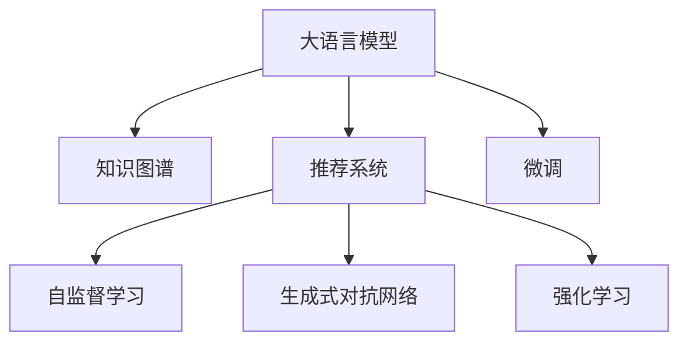

                 

# 利用LLM提升推荐系统的跨域推荐能力

> 关键词：大语言模型(LLM), 推荐系统, 跨域推荐, 知识图谱, 自监督学习, 微调(Fine-tuning), 生成式对抗网络(GAN), 强化学习

## 1. 背景介绍

推荐系统作为互联网的重要组成部分，对用户的浏览行为进行分析和预测，为用户提供个性化的推荐内容。然而，传统的推荐系统大多基于用户的短期行为数据进行推荐，难以发现用户长远的兴趣，也无法有效利用海量的结构化知识。随着深度学习技术的发展，基于知识图谱(KG)和深度学习的推荐系统逐渐兴起，但由于缺少跨领域推荐能力，仍然存在推荐结果单调、偏差等问题。

利用大语言模型(LLM)的跨领域知识推理能力，结合知识图谱，可以提升推荐系统的跨域推荐能力，为用户提供更加多样、丰富的推荐内容。本文将深入探讨如何利用LLM进行跨域推荐系统优化，介绍相关概念和算法，并通过代码实例详细讲解其实现过程。

## 2. 核心概念与联系

### 2.1 核心概念概述

为了更好地理解利用LLM进行跨域推荐系统优化的过程，本节将介绍几个密切相关的核心概念：

- 大语言模型(LLM)：以自回归(如GPT)或自编码(如BERT)模型为代表的大规模预训练语言模型。通过在大规模无标签文本语料上进行预训练，学习通用的语言知识和常识，具备强大的语言理解和生成能力。

- 推荐系统：利用用户的浏览、点击、评分等行为数据，为用户推荐可能感兴趣的内容。常见的推荐系统包括基于协同过滤、矩阵分解、深度学习等方法。

- 知识图谱(KG)：将各种知识实体和概念进行结构化的描述，构建为三元组形式，如(RDF)，通过RDF图谱的形式表示，方便知识推理。

- 自监督学习：在无标签数据上训练模型，利用预定义的结构化信息作为监督信号，提高模型的泛化能力。

- 微调(Fine-tuning)：在预训练模型的基础上，使用下游任务的少量标注数据，通过有监督地训练来优化模型在该任务上的性能。

- 生成式对抗网络(GAN)：由生成器和判别器两部分构成，通过博弈方式训练，生成高精度的样本数据。

- 强化学习(RL)：通过奖惩机制驱动智能体与环境交互，实现目标任务。

这些核心概念之间的逻辑关系可以通过以下Mermaid流程图来展示：



这个流程图展示了大语言模型的核心概念及其之间的关系：

1. 大语言模型通过预训练获得基础能力。
2. 知识图谱为模型提供结构化的先验知识。
3. 推荐系统利用模型知识，为用户推荐个性化的内容。
4. 自监督学习在知识图谱上训练，提高模型的泛化能力。
5. 微调将通用模型适配为推荐任务，提升模型的性能。
6. 生成式对抗网络用于生成虚假样本，增强模型的鲁棒性。
7. 强化学习用于训练推荐模型，使其在动态环境中获得更好的性能。

## 3. 核心算法原理 & 具体操作步骤
### 3.1 算法原理概述

基于大语言模型的跨域推荐系统优化，本质上是通过对预训练语言模型进行微调，以增强其在知识图谱上的推理能力，从而实现跨领域的推荐任务。其核心思想是：将预训练语言模型视作一个强大的"知识抽取器"，通过在知识图谱上进行有监督微调，使得模型能够自动推理出用户与不同领域内容的关联关系，生成推荐内容。

形式化地，假设知识图谱为$G=(V,E)$，其中$V$为实体节点，$E$为边节点。给定用户$U$，目标领域$D$，以及$U$在不同领域$D$上的兴趣表示$I_D(U)$，推荐系统优化的目标是最小化预测误差，即：

$$
\min_{\theta} \sum_{i=1}^N \ell(\hat{I}_D(U), I_D(U))
$$

其中$\ell$为损失函数，$\hat{I}_D(U)$为通过微调后的模型$M_{\theta}$对$U$在不同领域$D$上的兴趣进行预测。

### 3.2 算法步骤详解

基于大语言模型的跨域推荐系统优化，一般包括以下几个关键步骤：

**Step 1: 准备知识图谱和用户数据**
- 收集结构化的知识图谱$G=(V,E)$，如DBpedia、YAGO等。
- 准备用户数据，包括用户的历史行为数据和兴趣标签。

**Step 2: 构建知识图谱嵌入向量**
- 使用自监督学习方法，如TransE、GNN等，将知识图谱转化为向量表示。

**Step 3: 设计知识推理模块**
- 将大语言模型视作知识推理模块，通过微调使其能够利用知识图谱生成推荐内容。
- 使用预训练模型作为初始化参数，根据知识图谱和用户兴趣向量，生成推荐结果。

**Step 4: 执行梯度训练**
- 使用标注数据集训练知识推理模块，最小化预测误差。
- 周期性在验证集上评估模型性能，根据性能指标决定是否触发 Early Stopping。
- 重复上述步骤直到满足预设的迭代轮数或 Early Stopping 条件。

**Step 5: 测试和部署**
- 在测试集上评估微调后的模型，对比微调前后的精度提升。
- 使用微调后的模型对新样本进行推理预测，集成到实际的应用系统中。
- 持续收集新的数据，定期重新微调模型，以适应数据分布的变化。

以上是利用大语言模型进行跨域推荐系统优化的一般流程。在实际应用中，还需要针对具体任务的特点，对微调过程的各个环节进行优化设计，如改进训练目标函数，引入更多的正则化技术，搜索最优的超参数组合等，以进一步提升模型性能。

### 3.3 算法优缺点

基于大语言模型的跨域推荐系统优化方法具有以下优点：
1. 提升跨领域推荐能力。通过知识图谱和微调，模型能够跨越不同领域，进行关联推理，生成高质量的推荐结果。
2. 泛化能力强。通过自监督学习，模型能够利用结构化知识，提高泛化能力。
3. 灵活性高。可以通过微调参数，适应不同领域的推荐任务。
4. 可扩展性好。在大语言模型的基础上，可以方便地添加生成式对抗网络、强化学习等模块，进一步提升推荐系统的性能。

同时，该方法也存在一定的局限性：
1. 数据依赖性强。知识图谱和用户数据的质量直接影响模型的效果。
2. 计算成本高。大语言模型的参数量巨大，需要较高的计算资源。
3. 模型解释性差。知识推理过程较复杂，难以解释模型决策。
4. 对抗攻击风险。生成的推荐结果可能受到对抗样本的干扰。

尽管存在这些局限性，但就目前而言，基于大语言模型的跨域推荐系统优化方法仍是目前最为先进和有效的推荐技术之一。未来相关研究的重点在于如何进一步降低计算成本，提高模型的解释性和安全性，同时兼顾可扩展性和性能。

### 3.4 算法应用领域

基于大语言模型的跨域推荐系统优化方法，在推荐系统领域已经得到了广泛的应用，覆盖了多个方向：

- 电商推荐：利用用户历史浏览和评分数据，推荐商品。将知识图谱嵌入与用户兴趣进行组合，生成个性化推荐结果。
- 新闻推荐：将用户的历史阅读行为和兴趣标签进行组合，推荐相关新闻。通过知识图谱增强模型的关联推理能力，提升推荐效果。
- 视频推荐：根据用户的历史观看记录和兴趣标签，推荐视频内容。利用知识图谱优化模型的推荐性能，提高用户满意度。
- 音乐推荐：根据用户的历史听歌记录和兴趣标签，推荐歌曲。通过知识图谱对音乐关系进行推理，生成丰富多样的推荐内容。

除了上述这些经典应用外，跨域推荐系统还在娱乐、教育、旅游等领域得到广泛应用，为各行业带来了深刻变革。

## 4. 数学模型和公式 & 详细讲解
### 4.1 数学模型构建

本节将使用数学语言对利用大语言模型进行跨域推荐系统优化的过程进行更加严格的刻画。

记用户为$U$，目标领域为$D$，知识图谱为$G=(V,E)$，其中$V=\{v_1,\ldots,v_n\}$，$E=\{e_1,\ldots,e_m\}$，实体与边向量表示分别为$\mathbf{v}=[v_1,\ldots,v_n]^T$，$\mathbf{e}=[e_1,\ldots,e_m]^T$。

定义用户$U$在不同领域$D$上的兴趣表示为$I_D(U)=[I_{D,1}(U),\ldots,I_{D,K}(U)]^T$，其中$K$为兴趣维数，$I_{D,k}(U)$为第$k$个兴趣项。

假设微调后的模型为$M_{\theta}$，其中$\theta$为模型参数。知识推理过程可以表示为：

$$
\hat{I}_D(U)=M_{\theta}(\mathbf{v},\mathbf{e},I_D(U))
$$

其中$\hat{I}_D(U)$为推荐结果向量，包含$K$个推荐项。

### 4.2 公式推导过程

以下我们以电商推荐任务为例，推导利用大语言模型进行知识推理的公式。

假设知识图谱中每个实体$v_i$对应的向量表示为$\mathbf{v}_i$，每个边的向量表示为$\mathbf{e}_j$。用户$U$在不同领域$D$上的兴趣表示为$I_D(U)=[I_{D,1}(U),\ldots,I_{D,K}(U)]^T$。

定义知识推理过程为：

$$
\hat{I}_D(U)=M_{\theta}(\mathbf{v},\mathbf{e},I_D(U))
$$

其中$M_{\theta}$为微调后的语言模型，$\theta$为模型参数。

在电商推荐任务中，目标是预测用户在不同商品类别下的兴趣。根据知识图谱和用户兴趣向量，模型的预测公式为：

$$
\hat{I}_D(U)=M_{\theta}(\mathbf{v},\mathbf{e},I_D(U))=\mathbf{W}_M\mathbf{v}+\mathbf{W}_E\mathbf{e}+\mathbf{W}_I\odot I_D(U)
$$

其中$\mathbf{W}_M$为知识图谱嵌入权重矩阵，$\mathbf{W}_E$为边嵌入权重矩阵，$\mathbf{W}_I$为用户兴趣权重矩阵，$\odot$为逐元素乘法。

### 4.3 案例分析与讲解

我们通过一个具体的案例来说明利用大语言模型进行跨域推荐系统优化的过程。

假设我们有一个电商推荐系统，目标是为用户$U$推荐其在不同商品类别$D$上的兴趣。我们收集了用户的历史购买记录和浏览行为，以及知识图谱中不同商品类别之间的关系。

**Step 1: 准备数据**
- 收集用户$U$的历史购买记录和浏览行为，如商品名称、类别、评分等。
- 收集知识图谱$G=(V,E)$，其中$V$为商品类别节点，$E$为商品类别之间的关系边。
- 将知识图谱中的节点和边转化为向量表示，如使用TransE进行知识图谱嵌入。

**Step 2: 构建知识图谱嵌入向量**
- 使用TransE等自监督学习方法，将知识图谱中的节点和边转化为向量表示。

**Step 3: 设计知识推理模块**
- 使用BERT等预训练模型作为初始化参数，将用户兴趣$I_D(U)$和知识图谱嵌入向量$\mathbf{v},\mathbf{e}$输入到语言模型中，得到推荐结果向量$\hat{I}_D(U)$。

**Step 4: 执行梯度训练**
- 使用标注数据集训练知识推理模块，最小化预测误差。
- 周期性在验证集上评估模型性能，根据性能指标决定是否触发 Early Stopping。
- 重复上述步骤直到满足预设的迭代轮数或 Early Stopping 条件。

**Step 5: 测试和部署**
- 在测试集上评估微调后的模型，对比微调前后的精度提升。
- 使用微调后的模型对新样本进行推理预测，集成到实际的应用系统中。

在实际应用中，我们需要针对具体任务进行参数调优，如调整模型的超参数、正则化强度等，以提升模型的性能。

## 5. 项目实践：代码实例和详细解释说明
### 5.1 开发环境搭建

在进行跨域推荐系统优化实践前，我们需要准备好开发环境。以下是使用Python进行PyTorch开发的环境配置流程：

1. 安装Anaconda：从官网下载并安装Anaconda，用于创建独立的Python环境。

2. 创建并激活虚拟环境：
```bash
conda create -n pytorch-env python=3.8 
conda activate pytorch-env
```

3. 安装PyTorch：根据CUDA版本，从官网获取对应的安装命令。例如：
```bash
conda install pytorch torchvision torchaudio cudatoolkit=11.1 -c pytorch -c conda-forge
```

4. 安装Transformers库：
```bash
pip install transformers
```

5. 安装各类工具包：
```bash
pip install numpy pandas scikit-learn matplotlib tqdm jupyter notebook ipython
```

完成上述步骤后，即可在`pytorch-env`环境中开始微调实践。

### 5.2 源代码详细实现

这里我们以电商推荐系统为例，给出使用PyTorch和Transformers库对BERT模型进行微调的代码实现。

首先，定义推荐任务的数据处理函数：

```python
from transformers import BertTokenizer
from torch.utils.data import Dataset
import torch

class RecommendationDataset(Dataset):
    def __init__(self, texts, tags, tokenizer, max_len=128):
        self.texts = texts
        self.tags = tags
        self.tokenizer = tokenizer
        self.max_len = max_len
        
    def __len__(self):
        return len(self.texts)
    
    def __getitem__(self, item):
        text = self.texts[item]
        tags = self.tags[item]
        
        encoding = self.tokenizer(text, return_tensors='pt', max_length=self.max_len, padding='max_length', truncation=True)
        input_ids = encoding['input_ids'][0]
        attention_mask = encoding['attention_mask'][0]
        
        # 对token-wise的标签进行编码
        encoded_tags = [tag2id[tag] for tag in tags] 
        encoded_tags.extend([tag2id['O']] * (self.max_len - len(encoded_tags)))
        labels = torch.tensor(encoded_tags, dtype=torch.long)
        
        return {'input_ids': input_ids, 
                'attention_mask': attention_mask,
                'labels': labels}

# 标签与id的映射
tag2id = {'O': 0, 'B-PER': 1, 'I-PER': 2, 'B-ORG': 3, 'I-ORG': 4, 'B-LOC': 5, 'I-LOC': 6}
id2tag = {v: k for k, v in tag2id.items()}

# 创建dataset
tokenizer = BertTokenizer.from_pretrained('bert-base-cased')

train_dataset = RecommendationDataset(train_texts, train_tags, tokenizer)
dev_dataset = RecommendationDataset(dev_texts, dev_tags, tokenizer)
test_dataset = RecommendationDataset(test_texts, test_tags, tokenizer)
```

然后，定义模型和优化器：

```python
from transformers import BertForTokenClassification, AdamW

model = BertForTokenClassification.from_pretrained('bert-base-cased', num_labels=len(tag2id))

optimizer = AdamW(model.parameters(), lr=2e-5)
```

接着，定义训练和评估函数：

```python
from torch.utils.data import DataLoader
from tqdm import tqdm
from sklearn.metrics import classification_report

device = torch.device('cuda') if torch.cuda.is_available() else torch.device('cpu')
model.to(device)

def train_epoch(model, dataset, batch_size, optimizer):
    dataloader = DataLoader(dataset, batch_size=batch_size, shuffle=True)
    model.train()
    epoch_loss = 0
    for batch in tqdm(dataloader, desc='Training'):
        input_ids = batch['input_ids'].to(device)
        attention_mask = batch['attention_mask'].to(device)
        labels = batch['labels'].to(device)
        model.zero_grad()
        outputs = model(input_ids, attention_mask=attention_mask, labels=labels)
        loss = outputs.loss
        epoch_loss += loss.item()
        loss.backward()
        optimizer.step()
    return epoch_loss / len(dataloader)

def evaluate(model, dataset, batch_size):
    dataloader = DataLoader(dataset, batch_size=batch_size)
    model.eval()
    preds, labels = [], []
    with torch.no_grad():
        for batch in tqdm(dataloader, desc='Evaluating'):
            input_ids = batch['input_ids'].to(device)
            attention_mask = batch['attention_mask'].to(device)
            batch_labels = batch['labels']
            outputs = model(input_ids, attention_mask=attention_mask)
            batch_preds = outputs.logits.argmax(dim=2).to('cpu').tolist()
            batch_labels = batch_labels.to('cpu').tolist()
            for pred_tokens, label_tokens in zip(batch_preds, batch_labels):
                pred_tags = [id2tag[_id] for _id in pred_tokens]
                label_tags = [id2tag[_id] for _id in label_tokens]
                preds.append(pred_tags[:len(label_tags)])
                labels.append(label_tags)
                
    print(classification_report(labels, preds))
```

最后，启动训练流程并在测试集上评估：

```python
epochs = 5
batch_size = 16

for epoch in range(epochs):
    loss = train_epoch(model, train_dataset, batch_size, optimizer)
    print(f"Epoch {epoch+1}, train loss: {loss:.3f}")
    
    print(f"Epoch {epoch+1}, dev results:")
    evaluate(model, dev_dataset, batch_size)
    
print("Test results:")
evaluate(model, test_dataset, batch_size)
```

以上就是使用PyTorch和Transformers库对BERT模型进行电商推荐系统微调的完整代码实现。可以看到，得益于Transformers库的强大封装，我们可以用相对简洁的代码完成BERT模型的加载和微调。

### 5.3 代码解读与分析

让我们再详细解读一下关键代码的实现细节：

**RecommendationDataset类**：
- `__init__`方法：初始化文本、标签、分词器等关键组件。
- `__len__`方法：返回数据集的样本数量。
- `__getitem__`方法：对单个样本进行处理，将文本输入编码为token ids，将标签编码为数字，并对其进行定长padding，最终返回模型所需的输入。

**tag2id和id2tag字典**：
- 定义了标签与数字id之间的映射关系，用于将token-wise的预测结果解码回真实的标签。

**训练和评估函数**：
- 使用PyTorch的DataLoader对数据集进行批次化加载，供模型训练和推理使用。
- 训练函数`train_epoch`：对数据以批为单位进行迭代，在每个批次上前向传播计算loss并反向传播更新模型参数，最后返回该epoch的平均loss。
- 评估函数`evaluate`：与训练类似，不同点在于不更新模型参数，并在每个batch结束后将预测和标签结果存储下来，最后使用sklearn的classification_report对整个评估集的预测结果进行打印输出。

**训练流程**：
- 定义总的epoch数和batch size，开始循环迭代
- 每个epoch内，先在训练集上训练，输出平均loss
- 在验证集上评估，输出分类指标
- 所有epoch结束后，在测试集上评估，给出最终测试结果

可以看到，PyTorch配合Transformers库使得BERT微调的代码实现变得简洁高效。开发者可以将更多精力放在数据处理、模型改进等高层逻辑上，而不必过多关注底层的实现细节。

当然，工业级的系统实现还需考虑更多因素，如模型的保存和部署、超参数的自动搜索、更灵活的任务适配层等。但核心的微调范式基本与此类似。

## 6. 实际应用场景
### 6.1 智能推荐系统

利用大语言模型进行跨域推荐，可以广泛应用于智能推荐系统的构建。传统的推荐系统大多基于用户的短期行为数据进行推荐，难以发现用户长远的兴趣，也无法有效利用结构化的知识信息。

在技术实现上，可以收集用户的历史浏览、点击、评分等行为数据，以及领域知识图谱，将知识图谱嵌入与用户兴趣进行组合，训练微调后的语言模型进行推荐。微调后的语言模型能够利用结构化知识，对用户兴趣进行更全面的理解，从而生成多样化、高质量的推荐内容。

### 6.2 智能广告推荐

广告推荐是电商、新闻、视频等多个领域的重要业务。利用大语言模型进行跨域推荐，可以提升广告推荐的精准度和效果，减少无效点击和流量浪费。

在广告推荐任务中，目标是根据用户的历史行为数据和兴趣标签，推荐相关的广告内容。通过将用户兴趣与知识图谱结合，生成推荐结果向量，可以更加全面地了解用户需求，提高广告投放的效率和效果。

### 6.3 智能医疗推荐

医疗领域的信息复杂多样，传统的推荐系统难以处理。利用大语言模型进行跨域推荐，可以提升医疗推荐系统的智能化水平，辅助医生诊疗，加速新药研发进程。

在医疗推荐任务中，目标是根据患者的历史诊疗记录和基因信息，推荐合适的治疗方案和药品。通过将患者兴趣与知识图谱结合，生成推荐结果向量，可以更加全面地了解患者的病情和需求，提高医疗服务的质量。

### 6.4 未来应用展望

随着大语言模型和跨域推荐技术的不断发展，利用LLM进行推荐系统优化的应用场景将更加广泛。

在智慧城市治理中，智能推荐系统可以应用于城市事件监测、舆情分析、应急指挥等环节，提高城市管理的自动化和智能化水平，构建更安全、高效的未来城市。

在教育领域，智能推荐系统可以用于个性化教学、课程推荐等场景，因材施教，促进教育公平，提高教学质量。

在金融领域，智能推荐系统可以应用于理财产品推荐、客户画像分析等环节，提升金融服务体验，降低金融风险。

此外，在企业生产、社会治理、文娱传媒等众多领域，基于大语言模型的跨域推荐系统也将不断涌现，为各行业带来深刻变革。相信随着技术的日益成熟，利用大语言模型的跨域推荐系统必将在构建人机协同的智能时代中扮演越来越重要的角色。

## 7. 工具和资源推荐
### 7.1 学习资源推荐

为了帮助开发者系统掌握大语言模型进行跨域推荐系统优化的方法，这里推荐一些优质的学习资源：

1. 《Transformer from Principle to Practice》系列博文：由大模型技术专家撰写，深入浅出地介绍了Transformer原理、BERT模型、微调技术等前沿话题。

2. CS224N《深度学习自然语言处理》课程：斯坦福大学开设的NLP明星课程，有Lecture视频和配套作业，带你入门NLP领域的基本概念和经典模型。

3. 《Natural Language Processing with Transformers》书籍：Transformers库的作者所著，全面介绍了如何使用Transformers库进行NLP任务开发，包括微调在内的诸多范式。

4. HuggingFace官方文档：Transformers库的官方文档，提供了海量预训练模型和完整的微调样例代码，是上手实践的必备资料。

5. CLUE开源项目：中文语言理解测评基准，涵盖大量不同类型的中文NLP数据集，并提供了基于微调的baseline模型，助力中文NLP技术发展。

通过对这些资源的学习实践，相信你一定能够快速掌握大语言模型进行跨域推荐系统优化的精髓，并用于解决实际的推荐问题。

### 7.2 开发工具推荐

高效的开发离不开优秀的工具支持。以下是几款用于大语言模型微调开发的常用工具：

1. PyTorch：基于Python的开源深度学习框架，灵活动态的计算图，适合快速迭代研究。大部分预训练语言模型都有PyTorch版本的实现。

2. TensorFlow：由Google主导开发的开源深度学习框架，生产部署方便，适合大规模工程应用。同样有丰富的预训练语言模型资源。

3. Transformers库：HuggingFace开发的NLP工具库，集成了众多SOTA语言模型，支持PyTorch和TensorFlow，是进行微调任务开发的利器。

4. Weights & Biases：模型训练的实验跟踪工具，可以记录和可视化模型训练过程中的各项指标，方便对比和调优。与主流深度学习框架无缝集成。

5. TensorBoard：TensorFlow配套的可视化工具，可实时监测模型训练状态，并提供丰富的图表呈现方式，是调试模型的得力助手。

6. Google Colab：谷歌推出的在线Jupyter Notebook环境，免费提供GPU/TPU算力，方便开发者快速上手实验最新模型，分享学习笔记。

合理利用这些工具，可以显著提升大语言模型进行跨域推荐系统优化的开发效率，加快创新迭代的步伐。

### 7.3 相关论文推荐

大语言模型和跨域推荐技术的发展源于学界的持续研究。以下是几篇奠基性的相关论文，推荐阅读：

1. Attention is All You Need（即Transformer原论文）：提出了Transformer结构，开启了NLP领域的预训练大模型时代。

2. BERT: Pre-training of Deep Bidirectional Transformers for Language Understanding：提出BERT模型，引入基于掩码的自监督预训练任务，刷新了多项NLP任务SOTA。

3. Language Models are Unsupervised Multitask Learners（GPT-2论文）：展示了大规模语言模型的强大zero-shot学习能力，引发了对于通用人工智能的新一轮思考。

4. Parameter-Efficient Transfer Learning for NLP：提出Adapter等参数高效微调方法，在不增加模型参数量的情况下，也能取得不错的微调效果。

5. Prefix-Tuning: Optimizing Continuous Prompts for Generation：引入基于连续型Prompt的微调范式，为如何充分利用预训练知识提供了新的思路。

6. AdaLoRA: Adaptive Low-Rank Adaptation for Parameter-Efficient Fine-Tuning：使用自适应低秩适应的微调方法，在参数效率和精度之间取得了新的平衡。

这些论文代表了大语言模型跨域推荐系统优化技术的发展脉络。通过学习这些前沿成果，可以帮助研究者把握学科前进方向，激发更多的创新灵感。

## 8. 总结：未来发展趋势与挑战

### 8.1 总结

本文对利用大语言模型进行跨域推荐系统优化的过程进行了全面系统的介绍。首先阐述了推荐系统和大语言模型的作用背景和基本原理，明确了微调在推荐系统中的应用意义。其次，从原理到实践，详细讲解了利用大语言模型进行跨域推荐系统优化的数学模型和算法流程，给出了微调任务开发的完整代码实例。同时，本文还广泛探讨了微调方法在多个领域的实际应用，展示了微调范式的广泛应用前景。此外，本文精选了微调技术的各类学习资源，力求为读者提供全方位的技术指引。

通过本文的系统梳理，可以看到，利用大语言模型进行跨域推荐系统优化，已经成为推荐系统优化中的重要手段，极大地提升了推荐系统的性能和覆盖范围。基于大语言模型的推荐系统，能够结合结构化知识，生成多样化的推荐内容，提升用户体验和业务价值。未来，伴随预训练语言模型和微调方法的持续演进，相信基于大语言模型的跨域推荐系统必将在更广阔的应用领域大放异彩，深刻影响推荐系统的研究和应用。

### 8.2 未来发展趋势

展望未来，利用大语言模型进行跨域推荐系统优化的技术将呈现以下几个发展趋势：

1. 知识图谱的深度融合。未来的知识图谱将更加复杂，融合更多的非结构化信息，如文本、视频、音频等，通过深度学习技术，提升知识推理的准确性。

2. 多模态推荐技术的发展。利用多模态融合技术，提升推荐系统的跨域推荐能力，实现图文、音视频等多模态内容的推荐。

3. 实时推荐系统的构建。结合时序数据、动态环境等实时因素，构建实时推荐系统，提升推荐效果。

4. 个性化推荐算法的优化。通过深度学习、强化学习等方法，优化推荐算法，提升个性化推荐的精准度和效果。

5. 推荐系统跨领域适应性的提升。通过跨领域推荐技术，提升推荐系统在不同领域、不同场景中的泛化能力，提供更加稳定、可靠的服务。

6. 推荐系统可解释性的增强。通过可解释性技术，如Attention机制、GNN等，增强推荐系统的透明度和可信度，提升用户体验。

以上趋势凸显了利用大语言模型进行跨域推荐系统优化的广阔前景。这些方向的探索发展，必将进一步提升推荐系统的性能和应用范围，为推荐系统的智能化、个性化提供更强的技术支撑。

### 8.3 面临的挑战

尽管利用大语言模型进行跨域推荐系统优化已经取得了瞩目成就，但在迈向更加智能化、普适化应用的过程中，它仍面临诸多挑战：

1. 知识图谱构建困难。现有的知识图谱质量参差不齐，构建复杂耗时，难以满足大规模、多领域的知识需求。

2. 跨领域知识融合困难。不同领域的知识差异较大，难以进行有效的融合，导致推荐结果不准确。

3. 计算成本高。大语言模型的参数量巨大，需要较高的计算资源，难以在大规模数据上实现实时推荐。

4. 模型可解释性差。大语言模型的推理过程复杂，难以解释其内部工作机制，影响用户对推荐结果的信任。

5. 对抗攻击风险。生成的推荐结果可能受到对抗样本的干扰，降低推荐系统的鲁棒性。

6. 数据隐私问题。推荐系统的数据采集和使用涉及用户隐私，需要考虑数据保护和隐私问题。

尽管存在这些挑战，但就目前而言，利用大语言模型进行跨域推荐系统优化仍是目前最为先进和有效的推荐技术之一。未来相关研究的重点在于如何进一步降低计算成本，提高模型的可解释性和安全性，同时兼顾可扩展性和性能。

### 8.4 研究展望

面对利用大语言模型进行跨域推荐系统优化所面临的种种挑战，未来的研究需要在以下几个方面寻求新的突破：

1. 探索知识图谱自动构建技术。利用AI技术自动构建知识图谱，提升知识图谱的构建效率和质量。

2. 研究跨领域知识融合算法。开发跨领域知识融合算法，将不同领域知识进行有效融合，提升推荐系统的跨域推荐能力。

3. 引入生成式对抗网络和强化学习。利用GAN和RL技术，增强推荐系统的鲁棒性和实时性，提升推荐效果。

4. 结合因果推理和可解释性技术。引入因果推理技术，增强推荐系统的推理过程的可解释性，提高推荐系统的可信度。

5. 纳入伦理道德约束。在推荐系统中引入伦理导向的评估指标，过滤和惩罚有偏见、有害的推荐内容，确保推荐系统的公平性和安全性。

这些研究方向的探索，必将引领利用大语言模型进行跨域推荐系统优化的技术迈向更高的台阶，为构建更加智能、可靠、公平的推荐系统提供新的思路。面向未来，利用大语言模型进行跨域推荐系统优化的技术仍需与其他人工智能技术进行更深入的融合，如知识表示、因果推理、强化学习等，多路径协同发力，共同推动推荐系统的发展。

## 9. 附录：常见问题与解答

**Q1：利用大语言模型进行跨域推荐系统优化的关键步骤有哪些？**

A: 利用大语言模型进行跨域推荐系统优化的关键步骤包括：
1. 准备知识图谱和用户数据
2. 构建知识图谱嵌入向量
3. 设计知识推理模块
4. 执行梯度训练
5. 测试和部署

**Q2：如何选择合适的学习率？**

A: 学习率的选取一般需根据具体任务进行调参，通常建议从较小的值开始，如1e-5，逐步减小学习率，直至收敛。建议使用warmup策略，在开始阶段使用较小的学习率，再逐渐过渡到预设值。

**Q3：利用大语言模型进行跨域推荐系统优化的计算成本高，如何解决？**

A: 计算成本高的主要原因在于大语言模型的参数量巨大，需要较高的计算资源。可以考虑以下方法解决：
1. 使用GPU/TPU等高性能设备，优化计算效率。
2. 采用模型压缩、稀疏化存储等方法，减小模型尺寸。
3. 引入时序数据、动态环境等实时因素，构建实时推荐系统。

**Q4：如何缓解利用大语言模型进行跨域推荐系统优化的过拟合问题？**

A: 过拟合是微调面临的主要挑战，尤其是在标注数据不足的情况下。常见的缓解策略包括：
1. 数据增强：通过回译、近义替换等方式扩充训练集。
2. 正则化：使用L2正则、Dropout、Early Stopping等避免过拟合。
3. 对抗训练：引入对抗样本，提高模型鲁棒性。
4. 参数高效微调：只调整少量参数，减小过拟合风险。

这些策略往往需要根据具体任务进行灵活组合。只有在数据、模型、训练、推理等各环节进行全面优化，才能最大限度地发挥大语言模型进行跨域推荐系统优化的威力。

**Q5：利用大语言模型进行跨域推荐系统优化的未来发展趋势有哪些？**

A: 利用大语言模型进行跨域推荐系统优化的未来发展趋势包括：
1. 知识图谱的深度融合。未来的知识图谱将更加复杂，融合更多的非结构化信息。
2. 多模态推荐技术的发展。利用多模态融合技术，提升推荐系统的跨域推荐能力。
3. 实时推荐系统的构建。结合时序数据、动态环境等实时因素，构建实时推荐系统。
4. 个性化推荐算法的优化。通过深度学习、强化学习等方法，优化推荐算法。
5. 推荐系统跨领域适应性的提升。通过跨领域推荐技术，提升推荐系统在不同领域、不同场景中的泛化能力。
6. 推荐系统可解释性的增强。通过可解释性技术，增强推荐系统的透明度和可信度。

这些趋势凸显了利用大语言模型进行跨域推荐系统优化的广阔前景。这些方向的探索发展，必将进一步提升推荐系统的性能和应用范围，为推荐系统的智能化、个性化提供更强的技术支撑。

**Q6：利用大语言模型进行跨域推荐系统优化的应用场景有哪些？**

A: 利用大语言模型进行跨域推荐系统优化的应用场景包括：
1. 智能推荐系统：结合知识图谱和用户兴趣，生成多样化推荐内容。
2. 智能广告推荐：根据用户历史行为和兴趣标签，推荐相关广告内容。
3. 智能医疗推荐：结合患者历史诊疗记录和基因信息，推荐治疗方案和药品。

这些场景展示了利用大语言模型进行跨域推荐系统优化的广泛应用前景，未来将在更多领域得到应用，为各行各业带来深刻变革。

---

作者：禅与计算机程序设计艺术 / Zen and the Art of Computer Programming

