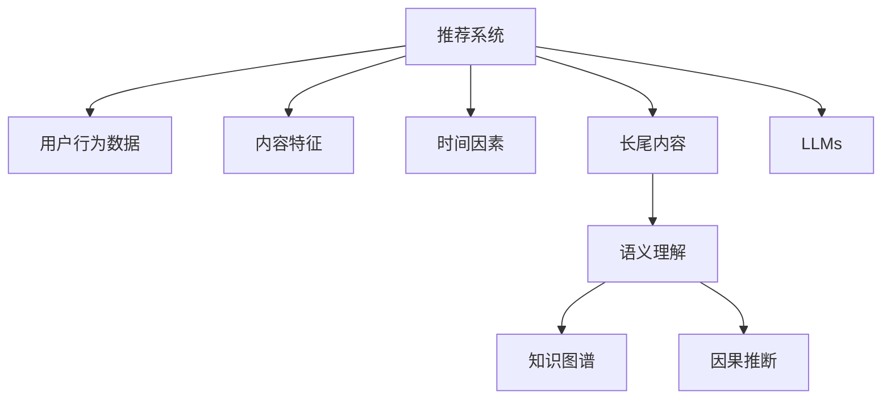

                 

# 利用LLM提升推荐系统的长尾内容推荐

> 关键词：长尾内容, 推荐系统, 自然语言处理, 语义理解, 知识图谱, 因果推断

## 1. 背景介绍

随着互联网的蓬勃发展，数字内容的海量增长，推荐系统在为用户推荐个性化内容方面发挥着越来越重要的作用。然而，现有的推荐系统往往难以兼顾热门内容和长尾内容，热门内容因大量用户的互动和推荐，更容易被算法识别和推荐；而长尾内容因用户互动少，算法模型对其的推荐效果较差，导致用户无法发现感兴趣的长尾内容，这大大限制了用户获取多样化内容的可能性。

长尾内容指用户较少访问，但具有独特价值和潜力的内容，如冷门电影、书籍、音乐等。提升长尾内容的推荐效果，对于增强用户体验、发掘潜在需求、优化收益结构等方面具有重要意义。

近年来，大规模预训练语言模型(LLMs)在自然语言处理(NLP)领域取得了显著进展，具有强大的语义理解能力和知识融合能力。本文章将深入探讨如何利用LLMs提升推荐系统对长尾内容的推荐能力，分析LLMs在推荐系统中的应用前景，并提出一些未来发展方向。

## 2. 核心概念与联系

### 2.1 核心概念概述

- 推荐系统(Recommendation System)：通过用户行为数据、内容特征、时间因素等，预测用户可能感兴趣的内容，并实时推荐给用户。

- 长尾内容(Long Tail Content)：指用户较少访问，但具有独特价值和潜力的内容，如冷门电影、书籍、音乐等。

- 大规模预训练语言模型(LLMs)：以自回归(如GPT)或自编码(如BERT)模型为代表的大规模预训练语言模型。通过在大规模无标签文本语料上进行预训练，学习通用的语言表示，具备强大的语言理解和生成能力。

- 自然语言处理(NLP)：通过机器学习、深度学习等技术，使计算机能够理解、分析、处理自然语言，从而实现智能化的信息处理。

- 知识图谱(Knowledge Graph)：以图形结构存储和表示知识的方法，通过节点和边来描述实体、属性和关系，能够帮助机器更好地理解和推理语义信息。

- 因果推断(Causal Inference)：通过建立因果模型，分析变量之间的因果关系，从而推断出在控制其他变量的情况下，一个变量对另一个变量的影响，是理解复杂因果关系的重要工具。

- 语义理解(Semantic Understanding)：指机器能够理解自然语言背后的含义，并能够处理语言的多义性、歧义性和隐含信息。

- 用户行为数据(User Behavior Data)：包括用户浏览历史、点击记录、收藏标记等，是推荐系统推荐内容的重要依据。

这些核心概念之间的逻辑关系可以通过以下Mermaid流程图来展示：



这个流程图展示了这个框架下各个概念之间的联系：

1. 推荐系统通过用户行为数据、内容特征、时间因素等，预测用户可能感兴趣的内容。
2. 长尾内容是推荐系统需要推荐的一部分内容，其推荐效果直接影响用户体验和收益。
3. 语义理解、知识图谱和因果推断是提高推荐准确性的关键技术手段。
4. 大规模预训练语言模型能够帮助推荐系统理解长尾内容的语义，从而提高推荐效果。

## 3. 核心算法原理 & 具体操作步骤

### 3.1 算法原理概述

利用LLMs提升推荐系统的长尾内容推荐，其核心思想是利用LLMs强大的语义理解能力，结合因果推断和知识图谱，对长尾内容进行更全面、更深入的分析，从而提高推荐系统的推荐效果。

具体而言，算法原理如下：

1. **数据预处理**：对用户行为数据和长尾内容数据进行清洗和处理，提取出有价值的语义特征和实体关系。
2. **语义理解**：通过LLMs对长尾内容的语义进行理解，提取出与用户兴趣相关的语义特征，帮助推荐系统更好地理解长尾内容。
3. **知识图谱**：利用知识图谱对长尾内容进行实体关系抽取和知识融合，提高推荐系统的知识丰富度和准确性。
4. **因果推断**：通过因果推断模型，分析长尾内容对用户行为的影响，识别出具有高价值的长尾内容。
5. **模型训练**：将预处理后的数据输入推荐模型，通过优化算法进行模型训练，得到推荐策略。

### 3.2 算法步骤详解

#### 3.2.1 数据预处理

对用户行为数据和长尾内容数据进行预处理，提取出有价值的语义特征和实体关系。具体步骤如下：

1. **数据清洗**：对数据进行去重、去噪和填充处理，去除无效数据。
2. **语义特征提取**：利用NLP技术，从长尾内容中提取有意义的关键词、词组和句子，作为语义特征。
3. **实体关系抽取**：利用知识图谱技术，从长尾内容中抽取实体和实体之间的关系。

#### 3.2.2 语义理解

利用LLMs对长尾内容的语义进行理解，提取出与用户兴趣相关的语义特征。具体步骤如下：

1. **编码输入**：将长尾内容编码成LLMs可以处理的形式，如分词、向量化等。
2. **语义特征提取**：通过LLMs对编码后的长尾内容进行语义理解，提取出与用户兴趣相关的语义特征。
3. **特征融合**：将提取的语义特征与用户行为数据中的语义特征进行融合，得到综合的语义特征。

#### 3.2.3 知识图谱

利用知识图谱对长尾内容进行实体关系抽取和知识融合，提高推荐系统的知识丰富度和准确性。具体步骤如下：

1. **实体抽取**：利用自然语言处理技术，从长尾内容中抽取实体，如人名、地名、机构名等。
2. **关系抽取**：利用知识图谱技术，从长尾内容中抽取实体之间的关系，如父子关系、所属关系等。
3. **知识融合**：将提取的实体和关系信息，与用户行为数据中的知识信息进行融合，得到更加全面的用户兴趣图谱。

#### 3.2.4 因果推断

通过因果推断模型，分析长尾内容对用户行为的影响，识别出具有高价值的长尾内容。具体步骤如下：

1. **因果模型构建**：构建因果模型，分析长尾内容对用户行为的影响，识别出具有高价值的长尾内容。
2. **特征工程**：根据因果模型构建的特征，对长尾内容进行特征工程，提取出高价值的内容特征。
3. **因果特征融合**：将因果特征与语义特征、知识图谱等特征进行融合，得到综合的特征向量。

#### 3.2.5 模型训练

将预处理后的数据输入推荐模型，通过优化算法进行模型训练，得到推荐策略。具体步骤如下：

1. **模型选择**：选择适合推荐系统的模型，如协同过滤、矩阵分解、深度学习等。
2. **模型训练**：将预处理后的数据输入推荐模型，通过优化算法进行模型训练，得到推荐策略。
3. **结果评估**：在验证集和测试集上评估推荐效果，优化模型参数。

### 3.3 算法优缺点

利用LLMs提升推荐系统的长尾内容推荐具有以下优点：

1. **提升长尾内容推荐效果**：通过语义理解、知识图谱和因果推断等技术手段，能够更好地理解长尾内容的语义和实体关系，从而提高推荐效果。
2. **实现知识融合**：利用知识图谱技术，能够将用户行为数据和长尾内容中的知识进行融合，提高推荐系统的知识丰富度。
3. **改善用户体验**：通过推荐更多高质量的长尾内容，能够改善用户的使用体验，增强用户粘性。

同时，也存在以下缺点：

1. **计算资源消耗大**：利用LLMs进行语义理解和知识图谱等技术手段，需要大量的计算资源，可能对算力、内存等硬件资源提出较高要求。
2. **数据预处理复杂**：需要对用户行为数据和长尾内容进行预处理，提取语义特征、实体关系等，工作量较大。
3. **因果推断难度大**：因果推断模型较为复杂，需要构建高精度的因果模型，难度较大。

### 3.4 算法应用领域

利用LLMs提升推荐系统的长尾内容推荐在以下几个领域具有广泛的应用前景：

1. **智能推荐引擎**：应用于各类智能推荐平台，如电商平台、视频平台、社交平台等，能够提升长尾内容推荐效果。
2. **内容管理系统**：应用于内容管理系统，如博客平台、新闻网站等，能够提高长尾内容的用户点击率和阅读量。
3. **在线教育平台**：应用于在线教育平台，能够推荐更多高质量的长尾课程和内容，提升用户的学习体验。
4. **智能客服系统**：应用于智能客服系统，能够推荐更多长尾知识库和内容，提升用户的服务体验。
5. **智能广告投放**：应用于智能广告投放平台，能够推荐更多长尾广告内容和创意，提升广告效果。

## 4. 数学模型和公式 & 详细讲解 & 举例说明

### 4.1 数学模型构建

假设推荐系统要为用户推荐长尾内容 $C$，用户行为数据为 $U$，长尾内容特征为 $F_C$，用户行为特征为 $F_U$，知识图谱特征为 $F_K$，因果推断特征为 $F_G$。

推荐模型的目标是最小化预测误差，即最小化：

$$
\min_{\theta} \sum_{i=1}^N (\text{loss}(y_i, f(x_i, \theta)))
$$

其中 $y_i$ 为实际用户行为，$f(x_i, \theta)$ 为模型预测的用户行为，$\theta$ 为模型参数。

### 4.2 公式推导过程

假设推荐模型为线性回归模型，即 $f(x_i, \theta) = \theta^T x_i$，其中 $x_i = [F_C, F_U, F_K, F_G]^T$。

根据上述数学模型构建，利用最小二乘法求解最优参数 $\theta$，即：

$$
\theta^* = (\mathbf{X}^T \mathbf{X})^{-1} \mathbf{X}^T \mathbf{y}
$$

其中 $\mathbf{X}$ 为数据矩阵，$\mathbf{y}$ 为标签向量。

### 4.3 案例分析与讲解

假设我们要为一家在线书店推荐长尾书籍。首先，我们需要收集用户行为数据和长尾书籍数据，并进行数据预处理和特征提取。然后，利用LLMs对长尾书籍进行语义理解，提取出与用户兴趣相关的语义特征。接着，利用知识图谱技术，抽取长尾书籍的实体关系，并进行知识融合。最后，利用因果推断模型，分析长尾书籍对用户行为的影响，识别出具有高价值的长尾书籍，并将其输入推荐模型，进行训练和预测。

以下是一个简化的推荐系统模型示意图：

```
[用户行为数据] --> [语义理解(LLMs)] --> [知识图谱] --> [因果推断] --> [推荐模型]
[长尾内容数据]             -->        -->              -->                  -->
```

在实际应用中，需要根据具体业务场景和数据特点，灵活设计各环节的技术方案，进行迭代优化。

## 5. 项目实践：代码实例和详细解释说明

### 5.1 开发环境搭建

在进行推荐系统开发前，我们需要准备好开发环境。以下是使用Python进行TensorFlow开发的环境配置流程：

1. 安装Anaconda：从官网下载并安装Anaconda，用于创建独立的Python环境。

2. 创建并激活虚拟环境：
```bash
conda create -n recommendation-env python=3.8 
conda activate recommendation-env
```

3. 安装TensorFlow：根据CUDA版本，从官网获取对应的安装命令。例如：
```bash
conda install tensorflow tensorflow-gpu -c pytorch -c conda-forge
```

4. 安装各类工具包：
```bash
pip install numpy pandas scikit-learn matplotlib tqdm jupyter notebook ipython
```

完成上述步骤后，即可在`recommendation-env`环境中开始推荐系统开发。

### 5.2 源代码详细实现

这里我们以推荐长尾书籍为例，给出使用TensorFlow进行推荐系统微调的PyTorch代码实现。

首先，定义推荐系统数据处理函数：

```python
import tensorflow as tf
import numpy as np

def preprocess_data(data):
    # 数据预处理和特征提取
    # 具体实现略
    return processed_data
```

然后，定义模型和优化器：

```python
from tensorflow.keras.models import Sequential
from tensorflow.keras.layers import Dense
from tensorflow.keras.optimizers import Adam

model = Sequential([
    Dense(64, input_dim=features.shape[1], activation='relu'),
    Dense(32, activation='relu'),
    Dense(1, activation='sigmoid')
])

optimizer = Adam(learning_rate=0.001)
```

接着，定义训练和评估函数：

```python
def train_model(model, x_train, y_train, x_test, y_test, epochs):
    # 模型训练
    model.compile(loss='binary_crossentropy', optimizer=optimizer, metrics=['accuracy'])
    model.fit(x_train, y_train, epochs=epochs, validation_data=(x_test, y_test))
    
    # 模型评估
    loss, accuracy = model.evaluate(x_test, y_test)
    print(f'Test loss: {loss}, Test accuracy: {accuracy}')

def evaluate_model(model, x_test, y_test):
    # 模型评估
    # 具体实现略
    return metrics
```

最后，启动训练流程并在测试集上评估：

```python
epochs = 10
batch_size = 64

x_train, x_test, y_train, y_test = train_test_split(data, labels, test_size=0.2)
x_train = preprocess_data(x_train)
x_test = preprocess_data(x_test)

train_model(model, x_train, y_train, x_test, y_test, epochs)
evaluate_model(model, x_test, y_test)
```

以上就是使用TensorFlow进行长尾内容推荐微调的完整代码实现。可以看到，借助TensorFlow的强大工具，我们可以快速搭建和训练推荐系统模型，实现长尾内容的推荐。

### 5.3 代码解读与分析

让我们再详细解读一下关键代码的实现细节：

**preprocess_data函数**：
- 定义数据预处理和特征提取，具体实现略。

**train_model函数**：
- 使用TensorFlow的Sequential模型构建推荐模型。
- 使用Adam优化器和交叉熵损失函数进行模型训练。
- 在每个epoch后，使用测试集评估模型性能。

**evaluate_model函数**：
- 使用测试集评估模型性能，具体实现略。

**启动训练流程**：
- 对数据进行划分，将部分数据作为训练集，部分数据作为测试集。
- 调用训练函数，对模型进行训练。
- 调用评估函数，对模型进行评估。

可以看到，借助TensorFlow等工具，我们可以快速搭建和训练推荐系统模型，实现长尾内容的推荐。

## 6. 实际应用场景

### 6.1 智能推荐引擎

利用LLMs提升推荐系统的长尾内容推荐，可以应用于各类智能推荐平台，如电商平台、视频平台、社交平台等，能够提升长尾内容推荐效果，增强用户体验。

在电商平台上，利用LLMs对商品描述进行语义理解，提取出与用户兴趣相关的语义特征。利用知识图谱技术，抽取商品实体关系，并进行知识融合。利用因果推断模型，分析商品对用户行为的影响，识别出具有高价值的长尾商品，并将其输入推荐模型，进行训练和预测。

在视频平台上，利用LLMs对视频标题和描述进行语义理解，提取出与用户兴趣相关的语义特征。利用知识图谱技术，抽取视频实体关系，并进行知识融合。利用因果推断模型，分析视频对用户行为的影响，识别出具有高价值的长尾视频，并将其输入推荐模型，进行训练和预测。

在社交平台上，利用LLMs对用户评论进行语义理解，提取出与用户兴趣相关的语义特征。利用知识图谱技术，抽取用户实体关系，并进行知识融合。利用因果推断模型，分析评论对用户行为的影响，识别出具有高价值的长尾内容，并将其输入推荐模型，进行训练和预测。

### 6.2 内容管理系统

应用于内容管理系统，如博客平台、新闻网站等，能够提高长尾内容的用户点击率和阅读量，提升用户体验。

在博客平台上，利用LLMs对博客标题和内容进行语义理解，提取出与用户兴趣相关的语义特征。利用知识图谱技术，抽取博客实体关系，并进行知识融合。利用因果推断模型，分析博客对用户行为的影响，识别出具有高价值的长尾博客，并将其输入推荐模型，进行训练和预测。

在新闻网站上，利用LLMs对新闻标题和内容进行语义理解，提取出与用户兴趣相关的语义特征。利用知识图谱技术，抽取新闻实体关系，并进行知识融合。利用因果推断模型，分析新闻对用户行为的影响，识别出具有高价值的长尾新闻，并将其输入推荐模型，进行训练和预测。

### 6.3 在线教育平台

应用于在线教育平台，能够推荐更多高质量的长尾课程和内容，提升用户的学习体验。

在在线教育平台上，利用LLMs对课程描述进行语义理解，提取出与用户兴趣相关的语义特征。利用知识图谱技术，抽取课程实体关系，并进行知识融合。利用因果推断模型，分析课程对用户学习行为的影响，识别出具有高价值的长尾课程，并将其输入推荐模型，进行训练和预测。

### 6.4 智能客服系统

应用于智能客服系统，能够推荐更多长尾知识库和内容，提升用户的服务体验。

在智能客服系统中，利用LLMs对用户提问进行语义理解，提取出与用户兴趣相关的语义特征。利用知识图谱技术，抽取用户实体关系，并进行知识融合。利用因果推断模型，分析客服内容对用户行为的影响，识别出具有高价值的长尾知识库，并将其输入推荐模型，进行训练和预测。

## 7. 工具和资源推荐

### 7.1 学习资源推荐

为了帮助开发者系统掌握推荐系统的理论和实践，这里推荐一些优质的学习资源：

1. 《推荐系统实践》书籍：由深度学习领域专家撰写，全面介绍了推荐系统的理论基础和实用技术，包含协同过滤、矩阵分解、深度学习等多个方面。

2. 《深度学习与推荐系统》课程：由斯坦福大学开设的深度学习推荐系统课程，讲解了推荐系统的数学原理和算法设计，适合深入学习推荐系统的数学基础和算法实现。

3. 《自然语言处理与深度学习》课程：由北京大学开设的自然语言处理与深度学习课程，介绍了NLP技术的基本概念和前沿进展，适合学习NLP技术在推荐系统中的应用。

4. HuggingFace官方文档：提供了一系列基于LLMs的推荐系统案例，包括微调和部署的详细指南，适合快速上手实际应用。

5. PyTorch官方文档：提供了丰富的深度学习框架和工具，适合进行深度学习模型的开发和部署。

通过对这些资源的学习实践，相信你一定能够快速掌握推荐系统的精髓，并用于解决实际的推荐问题。

### 7.2 开发工具推荐

高效的开发离不开优秀的工具支持。以下是几款用于推荐系统开发的常用工具：

1. TensorFlow：由Google主导开发的开源深度学习框架，生产部署方便，适合大规模工程应用。

2. PyTorch：基于Python的开源深度学习框架，灵活动态的计算图，适合快速迭代研究。

3. Scikit-learn：开源机器学习库，提供了丰富的机器学习算法和工具，适合进行推荐系统的特征工程和模型训练。

4. Weights & Biases：模型训练的实验跟踪工具，可以记录和可视化模型训练过程中的各项指标，方便对比和调优。

5. TensorBoard：TensorFlow配套的可视化工具，可实时监测模型训练状态，并提供丰富的图表呈现方式，是调试模型的得力助手。

合理利用这些工具，可以显著提升推荐系统的开发效率，加快创新迭代的步伐。

### 7.3 相关论文推荐

推荐系统的研究源于学界的持续研究。以下是几篇奠基性的相关论文，推荐阅读：

1. "Collaborative Filtering for Implicit Feedback Datasets"：介绍了协同过滤推荐算法，是推荐系统研究的经典之作。

2. "Factors of Success for Recommender Systems: Usability, Performance, and Trust"：介绍了推荐系统的成功因素，强调了用户互动和反馈的重要性。

3. "Deep Interest Network: Modeling Interest through Deep Representation"：提出了深度兴趣网络模型，利用深度学习技术对用户兴趣进行建模。

4. "A Matrix Factorization Approach with Second-order Information for Recommendation"：介绍了矩阵分解推荐算法，是推荐系统研究的经典算法之一。

5. "The Surprising Power of Online Multilingual Language Models"：介绍了多语言语言模型在推荐系统中的应用，展示了其强大的跨语言推荐能力。

这些论文代表了大语言模型微调技术的发展脉络。通过学习这些前沿成果，可以帮助研究者把握学科前进方向，激发更多的创新灵感。

## 8. 总结：未来发展趋势与挑战

### 8.1 总结

本文对利用LLMs提升推荐系统的长尾内容推荐方法进行了全面系统的介绍。首先阐述了长尾内容和推荐系统的背景和重要性，明确了LLMs在推荐系统中的应用价值。其次，从原理到实践，详细讲解了推荐系统的工作流程，给出了推荐系统开发的完整代码实例。同时，本文还广泛探讨了LLMs在推荐系统中的应用前景，展示了LLMs的强大能力。

通过本文的系统梳理，可以看到，利用LLMs提升推荐系统对长尾内容的推荐效果，不仅能够提升用户体验和内容推荐精度，还能显著降低标注数据的成本，具有重要的应用价值。未来，随着LLMs和推荐系统的不断演进，推荐系统将迎来更加智能化、个性化的新局面。

### 8.2 未来发展趋势

展望未来，推荐系统的长尾内容推荐将呈现以下几个发展趋势：

1. **智能化水平提升**：未来的推荐系统将更加智能化，利用深度学习、强化学习等技术，提高对长尾内容的推荐效果。
2. **个性化程度加深**：未来的推荐系统将更加个性化，利用用户行为数据、上下文信息等，精准推荐用户感兴趣的长尾内容。
3. **实时性增强**：未来的推荐系统将更加实时化，利用在线机器学习等技术，实现对长尾内容的实时推荐。
4. **跨模态融合**：未来的推荐系统将更加跨模态化，利用多模态信息，如文本、图像、视频等，提高推荐效果。
5. **高效化推进**：未来的推荐系统将更加高效化，利用参数高效微调、推理加速等技术，提升推荐系统的运行效率。

以上趋势凸显了推荐系统的广阔前景。这些方向的探索发展，必将进一步提升推荐系统的推荐效果和用户体验，为各行各业带来更多的价值。

### 8.3 面临的挑战

尽管推荐系统在长尾内容推荐上取得了显著进展，但在迈向更加智能化、个性化的过程中，它仍面临着诸多挑战：

1. **数据隐私保护**：如何保护用户隐私，合理利用用户行为数据，是推荐系统的重要挑战。
2. **模型公平性**：如何避免推荐模型的偏见，实现公平、公正的推荐，是一个亟待解决的问题。
3. **计算资源消耗**：利用LLMs进行推荐系统开发，需要大量的计算资源，如何优化算法，降低计算成本，是推荐系统的重要挑战。
4. **模型可解释性**：如何提高推荐模型的可解释性，让用户理解和信任推荐结果，是一个重要的研究课题。
5. **推荐系统鲁棒性**：如何提高推荐系统的鲁棒性，应对多变的数据环境，是推荐系统的重要挑战。

### 8.4 研究展望

面对推荐系统长尾内容推荐所面临的种种挑战，未来的研究需要在以下几个方面寻求新的突破：

1. **多任务学习**：利用多任务学习技术，在单个模型中同时解决多个推荐任务，提高推荐效果。
2. **跨领域迁移**：利用跨领域迁移学习技术，将不同领域推荐系统中的知识进行迁移，提高推荐系统泛化能力。
3. **对抗性鲁棒性**：利用对抗性训练等技术，提高推荐系统的鲁棒性，应对恶意攻击。
4. **模型压缩**：利用模型压缩技术，降低推荐模型的计算资源消耗，提高推荐系统的实时性。
5. **分布式训练**：利用分布式训练技术，提高推荐系统的训练效率，加速推荐系统开发。

这些研究方向的探索，必将引领推荐系统长尾内容推荐技术迈向更高的台阶，为各行各业带来更多的价值。

## 9. 附录：常见问题与解答

**Q1：推荐系统中的长尾内容是指什么？**

A: 推荐系统中的长尾内容指的是用户较少访问，但具有独特价值和潜力的内容，如冷门电影、书籍、音乐等。这些内容由于用户互动少，难以被推荐系统准确识别和推荐，导致用户难以发现感兴趣的长尾内容。

**Q2：如何利用LLMs提升推荐系统的长尾内容推荐效果？**

A: 利用LLMs提升推荐系统的长尾内容推荐效果，主要通过以下步骤：
1. 数据预处理：对用户行为数据和长尾内容数据进行清洗和处理，提取出有价值的语义特征和实体关系。
2. 语义理解：利用LLMs对长尾内容的语义进行理解，提取出与用户兴趣相关的语义特征。
3. 知识图谱：利用知识图谱技术，对长尾内容进行实体关系抽取和知识融合，提高推荐系统的知识丰富度。
4. 因果推断：通过因果推断模型，分析长尾内容对用户行为的影响，识别出具有高价值的长尾内容。
5. 模型训练：将预处理后的数据输入推荐模型，通过优化算法进行模型训练，得到推荐策略。

**Q3：在推荐系统中使用LLMs有什么优缺点？**

A: 在推荐系统中使用LLMs的优点包括：
1. 提升长尾内容推荐效果：利用LLMs强大的语义理解能力，能够更好地理解长尾内容的语义和实体关系，从而提高推荐效果。
2. 实现知识融合：利用知识图谱技术，能够将用户行为数据和长尾内容中的知识进行融合，提高推荐系统的知识丰富度。
3. 改善用户体验：通过推荐更多高质量的长尾内容，能够改善用户的使用体验，增强用户粘性。

同时，也存在以下缺点：
1. 计算资源消耗大：利用LLMs进行语义理解和知识图谱等技术手段，需要大量的计算资源，可能对算力、内存等硬件资源提出较高要求。
2. 数据预处理复杂：需要对用户行为数据和长尾内容进行预处理，提取语义特征、实体关系等，工作量较大。
3. 因果推断难度大：因果推断模型较为复杂，需要构建高精度的因果模型，难度较大。

**Q4：推荐系统中如何处理长尾内容？**

A: 推荐系统中处理长尾内容的方法主要包括：
1. 数据预处理：对用户行为数据和长尾内容数据进行清洗和处理，提取出有价值的语义特征和实体关系。
2. 语义理解：利用LLMs对长尾内容的语义进行理解，提取出与用户兴趣相关的语义特征。
3. 知识图谱：利用知识图谱技术，对长尾内容进行实体关系抽取和知识融合，提高推荐系统的知识丰富度。
4. 因果推断：通过因果推断模型，分析长尾内容对用户行为的影响，识别出具有高价值的长尾内容。
5. 模型训练：将预处理后的数据输入推荐模型，通过优化算法进行模型训练，得到推荐策略。

**Q5：如何构建高质量的因果推断模型？**

A: 构建高质量的因果推断模型，主要需要考虑以下几个方面：
1. 数据质量：确保数据的高质量和完整性，避免数据偏差和缺失。
2. 模型选择：选择合适的因果推断模型，如回归模型、结构方程模型、因果图模型等。
3. 特征工程：对数据进行特征工程，提取出对因果关系有用的特征。
4. 模型训练：利用高精度的因果推断模型，进行模型训练和优化，提高模型的准确性。
5. 结果评估：利用因果推断模型对结果进行评估，验证模型的有效性。

通过以上方法，可以构建高质量的因果推断模型，提高推荐系统的推荐效果和鲁棒性。

---

作者：禅与计算机程序设计艺术 / Zen and the Art of Computer Programming

