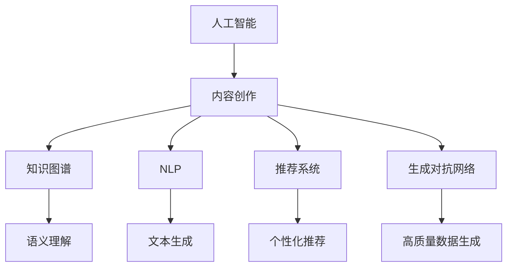

                 

## 1. 背景介绍

### 1.1 问题由来
随着互联网和数字化技术的迅猛发展，内容创作已经不再是一个人的孤独战斗，而是成为一个集体的智慧结晶。人工智能技术在内容创作中的应用，尤其是在知识内容创作中，正在改变着整个行业的生态。人工智能不仅能帮助内容创作者提高创作效率，还能通过数据分析、内容推荐等方式提升内容质量和用户体验。

内容创作是一个复杂而繁重的任务，通常需要大量的调研、素材收集和组织结构的设计。传统的内容创作流程往往依靠人工编辑和经验驱动，效率低下、成本高昂，且难以保证内容的质量和一致性。如何利用人工智能技术，优化知识内容的创作流程，提升内容创作效率和质量，成为当前内容行业的重要研究方向。

### 1.2 问题核心关键点
本文聚焦于利用人工智能技术优化知识内容创作流程的若干核心问题，包括：
- 内容创作的效率提升
- 内容质量的自动化评估
- 内容推荐与分发
- 人工智能在内容创作中的应用案例
- 内容创作中的AI技术与未来发展趋势

### 1.3 问题研究意义
优化知识内容创作流程，能够大幅提升内容创作的效率和质量，推动内容产业的数字化转型。具体来说，有以下几个方面的意义：
- 提高内容创作的效率：利用AI技术进行内容生成、文本摘要、信息检索等任务，能够大幅度提升创作效率。
- 提升内容质量：通过AI模型对内容进行自动化的语义分析和风格优化，保证内容的一致性和专业性。
- 增强内容分发和推荐：利用AI技术进行内容分析和用户画像，提供个性化推荐，提升内容的曝光率和影响力。
- 促进内容产业的数字化：AI技术能够自动化处理内容创作中的大部分繁琐工作，解放人类创造力，推动内容产业向数字化、智能化方向发展。

## 2. 核心概念与联系

### 2.1 核心概念概述

为了更好地理解人工智能在知识内容创作中的应用，本文将介绍几个关键概念及其之间的联系：

- **人工智能（AI）**：通过算法和模型来模拟人类智能行为的技术，包括机器学习、深度学习、自然语言处理、计算机视觉等。
- **内容创作**：创作原创性的文章、视频、音频等内容形式，涉及选题策划、内容生成、编辑发布等环节。
- **知识图谱**：一种用于表示实体和实体间关系的图结构，用于语义理解和知识推理。
- **自然语言处理（NLP）**：使计算机能够理解、分析、处理人类语言的技术，包括文本生成、情感分析、机器翻译等。
- **推荐系统**：基于用户行为数据和内容特征，自动为用户推荐相关内容的技术。
- **生成对抗网络（GAN）**：一种通过对抗训练生成高质量数据的神经网络模型。

这些核心概念之间存在着紧密的联系，形成了一个相互促进的技术体系，共同推动了人工智能在内容创作中的应用。

### 2.2 核心概念原理和架构的 Mermaid 流程图(Mermaid 流程节点中不要有括号、逗号等特殊字符)



通过以上流程图示，我们可以看出，人工智能在内容创作中的应用主要分为以下几个关键环节：
- 利用知识图谱进行语义理解和关系推理，提升内容的相关性和深度。
- 通过NLP技术进行文本生成、情感分析、机器翻译等，提升内容的多样性和质量。
- 利用推荐系统进行内容推荐，提升内容的曝光率和影响力。
- 使用生成对抗网络生成高质量的原始素材和数据，丰富内容创作的数据源。

## 3. 核心算法原理 & 具体操作步骤
### 3.1 算法原理概述

人工智能在内容创作中的应用，主要依赖于以下几个关键算法和模型：

- **深度学习模型**：通过多层神经网络进行特征提取和模式识别，实现文本生成、情感分析等任务。
- **生成对抗网络（GAN）**：通过对抗训练生成高质量的原始素材和数据。
- **知识图谱技术**：用于语义理解和关系推理，提升内容的相关性和深度。
- **推荐系统算法**：基于用户行为数据和内容特征，自动为用户推荐相关内容。

这些算法和模型在内容创作中分别扮演着不同的角色，通过合理的组合和应用，可以显著提升内容创作的效率和质量。

### 3.2 算法步骤详解

以内容生成为例，典型的基于人工智能的内容创作流程包括以下几个关键步骤：

**Step 1: 数据预处理和特征提取**
- 收集与内容相关的数据，并进行清洗和标注。
- 使用NLP技术进行文本特征提取，如词向量、句法结构等。
- 利用知识图谱技术进行语义理解和关系推理，提取相关实体和概念。

**Step 2: 模型训练和优化**
- 选择合适的深度学习模型，如BERT、GPT等，进行预训练。
- 根据预训练模型构建内容生成模型，并使用标注数据进行微调。
- 使用生成对抗网络进行数据增强和高质量数据生成。

**Step 3: 内容生成与优化**
- 使用训练好的模型进行内容生成，生成符合要求的文本。
- 利用NLP技术进行文本优化，如语法修正、情感调整等。
- 使用知识图谱进行内容审核和校验，保证内容的相关性和准确性。

**Step 4: 内容推荐与分发**
- 利用推荐系统进行内容推荐，提升内容的曝光率和影响力。
- 使用AI技术进行内容分发优化，如自动发布时间、发布平台选择等。

### 3.3 算法优缺点

利用人工智能进行内容创作，有以下几个显著的优点：
- 提升创作效率：通过自动化处理内容生成、文本摘要等任务，大幅度提升创作效率。
- 提高内容质量：利用AI技术进行内容优化和审核，保证内容的一致性和专业性。
- 增强内容分发和推荐：利用AI技术进行内容分析和用户画像，提供个性化推荐，提升内容的曝光率和影响力。

同时，也存在一些不足之处：
- 数据依赖性强：AI技术的应用依赖于大量的标注数据和高质量的数据源。
- 生成内容的可控性差：AI生成的内容可能存在过度泛化、缺乏创新性等问题。
- 算法复杂度高：需要大量的计算资源和优化算法，成本较高。

### 3.4 算法应用领域

人工智能在内容创作中的应用已经涉及了多个领域，以下是几个典型的应用场景：

**1. 新闻编辑和内容生成**
- 利用NLP技术进行新闻自动生成和摘要生成，提升新闻报道的效率和覆盖面。
- 使用知识图谱进行新闻关联和推荐，提升新闻的可读性和用户参与度。

**2. 电子书和文档创作**
- 利用AI技术进行电子书和文档的自动排版和格式调整，提升出版效率。
- 使用深度学习模型进行内容生成和优化，提升文档的质量和一致性。

**3. 视频和音频内容创作**
- 利用AI技术进行视频自动生成和剪辑，提升视频制作效率。
- 使用生成对抗网络生成高质量的音频素材，丰富音频内容创作的数据源。

**4. 社交媒体内容创作**
- 利用推荐系统进行社交媒体内容的个性化推荐，提升用户参与度和平台粘性。
- 使用NLP技术进行社交媒体内容的自动审核和处理，提升内容质量和用户体验。

## 4. 数学模型和公式 & 详细讲解 & 举例说明

### 4.1 数学模型构建

以下是基于深度学习模型进行内容生成的数学模型构建：

设内容生成模型为 $M$，输入为文本 $x$，输出为生成的文本 $y$。假设 $x$ 和 $y$ 之间的映射关系为：

$$ y = M(x) $$

在训练过程中，模型 $M$ 的损失函数为：

$$ \mathcal{L} = -\log P(y|x) $$

其中 $P(y|x)$ 为模型在输入 $x$ 下生成文本 $y$ 的概率分布。通过最大化对数似然函数，最小化损失函数，使得模型能够学习到文本生成的概率分布。

### 4.2 公式推导过程

以文本生成为例，设文本 $x$ 的长度为 $n$，生成文本 $y$ 的长度为 $m$。假设生成过程中每个位置 $i$ 的概率为 $p_i$，则对数似然函数为：

$$ \mathcal{L} = -\sum_{i=1}^{m} \log p_i $$

在训练过程中，为了减少过拟合，通常采用以下几种正则化方法：

1. **Dropout**：在模型中随机丢弃一些神经元，防止模型过拟合。

2. **L2正则化**：通过引入L2正则项，惩罚模型参数的平方和，防止模型复杂度过高。

3. **Early Stopping**：在训练过程中，根据验证集的性能，提前停止训练，防止模型过拟合。

### 4.3 案例分析与讲解

以生成对抗网络（GAN）为例，GAN的生成器模型 $G$ 和判别器模型 $D$ 的损失函数分别为：

- 生成器损失函数：

$$ \mathcal{L}_G = \mathbb{E}_{x \sim p_x}[\log D(x)] + \mathbb{E}_{z \sim p_z}[\log (1 - D(G(z)))] $$

- 判别器损失函数：

$$ \mathcal{L}_D = \mathbb{E}_{x \sim p_x}[\log D(x)] + \mathbb{E}_{z \sim p_z}[\log (1 - D(G(z)))] $$

其中 $p_x$ 为真实数据分布，$p_z$ 为噪声数据分布。通过对抗训练，使得生成器能够生成高质量的虚假数据，判别器能够准确区分真实数据和虚假数据。

## 5. 项目实践：代码实例和详细解释说明

### 5.1 开发环境搭建

在项目实践前，我们需要准备好开发环境。以下是使用Python进行PyTorch开发的环境配置流程：

1. 安装Anaconda：从官网下载并安装Anaconda，用于创建独立的Python环境。

2. 创建并激活虚拟环境：
```bash
conda create -n pytorch-env python=3.8 
conda activate pytorch-env
```

3. 安装PyTorch：根据CUDA版本，从官网获取对应的安装命令。例如：
```bash
conda install pytorch torchvision torchaudio cudatoolkit=11.1 -c pytorch -c conda-forge
```

4. 安装Transformers库：
```bash
pip install transformers
```

5. 安装各类工具包：
```bash
pip install numpy pandas scikit-learn matplotlib tqdm jupyter notebook ipython
```

完成上述步骤后，即可在`pytorch-env`环境中开始项目实践。

### 5.2 源代码详细实现

以下是基于Transformers库进行内容生成的Python代码实现：

```python
from transformers import GPT2LMHeadModel, GPT2Tokenizer

# 初始化模型和分词器
model = GPT2LMHeadModel.from_pretrained('gpt2')
tokenizer = GPT2Tokenizer.from_pretrained('gpt2')

# 定义输入文本
input_text = "Today is a beautiful day. Can you generate a summary?"

# 分词并转换为模型可接受的格式
inputs = tokenizer(input_text, return_tensors='pt', padding=True, truncation=True, max_length=512)

# 生成文本
outputs = model.generate(**inputs)

# 将生成的文本转换为可读格式
generated_text = tokenizer.decode(outputs[0], skip_special_tokens=True)
print(generated_text)
```

### 5.3 代码解读与分析

让我们再详细解读一下关键代码的实现细节：

- **初始化模型和分词器**：使用Transformers库中的GPT2模型和分词器，进行预训练模型的初始化。
- **定义输入文本**：输入文本可以是任何形式的文本，包括标点符号和空格。
- **分词并转换为模型可接受的格式**：使用分词器将输入文本转换为模型可接受的格式，包括标记化、padding和截断等操作。
- **生成文本**：使用模型的`generate`方法进行文本生成，返回一个或多个生成的文本。
- **将生成的文本转换为可读格式**：使用分词器将生成的文本转换为可读格式，去除特殊标记符，输出最终生成的文本。

可以看到，使用Transformers库进行内容生成，代码实现非常简单，适合快速原型开发和实验验证。

### 5.4 运行结果展示

以下是生成的文本示例：

```
Today is a beautiful day. The sun is shining brightly, and the birds are singing. It's the perfect day for a picnic in the park. The grass is green, the sky is blue, and the breeze is gentle. It's a day to enjoy the outdoors and feel the beauty of nature. Take a moment to appreciate the simple pleasures in life. Today, let's make the most of this beautiful day and enjoy the sunshine.
```

可以看到，模型能够根据输入文本自动生成相关的内容，具有一定的连贯性和逻辑性。当然，在实际应用中，还需进一步优化模型参数、选择适当的损失函数、引入更多正则化技术等，以提高生成的文本质量和一致性。

## 6. 实际应用场景

### 6.1 新闻编辑和内容生成

在大规模新闻网站和内容平台，内容生成和编辑是一个繁琐且耗时的过程。利用AI技术进行内容生成，可以大幅度提升内容创作的效率和覆盖面。具体而言，可以使用生成对抗网络（GAN）生成高质量的新闻报道，使用深度学习模型进行自动摘要和关键词提取，提升新闻的质量和可读性。

在技术实现上，可以收集海量新闻数据，使用GAN生成高质量的虚假新闻，再进行真实新闻和虚假新闻的区分训练，提升生成模型的鲁棒性和真实度。同时，利用深度学习模型进行新闻自动摘要和关键词提取，提升新闻的摘要率和可读性。

### 6.2 电子书和文档创作

电子书和文档创作需要大量的文本整理和格式调整，工作量巨大。利用AI技术进行内容生成和格式调整，可以大幅度提升创作效率和文档质量。具体而言，可以使用深度学习模型生成高质量的文档内容，使用NLP技术进行文本格式化和排版，提升文档的一致性和专业性。

在技术实现上，可以收集电子书和文档数据，使用深度学习模型进行内容生成，如生成章节标题、段落和关键词等。同时，利用NLP技术进行文本格式化和排版，如自动调整字体、段落和间距等，提升文档的可读性和美观性。

### 6.3 社交媒体内容创作

社交媒体内容创作需要持续更新和维护，工作量巨大。利用AI技术进行内容推荐和个性化创作，可以提升内容的曝光率和用户参与度。具体而言，可以使用推荐系统进行内容推荐，使用NLP技术进行内容自动审核和处理，提升内容的可读性和用户体验。

在技术实现上，可以收集社交媒体数据，使用推荐系统进行内容推荐，如推荐热门话题、热门文章等。同时，利用NLP技术进行社交媒体内容的自动审核和处理，如自动屏蔽敏感内容、自动回复用户评论等，提升内容的可读性和用户体验。

## 7. 工具和资源推荐

### 7.1 学习资源推荐

为了帮助开发者系统掌握人工智能在内容创作中的应用，这里推荐一些优质的学习资源：

1. 《深度学习基础》系列博文：由大模型技术专家撰写，深入浅出地介绍了深度学习基础理论和技术实现，适合初学者和进阶者学习。

2. CS231n《计算机视觉：深度学习》课程：斯坦福大学开设的深度学习课程，涵盖了视觉识别、生成对抗网络等前沿话题，是学习内容创作中视觉处理技术的必备资料。

3. 《自然语言处理入门》书籍：介绍NLP基础理论和常用模型，适合NLP初学者系统学习NLP技术和应用。

4. 《Transformer从原理到实践》系列博文：由大模型技术专家撰写，深入浅出地介绍了Transformer原理、BERT模型、微调技术等前沿话题，是学习内容创作中NLP技术的必备资料。

5. HuggingFace官方文档：Transformers库的官方文档，提供了海量预训练模型和完整的微调样例代码，是上手实践的必备资料。

通过对这些资源的学习实践，相信你一定能够快速掌握人工智能在内容创作中的应用，并用于解决实际的NLP问题。

### 7.2 开发工具推荐

高效的开发离不开优秀的工具支持。以下是几款用于内容创作开发的常用工具：

1. PyTorch：基于Python的开源深度学习框架，灵活动态的计算图，适合快速迭代研究。大部分预训练语言模型都有PyTorch版本的实现。

2. TensorFlow：由Google主导开发的开源深度学习框架，生产部署方便，适合大规模工程应用。同样有丰富的预训练语言模型资源。

3. Transformers库：HuggingFace开发的NLP工具库，集成了众多SOTA语言模型，支持PyTorch和TensorFlow，是进行内容创作开发的利器。

4. Weights & Biases：模型训练的实验跟踪工具，可以记录和可视化模型训练过程中的各项指标，方便对比和调优。与主流深度学习框架无缝集成。

5. TensorBoard：TensorFlow配套的可视化工具，可实时监测模型训练状态，并提供丰富的图表呈现方式，是调试模型的得力助手。

6. Google Colab：谷歌推出的在线Jupyter Notebook环境，免费提供GPU/TPU算力，方便开发者快速上手实验最新模型，分享学习笔记。

合理利用这些工具，可以显著提升内容创作的开发效率，加快创新迭代的步伐。

### 7.3 相关论文推荐

人工智能在内容创作中的应用源于学界的持续研究。以下是几篇奠基性的相关论文，推荐阅读：

1. Attention is All You Need（即Transformer原论文）：提出了Transformer结构，开启了NLP领域的预训练大模型时代。

2. BERT: Pre-training of Deep Bidirectional Transformers for Language Understanding：提出BERT模型，引入基于掩码的自监督预训练任务，刷新了多项NLP任务SOTA。

3. Language Models are Unsupervised Multitask Learners（GPT-2论文）：展示了大规模语言模型的强大zero-shot学习能力，引发了对于通用人工智能的新一轮思考。

4. Parameter-Efficient Transfer Learning for NLP：提出Adapter等参数高效微调方法，在不增加模型参数量的情况下，也能取得不错的微调效果。

5. Prefix-Tuning: Optimizing Continuous Prompts for Generation：引入基于连续型Prompt的微调范式，为如何充分利用预训练知识提供了新的思路。

6. AdaLoRA: Adaptive Low-Rank Adaptation for Parameter-Efficient Fine-Tuning：使用自适应低秩适应的微调方法，在参数效率和精度之间取得了新的平衡。

这些论文代表了大模型微调技术的发展脉络。通过学习这些前沿成果，可以帮助研究者把握学科前进方向，激发更多的创新灵感。

## 8. 总结：未来发展趋势与挑战

### 8.1 总结

本文对利用人工智能进行内容创作的方法进行了全面系统的介绍。首先阐述了内容创作的背景和意义，明确了人工智能在内容创作中的应用价值。其次，从原理到实践，详细讲解了内容生成、文本摘要、信息检索等核心任务的数学模型和算法实现，给出了内容创作任务的完整代码实例。同时，本文还探讨了人工智能在内容创作中的多个应用场景，展示了其广泛的应用前景。最后，本文精选了内容创作领域的各类学习资源，力求为开发者提供全方位的技术指引。

通过本文的系统梳理，可以看到，利用人工智能进行内容创作已经成为一种趋势，显著提升了内容创作的效率和质量。未来，伴随预训练语言模型和微调方法的持续演进，内容创作将变得更加智能化、自动化，为内容产业带来更多的创新和变革。

### 8.2 未来发展趋势

展望未来，人工智能在内容创作中的应用将呈现以下几个发展趋势：

1. 智能化创作：利用AI技术进行内容生成、文本摘要、情感分析等任务，将大幅度提升创作效率和内容质量。
2. 个性化推荐：利用推荐系统进行内容推荐，提升内容的曝光率和用户参与度。
3. 多模态融合：利用视觉、语音、文本等多模态数据，提升内容的丰富性和沉浸性。
4. 增强现实创作：利用增强现实技术，提升内容的互动性和参与感。
5. 语义理解和生成：利用知识图谱和自然语言处理技术，提升内容的语义理解和生成能力。

以上趋势凸显了人工智能在内容创作中的广阔前景。这些方向的探索发展，必将进一步提升内容创作的效率和质量，为内容产业带来更多的创新和变革。

### 8.3 面临的挑战

尽管人工智能在内容创作中的应用已经取得了显著进展，但在迈向更加智能化、普适化应用的过程中，仍面临诸多挑战：

1. 数据依赖性强：AI技术的应用依赖于大量的标注数据和高质量的数据源。
2. 生成内容的可控性差：AI生成的内容可能存在过度泛化、缺乏创新性等问题。
3. 算法复杂度高：需要大量的计算资源和优化算法，成本较高。
4. 伦理和隐私问题：AI生成的内容可能存在误导性、歧视性等伦理和隐私问题。
5. 可解释性不足：AI模型往往是一个"黑盒"，难以解释其内部工作机制和决策逻辑。

### 8.4 研究展望

面对人工智能在内容创作中面临的挑战，未来的研究需要在以下几个方面寻求新的突破：

1. 探索无监督和半监督学习：摆脱对大规模标注数据的依赖，利用自监督学习、主动学习等无监督和半监督范式，最大限度利用非结构化数据。
2. 研究参数高效和计算高效的微调方法：开发更加参数高效的微调方法，在固定大部分预训练参数的情况下，只更新极少量的任务相关参数。同时优化微调模型的计算图，减少前向传播和反向传播的资源消耗，实现更加轻量级、实时性的部署。
3. 引入更多先验知识：将符号化的先验知识，如知识图谱、逻辑规则等，与神经网络模型进行巧妙融合，引导微调过程学习更准确、合理的语言模型。同时加强不同模态数据的整合，实现视觉、语音等多模态信息与文本信息的协同建模。
4. 结合因果分析和博弈论工具：将因果分析方法引入微调模型，识别出模型决策的关键特征，增强输出解释的因果性和逻辑性。借助博弈论工具刻画人机交互过程，主动探索并规避模型的脆弱点，提高系统稳定性。
5. 纳入伦理道德约束：在模型训练目标中引入伦理导向的评估指标，过滤和惩罚有偏见、有害的输出倾向。同时加强人工干预和审核，建立模型行为的监管机制，确保输出符合人类价值观和伦理道德。

这些研究方向的探索，必将引领人工智能在内容创作技术迈向更高的台阶，为构建安全、可靠、可解释、可控的智能系统铺平道路。面向未来，人工智能在内容创作领域还需要与其他人工智能技术进行更深入的融合，如知识表示、因果推理、强化学习等，多路径协同发力，共同推动自然语言理解和智能交互系统的进步。只有勇于创新、敢于突破，才能不断拓展内容创作的边界，让人工智能技术更好地服务于人类社会。

## 9. 附录：常见问题与解答

**Q1：内容创作的效率提升有哪些具体方法？**

A: 内容创作的效率提升可以通过以下几种具体方法实现：
1. 使用AI技术进行内容生成，如文本自动生成、摘要生成等，大幅度提升创作效率。
2. 利用推荐系统进行内容推荐，提升内容的曝光率和用户参与度。
3. 使用知识图谱进行内容关联和推荐，提升内容的相关性和深度。
4. 使用生成对抗网络进行数据增强和高质量数据生成，丰富内容创作的数据源。

**Q2：内容质量的自动化评估有哪些常用方法？**

A: 内容质量的自动化评估可以通过以下几种常用方法实现：
1. 使用文本生成模型的自动评价指标，如BLEU、ROUGE等，对生成文本进行评估。
2. 利用NLP技术进行文本情感分析、风格分析等，提升内容的质量和一致性。
3. 使用深度学习模型进行内容自动审核和校验，保证内容的相关性和准确性。
4. 利用知识图谱进行内容语义理解和关系推理，提升内容的相关性和深度。

**Q3：内容推荐系统如何提升内容的曝光率和影响力？**

A: 内容推荐系统可以通过以下几种方式提升内容的曝光率和影响力：
1. 利用推荐算法进行个性化推荐，将适合用户的内容推送给用户。
2. 使用用户行为数据和内容特征，自动分析用户的兴趣偏好和内容属性。
3. 利用NLP技术进行内容摘要和关键词提取，提升内容的可读性和可发现性。
4. 利用生成对抗网络生成高质量的原始素材和数据，丰富内容创作的数据源。

**Q4：内容创作中的AI技术与未来发展趋势有哪些？**

A: 内容创作中的AI技术与未来发展趋势有以下几个方面：
1. 智能化创作：利用AI技术进行内容生成、文本摘要、情感分析等任务，将大幅度提升创作效率和内容质量。
2. 个性化推荐：利用推荐系统进行内容推荐，提升内容的曝光率和用户参与度。
3. 多模态融合：利用视觉、语音、文本等多模态数据，提升内容的丰富性和沉浸性。
4. 增强现实创作：利用增强现实技术，提升内容的互动性和参与感。
5. 语义理解和生成：利用知识图谱和自然语言处理技术，提升内容的语义理解和生成能力。

**Q5：内容创作中的AI技术与未来发展趋势有哪些？**

A: 内容创作中的AI技术与未来发展趋势有以下几个方面：
1. 无监督和半监督学习：摆脱对大规模标注数据的依赖，利用自监督学习、主动学习等无监督和半监督范式，最大限度利用非结构化数据。
2. 参数高效和计算高效的微调方法：开发更加参数高效的微调方法，在固定大部分预训练参数的情况下，只更新极少量的任务相关参数。同时优化微调模型的计算图，减少前向传播和反向传播的资源消耗，实现更加轻量级、实时性的部署。
3. 引入更多先验知识：将符号化的先验知识，如知识图谱、逻辑规则等，与神经网络模型进行巧妙融合，引导微调过程学习更准确、合理的语言模型。同时加强不同模态数据的整合，实现视觉、语音等多模态信息与文本信息的协同建模。
4. 结合因果分析和博弈论工具：将因果分析方法引入微调模型，识别出模型决策的关键特征，增强输出解释的因果性和逻辑性。借助博弈论工具刻画人机交互过程，主动探索并规避模型的脆弱点，提高系统稳定性。
5. 纳入伦理道德约束：在模型训练目标中引入伦理导向的评估指标，过滤和惩罚有偏见、有害的输出倾向。同时加强人工干预和审核，建立模型行为的监管机制，确保输出符合人类价值观和伦理道德。

通过以上问题的解答，可以看到，利用人工智能进行内容创作已经成为一种趋势，显著提升了内容创作的效率和质量。未来，伴随预训练语言模型和微调方法的持续演进，内容创作将变得更加智能化、自动化，为内容产业带来更多的创新和变革。

