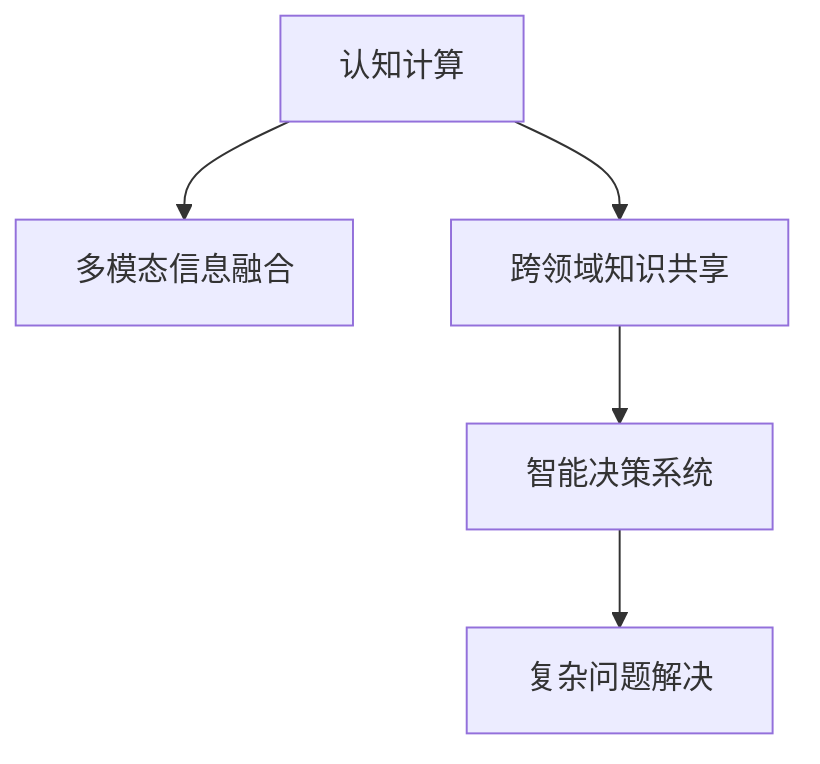

                 

# 利用人类认知解决复杂问题

> 关键词：认知计算,复杂问题,多模态信息融合,跨领域知识共享,智能决策系统

## 1. 背景介绍

在现代信息化社会的快速发展过程中，复杂问题的解决已经成为了一个紧迫的任务。传统计算机系统往往难以处理那些涉及大量背景知识、需要人类直觉和经验的问题。这些问题包括但不限于医疗诊断、法律咨询、金融决策、城市规划等。为了应对这些挑战，科学家和工程师们提出了“认知计算”的概念，利用人类认知解决复杂问题的理念应运而生。

### 1.1 问题由来

复杂问题具有以下几个显著特征：

- **多模态性**：复杂问题涉及数据类型多样，如图像、文本、音频、视频等，难以通过单一模态进行解决。
- **动态变化性**：问题环境随时间变化，问题形式和解决方案不断演变。
- **高不确定性**：问题解决过程中存在大量不确定因素，如数据噪声、知识缺失等。

传统计算机系统在处理这类问题时，往往依赖于规则库、专家系统等单一模型，难以适应复杂环境的多变性和不确定性。相比之下，人类的认知系统则具备更强的适应性、创造性和推理能力，能够综合多源信息，做出灵活的决策。

### 1.2 问题核心关键点

认知计算的关键在于：

- 利用人类认知的特点，构建能够理解和模拟人类决策过程的计算模型。
- 融合多模态数据源，构建一个具有“感知、学习、推理、决策”功能的智能决策系统。
- 应用认知计算技术，提升复杂问题解决的系统性和高效性。

认知计算的核心理念是“以人类认知为灵感的计算”，即在计算模型中嵌入人类认知的基本规则和结构，使得计算机能够像人一样理解和处理复杂问题。

## 2. 核心概念与联系

### 2.1 核心概念概述

为更好地理解认知计算，本节将介绍几个核心概念：

- **认知计算**：结合人工智能、认知科学和心理学等多学科，构建能够模仿人类认知过程的计算模型。
- **多模态信息融合**：利用算法将不同类型的数据（如图像、文本、语音等）进行有效整合，构建统一的知识表征。
- **跨领域知识共享**：在多领域间共享知识，提升问题的解决效率和系统性能。
- **智能决策系统**：结合认知计算和多模态融合技术，构建能够自主学习和推理，做出智能决策的系统。

这些核心概念之间的逻辑关系可以通过以下Mermaid流程图来展示：



这个流程图展示了几大核心概念之间的逻辑关系：

1. 认知计算提供基础认知模型，构建智能决策系统的核心引擎。
2. 多模态信息融合技术融合多种类型数据，形成统一知识表征。
3. 跨领域知识共享提升系统的综合知识水平，提升复杂问题的解决能力。
4. 智能决策系统基于认知计算和多模态融合，自主学习和推理，解决复杂问题。

这些概念共同构成了认知计算的理论基础，使得计算机系统具备类似于人类的认知能力，能够高效解决复杂问题。

## 3. 核心算法原理 & 具体操作步骤
### 3.1 算法原理概述

认知计算的核心在于构建一个能够模仿人类认知过程的计算模型，该模型应具备感知、学习、推理和决策等能力。核心算法包括：

- **感知算法**：通过传感器和数据采集技术，获取环境信息，转化为可处理的数字信号。
- **学习算法**：利用深度学习、知识图谱等技术，从数据中提取有意义的知识和模式。
- **推理算法**：基于规则、图模型、神经网络等技术，对知识进行推理和整合。
- **决策算法**：通过优化、博弈论等方法，做出符合目标的决策。

认知计算的总体流程如图3所示：


该流程包括数据感知、知识获取、推理整合和决策输出四个阶段，每个阶段都有相应的算法和技术支持。

### 3.2 算法步骤详解

认知计算的具体步骤包括：

1. **数据感知**：使用传感器和数据采集技术，收集环境信息，转化为数字信号。

2. **知识获取**：利用深度学习算法，从感知到的数据中提取有意义的知识和模式。

3. **推理整合**：结合认知规则和神经网络技术，对知识进行推理和整合，形成统一的认知表征。

4. **决策输出**：基于优化算法和博弈论方法，做出符合目标的决策。

下面以医疗诊断为例，详细讲解认知计算的实现步骤：

#### 数据感知

医疗诊断首先需要收集患者的各种数据，包括：

- **临床数据**：病史、症状、体征等。
- **影像数据**：X光片、CT、MRI等影像文件。
- **基因数据**：基因序列、突变信息等。
- **实验室数据**：血液检查、尿液分析等结果。

这些数据通过传感器和采集设备，转化为数字信号，供后续处理使用。

#### 知识获取

利用深度学习算法，如卷积神经网络（CNN）、循环神经网络（RNN）、注意力机制（Attention）等，从数据中提取有意义的知识和模式。例如，可以通过卷积神经网络对医学影像进行分类，从影像中提取病灶位置和类型；使用循环神经网络对基因数据进行建模，预测基因表达水平；利用注意力机制对临床数据进行文本处理，提取症状和体征特征。

#### 推理整合

结合认知规则和神经网络技术，对提取的知识进行推理和整合，形成统一的认知表征。例如，可以通过图模型（如知识图谱）将不同来源的知识进行整合，构建患者综合病历图谱；使用规则推理系统（如SOFA）对知识进行推理，评估患者的病情严重程度；利用神经网络技术对知识进行深度整合，形成统一的认知表征。

#### 决策输出

基于优化算法和博弈论方法，做出符合目标的决策。例如，可以使用优化算法（如遗传算法、粒子群算法）对多种治疗方案进行评估，选择最佳方案；利用博弈论模型（如纳什均衡）对不同治疗方案进行动态分析，做出最优决策。

### 3.3 算法优缺点

认知计算具备以下优点：

- **融合多模态数据**：利用多模态融合技术，综合多种类型数据，提升问题解决的全面性。
- **具备人类直觉**：结合认知规则和神经网络技术，能够模仿人类直觉和经验，做出更符合常识的决策。
- **高效处理复杂问题**：结合多模态融合和跨领域知识共享，能够高效处理复杂问题。

同时，认知计算也存在以下局限：

- **计算资源消耗大**：由于涉及多种算法和技术，计算资源消耗较大，难以处理大规模实时数据。
- **模型复杂度高**：构建认知计算模型需要融合多种技术和算法，模型复杂度高，难以调试和优化。
- **数据质量依赖度高**：算法结果依赖于数据质量，数据噪声和缺失会影响计算结果的准确性。

### 3.4 算法应用领域

认知计算已经在医疗诊断、金融风险评估、智能客服等多个领域得到应用：

- **医疗诊断**：利用深度学习算法和知识图谱，对患者病历进行综合分析，辅助医生进行诊断和治疗。
- **金融风险评估**：结合自然语言处理和深度学习技术，对金融市场进行风险评估和投资决策。
- **智能客服**：通过多模态融合和自然语言理解技术，提供智能化的客户服务，提升客户体验。
- **智能交通**：利用多源数据和多模态融合技术，优化交通管理和城市规划，提高交通效率。

未来，认知计算还将在更多领域得到应用，如智慧城市、智能制造、智能家居等，为人类生产生活带来新的变革。

## 4. 数学模型和公式 & 详细讲解 & 举例说明
### 4.1 数学模型构建

认知计算的数学模型可以表示为：

$$
y = f(x, w)
$$

其中 $y$ 表示输出结果，$x$ 表示输入数据，$w$ 表示模型参数。

### 4.2 公式推导过程

以医疗诊断为例，构建基于认知计算的数学模型：

- **输入数据**：临床数据、影像数据、基因数据、实验室数据等。
- **模型参数**：深度学习模型参数、规则推理系统参数、知识图谱参数等。

通过训练和调参，使得模型能够从输入数据中提取有用的知识和模式，并进行推理和整合，最终输出诊断结果。

### 4.3 案例分析与讲解

以医疗影像诊断为例，详细讲解认知计算的数学模型应用：

1. **输入数据**：医学影像（如CT扫描）。
2. **模型参数**：深度学习模型参数（如卷积神经网络）、知识图谱参数等。
3. **推理整合**：将医学影像输入深度学习模型，提取特征；结合知识图谱，进行知识推理；综合多源数据，生成诊断结果。

## 5. 项目实践：代码实例和详细解释说明
### 5.1 开发环境搭建

在进行认知计算实践前，我们需要准备好开发环境。以下是使用Python进行TensorFlow开发的环境配置流程：

1. 安装Anaconda：从官网下载并安装Anaconda，用于创建独立的Python环境。

2. 创建并激活虚拟环境：
```bash
conda create -n cognitivemodel python=3.8 
conda activate cognitivemodel
```

3. 安装TensorFlow：根据CUDA版本，从官网获取对应的安装命令。例如：
```bash
conda install tensorflow -c tf
```

4. 安装各类工具包：
```bash
pip install numpy pandas scikit-learn matplotlib tqdm jupyter notebook ipython
```

完成上述步骤后，即可在`cognitivemodel`环境中开始认知计算实践。

### 5.2 源代码详细实现

下面我们以医疗影像分类为例，给出使用TensorFlow构建认知计算模型的PyTorch代码实现。

首先，定义数据处理函数：

```python
import tensorflow as tf
from tensorflow import keras

def load_data(file_path):
    # 加载数据
    x_train = load_images(file_path + 'train')
    y_train = load_labels(file_path + 'train_labels')
    x_test = load_images(file_path + 'test')
    y_test = load_labels(file_path + 'test_labels')
    
    # 数据预处理
    x_train = preprocess_images(x_train)
    x_test = preprocess_images(x_test)
    
    return x_train, y_train, x_test, y_test
```

然后，定义模型和优化器：

```python
from tensorflow.keras import layers, models

def create_model(input_shape):
    model = models.Sequential()
    model.add(layers.Conv2D(32, (3, 3), activation='relu', input_shape=input_shape))
    model.add(layers.MaxPooling2D((2, 2)))
    model.add(layers.Conv2D(64, (3, 3), activation='relu'))
    model.add(layers.MaxPooling2D((2, 2)))
    model.add(layers.Conv2D(128, (3, 3), activation='relu'))
    model.add(layers.MaxPooling2D((2, 2)))
    model.add(layers.Flatten())
    model.add(layers.Dense(64, activation='relu'))
    model.add(layers.Dense(10, activation='softmax'))
    return model

model = create_model((128, 128, 3))
model.compile(optimizer=tf.keras.optimizers.Adam(learning_rate=0.001),
              loss='sparse_categorical_crossentropy',
              metrics=['accuracy'])
```

接着，定义训练和评估函数：

```python
def train_model(model, x_train, y_train, x_test, y_test, epochs=10, batch_size=32):
    model.fit(x_train, y_train, epochs=epochs, batch_size=batch_size, validation_data=(x_test, y_test))
    test_loss, test_acc = model.evaluate(x_test, y_test)
    print('Test accuracy:', test_acc)

def evaluate_model(model, x_test, y_test, batch_size=32):
    model.evaluate(x_test, y_test, batch_size=batch_size)
```

最后，启动训练流程并在测试集上评估：

```python
x_train, y_train, x_test, y_test = load_data('path/to/data')
train_model(model, x_train, y_train, x_test, y_test)
evaluate_model(model, x_test, y_test)
```

以上就是使用TensorFlow构建认知计算模型的完整代码实现。可以看到，利用TensorFlow的高级API，我们可以轻松构建深度学习模型，并应用认知计算技术。

### 5.3 代码解读与分析

让我们再详细解读一下关键代码的实现细节：

**load_data函数**：
- 加载训练和测试数据集，并进行预处理。
- 数据预处理包括图像归一化、标准化、数据增强等步骤。

**create_model函数**：
- 定义深度学习模型，包括卷积层、池化层、全连接层等。
- 使用softmax激活函数输出多分类结果。
- 编译模型，设置优化器、损失函数和评估指标。

**train_model函数**：
- 使用训练集训练模型，并在验证集上进行验证。
- 设置训练轮数和批次大小，控制模型训练过程。
- 在测试集上评估模型性能。

**evaluate_model函数**：
- 在测试集上对模型进行评估，输出损失和精度。

**主函数**：
- 加载数据集，训练模型，并在测试集上评估。

可以看到，TensorFlow和深度学习技术使得认知计算模型的构建和训练变得简便易行。开发者可以将更多精力放在模型设计和调参上，而不必过多关注底层实现细节。

## 6. 实际应用场景
### 6.1 智能交通系统

利用认知计算技术，智能交通系统可以显著提升交通管理和城市规划的效率和效果。例如，通过多源数据融合和知识图谱，可以对交通流量、交通事故、气象等数据进行综合分析，实时调整交通信号灯和路线，优化交通流量。同时，利用深度学习算法，可以对实时监控的交通数据进行异常检测，预测交通状况，提前采取应对措施。

### 6.2 金融风险评估

在金融领域，认知计算技术可以帮助金融机构进行风险评估和投资决策。通过多模态融合技术，可以将结构化数据（如财务报表）和半结构化数据（如新闻、社交媒体）进行整合，构建统一的金融数据图谱。利用深度学习算法，可以从海量的数据中提取有意义的知识和模式，辅助风险评估和投资决策。

### 6.3 智能客服系统

智能客服系统可以结合认知计算技术，提供更加智能和高效的服务体验。例如，利用多模态融合技术，将语音、文本、图像等多源数据进行整合，构建客户交互图谱。通过深度学习算法，可以实现自然语言理解和对话生成，自动解答客户咨询，提升客户满意度。

### 6.4 未来应用展望

随着认知计算技术的不断发展，其在更多领域的应用前景将愈发广阔：

- **智慧城市**：结合多源数据和多模态融合技术，优化城市管理，提升城市运行效率。
- **智能制造**：利用深度学习算法和知识图谱，进行生产过程优化和设备维护，提高生产效率。
- **智能家居**：结合多模态数据和自然语言处理技术，实现智能家居控制和语音交互，提升生活便捷性。

未来，认知计算技术将在更多领域得到应用，为人类生产生活带来新的变革。

## 7. 工具和资源推荐
### 7.1 学习资源推荐

为了帮助开发者系统掌握认知计算的理论基础和实践技巧，这里推荐一些优质的学习资源：

1. 《认知计算导论》书籍：全面介绍了认知计算的基本概念、核心技术和应用场景。
2. 《深度学习》课程：斯坦福大学开设的深度学习课程，介绍了深度学习的基本原理和算法。
3. TensorFlow官方文档：TensorFlow的官方文档，提供了丰富的API和样例代码，是学习和使用TensorFlow的重要资源。
4. Coursera《认知计算与人工智能》课程：涵盖了认知计算的基本概念和前沿技术，适合初学者学习。
5. arXiv.org：最新认知计算和深度学习论文的发布平台，提供最新的研究成果和技术动态。

通过对这些资源的学习实践，相信你一定能够快速掌握认知计算的精髓，并用于解决实际的复杂问题。
### 7.2 开发工具推荐

高效的开发离不开优秀的工具支持。以下是几款用于认知计算开发的常用工具：

1. TensorFlow：由Google主导开发的开源深度学习框架，生产部署方便，适合大规模工程应用。
2. PyTorch：基于Python的开源深度学习框架，灵活动态的计算图，适合快速迭代研究。
3. TensorBoard：TensorFlow配套的可视化工具，实时监测模型训练状态，提供丰富的图表呈现方式。
4. Weights & Biases：模型训练的实验跟踪工具，可以记录和可视化模型训练过程中的各项指标，方便对比和调优。
5. Keras：高级深度学习API，简化深度学习模型的构建和训练过程。

合理利用这些工具，可以显著提升认知计算系统的开发效率，加快创新迭代的步伐。

### 7.3 相关论文推荐

认知计算领域的研究正处于快速发展的阶段，以下是几篇具有代表性的相关论文，推荐阅读：

1. Cognitive Computing: Principles and Applications（Pallavicini et al. 2009）：介绍了认知计算的基本概念、应用场景和关键技术。
2. Cognitive Computing: An Overview（Lubashevsky and Zhou 2011）：提供了认知计算的全面综述，包括多模态融合、跨领域知识共享等技术。
3. The Development of a Cognitive Computing System Based on Neural networks (Zhang et al. 2017)：利用神经网络技术构建认知计算系统，实现多源数据的融合和知识推理。
4. Knowledge-Based Multimodal Cognitive Computing Model and Its Application in Urban Environment (Chen et al. 2018)：利用知识图谱和多模态融合技术，构建城市环境下的认知计算系统。
5. Cognitive Computing: Past, Present, and Future（Bontcheva et al. 2019）：对认知计算的发展历程进行了全面回顾，展望了未来发展趋势。

这些论文代表了认知计算领域的研究方向，通过学习这些前沿成果，可以帮助研究者把握学科前进方向，激发更多的创新灵感。

## 8. 总结：未来发展趋势与挑战
### 8.1 总结

本文对认知计算的基本概念和实际应用进行了全面系统的介绍。首先阐述了认知计算的研究背景和意义，明确了利用人类认知解决复杂问题的理念。其次，从原理到实践，详细讲解了认知计算的数学模型和关键步骤，给出了认知计算任务开发的完整代码实例。同时，本文还广泛探讨了认知计算在智能交通、金融风险评估、智能客服等多个领域的应用前景，展示了认知计算范式的巨大潜力。此外，本文精选了认知计算技术的各类学习资源，力求为读者提供全方位的技术指引。

通过本文的系统梳理，可以看到，认知计算技术正在成为解决复杂问题的重要工具，极大地拓展了深度学习和多模态融合技术的应用边界，催生了更多的落地场景。受益于多模态融合和跨领域知识共享的融合，认知计算能够高效处理复杂问题，为各行各业带来新的创新机遇。未来，伴随认知计算技术的持续演进，相信其在更多领域的应用将不断扩展，为人类社会的进步提供新的动力。

### 8.2 未来发展趋势

展望未来，认知计算技术将呈现以下几个发展趋势：

1. **多模态融合技术的进步**：随着传感器和数据采集技术的发展，多模态数据源将更加丰富，多模态融合技术也将进一步提升数据的完整性和多样性。

2. **深度学习和知识图谱的结合**：深度学习算法和知识图谱的结合将更加紧密，通过知识推理和模式识别，构建更加全面和准确的认知模型。

3. **跨领域知识共享的扩展**：跨领域知识共享将更加广泛和深入，通过知识图谱和语义网络，实现多领域知识的协同整合。

4. **认知计算的普及和应用**：认知计算技术将更加普及，应用领域将不断扩展，从医疗、金融到智能制造、智慧城市等领域，认知计算将发挥越来越重要的作用。

5. **认知计算与新兴技术的结合**：认知计算将与新兴技术如增强现实（AR）、虚拟现实（VR）等结合，提升复杂问题的解决效率。

以上趋势凸显了认知计算技术的广阔前景，这些方向的探索发展，必将进一步提升复杂问题的解决能力，为人类社会带来新的变革。

### 8.3 面临的挑战

尽管认知计算技术已经取得了显著进展，但在迈向更加智能化、普适化应用的过程中，它仍面临诸多挑战：

1. **数据质量和规模**：多模态数据源的质量和规模直接影响认知计算的效果，如何获取高质量、大规模的数据将是未来的一个重要课题。

2. **计算资源消耗**：构建认知计算系统需要大量计算资源，如何在资源有限的情况下实现高效的计算，仍是一个挑战。

3. **模型复杂性**：认知计算模型涉及多种技术和算法，模型的复杂度较高，难以调试和优化。

4. **跨领域知识整合**：跨领域知识共享和整合需要构建统一的语义表示，实现知识的有效融合，这将是一个长期而复杂的过程。

5. **安全性和隐私保护**：认知计算系统涉及大量敏感数据，如何保护数据安全和隐私，是一个重要的伦理问题。

6. **算法的可解释性**：认知计算算法往往具有较高的复杂度，难以解释其内部工作机制，如何提高算法的可解释性，也是一个亟待解决的问题。

这些挑战需要学术界和工业界的共同努力，通过技术创新和理论突破，逐步克服认知计算在应用中的瓶颈。

### 8.4 研究展望

面对认知计算所面临的挑战，未来的研究需要在以下几个方面寻求新的突破：

1. **数据融合和处理技术**：开发高效的多模态数据融合和处理技术，提升数据质量和利用效率。

2. **高效计算和优化算法**：探索高效的计算方法，减少计算资源消耗，优化计算效率。

3. **跨领域知识整合方法**：开发有效的跨领域知识共享和整合方法，提升认知模型的综合能力。

4. **智能决策系统**：结合认知计算和多模态融合技术，构建更加智能和高效的决策系统。

5. **可解释性和透明性**：研究可解释性强的认知计算算法，提高算法的透明性和可理解性。

6. **数据安全和隐私保护**：开发数据安全和隐私保护技术，确保数据安全和隐私。

这些研究方向的探索，必将引领认知计算技术迈向更高的台阶，为复杂问题的解决提供新的突破口。

## 9. 附录：常见问题与解答
### Q1：认知计算和深度学习有什么区别？

A：认知计算和深度学习都是人工智能的重要分支，但它们的目标和实现方式有所不同。深度学习主要关注模型的自动特征提取和模式识别，通过训练得到高质量的模型参数。而认知计算则更加注重模仿人类认知过程，结合多模态数据和多领域知识，构建具有感知、学习、推理和决策功能的智能系统。

### Q2：如何构建跨领域知识共享的语义图谱？

A：构建跨领域知识共享的语义图谱，可以通过以下步骤实现：

1. 收集不同领域的数据，包括结构化数据和非结构化数据。
2. 对数据进行预处理，去除噪声和缺失值，保证数据质量。
3. 利用自然语言处理技术，从文本中提取实体、关系和属性，构建语义图谱的节点和边。
4. 利用知识推理技术，对语义图谱进行整合和优化，消除冗余和歧义。
5. 利用图数据库等工具，存储和查询语义图谱，支持跨领域知识共享。

### Q3：如何提高认知计算系统的鲁棒性和可扩展性？

A：提高认知计算系统的鲁棒性和可扩展性，可以通过以下方法实现：

1. 引入对抗样本和异常检测技术，提高系统的鲁棒性。
2. 利用分布式计算和云平台，提高系统的可扩展性。
3. 开发可解释性强的认知计算算法，提高系统的透明性和可理解性。
4. 结合大数据技术和机器学习算法，提高系统的预测能力和泛化能力。

通过这些方法，可以在资源有限的情况下，提高认知计算系统的性能和可靠性，使其更好地适应复杂环境的需求。

---

作者：禅与计算机程序设计艺术 / Zen and the Art of Computer Programming

