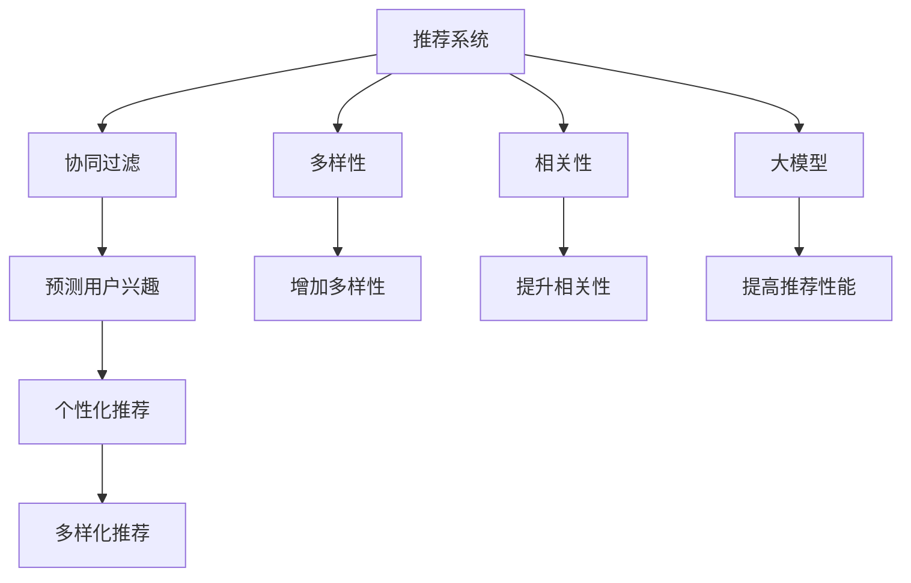
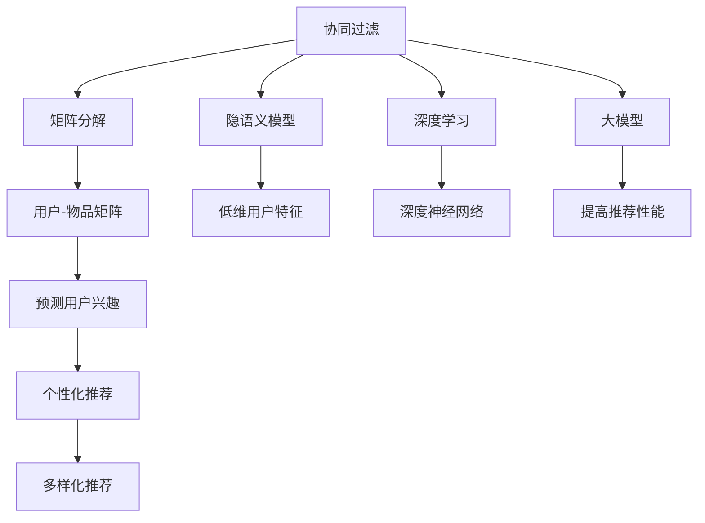

                 

# 利用大模型优化推荐系统的多样性与相关性平衡

> 关键词：推荐系统、多样性、相关性、大模型、协同过滤、深度学习、Transformer

## 1. 背景介绍

### 1.1 问题由来

随着互联网和移动互联网的发展，推荐系统已成为各大电商、视频、社交等平台的核心功能之一。用户在一个平台上浏览的频率越高，对推荐系统的依赖度也越高。推荐系统不仅要通过个性化推荐满足用户个性化需求，还要尽可能推荐丰富多样的商品和服务，使用户有更多选择的可能。

然而，个性化推荐算法往往过于追求相关性而忽视了推荐内容的多样性，使得用户逐渐陷入所谓的“信息茧房”，难以跳出固定兴趣的范围。这对用户的长期体验和平台的用户粘性都有不利影响。

推荐系统中的多样性与相关性平衡问题，成为了当前推荐算法的重要研究方向。本文将从基于大模型的协同过滤推荐算法入手，探讨如何利用大模型提高推荐系统的多样性与相关性平衡能力，为未来的推荐算法研究提供有益的参考。

### 1.2 问题核心关键点

为了更好地理解大模型在推荐系统中的应用，本节将介绍几个密切相关的核心概念：

- 推荐系统(Recommender System)：根据用户历史行为、偏好、兴趣等信息，预测用户可能感兴趣的物品，并进行推荐的系统。
- 协同过滤(Collaborative Filtering)：利用用户-物品交互记录，预测用户可能感兴趣的新物品，是推荐系统中最常用的方法。
- 多样性(Diversity)：指推荐系统推荐结果中不同物品的比例，关注推荐的丰富程度。
- 相关性(Relevance)：指推荐结果与用户实际需求的匹配程度，关注推荐的准确度。
- 大模型(如BERT、GPT、XLNet等)：通过在大规模无标签文本数据上进行预训练，学习丰富的语言知识，可以应用于文本推荐场景。

这些核心概念之间的逻辑关系可以通过以下Mermaid流程图来展示：



这个流程图展示了大模型的协同过滤推荐算法的基本流程：

1. 协同过滤算法根据用户历史行为预测用户兴趣。
2. 多样性策略增加推荐结果的丰富性。
3. 相关性策略提升推荐结果的准确性。
4. 大模型通过预训练和微调提高推荐性能。

这些概念共同构成了推荐系统的基础架构，使得推荐算法能够高效地推荐用户感兴趣的多样化物品。

## 2. 核心概念与联系

### 2.1 核心概念概述

为更好地理解基于大模型的协同过滤推荐算法，本节将介绍几个密切相关的核心概念：

- 协同过滤(Collaborative Filtering, CF)：利用用户-物品交互记录，通过相似性度量预测用户可能感兴趣的新物品。
- 多样性(Diversity)：指推荐结果中不同物品的比例，关注推荐的丰富程度。
- 相关性(Relevance)：指推荐结果与用户实际需求的匹配程度，关注推荐的准确度。
- 大模型(如BERT、GPT、XLNet等)：通过在大规模无标签文本数据上进行预训练，学习丰富的语言知识，可以应用于文本推荐场景。
- 协同过滤中的矩阵分解和隐语义模型：矩阵分解方法(如SVD)和隐语义模型(如ALS)，是协同过滤算法的经典实现方式。
- 基于深度学习的推荐系统：利用深度神经网络对用户行为和物品特征进行建模，是当前推荐系统的主流方法。

这些核心概念之间的逻辑关系可以通过以下Mermaid流程图来展示：



这个流程图展示了协同过滤推荐算法的基本流程：

1. 协同过滤算法通过用户-物品矩阵分解或隐语义模型预测用户兴趣。
2. 基于深度学习的推荐系统利用深度神经网络对用户行为和物品特征进行建模。
3. 大模型通过预训练和微调提高推荐性能。

这些概念共同构成了协同过滤推荐算法的基本框架，使得推荐算法能够高效地推荐用户感兴趣的多样化物品。

## 3. 核心算法原理 & 具体操作步骤
### 3.1 算法原理概述

基于大模型的协同过滤推荐算法，本质上是通过预训练和微调提高模型的泛化能力和理解能力，从而提升推荐系统的多样性与相关性平衡能力。其核心思想是：将预训练语言模型作为用户-物品交互的“中间层”，通过微调学习用户行为与物品特征之间的复杂非线性关系，进而生成更加多样化和相关性更高的推荐结果。

形式化地，假设用户与物品的交互矩阵为 $X$，物品的特征向量为 $I$，用户的特征向量为 $U$。基于大模型的协同过滤推荐算法如下：

1. 预训练语言模型 $M_{\theta}$ 作为特征提取器，将物品特征 $I$ 和用户特征 $U$ 映射为语义表示 $H$。
2. 通过微调更新模型参数 $\theta$，使得 $H$ 更好地表达用户-物品交互的复杂关系。
3. 计算 $H$ 在物品特征空间中的表示 $Z$，即 $Z=W_{item}^TH$，其中 $W_{item}$ 为物品特征向量与语义表示的映射矩阵。
4. 计算用户对物品的兴趣预测 $\hat{R}$，即 $\hat{R}=U^TZ$，其中 $U$ 为用户特征向量与语义表示的映射矩阵。
5. 根据 $\hat{R}$ 对物品进行排序，选择相关性最高的物品作为推荐结果。

### 3.2 算法步骤详解

基于大模型的协同过滤推荐算法具体步骤如下：

**Step 1: 准备预训练模型和数据集**
- 选择合适的预训练语言模型 $M_{\theta}$ 作为特征提取器，如 BERT、GPT、XLNet 等。
- 准备推荐系统的用户-物品交互矩阵 $X$，并将其划分为训练集、验证集和测试集。

**Step 2: 添加任务适配层**
- 根据推荐系统任务，设计合适的输出层和损失函数。
- 对于推荐任务，通常使用交叉熵损失函数，用于衡量预测值与真实值之间的差异。

**Step 3: 设置微调超参数**
- 选择合适的优化算法及其参数，如 Adam、SGD 等，设置学习率、批大小、迭代轮数等。
- 设置正则化技术及强度，包括权重衰减、Dropout、Early Stopping 等。
- 确定冻结预训练参数的策略，如仅微调顶层，或全部参数都参与微调。

**Step 4: 执行梯度训练**
- 将训练集数据分批次输入模型，前向传播计算损失函数。
- 反向传播计算参数梯度，根据设定的优化算法和学习率更新模型参数。
- 周期性在验证集上评估模型性能，根据性能指标决定是否触发 Early Stopping。
- 重复上述步骤直到满足预设的迭代轮数或 Early Stopping 条件。

**Step 5: 测试和部署**
- 在测试集上评估微调后模型 $M_{\hat{\theta}}$ 的性能，对比微调前后的推荐效果。
- 使用微调后的模型对新用户进行推荐，集成到实际的应用系统中。
- 持续收集新的用户行为数据，定期重新微调模型，以适应数据分布的变化。

以上是基于大模型的协同过滤推荐算法的一般流程。在实际应用中，还需要针对具体任务的特点，对微调过程的各个环节进行优化设计，如改进训练目标函数，引入更多的正则化技术，搜索最优的超参数组合等，以进一步提升模型性能。

### 3.3 算法优缺点

基于大模型的协同过滤推荐算法具有以下优点：

1. 数据利用充分。预训练模型通过大规模语料学习丰富的语言知识，可以很好地利用用户和物品的文本信息。
2. 提高推荐性能。通过微调，模型能够学习用户-物品交互的复杂关系，提高推荐的相关性和多样性。
3. 降低过拟合风险。微调过程中使用正则化技术，可以防止模型过拟合于少量标注数据。
4. 提高可解释性。预训练和微调过程可视化为神经网络图，便于分析和解释推荐逻辑。

同时，该方法也存在一定的局限性：

1. 预训练和微调成本高。大模型的预训练和微调需要强大的计算资源，对硬件要求较高。
2. 学习过程复杂。预训练和微调过程需要大量的数据和计算资源，导致训练时间较长。
3. 模型可解释性不足。大模型的内部工作机制复杂，难以解释其推理过程。
4. 泛化能力不足。大模型对域外数据的泛化能力有待提高，需要进一步研究。

尽管存在这些局限性，但就目前而言，基于大模型的协同过滤推荐算法仍是一种高效且有效的推荐策略。未来相关研究的重点在于如何进一步降低预训练和微调成本，提高模型的泛化能力和可解释性。

### 3.4 算法应用领域

基于大模型的协同过滤推荐算法已经广泛应用于各大电商、视频、社交等平台，为用户的个性化推荐提供有力支持。以下是一些典型的应用场景：

- 电商平台：推荐个性化商品、商品组合、个性化促销活动等。
- 视频平台：推荐个性化视频、视频组合、个性化视频评论等。
- 社交平台：推荐个性化文章、帖子、用户关注等。

这些应用场景充分展示了大模型在推荐系统中的强大潜力，预示着其在未来的更广泛应用前景。

## 4. 数学模型和公式 & 详细讲解 & 举例说明

### 4.1 数学模型构建

本节将使用数学语言对基于大模型的协同过滤推荐算法进行更加严格的刻画。

记用户-物品交互矩阵为 $X_{N\times M}$，其中 $N$ 为物品数，$M$ 为用户数。假设用户对物品的评分矩阵为 $R_{N\times M}$。预训练语言模型 $M_{\theta}$ 将物品特征 $I_{M\times d}$ 和用户特征 $U_{N\times d}$ 映射为语义表示 $H_{N\times d}$。

定义模型 $M_{\theta}$ 在用户-物品交互矩阵 $X$ 上的损失函数为 $\mathcal{L}(\theta)$，用户对物品的兴趣预测为 $\hat{R}_{N\times M}$，则：

$$
\hat{R} = U^TWH
$$

其中 $U$ 为用户特征与语义表示的映射矩阵，$W$ 为语义表示到物品特征的映射矩阵，$H$ 为物品特征与语义表示的映射矩阵。

假设模型 $M_{\theta}$ 在用户 $i$ 对物品 $j$ 的评分预测为 $\hat{R}_{ij}$，则损失函数 $\mathcal{L}(\theta)$ 为：

$$
\mathcal{L}(\theta) = \frac{1}{N}\sum_{i=1}^{N}\sum_{j=1}^{M}(\hat{R}_{ij}-R_{ij})^2
$$

目标是最小化损失函数 $\mathcal{L}(\theta)$，即：

$$
\theta^* = \mathop{\arg\min}_{\theta} \mathcal{L}(\theta)
$$

### 4.2 公式推导过程

以下我们以电影推荐为例，推导基于大模型的协同过滤推荐算法的损失函数及其梯度的计算公式。

假设用户 $i$ 对物品 $j$ 的评分 $R_{ij}$ 为 $1, 2, 3, \dots$，推荐系统希望预测用户 $i$ 对物品 $j$ 的评分，使得预测值 $\hat{R}_{ij}$ 与真实评分 $R_{ij}$ 尽量接近。

记 $R_{ij}$ 为物品 $j$ 的评分，$\hat{R}_{ij}$ 为模型预测的评分。定义模型 $M_{\theta}$ 在物品 $j$ 上的语义表示为 $h_j$，在用户 $i$ 上的语义表示为 $h_i$，则：

$$
\hat{R}_{ij} = h_i^TWh_j
$$

其中 $W$ 为语义表示到物品评分的映射矩阵，$h_i$ 和 $h_j$ 为模型在用户 $i$ 和物品 $j$ 上的语义表示。

定义模型 $M_{\theta}$ 在用户-物品交互矩阵 $X$ 上的损失函数为 $\mathcal{L}(\theta)$，则：

$$
\mathcal{L}(\theta) = \frac{1}{N}\sum_{i=1}^{N}\sum_{j=1}^{M}(\hat{R}_{ij}-R_{ij})^2
$$

目标是最小化损失函数 $\mathcal{L}(\theta)$，即：

$$
\theta^* = \mathop{\arg\min}_{\theta} \mathcal{L}(\theta)
$$

利用链式法则，损失函数对参数 $\theta$ 的梯度为：

$$
\nabla_{\theta}\mathcal{L}(\theta) = \frac{1}{N}\sum_{i=1}^{N}\sum_{j=1}^{M}2(\hat{R}_{ij}-R_{ij})(h_j^TWh_i)
$$

在得到损失函数的梯度后，即可带入参数更新公式，完成模型的迭代优化。重复上述过程直至收敛，最终得到适应推荐任务的最优模型参数 $\theta^*$。

### 4.3 案例分析与讲解

假设某电商平台希望推荐个性化商品给用户，商品和用户的数据如下：

| User  | Item  | Score |
| --- | --- | --- |
| 1     | A   | 4     |
| 1     | B   | 5     |
| 2     | A   | 2     |
| 2     | C   | 3     |
| 3     | B   | 3     |
| 3     | D   | 4     |

假设电商平台使用预训练的BERT模型作为推荐系统的特征提取器，用户特征 $U_{3\times 768}$ 和物品特征 $I_{10\times 768}$ 通过BERT模型映射为语义表示 $H_{3\times 768}$ 和 $H_{10\times 768}$。模型 $M_{\theta}$ 在物品特征空间中的表示 $Z_{10\times 768}$ 为 $H_{10\times 768}W_{item}^T$，用户对物品的兴趣预测 $\hat{R}_{3\times 10}$ 为 $U_{3\times 768}W_{user}^T$，其中 $W_{item}$ 和 $W_{user}$ 为BERT模型到物品特征和用户特征的映射矩阵。

假设模型 $M_{\theta}$ 在用户-物品交互矩阵 $X$ 上的损失函数为 $\mathcal{L}(\theta)$，用户对物品的兴趣预测为 $\hat{R}_{3\times 10}$，则：

$$
\hat{R} = U^TWH
$$

其中 $U$ 为用户特征与语义表示的映射矩阵，$W$ 为语义表示到物品特征的映射矩阵，$H$ 为物品特征与语义表示的映射矩阵。

假设模型 $M_{\theta}$ 在用户 $i$ 对物品 $j$ 的评分预测为 $\hat{R}_{ij}$，则损失函数 $\mathcal{L}(\theta)$ 为：

$$
\mathcal{L}(\theta) = \frac{1}{3}\sum_{i=1}^{3}\sum_{j=1}^{10}(\hat{R}_{ij}-R_{ij})^2
$$

目标是最小化损失函数 $\mathcal{L}(\theta)$，即：

$$
\theta^* = \mathop{\arg\min}_{\theta} \mathcal{L}(\theta)
$$

利用链式法则，损失函数对参数 $\theta$ 的梯度为：

$$
\nabla_{\theta}\mathcal{L}(\theta) = \frac{1}{3}\sum_{i=1}^{3}\sum_{j=1}^{10}2(\hat{R}_{ij}-R_{ij})(h_j^TWh_i)
$$

在得到损失函数的梯度后，即可带入参数更新公式，完成模型的迭代优化。重复上述过程直至收敛，最终得到适应推荐任务的最优模型参数 $\theta^*$。

## 5. 项目实践：代码实例和详细解释说明
### 5.1 开发环境搭建

在进行推荐系统开发前，我们需要准备好开发环境。以下是使用Python进行PyTorch开发的环境配置流程：

1. 安装Anaconda：从官网下载并安装Anaconda，用于创建独立的Python环境。

2. 创建并激活虚拟环境：
```bash
conda create -n pytorch-env python=3.8 
conda activate pytorch-env
```

3. 安装PyTorch：根据CUDA版本，从官网获取对应的安装命令。例如：
```bash
conda install pytorch torchvision torchaudio cudatoolkit=11.1 -c pytorch -c conda-forge
```

4. 安装Transformers库：
```bash
pip install transformers
```

5. 安装各类工具包：
```bash
pip install numpy pandas scikit-learn matplotlib tqdm jupyter notebook ipython
```

完成上述步骤后，即可在`pytorch-env`环境中开始推荐系统开发。

### 5.2 源代码详细实现

下面我们以电影推荐为例，给出使用Transformers库对BERT模型进行微调的PyTorch代码实现。

首先，定义推荐任务的数据处理函数：

```python
from transformers import BertTokenizer
from torch.utils.data import Dataset
import torch

class MovieDataset(Dataset):
    def __init__(self, movies, ratings, tokenizer, max_len=128):
        self.movies = movies
        self.ratings = ratings
        self.tokenizer = tokenizer
        self.max_len = max_len
        
    def __len__(self):
        return len(self.movies)
    
    def __getitem__(self, item):
        movie = self.movies[item]
        rating = self.ratings[item]
        
        encoding = self.tokenizer(movie, return_tensors='pt', max_length=self.max_len, padding='max_length', truncation=True)
        input_ids = encoding['input_ids'][0]
        attention_mask = encoding['attention_mask'][0]
        
        # 将电影和评分构成标签
        label = torch.tensor([rating], dtype=torch.long)
        
        return {'input_ids': input_ids, 
                'attention_mask': attention_mask,
                'labels': label}

# 创建dataset
tokenizer = BertTokenizer.from_pretrained('bert-base-cased')

train_dataset = MovieDataset(train_movies, train_ratings, tokenizer)
dev_dataset = MovieDataset(dev_movies, dev_ratings, tokenizer)
test_dataset = MovieDataset(test_movies, test_ratings, tokenizer)
```

然后，定义模型和优化器：

```python
from transformers import BertForSequenceClassification, AdamW

model = BertForSequenceClassification.from_pretrained('bert-base-cased', num_labels=1)

optimizer = AdamW(model.parameters(), lr=2e-5)
```

接着，定义训练和评估函数：

```python
from torch.utils.data import DataLoader
from tqdm import tqdm
from sklearn.metrics import mean_squared_error

device = torch.device('cuda') if torch.cuda.is_available() else torch.device('cpu')
model.to(device)

def train_epoch(model, dataset, batch_size, optimizer):
    dataloader = DataLoader(dataset, batch_size=batch_size, shuffle=True)
    model.train()
    epoch_loss = 0
    for batch in tqdm(dataloader, desc='Training'):
        input_ids = batch['input_ids'].to(device)
        attention_mask = batch['attention_mask'].to(device)
        labels = batch['labels'].to(device)
        model.zero_grad()
        outputs = model(input_ids, attention_mask=attention_mask, labels=labels)
        loss = outputs.loss
        epoch_loss += loss.item()
        loss.backward()
        optimizer.step()
    return epoch_loss / len(dataloader)

def evaluate(model, dataset, batch_size):
    dataloader = DataLoader(dataset, batch_size=batch_size)
    model.eval()
    preds, labels = [], []
    with torch.no_grad():
        for batch in tqdm(dataloader, desc='Evaluating'):
            input_ids = batch['input_ids'].to(device)
            attention_mask = batch['attention_mask'].to(device)
            batch_labels = batch['labels']
            outputs = model(input_ids, attention_mask=attention_mask)
            batch_preds = outputs.logits.argmax(dim=2).to('cpu').tolist()
            batch_labels = batch_labels.to('cpu').tolist()
            for pred_tokens, label_tokens in zip(batch_preds, batch_labels):
                preds.append(pred_tokens[0])
                labels.append(label_tokens[0])
                
    print(mean_squared_error(labels, preds))
```

最后，启动训练流程并在测试集上评估：

```python
epochs = 5
batch_size = 16

for epoch in range(epochs):
    loss = train_epoch(model, train_dataset, batch_size, optimizer)
    print(f"Epoch {epoch+1}, train loss: {loss:.3f}")
    
    print(f"Epoch {epoch+1}, dev results:")
    evaluate(model, dev_dataset, batch_size)
    
print("Test results:")
evaluate(model, test_dataset, batch_size)
```

以上就是使用PyTorch对BERT进行电影推荐任务微调的完整代码实现。可以看到，得益于Transformers库的强大封装，我们可以用相对简洁的代码完成BERT模型的加载和微调。

### 5.3 代码解读与分析

让我们再详细解读一下关键代码的实现细节：

**MovieDataset类**：
- `__init__`方法：初始化电影、评分、分词器等关键组件。
- `__len__`方法：返回数据集的样本数量。
- `__getitem__`方法：对单个样本进行处理，将电影输入编码为token ids，将评分编码为数字，并对其进行定长padding，最终返回模型所需的输入。

**标签与id的映射**
- 定义了电影与评分之间的映射关系，用于将电影评分转换为数字标签。

**训练和评估函数**：
- 使用PyTorch的DataLoader对数据集进行批次化加载，供模型训练和推理使用。
- 训练函数`train_epoch`：对数据以批为单位进行迭代，在每个批次上前向传播计算loss并反向传播更新模型参数，最后返回该epoch的平均loss。
- 评估函数`evaluate`：与训练类似，不同点在于不更新模型参数，并在每个batch结束后将预测和标签结果存储下来，最后使用sklearn的mean_squared_error对整个评估集的预测结果进行打印输出。

**训练流程**：
- 定义总的epoch数和batch size，开始循环迭代
- 每个epoch内，先在训练集上训练，输出平均loss
- 在验证集上评估，输出平均误差
- 所有epoch结束后，在测试集上评估，给出最终测试结果

可以看到，PyTorch配合Transformers库使得BERT微调的代码实现变得简洁高效。开发者可以将更多精力放在数据处理、模型改进等高层逻辑上，而不必过多关注底层的实现细节。

当然，工业级的系统实现还需考虑更多因素，如模型的保存和部署、超参数的自动搜索、更灵活的任务适配层等。但核心的微调范式基本与此类似。

## 6. 实际应用场景
### 6.1 智能推荐系统

基于大模型的协同过滤推荐算法，可以广泛应用于智能推荐系统的构建。传统推荐系统往往只依赖用户的历史行为数据进行物品推荐，无法深入理解用户的真实兴趣偏好。基于大模型的协同过滤推荐算法，可以更好地利用用户行为背后的语义信息，从而提供更精准、多样的推荐内容。

在技术实现上，可以收集用户浏览、点击、评论等行为数据，提取和用户交互的物品标题、描述、标签等文本内容。将文本内容作为模型输入，用户的后续行为（如是否点击、购买等）作为监督信号，在此基础上微调预训练语言模型。微调后的模型能够从文本内容中准确把握用户的兴趣点。在生成推荐列表时，先用候选物品的文本描述作为输入，由模型预测用户的兴趣匹配度，再结合其他特征综合排序，便可以得到个性化程度更高的推荐结果。

### 6.2 金融风控系统

金融风控系统需要对用户行为进行实时监测和风险预警。传统风控系统往往基于静态规则和历史数据，无法对动态变化的用户行为进行有效预测。基于大模型的协同过滤推荐算法，可以实时监测用户行为变化，预测潜在风险，提供更有针对性的风险预警。

在技术实现上，可以收集用户的交易记录、信用评分、历史行为等数据，提取和用户交互的物品文本信息。将文本信息作为模型输入，用户行为作为监督信号，微调预训练语言模型。微调后的模型能够从文本中挖掘用户行为模式，预测潜在的风险行为，提升金融风控系统的精准性和及时性。

### 6.3 内容分发系统

内容分发系统需要根据用户兴趣推荐相关内容，提高用户留存率。传统内容分发系统往往基于人工设定规则进行内容推荐，难以应对海量内容的实时变化。基于大模型的协同过滤推荐算法，可以实时监测用户兴趣变化，提供个性化的内容推荐，提升用户粘性和满意度。

在技术实现上，可以收集用户的浏览记录、点击行为、评分信息等数据，提取和用户交互的内容文本信息。将文本信息作为模型输入，用户行为作为监督信号，微调预训练语言模型。微调后的模型能够从文本中识别用户兴趣点，推荐相关内容，提升内容分发系统的互动性和个性化。

### 6.4 未来应用展望

随着大语言模型和协同过滤推荐算法的不断发展，基于微调范式将在更多领域得到应用，为推荐系统带来变革性影响。

在智慧医疗领域，基于微调的推荐系统可以推荐个性化的医疗方案、健康知识，辅助医生诊疗，提升医疗服务的智能化水平。

在智能教育领域，微调技术可应用于作业批改、学情分析、知识推荐等方面，因材施教，促进教育公平，提高教学质量。

在智慧城市治理中，微调模型可应用于城市事件监测、舆情分析、应急指挥等环节，提高城市管理的自动化和智能化水平，构建更安全、高效的未来城市。

此外，在企业生产、社会治理、文娱传媒等众多领域，基于大模型的推荐系统也将不断涌现，为经济社会发展注入新的动力。相信随着技术的日益成熟，微调方法将成为推荐系统应用的重要范式，推动推荐系统向更广阔的领域加速渗透。

## 7. 工具和资源推荐
### 7.1 学习资源推荐

为了帮助开发者系统掌握大语言模型在推荐系统中的应用，这里推荐一些优质的学习资源：

1. 《Transformer从原理到实践》系列博文：由大模型技术专家撰写，深入浅出地介绍了Transformer原理、BERT模型、协同过滤算法等前沿话题。

2. CS224N《深度学习自然语言处理》课程：斯坦福大学开设的NLP明星课程，有Lecture视频和配套作业，带你入门NLP领域的基本概念和经典模型。

3. 《Natural Language Processing with Transformers》书籍：Transformers库的作者所著，全面介绍了如何使用Transformers库进行NLP任务开发，包括协同过滤推荐在内的诸多范式。

4. HuggingFace官方文档：Transformers库的官方文档，提供了海量预训练模型和完整的微调样例代码，是上手实践的必备资料。

5. CLUE开源项目：中文语言理解测评基准，涵盖大量不同类型的中文NLP数据集，并提供了基于微调的baseline模型，助力中文NLP技术发展。

通过对这些资源的学习实践，相信你一定能够快速掌握大语言模型在推荐系统中的应用，并用于解决实际的推荐问题。
###  7.2 开发工具推荐

高效的开发离不开优秀的工具支持。以下是几款用于推荐系统开发的常用工具：

1. PyTorch：基于Python的开源深度学习框架，灵活动态的计算图，适合快速迭代研究。大部分预训练语言模型都有PyTorch版本的实现。

2. TensorFlow：由Google主导开发的开源深度学习框架，生产部署方便，适合大规模工程应用。同样有丰富的预训练语言模型资源。

3. Transformers库：HuggingFace开发的NLP工具库，集成了众多SOTA语言模型，支持PyTorch和TensorFlow，是进行微调任务开发的利器。

4. Weights & Biases：模型训练的实验跟踪工具，可以记录和可视化模型训练过程中的各项指标，方便对比和调优。与主流深度学习框架无缝集成。

5. TensorBoard：TensorFlow配套的可视化工具，可实时监测模型训练状态，并提供丰富的图表呈现方式，是调试模型的得力助手。

6. Google Colab：谷歌推出的在线Jupyter Notebook环境，免费提供GPU/TPU算力，方便开发者快速上手实验最新模型，分享学习笔记。

合理利用这些工具，可以显著提升推荐系统微调的开发效率，加快创新迭代的步伐。

### 7.3 相关论文推荐

大语言模型和协同过滤推荐算法的发展源于学界的持续研究。以下是几篇奠基性的相关论文，推荐阅读：

1. Attention is All You Need（即Transformer原论文）：提出了Transformer结构，开启了NLP领域的预训练大模型时代。

2. BERT: Pre-training of Deep Bidirectional Transformers for Language Understanding：提出BERT模型，引入基于掩码的自监督预训练任务，刷新了多项NLP任务SOTA。

3. Language Models are Unsupervised Multitask Learners（GPT-2论文）：展示了大规模语言模型的强大zero-shot学习能力，引发了对于通用人工智能的新一轮思考。

4. Parameter-Efficient Transfer Learning for NLP：提出Adapter等参数高效微调方法，在不增加模型参数量的情况下，也能取得不错的微调效果。

5. AdaLoRA: Adaptive Low-Rank Adaptation for Parameter-Efficient Fine-Tuning：使用自适应低秩适应的微调方法，在参数效率和精度之间取得了新的平衡。

这些论文代表了大语言模型和协同过滤推荐算法的发展脉络。通过学习这些前沿成果，可以帮助研究者把握学科前进方向，激发更多的创新灵感。

## 8. 总结：未来发展趋势与挑战

### 8.1 总结

本文对基于大模型的协同过滤推荐算法进行了全面系统的介绍。首先阐述了协同过滤推荐算法的研究背景和意义，明确了微调在拓展预训练模型应用、提升推荐系统性能方面的独特价值。其次，从原理到实践，详细讲解了协同过滤推荐算法的数学原理和关键步骤，给出了推荐任务开发的完整代码实例。同时，本文还广泛探讨了协同过滤推荐算法在智能推荐、金融风控、内容分发等多个领域的应用前景，展示了微调范式的巨大潜力。

通过本文的系统梳理，可以看到，基于大模型的协同过滤推荐算法正在成为推荐系统的重要范式，极大地拓展了推荐算法的应用边界，催生了更多的落地场景。受益于大规模语料的预训练，微调算法在推荐系统的推荐性能和多样性平衡上取得了显著效果，为未来的推荐算法研究提供有益的参考。

### 8.2 未来发展趋势

展望未来，基于大模型的协同过滤推荐算法将呈现以下几个发展趋势：

1. 模型规模持续增大。随着算力成本的下降和数据规模的扩张，预训练语言模型的参数量还将持续增长。超大规模语言模型蕴含的丰富语言知识，有望支撑更加复杂多变的推荐场景。

2. 微调方法日趋多样。除了传统的全参数微调外，未来会涌现更多参数高效的微调方法，如Adapter、LoRA等，在节省计算资源的同时也能保证微调精度。

3. 持续学习成为常态。随着数据分布的不断变化，推荐系统也需要持续学习新知识以保持性能。如何在不遗忘原有知识的同时，高效吸收新样本信息，将成为重要的研究课题。

4. 标注样本需求降低。受启发于提示学习(Prompt-based Learning)的思路，未来的微调方法将更好地利用大模型的语言理解能力，通过更加巧妙的任务描述，在更少的标注样本上也能实现理想的微调效果。

5. 数据增强技术进一步发展。为了提升推荐系统的泛化能力，未来的数据增强技术将更加精细和多样化，如基于语言模型的回译、对抗生成等。

6. 跨领域协同推荐。推荐系统不仅关注单领域的个性化推荐，还将与内容分发、社交网络、金融风控等系统协同工作，提供更全面的推荐服务。

以上趋势凸显了大模型在推荐系统中的应用前景。这些方向的探索发展，必将进一步提升推荐系统的推荐性能和多样性平衡能力，为构建智能推荐系统铺平道路。

### 8.3 面临的挑战

尽管基于大模型的协同过滤推荐算法已经取得了瞩目成就，但在迈向更加智能化、普适化应用的过程中，它仍面临诸多挑战：

1. 标注成本瓶颈。虽然微调大大降低了标注数据的需求，但对于长尾应用场景，难以获得充足的高质量标注数据，成为制约微调性能的瓶颈。如何进一步降低微调对标注样本的依赖，将是一大难题。

2. 模型鲁棒性不足。当前微调模型面对域外数据时，泛化性能往往大打折扣。对于测试样本的微小扰动，微调模型的预测也容易发生波动。如何提高微调模型的鲁棒性，避免灾难性遗忘，还需要更多理论和实践的积累。

3. 推理效率有待提高。大规模语言模型虽然精度高，但在实际部署时往往面临推理速度慢、内存占用大等效率问题。如何在保证性能的同时，简化模型结构，提升推理速度，优化资源占用，将是重要的优化方向。

4. 可解释性亟需加强。当前微调模型更像是"黑盒"系统，难以解释其内部工作机制和决策逻辑。对于医疗、金融等高风险应用，算法的可解释性和可审计性尤为重要。如何赋予微调模型更强的可解释性，将是亟待攻克的难题。

5. 安全性有待保障。预训练语言模型难免会学习到有偏见、有害的信息，通过微调传递到推荐系统，产生误导性、歧视性的输出，给实际应用带来安全隐患。如何从数据和算法层面消除模型偏见，避免恶意用途，确保输出的安全性，也将是重要的研究课题。

6. 知识整合能力不足。现有的微调模型往往局限于任务内数据，难以灵活吸收和运用更广泛的先验知识。如何让微调过程更好地与外部知识库、规则库等专家知识结合，形成更加全面、准确的信息整合能力，还有很大的想象空间。

正视微调面临的这些挑战，积极应对并寻求突破，将是大模型在推荐系统落地应用的重要保障。相信随着学界和产业界的共同努力，这些挑战终将一一被克服，大模型在推荐系统中的应用将更加广泛和深入。

### 8.4 研究展望

面对大模型在推荐系统中的挑战，未来的研究需要在以下几个方面寻求新的突破：

1. 探索无监督和半监督微调方法。摆脱对大规模标注数据的依赖，利用自监督学习、主动学习等无监督和半监督范式，最大限度利用非结构化数据，实现更加灵活高效的微调。

2. 研究参数高效和计算高效的微调范式。开发更加参数高效的微调方法，在固定大部分预训练参数的同时，只更新极少量的任务相关参数。同时优化微调模型的计算图，减少前向传播和反向传播的资源消耗，实现更加轻量级、实时性的部署。

3. 融合因果和对比学习范式。通过引入因果推断和对比学习思想，增强微调模型建立稳定因果关系的能力，学习更加普适、鲁棒的语言表征，从而提升推荐模型的泛化性和抗干扰能力。

4. 引入更多先验知识。将符号化的先验知识，如知识图谱、逻辑规则等，与神经网络模型进行巧妙融合，引导微调过程学习更准确、合理的语言模型。同时加强不同模态数据的整合，实现视觉、语音等多模态信息与文本信息的协同建模。

5. 结合因果分析和博弈论工具。将因果分析方法引入微调模型，识别出模型决策的关键特征，增强输出解释的因果性和逻辑性。借助博弈论工具刻画人机交互过程，主动探索并规避模型的脆弱点，提高系统稳定性。

6. 纳入伦理道德约束。在模型训练目标中引入伦理导向的评估指标，过滤和惩罚有偏见、有害的输出倾向。同时加强人工干预和审核，建立模型行为的监管机制，确保输出符合人类价值观和伦理道德。

这些研究方向的探索，必将引领大模型在推荐系统中的应用迈向更高的台阶，为构建安全、可靠、可解释、可控的推荐系统铺平道路。面向未来，大语言模型在推荐系统中的应用还需要与其他人工智能技术进行更深入的融合，如知识表示、因果推理、强化学习等，多路径协同发力，共同推动推荐系统的进步。只有勇于创新、敢于突破，才能不断拓展推荐系统的边界，让智能推荐技术更好地服务于用户。

## 9. 附录：常见问题与解答

**Q1：大模型在推荐系统中的应用优势是什么？**

A: 大模型在推荐系统中的应用优势主要体现在以下几个方面：

1. 数据利用充分：大模型通过大规模语料学习丰富的语言知识，可以很好地利用用户和物品的文本信息。

2. 提高推荐性能：通过微调，模型能够学习用户-物品交互的复杂关系，提高推荐的相关性和多样性。

3. 降低过拟合风险：微调过程中使用正则化技术，可以防止模型过拟合于少量标注数据。

4. 提高可解释性：预训练和微调过程可视化为神经网络图，便于分析和解释推荐逻辑。

**Q2：如何提高推荐系统的多样性与相关性平衡能力？**

A: 提高推荐系统的多样性与相关性平衡能力，可以从以下几个方面入手：

1. 引入多样性损失函数：在推荐模型的损失函数中加入多样性损失项，如.item() diversity、mean diversity等，引导模型推荐多样化的物品。

2. 使用基于矩阵分解的方法：矩阵分解方法如SVD、ALS等，可以处理高维稀疏的用户-物品矩阵，提供多样性更高、相关性更好的推荐结果。

3. 引入对抗生成对抗网络：使用对抗生成对抗网络（GANs）生成多样化的物品，提升推荐的多样性和相关性。

4. 引入深度学习模型：使用深度神经网络对用户行为和物品特征进行建模，提高推荐的相关性和多样性。

5. 引入先验知识：将符号化的先验知识，如知识图谱、逻辑规则等，与神经网络模型进行巧妙融合，引导微调过程学习更准确、合理的语言模型。

**Q3：推荐系统中的数据预处理有哪些关键步骤？**

A: 推荐系统中的数据预处理主要包括以下几个关键步骤：

1. 数据清洗：去除缺失值、异常值等噪声数据，确保数据质量。

2. 特征工程：对原始数据进行特征提取和变换，生成模型所需的特征向量。

3. 数据增强：通过回译、近义替换等方式扩充训练集，提高模型的泛化能力。

4. 标准化处理：对数据进行归一化和标准化，提高模型的收敛速度。

5. 分词处理：对文本数据进行分词处理，将连续的字符序列转化为离散的词汇序列。

6. 编码处理：将词汇序列转化为模型所需的数字表示。

**Q4：推荐系统中的模型评估有哪些关键指标？**

A: 推荐系统中的模型评估主要包括以下几个关键指标：

1. 平均绝对误差（MAE）：衡量推荐结果与真实值的平均差异。

2. 均方误差（MSE）：衡量推荐结果与真实值的平均平方差异。

3. 均方根误差（RMSE）：衡量推荐结果与真实值的平均平方根差异。

4. 精确度（Precision）：衡量推荐结果中真实物品的比例。

5. 召回率（Recall）：衡量推荐结果中真实物品的比例。

6. F1分数（F1 Score）：综合衡量精确度和召回率，是推荐模型的综合评价指标。

**Q5：推荐系统中的协同过滤算法有哪些关键步骤？**

A: 推荐系统中的协同过滤算法主要包括以下几个关键步骤：

1. 数据预处理：对用户-物品交互数据进行清洗、特征工程等预处理。

2. 用户-物品矩阵分解：将用户-物品交互矩阵分解为用户特征和物品特征的线性组合，生成推荐模型

