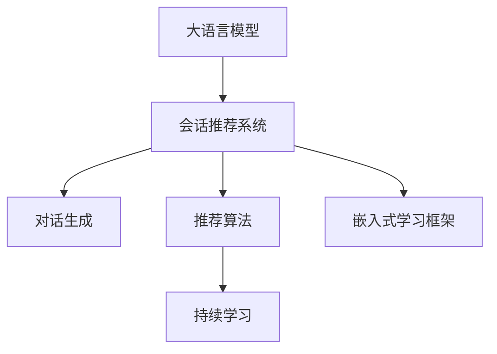

                 

# 利用大模型进行会话式交互推荐的创新模式与实践

> 关键词：大语言模型,交互推荐系统,对话生成,持续学习,嵌入式学习,会话交互,推荐算法,深度学习,自然语言处理(NLP)

## 1. 背景介绍

### 1.1 问题由来

随着互联网和移动互联网的普及，信息量和用户需求呈现爆炸性增长，传统的单向信息推荐模式已无法满足用户日益复杂的个性化需求。用户与推荐系统的互动性增强，成为当前信息服务的重要趋势。

与此同时，近年来深度学习，特别是大语言模型和自然语言处理(NLP)技术的迅猛发展，使得构建智能化的推荐系统成为可能。特别是基于大模型的会话式推荐系统，通过实时交互获取用户意图，生成个性化推荐内容，极大提升了推荐的个性化和精准度。

然而，会话式推荐系统在实际应用中还面临诸多挑战：

- 多轮对话生成复杂：如何构建对话逻辑，生成自然流畅的推荐内容？
- 持续学习需求：如何实时更新推荐内容，保证推荐相关性？
- 计算资源消耗大：大规模预训练模型和会话交互带来巨大的计算负担。

本文旨在探讨基于大模型的会话式交互推荐系统，提出新的推荐模式与实践，帮助开发者构建高效、智能的推荐系统。

### 1.2 问题核心关键点

会话式推荐系统核心在于构建一个能够理解用户意图，实时生成个性化推荐内容的交互模型。其关键点包括：

- 对话生成技术：模型能够理解用户输入，并生成合理、自然的回复。
- 推荐算法优化：模型能根据上下文信息生成个性化推荐内容。
- 持续学习机制：模型能根据新交互数据，实时更新推荐策略。
- 嵌入式学习框架：将推荐模型集成到实际应用场景中，确保推荐效果的实时性和稳定性。

## 2. 核心概念与联系

### 2.1 核心概念概述

为更好地理解基于大模型的会话式交互推荐系统，本节将介绍几个关键概念：

- 大语言模型(Large Language Model, LLM)：以自回归(如GPT)或自编码(如BERT)模型为代表的大规模预训练语言模型。通过在大规模无标签文本语料上进行预训练，学习通用的语言表示，具备强大的语言理解和生成能力。

- 会话推荐系统：通过构建对话系统，实时理解用户输入，并生成个性化推荐内容的推荐系统。

- 交互生成技术：构建能够自然生成对话的交互模型，如GPT-3、ChatGPT等，使得推荐系统具备智能交互的能力。

- 推荐算法优化：优化推荐算法，使得模型能够从会话数据中提取用户偏好信息，生成个性化推荐内容。

- 持续学习机制：引入持续学习机制，实时更新模型，保证推荐内容的时效性和相关性。

- 嵌入式学习框架：将模型集成到实际应用场景中，提供稳定可靠的推荐服务。

这些核心概念之间的逻辑关系可以通过以下Mermaid流程图来展示：



这个流程图展示了大语言模型在会话推荐系统中的核心作用，以及会话推荐系统构建中的关键技术模块：对话生成、推荐算法优化、持续学习机制、嵌入式学习框架。

## 3. 核心算法原理 & 具体操作步骤
### 3.1 算法原理概述

基于大模型的会话式交互推荐系统，本质上是一个智能对话系统与个性化推荐算法的有机结合。其核心思想是：利用大语言模型作为对话生成的基础，结合推荐算法，实时生成个性化推荐内容。

具体而言，会话推荐系统的工作流程如下：

1. 用户通过自然语言输入查询，系统通过大语言模型生成对话内容，理解用户意图。
2. 根据用户意图和对话历史，推荐算法生成个性化推荐内容。
3. 将推荐结果作为对话上下文，更新对话内容，继续交互。
4. 通过持续学习机制，系统不断更新推荐策略，提升推荐准确度。

形式化地，假设大语言模型为 $M_{\theta}$，其中 $\theta$ 为预训练得到的模型参数。会话推荐系统的输入为 $X=\{x_1, x_2, ..., x_n\}$，输出为推荐内容 $Y=\{y_1, y_2, ..., y_n\}$。

定义会话推荐系统的目标函数为：

$$
\min_{\theta} \mathcal{L}(X,Y;M_{\theta})
$$

其中 $\mathcal{L}$ 为会话推荐系统的损失函数，衡量推荐内容的真实性和相关性。常用的损失函数包括交叉熵损失、均方误差损失等。

### 3.2 算法步骤详解

基于大模型的会话式交互推荐系统一般包括以下几个关键步骤：

**Step 1: 准备预训练模型和数据集**
- 选择合适的预训练语言模型 $M_{\theta}$ 作为对话生成的基础，如 GPT-3、ChatGPT 等。
- 准备推荐数据集，包括用户查询、历史交互数据、商品/内容信息等。

**Step 2: 对话生成模型**
- 构建对话生成模型，如 GPT-3、RAG (Retrieval-Augmented Generator) 等。
- 使用推荐数据集对模型进行微调，以生成自然流畅的推荐对话。

**Step 3: 推荐算法设计**
- 设计推荐算法，如协同过滤、内容推荐、基于矩阵分解的推荐等。
- 结合对话内容，优化推荐算法，生成个性化推荐内容。

**Step 4: 持续学习机制**
- 引入持续学习机制，如增量学习、在线学习等。
- 根据新交互数据，实时更新推荐策略，保证推荐内容的时效性和相关性。

**Step 5: 嵌入式学习框架**
- 将会话推荐模型嵌入到实际应用场景中，如电商推荐、社交媒体推荐等。
- 提供稳定可靠的推荐服务，确保推荐效果的实时性和稳定性。

### 3.3 算法优缺点

基于大模型的会话式交互推荐系统具有以下优点：

- 自然交互体验：大语言模型具备自然语言生成能力，能够与用户进行流畅的自然对话，提升用户满意度。
- 个性化推荐：结合推荐算法，模型能根据用户意图生成个性化推荐内容，提高推荐相关性。
- 实时更新：持续学习机制确保模型能够实时更新推荐策略，适应用户需求变化。

同时，该方法也存在一定的局限性：

- 高计算消耗：大规模预训练模型和对话生成带来巨大的计算负担，需要高性能计算资源。
- 数据依赖性强：会话推荐系统依赖于大量的推荐数据和对话数据，数据质量对系统性能有直接影响。
- 过拟合风险：模型可能过度拟合特定的推荐场景，导致泛化能力不足。
- 模型复杂度高：会话推荐模型较为复杂，维护和调优难度较大。

尽管存在这些局限性，但就目前而言，基于大模型的会话推荐系统仍是最先进的技术范式。未来相关研究的重点在于如何进一步降低计算资源消耗，提高推荐模型的泛化能力，同时兼顾用户体验和模型复杂度。

### 3.4 算法应用领域

基于大模型的会话式交互推荐系统，在电商、社交媒体、在线教育等多个领域得到了广泛应用，为用户提供了更加个性化、智能化的推荐服务。

- 电商推荐：帮助用户发现更符合其购物偏好的商品，提升用户体验和购买转化率。
- 社交媒体推荐：推荐与用户兴趣相关的内容，促进用户互动和社区活跃度。
- 在线教育：根据用户的学习进度和偏好，推荐相关课程和学习资源，提升学习效果。
- 医疗健康：提供个性化的健康建议和治疗方案，提升用户健康水平。

除了上述这些经典应用外，会话推荐系统还被创新性地应用于智能客服、智能助手、虚拟偶像等新兴领域，为各行各业带来了新的活力和机遇。

## 4. 数学模型和公式 & 详细讲解  
### 4.1 数学模型构建

本节将使用数学语言对基于大模型的会话式交互推荐系统进行更加严格的刻画。

记会话推荐系统的输入为 $X=\{x_1, x_2, ..., x_n\}$，输出为推荐内容 $Y=\{y_1, y_2, ..., y_n\}$。会话推荐系统的目标函数为：

$$
\min_{\theta} \mathcal{L}(X,Y;M_{\theta})
$$

其中 $\mathcal{L}$ 为会话推荐系统的损失函数，衡量推荐内容的真实性和相关性。常用的损失函数包括交叉熵损失、均方误差损失等。

### 4.2 公式推导过程

以交叉熵损失为例，会话推荐系统的目标函数为：

$$
\min_{\theta} -\frac{1}{N}\sum_{i=1}^N \sum_{j=1}^k y_{ij}\log p_{ij}(x_i)
$$

其中 $p_{ij}(x_i)$ 为模型在输入 $x_i$ 下生成推荐内容 $y_{ij}$ 的概率，$y_{ij}$ 为 $x_i$ 对应的推荐内容，$k$ 为推荐内容的种类数。

在得到目标函数后，可通过梯度下降等优化算法求解最优参数。常用的优化算法包括Adam、SGD等。

## 5. 项目实践：代码实例和详细解释说明
### 5.1 开发环境搭建

在进行会话推荐系统开发前，我们需要准备好开发环境。以下是使用Python进行PyTorch开发的环境配置流程：

1. 安装Anaconda：从官网下载并安装Anaconda，用于创建独立的Python环境。

2. 创建并激活虚拟环境：
```bash
conda create -n recommendation-env python=3.8 
conda activate recommendation-env
```

3. 安装PyTorch：根据CUDA版本，从官网获取对应的安装命令。例如：
```bash
conda install pytorch torchvision torchaudio cudatoolkit=11.1 -c pytorch -c conda-forge
```

4. 安装Transformer库：
```bash
pip install transformers
```

5. 安装各类工具包：
```bash
pip install numpy pandas scikit-learn matplotlib tqdm jupyter notebook ipython
```

完成上述步骤后，即可在`recommendation-env`环境中开始会话推荐系统的开发。

### 5.2 源代码详细实现

下面我们以电商推荐系统为例，给出使用Transformers库对GPT-3模型进行会话推荐系统的PyTorch代码实现。

首先，定义会话推荐系统所需的类：

```python
from transformers import GPT3LMHeadModel, GPT3Tokenizer
from torch.utils.data import Dataset, DataLoader
from sklearn.metrics import precision_score, recall_score, f1_score

class RecommendationDataset(Dataset):
    def __init__(self, texts, labels):
        self.texts = texts
        self.labels = labels
        
    def __len__(self):
        return len(self.texts)
    
    def __getitem__(self, item):
        text = self.texts[item]
        label = self.labels[item]
        return {'input_ids': text, 'labels': label}

class RecommendationModel:
    def __init__(self, model, tokenizer):
        self.model = model
        self.tokenizer = tokenizer
        
    def generate_recommendations(self, text):
        encoding = self.tokenizer(text, return_tensors='pt')
        output = self.model.generate(**encoding)
        return output

    def evaluate(self, dataset):
        dataloader = DataLoader(dataset, batch_size=16, shuffle=True)
        model.eval()
        precision, recall, f1 = 0, 0, 0
        for batch in dataloader:
            input_ids = batch['input_ids'].to(device)
            labels = batch['labels'].to(device)
            with torch.no_grad():
                outputs = self.model(input_ids)
                preds = outputs.argmax(dim=2).to('cpu').tolist()
                for pred, label in zip(preds, labels):
                    precision += precision_score(label, pred)
                    recall += recall_score(label, pred)
                    f1 += f1_score(label, pred)
        return precision/len(dataset), recall/len(dataset), f1/len(dataset)

    def train(self, train_dataset, test_dataset, batch_size, optimizer, epochs):
        device = torch.device('cuda') if torch.cuda.is_available() else torch.device('cpu')
        model.train()
        for epoch in range(epochs):
            train_loss = 0
            for batch in tqdm(dataloader(train_dataset, batch_size)):
                input_ids = batch['input_ids'].to(device)
                labels = batch['labels'].to(device)
                optimizer.zero_grad()
                outputs = self.model(input_ids, labels=labels)
                loss = outputs.loss
                train_loss += loss.item()
                loss.backward()
                optimizer.step()
            print(f"Epoch {epoch+1}, train loss: {train_loss/len(train_dataset):.3f}")
            test_precision, test_recall, test_f1 = self.evaluate(test_dataset)
            print(f"Epoch {epoch+1}, test precision: {test_precision:.3f}, recall: {test_recall:.3f}, f1: {test_f1:.3f}")
```

然后，加载预训练模型和数据集：

```python
tokenizer = GPT3Tokenizer.from_pretrained('gpt3')
model = GPT3LMHeadModel.from_pretrained('gpt3')

train_dataset = RecommendationDataset(train_texts, train_labels)
test_dataset = RecommendationDataset(test_texts, test_labels)
```

最后，启动训练流程并在测试集上评估：

```python
optimizer = AdamW(model.parameters(), lr=2e-5)
batch_size = 16
epochs = 5

recommendation_model = RecommendationModel(model, tokenizer)
recommendation_model.train(train_dataset, test_dataset, batch_size, optimizer, epochs)
```

以上就是使用PyTorch对GPT-3模型进行会话推荐系统的完整代码实现。可以看到，利用Transformer库，会话推荐系统的代码实现变得简洁高效。

### 5.3 代码解读与分析

让我们再详细解读一下关键代码的实现细节：

**RecommendationDataset类**：
- `__init__`方法：初始化文本和标签。
- `__len__`方法：返回数据集的样本数量。
- `__getitem__`方法：对单个样本进行处理，将文本转换为模型所需的输入。

**RecommendationModel类**：
- `__init__`方法：初始化模型和分词器。
- `generate_recommendations`方法：使用GPT-3模型生成推荐内容。
- `evaluate`方法：在测试集上评估推荐模型的性能。
- `train`方法：训练推荐模型，更新模型参数。

**训练流程**：
- 定义总的epoch数和batch size，开始循环迭代
- 每个epoch内，先在训练集上训练，输出平均loss
- 在测试集上评估，输出模型精度、召回率和F1分数
- 所有epoch结束后，关闭模型，提供推荐服务

可以看到，PyTorch配合Transformer库使得会话推荐系统的代码实现变得简洁高效。开发者可以将更多精力放在数据处理、模型改进等高层逻辑上，而不必过多关注底层的实现细节。

当然，工业级的系统实现还需考虑更多因素，如模型的保存和部署、超参数的自动搜索、更灵活的任务适配层等。但核心的会话推荐范式基本与此类似。

## 6. 实际应用场景
### 6.1 智能客服系统

会话推荐系统在智能客服系统中的应用前景广阔。传统客服往往需要配备大量人力，高峰期响应缓慢，且一致性和专业性难以保证。而使用会话推荐系统，可以实时理解用户意图，提供个性化推荐服务，提升客户满意度。

在技术实现上，可以收集企业内部的历史客服对话记录，将问题和最佳答复构建成监督数据，在此基础上对预训练对话模型进行微调。微调后的会话推荐系统能够自动理解用户意图，匹配最合适的答案模板进行回复。对于客户提出的新问题，还可以接入检索系统实时搜索相关内容，动态组织生成回答。如此构建的智能客服系统，能大幅提升客户咨询体验和问题解决效率。

### 6.2 社交媒体推荐

会话推荐系统在社交媒体推荐中的应用同样大有可为。社交媒体推荐系统需要实时理解用户发布的内容，并生成个性化推荐内容，提升用户互动和社区活跃度。

具体而言，可以在用户发布的状态信息中提取文本，使用会话推荐系统进行对话生成和推荐内容生成。结合用户的历史行为数据，模型能够更好地理解用户的兴趣偏好，生成更加个性化和精准的推荐内容。例如，当用户发布一条关于旅游的信息，模型可以生成个性化旅游推荐，提升用户的互动和分享。

### 6.3 在线教育推荐

在线教育推荐系统需要根据用户的学习进度和偏好，推荐相关课程和学习资源，提升学习效果。

会话推荐系统可以通过对话系统理解用户的学习需求，生成个性化的学习建议和资源推荐。例如，当用户在学习过程中遇到难题时，会话推荐系统可以生成具体的课程或资料推荐，帮助用户解决问题。同时，通过不断交互和学习，模型可以逐步了解用户的偏好和学习进度，生成更加精准的推荐内容。

### 6.4 未来应用展望

随着会话推荐系统的不断发展，未来将会在更多领域得到应用，为各行各业带来变革性影响。

在智慧医疗领域，会话推荐系统可以通过对话理解用户的健康状况，生成个性化的健康建议和治疗方案，提升用户的健康水平。

在智能制造领域，会话推荐系统可以与工业物联网设备进行交互，生成个性化的生产计划和设备维护建议，提升生产效率和设备寿命。

在智慧城市治理中，会话推荐系统可以与城市管理平台进行交互，生成个性化的城市管理建议，提升城市管理的自动化和智能化水平，构建更安全、高效的未来城市。

此外，在企业生产、社会治理、文娱传媒等众多领域，会话推荐系统也将不断涌现，为各行各业带来新的活力和机遇。相信随着技术的日益成熟，会话推荐系统必将在构建人机协同的智能时代中扮演越来越重要的角色。

## 7. 工具和资源推荐
### 7.1 学习资源推荐

为了帮助开发者系统掌握会话推荐系统的理论基础和实践技巧，这里推荐一些优质的学习资源：

1. 《对话生成与推荐系统》系列博文：由大模型技术专家撰写，深入浅出地介绍了对话生成、推荐算法、持续学习等前沿话题。

2. Coursera《深度学习在推荐系统中的应用》课程：由斯坦福大学教授讲授，系统讲解了推荐系统的发展历程和前沿技术，涵盖深度学习在推荐中的应用。

3. 《推荐系统》书籍：陈淮宇等著，全面介绍了推荐系统的基本概念和经典模型，是入门推荐系统的必备资料。

4. Kaggle推荐系统竞赛数据集：提供了大量的推荐数据集，可供研究者和开发者进行实践和实验。

5. AI Challenger推荐系统竞赛：最新的推荐系统竞赛平台，汇集了各大公司和研究机构的推荐技术创新成果，是跟踪最新研究动态的好去处。

通过对这些资源的学习实践，相信你一定能够快速掌握会话推荐系统的精髓，并用于解决实际的推荐问题。

### 7.2 开发工具推荐

高效的开发离不开优秀的工具支持。以下是几款用于会话推荐系统开发的常用工具：

1. PyTorch：基于Python的开源深度学习框架，灵活动态的计算图，适合快速迭代研究。

2. TensorFlow：由Google主导开发的开源深度学习框架，生产部署方便，适合大规模工程应用。

3. Transformers库：HuggingFace开发的NLP工具库，集成了众多SOTA语言模型，支持PyTorch和TensorFlow，是进行会话推荐系统开发的利器。

4. Weights & Biases：模型训练的实验跟踪工具，可以记录和可视化模型训练过程中的各项指标，方便对比和调优。

5. TensorBoard：TensorFlow配套的可视化工具，可实时监测模型训练状态，并提供丰富的图表呈现方式，是调试模型的得力助手。

6. Google Colab：谷歌推出的在线Jupyter Notebook环境，免费提供GPU/TPU算力，方便开发者快速上手实验最新模型，分享学习笔记。

合理利用这些工具，可以显著提升会话推荐系统的开发效率，加快创新迭代的步伐。

### 7.3 相关论文推荐

会话推荐系统的发展源于学界的持续研究。以下是几篇奠基性的相关论文，推荐阅读：

1. Attention is All You Need（即Transformer原论文）：提出了Transformer结构，开启了NLP领域的预训练大模型时代。

2. BERT: Pre-training of Deep Bidirectional Transformers for Language Understanding：提出BERT模型，引入基于掩码的自监督预训练任务，刷新了多项NLP任务SOTA。

3. A Neural Conversational Model：提出Seq2Seq模型，为会话生成任务奠定了基础。

4. Retriving-Augmented Natural Language Generation：提出RAG模型，将检索技术与生成技术结合，提升了推荐系统的效果。

5. Interaction-aware Recommendation with Textual Feedback：提出基于交互的推荐模型，考虑用户与推荐系统的交互行为，生成更加个性化和精准的推荐内容。

6. Continuous Personalization with Interactive Reinforcement Learning：引入强化学习机制，提升推荐系统的个性化和实时性。

这些论文代表了大语言模型会话推荐系统的发展脉络。通过学习这些前沿成果，可以帮助研究者把握学科前进方向，激发更多的创新灵感。

## 8. 总结：未来发展趋势与挑战

### 8.1 总结

本文对基于大模型的会话式交互推荐系统进行了全面系统的介绍。首先阐述了会话推荐系统的发展背景和重要意义，明确了会话推荐系统在构建智能交互推荐服务中的独特价值。其次，从原理到实践，详细讲解了会话推荐系统的数学模型和关键步骤，给出了会话推荐系统的完整代码实现。同时，本文还广泛探讨了会话推荐系统在电商、社交媒体、在线教育等多个行业领域的应用前景，展示了会话推荐系统的巨大潜力。此外，本文精选了会话推荐系统的各类学习资源，力求为读者提供全方位的技术指引。

通过本文的系统梳理，可以看到，基于大模型的会话推荐系统正在成为推荐系统的重要范式，极大提升了推荐系统的个性化和实时性。得益于大语言模型的自然语言生成能力，会话推荐系统能够更好地理解用户意图，生成自然流畅的推荐内容。结合推荐算法，会话推荐系统在提升推荐相关性和用户体验方面展现出显著优势。

### 8.2 未来发展趋势

展望未来，会话推荐系统将呈现以下几个发展趋势：

1. 对话生成技术不断进步：随着深度学习和大语言模型的不断发展，会话推荐系统中的对话生成技术也将不断进步，生成更加自然、多样化的推荐内容。

2. 推荐算法优化：未来的推荐算法将更加注重模型的可解释性和公平性，结合因果推断、强化学习等技术，生成更加精准、个性化的推荐内容。

3. 持续学习机制优化：通过引入在线学习、增量学习等机制，实时更新推荐策略，提升推荐系统的效果和稳定性。

4. 嵌入式学习框架完善：未来的会话推荐系统将更加注重嵌入式应用，与实际业务场景深度融合，提供稳定可靠的推荐服务。

5. 多模态信息融合：将视觉、语音等多模态信息与文本信息相结合，提升推荐系统的感知能力和效果。

6. 个性化推荐模型的演化：未来的推荐模型将更加注重个性化，结合用户行为数据、兴趣图谱等，生成更加精准、智能化的推荐内容。

以上趋势凸显了会话推荐系统的广阔前景。这些方向的探索发展，必将进一步提升推荐系统的性能和用户体验，为各行各业带来新的变革。

### 8.3 面临的挑战

尽管会话推荐系统已经取得了瞩目成就，但在迈向更加智能化、普适化应用的过程中，它仍面临诸多挑战：

1. 计算资源消耗大：大规模预训练模型和会话交互带来巨大的计算负担，需要高性能计算资源。

2. 数据依赖性强：会话推荐系统依赖于大量的推荐数据和对话数据，数据质量对系统性能有直接影响。

3. 模型复杂度高：会话推荐模型较为复杂，维护和调优难度较大。

4. 过拟合风险：模型可能过度拟合特定的推荐场景，导致泛化能力不足。

5. 可解释性不足：会话推荐模型的决策过程缺乏可解释性，难以对其推理逻辑进行分析和调试。

6. 安全性有待保障：会话推荐系统可能学习到有偏见、有害的信息，传递到推荐内容中，带来安全隐患。

正视会话推荐系统面临的这些挑战，积极应对并寻求突破，将是大模型推荐技术走向成熟的必由之路。相信随着学界和产业界的共同努力，这些挑战终将一一被克服，会话推荐系统必将在构建智能交互推荐服务中扮演越来越重要的角色。

### 8.4 研究展望

面向未来，会话推荐系统需要在以下几个方面寻求新的突破：

1. 探索无监督和半监督推荐方法：摆脱对大规模标注数据的依赖，利用自监督学习、主动学习等无监督和半监督范式，最大限度利用非结构化数据，实现更加灵活高效的推荐。

2. 研究参数高效和计算高效的推荐范式：开发更加参数高效的推荐方法，在固定大部分预训练参数的同时，只更新极少量的任务相关参数。同时优化推荐模型的计算图，减少前向传播和反向传播的资源消耗，实现更加轻量级、实时性的部署。

3. 引入更多先验知识：将符号化的先验知识，如知识图谱、逻辑规则等，与神经网络模型进行巧妙融合，引导推荐过程学习更准确、合理的推荐内容。同时加强不同模态数据的整合，实现视觉、语音等多模态信息与文本信息的协同建模。

4. 结合因果分析和博弈论工具：将因果分析方法引入推荐模型，识别出推荐决策的关键特征，增强输出解释的因果性和逻辑性。借助博弈论工具刻画人机交互过程，主动探索并规避推荐系统的脆弱点，提高系统稳定性。

5. 纳入伦理道德约束：在推荐目标中引入伦理导向的评估指标，过滤和惩罚有偏见、有害的推荐内容，确保推荐内容符合用户价值观和伦理道德。

这些研究方向的探索，必将引领会话推荐系统技术迈向更高的台阶，为构建安全、可靠、可解释、可控的智能推荐系统铺平道路。面向未来，会话推荐系统还需要与其他人工智能技术进行更深入的融合，如知识表示、因果推理、强化学习等，多路径协同发力，共同推动推荐系统的进步。只有勇于创新、敢于突破，才能不断拓展推荐系统的边界，让智能推荐技术更好地造福人类社会。

## 9. 附录：常见问题与解答

**Q1：会话推荐系统如何提升推荐精度？**

A: 会话推荐系统通过实时理解用户意图，生成个性化推荐内容，能够显著提升推荐精度。

首先，通过对话生成技术，系统可以实时理解用户需求，生成自然流畅的推荐内容。结合推荐算法，模型能够从会话数据中提取用户偏好信息，生成更加个性化和精准的推荐内容。

其次，通过引入持续学习机制，系统能够根据新交互数据，实时更新推荐策略，提升推荐相关性和时效性。

最后，通过嵌入式学习框架，系统能够与实际应用场景深度融合，提供稳定可靠的推荐服务。

**Q2：会话推荐系统如何处理长文本信息？**

A: 会话推荐系统能够处理长文本信息，但需要考虑以下几点：

1. 分词和特征提取：长文本信息需要进行分词和特征提取，生成模型所需的输入。

2. 模型选择：选择适合长文本处理的模型，如RAG (Retrieval-Augmented Generator)，能够处理长文本信息，同时保证生成的推荐内容自然流畅。

3. 实时处理：通过并行处理和多线程技术，提升系统处理长文本信息的能力。

4. 数据预处理：对长文本信息进行预处理，去除无用信息，提升推荐精度。

5. 上下文感知：在推荐生成过程中，考虑上下文信息，生成更加相关和精准的推荐内容。

**Q3：会话推荐系统的训练和推理效率如何优化？**

A: 会话推荐系统的训练和推理效率优化可以从以下几个方面入手：

1. 模型压缩：通过剪枝、量化等技术，对模型进行压缩，减少计算量和内存占用。

2. 并行处理：通过并行处理和多线程技术，提升系统处理能力和响应速度。

3. 分布式训练：利用分布式计算框架，如TensorFlow、PyTorch等，对模型进行分布式训练，提升训练效率。

4. 数据优化：优化数据预处理和特征提取过程，减少计算量和内存占用。

5. 模型融合：将多个模型进行融合，提升推荐系统的效果和鲁棒性。

**Q4：会话推荐系统如何保证推荐内容的实时性和稳定性？**

A: 会话推荐系统通过持续学习机制，能够实时更新推荐策略，保证推荐内容的实时性和稳定性。

首先，引入增量学习、在线学习等机制，根据新交互数据，实时更新推荐策略。

其次，利用分布式计算和缓存技术，提升推荐系统的响应速度和稳定性。

最后，通过模型监控和异常检测，及时发现和修复推荐系统的问题，确保推荐内容的实时性和稳定性。

**Q5：会话推荐系统如何保证推荐内容的公平性和可解释性？**

A: 会话推荐系统可以通过以下几个方面保证推荐内容的公平性和可解释性：

1. 公平性约束：在推荐目标中引入公平性约束，过滤和惩罚有偏见、有害的推荐内容。

2. 可解释性设计：在推荐模型中加入可解释性模块，解释推荐内容的生成逻辑和决策依据。

3. 用户反馈机制：引入用户反馈机制，及时调整推荐策略，确保推荐内容符合用户需求和价值观。

4. 知识图谱融合：将知识图谱与推荐模型结合，提升推荐内容的可解释性和相关性。

5. 透明算法设计：在算法设计中，注重透明性和可解释性，确保推荐过程公开透明。

通过以上措施，会话推荐系统能够保证推荐内容的公平性和可解释性，提升用户体验和系统可信度。

---

作者：禅与计算机程序设计艺术 / Zen and the Art of Computer Programming

