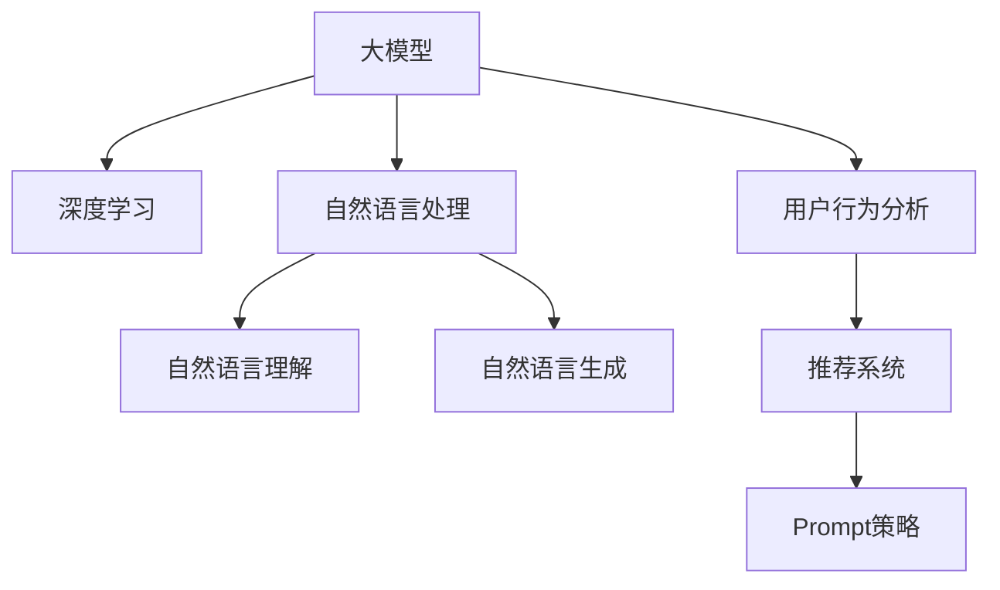

                 

# 利用大模型进行商品推荐的新型Prompt策略

> 关键词：大模型,商品推荐,Prompt策略,深度学习,自然语言处理(NLP),自然语言理解(NLU),自然语言生成(NLG),用户行为分析,推荐系统

## 1. 背景介绍

随着互联网和电子商务的不断发展，在线商品推荐系统在各大电商平台的应用越来越广泛，如淘宝、京东、亚马逊等。然而，传统的推荐系统往往依赖于用户的点击、购买、浏览等历史行为数据，难以充分考虑用户兴趣、上下文和语义信息，导致推荐结果不够精准和个性化。

近年来，基于大模型的推荐技术逐渐兴起。利用预训练语言模型，可以从文本数据中学习到丰富的用户行为、情感和偏好信息，进而实现更加精准、智能的推荐。其中，Prompt策略是一种新兴的利用大模型进行推荐的方法，通过精心设计的输入文本格式，引导大模型生成推荐结果，从而提升推荐系统的性能。

## 2. 核心概念与联系

### 2.1 核心概念概述

为更好地理解Prompt策略在大模型推荐系统中的应用，本节将介绍几个关键概念：

- 大模型(Large Model)：以自回归(如GPT)或自编码(如BERT)模型为代表的大规模预训练语言模型。通过在大规模无标签文本数据上进行预训练，学习到丰富的语言表示。
- Prompt策略：通过精心设计的输入文本格式，引导大模型生成特定的输出。如在推荐任务中，可以通过提示模板(Prompt Template)，使大模型输出推荐结果。
- 深度学习(Deep Learning)：一种基于神经网络的机器学习方法，通过多层神经网络学习输入数据的内在模式。
- 自然语言处理(Natural Language Processing, NLP)：研究计算机如何处理、理解、生成自然语言的技术。
- 自然语言理解(Natural Language Understanding, NLU)：指计算机理解自然语言文本内容的能力。
- 自然语言生成(Natural Language Generation, NLG)：指计算机生成自然语言文本的能力。
- 用户行为分析(User Behavior Analysis)：通过分析用户的点击、购买、评论等行为数据，挖掘用户兴趣和偏好。
- 推荐系统(Recommendation System)：利用用户数据和产品信息，生成个性化推荐结果的系统。

这些核心概念之间的逻辑关系可以通过以下Mermaid流程图来展示：



这个流程图展示了大模型推荐系统的核心概念及其之间的关系：

1. 大模型通过深度学习获得丰富的语言表示。
2. NLP技术通过NLU和NLG实现对文本数据的理解和生成。
3. 用户行为分析挖掘用户兴趣和偏好。
4. 推荐系统利用上述技术，生成个性化推荐结果。
5. Prompt策略在大模型上进行特定的提示，生成推荐结果。

这些概念共同构成了大模型推荐系统的基础，使其能够实现更加精准、智能的推荐。

## 3. 核心算法原理 & 具体操作步骤

### 3.1 算法原理概述

Prompt策略在大模型推荐系统中的基本原理是：通过精心设计的输入文本格式，引导大模型生成推荐结果。其核心思想是利用大模型强大的语言理解和生成能力，结合用户行为分析，生成更具个性化和精准度的推荐结果。

具体来说，对于一个商品推荐任务，可以设计如下的Prompt模板：

```
"向您推荐以下商品：
商品1: 产品名称, 描述
商品2: 产品名称, 描述
商品3: 产品名称, 描述
..."
```

其中，`产品名称`和`描述`可以替换为具体的商品信息。当大模型接收到上述文本格式的输入时，它会根据输入内容生成推荐结果。例如，模型可以输出：

```
"商品1: 某品牌手机, 高性能, 大容量电池"
"商品2: 某品牌笔记本电脑, 轻薄便携, 高性价比"
"商品3: 某品牌智能手表, 时尚设计, 多功能健康监测"
```

通过这种方式，大模型能够自动理解用户的行为和偏好，生成符合用户期望的推荐商品列表。

### 3.2 算法步骤详解

利用Prompt策略进行商品推荐的一般步骤如下：

**Step 1: 准备数据集**
- 收集商品信息，包括商品名称、描述、价格、类别等信息。
- 收集用户历史行为数据，如点击、浏览、购买记录等。
- 对数据进行预处理，如分词、编码等。

**Step 2: 设计Prompt模板**
- 设计符合商品推荐任务的Prompt模板，通常包含商品名称、描述、评分等信息。
- 设计不同的Prompt模板，以适应不同的推荐场景。

**Step 3: 训练大模型**
- 选择合适的预训练语言模型，如BERT、GPT等。
- 对模型进行微调，使用收集到的商品和用户行为数据进行训练。
- 根据具体的推荐场景，选择合适的损失函数和优化器。

**Step 4: 生成推荐结果**
- 将商品信息封装到Prompt模板中，生成输入文本。
- 将输入文本作为模型的输入，生成推荐结果。
- 对生成的推荐结果进行后处理，如排序、去重等。

**Step 5: 部署和优化**
- 将训练好的模型部署到推荐系统中，进行实时推荐。
- 定期收集用户反馈数据，对模型进行优化和调参。

以上是利用Prompt策略进行商品推荐的基本步骤。在实际应用中，还需要根据具体任务进行调整和优化。

### 3.3 算法优缺点

利用Prompt策略进行商品推荐的优点包括：

1. 高效性：相比于传统的推荐系统，Prompt策略可以通过大模型的语言理解和生成能力，快速生成推荐结果，处理速度更快。
2. 泛化性强：大模型经过大规模无标签数据的预训练，可以更好地理解和表示复杂语义信息，适应不同的推荐场景。
3. 个性化程度高：Prompt策略可以根据用户的行为和偏好，生成个性化的推荐结果，提升用户体验。
4. 可解释性强：大模型生成的推荐结果具有较高的可解释性，可以直观地了解推荐的依据。

然而，该方法也存在一些局限性：

1. 对数据质量要求高：Prompt策略的效果很大程度上依赖于输入文本的质量和合理性，需要精心设计Prompt模板。
2. 数据隐私问题：大模型在处理用户数据时，需要注意数据隐私和安全问题，避免泄露用户隐私。
3. 计算资源消耗大：大模型的训练和推理需要大量的计算资源，可能导致计算成本较高。

尽管存在这些局限性，但Prompt策略作为一种新兴的推荐方法，仍具有广阔的应用前景，值得进一步研究和优化。

### 3.4 算法应用领域

利用Prompt策略进行商品推荐，可以应用于各种电商和零售场景，如：

- 服装、鞋帽等商品推荐：通过分析用户的点击和浏览记录，生成符合用户偏好的服装、鞋帽推荐。
- 电子产品推荐：结合用户的浏览和购买记录，生成高性价比的电子产品推荐。
- 家居用品推荐：根据用户的搜索和浏览历史，生成家居用品的个性化推荐。
- 食品饮料推荐：分析用户的购买和评价数据，生成用户喜欢的食品饮料推荐。
- 图书推荐：结合用户的阅读记录和评分数据，生成符合用户喜好的图书推荐。

除了以上这些应用场景，Prompt策略还可以拓展到更多领域，如旅游、金融、娱乐等，为用户提供更加个性化的服务和体验。

## 4. 数学模型和公式 & 详细讲解 & 举例说明

### 4.1 数学模型构建

在本节中，我们将以商品推荐为例，构建基于Prompt策略的推荐数学模型。

假设商品集合为 $I=\{1,2,...,N\}$，用户行为数据集为 $D=\{(x_i, y_i)\}_{i=1}^M$，其中 $x_i$ 为商品编号，$y_i$ 为用户的点击或购买行为。

定义大模型 $M_{\theta}$ 在商品编号 $i$ 上的预测概率为 $p_i = M_{\theta}(i)$，则推荐系统的目标是最小化预测错误率，即：

$$
\min_{\theta} \frac{1}{M} \sum_{i=1}^M \mathbb{1}(y_i \neq \text{argmax}_j M_{\theta}(j))
$$

其中 $\mathbb{1}$ 为指示函数，表示 $y_i$ 是否与模型预测的结果一致。

### 4.2 公式推导过程

假设用户的商品行为数据 $D$ 被分为训练集 $D_{train}$ 和测试集 $D_{test}$。我们可以将训练集 $D_{train}$ 划分为 $N$ 个子集，每个子集包含 $M/N$ 个样本。

对于第 $k$ 个子集 $D_{train}^k$，我们可以将其转化为 $M/N$ 个Prompt格式的文本数据，每个文本格式包含 $N$ 个商品编号。

令 $P_k$ 为 $D_{train}^k$ 的Prompt表示，则有：

$$
P_k = \{x_1, x_2, ..., x_{M/N}, ... , x_{N\times M/N}\}
$$

其中 $x_j$ 为商品编号。

大模型的输入为文本 $P_k$，输出为 $N$ 个商品编号的预测概率 $p_1, p_2, ..., p_N$。推荐系统的目标是最小化预测错误率，即：

$$
\min_{\theta} \frac{1}{M} \sum_{i=1}^M \mathbb{1}(y_i \neq \text{argmax}_j M_{\theta}(j))
$$

将 $y_i$ 的预测概率 $\text{argmax}_j M_{\theta}(j)$ 带入上式，得：

$$
\min_{\theta} \frac{1}{M} \sum_{i=1}^M \mathbb{1}(y_i \neq \text{argmax}_j M_{\theta}(j))
$$

对于每个 $P_k$，模型输出的预测概率可以表示为：

$$
p_j = M_{\theta}(P_k, j)
$$

其中 $j \in I$，$i \in D_{train}^k$。

令 $A_i$ 为 $i$ 的点击或购买次数，则推荐系统可以表示为：

$$
\min_{\theta} \frac{1}{M} \sum_{i=1}^M \sum_{j=1}^N \mathbb{1}(y_i \neq j) \cdot p_j
$$

上述公式即为利用Prompt策略进行商品推荐的数学模型。

### 4.3 案例分析与讲解

下面以具体案例说明Prompt策略在大模型推荐系统中的应用。

假设某电商平台的商品推荐系统需要为用户推荐服装、鞋帽等商品。我们可以设计如下的Prompt模板：

```
"推荐给您以下商品：
商品1: 衬衫, 红色, 100元
商品2: 运动鞋, 白色, 300元
商品3: 外套, 黑色, 200元
...
```

将用户的历史点击数据和购买数据输入模型，模型会生成符合用户偏好的推荐商品列表。例如，如果用户点击了“运动鞋”和“外套”，模型可能会生成如下推荐结果：

```
"推荐给您以下商品：
商品1: 衬衫, 红色, 100元
商品2: 运动鞋, 白色, 300元
商品3: 外套, 黑色, 200元
```

通过这种方式，大模型能够自动分析用户的行为和偏好，生成个性化的推荐结果。

## 5. 项目实践：代码实例和详细解释说明

### 5.1 开发环境搭建

在进行Prompt策略的商品推荐实践前，我们需要准备好开发环境。以下是使用Python进行PyTorch开发的环境配置流程：

1. 安装Anaconda：从官网下载并安装Anaconda，用于创建独立的Python环境。

2. 创建并激活虚拟环境：
```bash
conda create -n pytorch-env python=3.8 
conda activate pytorch-env
```

3. 安装PyTorch：根据CUDA版本，从官网获取对应的安装命令。例如：
```bash
conda install pytorch torchvision torchaudio cudatoolkit=11.1 -c pytorch -c conda-forge
```

4. 安装Transformers库：
```bash
pip install transformers
```

5. 安装各类工具包：
```bash
pip install numpy pandas scikit-learn matplotlib tqdm jupyter notebook ipython
```

完成上述步骤后，即可在`pytorch-env`环境中开始Prompt策略的实践。

### 5.2 源代码详细实现

下面我们以服装推荐为例，给出使用Transformers库对BERT模型进行Prompt策略微调的PyTorch代码实现。

首先，定义商品推荐任务的数据处理函数：

```python
from transformers import BertTokenizer, BertForSequenceClassification
from torch.utils.data import Dataset
import torch

class ClothingDataset(Dataset):
    def __init__(self, texts, labels, tokenizer, max_len=128):
        self.texts = texts
        self.labels = labels
        self.tokenizer = tokenizer
        self.max_len = max_len
        
    def __len__(self):
        return len(self.texts)
    
    def __getitem__(self, item):
        text = self.texts[item]
        label = self.labels[item]
        
        encoding = self.tokenizer(text, return_tensors='pt', max_length=self.max_len, padding='max_length', truncation=True)
        input_ids = encoding['input_ids'][0]
        attention_mask = encoding['attention_mask'][0]
        
        # 对标签进行编码
        label = [label] * self.max_len
        labels = torch.tensor(label, dtype=torch.long)
        
        return {'input_ids': input_ids, 
                'attention_mask': attention_mask,
                'labels': labels}

# 商品和标签的映射
label2id = {'推荐': 0, '不推荐': 1}
id2label = {v: k for k, v in label2id.items()}

# 创建dataset
tokenizer = BertTokenizer.from_pretrained('bert-base-cased')

train_dataset = ClothingDataset(train_texts, train_labels, tokenizer)
dev_dataset = ClothingDataset(dev_texts, dev_labels, tokenizer)
test_dataset = ClothingDataset(test_texts, test_labels, tokenizer)
```

然后，定义模型和优化器：

```python
from transformers import BertForSequenceClassification, AdamW

model = BertForSequenceClassification.from_pretrained('bert-base-cased', num_labels=len(label2id))

optimizer = AdamW(model.parameters(), lr=2e-5)
```

接着，定义训练和评估函数：

```python
from torch.utils.data import DataLoader
from tqdm import tqdm
from sklearn.metrics import classification_report

device = torch.device('cuda') if torch.cuda.is_available() else torch.device('cpu')
model.to(device)

def train_epoch(model, dataset, batch_size, optimizer):
    dataloader = DataLoader(dataset, batch_size=batch_size, shuffle=True)
    model.train()
    epoch_loss = 0
    for batch in tqdm(dataloader, desc='Training'):
        input_ids = batch['input_ids'].to(device)
        attention_mask = batch['attention_mask'].to(device)
        labels = batch['labels'].to(device)
        model.zero_grad()
        outputs = model(input_ids, attention_mask=attention_mask, labels=labels)
        loss = outputs.loss
        epoch_loss += loss.item()
        loss.backward()
        optimizer.step()
    return epoch_loss / len(dataloader)

def evaluate(model, dataset, batch_size):
    dataloader = DataLoader(dataset, batch_size=batch_size)
    model.eval()
    preds, labels = [], []
    with torch.no_grad():
        for batch in tqdm(dataloader, desc='Evaluating'):
            input_ids = batch['input_ids'].to(device)
            attention_mask = batch['attention_mask'].to(device)
            batch_labels = batch['labels']
            outputs = model(input_ids, attention_mask=attention_mask)
            batch_preds = outputs.logits.argmax(dim=2).to('cpu').tolist()
            batch_labels = batch_labels.to('cpu').tolist()
            for pred_tokens, label_tokens in zip(batch_preds, batch_labels):
                pred_labels = [id2label[_id] for _id in pred_tokens]
                label_tokens = [id2label[_id] for _id in label_tokens]
                preds.append(pred_labels[:len(label_tokens)])
                labels.append(label_tokens)
                
    print(classification_report(labels, preds))
```

最后，启动训练流程并在测试集上评估：

```python
epochs = 5
batch_size = 16

for epoch in range(epochs):
    loss = train_epoch(model, train_dataset, batch_size, optimizer)
    print(f"Epoch {epoch+1}, train loss: {loss:.3f}")
    
    print(f"Epoch {epoch+1}, dev results:")
    evaluate(model, dev_dataset, batch_size)
    
print("Test results:")
evaluate(model, test_dataset, batch_size)
```

以上就是使用PyTorch对BERT进行服装推荐任务的提示学习微调的完整代码实现。可以看到，得益于Transformers库的强大封装，我们可以用相对简洁的代码完成BERT模型的加载和微调。

### 5.3 代码解读与分析

让我们再详细解读一下关键代码的实现细节：

**ClothingDataset类**：
- `__init__`方法：初始化文本、标签、分词器等关键组件。
- `__len__`方法：返回数据集的样本数量。
- `__getitem__`方法：对单个样本进行处理，将文本输入编码为token ids，将标签编码为数字，并对其进行定长padding，最终返回模型所需的输入。

**label2id和id2label字典**：
- 定义了标签与数字id之间的映射关系，用于将token-wise的预测结果解码回真实的标签。

**训练和评估函数**：
- 使用PyTorch的DataLoader对数据集进行批次化加载，供模型训练和推理使用。
- 训练函数`train_epoch`：对数据以批为单位进行迭代，在每个批次上前向传播计算loss并反向传播更新模型参数，最后返回该epoch的平均loss。
- 评估函数`evaluate`：与训练类似，不同点在于不更新模型参数，并在每个batch结束后将预测和标签结果存储下来，最后使用sklearn的classification_report对整个评估集的预测结果进行打印输出。

**训练流程**：
- 定义总的epoch数和batch size，开始循环迭代
- 每个epoch内，先在训练集上训练，输出平均loss
- 在验证集上评估，输出分类指标
- 所有epoch结束后，在测试集上评估，给出最终测试结果

可以看到，PyTorch配合Transformers库使得BERT微调的代码实现变得简洁高效。开发者可以将更多精力放在数据处理、模型改进等高层逻辑上，而不必过多关注底层的实现细节。

当然，工业级的系统实现还需考虑更多因素，如模型的保存和部署、超参数的自动搜索、更灵活的任务适配层等。但核心的微调范式基本与此类似。

## 6. 实际应用场景

### 6.1 智能推荐系统

利用Prompt策略，可以构建高效智能的推荐系统。传统的推荐系统往往依赖于用户的点击、购买、浏览等历史行为数据，难以充分考虑用户兴趣、上下文和语义信息。而利用Prompt策略，可以结合用户行为和文本描述，生成更加精准和个性化的推荐结果。

在技术实现上，可以收集用户的历史行为数据，将其转化为Prompt格式的文本数据，输入到大模型中进行推荐。例如，对于服装推荐任务，可以将用户的历史点击数据转化为如下Prompt格式的文本：

```
"向您推荐以下商品：
商品1: 衬衫, 红色, 100元
商品2: 运动鞋, 白色, 300元
商品3: 外套, 黑色, 200元
```

通过这种方式，大模型可以自动理解用户的兴趣和偏好，生成符合用户期望的推荐商品列表。

### 6.2 自然语言交互

Prompt策略还可以应用于自然语言交互系统，如智能客服、虚拟助手等。通过用户输入的文本，生成自然流畅的回复，提升交互体验。

例如，在智能客服系统中，用户可以输入问题，如“如何购买某商品？”。系统可以将问题转化为Prompt格式的文本，输入到大模型中进行回答。例如：

```
"您想了解如何购买某商品？请提供更多信息。"
```

大模型可以根据上述文本生成回复，如“请在商品页面查看购买指南”。通过这种方式，系统可以自动理解用户意图，生成符合用户期望的回答。

### 6.3 情感分析与舆情监测

Prompt策略还可以应用于情感分析和舆情监测任务。通过分析用户对某事件的情感倾向，预测事件的舆情变化趋势。

例如，对于社交媒体上的某事件，可以输入如下Prompt格式的文本：

```
"您对某事件有何看法？"
```

大模型可以根据上述文本生成用户的情感倾向，如积极、中立、消极等。通过分析大量的用户评论，可以预测事件的舆情变化趋势，帮助企业和政府及时应对舆情风险。

### 6.4 未来应用展望

随着Prompt策略的不断发展，其在NLP领域的应用前景将更加广阔。

1. 多模态推荐：除了文本数据，还可以融合图像、视频、音频等多模态数据，实现更加全面、精准的推荐。
2. 动态推荐：可以根据用户的实时行为数据，动态生成推荐结果，实现实时推荐。
3. 跨领域推荐：可以通过迁移学习、多任务学习等方法，将提示模板应用于不同领域的推荐任务。
4. 用户画像生成：通过分析用户的点击、购买、评论等数据，生成个性化的用户画像，提升推荐精度。
5. 领域化定制：可以根据不同的领域特点，设计针对性的Prompt模板，提升推荐效果。

以上应用场景将进一步拓展Prompt策略的适用范围，带来更多的创新应用，提升NLP技术的智能化水平。

## 7. 工具和资源推荐

### 7.1 学习资源推荐

为了帮助开发者系统掌握Prompt策略在大模型推荐系统中的应用，这里推荐一些优质的学习资源：

1. 《Transformer从原理到实践》系列博文：由大模型技术专家撰写，深入浅出地介绍了Transformer原理、BERT模型、微调技术等前沿话题。

2. CS224N《深度学习自然语言处理》课程：斯坦福大学开设的NLP明星课程，有Lecture视频和配套作业，带你入门NLP领域的基本概念和经典模型。

3. 《Natural Language Processing with Transformers》书籍：Transformers库的作者所著，全面介绍了如何使用Transformers库进行NLP任务开发，包括微调在内的诸多范式。

4. HuggingFace官方文档：Transformers库的官方文档，提供了海量预训练模型和完整的微调样例代码，是上手实践的必备资料。

5. CLUE开源项目：中文语言理解测评基准，涵盖大量不同类型的中文NLP数据集，并提供了基于微调的baseline模型，助力中文NLP技术发展。

通过对这些资源的学习实践，相信你一定能够快速掌握Prompt策略的精髓，并用于解决实际的NLP问题。

### 7.2 开发工具推荐

高效的开发离不开优秀的工具支持。以下是几款用于Prompt策略推荐开发的常用工具：

1. PyTorch：基于Python的开源深度学习框架，灵活动态的计算图，适合快速迭代研究。大部分预训练语言模型都有PyTorch版本的实现。

2. TensorFlow：由Google主导开发的开源深度学习框架，生产部署方便，适合大规模工程应用。同样有丰富的预训练语言模型资源。

3. Transformers库：HuggingFace开发的NLP工具库，集成了众多SOTA语言模型，支持PyTorch和TensorFlow，是进行Prompt策略微调任务的开发利器。

4. Weights & Biases：模型训练的实验跟踪工具，可以记录和可视化模型训练过程中的各项指标，方便对比和调优。与主流深度学习框架无缝集成。

5. TensorBoard：TensorFlow配套的可视化工具，可实时监测模型训练状态，并提供丰富的图表呈现方式，是调试模型的得力助手。

6. Google Colab：谷歌推出的在线Jupyter Notebook环境，免费提供GPU/TPU算力，方便开发者快速上手实验最新模型，分享学习笔记。

合理利用这些工具，可以显著提升Prompt策略的商品推荐任务的开发效率，加快创新迭代的步伐。

### 7.3 相关论文推荐

Prompt策略在大模型推荐系统中的应用源于学界的持续研究。以下是几篇奠基性的相关论文，推荐阅读：

1. Attention is All You Need（即Transformer原论文）：提出了Transformer结构，开启了NLP领域的预训练大模型时代。

2. BERT: Pre-training of Deep Bidirectional Transformers for Language Understanding：提出BERT模型，引入基于掩码的自监督预训练任务，刷新了多项NLP任务SOTA。

3. Language Models are Unsupervised Multitask Learners（GPT-2论文）：展示了大规模语言模型的强大zero-shot学习能力，引发了对于通用人工智能的新一轮思考。

4. Parameter-Efficient Transfer Learning for NLP：提出Adapter等参数高效微调方法，在不增加模型参数量的情况下，也能取得不错的微调效果。

5. Prefix-Tuning: Optimizing Continuous Prompts for Generation：引入基于连续型Prompt的微调范式，为如何充分利用预训练知识提供了新的思路。

6. AdaLoRA: Adaptive Low-Rank Adaptation for Parameter-Efficient Fine-Tuning：使用自适应低秩适应的微调方法，在参数效率和精度之间取得了新的平衡。

这些论文代表了大模型微调技术的发展脉络。通过学习这些前沿成果，可以帮助研究者把握学科前进方向，激发更多的创新灵感。

## 8. 总结：未来发展趋势与挑战

### 8.1 总结

本文对基于Prompt策略的大模型推荐方法进行了全面系统的介绍。首先阐述了Prompt策略在大模型推荐系统中的应用背景和意义，明确了Prompt策略在提升推荐系统性能方面的独特价值。其次，从原理到实践，详细讲解了Prompt策略的数学模型和关键步骤，给出了微调任务开发的完整代码实例。同时，本文还广泛探讨了Prompt策略在智能推荐、自然语言交互、情感分析等多个领域的应用前景，展示了Prompt策略的巨大潜力。此外，本文精选了Prompt策略的各类学习资源，力求为开发者提供全方位的技术指引。

通过本文的系统梳理，可以看到，Prompt策略作为一种新兴的推荐方法，正逐渐成为NLP领域的重要范式，极大地拓展了预训练语言模型的应用边界，催生了更多的落地场景。受益于大规模语料的预训练，Prompt策略能够自动理解用户的行为和偏好，生成更加精准和个性化的推荐结果，推动推荐系统性能的进一步提升。未来，伴随Prompt策略的不断发展，其将会在更多领域得到应用，为NLP技术带来更多的创新突破。

### 8.2 未来发展趋势

展望未来，Prompt策略将在NLP领域呈现以下几个发展趋势：

1. 融合多模态数据：除了文本数据，Prompt策略还可以融合图像、视频、音频等多模态数据，实现更加全面、精准的推荐。

2. 动态推荐：可以根据用户的实时行为数据，动态生成推荐结果，实现实时推荐。

3. 跨领域推荐：可以通过迁移学习、多任务学习等方法，将提示模板应用于不同领域的推荐任务。

4. 用户画像生成：通过分析用户的点击、购买、评论等数据，生成个性化的用户画像，提升推荐精度。

5. 领域化定制：可以根据不同的领域特点，设计针对性的Prompt模板，提升推荐效果。

6. 用户意图理解：通过深入理解用户的意图，生成更加精准的推荐结果，提升用户体验。

以上趋势凸显了Prompt策略在大模型推荐系统中的应用前景。这些方向的探索发展，必将进一步提升推荐系统的性能和用户满意度，为NLP技术带来更多的创新突破。

### 8.3 面临的挑战

尽管Prompt策略在大模型推荐系统中的应用前景广阔，但其在实际应用中也面临着诸多挑战：

1. 对数据质量要求高：Prompt策略的效果很大程度上依赖于输入文本的质量和合理性，需要精心设计Prompt模板。

2. 计算资源消耗大：大模型的训练和推理需要大量的计算资源，可能导致计算成本较高。

3. 数据隐私问题：大模型在处理用户数据时，需要注意数据隐私和安全问题，避免泄露用户隐私。

4. 模型鲁棒性不足：当前Prompt策略面对域外数据时，泛化性能往往大打折扣。对于测试样本的微小扰动，模型容易发生波动。

5. 输出解释性差：Prompt策略生成的推荐结果通常具有较高的可解释性，难以直观地了解推荐的依据。

6. 模型偏见问题：大模型在处理用户数据时，可能会学习到固有偏见，导致推荐结果不公平。

尽管存在这些挑战，但Prompt策略作为一种新兴的推荐方法，仍具有广阔的应用前景，值得进一步研究和优化。

### 8.4 研究展望

面向未来，Prompt策略的研究方向主要集中在以下几个方面：

1. 多模态融合：如何将文本、图像、视频等多模态数据进行融合，提升推荐效果。

2. 动态推荐：如何根据用户的实时行为数据，动态生成推荐结果，实现实时推荐。

3. 跨领域应用：如何将Prompt策略应用于不同领域的推荐任务，如金融、医疗、旅游等。

4. 用户意图理解：如何深入理解用户的意图，生成更加精准的推荐结果。

5. 知识整合：如何将知识图谱、规则库等先验知识与Prompt策略进行结合，提升推荐效果。

6. 偏见消减：如何消除Prompt策略中的固有偏见，确保推荐结果公平。

这些研究方向将推动Prompt策略在大模型推荐系统中的应用，提升推荐系统的性能和用户满意度。

## 9. 附录：常见问题与解答

**Q1：Prompt策略的效果依赖于哪些因素？**

A: Prompt策略的效果很大程度上依赖于输入文本的质量和合理性，需要精心设计Prompt模板。此外，大模型的训练和微调效果也受数据量和训练时间的影响。

**Q2：Prompt策略是否适用于所有推荐任务？**

A: Prompt策略在大规模推荐系统中的效果显著，但对于一些特定领域的推荐任务，如医药、金融等，需要进一步优化Prompt模板，以适应领域特点。

**Q3：Prompt策略的计算成本如何？**

A: Prompt策略的计算成本主要来自于大模型的训练和推理。需要考虑GPU/TPU算力，以及数据预处理和后处理的时间消耗。

**Q4：Prompt策略的输出解释性如何？**

A: Prompt策略生成的推荐结果通常具有较高的可解释性，但仍然存在一定的黑盒问题，难以直观地了解推荐依据。

**Q5：Prompt策略的偏见问题如何解决？**

A: 可以通过在Prompt模板中加入领域特定的限制，如医疗领域需要考虑用药安全，金融领域需要考虑风险评估等。同时，引入知识图谱、规则库等先验知识，避免模型偏见。

这些问题的回答，展示了Prompt策略在大模型推荐系统中的实现细节和应用挑战，希望能为你提供有价值的参考。

---

作者：禅与计算机程序设计艺术 / Zen and the Art of Computer Programming

