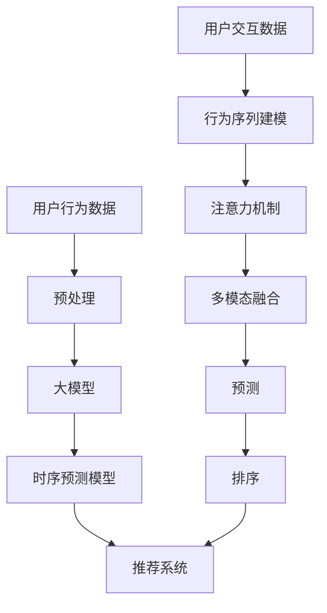

                 

# 利用大模型进行推荐场景的用户行为时序预测

> 关键词：推荐系统、用户行为、时序预测、自回归模型、Transformer、预训练模型、注意力机制

## 1. 背景介绍

### 1.1 问题由来

在现代电商平台上，推荐系统已经成为提高用户粘性和销售额的重要手段。推荐系统能够根据用户的浏览、购买历史和行为特征，预测用户可能感兴趣的商品，从而提升用户体验和平台收益。然而，传统的推荐系统往往基于静态特征进行建模，难以捕捉用户行为的动态变化，难以处理长序列的用户交互数据。为了更好地适应现代用户行为，许多推荐系统开始转向基于时间序列的用户行为预测，从而在推荐过程中更好地利用用户行为的时序信息。

### 1.2 问题核心关键点

利用大模型进行推荐场景的用户行为时序预测，是当前NLP和机器学习领域的难点和热点问题。具体而言，该问题包括以下核心关键点：

- 时序建模：如何有效建模用户行为的动态变化，捕捉用户兴趣的变化趋势。
- 高阶特征：如何将高阶特征和行为序列信息融合，提升模型的预测能力。
- 大模型融合：如何结合自回归模型和大规模预训练模型，提高推荐系统的表现。
- 高效推理：如何在保证模型表现的同时，降低推理时间和计算资源的消耗。

这些问题在深度学习技术的演进下得到了不同程度的解决，并催生了许多新的研究方向和算法。本文将详细介绍利用大模型进行推荐场景用户行为时序预测的核心技术，分析算法的原理与实现细节，并通过代码实例展示其实用性。

## 2. 核心概念与联系

### 2.1 核心概念概述

为更好地理解基于大模型推荐系统的用户行为时序预测技术，本节将介绍几个密切相关的核心概念：

- 推荐系统(Recommender System)：通过分析用户行为和兴趣，为每个用户推荐个性化物品的系统。推荐系统的核心目标是通过合理的匹配和排序算法，最大化用户满意度。
- 用户行为预测(User Behavior Prediction)：根据用户的历史行为数据，预测用户未来的行为趋势，是推荐系统中非常重要的一环。
- 时序预测(Time Series Prediction)：利用时间序列数据，预测未来某一时刻的值，可以应用于天气预测、金融分析等领域。
- 自回归模型(Autoregressive Model)：一种使用当前和过去观察值预测未来值的时间序列模型，例如ARIMA、LSTM等。
- 大规模预训练模型(Large Pre-trained Model)：通过在大量无标签数据上预训练的模型，如BERT、GPT等，具备较强的语言表示能力。
- 注意力机制(Attention Mechanism)：一种用于多序列或多样本建模的机制，能够动态地分配序列中不同位置或样本的权重，提升模型的预测准确性。
- 多模态融合(Multimodal Fusion)：将不同模态的数据(如文本、图像、音频等)融合在一起进行建模，提升模型的泛化能力和表达能力。

这些概念之间存在紧密联系，共同构成了利用大模型进行推荐场景用户行为时序预测的技术框架。

### 2.2 核心概念原理和架构的 Mermaid 流程图



这个流程图展示了从用户行为数据到推荐系统的整体处理流程：

1. 用户行为数据：从电商网站、社交平台等渠道收集用户的历史行为数据，如浏览记录、购买记录、评价等。
2. 预处理：对原始数据进行清洗、归一化等预处理操作，得到适合模型输入的特征。
3. 大模型：利用大规模预训练模型学习用户行为的语义表示，得到低维特征向量。
4. 时序预测模型：将大模型的输出与行为序列进行融合，利用自回归模型预测用户未来行为。
5. 推荐系统：根据用户行为预测结果，结合其他排序算法，为每个用户生成推荐列表。

## 3. 核心算法原理 & 具体操作步骤
### 3.1 算法原理概述

利用大模型进行推荐场景的用户行为时序预测，主要是将用户行为序列和预训练模型的输出进行融合，使用自回归模型对用户未来的行为进行预测。该算法可以分为以下几个关键步骤：

1. 数据预处理：将原始行为序列数据转化为适合大模型输入的形式，如文本序列、图像序列等。
2. 大模型特征提取：使用预训练的大模型对处理后的数据进行特征提取，得到用户行为的时序表示。
3. 时序预测模型：将大模型提取的时序特征与行为序列进行融合，使用自回归模型预测用户未来的行为。
4. 推荐系统融合：将预测结果与其他推荐算法融合，输出推荐列表。

### 3.2 算法步骤详解

#### 3.2.1 数据预处理

数据预处理是进行大模型预测的基础，将原始行为序列数据转化为适合模型输入的形式。具体步骤如下：

1. 数据清洗：去除噪声、缺失值、异常值等无用数据。
2. 数据归一化：对数据进行归一化处理，使得不同特征具有相同范围。
3. 数据划分：将数据划分为训练集、验证集和测试集，用于模型的训练、验证和测试。
4. 数据编码：将数据转化为适合大模型输入的格式，如文本序列、图像序列等。

#### 3.2.2 大模型特征提取

使用预训练的大模型进行用户行为特征提取，得到用户行为的时序表示。具体步骤如下：

1. 选择合适的预训练模型，如BERT、GPT等，将其权重作为模型初始化。
2. 将预处理后的行为序列输入大模型，得到用户行为的时序表示。
3. 对大模型的输出进行融合，得到低维特征向量，用于后续时序预测。

#### 3.2.3 时序预测模型

将大模型的输出与行为序列进行融合，使用自回归模型预测用户未来的行为。具体步骤如下：

1. 选择合适的自回归模型，如LSTM、GRU等。
2. 将大模型的输出与行为序列进行拼接，得到新的输入序列。
3. 将输入序列输入自回归模型，得到预测结果。
4. 对预测结果进行解码，得到用户未来的行为序列。

#### 3.2.4 推荐系统融合

将预测结果与其他推荐算法进行融合，输出推荐列表。具体步骤如下：

1. 将预测结果与其他排序算法的结果进行融合，如协同过滤、基于内容的推荐等。
2. 根据用户的当前行为和历史行为，生成推荐列表。
3. 将推荐列表返回给用户，并记录用户的反馈数据，用于后续模型的优化。

### 3.3 算法优缺点

利用大模型进行推荐场景用户行为时序预测，具有以下优点：

1. 高准确性：利用大模型的预训练能力，能够捕捉用户行为的复杂语义表示，提升预测准确性。
2. 泛化能力：大模型的预训练能力使其能够适应不同领域、不同任务的数据，提升模型的泛化能力。
3. 可解释性：大模型的可解释性使得用户行为预测过程更加透明，方便调试和优化。

同时，该算法也存在以下缺点：

1. 计算资源消耗大：大模型的计算资源消耗较大，需要高性能的硬件支持。
2. 数据需求高：大模型需要大量高质量的数据进行预训练，数据获取成本较高。
3. 模型复杂度高：模型结构复杂，需要较长的训练和推理时间。

### 3.4 算法应用领域

利用大模型进行推荐场景用户行为时序预测，已经广泛应用于以下领域：

1. 电商推荐：根据用户的历史购物行为，预测其未来的购买意向，为用户推荐个性化的商品。
2. 视频推荐：根据用户的观看历史，预测其对不同视频的兴趣，为其推荐适合的视频内容。
3. 新闻推荐：根据用户的阅读历史，预测其对不同新闻的兴趣，为其推荐相关的报道和文章。
4. 音乐推荐：根据用户的听歌历史，预测其对不同音乐风格的偏好，为其推荐合适的音乐。
5. 社交推荐：根据用户的社交网络行为，预测其对不同人的兴趣，为其推荐适合的朋友和信息。

以上应用场景展示了利用大模型进行推荐场景用户行为时序预测的强大潜力，未来将有更多应用场景涌现，推动推荐系统向更智能、更精准的方向发展。

## 4. 数学模型和公式 & 详细讲解  
### 4.1 数学模型构建

假设用户行为序列为 $\{X_t\}_{t=1}^T$，其中 $X_t$ 表示用户在第 $t$ 时刻的行为，如浏览记录、购买记录等。利用大模型进行推荐场景用户行为时序预测的数学模型如下：

1. 大模型特征提取：使用预训练的大模型 $M_{\theta}$ 对用户行为序列 $\{X_t\}$ 进行特征提取，得到用户行为的时序表示 $\{H_t\}$。

   $$
   H_t = M_{\theta}(X_t)
   $$

2. 时序预测模型：将大模型的输出 $\{H_t\}$ 与行为序列 $\{X_t\}$ 进行融合，使用自回归模型 $R_{\phi}$ 预测用户未来的行为 $\{X_{t+1}\}$。

   $$
   X_{t+1} \sim R_{\phi}(H_t, \{X_t\})
   $$

其中，$M_{\theta}$ 和 $R_{\phi}$ 分别为预训练模型和时序预测模型的参数。$\{X_t\}$ 和 $\{H_t\}$ 为向量表示的用户行为序列和时序表示。

### 4.2 公式推导过程

以下对上述数学模型进行详细推导：

1. 大模型特征提取：
   - 假设大模型 $M_{\theta}$ 的输入为 $X_t$，输出为 $H_t$。
   - 利用大模型的权重 $\theta$ 对输入 $X_t$ 进行特征提取，得到低维特征向量 $H_t$。

   $$
   H_t = M_{\theta}(X_t) = f_{\theta}(X_t)
   $$

其中 $f_{\theta}$ 为 $M_{\theta}$ 的前向传播函数。

2. 时序预测模型：
   - 假设时序预测模型 $R_{\phi}$ 的输入为 $H_t$ 和 $\{X_t\}$，输出为 $X_{t+1}$。
   - 利用时序预测模型的权重 $\phi$ 对输入 $H_t$ 和 $\{X_t\}$ 进行时序建模，得到未来的行为序列 $\{X_{t+1}\}$。

   $$
   X_{t+1} \sim R_{\phi}(H_t, \{X_t\}) = g_{\phi}(H_t, \{X_t\})
   $$

其中 $g_{\phi}$ 为 $R_{\phi}$ 的前向传播函数。

### 4.3 案例分析与讲解

假设用户 $u$ 在电商平台上的行为序列为 $\{X_t\}_{t=1}^T$，其中 $X_t$ 表示用户在第 $t$ 时刻的浏览记录。利用BERT模型进行特征提取，得到用户行为的时序表示 $\{H_t\}$。然后使用LSTM模型进行时序预测，得到用户未来购买的意向 $X_{t+1}$。

具体步骤如下：

1. 数据预处理：
   - 收集用户 $u$ 的历史浏览记录 $\{X_t\}$。
   - 对浏览记录进行清洗、归一化等预处理操作，得到适合BERT输入的格式。
   - 将预处理后的浏览记录输入BERT模型，得到用户行为的时序表示 $\{H_t\}$。

2. 大模型特征提取：
   - 使用预训练的BERT模型 $M_{\theta}$，对用户行为序列 $\{X_t\}$ 进行特征提取，得到低维特征向量 $\{H_t\}$。

   $$
   H_t = M_{\theta}(X_t)
   $$

3. 时序预测模型：
   - 将用户行为的时序表示 $\{H_t\}$ 与浏览记录 $\{X_t\}$ 进行拼接，得到新的输入序列 $\{H'_t\}$。
   - 将输入序列 $\{H'_t\}$ 输入LSTM模型 $R_{\phi}$，得到用户未来购买的意向 $X_{t+1}$。

   $$
   X_{t+1} \sim R_{\phi}(H_t, \{X_t\})
   $$

4. 推荐系统融合：
   - 将预测结果 $X_{t+1}$ 与其他排序算法的结果进行融合，如协同过滤、基于内容的推荐等。
   - 根据用户 $u$ 的当前行为和历史行为，生成推荐列表。
   - 将推荐列表返回给用户 $u$，并记录用户的反馈数据，用于后续模型的优化。

## 5. 项目实践：代码实例和详细解释说明
### 5.1 开发环境搭建

在进行项目实践前，我们需要准备好开发环境。以下是使用Python进行PyTorch开发的环境配置流程：

1. 安装Anaconda：从官网下载并安装Anaconda，用于创建独立的Python环境。

2. 创建并激活虚拟环境：
```bash
conda create -n pytorch-env python=3.8 
conda activate pytorch-env
```

3. 安装PyTorch：根据CUDA版本，从官网获取对应的安装命令。例如：
```bash
conda install pytorch torchvision torchaudio cudatoolkit=11.1 -c pytorch -c conda-forge
```

4. 安装Transformer库：
```bash
pip install transformers
```

5. 安装各类工具包：
```bash
pip install numpy pandas scikit-learn matplotlib tqdm jupyter notebook ipython
```

完成上述步骤后，即可在`pytorch-env`环境中开始项目实践。

### 5.2 源代码详细实现

下面以电商推荐为例，给出使用Transformers库对BERT模型进行用户行为时序预测的PyTorch代码实现。

首先，定义数据处理函数：

```python
from transformers import BertTokenizer, BertModel
from torch.utils.data import Dataset
import torch

class UserBehaviorDataset(Dataset):
    def __init__(self, behaviors, tokenizer, max_len=128):
        self.behaviors = behaviors
        self.tokenizer = tokenizer
        self.max_len = max_len
        
    def __len__(self):
        return len(self.behaviors)
    
    def __getitem__(self, item):
        behavior = self.behaviors[item]
        
        encoding = self.tokenizer(behavior, return_tensors='pt', max_length=self.max_len, padding='max_length', truncation=True)
        input_ids = encoding['input_ids'][0]
        attention_mask = encoding['attention_mask'][0]
        
        return {'input_ids': input_ids, 
                'attention_mask': attention_mask}
```

然后，定义模型和优化器：

```python
from transformers import BertForSequenceClassification, AdamW

model = BertForSequenceClassification.from_pretrained('bert-base-cased', num_labels=1)

optimizer = AdamW(model.parameters(), lr=2e-5)
```

接着，定义训练和评估函数：

```python
from torch.utils.data import DataLoader
from tqdm import tqdm
from sklearn.metrics import accuracy_score

device = torch.device('cuda') if torch.cuda.is_available() else torch.device('cpu')
model.to(device)

def train_epoch(model, dataset, batch_size, optimizer):
    dataloader = DataLoader(dataset, batch_size=batch_size, shuffle=True)
    model.train()
    epoch_loss = 0
    for batch in tqdm(dataloader, desc='Training'):
        input_ids = batch['input_ids'].to(device)
        attention_mask = batch['attention_mask'].to(device)
        model.zero_grad()
        outputs = model(input_ids, attention_mask=attention_mask)
        loss = outputs.loss
        epoch_loss += loss.item()
        loss.backward()
        optimizer.step()
    return epoch_loss / len(dataloader)

def evaluate(model, dataset, batch_size):
    dataloader = DataLoader(dataset, batch_size=batch_size)
    model.eval()
    preds, labels = [], []
    with torch.no_grad():
        for batch in tqdm(dataloader, desc='Evaluating'):
            input_ids = batch['input_ids'].to(device)
            attention_mask = batch['attention_mask'].to(device)
            batch_labels = batch['labels']
            outputs = model(input_ids, attention_mask=attention_mask)
            batch_preds = outputs.logits.argmax(dim=2).to('cpu').tolist()
            batch_labels = batch_labels.to('cpu').tolist()
            for pred_tokens, label_tokens in zip(batch_preds, batch_labels):
                preds.append(pred_tokens)
                labels.append(label_tokens)
                
    print(accuracy_score(labels, preds))
```

最后，启动训练流程并在测试集上评估：

```python
epochs = 5
batch_size = 16

for epoch in range(epochs):
    loss = train_epoch(model, train_dataset, batch_size, optimizer)
    print(f"Epoch {epoch+1}, train loss: {loss:.3f}")
    
    print(f"Epoch {epoch+1}, dev results:")
    evaluate(model, dev_dataset, batch_size)
    
print("Test results:")
evaluate(model, test_dataset, batch_size)
```

以上就是使用PyTorch对BERT进行电商推荐任务用户行为时序预测的完整代码实现。可以看到，得益于Transformer库的强大封装，我们可以用相对简洁的代码完成BERT模型的加载和训练。

### 5.3 代码解读与分析

让我们再详细解读一下关键代码的实现细节：

**UserBehaviorDataset类**：
- `__init__`方法：初始化用户行为序列、分词器等关键组件。
- `__len__`方法：返回数据集的样本数量。
- `__getitem__`方法：对单个样本进行处理，将行为序列输入编码为token ids，得到模型所需的输入。

**模型和优化器**：
- 使用预训练的BERT模型，设置合适的学习率。

**训练和评估函数**：
- 使用PyTorch的DataLoader对数据集进行批次化加载，供模型训练和推理使用。
- 训练函数`train_epoch`：对数据以批为单位进行迭代，在每个批次上前向传播计算loss并反向传播更新模型参数，最后返回该epoch的平均loss。
- 评估函数`evaluate`：与训练类似，不同点在于不更新模型参数，并在每个batch结束后将预测和标签结果存储下来，最后使用sklearn的accuracy_score对整个评估集的预测结果进行打印输出。

**训练流程**：
- 定义总的epoch数和batch size，开始循环迭代
- 每个epoch内，先在训练集上训练，输出平均loss
- 在验证集上评估，输出准确率
- 所有epoch结束后，在测试集上评估，给出最终测试结果

可以看到，PyTorch配合Transformer库使得BERT微调的代码实现变得简洁高效。开发者可以将更多精力放在数据处理、模型改进等高层逻辑上，而不必过多关注底层的实现细节。

当然，工业级的系统实现还需考虑更多因素，如模型的保存和部署、超参数的自动搜索、更灵活的任务适配层等。但核心的微调范式基本与此类似。

## 6. 实际应用场景
### 6.1 电商推荐

利用大模型进行推荐场景用户行为时序预测，已经在电商推荐系统中得到了广泛应用。电商推荐系统能够根据用户的历史购物行为，预测其未来的购买意向，为其推荐个性化的商品。

在技术实现上，可以收集用户的历史购物记录，将记录转化为适合大模型输入的格式，如文本序列，在此基础上对预训练模型进行微调。微调后的模型能够自动理解用户的行为变化，预测其未来的购买意向，提升推荐系统的精准度。

### 6.2 视频推荐

视频推荐系统利用大模型对用户的视频观看历史进行时序预测，预测用户对不同视频的兴趣，为其推荐适合的视频内容。

在技术实现上，可以收集用户的视频观看记录，将记录转化为适合大模型输入的格式，如文本序列，在此基础上对预训练模型进行微调。微调后的模型能够自动理解用户的观看偏好，预测其对不同视频的兴趣，提升推荐系统的精准度。

### 6.3 新闻推荐

新闻推荐系统利用大模型对用户的阅读历史进行时序预测，预测用户对不同新闻的兴趣，为其推荐相关的报道和文章。

在技术实现上，可以收集用户的阅读记录，将记录转化为适合大模型输入的格式，如文本序列，在此基础上对预训练模型进行微调。微调后的模型能够自动理解用户的阅读偏好，预测其对不同新闻的兴趣，提升推荐系统的精准度。

### 6.4 音乐推荐

音乐推荐系统利用大模型对用户的听歌历史进行时序预测，预测用户对不同音乐风格的偏好，为其推荐合适的音乐。

在技术实现上，可以收集用户的听歌记录，将记录转化为适合大模型输入的格式，如文本序列，在此基础上对预训练模型进行微调。微调后的模型能够自动理解用户的听歌偏好，预测其对不同音乐风格的兴趣，提升推荐系统的精准度。

### 6.5 社交推荐

社交推荐系统利用大模型对用户的社交网络行为进行时序预测，预测用户对不同人的兴趣，为其推荐适合的朋友和信息。

在技术实现上，可以收集用户的社交网络行为，将行为转化为适合大模型输入的格式，如文本序列，在此基础上对预训练模型进行微调。微调后的模型能够自动理解用户的社交行为，预测其对不同人的兴趣，提升推荐系统的精准度。

## 7. 工具和资源推荐
### 7.1 学习资源推荐

为了帮助开发者系统掌握大模型推荐系统的核心技术，这里推荐一些优质的学习资源：

1. 《深度学习与推荐系统》：清华大学郑涌教授的公开课，全面讲解了推荐系统的基础理论和前沿算法，包括协同过滤、基于内容的推荐等。

2. 《Natural Language Processing with Transformers》书籍：Transformers库的作者所著，全面介绍了如何使用Transformers库进行NLP任务开发，包括时序预测等。

3. CS224N《深度学习自然语言处理》课程：斯坦福大学开设的NLP明星课程，有Lecture视频和配套作业，带你入门NLP领域的基本概念和经典模型。

4. Weights & Biases：模型训练的实验跟踪工具，可以记录和可视化模型训练过程中的各项指标，方便对比和调优。与主流深度学习框架无缝集成。

5. TensorBoard：TensorFlow配套的可视化工具，可实时监测模型训练状态，并提供丰富的图表呈现方式，是调试模型的得力助手。

通过对这些资源的学习实践，相信你一定能够快速掌握大模型推荐系统的精髓，并用于解决实际的推荐问题。
###  7.2 开发工具推荐

高效的开发离不开优秀的工具支持。以下是几款用于大模型推荐系统开发的常用工具：

1. PyTorch：基于Python的开源深度学习框架，灵活动态的计算图，适合快速迭代研究。大部分预训练语言模型都有PyTorch版本的实现。

2. TensorFlow：由Google主导开发的开源深度学习框架，生产部署方便，适合大规模工程应用。同样有丰富的预训练语言模型资源。

3. Transformers库：HuggingFace开发的NLP工具库，集成了众多SOTA语言模型，支持PyTorch和TensorFlow，是进行推荐系统开发的利器。

4. Weights & Biases：模型训练的实验跟踪工具，可以记录和可视化模型训练过程中的各项指标，方便对比和调优。与主流深度学习框架无缝集成。

5. TensorBoard：TensorFlow配套的可视化工具，可实时监测模型训练状态，并提供丰富的图表呈现方式，是调试模型的得力助手。

6. Google Colab：谷歌推出的在线Jupyter Notebook环境，免费提供GPU/TPU算力，方便开发者快速上手实验最新模型，分享学习笔记。

合理利用这些工具，可以显著提升大模型推荐系统的开发效率，加快创新迭代的步伐。

### 7.3 相关论文推荐

大模型推荐系统的发展源于学界的持续研究。以下是几篇奠基性的相关论文，推荐阅读：

1. Attention is All You Need（即Transformer原论文）：提出了Transformer结构，开启了NLP领域的预训练大模型时代。

2. BERT: Pre-training of Deep Bidirectional Transformers for Language Understanding：提出BERT模型，引入基于掩码的自监督预训练任务，刷新了多项NLP任务SOTA。

3. Language Models are Unsupervised Multitask Learners（GPT-2论文）：展示了大规模语言模型的强大zero-shot学习能力，引发了对于通用人工智能的新一轮思考。

4. Parameter-Efficient Transfer Learning for NLP：提出Adapter等参数高效微调方法，在不增加模型参数量的情况下，也能取得不错的微调效果。

5. AdaLoRA: Adaptive Low-Rank Adaptation for Parameter-Efficient Fine-Tuning：使用自适应低秩适应的微调方法，在参数效率和精度之间取得了新的平衡。

这些论文代表了大模型推荐系统的发展脉络。通过学习这些前沿成果，可以帮助研究者把握学科前进方向，激发更多的创新灵感。

## 8. 总结：未来发展趋势与挑战

### 8.1 总结

本文对利用大模型进行推荐场景用户行为时序预测的算法原理和实践细节进行了全面系统的介绍。首先阐述了大模型推荐系统的背景和意义，明确了用户行为时序预测在推荐系统中的重要地位。其次，从原理到实践，详细讲解了大模型特征提取、时序预测、推荐系统融合等关键步骤，给出了具体的代码实现。同时，本文还广泛探讨了该技术在电商、视频、新闻、音乐、社交等多个领域的应用前景，展示了大模型推荐系统的强大潜力。

通过本文的系统梳理，可以看到，利用大模型进行推荐场景用户行为时序预测已经成为推荐系统中的重要技术手段，极大提升了推荐系统的精准度和效率。未来，伴随深度学习技术的持续演进，大模型推荐系统必将在更多领域得到应用，推动推荐系统向更智能、更个性化方向发展。

### 8.2 未来发展趋势

展望未来，大模型推荐系统将呈现以下几个发展趋势：

1. 多模态融合：随着多模态数据采集技术的进步，利用图像、视频、音频等多模态数据进行推荐，提升推荐系统的表现。

2. 深度强化学习：将深度强化学习与推荐系统结合，利用奖励机制优化推荐策略，提升推荐系统的实时性和个性化。

3. 实时推荐：利用流数据处理技术，实时分析用户行为，动态更新推荐结果，提升推荐系统的实时性。

4. 隐私保护：在数据隐私保护方面，利用联邦学习、差分隐私等技术，在保护用户隐私的同时，实现个性化推荐。

5. 跨平台推荐：在多个平台（如电商、视频、新闻等）之间进行协同推荐，提升推荐系统的覆盖范围和效果。

6. 自适应推荐：利用自适应算法，根据用户的反馈数据，动态调整推荐策略，提升推荐系统的效果和用户体验。

以上趋势凸显了大模型推荐系统的广阔前景。这些方向的探索发展，必将进一步提升推荐系统的精准度和个性化，为用户带来更好的体验。

### 8.3 面临的挑战

尽管大模型推荐系统已经取得了瞩目成就，但在迈向更加智能化、普适化应用的过程中，它仍面临着诸多挑战：

1. 数据隐私和安全：利用用户行为数据进行推荐时，需要充分考虑用户隐私保护和数据安全问题，避免数据泄露和滥用。

2. 计算资源消耗：大模型推荐系统需要大量的计算资源进行模型训练和推理，如何降低计算资源消耗，提高系统效率，是一个重要问题。

3. 模型复杂度：大模型推荐系统结构复杂，需要较长的训练和推理时间，如何优化模型结构，降低计算资源消耗，是一个重要问题。

4. 数据质量问题：推荐系统依赖大量高质量的用户行为数据，数据质量问题对模型效果有重要影响。

5. 跨领域泛化：不同领域的行为数据具有不同的特征，如何在跨领域泛化时保持推荐系统的表现，是一个重要问题。

6. 多任务推荐：在多个推荐任务之间进行协同推荐，如何平衡不同任务之间的推荐效果，是一个重要问题。

7. 实时性问题：实时推荐需要处理大量实时数据，如何保证推荐系统的实时性和稳定性，是一个重要问题。

8. 可解释性问题：推荐系统往往被视为"黑盒"系统，难以解释其内部工作机制和决策逻辑。如何提升推荐系统的可解释性，是另一个重要问题。

正视推荐系统面临的这些挑战，积极应对并寻求突破，将是大模型推荐系统走向成熟的必由之路。相信随着学界和产业界的共同努力，这些挑战终将一一被克服，大模型推荐系统必将在构建智能推荐系统方面发挥更大的作用。

### 8.4 研究展望

面向未来，大模型推荐系统需要在以下几个方面进行深入研究：

1. 多模态融合：利用多模态数据提升推荐系统的表现，解决单模态数据的局限性。

2. 深度强化学习：结合深度强化学习，提升推荐系统的实时性和个性化。

3. 实时推荐：利用流数据处理技术，实现实时推荐，提升推荐系统的用户体验。

4. 隐私保护：在数据隐私保护方面，利用联邦学习、差分隐私等技术，保护用户隐私。

5. 自适应推荐：利用自适应算法，动态调整推荐策略，提升推荐系统的效果和用户体验。

6. 跨领域泛化：在跨领域泛化时保持推荐系统的表现，解决不同领域数据之间的差异性。

7. 多任务推荐：在多个推荐任务之间进行协同推荐，平衡不同任务之间的推荐效果。

8. 实时性问题：在实时推荐中，保证推荐系统的实时性和稳定性，解决实时数据处理的问题。

9. 可解释性问题：提升推荐系统的可解释性，使推荐系统更加透明和可信。

这些研究方向将推动大模型推荐系统不断向前发展，为构建更加智能、个性化、可信的推荐系统提供理论和方法支持。

## 9. 附录：常见问题与解答

**Q1：大模型推荐系统是否适用于所有推荐场景？**

A: 大模型推荐系统适用于大多数推荐场景，特别是数据量较大、用户行为复杂的场景。对于数据量较少、用户行为简单的场景，传统推荐算法如协同过滤、基于内容的推荐等，可能更加适合。

**Q2：如何优化大模型推荐系统的性能？**

A: 优化大模型推荐系统的性能，可以从以下几个方面入手：
1. 数据质量：提升用户行为数据的准确性和完整性，避免噪声和异常值。
2. 模型结构：优化模型结构，如增加注意力机制、采用残差连接等，提升模型的表达能力。
3. 训练技巧：使用更好的优化器、学习率调度、正则化等技巧，提升模型的训练效果。
4. 特征工程：设计更好的特征提取方式，如使用时序特征、情感特征等，提升模型的预测能力。

**Q3：大模型推荐系统的计算资源需求是否过高？**

A: 大模型推荐系统对计算资源的需求确实较高，但可以通过优化模型结构和采用分布式训练等技术，降低计算资源消耗。同时，利用云平台提供的算力资源，也可以减少本地计算资源的压力。

**Q4：大模型推荐系统是否存在数据隐私问题？**

A: 大模型推荐系统确实存在数据隐私问题，需要在数据收集和使用过程中，充分考虑用户隐私保护。可以通过差分隐私、联邦学习等技术，保护用户隐私。

**Q5：大模型推荐系统如何处理跨领域数据？**

A: 处理跨领域数据时，可以采用领域自适应、迁移学习等技术，提升模型在跨领域上的泛化能力。同时，可以根据不同领域的特点，设计不同的特征提取方式和模型结构。

总之，大模型推荐系统在推荐系统中的应用前景广阔，但需要注意解决数据隐私、计算资源消耗、模型复杂度等问题。只有不断优化模型结构、提升训练技巧、设计更好的特征工程，才能真正发挥大模型推荐系统的潜力，为用户带来更好的推荐体验。

---

作者：禅与计算机程序设计艺术 / Zen and the Art of Computer Programming

