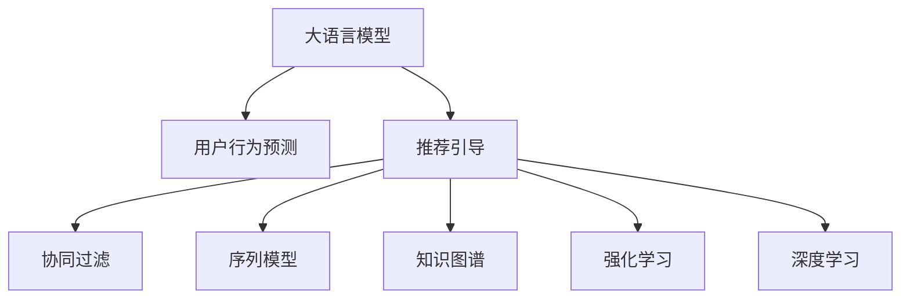

                 

# 利用大模型进行推荐场景的用户行为预测与引导

> 关键词：大语言模型,用户行为预测,推荐系统,协同过滤,序列模型,知识图谱,强化学习,深度学习

## 1. 背景介绍

### 1.1 问题由来

随着电子商务、社交媒体和内容平台等在线业务的蓬勃发展，推荐系统逐渐成为互联网产品不可或缺的核心组件。优秀的推荐系统能够根据用户的历史行为和当前状态，精准推荐用户感兴趣的内容，极大地提升用户体验和平台收益。然而，推荐系统面临诸多挑战，如冷启动问题、用户兴趣变化、数据稀疏性等，给推荐系统带来了诸多难题。近年来，利用大模型进行推荐系统优化成为了新的研究热点。

### 1.2 问题核心关键点

大语言模型在推荐场景中的主要应用包括用户行为预测和推荐引导两大方面：

1. **用户行为预测**：通过分析用户的历史行为和当前状态，预测其未来行为，从而进行个性化推荐。
2. **推荐引导**：利用大语言模型生成自然流畅的推荐描述或广告文案，吸引用户点击或购买，提升推荐效果。

基于大模型的方法，利用其强大的语言理解和生成能力，可以从海量数据中挖掘出用户的潜在需求，生成符合用户口味的内容，提升推荐系统的精准度和用户满意度。

### 1.3 问题研究意义

研究基于大模型的推荐系统优化方法，对于拓展推荐系统的应用范围，提升推荐内容的个性化和多样性，加速推荐技术的产业化进程，具有重要意义：

1. **降低推荐成本**。利用大模型快速分析用户行为，可以大幅减少人工筛选、标注数据的成本，提升推荐效率。
2. **提升推荐效果**。大模型的知识图谱和语言生成能力，能够生成高质量的推荐内容，满足用户的多样化需求。
3. **加速业务迭代**。借助大模型的强大预测能力，能够快速迭代优化推荐策略，缩短产品开发周期。
4. **引入创新技术**。结合大模型的强化学习和生成模型，可以引入更多前沿技术，如深度协同过滤、知识图谱推荐等。
5. **赋能业务升级**。基于大模型的推荐系统能够提供更精准、个性化的推荐内容，提升用户体验，促进业务增长。

## 2. 核心概念与联系

### 2.1 核心概念概述

为更好地理解基于大模型的推荐系统优化方法，本节将介绍几个密切相关的核心概念：

- **大语言模型(Large Language Model, LLM)**：如GPT、BERT等大规模预训练语言模型，具备强大的语言理解和生成能力。
- **推荐系统(Recommendation System)**：根据用户行为和偏好，推荐用户可能感兴趣的产品或内容的系统。
- **协同过滤(Collaborative Filtering)**：基于用户-物品交互历史进行推荐的方法。
- **序列模型(Sequence Model)**：利用时间序列数据，预测用户未来行为。
- **知识图谱(Knowledge Graph)**：基于实体和关系的数据结构，用于提供推荐内容的语义信息。
- **强化学习(Reinforcement Learning)**：通过与环境互动，学习最优策略的机器学习方法。
- **深度学习(Deep Learning)**：利用深度神经网络进行模型训练和预测。

这些核心概念之间的逻辑关系可以通过以下Mermaid流程图来展示：



这个流程图展示了大语言模型在推荐系统中的应用：

1. **用户行为预测**：通过分析用户历史行为，预测其未来行为。
2. **推荐引导**：生成符合用户口味的推荐描述或广告文案。
3. **协同过滤**：利用用户与物品的交互历史进行推荐。
4. **序列模型**：分析时间序列数据，预测用户未来行为。
5. **知识图谱**：通过语义信息增强推荐效果。
6. **强化学习**：通过用户反馈优化推荐策略。
7. **深度学习**：利用神经网络进行模型训练和预测。

这些概念共同构成了基于大模型的推荐系统优化框架，使其能够高效地挖掘用户需求，生成个性化推荐内容。

## 3. 核心算法原理 & 具体操作步骤
### 3.1 算法原理概述

基于大模型的推荐系统优化方法，通过结合深度学习、自然语言处理等技术，利用大模型的知识图谱和语言生成能力，实现对用户行为的高效预测和引导。其核心思想是：将大语言模型视为一个"黑盒"，通过输入用户历史行为和当前状态，输出推荐结果或行为预测。

形式化地，假设用户行为预测任务为 $P$，推荐引导任务为 $R$，用户历史行为序列为 $H$，当前状态为 $S$，推荐物品或内容的集合为 $I$。则优化目标可以表示为：

$$
\max_{\theta} \mathcal{L}(R(P_\theta(H,S),I))
$$

其中 $\theta$ 为大模型的参数，$\mathcal{L}$ 为推荐系统性能指标，如准确率、点击率、转化率等。推荐系统通过优化 $\theta$，使得预测的推荐结果 $P_\theta(H,S)$ 与实际用户行为 $R$ 尽可能一致。

### 3.2 算法步骤详解

基于大模型的推荐系统优化方法一般包括以下几个关键步骤：

**Step 1: 准备数据集**
- 收集用户历史行为数据，包括点击、浏览、购买等行为。
- 收集用户当前状态，如时间、位置、设备等。
- 构建推荐物品或内容的数据集，包括商品、视频、新闻等。

**Step 2: 特征提取**
- 对用户行为数据和当前状态进行特征提取，生成高维稀疏向量。
- 使用词向量、嵌入层、注意力机制等技术，将用户行为特征映射到低维稠密向量。

**Step 3: 构建模型**
- 选择合适的预训练语言模型，如BERT、GPT等。
- 构建模型架构，将用户行为特征输入大模型，输出推荐结果或行为预测。
- 设计任务适配层，根据推荐系统任务类型，选择合适的输出层和损失函数。

**Step 4: 训练和微调**
- 使用标注数据对模型进行训练，优化模型参数。
- 在验证集上评估模型性能，调整超参数。
- 进行模型微调，提升模型在新数据上的泛化能力。

**Step 5: 测试和部署**
- 在测试集上评估微调后的模型性能。
- 使用微调后的模型进行推荐系统部署，实时生成推荐内容。
- 持续收集用户反馈和行为数据，定期更新模型参数。

以上是基于大模型的推荐系统优化的一般流程。在实际应用中，还需要针对具体任务的特点，对各个环节进行优化设计，如改进特征提取方法、设计高效的模型结构、应用正则化技术等。

### 3.3 算法优缺点

基于大模型的推荐系统优化方法具有以下优点：
1. 高效预测：利用大模型强大的知识图谱和语言生成能力，能够快速预测用户未来行为。
2. 灵活引导：生成自然流畅的推荐内容，提升用户点击率和购买转化率。
3. 自动化优化：通过自动学习用户偏好，减少人工干预和标注成本。
4. 可解释性强：大模型生成的推荐内容可解释性强，便于用户理解。
5. 适应性强：大模型能够自适应新领域和数据分布，提升推荐效果。

同时，该方法也存在一定的局限性：
1. 数据需求量大：需要大量的用户行为数据和当前状态数据，获取成本较高。
2. 模型复杂度高：大模型的复杂度较高，训练和推理开销较大。
3. 泛化能力有限：对数据分布的变化敏感，可能需要重新微调模型。
4. 隐私风险高：用户行为数据可能包含隐私信息，需要严格保护。
5. 冷启动问题：新用户或新商品缺乏足够数据，可能导致推荐效果不佳。

尽管存在这些局限性，但就目前而言，基于大模型的推荐系统优化方法仍是大规模推荐系统的重要方向。未来相关研究的重点在于如何进一步降低数据需求，提高模型泛化能力，同时兼顾隐私保护和冷启动问题。

### 3.4 算法应用领域

基于大模型的推荐系统优化方法在电商、社交媒体、内容平台等多个领域得到了广泛应用，具体包括：

- **电商推荐**：利用用户浏览、点击、购买等行为数据，进行个性化商品推荐，提升用户满意度。
- **内容推荐**：根据用户阅读、观看、点赞等行为，推荐相关新闻、视频、文章等，提升内容消费体验。
- **广告推荐**：基于用户搜索、点击等行为，推荐符合用户兴趣的广告内容，提升广告点击率和转化率。
- **社交推荐**：根据用户关系、兴趣等信息，推荐相关好友、群组等，增强社交互动。
- **新闻推荐**：根据用户阅读偏好，推荐相关新闻和评论，提升信息获取效率。

除了上述这些经典应用外，大模型推荐系统还被创新性地应用于智能推荐系统、多任务推荐、兴趣演化分析等新兴领域，为推荐技术带来了全新的突破。

## 4. 数学模型和公式 & 详细讲解  
### 4.1 数学模型构建

本节将使用数学语言对基于大模型的推荐系统优化过程进行更加严格的刻画。

假设用户行为预测任务为 $P$，推荐引导任务为 $R$，用户历史行为序列为 $H$，当前状态为 $S$，推荐物品或内容的集合为 $I$。

定义推荐系统的损失函数为 $\mathcal{L}$，其中可能包含交叉熵损失、均方误差损失等。假设用户行为预测模型为 $P_\theta$，推荐引导模型为 $R_\theta$。则优化目标可以表示为：

$$
\max_{\theta} \mathcal{L}(R_\theta(P_\theta(H,S),I))
$$

在实践中，我们通常使用基于梯度的优化算法（如SGD、Adam等）来近似求解上述最优化问题。设 $\eta$ 为学习率，$\lambda$ 为正则化系数，则参数的更新公式为：

$$
\theta \leftarrow \theta - \eta \nabla_{\theta}\mathcal{L}(\theta) - \eta\lambda\theta
$$

其中 $\nabla_{\theta}\mathcal{L}(\theta)$ 为损失函数对参数 $\theta$ 的梯度，可通过反向传播算法高效计算。

### 4.2 公式推导过程

以下我们以用户行为预测任务为例，推导推荐系统的损失函数及其梯度的计算公式。

假设推荐系统的目标是根据用户历史行为和当前状态 $H$ 和 $S$，预测其未来行为 $y$。模型的预测结果为 $\hat{y} = P_\theta(H,S)$，其中 $\theta$ 为模型参数。则推荐系统的损失函数可以表示为：

$$
\mathcal{L}(\theta) = -\sum_{i=1}^N \ell(\hat{y}_i, y_i)
$$

其中 $\ell(\cdot)$ 为损失函数，如交叉熵损失。在二分类任务中，$\ell(\hat{y}_i, y_i) = -[y_i\log \hat{y}_i + (1-y_i)\log (1-\hat{y}_i)]$。

根据链式法则，损失函数对参数 $\theta$ 的梯度为：

$$
\frac{\partial \mathcal{L}(\theta)}{\partial \theta} = -\sum_{i=1}^N (\frac{y_i}{\hat{y}_i}-\frac{1-y_i}{1-\hat{y}_i}) \frac{\partial P_\theta(H,S)}{\partial \theta}
$$

其中 $\frac{\partial P_\theta(H,S)}{\partial \theta}$ 可通过反向传播算法计算。

在得到损失函数的梯度后，即可带入参数更新公式，完成模型的迭代优化。重复上述过程直至收敛，最终得到适应推荐任务的最优模型参数 $\theta^*$。

## 5. 项目实践：代码实例和详细解释说明
### 5.1 开发环境搭建

在进行推荐系统优化实践前，我们需要准备好开发环境。以下是使用Python进行PyTorch开发的环境配置流程：

1. 安装Anaconda：从官网下载并安装Anaconda，用于创建独立的Python环境。

2. 创建并激活虚拟环境：
```bash
conda create -n pytorch-env python=3.8 
conda activate pytorch-env
```

3. 安装PyTorch：根据CUDA版本，从官网获取对应的安装命令。例如：
```bash
conda install pytorch torchvision torchaudio cudatoolkit=11.1 -c pytorch -c conda-forge
```

4. 安装Transformers库：
```bash
pip install transformers
```

5. 安装各类工具包：
```bash
pip install numpy pandas scikit-learn matplotlib tqdm jupyter notebook ipython
```

完成上述步骤后，即可在`pytorch-env`环境中开始推荐系统优化的实践。

### 5.2 源代码详细实现

下面我们以电商平台推荐系统为例，给出使用Transformers库对BERT模型进行用户行为预测的PyTorch代码实现。

首先，定义用户行为预测任务的数据处理函数：

```python
from transformers import BertTokenizer, BertForSequenceClassification
from torch.utils.data import Dataset
import torch

class UserBehaviorDataset(Dataset):
    def __init__(self, user_behaviors, item_ids, user_ids, device):
        self.user_behaviors = user_behaviors
        self.item_ids = item_ids
        self.user_ids = user_ids
        self.device = device
        
    def __len__(self):
        return len(self.user_behaviors)
    
    def __getitem__(self, item):
        user_behavior = self.user_behaviors[item]
        item_id = self.item_ids[item]
        user_id = self.user_ids[item]
        
        user_sequence = list(range(len(user_behavior)))
        item_sequence = [item_id] * len(user_behavior)
        
        encoding = self.tokenizer(user_sequence, return_tensors='pt', padding='max_length', truncation=True)
        item_encoding = self.tokenizer(item_sequence, return_tensors='pt', padding='max_length', truncation=True)
        
        input_ids = encoding['input_ids'][0].to(self.device)
        attention_mask = encoding['attention_mask'][0].to(self.device)
        item_input_ids = item_encoding['input_ids'][0].to(self.device)
        item_attention_mask = item_encoding['attention_mask'][0].to(self.device)
        
        return {'input_ids': input_ids, 
                'attention_mask': attention_mask,
                'item_input_ids': item_input_ids,
                'item_attention_mask': item_attention_mask,
                'labels': torch.tensor([item_id], dtype=torch.long)}
```

然后，定义模型和优化器：

```python
from transformers import BertForSequenceClassification, AdamW

model = BertForSequenceClassification.from_pretrained('bert-base-cased', num_labels=len(item_ids))
optimizer = AdamW(model.parameters(), lr=2e-5)
```

接着，定义训练和评估函数：

```python
from torch.utils.data import DataLoader
from tqdm import tqdm
from sklearn.metrics import classification_report

device = torch.device('cuda') if torch.cuda.is_available() else torch.device('cpu')
model.to(device)

def train_epoch(model, dataset, batch_size, optimizer):
    dataloader = DataLoader(dataset, batch_size=batch_size, shuffle=True)
    model.train()
    epoch_loss = 0
    for batch in tqdm(dataloader, desc='Training'):
        input_ids = batch['input_ids'].to(device)
        attention_mask = batch['attention_mask'].to(device)
        item_input_ids = batch['item_input_ids'].to(device)
        item_attention_mask = batch['item_attention_mask'].to(device)
        labels = batch['labels']
        
        model.zero_grad()
        outputs = model(input_ids, attention_mask=attention_mask, item_input_ids=item_input_ids, item_attention_mask=item_attention_mask)
        loss = outputs.loss
        epoch_loss += loss.item()
        loss.backward()
        optimizer.step()
    return epoch_loss / len(dataloader)

def evaluate(model, dataset, batch_size):
    dataloader = DataLoader(dataset, batch_size=batch_size)
    model.eval()
    preds, labels = [], []
    with torch.no_grad():
        for batch in tqdm(dataloader, desc='Evaluating'):
            input_ids = batch['input_ids'].to(device)
            attention_mask = batch['attention_mask'].to(device)
            item_input_ids = batch['item_input_ids'].to(device)
            item_attention_mask = batch['item_attention_mask'].to(device)
            batch_labels = batch['labels']
            
            outputs = model(input_ids, attention_mask=attention_mask, item_input_ids=item_input_ids, item_attention_mask=item_attention_mask)
            batch_preds = outputs.logits.argmax(dim=2).to('cpu').tolist()
            batch_labels = batch_labels.to('cpu').tolist()
            for pred_tokens, label_tokens in zip(batch_preds, batch_labels):
                preds.append(pred_tokens)
                labels.append(label_tokens)
                
    print(classification_report(labels, preds))
```

最后，启动训练流程并在验证集上评估：

```python
epochs = 5
batch_size = 16

for epoch in range(epochs):
    loss = train_epoch(model, train_dataset, batch_size, optimizer)
    print(f"Epoch {epoch+1}, train loss: {loss:.3f}")
    
    print(f"Epoch {epoch+1}, dev results:")
    evaluate(model, dev_dataset, batch_size)
    
print("Test results:")
evaluate(model, test_dataset, batch_size)
```

以上就是使用PyTorch对BERT进行用户行为预测的完整代码实现。可以看到，得益于Transformers库的强大封装，我们可以用相对简洁的代码完成BERT模型的加载和微调。

### 5.3 代码解读与分析

让我们再详细解读一下关键代码的实现细节：

**UserBehaviorDataset类**：
- `__init__`方法：初始化用户行为序列、物品ID、用户ID和设备。
- `__len__`方法：返回数据集的样本数量。
- `__getitem__`方法：对单个样本进行处理，将用户行为序列和物品ID转换为token ids，生成模型输入。

**tokenizer**：
- 使用BertTokenizer进行分词和编码，将输入序列转换为模型所需的token ids和attention mask。

**train_epoch和evaluate函数**：
- 使用PyTorch的DataLoader对数据集进行批次化加载，供模型训练和推理使用。
- 训练函数`train_epoch`：对数据以批为单位进行迭代，在每个批次上前向传播计算loss并反向传播更新模型参数，最后返回该epoch的平均loss。
- 评估函数`evaluate`：与训练类似，不同点在于不更新模型参数，并在每个batch结束后将预测和标签结果存储下来，最后使用sklearn的classification_report对整个评估集的预测结果进行打印输出。

**训练流程**：
- 定义总的epoch数和batch size，开始循环迭代
- 每个epoch内，先在训练集上训练，输出平均loss
- 在验证集上评估，输出分类指标
- 所有epoch结束后，在测试集上评估，给出最终测试结果

可以看到，PyTorch配合Transformers库使得BERT微调的代码实现变得简洁高效。开发者可以将更多精力放在数据处理、模型改进等高层逻辑上，而不必过多关注底层的实现细节。

当然，工业级的系统实现还需考虑更多因素，如模型的保存和部署、超参数的自动搜索、更灵活的任务适配层等。但核心的微调范式基本与此类似。

## 6. 实际应用场景
### 6.1 电商平台推荐

基于大语言模型的推荐系统，可以广泛应用于电商平台的商品推荐，提升用户的购物体验和平台收益。传统电商推荐系统多采用协同过滤等算法，难以对新商品和老用户进行有效推荐。利用大语言模型，可以结合用户行为数据，生成符合用户偏好的推荐内容，提升推荐效果。

在技术实现上，可以收集用户历史浏览、点击、购买等行为数据，并对其进行特征提取，生成高维稀疏向量。在此基础上，利用BERT等大语言模型进行用户行为预测，生成推荐物品的预测概率，进行物品排序和推荐。对于每个用户，可以实时生成个性化推荐内容，引导其进行购买或点击，提升平台转化率。

### 6.2 内容平台内容推荐

内容平台如视频网站、社交媒体等，通过基于大语言模型的推荐系统，可以更好地满足用户对内容的个性化需求。推荐系统可以分析用户的阅读、观看、点赞等行为，预测其未来兴趣，推荐相关视频、文章、图片等内容。通过生成符合用户口味的推荐描述或广告文案，吸引用户点击和观看，提升内容平台的用户粘性和广告收入。

在实现上，可以利用大语言模型生成推荐内容的自然语言描述，利用用户行为数据进行情感分析和内容匹配，生成个性化推荐列表。同时，结合知识图谱技术，增强推荐内容的语义信息，提升推荐效果。

### 6.3 智能推荐广告

智能推荐广告系统可以根据用户的搜索、点击等行为，推荐符合用户兴趣的广告内容。广告推荐系统利用大语言模型进行用户行为预测，生成符合用户口味的广告文案，提升广告点击率和转化率。

在技术实现上，可以收集用户搜索历史、浏览记录、点击行为等数据，构建用户行为数据集。利用BERT等大语言模型进行用户行为预测，生成广告文案的预测概率。结合推荐系统技术，对广告进行排序和推荐，提升广告投放效果。

### 6.4 未来应用展望

随着大语言模型和推荐系统技术的不断发展，基于大模型的推荐系统优化方法将迎来更多的应用场景，为内容平台、电商平台、广告系统等带来深远的变革。

在智慧城市治理中，推荐系统可以用于个性化推荐服务、公共服务内容推荐等，提升城市管理智能化水平。在智慧医疗领域，推荐系统可以用于个性化诊疗方案推荐、健康知识推荐等，提升医疗服务质量和用户体验。

此外，在金融、教育、文娱等领域，基于大模型的推荐系统也将不断涌现，为各行各业提供智能化的解决方案。未来，基于大模型的推荐系统将进一步拓展应用边界，为各行各业带来新的增长点。

## 7. 工具和资源推荐
### 7.1 学习资源推荐

为了帮助开发者系统掌握基于大模型的推荐系统优化方法，这里推荐一些优质的学习资源：

1. 《Deep Learning for Recommender Systems》课程：斯坦福大学开设的深度学习推荐系统课程，全面讲解推荐系统理论和算法，涵盖协同过滤、序列模型、知识图谱等。

2. 《推荐系统：理论、算法与实现》书籍：推荐系统领域的经典著作，详细讲解推荐系统理论、算法和实现方法。

3. 《Natural Language Processing with Transformers》书籍：Transformers库的作者所著，全面介绍如何利用Transformers进行自然语言处理和推荐系统优化。

4. 《Reinforcement Learning for Recommender Systems》课程：南洋理工大学开设的强化学习推荐系统课程，讲解强化学习在推荐系统中的应用。

5. 《Scikit-learn》官方文档：scikit-learn机器学习库的官方文档，包含丰富的推荐系统算法和评估工具。

通过对这些资源的学习实践，相信你一定能够快速掌握基于大模型的推荐系统优化方法，并用于解决实际的推荐问题。
###  7.2 开发工具推荐

高效的开发离不开优秀的工具支持。以下是几款用于大语言模型推荐系统优化的常用工具：

1. PyTorch：基于Python的开源深度学习框架，灵活动态的计算图，适合快速迭代研究。大部分预训练语言模型都有PyTorch版本的实现。

2. TensorFlow：由Google主导开发的开源深度学习框架，生产部署方便，适合大规模工程应用。同样有丰富的预训练语言模型资源。

3. Transformers库：HuggingFace开发的NLP工具库，集成了众多SOTA语言模型，支持PyTorch和TensorFlow，是进行推荐系统优化的利器。

4. Weights & Biases：模型训练的实验跟踪工具，可以记录和可视化模型训练过程中的各项指标，方便对比和调优。与主流深度学习框架无缝集成。

5. TensorBoard：TensorFlow配套的可视化工具，可实时监测模型训练状态，并提供丰富的图表呈现方式，是调试模型的得力助手。

6. Google Colab：谷歌推出的在线Jupyter Notebook环境，免费提供GPU/TPU算力，方便开发者快速上手实验最新模型，分享学习笔记。

合理利用这些工具，可以显著提升大语言模型推荐系统优化的开发效率，加快创新迭代的步伐。

### 7.3 相关论文推荐

大语言模型和推荐系统的发展源于学界的持续研究。以下是几篇奠基性的相关论文，推荐阅读：

1. Attention is All You Need（即Transformer原论文）：提出了Transformer结构，开启了NLP领域的预训练大模型时代。

2. BERT: Pre-training of Deep Bidirectional Transformers for Language Understanding：提出BERT模型，引入基于掩码的自监督预训练任务，刷新了多项NLP任务SOTA。

3. Deep Matrix Factorization Techniques for Recommender Systems：深度矩阵分解方法在推荐系统中的应用，为推荐系统提供了新的理论基础。

4. Representation Learning for Recommender Systems：利用深度学习进行推荐系统优化，提供了丰富的算法和实现方法。

5. Matrix Factorization Techniques for Recommender Systems：矩阵分解方法在推荐系统中的应用，为推荐系统提供了经典算法和实现。

这些论文代表了大语言模型和推荐系统的发展脉络。通过学习这些前沿成果，可以帮助研究者把握学科前进方向，激发更多的创新灵感。

## 8. 总结：未来发展趋势与挑战

### 8.1 总结

本文对基于大模型的推荐系统优化方法进行了全面系统的介绍。首先阐述了推荐系统和大语言模型在推荐系统优化中的研究背景和意义，明确了推荐系统和大语言模型结合的优势和前景。其次，从原理到实践，详细讲解了推荐系统优化的数学原理和关键步骤，给出了推荐系统优化的完整代码实例。同时，本文还广泛探讨了推荐系统在电商平台、内容平台、广告推荐等多个行业领域的应用前景，展示了推荐系统优化技术的巨大潜力。此外，本文精选了推荐系统优化的各类学习资源，力求为读者提供全方位的技术指引。

通过本文的系统梳理，可以看到，基于大模型的推荐系统优化技术正在成为推荐系统的核心范式，极大地拓展了推荐系统的应用边界，提升了推荐内容的精准度和多样性。得益于大模型的强大语言理解和生成能力，推荐系统能够在更广阔的领域中提供智能推荐服务，提升用户体验和平台收益。未来，随着推荐系统和大模型技术的持续演进，相信推荐系统将引领更多行业数字化转型，带来深远的社会和经济影响。

### 8.2 未来发展趋势

展望未来，大语言模型和推荐系统优化技术将呈现以下几个发展趋势：

1. **模型规模持续增大**：随着算力成本的下降和数据规模的扩张，预训练语言模型的参数量还将持续增长。超大规模语言模型蕴含的丰富语言知识，有望支撑更加复杂多变的推荐任务。

2. **推荐算法多样性增强**：除了传统的协同过滤和序列模型，未来将涌现更多高效的推荐算法，如知识图谱推荐、强化学习推荐等，提升推荐效果。

3. **数据需求降低**：通过引入无监督学习和半监督学习范式，减少对标注数据的依赖，利用用户行为数据进行推荐优化。

4. **冷启动问题解决**：通过引入多任务学习、零样本学习等技术，缓解新用户和新商品的冷启动问题，提升推荐系统的覆盖面和适用性。

5. **个性化推荐效果提升**：结合用户画像、行为数据和情感分析，生成更个性化、多样化的推荐内容，提升用户体验。

6. **实时性增强**：通过优化模型结构和算法，提升推荐系统的实时性，适应实时数据流的应用场景。

7. **跨模态推荐扩展**：结合视觉、语音、文本等多种模态数据，进行跨模态推荐优化，提升推荐系统的丰富性和智能性。

以上趋势凸显了大语言模型和推荐系统优化技术的广阔前景。这些方向的探索发展，必将进一步提升推荐系统的性能和应用范围，为各行各业带来新的增长点。

### 8.3 面临的挑战

尽管大语言模型和推荐系统优化技术已经取得了瞩目成就，但在迈向更加智能化、普适化应用的过程中，仍面临诸多挑战：

1. **数据隐私问题**：用户行为数据包含大量隐私信息，如何保护数据隐私、防止数据滥用，将是未来的重要课题。

2. **模型鲁棒性不足**：推荐系统面临对抗样本和异常数据的影响，如何提升模型的鲁棒性，增强推荐系统的抗干扰能力，仍需进一步研究。

3. **冷启动问题**：新用户和商品缺乏足够数据，如何利用用户画像和行为数据进行推荐，提升推荐系统的覆盖面，仍需更多创新。

4. **计算资源限制**：大语言模型和高维稀疏特征的联合处理，需要大量的计算资源，如何优化模型结构和算法，提高推荐系统的实时性和资源利用效率，仍需深入探索。

5. **推荐效果不稳定**：推荐系统面对动态数据和用户需求变化，如何稳定推荐效果，提升推荐系统的适应性和长期效果，仍需更多研究。

6. **伦理和社会问题**：推荐系统可能加剧信息分化，导致用户陷入"信息茧房"，如何平衡推荐效果和社会责任，仍需更多思考。

这些挑战凸显了推荐系统和大语言模型优化的复杂性。未来，需要跨学科、跨领域的协同研究，才能克服这些难题，推动推荐系统向更高效、智能、公平的方向发展。

### 8.4 研究展望

面对推荐系统和大语言模型优化所面临的挑战，未来的研究需要在以下几个方面寻求新的突破：

1. **引入更多先验知识**：将符号化的先验知识，如知识图谱、逻辑规则等，与神经网络模型进行巧妙融合，引导推荐系统学习更准确、合理的推荐逻辑。

2. **提升模型鲁棒性**：结合对抗学习、鲁棒性增强等技术，提升推荐系统的抗干扰能力和鲁棒性，确保推荐内容的质量和多样性。

3. **多任务学习与多模态推荐**：结合多任务学习和多模态数据，提升推荐系统的多样性和适应性，缓解冷启动问题和数据稀疏性。

4. **实时推荐系统**：结合流数据处理和实时推荐技术，提升推荐系统的实时性和实时性，适应动态数据和用户需求的变化。

5. **跨领域推荐系统**：结合多领域数据和知识，进行跨领域推荐优化，提升推荐系统的覆盖面和适用性。

6. **用户隐私保护**：结合数据匿名化、差分隐私等技术，保护用户隐私，提升推荐系统的可信度和社会接受度。

这些研究方向的探索，必将引领推荐系统和大语言模型优化技术迈向更高的台阶，为推荐系统和大语言模型优化带来新的突破。面向未来，大语言模型和推荐系统优化技术需要与其他人工智能技术进行更深入的融合，如知识表示、因果推理、强化学习等，多路径协同发力，共同推动自然语言理解和智能推荐系统的进步。只有勇于创新、敢于突破，才能不断拓展推荐系统的边界，让推荐系统更好地服务于社会，创造更大的社会价值。

## 9. 附录：常见问题与解答

**Q1：大语言模型在推荐系统中的应用是否只限于用户行为预测？**

A: 大语言模型在推荐系统中的应用不仅仅是用户行为预测，还包括推荐引导、实时内容生成等方面。通过生成自然流畅的推荐内容，可以吸引用户点击和购买，提升推荐效果。

**Q2：如何处理数据稀疏性问题？**

A: 数据稀疏性是推荐系统面临的一个主要问题。可以通过数据增强、模型压缩、特征选择等技术来缓解数据稀疏性。例如，利用对抗样本生成、随机化特征选择等方法，丰富推荐系统训练数据。

**Q3：如何提升推荐系统的实时性？**

A: 提升推荐系统的实时性，可以通过优化模型结构、算法和部署方式来实现。例如，利用模型剪枝和量化技术，减少模型参数量，提升推理速度。同时，利用流数据处理和分布式计算，提高推荐系统的实时性。

**Q4：如何保护用户隐私？**

A: 保护用户隐私是推荐系统面临的一个重要挑战。可以通过数据匿名化、差分隐私等技术，保护用户隐私。同时，结合用户画像和行为数据，生成个性化推荐内容，提升推荐效果。

**Q5：推荐系统是否需要微调大语言模型？**

A: 推荐系统是否需要微调大语言模型，取决于具体应用场景。对于用户行为预测任务，可以通过微调大语言模型提升预测效果。而对于推荐引导任务，可以直接利用大语言模型生成推荐内容，无需微调。

---

作者：禅与计算机程序设计艺术 / Zen and the Art of Computer Programming

