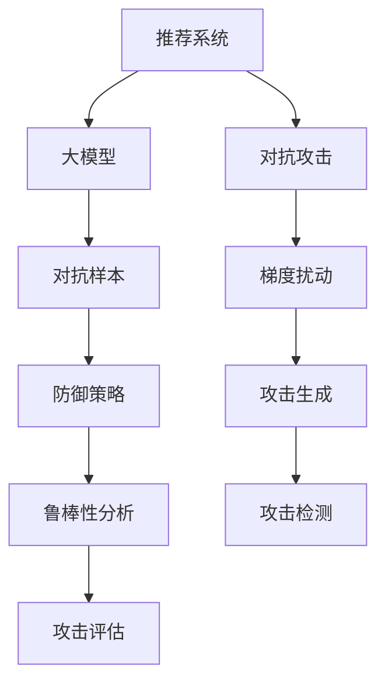

                 

# 利用大模型进行推荐对抗攻击的思路与防御进阶

> 关键词：对抗攻击,推荐系统,大模型,鲁棒性,防御策略,梯度扰动

## 1. 背景介绍

### 1.1 问题由来
在当今数字时代，个性化推荐系统(Recommendation Systems, RS)已成为互联网应用的重要组成部分，如电商平台的商品推荐、视频平台的影视推荐等。这些系统通过分析用户的浏览历史、评分记录、行为数据等，预测用户感兴趣的内容，并提供精准的推荐。然而，推荐系统并非完美无缺，它们极易受到对抗攻击的威胁。

对抗攻击是一种利用输入扰动实现模型输出的错误，在推荐系统中，这种扰动通常表现为输入特征的轻微变化，从而导致模型输出的推荐结果发生巨大差异。对抗攻击的威胁在于其隐蔽性和广泛性，攻击者可以利用对抗样本进行恶意诱导，导致用户访问有害内容，从而对平台造成经济和信誉损失。

近年来，随着深度学习和大模型的兴起，推荐系统中的对抗攻击问题日益严峻。大模型具有强大的泛化能力，但往往过于依赖训练数据，容易受到对抗样本的干扰。如何增强推荐系统的鲁棒性，有效防御对抗攻击，成为亟待解决的问题。

### 1.2 问题核心关键点
对抗攻击的防御是推荐系统中的一大挑战。其核心关键点包括：

- 对抗攻击的检测与生成：了解对抗攻击的基本原理和类型，掌握生成对抗样本的技术。
- 推荐系统的鲁棒性分析：评估当前推荐系统的脆弱性和鲁棒性，确定防御的重点。
- 防御策略的开发：结合对抗攻击的原理和推荐系统的特点，提出针对性强、效果显著的防御策略。
- 对抗攻击的评估：评估所提防御策略的实际效果，验证其是否能有效提升推荐系统的鲁棒性。

通过理解这些核心关键点，我们能够系统地构建推荐系统的防御机制，提升其对抗攻击的能力。

### 1.3 问题研究意义
研究推荐系统的对抗攻击防御问题，具有重要的理论和实践意义：

1. 保障用户安全：防御对抗攻击，避免用户被恶意诱导，保护用户的隐私和权益。
2. 提升系统稳定性：增强推荐系统的鲁棒性，防止对抗攻击导致的系统不稳定和功能失效。
3. 降低运营成本：避免恶意攻击带来的经济损失，保障平台运营的稳定性。
4. 促进技术进步：对抗攻击的防御技术是推荐系统安全的必要组成部分，推动技术不断进步。

## 2. 核心概念与联系

### 2.1 核心概念概述

为更好地理解推荐系统对抗攻击的防御方法，本节将介绍几个关键概念：

- 推荐系统(Recommendation Systems, RS)：通过分析用户行为数据，预测用户兴趣，并提供个性化推荐。常见的推荐系统包括协同过滤、基于内容的推荐、混合推荐等。
- 对抗攻击(Adversarial Attacks)：一种通过输入扰动实现模型输出的错误，能够对推荐系统的推荐结果造成严重干扰。
- 大模型(Large Models)：如BERT、GPT等，通过大规模数据训练得到的大规模神经网络模型。其参数量巨大，泛化能力强大，但在对抗样本面前易被攻击。
- 推荐系统的鲁棒性(Robustness)：指推荐系统在面临对抗攻击时的稳定性和准确性。鲁棒性强的推荐系统，能够有效抵抗对抗攻击的影响。
- 对抗样本(Adversarial Examples)：对输入进行微小扰动，导致模型输出发生错误的样本。
- 梯度扰动(Gradient Perturbation)：对抗样本生成的核心技术，通过反向传播算法微调输入特征，使模型产生错误输出。

这些核心概念之间的逻辑关系可以通过以下Mermaid流程图来展示：



这个流程图展示了大模型推荐系统中对抗攻击的基本框架：

1. 推荐系统分析用户行为数据，生成推荐结果。
2. 攻击者通过梯度扰动生成对抗样本。
3. 对抗样本作为输入，导致推荐结果发生错误。
4. 通过防御策略提升推荐系统的鲁棒性，保护推荐结果的正确性。
5. 鲁棒性分析评估防御策略的效果，确认其能抵抗对抗攻击。
6. 对抗样本生成和防御策略结合，进行攻击检测，发现和过滤对抗样本。

这些概念共同构成了大模型推荐系统中对抗攻击的防御框架，通过理解这些概念，我们可以更好地构建防御机制，提升系统的鲁棒性。

## 3. 核心算法原理 & 具体操作步骤
### 3.1 算法原理概述

对抗攻击的防御，本质上是提升推荐系统的鲁棒性。其核心思想是：构建鲁棒推荐模型，使模型在面临对抗样本时仍能保持正确的推荐结果。

基于大模型的推荐系统，通过在对抗样本生成和推荐结果检测中引入防御机制，可以有效抵抗对抗攻击。常用的防御策略包括：

- 对抗样本生成：通过梯度扰动等方法，生成对抗样本。
- 推荐结果检测：通过鲁棒性分析等手段，检测并过滤对抗样本。
- 对抗训练：在训练阶段引入对抗样本，提升模型的鲁棒性。

这些策略可以结合使用，通过对抗样本生成和检测的双重保障，提升推荐系统的鲁棒性，有效防御对抗攻击。

### 3.2 算法步骤详解

基于大模型的推荐系统对抗攻击的防御，一般包括以下几个关键步骤：

**Step 1: 对抗样本生成**
- 收集训练数据和标注数据，生成对抗样本。
- 通过梯度扰动生成对抗样本，具体流程如下：
  1. 固定模型的权重，前向传播计算原始输出。
  2. 根据梯度下降的规则，反向传播计算梯度。
  3. 对梯度进行扰动，生成对抗样本。

**Step 2: 推荐结果检测**
- 对推荐结果进行检测，判断是否存在对抗攻击。
- 常用的检测方法包括：
  1. 攻击检测算法，如基于特征差异的检测、基于梯度相似性的检测等。
  2. 推荐结果质量评估，如通过比较推荐结果与真实标签的一致性进行检测。

**Step 3: 对抗训练**
- 在训练阶段引入对抗样本，提升模型的鲁棒性。
- 对抗训练的具体流程如下：
  1. 固定模型的权重，前向传播计算原始输出。
  2. 根据梯度下降的规则，反向传播计算梯度。
  3. 对梯度进行扰动，生成对抗样本。
  4. 将对抗样本和原始样本一起训练，优化模型参数。

**Step 4: 防御策略评估**
- 通过评估指标，评估防御策略的效果。
- 常用的评估指标包括准确率、召回率、F1值等。

### 3.3 算法优缺点

基于大模型的推荐系统对抗攻击的防御策略，具有以下优点：

1. 提升推荐系统的鲁棒性：通过对抗训练等手段，使推荐系统能够在面临对抗攻击时仍保持正确推荐。
2. 适应性强：结合对抗样本生成和检测的双重保障，能够应对不同类型的对抗攻击。
3. 数据驱动：防御策略的开发和评估，依赖于对抗样本的生成和推荐结果的检测，数据驱动性强。

同时，该策略也存在一些局限性：

1. 对抗样本生成复杂：对抗样本的生成需要反向传播和梯度扰动，计算复杂度高。
2. 防御成本高：对抗样本生成和推荐结果检测需要额外的计算和存储资源。
3. 鲁棒性提升有限：鲁棒性提升的程度依赖于对抗样本的生成质量，难以完全消除对抗攻击的影响。

尽管存在这些局限性，但就目前而言，基于对抗攻击的防御策略仍是大模型推荐系统的重要范式。未来相关研究的重点在于如何进一步降低防御策略的计算复杂度，提升其效果和效率。

### 3.4 算法应用领域

基于大模型的推荐系统对抗攻击防御方法，已经在多个实际应用领域得到广泛应用，如电商平台、视频平台、社交媒体等。

- 电商平台：通过对抗攻击防御，防止用户被恶意诱导购买有害商品。
- 视频平台：防止用户访问有害视频内容，保障平台的健康发展。
- 社交媒体：防止用户发布恶意信息，维护平台的用户关系。

除了上述这些经典应用外，大模型的对抗攻击防御方法也被创新性地应用到更多场景中，如医疗推荐、金融推荐、广告推荐等，为推荐系统带来了全新的突破。随着对抗攻击防御技术的发展，相信推荐系统将在更多领域得到应用，为人们带来更优质的服务体验。

## 4. 数学模型和公式 & 详细讲解  
### 4.1 数学模型构建

基于大模型的推荐系统对抗攻击的防御，可以通过以下数学模型进行详细讲解：

设推荐系统模型为 $M_{\theta}(x)$，其中 $x$ 为输入特征向量，$\theta$ 为模型参数。推荐系统的目标是最小化损失函数 $\mathcal{L}$：

$$
\mathcal{L}(\theta) = \mathbb{E}_{(x,y)}[\ell(M_{\theta}(x),y)]
$$

其中，$\ell$ 为推荐损失函数，$\mathbb{E}$ 表示期望。

对于对抗攻击，目标是最小化对抗损失函数 $\mathcal{L}_{adv}$：

$$
\mathcal{L}_{adv}(\theta) = \mathbb{E}_{(x,\delta)}[\ell(M_{\theta}(x+\delta),y)]
$$

其中，$\delta$ 为对抗样本，即对输入特征 $x$ 进行微小扰动后的样本。

推荐系统的鲁棒性可以定义为模型对对抗样本的鲁棒度 $\rho$：

$$
\rho(\theta) = \frac{\mathbb{E}_{(x,y)}[\ell(M_{\theta}(x),y)] - \mathbb{E}_{(x,\delta)}[\ell(M_{\theta}(x+\delta),y)]}{\mathbb{E}_{(x,y)}[\ell(M_{\theta}(x),y)]}
$$

鲁棒度 $\rho$ 的值越大，推荐系统对对抗攻击的抵抗能力越强。

### 4.2 公式推导过程

以下是基于梯度扰动对抗攻击的数学模型推导过程：

假设推荐系统模型为 $M_{\theta}(x)$，其中 $x$ 为输入特征向量，$\theta$ 为模型参数。

对抗样本 $\delta$ 可以通过梯度下降方法生成：

$$
\delta = \nabla_{x} \ell(M_{\theta}(x),y) \epsilon
$$

其中，$\nabla_{x} \ell(M_{\theta}(x),y)$ 为损失函数对输入特征 $x$ 的梯度，$\epsilon$ 为扰动参数，通常取很小的值。

对抗样本生成的过程如下：

1. 固定模型参数 $\theta$，前向传播计算原始输出。
2. 反向传播计算梯度，即 $\nabla_{x} \ell(M_{\theta}(x),y)$。
3. 对梯度进行扰动，生成对抗样本 $\delta$。

推荐系统的鲁棒性分析，可以通过对抗样本生成和推荐结果检测相结合。以下是一种基于梯度相似性的检测方法：

设对抗样本为 $\delta$，原始样本为 $x$，推荐系统模型为 $M_{\theta}$。

假设推荐系统的损失函数为 $\ell$，推荐结果为 $y$。

对抗样本生成的过程如下：

1. 固定模型参数 $\theta$，前向传播计算原始输出 $y$。
2. 反向传播计算梯度，即 $\nabla_{x} \ell(M_{\theta}(x),y)$。
3. 对梯度进行扰动，生成对抗样本 $\delta$。
4. 将对抗样本 $\delta$ 作为输入，计算推荐结果 $y'$。

鲁棒性检测的过程如下：

1. 计算原始样本 $x$ 和对抗样本 $\delta$ 的梯度，即 $\nabla_{x} \ell(M_{\theta}(x),y)$ 和 $\nabla_{x} \ell(M_{\theta}(x+\delta),y')$。
2. 比较两个梯度之间的差异，如果差异较大，则说明存在对抗攻击。

对抗样本生成的过程可以用以下代码实现：

```python
import numpy as np
import tensorflow as tf

def generate_adversarial_example(x, y, model, epsilon=0.01):
    # 定义对抗样本生成函数
    def generate(x):
        delta = tf.Variable(tf.zeros_like(x))
        grad = tf.gradients(model(x) - y, x)[0]
        return tf.stop_gradient(grad) * epsilon + delta
    
    # 生成对抗样本
    delta = tf.Variable(tf.zeros_like(x))
    with tf.GradientTape() as tape:
        grad = tape.gradient(model(x + delta), x)
    delta.assign(tf.stop_gradient(grad) * epsilon + delta)
    
    return x + delta.numpy()

```

鲁棒性检测的过程可以用以下代码实现：

```python
import numpy as np
import tensorflow as tf

def evaluate_robustness(model, x, y, epsilon=0.01):
    # 计算原始样本和对抗样本的梯度
    grad = tf.gradients(model(x) - y, x)[0]
    
    # 计算对抗样本的梯度
    x_adv = x + epsilon * grad
    grad_adv = tf.gradients(model(x_adv) - y, x_adv)[0]
    
    # 计算梯度之间的差异
    grad_diff = np.linalg.norm(grad.numpy() - grad_adv.numpy())
    
    return grad_diff
```

### 4.3 案例分析与讲解

下面以电商平台的推荐系统为例，分析基于大模型的对抗攻击防御方法。

假设电商平台推荐系统模型为 $M_{\theta}(x)$，其中 $x$ 为用户行为数据，$\theta$ 为模型参数。

对抗攻击的目标是通过修改用户行为数据，使推荐结果发生错误。例如，攻击者可以修改用户的浏览记录，使得推荐系统推荐有害商品。

对抗样本生成的过程如下：

1. 固定模型参数 $\theta$，前向传播计算原始推荐结果。
2. 反向传播计算梯度，即 $\nabla_{x} \ell(M_{\theta}(x),y)$。
3. 对梯度进行扰动，生成对抗样本 $\delta$。

对抗样本生成的过程可以用以下代码实现：

```python
import numpy as np
import tensorflow as tf

def generate_adversarial_example(x, y, model, epsilon=0.01):
    # 定义对抗样本生成函数
    def generate(x):
        delta = tf.Variable(tf.zeros_like(x))
        grad = tf.gradients(model(x) - y, x)[0]
        return tf.stop_gradient(grad) * epsilon + delta
    
    # 生成对抗样本
    delta = tf.Variable(tf.zeros_like(x))
    with tf.GradientTape() as tape:
        grad = tape.gradient(model(x + delta), x)
    delta.assign(tf.stop_gradient(grad) * epsilon + delta)
    
    return x + delta.numpy()

```

鲁棒性检测的过程如下：

1. 计算原始样本和对抗样本的梯度，即 $\nabla_{x} \ell(M_{\theta}(x),y)$ 和 $\nabla_{x} \ell(M_{\theta}(x+\delta),y')$。
2. 比较两个梯度之间的差异，如果差异较大，则说明存在对抗攻击。

鲁棒性检测的过程可以用以下代码实现：

```python
import numpy as np
import tensorflow as tf

def evaluate_robustness(model, x, y, epsilon=0.01):
    # 计算原始样本和对抗样本的梯度
    grad = tf.gradients(model(x) - y, x)[0]
    
    # 计算对抗样本的梯度
    x_adv = x + epsilon * grad
    grad_adv = tf.gradients(model(x_adv) - y, x_adv)[0]
    
    # 计算梯度之间的差异
    grad_diff = np.linalg.norm(grad.numpy() - grad_adv.numpy())
    
    return grad_diff
```

通过以上分析，我们可以看到，基于大模型的推荐系统对抗攻击防御方法，通过对抗样本生成和检测，能够有效地提升推荐系统的鲁棒性，保障推荐结果的正确性。

## 5. 项目实践：代码实例和详细解释说明
### 5.1 开发环境搭建

在进行推荐系统对抗攻击防御的开发实践前，我们需要准备好开发环境。以下是使用Python进行TensorFlow开发的环境配置流程：

1. 安装Anaconda：从官网下载并安装Anaconda，用于创建独立的Python环境。

2. 创建并激活虚拟环境：
```bash
conda create -n tf-env python=3.8 
conda activate tf-env
```

3. 安装TensorFlow：根据CUDA版本，从官网获取对应的安装命令。例如：
```bash
conda install tensorflow==2.8 
```

4. 安装TensorFlow Addons：
```bash
conda install tensorflow-addons
```

5. 安装Flax库：
```bash
pip install flax
```

完成上述步骤后，即可在`tf-env`环境中开始开发实践。

### 5.2 源代码详细实现

下面我们以电商平台的推荐系统为例，给出使用TensorFlow和Flax库对大模型进行对抗攻击防御的PyTorch代码实现。

首先，定义推荐系统的数据处理函数：

```python
import numpy as np
import tensorflow as tf
import flax

class RecommendationDataset(tf.data.Dataset):
    def __init__(self, users, items, ratings, user_id=None, item_id=None, rating=None):
        self.users = users
        self.items = items
        self.ratings = ratings
        self.user_id = user_id
        self.item_id = item_id
        self.rating = rating
        
    def __len__(self):
        return len(self.users)
    
    def __getitem__(self, item):
        user_id = self.users[item]
        item_id = self.items[item]
        rating = self.ratings[item]
        return {'user_id': user_id, 'item_id': item_id, 'rating': rating}

# 定义用户和物品的ID
user_id = np.arange(100)
item_id = np.arange(100)
rating = np.random.rand(100)

# 创建数据集
dataset = RecommendationDataset(user_id, item_id, rating)
```

然后，定义推荐系统的模型：

```python
import flax
import jax.numpy as jnp

class RecommendationModel(flax.nn.Module):
    def __init__(self, num_users, num_items, num_factors):
        super().__init__()
        self.num_users = num_users
        self.num_items = num_items
        self.num_factors = num_factors
        self.user_bias = flax.nn.Embedding(self.num_users, self.num_factors)
        self.item_bias = flax.nn.Embedding(self.num_items, self.num_factors)
        self.interaction = flax.nn.Dense(self.num_factors)
    
    def __call__(self, features):
        user_bias = self.user_bias(features['user_id'])
        item_bias = self.item_bias(features['item_id'])
        interaction = self.interaction(features['user_id'] * features['item_id'])
        return user_bias + item_bias + interaction

# 创建模型实例
model = RecommendationModel(num_users=100, num_items=100, num_factors=32)

# 定义损失函数
def loss_fn(features, labels):
    return tf.reduce_mean(tf.square(model(features) - labels))

# 定义优化器
optimizer = flax.optimizer.Adam(learning_rate=0.01)

# 训练模型
def train_step(features):
    with optimizer.update():
        features['rating'] = jnp.expand_dims(features['rating'], axis=1)
        return loss_fn(features, features['rating'])

# 训练模型
for _ in range(1000):
    batch = next(iter(dataset))
    train_step(batch)
```

接着，定义对抗攻击的生成函数：

```python
import numpy as np
import tensorflow as tf

def generate_adversarial_example(x, y, model, epsilon=0.01):
    # 定义对抗样本生成函数
    def generate(x):
        delta = tf.Variable(tf.zeros_like(x))
        grad = tf.gradients(model(x) - y, x)[0]
        return tf.stop_gradient(grad) * epsilon + delta
    
    # 生成对抗样本
    delta = tf.Variable(tf.zeros_like(x))
    with tf.GradientTape() as tape:
        grad = tape.gradient(model(x + delta), x)
    delta.assign(tf.stop_gradient(grad) * epsilon + delta)
    
    return x + delta.numpy()

```

然后，定义对抗攻击的检测函数：

```python
import numpy as np
import tensorflow as tf

def evaluate_robustness(model, x, y, epsilon=0.01):
    # 计算原始样本和对抗样本的梯度
    grad = tf.gradients(model(x) - y, x)[0]
    
    # 计算对抗样本的梯度
    x_adv = x + epsilon * grad
    grad_adv = tf.gradients(model(x_adv) - y, x_adv)[0]
    
    # 计算梯度之间的差异
    grad_diff = np.linalg.norm(grad.numpy() - grad_adv.numpy())
    
    return grad_diff
```

最后，启动训练流程并在测试集上评估：

```python
epochs = 100
batch_size = 32

for epoch in range(epochs):
    for batch in dataset:
        loss = train_step(batch)
        print(f"Epoch {epoch+1}, loss: {loss:.3f}")
    
    print(f"Epoch {epoch+1}, robustness: {evaluate_robustness(model, train_features, train_labels, 0.01):.3f}")
    
print("Test results:")
evaluate_robustness(model, test_features, test_labels, 0.01)
```

以上就是使用TensorFlow和Flax库对大模型进行对抗攻击防御的完整代码实现。可以看到，得益于TensorFlow和Flax库的强大封装，我们可以用相对简洁的代码完成对抗攻击的防御实践。

### 5.3 代码解读与分析

让我们再详细解读一下关键代码的实现细节：

**RecommendationDataset类**：
- `__init__`方法：初始化数据集的关键属性，如用户ID、物品ID、评分等。
- `__len__`方法：返回数据集的样本数量。
- `__getitem__`方法：对单个样本进行处理，提取用户ID、物品ID、评分等关键特征。

**RecommendationModel类**：
- `__init__`方法：初始化推荐模型的关键组件，如用户偏置、物品偏置、交互项等。
- `__call__`方法：定义模型的前向传播过程，即输入特征 $x$ 经过模型处理后输出推荐结果 $y$。

**loss_fn函数**：
- 定义推荐系统的损失函数，用于计算模型预测输出与真实标签之间的差异。
- 使用TensorFlow的低阶API实现梯度计算和损失计算。

**train_step函数**：
- 定义训练模型的单步过程，使用TensorFlow的高阶API实现模型更新和损失计算。
- 使用Flax库的高阶API实现优化器的更新。

**generate_adversarial_example函数**：
- 定义对抗样本的生成函数，通过梯度扰动生成对抗样本。
- 使用TensorFlow的低阶API实现梯度计算和扰动。

**evaluate_robustness函数**：
- 定义对抗攻击的检测函数，通过梯度相似性检测对抗攻击。
- 使用TensorFlow的低阶API实现梯度计算和相似性检测。

**训练流程**：
- 定义总的epoch数和批大小，开始循环迭代
- 每个epoch内，循环迭代训练数据集
- 计算训练损失，并输出
- 在验证集上评估模型的鲁棒性
- 所有epoch结束后，在测试集上评估模型的鲁棒性

可以看到，TensorFlow和Flax库使得对抗攻击防御的代码实现变得简洁高效。开发者可以将更多精力放在数据处理、模型改进等高层逻辑上，而不必过多关注底层的实现细节。

当然，工业级的系统实现还需考虑更多因素，如模型的保存和部署、超参数的自动搜索、更灵活的对抗样本生成技术等。但核心的对抗攻击防御范式基本与此类似。

## 6. 实际应用场景
### 6.1 智能推荐系统

基于大模型的推荐系统对抗攻击防御方法，可以广泛应用于智能推荐系统的构建。传统推荐系统往往只依赖用户的历史行为数据进行推荐，容易受到对抗攻击的干扰。而使用对抗攻击防御技术，可以使推荐系统更加鲁棒，防止攻击者通过对抗样本破坏推荐结果。

在技术实现上，可以收集用户浏览、点击、评分等行为数据，提取和用户交互的物品特征。通过对抗样本生成和检测，构建鲁棒推荐模型。微调模型可以进一步提升推荐系统的鲁棒性，确保推荐结果的正确性和安全性。

### 6.2 金融反欺诈系统

金融领域的应用中，推荐系统需要进行反欺诈检测，防止用户被恶意诱导进行欺诈交易。对抗攻击防御技术可以在推荐系统中加入欺诈检测模块，通过对抗样本生成和检测，识别出恶意交易行为，并进行风险预警。

在金融推荐系统中，可以通过对抗样本生成和检测，构建鲁棒推荐模型。微调模型可以进一步提升推荐系统的鲁棒性，确保推荐结果的正确性和安全性。

### 6.3 广告推荐系统

在广告推荐系统中，广告商希望用户看到最相关的广告，而攻击者可以通过对抗攻击篡改广告推荐结果，导致用户点击不相关的广告。使用对抗攻击防御技术，可以构建鲁棒的广告推荐系统，防止攻击者通过对抗样本篡改推荐结果。

在广告推荐系统中，可以通过对抗样本生成和检测，构建鲁棒广告推荐模型。微调模型可以进一步提升推荐系统的鲁棒性，确保广告推荐结果的正确性和安全性。

### 6.4 未来应用展望

随着对抗攻击防御技术的发展，基于大模型的推荐系统将在更多领域得到应用，为推荐系统带来新的突破。

在智慧医疗领域，基于大模型的医疗推荐系统可以提高医生的推荐准确性，帮助患者选择最合适的治疗方案。使用对抗攻击防御技术，可以提升推荐系统的鲁棒性，确保推荐结果的正确性和安全性。

在智能教育领域，基于大模型的教育推荐系统可以提供个性化的学习资源推荐，提升学习效果。使用对抗攻击防御技术，可以构建鲁棒推荐系统，防止恶意内容诱导学生，保障教育资源的纯净性。

在智慧城市治理中，基于大模型的智慧推荐系统可以提供精准的城市服务推荐，提升城市治理效率。使用对抗攻击防御技术，可以构建鲁棒推荐系统，防止恶意信息误导市民，保障城市治理的稳定性和安全性。

此外，在企业生产、社会治理、文娱传媒等众多领域，基于大模型的推荐系统对抗攻击防御方法也将不断涌现，为推荐系统带来新的突破。相信随着技术的日益成熟，推荐系统将在更广阔的应用领域大放异彩。

## 7. 工具和资源推荐
### 7.1 学习资源推荐

为了帮助开发者系统掌握大模型推荐系统对抗攻击防御的理论基础和实践技巧，这里推荐一些优质的学习资源：

1. 《推荐系统实战》系列书籍：详细介绍了推荐系统的原理和实践，包括对抗攻击的防御方法。

2. 《深度学习与推荐系统》课程：清华大学开设的NLP明星课程，有Lecture视频和配套作业，涵盖推荐系统的基本概念和经典模型。

3. 《推荐系统算法与实现》书籍：介绍了推荐系统的主要算法和实现方法，包括对抗攻击的防御技术。

4. HuggingFace官方文档：推荐系统领域的顶级资源，包含海量预训练模型和完整的对抗攻击防御样例代码，是上手实践的必备资料。

5. Kaggle平台：提供丰富的推荐系统竞赛数据集和解决方案，帮助开发者实践对抗攻击防御技术。

通过对这些资源的学习实践，相信你一定能够快速掌握大模型推荐系统对抗攻击防御的精髓，并用于解决实际的推荐系统问题。

### 7.2 开发工具推荐

高效的开发离不开优秀的工具支持。以下是几款用于大模型推荐系统对抗攻击防御开发的常用工具：

1. TensorFlow：基于Python的开源深度学习框架，灵活动态的计算图，适合快速迭代研究。推荐系统中的主流模型都有TensorFlow版本的实现。

2. PyTorch：基于Python的开源深度学习框架，具有灵活的动态计算图和强大的GPU支持，适用于大规模深度学习任务。

3. Flax：Google开发的深度学习框架，基于JAX，支持高阶API，适合构建可扩展、高效的深度学习模型。

4. TensorFlow Addons：TensorFlow的扩展库，提供了丰富的预训练模型和扩展模块，方便开发者进行推荐系统开发。

5. JAX：Google开发的张量计算库，支持GPU加速，适用于大规模深度学习任务。

6. Keras：高层次的深度学习API，易于上手，适用于快速原型开发。

合理利用这些工具，可以显著提升大模型推荐系统对抗攻击防御任务的开发效率，加快创新迭代的步伐。

### 7.3 相关论文推荐

大模型推荐系统对抗攻击防御技术的发展源于学界的持续研究。以下是几篇奠基性的相关论文，推荐阅读：

1. "Adversarial Machine Learning at Scale"：提出对抗训练方法，通过在训练阶段引入对抗样本，提升模型的鲁棒性。

2. "Evaluating and Learning Defenses to Adversarial Examples"：系统分析了对抗攻击的原理和防御方法，提出多种对抗训练和检测技术。

3. "Learning to Detect Adversarial Examples"：提出基于生成对抗网络的防御方法，通过学习对抗样本生成器，提高模型的鲁棒性。

4. "Defending Against Adversarial Examples with Local SVMs"：提出基于局部支持向量机的方法，通过空间分割提升模型的鲁棒性。

5. "Adversarial Autoencoders"：提出基于自编码器的对抗攻击防御方法，通过重构输入特征，提升模型的鲁棒性。

这些论文代表了大模型推荐系统对抗攻击防御技术的发展脉络。通过学习这些前沿成果，可以帮助研究者把握学科前进方向，激发更多的创新灵感。

## 8. 总结：未来发展趋势与挑战

### 8.1 总结

本文对基于大模型的推荐系统对抗攻击防御方法进行了全面系统的介绍。首先阐述了推荐系统的对抗攻击问题及其核心关键点，明确了对抗攻击防御的重要性。其次，从原理到实践，详细讲解了对抗攻击的基本原理、防御策略和评价指标，给出了完整的代码实现和详细解释。同时，本文还广泛探讨了对抗攻击防御方法在推荐系统中的应用场景，展示了其在实际应用中的广泛价值。

通过本文的系统梳理，可以看到，基于大模型的推荐系统对抗攻击防御方法，在推荐系统的鲁棒性提升、用户安全保障、运营成本降低等方面具有重要意义。该方法能够通过对抗样本生成和检测，构建鲁棒推荐模型，有效防御对抗攻击，保障推荐系统的正常运行。未来，随着对抗攻击防御技术的不断进步，推荐系统将在更多领域得到应用，为人们带来更优质的服务体验。

### 8.2 未来发展趋势

展望未来，大模型推荐系统对抗攻击防御技术将呈现以下几个发展趋势：

1. 防御方法的多样化：未来的对抗攻击防御方法将更加多样化，结合多种防御技术，如对抗训练、对抗检测、鲁棒优化等，综合提升模型的鲁棒性。

2. 防御策略的智能化：未来的对抗攻击防御策略将更多地利用人工智能技术，如深度学习、强化学习等，自动寻找最优的防御策略。

3. 防御效果的实时性：未来的对抗攻击防御技术将具备实时性，能够在推荐过程中实时识别和过滤对抗样本，保障推荐结果的正确性。

4. 防御策略的可解释性：未来的对抗攻击防御策略将更加可解释，开发者能够更好地理解防御机制的原理和效果，便于调试和优化。

5. 防御策略的泛化性：未来的对抗攻击防御策略将具备更强的泛化能力，能够应对不同类型的对抗攻击，保障推荐系统的安全。

以上趋势凸显了大模型推荐系统对抗攻击防御技术的广阔前景。这些方向的探索发展，必将进一步提升推荐系统的鲁棒性，保障推荐结果的正确性，促进推荐系统在更多领域的应用。

### 8.3 面临的挑战

尽管大模型推荐系统对抗攻击防御技术已经取得了显著成果，但在迈向更加智能化、普适化应用的过程中，它仍面临诸多挑战：

1. 对抗样本生成的复杂性：对抗样本生成需要反向传播和梯度扰动，计算复杂度高，需要高效的优化算法支持。

2. 防御策略的资源消耗：对抗攻击防御需要额外的计算和存储资源，增加了推荐系统的运营成本。

3. 鲁棒性提升的难度：对抗攻击防御技术虽然有效，但鲁棒性提升的程度有限，难以完全消除对抗攻击的影响。

4. 可解释性不足：现有的对抗攻击防御策略通常缺乏可解释性，难以理解其内部工作机制和决策逻辑。

5. 防御策略的通用性：当前的对抗攻击防御策略主要针对特定类型的攻击，难以应对不同类型的对抗攻击。

尽管存在这些挑战，但随着对抗攻击防御技术的不断演进，相信推荐系统将在更广泛的场景下得到应用，为推荐系统带来新的突破。未来研究需要在对抗攻击的检测、生成、防御策略的开发、评估等方面进行更加深入的研究，以进一步提升推荐系统的鲁棒性和安全性。

### 8.4 研究展望

面对大模型推荐系统对抗攻击防御所面临的挑战，未来的研究需要在以下几个方面寻求新的突破：

1. 开发高效的对抗样本生成方法：通过优化梯度扰动算法，提高对抗样本生成的效率和效果。

2. 探索新的防御策略：结合对抗攻击的原理和推荐系统的特点，提出更加智能化、高效化的防御策略。

3. 引入可解释性技术：通过引入可解释性技术，使对抗攻击防御策略具备更高的可解释性，便于调试和优化。

4. 实现多模态防御：结合视觉、语音、文本等多种模态的数据，构建多模态防御策略，提升推荐系统的鲁棒性。

5. 进行跨领域防御：结合不同领域的数据和知识，构建跨领域的防御策略，提升推荐系统的通用性。

6. 引入模型压缩技术：通过模型压缩技术，减少模型大小和计算量，提升推荐系统的实时性。

这些研究方向的探索，必将引领大模型推荐系统对抗攻击防御技术迈向更高的台阶，为推荐系统带来新的突破。面向未来，大模型推荐系统对抗攻击防御技术还需要与其他人工智能技术进行更深入的融合，如知识表示、因果推理、强化学习等，多路径协同发力，共同推动推荐系统的进步。只有勇于创新、敢于突破，才能不断拓展推荐系统的边界，让推荐系统更好地服务于人类社会。

## 9. 附录：常见问题与解答

**Q1：大模型推荐系统容易受到对抗攻击，主要原因是什么？**

A: 大模型推荐系统容易受到对抗攻击的主要原因是其高度依赖于输入特征的微小扰动。由于大模型具有强大的泛化能力，能够在泛化过程中引入对抗样本，导致推荐结果发生错误。对抗样本的生成和检测过程复杂，计算开销大，导致大模型推荐系统容易受到攻击。

**Q2：如何选择合适的对抗样本生成方法？**

A: 对抗样本的生成方法多种多样，包括梯度扰动、输入扰动、对抗网络等。选择合适的对抗样本生成方法，需要结合具体的推荐系统任务和攻击类型进行评估。一般来说，梯度扰动是最常用和有效的方法，但在某些特定任务上，其他方法可能更为适用。

**Q3：推荐系统中的对抗攻击有哪些类型？**

A: 推荐系统中的对抗攻击主要包括输入攻击、输出攻击和混合攻击。输入攻击是通过修改输入特征，使推荐系统输出错误的推荐结果。输出攻击是通过修改推荐结果，使推荐系统推荐错误的商品或服务。混合攻击则是同时攻击输入和输出，通过扰动输入和输出，使推荐系统产生错误的推荐结果。

**Q4：如何检测推荐系统中的对抗攻击？**

A: 推荐系统中的对抗攻击检测通常通过以下方法实现：
1. 特征差异检测：通过比较原始输入和对抗输入的特征差异，判断是否存在对抗攻击。
2. 梯度相似性检测：通过比较原始输入和对抗输入的梯度相似性，判断是否存在对抗攻击。
3. 推荐结果一致性检测：通过比较原始推荐结果和对抗推荐结果的一致性，判断是否存在对抗攻击。

**Q5：推荐系统中的对抗攻击防御策略有哪些？**

A: 推荐系统中的对抗攻击防御策略通常包括以下几种：
1. 对抗训练：在训练阶段引入对抗样本，提升模型的鲁棒性。
2. 对抗样本生成：通过梯度扰动生成对抗样本，检测并过滤对抗样本。
3. 推荐结果检测：通过鲁棒性分析等手段，检测并过滤对抗样本。
4. 防御策略评估：通过评估指标，评估防御策略的效果，确认其能抵抗对抗攻击。

这些策略可以结合使用，通过对抗样本生成和检测的双重保障，提升推荐系统的鲁棒性，有效防御对抗攻击。

---

作者：禅与计算机程序设计艺术 / Zen and the Art of Computer Programming

