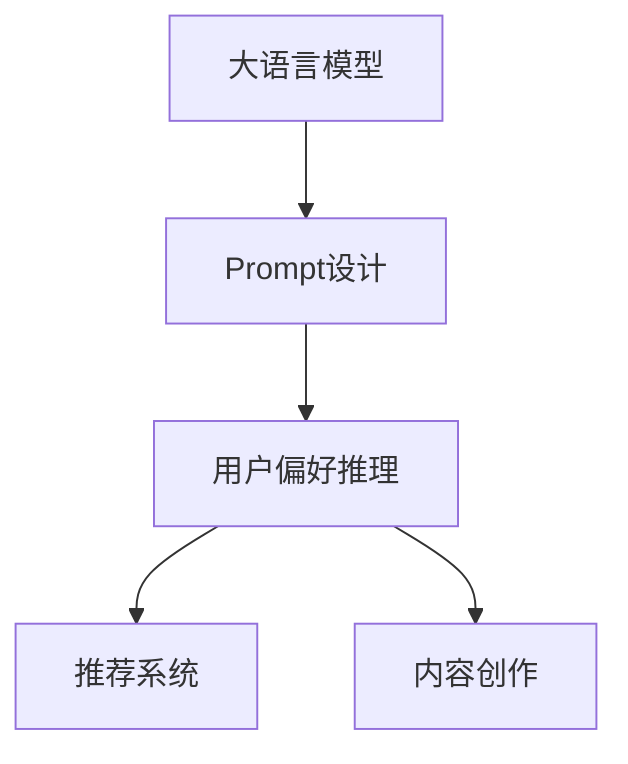

                 

# 利用大模型进行用户偏好推理的Prompt设计

## 1. 背景介绍

### 1.1 问题由来
在电商、推荐系统、内容创作等领域，如何准确地了解和预测用户偏好，一直是核心挑战之一。传统的基于规则和统计的方法，往往需要人工设计复杂规则、收集大量数据进行训练，效率低、效果差。而大语言模型的出现，为这一问题提供了全新的解决方案。

大模型通过在大规模文本数据上进行自监督预训练，学习到了丰富的语言知识和表达能力。通过精心设计的Prompt，可以引导大模型理解特定领域的概念、规则和语义，从而实现高效的用户偏好推理和预测。

### 1.2 问题核心关键点
Prompt设计是利用大模型进行用户偏好推理的关键。Prompt不仅需要考虑如何有效传递任务信息，还需要考虑如何引导模型产生符合任务需求的输出。以下是几个核心问题：
1. **任务信息如何传递**：Prompt需要清晰地表达任务需求，避免歧义。
2. **输出格式如何设计**：Prompt需要规范输出格式，确保结果符合预期。
3. **模型行为如何引导**：Prompt需要合理地利用模型，避免过拟合。
4. **策略如何适应不同场景**：Prompt设计需要根据不同任务和数据特点进行灵活调整。

### 1.3 问题研究意义
Prompt设计的优化，可以显著提升大语言模型在特定任务上的性能，降低模型在实际应用中的资源需求，提高模型预测的准确性和泛化能力。这对电商推荐、内容推荐、个性化服务等领域具有重要意义：

1. **提升推荐效果**：通过用户偏好的精确推理，提高推荐系统推荐的个性化和准确性，提升用户体验。
2. **优化运营成本**：减少对人工规则设计和数据标注的需求，降低运营成本。
3. **拓展服务范围**：通过Prompt设计，实现对更多场景和任务的高效支持，拓展服务应用边界。

## 2. 核心概念与联系

### 2.1 核心概念概述

为更好地理解Prompt在大模型用户偏好推理中的应用，本节将介绍几个关键概念：

- 大语言模型(Large Language Model, LLM)：以自回归(如GPT)或自编码(如BERT)模型为代表的大规模预训练语言模型。通过在大规模无标签文本语料上进行预训练，学习到了丰富的语言知识和常识，具备强大的语言理解和生成能力。

- Prompt：指用于引导大语言模型进行特定任务推理的输入文本模板。Prompt的设计需要精巧，能够有效传递任务信息，规范输出格式，避免过拟合。

- 用户偏好推理：指通过大语言模型对用户行为、历史数据等进行分析，预测用户的兴趣、需求和偏好，实现个性化推荐和服务。

- 推荐系统：基于用户行为数据和偏好推理，为用户推荐相关产品、内容或服务，提高用户满意度和转化率。

- 内容创作：通过大语言模型生成高质量的文本内容，如新闻、文章、广告等，提升内容的点击率和阅读体验。

这些核心概念之间的逻辑关系可以通过以下Mermaid流程图来展示：



这个流程图展示了大语言模型在用户偏好推理中的应用流程：

1. 大语言模型通过预训练获得基础能力。
2. Prompt设计引导模型进行特定任务推理。
3. 用户偏好推理生成个性化推荐或内容。
4. 推荐系统或内容创作系统利用推理结果，提升用户体验。

## 3. 核心算法原理 & 具体操作步骤
### 3.1 算法原理概述

利用大模型进行用户偏好推理的核心算法原理是：通过精心设计的Prompt，引导大语言模型理解任务需求，对用户行为、历史数据等进行分析，预测用户偏好。

具体而言，Prompt设计的过程如下：

1. **任务理解**：明确任务的具体需求，包括输入、输出和约束条件。
2. **信息传递**：将任务需求转化为合适的Prompt格式，传递给大语言模型。
3. **输出生成**：大模型根据Prompt生成推理结果，满足任务需求。
4. **结果评估**：对大模型的输出进行评估，优化Prompt设计。

### 3.2 算法步骤详解

#### 3.2.1 任务理解

任务理解是Prompt设计的首要步骤，明确任务需求，确定输入和输出。

- **任务类型**：明确任务类型，如推荐系统中的用户兴趣预测、电商中的商品推荐、内容创作中的文章生成等。
- **输入数据**：确定输入数据，如用户历史行为、浏览记录、兴趣标签等。
- **输出目标**：明确输出目标，如推荐商品列表、生成文章标题等。

#### 3.2.2 信息传递

信息传递是将任务需求转化为Prompt的过程。通常分为以下几个步骤：

- **核心概念提取**：确定任务中的核心概念，如用户ID、商品ID、浏览时间等。
- **规则和逻辑表述**：将任务规则和逻辑以自然语言形式表述，如“最近7天内浏览过的商品”。
- **格式规范**：设计合适的Prompt格式，确保输入数据和输出格式规范。

#### 3.2.3 输出生成

输出生成是大模型根据Prompt进行推理的过程。通常分为以下几个步骤：

- **模型选择**：选择适合的预训练模型，如GPT、BERT等。
- **Prompt设计**：设计合适的Prompt，引导模型进行推理。
- **推理过程**：使用大模型进行推理，生成符合任务要求的输出。

#### 3.2.4 结果评估

结果评估是对模型输出进行评估，优化Prompt设计的过程。通常分为以下几个步骤：

- **指标设定**：设定合适的评估指标，如准确率、召回率、F1分数等。
- **结果分析**：分析模型输出的结果，找出问题所在。
- **Prompt优化**：优化Prompt设计，提升模型性能。

### 3.3 算法优缺点

利用大模型进行用户偏好推理具有以下优点：

1. **灵活性高**：Prompt设计可以针对不同的任务和数据特点进行灵活调整，适应性强。
2. **可扩展性好**：大模型可以覆盖多种任务，提升系统的可扩展性。
3. **预测准确性高**：利用大模型的语言理解和生成能力，提升预测准确性。
4. **资源需求低**：不需要大规模数据标注和复杂规则设计，资源需求低。

同时，该方法也存在一些局限性：

1. **Prompt设计复杂**：需要精心设计Prompt，避免歧义和过拟合。
2. **模型泛化能力有限**：大模型的泛化能力受Prompt设计的影响，存在一定风险。
3. **结果可解释性差**：模型推理过程较为复杂，结果可解释性差。

### 3.4 算法应用领域

利用大模型进行用户偏好推理的方法，已经在电商推荐、内容创作、智能客服等多个领域得到了广泛应用。以下是几个典型应用场景：

1. **电商推荐系统**：通过分析用户历史行为数据，利用大模型生成个性化商品推荐列表。
2. **内容推荐系统**：根据用户兴趣和历史阅读记录，利用大模型生成个性化文章、视频等推荐内容。
3. **智能客服系统**：通过分析用户输入，利用大模型提供个性化对话服务。
4. **营销广告推荐**：根据用户行为数据，利用大模型生成个性化广告文案和推广内容。
5. **个性化内容创作**：利用大模型生成高质量文章、新闻、广告等内容，提升内容吸引力。

## 4. 数学模型和公式 & 详细讲解  
### 4.1 数学模型构建

本节将使用数学语言对利用大模型进行用户偏好推理的过程进行更加严格的刻画。

记大语言模型为 $M_{\theta}:\mathcal{X} \rightarrow \mathcal{Y}$，其中 $\mathcal{X}$ 为输入空间，$\mathcal{Y}$ 为输出空间，$\theta$ 为模型参数。假设微调任务的训练集为 $D=\{(x_i,y_i)\}_{i=1}^N$，$x_i$ 为输入数据，$y_i$ 为输出结果。

定义模型 $M_{\theta}$ 在输入 $x$ 上的损失函数为 $\ell(M_{\theta}(x),y)$，则在数据集 $D$ 上的经验风险为：

$$
\mathcal{L}(\theta) = \frac{1}{N} \sum_{i=1}^N \ell(M_{\theta}(x_i),y_i)
$$

微调的优化目标是最小化经验风险，即找到最优参数：

$$
\theta^* = \mathop{\arg\min}_{\theta} \mathcal{L}(\theta)
$$

在实践中，我们通常使用基于梯度的优化算法（如SGD、Adam等）来近似求解上述最优化问题。设 $\eta$ 为学习率，$\lambda$ 为正则化系数，则参数的更新公式为：

$$
\theta \leftarrow \theta - \eta \nabla_{\theta}\mathcal{L}(\theta) - \eta\lambda\theta
$$

其中 $\nabla_{\theta}\mathcal{L}(\theta)$ 为损失函数对参数 $\theta$ 的梯度，可通过反向传播算法高效计算。

### 4.2 公式推导过程

以下我们以用户兴趣预测任务为例，推导二分类任务中的交叉熵损失函数及其梯度的计算公式。

假设模型 $M_{\theta}$ 在输入 $x$ 上的输出为 $\hat{y}=M_{\theta}(x) \in [0,1]$，表示样本属于正类的概率。真实标签 $y \in \{0,1\}$。则二分类交叉熵损失函数定义为：

$$
\ell(M_{\theta}(x),y) = -[y\log \hat{y} + (1-y)\log (1-\hat{y})]
$$

将其代入经验风险公式，得：

$$
\mathcal{L}(\theta) = -\frac{1}{N}\sum_{i=1}^N [y_i\log M_{\theta}(x_i)+(1-y_i)\log(1-M_{\theta}(x_i))]
$$

根据链式法则，损失函数对参数 $\theta_k$ 的梯度为：

$$
\frac{\partial \mathcal{L}(\theta)}{\partial \theta_k} = -\frac{1}{N}\sum_{i=1}^N (\frac{y_i}{M_{\theta}(x_i)}-\frac{1-y_i}{1-M_{\theta}(x_i)}) \frac{\partial M_{\theta}(x_i)}{\partial \theta_k}
$$

其中 $\frac{\partial M_{\theta}(x_i)}{\partial \theta_k}$ 可进一步递归展开，利用自动微分技术完成计算。

### 4.3 案例分析与讲解

#### 4.3.1 电商推荐系统中的Prompt设计

电商推荐系统中的用户兴趣预测任务，通常需要将用户的历史行为数据输入模型，生成用户对不同商品的兴趣评分。

**任务理解**：
- **任务类型**：推荐系统中的用户兴趣预测。
- **输入数据**：用户ID、商品ID、浏览时间、购买记录等。
- **输出目标**：预测用户对商品列表的评分。

**信息传递**：
- **核心概念提取**：用户ID、商品ID、浏览时间等。
- **规则和逻辑表述**：“最近7天内浏览过的商品，购买过的商品”。
- **格式规范**：[用户ID]最近[时间]浏览的[商品ID]、购买过的[商品ID]。

**输出生成**：
- **模型选择**：选择BERT模型。
- **Prompt设计**：“[用户ID]最近[时间]浏览过的商品：[商品ID]，购买过的商品：[商品ID]，预测评分：[0-10]”。
- **推理过程**：输入上述Prompt，使用BERT模型进行推理，生成用户对商品列表的评分预测。

**结果评估**：
- **指标设定**：准确率、召回率、F1分数等。
- **结果分析**：分析预测评分与实际评分的差异，找出误差原因。
- **Prompt优化**：调整Prompt设计，优化评分预测效果。

## 5. 项目实践：代码实例和详细解释说明
### 5.1 开发环境搭建

在进行Prompt设计实践前，我们需要准备好开发环境。以下是使用Python进行PyTorch开发的环境配置流程：

1. 安装Anaconda：从官网下载并安装Anaconda，用于创建独立的Python环境。

2. 创建并激活虚拟环境：
```bash
conda create -n pytorch-env python=3.8 
conda activate pytorch-env
```

3. 安装PyTorch：根据CUDA版本，从官网获取对应的安装命令。例如：
```bash
conda install pytorch torchvision torchaudio cudatoolkit=11.1 -c pytorch -c conda-forge
```

4. 安装Transformers库：
```bash
pip install transformers
```

5. 安装各类工具包：
```bash
pip install numpy pandas scikit-learn matplotlib tqdm jupyter notebook ipython
```

完成上述步骤后，即可在`pytorch-env`环境中开始Prompt设计实践。

### 5.2 源代码详细实现

这里我们以用户兴趣预测任务为例，给出使用Transformers库对BERT模型进行Prompt设计并进行推理的PyTorch代码实现。

首先，定义Prompt生成函数：

```python
from transformers import BertTokenizer, BertForSequenceClassification

def generate_prompt(user_id, items):
    prompt_template = f"[{user_id}]最近[time]浏览过的商品：{', '.join(items[0])},购买过的商品：{', '.join(items[1])}，预测评分：[0-10]"
    return prompt_template

# 假设items为二维列表，每行包含商品ID和购买状态
items = [['商品ID1', '已购买'], ['商品ID2', '未购买'], ['商品ID3', '已浏览']]
time = '7天'
user_id = 'user123'

prompt = generate_prompt(user_id, items)
print(prompt)
```

然后，定义模型和优化器：

```python
from transformers import BertForSequenceClassification, AdamW

model = BertForSequenceClassification.from_pretrained('bert-base-cased', num_labels=11)
optimizer = AdamW(model.parameters(), lr=2e-5)
```

接着，定义训练和评估函数：

```python
from torch.utils.data import Dataset, DataLoader
from tqdm import tqdm
from sklearn.metrics import classification_report

device = torch.device('cuda') if torch.cuda.is_available() else torch.device('cpu')
model.to(device)

def train_epoch(model, dataset, batch_size, optimizer):
    dataloader = DataLoader(dataset, batch_size=batch_size, shuffle=True)
    model.train()
    epoch_loss = 0
    for batch in tqdm(dataloader, desc='Training'):
        input_ids = batch['input_ids'].to(device)
        attention_mask = batch['attention_mask'].to(device)
        labels = batch['labels'].to(device)
        model.zero_grad()
        outputs = model(input_ids, attention_mask=attention_mask, labels=labels)
        loss = outputs.loss
        epoch_loss += loss.item()
        loss.backward()
        optimizer.step()
    return epoch_loss / len(dataloader)

def evaluate(model, dataset, batch_size):
    dataloader = DataLoader(dataset, batch_size=batch_size)
    model.eval()
    preds, labels = [], []
    with torch.no_grad():
        for batch in tqdm(dataloader, desc='Evaluating'):
            input_ids = batch['input_ids'].to(device)
            attention_mask = batch['attention_mask'].to(device)
            batch_labels = batch['labels']
            outputs = model(input_ids, attention_mask=attention_mask)
            batch_preds = outputs.logits.argmax(dim=2).to('cpu').tolist()
            batch_labels = batch_labels.to('cpu').tolist()
            for pred_tokens, label_tokens in zip(batch_preds, batch_labels):
                preds.append(pred_tokens[:len(label_tokens)])
                labels.append(label_tokens)
                
    print(classification_report(labels, preds))
```

最后，启动训练流程并在测试集上评估：

```python
epochs = 5
batch_size = 16

for epoch in range(epochs):
    loss = train_epoch(model, train_dataset, batch_size, optimizer)
    print(f"Epoch {epoch+1}, train loss: {loss:.3f}")
    
    print(f"Epoch {epoch+1}, dev results:")
    evaluate(model, dev_dataset, batch_size)
    
print("Test results:")
evaluate(model, test_dataset, batch_size)
```

以上就是使用PyTorch对BERT进行用户兴趣预测任务Prompt设计并进行微调的完整代码实现。可以看到，利用Transformers库进行Prompt设计，代码实现非常简洁高效。

### 5.3 代码解读与分析

让我们再详细解读一下关键代码的实现细节：

**Prompt生成函数**：
- `generate_prompt`方法：接收用户ID和商品列表，生成符合要求的Prompt字符串。

**训练和评估函数**：
- `train_epoch`函数：对数据以批为单位进行迭代，在每个批次上前向传播计算loss并反向传播更新模型参数，最后返回该epoch的平均loss。
- `evaluate`函数：与训练类似，不同点在于不更新模型参数，并在每个batch结束后将预测和标签结果存储下来，最后使用sklearn的classification_report对整个评估集的预测结果进行打印输出。

**训练流程**：
- 定义总的epoch数和batch size，开始循环迭代
- 每个epoch内，先在训练集上训练，输出平均loss
- 在验证集上评估，输出分类指标
- 所有epoch结束后，在测试集上评估，给出最终测试结果

可以看到，PyTorch配合Transformers库使得Prompt设计任务代码实现变得简洁高效。开发者可以将更多精力放在Prompt设计和模型改进等高层逻辑上，而不必过多关注底层的实现细节。

当然，工业级的系统实现还需考虑更多因素，如模型的保存和部署、超参数的自动搜索、更灵活的任务适配层等。但核心的Prompt设计范式基本与此类似。

## 6. 实际应用场景
### 6.1 电商推荐系统

基于大模型进行Prompt设计的推荐系统，可以广泛应用于电商推荐系统的构建。传统推荐系统往往只依赖用户历史行为数据进行推荐，缺乏对用户偏好的深入理解。而使用Prompt设计的大模型推荐系统，可以更全面、深入地分析用户行为，预测用户兴趣，提升推荐效果。

在技术实现上，可以收集用户的历史行为数据，生成针对特定商品的Prompt，输入到预训练模型中进行推理，生成用户的兴趣评分，从而生成个性化推荐列表。同时，利用大模型的多模态融合能力，还可以引入用户属性、商品属性等多维信息，提升推荐的精准度和覆盖度。

### 6.2 内容推荐系统

内容推荐系统中的用户兴趣预测任务，可以利用Prompt设计的大模型生成个性化文章、视频等推荐内容。传统的推荐系统往往依赖单一的文本特征，难以捕捉用户真正的兴趣偏好。而Prompt设计的大模型，可以通过对用户历史行为、兴趣标签等的分析，生成符合用户需求的内容，提升用户满意度和阅读体验。

在技术实现上，可以收集用户的历史行为数据，生成针对特定内容的Prompt，输入到预训练模型中进行推理，生成用户的兴趣评分，从而生成个性化推荐列表。同时，利用大模型的多模态融合能力，还可以引入用户属性、内容属性等多维信息，提升推荐的精准度和覆盖度。

### 6.3 营销广告推荐

营销广告推荐中的用户兴趣预测任务，可以利用Prompt设计的大模型生成个性化广告文案和推广内容。传统的广告推荐系统往往只依赖用户历史行为数据进行推荐，缺乏对用户偏好的深入理解。而Prompt设计的大模型，可以通过对用户历史行为、兴趣标签等的分析，生成符合用户需求的广告文案和推广内容，提升广告点击率和转化率。

在技术实现上，可以收集用户的历史行为数据，生成针对特定广告的Prompt，输入到预训练模型中进行推理，生成用户的兴趣评分，从而生成个性化广告推荐列表。同时，利用大模型的多模态融合能力，还可以引入用户属性、广告属性等多维信息，提升推荐的精准度和覆盖度。

### 6.4 未来应用展望

随着Prompt设计技术的不断发展，利用大模型进行用户偏好推理的应用前景将更加广阔。

在智慧医疗领域，Prompt设计可以应用于疾病预测、症状诊断等任务，提升医疗服务的智能化水平，辅助医生诊疗，提升诊断准确性。

在智能教育领域，Prompt设计可以应用于个性化学习推荐、智能答疑等任务，因材施教，提升教育质量和效率。

在智慧城市治理中，Prompt设计可以应用于城市事件监测、舆情分析、应急指挥等环节，提高城市管理的自动化和智能化水平，构建更安全、高效的未来城市。

此外，在企业生产、社会治理、文娱传媒等众多领域，利用Prompt设计的大模型应用也将不断涌现，为经济社会发展注入新的动力。相信随着技术的日益成熟，Prompt设计技术将成为用户偏好推理和推荐系统的重要范式，推动人工智能技术在更多领域的应用和落地。

## 7. 工具和资源推荐
### 7.1 学习资源推荐

为了帮助开发者系统掌握Prompt设计的大语言模型用户偏好推理技术，这里推荐一些优质的学习资源：

1. 《Transformer从原理到实践》系列博文：由大模型技术专家撰写，深入浅出地介绍了Transformer原理、BERT模型、Prompt设计等前沿话题。

2. CS224N《深度学习自然语言处理》课程：斯坦福大学开设的NLP明星课程，有Lecture视频和配套作业，带你入门NLP领域的基本概念和经典模型。

3. 《Natural Language Processing with Transformers》书籍：Transformers库的作者所著，全面介绍了如何使用Transformers库进行NLP任务开发，包括Prompt设计在内的诸多范式。

4. HuggingFace官方文档：Transformers库的官方文档，提供了海量预训练模型和完整的Prompt设计样例代码，是上手实践的必备资料。

5. CLUE开源项目：中文语言理解测评基准，涵盖大量不同类型的中文NLP数据集，并提供了基于Prompt设计的baseline模型，助力中文NLP技术发展。

通过对这些资源的学习实践，相信你一定能够快速掌握Prompt设计的精髓，并用于解决实际的NLP问题。
### 7.2 开发工具推荐

高效的开发离不开优秀的工具支持。以下是几款用于Prompt设计的大语言模型用户偏好推理开发的常用工具：

1. PyTorch：基于Python的开源深度学习框架，灵活动态的计算图，适合快速迭代研究。大部分预训练语言模型都有PyTorch版本的实现。

2. TensorFlow：由Google主导开发的开源深度学习框架，生产部署方便，适合大规模工程应用。同样有丰富的预训练语言模型资源。

3. Transformers库：HuggingFace开发的NLP工具库，集成了众多SOTA语言模型，支持PyTorch和TensorFlow，是进行Prompt设计任务开发的利器。

4. Weights & Biases：模型训练的实验跟踪工具，可以记录和可视化模型训练过程中的各项指标，方便对比和调优。与主流深度学习框架无缝集成。

5. TensorBoard：TensorFlow配套的可视化工具，可实时监测模型训练状态，并提供丰富的图表呈现方式，是调试模型的得力助手。

6. Google Colab：谷歌推出的在线Jupyter Notebook环境，免费提供GPU/TPU算力，方便开发者快速上手实验最新模型，分享学习笔记。

合理利用这些工具，可以显著提升Prompt设计任务开发效率，加快创新迭代的步伐。

### 7.3 相关论文推荐

Prompt设计技术的发展源于学界的持续研究。以下是几篇奠基性的相关论文，推荐阅读：

1. Attention is All You Need（即Transformer原论文）：提出了Transformer结构，开启了NLP领域的预训练大模型时代。

2. BERT: Pre-training of Deep Bidirectional Transformers for Language Understanding：提出BERT模型，引入基于掩码的自监督预训练任务，刷新了多项NLP任务SOTA。

3. Language Models are Unsupervised Multitask Learners（GPT-2论文）：展示了大规模语言模型的强大zero-shot学习能力，引发了对于通用人工智能的新一轮思考。

4. Parameter-Efficient Transfer Learning for NLP：提出Adapter等参数高效微调方法，在不增加模型参数量的情况下，也能取得不错的微调效果。

5. Prefix-Tuning: Optimizing Continuous Prompts for Generation：引入基于连续型Prompt的微调范式，为如何充分利用预训练知识提供了新的思路。

6. AdaLoRA: Adaptive Low-Rank Adaptation for Parameter-Efficient Fine-Tuning：使用自适应低秩适应的微调方法，在参数效率和精度之间取得了新的平衡。

这些论文代表了大语言模型Prompt设计技术的发展脉络。通过学习这些前沿成果，可以帮助研究者把握学科前进方向，激发更多的创新灵感。

## 8. 总结：未来发展趋势与挑战

### 8.1 总结

本文对利用大模型进行用户偏好推理的Prompt设计方法进行了全面系统的介绍。首先阐述了Prompt设计的重要性，明确了其在大语言模型用户偏好推理中的核心作用。其次，从原理到实践，详细讲解了Prompt设计的数学模型和关键步骤，给出了Prompt设计任务代码实现的完整示例。同时，本文还广泛探讨了Prompt设计在电商推荐、内容推荐、营销广告推荐等众多领域的应用前景，展示了Prompt设计技术在NLP领域的重要价值。

通过本文的系统梳理，可以看到，Prompt设计技术在大语言模型用户偏好推理中的应用前景广阔，对于提升推荐系统效果、优化运营成本、拓展服务应用边界等方面具有重要意义。

### 8.2 未来发展趋势

展望未来，Prompt设计技术将呈现以下几个发展趋势：

1. **模型规模持续增大**：随着算力成本的下降和数据规模的扩张，预训练语言模型的参数量还将持续增长。超大规模语言模型蕴含的丰富语言知识，有望支撑更加复杂多变的下游任务推理。

2. **Prompt设计方法多样化**：未来会涌现更多灵活、高效的Prompt设计方法，如基于触发词、基于信息嵌入的Prompt设计，在保持推理精度的情况下，降低模型计算资源消耗。

3. **多模态融合能力增强**：Prompt设计可以引入视觉、语音等多模态信息，提升大模型的信息融合能力和推理精度。

4. **模型可解释性提升**：随着可解释性研究的发展，Prompt设计技术将更加注重模型推理过程的可视化，提升模型的可解释性。

5. **个性化推荐提升**：利用Prompt设计，大模型可以实现更加全面、个性化的推荐，提升用户体验。

6. **跨领域应用拓展**：Prompt设计技术不仅适用于推荐系统，还将在更多领域，如医疗、教育、金融等，实现个性化推荐和服务。

以上趋势凸显了Prompt设计技术的广阔前景。这些方向的探索发展，必将进一步提升大语言模型用户偏好推理的能力，为个性化推荐和服务提供强有力的技术支撑。

### 8.3 面临的挑战

尽管Prompt设计技术已经取得了显著进展，但在实际应用中仍面临一些挑战：

1. **Prompt设计复杂性高**：需要精心设计Prompt，避免歧义和过拟合，对开发者要求较高。
2. **模型泛化能力有限**：Prompt设计不当可能导致模型泛化能力不足，影响推理效果。
3. **结果可解释性差**：大模型推理过程较为复杂，结果可解释性差，影响用户信任。
4. **多模态融合困难**：多模态信息的融合存在较大挑战，需要更多技术突破。
5. **模型计算资源消耗大**：大模型推理需要高计算资源，存在资源瓶颈。

### 8.4 研究展望

面对Prompt设计技术面临的挑战，未来的研究需要在以下几个方面寻求新的突破：

1. **自动Prompt设计**：利用自动化技术，提升Prompt设计的效率和准确性，降低开发者工作量。
2. **跨领域Prompt设计**：开发通用Prompt设计框架，适应更多领域的应用需求。
3. **可解释性提升**：提升模型的可解释性，增强用户信任。
4. **多模态信息融合**：突破多模态融合的技术瓶颈，提升大模型的信息融合能力。
5. **计算资源优化**：优化大模型推理的计算资源消耗，降低资源瓶颈。

这些研究方向的发展，将有助于进一步提升Prompt设计技术的实用性和可扩展性，推动大语言模型在更多领域的应用和落地。

## 9. 附录：常见问题与解答

**Q1：Prompt设计的过程如何避免歧义？**

A: 避免歧义是Prompt设计中非常重要的环节。以下是几个避免歧义的策略：

1. **明确任务需求**：设计Prompt时要清晰地表达任务需求，避免模糊不清。
2. **使用触发词**：在Prompt中引入触发词，明确告知模型进行特定类型的推理。
3. **规则和逻辑表述清晰**：将规则和逻辑以自然语言形式表述，避免多义和歧义。
4. **结果格式规范**：明确输出结果的格式，避免生成不符合要求的输出。
5. **多轮迭代优化**：通过多轮迭代，不断优化Prompt设计，提升其准确性和可理解性。

**Q2：Prompt设计中如何引导模型避免过拟合？**

A: 过拟合是Prompt设计中常见的挑战。以下是几个避免过拟合的策略：

1. **数据增强**：通过回译、近义替换等方式扩充训练集，增加模型泛化能力。
2. **正则化**：使用L2正则、Dropout等正则化技术，避免模型过拟合。
3. **对抗训练**：引入对抗样本，提高模型鲁棒性。
4. **参数高效微调**：只调整少量参数，避免大规模参数调整带来的过拟合风险。
5. **多模型集成**：训练多个Prompt设计的模型，取平均输出，抑制过拟合。

**Q3：Prompt设计中如何提高模型的可解释性？**

A: 提高模型的可解释性，是Prompt设计中一个重要的研究方向。以下是几个提升可解释性的策略：

1. **可视化推理过程**：通过可视化工具，展示模型推理过程和中间结果，提升可解释性。
2. **引入规则和逻辑**：在Prompt中引入具体的规则和逻辑，使得模型输出更具可解释性。
3. **多模态融合**：利用多模态信息提升模型输出的可解释性，如结合视觉、语音等多模态信息。
4. **因果推理**：利用因果推理方法，增强模型输出的因果性和逻辑性，提升可解释性。

**Q4：Prompt设计中如何实现多模态融合？**

A: 实现多模态融合是Prompt设计中一个重要的研究方向。以下是几个多模态融合的策略：

1. **视觉和文本融合**：将视觉特征和文本特征结合，提升模型的多模态融合能力。
2. **语音和文本融合**：将语音特征和文本特征结合，提升模型的多模态融合能力。
3. **知识图谱融合**：将知识图谱与文本信息结合，提升模型的信息融合能力。
4. **多轮迭代优化**：通过多轮迭代，不断优化Prompt设计，提升多模态融合效果。

通过这些策略，可以显著提升Prompt设计中多模态融合的效果，增强模型的信息处理能力。

---

作者：禅与计算机程序设计艺术 / Zen and the Art of Computer Programming

