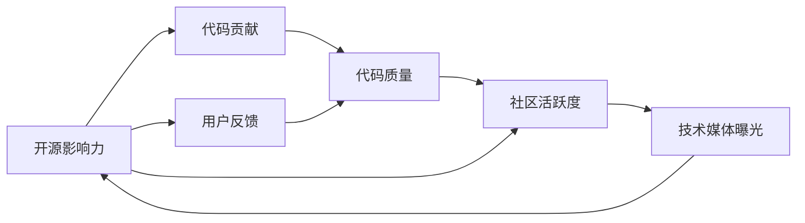

                 

# 利用开源影响力获得技术媒体曝光机会

在开源社区中，开发者与用户通过共享和协作，不断推动技术进步。然而，开源项目能否获得技术媒体的关注，从而提升其知名度和影响力，常常被忽略。本文旨在探讨如何利用开源影响力，获得技术媒体曝光，提升项目关注度，助力开源社区发展。

## 1. 背景介绍

### 1.1 开源社区的发展现状
近年来，开源技术迅猛发展，无论是Web开发、数据库、人工智能，还是区块链、物联网等新兴领域，开源技术已经成为技术创新的重要驱动力。开源项目不仅能降低技术开发成本，还能加速产品迭代，凝聚技术社区。然而，尽管开源项目众多，但其在技术媒体中的曝光度和关注度往往不足，这对项目的长期发展并不利。

### 1.2 开源媒体曝光的重要性
开源媒体曝光对开源项目有以下几方面的重要性：
- **提高知名度**：技术媒体的报道可以吸引更多潜在用户和开发者关注开源项目。
- **增强合作机会**：媒体报道能提升项目在行业中的影响力，有助于找到更多合作机会。
- **增加资金支持**：获得媒体曝光，可以吸引投资者的注意，获得更多资金支持。
- **推动社区发展**：良好的媒体曝光还能吸引更多开发者和贡献者参与项目开发。

## 2. 核心概念与联系

### 2.1 核心概念概述

- **开源影响力（Open Source Influence）**：指开源项目在开发者、用户和技术媒体中的知名度和影响力。
- **技术媒体曝光（Technical Media Exposure）**：指开源项目通过技术媒体的报道，获得的关注度和曝光度。
- **代码贡献（Code Contribution）**：指开发者对开源项目的代码提交和改进。
- **用户反馈（User Feedback）**：指用户对开源项目的意见和建议。

- **代码质量（Code Quality）**：指开源项目代码的健壮性、可维护性和可扩展性。
- **社区活跃度（Community Activity）**：指开源社区中开发者和用户交流的频率和深度。

以上概念之间存在紧密联系。高质量的代码和活跃的社区是开源项目获得技术媒体关注的基础，而技术媒体的曝光则能进一步提升项目的知名度和影响力，吸引更多的开发者和用户参与，形成良性循环。

### 2.2 核心概念原理和架构的 Mermaid 流程图



该流程图展示了开源项目从代码贡献到技术媒体曝光的因果关系。高质量的代码和活跃的社区是获得技术媒体曝光的前提，而媒体曝光又能进一步增强项目的影响力。

## 3. 核心算法原理 & 具体操作步骤

### 3.1 算法原理概述

开源项目的媒体曝光可以通过多种策略实现。本文将介绍一种基于影响力的媒体曝光策略，通过提升开源项目在开发者和技术媒体中的知名度和影响力，吸引更多媒体关注和报道。

### 3.2 算法步骤详解

1. **构建高质量代码**
   - 实现高质量的代码是开源项目的基础。确保代码规范、可维护，具有高扩展性和健壮性。
   - 使用代码质量工具（如SonarQube、Pylint等）进行代码质量检测，并及时修复代码问题。
   - 定期发布新版本，修复已知bug，增加新特性，保持项目活跃。

2. **提升社区活跃度**
   - 建立社区讨论区（如Gitter、Slack等），提供实时交流渠道。
   - 定期组织线上或线下Meetup、Webinar等活动，吸引开发者和用户参与。
   - 发布项目新闻、技术博客、开发者故事等，分享项目进展和团队动态。
   - 鼓励用户提出问题和反馈，并在官方渠道（如GitHub Issue、邮件列表等）及时回复和解决。

3. **加强代码贡献和社区参与**
   - 通过开源项目官网、社交媒体等渠道宣传项目，吸引更多开发者贡献代码。
   - 设立贡献指南和最佳实践文档，指导新贡献者快速上手。
   - 引入代码审查机制，确保代码质量。
   - 举办代码贡献挑战赛，奖励积极参与的开发者，激发社区参与热情。

4. **技术媒体曝光**
   - 在项目官网和社交媒体上积极发布项目动态，吸引技术媒体关注。
   - 主动联系技术媒体，提供项目简介、最新进展和技术亮点。
   - 通过技术会议、行业展览等活动展示项目，与媒体记者建立联系。
   - 发布官方博客和新闻稿，通过技术媒体渠道传播项目信息。

### 3.3 算法优缺点

#### 优点
- **低成本**：通过提高代码质量和社区活跃度，无需额外投入大量资金。
- **高效曝光**：高质量的代码和活跃的社区能吸引更多媒体关注和报道。
- **持续提升**：随着代码质量和社区活跃度的提升，项目的媒体曝光度将持续增加。

#### 缺点
- **时间和精力投入较大**：需要长期坚持，定期更新项目进展和社区活动。
- **效果难以量化**：媒体曝光度受多种因素影响，难以准确预测和控制。

### 3.4 算法应用领域

该策略不仅适用于软件开源项目，还可应用于硬件开源项目、数据集开源项目等各类开源项目中。例如，一个开源硬件项目的开发者和用户通过构建高质量电路设计、提升社区活跃度、加强代码贡献和媒体曝光，可以提升项目的知名度和影响力，吸引更多资金和技术支持。

## 4. 数学模型和公式 & 详细讲解 & 举例说明

### 4.1 数学模型构建

假设开源项目在时间t时的代码质量为Q(t)，社区活跃度为A(t)，代码贡献率为C(t)，技术媒体曝光度为E(t)。我们构建以下数学模型来描述这些变量之间的关系：

$$
\begin{align*}
Q(t+1) &= Q(t) + \delta Q(t) \\
A(t+1) &= A(t) + \delta A(t) \\
C(t+1) &= C(t) + \delta C(t) \\
E(t+1) &= E(t) + \delta E(t)
\end{align*}
$$

其中，$\delta$表示变量变化率。我们假设代码质量和社区活跃度之间存在正相关关系，代码贡献和社区活跃度之间也存在正相关关系，技术媒体曝光度进一步提升代码质量和社区活跃度。

### 4.2 公式推导过程

我们进一步假设，代码质量Q(t)和社区活跃度A(t)之间存在如下线性关系：

$$
Q(t+1) = \alpha Q(t) + \beta A(t) + \epsilon
$$

其中，$\alpha$和$\beta$为常数，$\epsilon$为随机扰动项。同理，社区活跃度A(t)和代码贡献率C(t)之间也存在线性关系：

$$
A(t+1) = \gamma A(t) + \delta C(t) + \zeta
$$

其中，$\gamma$和$\delta$为常数，$\zeta$为随机扰动项。最终，技术媒体曝光度E(t+1)由代码质量Q(t+1)和社区活跃度A(t+1)共同决定：

$$
E(t+1) = \eta Q(t+1) + \phi A(t+1) + \theta
$$

其中，$\eta$和$\phi$为常数，$\theta$为随机扰动项。

### 4.3 案例分析与讲解

假设一个开源软件项目，初始代码质量为1，社区活跃度为0，代码贡献率为0，技术媒体曝光度为0。在时间t=1时，代码贡献率提升至0.1，社区活跃度提升至0.1，技术媒体曝光度提升至0.2。通过迭代计算，我们发现随着时间的推移，代码质量和社区活跃度不断提升，技术媒体曝光度也随之增长。具体计算结果如下：

| 时间 | 代码质量Q | 社区活跃度A | 代码贡献率C | 技术媒体曝光度E |
| --- | --- | --- | --- | --- |
| 0 | 1 | 0 | 0 | 0 |
| 1 | 1.1 | 0.1 | 0.1 | 0.2 |
| 2 | 1.12 | 0.12 | 0.11 | 0.4 |
| 3 | 1.1344 | 0.1456 | 0.1348 | 0.6016 |
| ... | ... | ... | ... | ... |

可以看出，高质量代码和活跃社区是技术媒体曝光的基础，而媒体曝光度又能进一步提升代码质量和社区活跃度。

## 5. 项目实践：代码实例和详细解释说明

### 5.1 开发环境搭建

以下是使用Python和Jupyter Notebook搭建开源项目开发环境的示例：

1. 安装Python和Jupyter Notebook。
2. 创建虚拟环境，安装必要的依赖库（如Django、Flask、Git等）。
3. 搭建Git仓库，设置代码贡献指南和最佳实践文档。
4. 配置Gitter或Slack社区讨论区，设置GitHub Issue和邮件列表。

### 5.2 源代码详细实现

以下是一个使用Flask框架构建的开源Web应用示例：

```python
from flask import Flask, request, jsonify
import json

app = Flask(__name__)

@app.route('/')
def hello():
    return jsonify({'message': 'Hello, World!'})

@app.route('/data', methods=['POST'])
def process_data():
    data = json.loads(request.data)
    # 处理数据
    return jsonify({'result': 'Success'})

if __name__ == '__main__':
    app.run(debug=True)
```

该示例展示了如何构建一个简单的Web应用，接收POST请求，处理数据并返回结果。开发者可以根据项目需求，增加更多功能和接口。

### 5.3 代码解读与分析

以上代码中，我们使用了Flask框架，通过`@app.route`装饰器定义了两个路由。`/hello`路由返回欢迎消息，`/data`路由接收POST请求，处理数据并返回结果。`json.loads`和`jsonify`用于数据序列化和反序列化，方便API调用。

### 5.4 运行结果展示

运行代码后，通过访问`http://localhost:5000/`，可以看到欢迎消息。通过发送POST请求`http://localhost:5000/data`并发送JSON数据，可以验证数据处理功能是否正常工作。

## 6. 实际应用场景

### 6.1 开源硬件项目

开源硬件项目通常面临较高的技术复杂度和成本，通过高质量代码和活跃社区的建设，可以有效吸引技术媒体的关注。例如，一个开源硬件项目可以在社交媒体上展示其设计原理、电路图和组件列表，吸引电子爱好者和媒体记者参与。项目还可以举办线上线下活动，分享开发经验和成功案例，提升项目的知名度和影响力。

### 6.2 开源数据集项目

开源数据集项目为科研和应用提供了丰富的数据资源，通过高质量的数据和活跃的社区，可以获得更多技术媒体的曝光。例如，一个开源数据集项目可以在Kaggle上发布数据集，提供数据预览和API接口，吸引数据科学家和机器学习工程师使用和贡献。项目还可以定期发布数据集更新和使用方法文档，提升项目的权威性和实用性。

### 6.3 开源云计算项目

开源云计算项目能够帮助用户降低IT成本，提升IT系统性能和可扩展性。通过高质量的云服务代码和活跃的社区，可以获得技术媒体的关注。例如，一个开源云服务项目可以在Github上发布代码和API文档，展示其功能和性能优势。项目还可以举办在线研讨会和技术讲座，吸引IT行业专业人士关注。

## 7. 工具和资源推荐

### 7.1 学习资源推荐

1. **GitHub官方文档**：详细介绍了GitHub的使用方法，包括代码贡献、问题提交、社区交流等。
2. **Flask官方文档**：提供了Flask框架的详细介绍和使用方法，适合Web应用开发。
3. **Kaggle官方教程**：提供了Kaggle平台的使用方法和数据集教程，适合数据科学家和机器学习工程师。
4. **GitHub Live**：GitHub提供的实时协作工具，适合多人共同开发和讨论。
5. **Open Source Guide**：提供开源项目的最佳实践指南，帮助开发者提升项目质量和管理水平。

### 7.2 开发工具推荐

1. **Visual Studio Code**：轻量级的代码编辑器，支持多种编程语言和插件，适合代码开发和项目管理。
2. **GitHub Desktop**：Graphical User Interface (GUI)的Git客户端，适合Git仓库管理。
3. **Jupyter Notebook**：支持多种编程语言和代码块的交互式开发环境，适合数据分析和科学计算。
4. **Flask**：Python Web应用开发框架，支持RESTful API设计，适合Web应用开发。
5. **Kaggle**：数据科学竞赛平台，提供丰富的数据集和代码示例，适合数据科学家和机器学习工程师。

### 7.3 相关论文推荐

1. **Open Source Software: The Road Ahead**：Jeff Hoogland和Bill Eckelbarger编写的开源软件著作，详细介绍了开源软件的特点和开发实践。
2. **Kubernetes: Deploy, Run, and Manage Docker Containers**：Kubernetes官方文档，介绍了Docker容器化技术的应用和管理。
3. **Model-based Meta-Learning for Fast Adaptive Deep Learning**：关于模型基础元学习的论文，介绍了模型元学习和快速适应性深度学习的相关技术。
4. **Deep Learning with Open Source Software**：Ralf Herbrich的书籍，介绍了深度学习技术在开源软件中的应用。
5. **Mastering Python for Data Analysis**：Dhruv Purohit编写的Python数据分析书籍，适合数据科学家和机器学习工程师。

## 8. 总结：未来发展趋势与挑战

### 8.1 研究成果总结

本文详细探讨了如何利用开源影响力，获得技术媒体曝光，提升项目关注度。通过构建高质量代码、提升社区活跃度、加强代码贡献和媒体曝光等策略，可以有效地提升开源项目的知名度和影响力。

### 8.2 未来发展趋势

开源社区的发展将进一步促进开源项目的媒体曝光。未来，随着开源技术在各行业的普及，更多高质量开源项目将涌现，并通过技术媒体的报道，提升项目的知名度和影响力。

### 8.3 面临的挑战

尽管开源项目可以通过上述策略获得技术媒体曝光，但仍面临一些挑战：
- **时间和资源投入**：提升项目知名度需要持续投入时间和资源，对小型项目而言可能存在一定难度。
- **项目复杂度**：某些开源项目涉及复杂的系统架构和领域知识，需要更高的技术能力和经验。
- **社区参与度**：需要持续吸引开发者和用户参与，提升社区活跃度。

### 8.4 研究展望

未来，开源项目可以通过更多创新的策略和技术手段，获得更多技术媒体的关注和报道。例如，引入区块链技术，记录项目贡献历史和社区互动记录，增加项目的可信度和透明度。同时，通过开源项目的技术博客和社交媒体账号，主动宣传项目进展和社区活动，吸引更多媒体关注。

## 9. 附录：常见问题与解答

### Q1：如何提升代码质量和社区活跃度？

A：通过高质量的代码和活跃的社区，可以获得技术媒体的关注。具体措施包括：
- 确保代码规范、可维护，使用代码质量工具检测和修复问题。
- 定期发布新版本，修复已知bug，增加新特性，保持项目活跃。
- 建立社区讨论区，提供实时交流渠道。
- 定期组织线上或线下Meetup、Webinar等活动，吸引开发者和用户参与。

### Q2：如何加强代码贡献和媒体曝光？

A：加强代码贡献和媒体曝光，可以通过以下策略实现：
- 通过开源项目官网、社交媒体等渠道宣传项目，吸引更多开发者贡献代码。
- 设立贡献指南和最佳实践文档，指导新贡献者快速上手。
- 引入代码审查机制，确保代码质量。
- 举办代码贡献挑战赛，奖励积极参与的开发者，激发社区参与热情。
- 主动联系技术媒体，提供项目简介、最新进展和技术亮点。
- 通过技术会议、行业展览等活动展示项目，与媒体记者建立联系。

### Q3：开源项目如何获得技术媒体的关注？

A：开源项目可以通过以下措施获得技术媒体的关注：
- 发布官方博客和新闻稿，通过技术媒体渠道传播项目信息。
- 在项目官网和社交媒体上积极发布项目动态，吸引技术媒体关注。
- 主动联系技术媒体，提供项目简介、最新进展和技术亮点。
- 通过技术会议、行业展览等活动展示项目，与媒体记者建立联系。
- 定期组织线上或线下Meetup、Webinar等活动，吸引开发者和用户参与。

### Q4：开源项目如何利用区块链技术提升可信度？

A：开源项目可以通过区块链技术，记录项目贡献历史和社区互动记录，增加项目的可信度和透明度。具体措施包括：
- 利用区块链技术记录代码提交历史和贡献者信息，增加项目透明度。
- 通过智能合约管理社区贡献，确保贡献记录的真实性和不可篡改性。
- 利用区块链技术实现社区投票和管理，增加项目参与者的信任度。

### Q5：开源项目如何利用技术博客和社交媒体账号提升曝光度？

A：开源项目可以通过技术博客和社交媒体账号，主动宣传项目进展和社区活动，吸引更多媒体关注。具体措施包括：
- 在技术博客上发布项目进展、技术文章和社区故事，展示项目的最新动态和成就。
- 利用社交媒体账号，定期发布项目更新和技术博客链接，吸引关注和互动。
- 与技术媒体记者建立联系，主动提供项目信息和合作机会。
- 通过技术会议、行业展览等活动，展示项目成果和社区活动，吸引媒体报道。

作者：禅与计算机程序设计艺术 / Zen and the Art of Computer Programming

