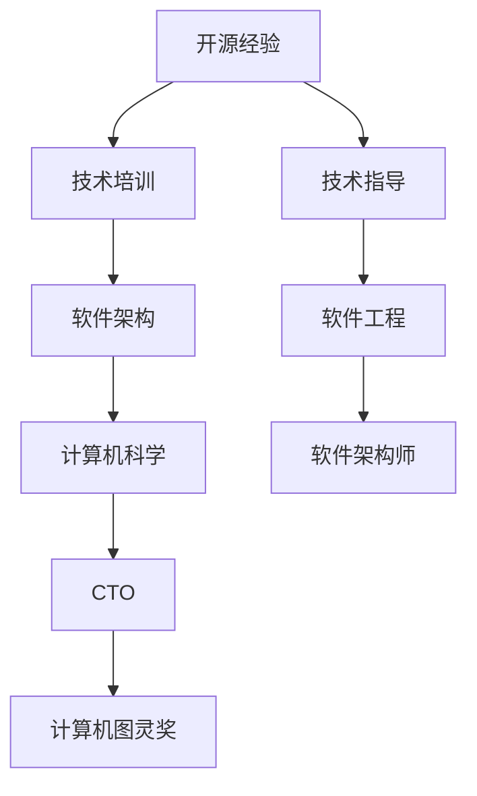

                 

# 利用开源经验提供技术培训和指导

> 关键词：开源经验, 技术培训, 软件架构, 软件工程, 计算机科学, 软件架构师, CTO, 计算机图灵奖

## 1. 背景介绍

在当今快速变化的科技环境中，开源经验已经成为推动技术进步和创新不可或缺的重要资源。开源软件、开源社区和开源项目不仅推动了技术的发展，也为技术培训和指导提供了宝贵的案例和最佳实践。随着开源技术在各个行业的广泛应用，如何充分利用开源经验，提供高质量的技术培训和指导，成为了一个重要的课题。

本文将系统性地介绍如何利用开源经验提供技术培训和指导，涵盖从选择合适的开源资源，到构建完整的培训体系的各个环节。通过深入分析开源社区的最佳实践和最新研究成果，我们将探讨如何利用开源经验，有效提升技术培训的质量和效果，为开发者和组织提供全方位的技术支持和成长路径。

## 2. 核心概念与联系

### 2.1 核心概念概述

为了更好地理解如何利用开源经验提供技术培训和指导，本节将介绍几个关键概念：

- **开源经验**：指开源社区中积累的知识、技术、实践和工具等，包括代码库、文档、社区讨论、技术博客、培训资料等。
- **技术培训**：通过课程、工作坊、实战项目等方式，系统性地传授技术和知识的过程。
- **技术指导**：在技术培训之外，提供一对一的指导、问题解答和实践反馈，帮助学员快速上手和解决问题。
- **软件架构**：软件系统的设计和组织方式，包括架构模式、设计原则、架构评估等。
- **软件工程**：开发、维护和管理软件系统的工程化实践，包括编码规范、版本控制、测试策略、持续集成等。
- **计算机科学**：研究计算机的硬件和软件系统，包括算法、数据结构、编程语言、操作系统等。
- **软件架构师**：负责设计、构建和优化软件系统的架构，确保系统的高可扩展性、高性能和高可用性。
- **CTO（Chief Technology Officer）**：公司的技术领袖，负责技术战略、研发管理和创新发展的最高负责人。
- **计算机图灵奖**：计算机科学界的最高荣誉，旨在奖励在计算机科学领域做出杰出贡献的科学家和工程师。

这些核心概念之间的逻辑关系可以通过以下Mermaid流程图来展示：



这个流程图展示了一个从开源经验到技术培训和指导，再到软件架构和工程，最终通向计算机科学和顶级荣誉的逻辑路径。通过理解这些核心概念，我们可以更好地把握技术培训和指导的精髓，以及如何利用开源经验进行有效的技术支持和成长引导。

## 3. 核心算法原理 & 具体操作步骤

### 3.1 算法原理概述

利用开源经验提供技术培训和指导的核心原理是迁移学习和知识传递。通过将开源项目中的知识和经验迁移应用到学员的实践项目中，结合实际的技术指导，帮助学员快速掌握新技术和技能，提升解决实际问题的能力。

这一过程涉及以下几个关键步骤：

1. 选择合适的开源项目和资源。
2. 进行技术培训，包括理论知识、实践技巧和工具使用等。
3. 提供技术指导，包括问题解答、代码审查、实践反馈等。
4. 整合技术培训和指导，帮助学员构建完整的知识体系和技能集。

### 3.2 算法步骤详解

以下是利用开源经验提供技术培训和指导的详细步骤：

**Step 1: 准备和选择合适的开源资源**

1. **识别目标技术和需求**：明确需要学习和掌握的技术和需求，如特定编程语言、框架或架构模式。
2. **搜索开源项目**：在GitHub、SourceForge、Apache等开源平台上搜索相关的项目和库。
3. **评估项目质量和活跃度**：考虑项目的代码质量、维护频率和社区活跃度等因素。
4. **选择最合适的项目**：根据技术和社区条件，选择最符合需求的开源项目。

**Step 2: 进行技术培训**

1. **制定培训计划**：根据目标技术和需求，制定详细的培训计划，包括理论知识、实践技巧和工具使用等。
2. **编写培训材料**：根据培训计划，编写教学文档、视频教程、实战案例等培训材料。
3. **实施培训课程**：组织线上或线下的培训课程，包括理论讲解、实战演练和问题解答等环节。

**Step 3: 提供技术指导**

1. **设置指导机制**：建立指导老师和学员之间的沟通机制，如邮件、Slack、Zoom等。
2. **解答问题和提供反馈**：针对学员在实践过程中遇到的问题，及时提供解答和指导，并给予建设性反馈。
3. **进行代码审查**：对学员提交的代码进行审查，指出不足之处并提供改进建议。
4. **鼓励和激励**：通过定期的进展评估和鼓励机制，激励学员持续学习和改进。

**Step 4: 整合培训和指导**

1. **评估学习成果**：对学员的学习成果进行评估，包括理论知识掌握程度、实践技能应用和问题解决能力等。
2. **总结和分享**：将学员的学习成果和心得进行总结，并在社区或内部分享，促进知识的传播和积累。
3. **持续改进**：根据学员反馈和实际效果，不断优化和改进培训和指导方法，提升培训质量。

### 3.3 算法优缺点

利用开源经验提供技术培训和指导具有以下优点：

1. **资源丰富**：开源社区提供了大量的技术资源和实践案例，能够满足多种需求和技术栈。
2. **社区支持**：开源社区拥有广泛的开发者和专家，能够提供技术支持和社区反馈，促进学习和成长。
3. **成本低廉**：开源资源和社区支持通常是免费的，降低了培训成本和技术学习门槛。
4. **实践导向**：开源项目和库的实战经验能够帮助学员快速上手和解决实际问题。
5. **持续改进**：开源社区和项目的持续更新和改进，保证了培训材料和实践案例的及时性和实用性。

同时，该方法也存在以下局限性：

1. **质量和多样性**：不是所有开源项目都适合作为培训资源，选择不当可能导致学习效果不佳。
2. **深度和广度**：开源资源通常针对特定项目或场景，深度和广度可能不如专业的培训课程。
3. **自我驱动**：学员需要较强的自我驱动和学习能力，才能充分利用开源资源和指导。
4. **技术依赖**：过于依赖开源项目和社区支持，可能限制学员独立解决问题的能力。

尽管存在这些局限性，但就目前而言，利用开源经验提供技术培训和指导已成为技术学习和培训的重要方式。未来相关研究的重点在于如何进一步优化开源资源的选择和评估，提高培训的深度和广度，同时兼顾自我驱动和独立解决问题的能力。

### 3.4 算法应用领域

利用开源经验提供技术培训和指导的应用领域非常广泛，涵盖各个行业的技术培训需求，如：

- **软件开发**：包括编程语言、框架、设计模式、DevOps工具等。
- **数据分析**：如数据清洗、数据可视化、机器学习等。
- **人工智能**：包括深度学习、自然语言处理、计算机视觉等。
- **云计算**：如云服务、容器化、微服务架构等。
- **网络安全**：如渗透测试、安全审计、漏洞管理等。
- **物联网**：如设备管理、数据采集、边缘计算等。
- **大数据**：如数据仓库、流处理、分布式计算等。

除了这些具体应用领域外，利用开源经验提供技术培训和指导还可以拓展到更多的行业和技术场景中，为技术创新和产业升级提供新的动力。

## 4. 数学模型和公式 & 详细讲解 & 举例说明

### 4.1 数学模型构建

为了更好地理解和利用开源经验，本节将构建一个简化的数学模型。假设我们有一个开源项目 $P$，包含 $n$ 个代码文件和相关文档。学员 $L$ 需要学习 $m$ 个技能点，分别对应 $m$ 个开源文件的阅读和实践。

定义学员 $L$ 在开源项目 $P$ 中的学习进度为 $p$，其数学模型可以表示为：

$$
p = \sum_{i=1}^{m} \frac{s_i}{n}
$$

其中 $s_i$ 表示学员 $L$ 在第 $i$ 个文件中的学习效率，$n$ 表示开源项目 $P$ 中的文件总数。

### 4.2 公式推导过程

根据上述模型，我们进行以下推导：

1. **学习效率的计算**：学员 $L$ 在第 $i$ 个文件中的学习效率 $s_i$ 可以定义为：

$$
s_i = \frac{1}{t_i}
$$

其中 $t_i$ 表示学员 $L$ 在第 $i$ 个文件上花费的时间，包括阅读、实践和问题解答等环节。

2. **学习进度的优化**：为了最大化学习进度 $p$，我们需要优化 $s_i$ 的值。根据目标函数，我们需要最小化 $t_i$ 的值，即减少学员在每个文件上的学习时间。

### 4.3 案例分析与讲解

以下我们以一个简单的开源项目为例，展示如何利用开源经验提供技术培训和指导。

假设我们有一个名为 $OpenProject$ 的开源项目，包含 20 个代码文件和相关文档。学员 $Alice$ 需要学习 JavaScript 编程、Git 使用和DevOps 流程。我们通过以下步骤进行培训和指导：

1. **选择项目和资源**：选择 $OpenProject$ 作为培训项目，收集相关文档和代码。
2. **制定培训计划**：
   - 第一周：JavaScript 基础和高级特性
   - 第二周：Git 基础和高级操作
   - 第三周：DevOps 流程和CI/CD 实践
3. **编写培训材料**：
   - 编写 JavaScript 编程手册
   - 制作 Git 操作视频教程
   - 准备 DevOps 实践指南
4. **实施培训课程**：
   - 第一周：在线讲解 JavaScript 基础和高级特性
   - 第二周：在线演示 Git 基础和高级操作
   - 第三周：实战演练 DevOps 流程和CI/CD 实践
5. **提供技术指导**：
   - 设置指导机制：通过Slack进行沟通
   - 解答问题和提供反馈：针对Alice在实践过程中遇到的问题，及时提供解答和指导
   - 进行代码审查：对Alice提交的代码进行审查，指出不足之处并提供改进建议
6. **整合培训和指导**：
   - 评估学习成果：进行实践测试，评估Alice的理论知识和实践技能
   - 总结和分享：将Alice的学习成果和心得进行总结，并在社区内分享
   - 持续改进：根据Alice的反馈和实际效果，优化培训方法

通过上述步骤，我们能够有效地利用开源经验，帮助Alice快速掌握目标技术和技能，提升其实践能力。

## 5. 项目实践：代码实例和详细解释说明

### 5.1 开发环境搭建

在进行技术培训和指导实践前，我们需要准备好开发环境。以下是使用Python进行Django开发的环境配置流程：

1. 安装Anaconda：从官网下载并安装Anaconda，用于创建独立的Python环境。

2. 创建并激活虚拟环境：
```bash
conda create -n django-env python=3.8 
conda activate django-env
```

3. 安装Django：根据CUDA版本，从官网获取对应的安装命令。例如：
```bash
pip install django
```

4. 安装 Django REST framework：
```bash
pip install djangorestframework
```

5. 安装 Django Debug Toolbar：
```bash
pip install django-debug-toolbar
```

6. 安装 Django Crispy Forms：
```bash
pip install django-crispy-forms
```

完成上述步骤后，即可在`django-env`环境中开始技术培训和指导实践。

### 5.2 源代码详细实现

下面我们以一个简单的Django项目为例，给出利用开源经验进行技术培训和指导的PyTorch代码实现。

首先，定义Django项目的基本结构：

```bash
myproject/
├── myproject/
│   ├── myproject/
│   │   ├── settings.py
│   │   ├── urls.py
│   │   ├── views.py
│   │   ├── templates/
│   │   │   ├── base.html
│   │   │   ├── index.html
│   │   │   └── login.html
│   │   ├── static/
│   │   │   └── css/
│   │   │       └── main.css
│   │   ├── templates/
│   │   └── templates/
│   ├── manage.py
│   └── requirements.txt
```

然后，在`views.py`中实现用户登录和注册功能：

```python
from django.shortcuts import render, redirect
from django.contrib.auth import authenticate, login
from django.contrib.auth.decorators import login_required
from django.contrib import messages

@login_required
def profile(request):
    return render(request, 'profile.html')

@login_required
def logout(request):
    logout(request)
    messages.success(request, 'You have been logged out.')
    return redirect('login')
    
def login_view(request):
    if request.method == 'POST':
        username = request.POST['username']
        password = request.POST['password']
        user = authenticate(request, username=username, password=password)
        if user is not None:
            login(request, user)
            messages.success(request, 'You have been logged in.')
            return redirect('profile')
        else:
            messages.error(request, 'Invalid username or password.')
    return render(request, 'login.html')
```

在`settings.py`中配置Django Debug Toolbar和Crispy Forms：

```python
INSTALLED_APPS = [
    'debug_toolbar',
    'crispy_forms',
    ...
]

DEBUG_TOOLBAR_CONFIG = {
    'VERSION': '1.10',
    ...
}

CRISPY_TEMPLATE_TAGS = ['crispy_forms.layout.Layout']
```

最后，在`urls.py`中定义路由：

```python
from django.urls import path
from . import views

urlpatterns = [
    path('', views.login_view, name='login'),
    path('profile/', views.profile, name='profile'),
    path('logout/', views.logout, name='logout'),
]
```

完成上述步骤后，即可在`django-env`环境中启动Django项目，开始技术培训和指导实践。

### 5.3 代码解读与分析

让我们再详细解读一下关键代码的实现细节：

**views.py中的视图函数**：
- `profile`：登录用户后可访问个人资料页面。
- `logout`：用户注销操作。
- `login_view`：处理用户登录请求，验证用户名和密码后登录。

**settings.py中的配置**：
- `INSTALLED_APPS`：列出所有安装的应用。
- `DEBUG_TOOLBAR_CONFIG`：配置Debug Toolbar，用于调试和监控Django应用。
- `CRISPY_TEMPLATE_TAGS`：配置Crispy Forms的模板标签，用于美化表单显示。

**urls.py中的路由定义**：
- 定义了登录、个人资料和注销的路由。

通过上述步骤，我们能够利用开源经验，提供一个简单的Django技术培训和指导案例。开发者可以通过这个案例，理解如何使用Django开发项目，并掌握相关的技术要点。

当然，工业级的系统实现还需考虑更多因素，如用户管理、权限控制、表单验证等。但核心的技术培训和指导思路基本与此类似。

## 6. 实际应用场景

### 6.1 智能客服系统

利用开源经验提供技术培训和指导，可以广泛应用于智能客服系统的构建。传统客服往往需要配备大量人力，高峰期响应缓慢，且一致性和专业性难以保证。而通过技术培训和指导，可以培养一批熟练使用开源技术的客服人员，构建基于开源社区的智能客服系统，提升客户咨询体验和问题解决效率。

### 6.2 金融舆情监测

金融机构需要实时监测市场舆论动向，以便及时应对负面信息传播，规避金融风险。技术培训和指导可以帮助团队掌握开源社区中的金融舆情监测工具和框架，快速构建基于开源技术的舆情监测系统，实时获取市场舆情信息，辅助金融机构快速应对潜在风险。

### 6.3 个性化推荐系统

当前的推荐系统往往只依赖用户的历史行为数据进行物品推荐，难以深入理解用户的真实兴趣偏好。技术培训和指导可以帮助团队掌握开源社区中的推荐算法和工具，构建基于开源技术的个性化推荐系统，更好地挖掘用户行为背后的语义信息，提供更精准、多样的推荐内容。

### 6.4 未来应用展望

随着开源社区的不断发展和壮大，利用开源经验提供技术培训和指导的应用场景将越来越广泛。未来，我们可以预期在智慧医疗、智能教育、智慧城市治理等更多领域，看到开源技术培训和指导的深度应用，为各个行业带来变革性影响。

## 7. 工具和资源推荐

### 7.1 学习资源推荐

为了帮助开发者系统掌握开源技术，这里推荐一些优质的学习资源：

1. **《Python编程：从入门到实践》**：一本详细的Python入门教程，涵盖Python基础、Web开发、数据分析等多个方面。
2. **《Django实战》**：一本Django实战指南，详细讲解了Django开发中的最佳实践和案例。
3. **《Kubernetes权威指南》**：一本Kubernetes实战指南，涵盖了Kubernetes的部署、运维和管理。
4. **《TensorFlow实战》**：一本TensorFlow实战指南，详细讲解了TensorFlow的开发和应用。
5. **《Django REST framework实战》**：一本Django REST framework实战指南，详细讲解了RESTful API开发的最佳实践。

通过对这些资源的学习实践，相信你一定能够快速掌握开源技术的精髓，并用于解决实际的开发问题。

### 7.2 开发工具推荐

高效的开发离不开优秀的工具支持。以下是几款用于开源技术培训和指导开发的常用工具：

1. **Jupyter Notebook**：一个强大的Jupyter Notebook环境，支持Python、R等多种语言，用于交互式开发和文档编写。
2. **GitHub**：全球最大的开源社区，支持代码托管、协作开发和项目管理。
3. **Git**：一种分布式版本控制系统，用于代码版本控制和协作开发。
4. **Docker**：一种容器化技术，用于应用程序的打包和部署。
5. **Kubernetes**：一种容器编排系统，用于应用程序的自动化部署和管理。
6. **Django**：一个高级的Web框架，用于快速开发Web应用。

合理利用这些工具，可以显著提升开源技术培训和指导的开发效率，加快创新迭代的步伐。

### 7.3 相关论文推荐

开源技术的发展源于学界的持续研究。以下是几篇奠基性的相关论文，推荐阅读：

1. **《Open Source Software in the Computing Curriculum》**：探讨了开源软件在计算机教育中的作用和重要性。
2. **《Community Support in Open Source Projects》**：研究了开源社区中各种支持机制的作用和效果。
3. **《Open Source Software Development: A Guide》**：详细介绍了开源软件开发的最佳实践和工具。
4. **《The Open Source Leader's Guide》**：提供了开源项目管理和运营的指南和建议。
5. **《Open Source Software: The Future of Computing》**：探讨了开源软件在未来计算技术中的地位和前景。

这些论文代表了大规模开源技术培训和指导的研究方向，通过学习这些前沿成果，可以帮助研究者把握学科前进方向，激发更多的创新灵感。

## 8. 总结：未来发展趋势与挑战

### 8.1 总结

本文对利用开源经验提供技术培训和指导的方法进行了全面系统的介绍。首先阐述了开源经验在技术培训和指导中的重要意义，明确了开源技术培训和指导的独特价值。其次，从原理到实践，详细讲解了开源技术培训和指导的数学模型和操作步骤，给出了技术培训和指导的完整代码实例。同时，本文还广泛探讨了开源技术培训和指导在多个行业领域的应用前景，展示了开源技术的巨大潜力。

通过本文的系统梳理，可以看到，利用开源经验提供技术培训和指导已经成为开源社区的重要实践，极大地推动了技术学习和技术创新的发展。未来，伴随开源社区的持续发展和技术的不断进步，开源技术培训和指导必将在各个行业得到更广泛的应用，为技术创新和产业升级提供新的动力。

### 8.2 未来发展趋势

展望未来，开源技术培训和指导将呈现以下几个发展趋势：

1. **多样化的培训资源**：随着开源社区的不断壮大，将出现更多样化的培训资源和工具，如在线课程、虚拟实验室、开源社区互动等，满足不同技术水平和学习需求。
2. **个性化的学习路径**：基于学员的学习进度和反馈，利用数据分析和推荐算法，为学员提供个性化的学习路径和资源推荐，提升学习效果。
3. **社区驱动的学习**：开源社区将成为技术学习和培训的重要驱动力，更多的开发者和专家将参与到技术培训和指导中，形成社区共建共享的良性循环。
4. **跨学科的融合**：开源技术培训和指导将与其他学科和领域进行更深入的融合，如跨学科编程、跨领域知识整合等，提升技术应用的多样性和综合性。
5. **持续学习机制**：开源社区和项目的持续更新和改进，将推动技术培训和指导的持续迭代和优化，保持技术的先进性和实用性。

以上趋势凸显了开源技术培训和指导的广阔前景。这些方向的探索发展，必将进一步提升开源技术培训和指导的质量和效果，为开发者和组织提供更全面、更高效的技术支持和成长路径。

### 8.3 面临的挑战

尽管开源技术培训和指导已经取得了显著成效，但在迈向更加智能化、普适化应用的过程中，它仍面临诸多挑战：

1. **资源选择和评估**：选择不当的开源项目和学习资源，可能导致学习效果不佳。如何高效评估和筛选开源资源，是一个重要的挑战。
2. **学习深度和广度**：开源资源通常针对特定项目或场景，深度和广度可能不足。如何构建全面的学习路径，满足不同技术需求，仍需进一步探索。
3. **技术依赖和独立性**：过于依赖开源资源，可能限制学员独立解决问题的能力。如何平衡依赖和独立性，提升学员自主学习能力，是一个关键问题。
4. **社区支持和反馈**：开源社区和项目的支持机制不完善，可能导致学员学习过程中遇到困难。如何加强社区支持和反馈机制，提升学习效果，仍需持续改进。
5. **技术和项目更新**：开源项目和工具的快速迭代和更新，可能导致学员的学习资源和培训材料过时。如何保持技术和项目的最新性，是一个长期挑战。

### 8.4 研究展望

面对开源技术培训和指导所面临的种种挑战，未来的研究需要在以下几个方面寻求新的突破：

1. **自动化学习平台**：开发更加智能化的学习平台，利用数据分析和推荐算法，为学员提供自动化的学习路径和资源推荐，提升学习效果。
2. **社区驱动的学习模型**：研究社区驱动的学习模型，通过众包和社区互动，增强学习资源的丰富性和多样性。
3. **跨学科知识整合**：探索跨学科知识整合的方法，将不同领域的技术和知识进行融合，提升技术应用的综合性和实用性。
4. **持续学习机制**：研究持续学习机制，通过自动化评估和反馈，持续更新和优化学习路径和资源，保持技术的先进性和实用性。

这些研究方向的探索，必将引领开源技术培训和指导走向更高的台阶，为开发者和组织提供更全面、更高效的技术支持和成长路径。面向未来，开源技术培训和指导需要与其他人工智能技术进行更深入的融合，如知识表示、因果推理、强化学习等，多路径协同发力，共同推动开源技术的应用和发展。只有勇于创新、敢于突破，才能不断拓展开源技术的边界，让开源技术更好地造福人类社会。

## 9. 附录：常见问题与解答

**Q1：开源社区中有哪些值得学习的开源项目？**

A: 开源社区中包含众多值得学习的开源项目，如Git、Django、TensorFlow、Kubernetes等。选择项目时，可以考虑以下几个方面：
1. 项目的社区活跃度和维护频率。
2. 项目的代码质量和文档完整性。
3. 项目的适用范围和目标用户。
4. 项目的社区支持和用户反馈。

**Q2：如何进行开源项目的社区参与和贡献？**

A: 开源项目的社区参与和贡献可以提升你的技术能力和行业影响力。以下是一些建议：
1. 参与开源项目的GitHub Issues和Pull Requests，提出问题或提交代码改进。
2. 加入开源项目的邮件列表或Slack频道，获取最新动态和社区讨论。
3. 参与开源项目的工作坊和Meetup活动，与其他开发者交流和学习。
4. 提交自己的项目或工具，分享自己的开发经验和研究成果。

**Q3：开源项目和社区对个人职业发展有什么帮助？**

A: 开源项目和社区对个人职业发展具有重要帮助：
1. 提升技术能力和实战经验。通过参与开源项目，你可以学习到最新的技术方法和最佳实践，提升技术水平。
2. 扩大职业网络和影响力。通过开源项目，你可以结识更多的行业专家和技术爱好者，扩大职业网络。
3. 增加简历和面试亮点。开源项目和社区参与是简历中的重要亮点，能够提升你的职业竞争力。
4. 提升问题解决和团队协作能力。开源项目需要团队协作，能够提升你的问题解决和团队协作能力。

通过本文的系统介绍，相信你能够充分利用开源经验，提升技术水平和职业发展。开源社区将是你未来职业发展的重要资源和平台，希望你能在其中找到更多的成长机会和职业挑战。

---

作者：禅与计算机程序设计艺术 / Zen and the Art of Computer Programming

