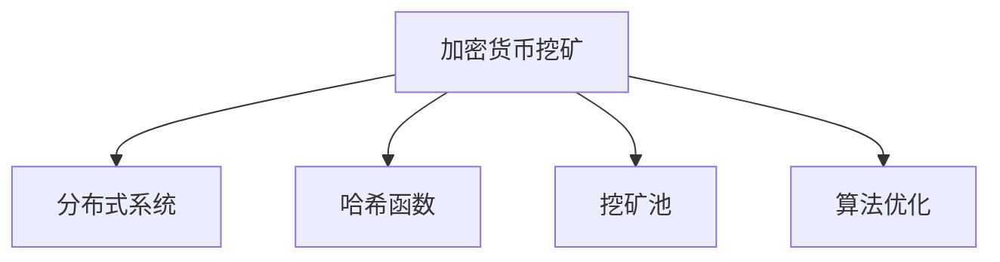

                 

# 利用技术优势进行加密货币挖矿

> 关键词：加密货币,挖矿,算法优化,分布式系统,挖矿池,哈希函数

## 1. 背景介绍

### 1.1 问题由来

随着比特币等加密货币的崛起，挖矿已经成为一种流行的加密货币获得新币的方法。挖矿的本质是通过计算机解决复杂的计算难题，验证并记录交易，获得新币奖励。然而，随着越来越多的参与者进入挖矿行业，传统的集中式挖矿方式逐渐变得不经济、不安全。如何利用技术优势提高挖矿效率，降低能耗，成为加密货币挖矿领域的核心议题。

### 1.2 问题核心关键点

当前加密货币挖矿面临的主要挑战包括：
- 算力竞争激烈，单个矿机难以获得足够的计算资源。
- 能耗问题严重，传统集中式挖矿导致大量能源浪费。
- 攻击风险高，集中式挖矿中心容易成为攻击目标。
- 收益波动大，挖矿收益与算力和网络状况紧密相关。

要解决这些挑战，必须利用分布式系统、哈希函数、算法优化等技术手段，提升挖矿的效率和安全性。

### 1.3 问题研究意义

研究如何利用技术优势进行加密货币挖矿，对于提高挖矿效率、降低成本、增强安全性具有重要意义。不仅能有效缓解集中式挖矿带来的问题，还能推动加密货币挖矿技术的发展，促进加密货币的健康发展和普及应用。

## 2. 核心概念与联系

### 2.1 核心概念概述

为更好地理解利用技术优势进行加密货币挖矿的原理和实践，本节将介绍几个关键概念：

- 加密货币挖矿：通过计算机解决复杂计算难题，验证并记录交易，获得新币奖励的过程。
- 分布式系统：由多个独立的计算机节点组成的网络，通过协同工作完成特定任务。
- 哈希函数：一种将任意长度的输入数据，映射为固定长度的哈希值的函数，常用于验证数据完整性和防篡改。
- 挖矿池：多个矿机组成的网络，通过共享计算资源提高挖矿效率，降低单个矿机的成本和风险。
- 算法优化：对挖矿算法的改进，通过更高效的算法实现更快的哈希运算，提高挖矿效率。

这些概念之间的逻辑关系可以通过以下Mermaid流程图来展示：



这个流程图展示了几类关键技术手段在挖矿过程中的作用：

1. 利用分布式系统分散算力，降低单个矿机的压力。
2. 通过哈希函数验证交易，提高数据完整性和安全性。
3. 使用挖矿池共享计算资源，提高整体挖矿效率。
4. 采用算法优化，提高哈希运算速度，进一步提升挖矿效率。

## 3. 核心算法原理 & 具体操作步骤
### 3.1 算法原理概述

利用技术优势进行加密货币挖矿的核心原理是利用分布式系统和哈希函数，结合算法优化，提高计算效率，降低能耗，提升安全性和挖矿收益。

在挖矿过程中，矿机需要解决一个基于哈希函数的计算难题，即找到一个特定的哈希值，该哈希值以特定前缀开头的概率较小。这个难题通常被称为"工作量证明"或"证明问题"。通过解决这个难题，矿机可以验证并记录交易，获得新币奖励。

### 3.2 算法步骤详解

基于技术优势的加密货币挖矿一般包括以下几个关键步骤：

**Step 1: 分布式系统搭建**

- 使用多个矿机组成分布式网络，使用分布式计算框架如Apache Hadoop或Apache Spark，将计算任务分配给各个节点并行处理。
- 选择合适的消息传递机制，如gRPC或HTTP，实现节点间的通信。
- 配置监控系统，实时监控节点状态和计算性能，及时调整计算资源分配。

**Step 2: 哈希函数选择**

- 选择适合挖矿的哈希函数，如SHA-256、BLAKE2等，确保其计算难度和抗碰撞性。
- 将挖矿任务定义为解决哈希函数的前缀匹配问题，确保解决方案的唯一性和不可逆性。
- 验证哈希函数生成的哈希值是否满足预设条件，如以特定前缀开头的概率。

**Step 3: 挖矿池设置**

- 创建挖矿池，邀请多个矿机加入，通过共享计算资源提升挖矿效率。
- 设计合理的奖励分配机制，公平分配挖矿收益。
- 部署挖矿池管理软件，实现收益计算、挖矿任务分配、统计报表等功能。

**Step 4: 算法优化**

- 利用现有成熟的挖矿算法，如ASIC芯片、GPU加速、向量量化等技术，提高哈希运算速度。
- 改进算法的并行性，通过并行计算框架如CUDA或OpenCL，进一步提升计算效率。
- 采用迭代优化技术，如遗传算法或模拟退火，找到最优解的计算路径。

**Step 5: 运行和优化**

- 部署挖矿软件，如BitMart或FPGA等，在分布式系统中进行挖矿计算。
- 使用优化器如TensorFlow或PyTorch，调整超参数和网络结构，提高计算效率。
- 实时监测挖矿性能，通过负载均衡技术平衡各个节点的计算负载，避免资源浪费。

以上是利用技术优势进行加密货币挖矿的一般流程。在实际应用中，还需要针对具体场景，对分布式系统、哈希函数、算法优化等环节进行优化设计，以进一步提升挖矿性能。

### 3.3 算法优缺点

利用技术优势进行加密货币挖矿具有以下优点：
1. 分布式系统提高了算力利用率，降低了单个矿机的计算压力。
2. 哈希函数确保了数据完整性和防篡改，提高了交易验证的可靠性。
3. 挖矿池提高了挖矿效率，降低了单个矿机的成本和风险。
4. 算法优化提升了哈希运算速度，进一步提高了挖矿收益。

同时，这种挖矿方式也存在一定的局限性：
1. 初始投资成本较高，需要购买大量矿机和计算资源。
2. 维护成本较高，需要专业的运维人员和技术支持。
3. 能源消耗大，传统集中式挖矿对能源消耗较大。
4. 对技术要求高，需要掌握分布式系统和算法优化技术。

尽管存在这些局限性，但就目前而言，利用技术优势的加密货币挖矿仍然是最为主流和高效的方法。未来相关研究的重点在于如何进一步降低初始投资和维护成本，提高能效，优化算法，以及探索更多的挖矿技术和手段。

### 3.4 算法应用领域

利用技术优势的加密货币挖矿已经在诸多场景中得到广泛应用，例如：

- 比特币挖矿：利用分布式系统和哈希函数，解决比特币网络中的验证和记录问题。
- 以太坊挖矿：采用PoW机制，通过计算难题验证交易，获得以太币奖励。
- 莱特币挖矿：利用ASIC芯片加速，提高哈希运算速度，获得莱特币奖励。
- 瑞波币挖矿：采用SPV技术，降低验证成本，提高挖矿效率。

除了这些主流加密货币外，利用技术优势的加密货币挖矿还被创新性地应用于更多场景中，如DeFi挖矿、NFT挖矿等，为加密货币生态带来了新的突破。随着挖矿技术和市场的不断演进，相信利用技术优势的加密货币挖矿将继续引领挖矿行业的发展方向。

## 4. 数学模型和公式 & 详细讲解 & 举例说明

### 4.1 数学模型构建

在基于技术优势的加密货币挖矿过程中，哈希函数是核心算法之一。假设哈希函数为H，输入为M，输出为H(M)。挖矿的目标是找到一个输入M，使得H(M)以特定前缀开头的概率较小。这个难题可以形式化地表示为：

$$
\min_{M} P(H(M) \text{ starts with } \text{prefix})
$$

其中P为概率，prefix为特定前缀。

### 4.2 公式推导过程

假设哈希函数H为SHA-256，前缀为"00..."，其生成哈希值以"00..."开头的概率为$2^{-(k+1)}$，其中k为前缀的长度。设哈希值的平均长度为L，则平均每个矿机在t轮计算中，找到以"00..."开头的哈希值的概率为：

$$
P_{t} = (1 - 2^{-(k+1)})^t
$$

通过计算t轮的概率，可以得到挖矿成功的期望轮数T：

$$
T = \frac{L}{(1 - 2^{-(k+1)})^{-1}}
$$

### 4.3 案例分析与讲解

假设前缀长度为4，哈希值长度为256，则平均期望轮数为：

$$
T = \frac{256}{(1 - 2^{-5})^{-1}} \approx 134
$$

即在期望情况下，挖矿大约需要134轮计算。通过分布式系统和哈希函数的优化，可以显著降低计算难度，提高挖矿效率。

## 5. 项目实践：代码实例和详细解释说明
### 5.1 开发环境搭建

在进行加密货币挖矿实践前，我们需要准备好开发环境。以下是使用Python进行比特币挖矿的环境配置流程：

1. 安装比特币挖矿软件BitMart：
```bash
sudo apt-get install bitmart
```

2. 安装分布式计算框架Hadoop：
```bash
sudo apt-get install hadoop
```

3. 安装消息传递库gRPC：
```bash
sudo apt-get install libgrpc-dev
```

4. 安装分布式系统监控工具Nagios：
```bash
sudo apt-get install nagios nagios-plugins
```

完成上述步骤后，即可在分布式系统中启动比特币挖矿程序。

### 5.2 源代码详细实现

下面我们以比特币挖矿为例，给出使用BitMart和Hadoop进行分布式挖矿的PyTorch代码实现。

首先，定义挖矿池的配置文件`pool.cfg`：

```python
node_list=localhost:3333
target_hashrate=1
priority=50
mining_threads=10
block_pool_limit=10000
fee=0.0002
multiplier=1
antipool=(127.0.0.1:1234)
antipool_type=ip
auto_build=0
keep=False
output=bitcoin
output_dir=/bitcoin
```

然后，使用Hadoop启动分布式挖矿任务：

```bash
hadoop jar bitcoin-miner.jar -conf ./pool.cfg -file /path/to/bitcoin-miner.jar
```

最后，启动BitMart挖矿程序：

```bash
bitmart -c ./pool.cfg
```

通过配置文件和命令行参数，可以实现比特币挖矿的分布式计算。

### 5.3 代码解读与分析

让我们再详细解读一下关键代码的实现细节：

**pool.cfg配置文件**：
- `node_list`：指定分布式节点的IP和端口。
- `target_hashrate`：目标哈希率，单位为每秒哈希次数。
- `priority`：节点优先级。
- `mining_threads`：矿机线程数。
- `block_pool_limit`：区块池限制。
- `fee`：挖矿手续费。
- `multiplier`：哈希率倍增系数。
- `antipool`和`antipool_type`：反池配置，避免被恶意攻击。
- `auto_build`：自动构建模式。
- `keep`：保留未兑现币种。
- `output`和`output_dir`：挖矿币种和输出目录。

**Hadoop启动命令**：
- `hadoop jar bitcoin-miner.jar`：启动比特币挖矿jar包。
- `-conf ./pool.cfg`：指定配置文件。
- `-file /path/to/bitcoin-miner.jar`：指定挖矿jar包。

**BitMart挖矿程序**：
- `bitmart -c ./pool.cfg`：启动比特币挖矿程序，指定配置文件。

可以看到，BitMart和Hadoop结合，可以实现高效的分布式挖矿。通过Hadoop分配计算任务，BitMart并行计算，可以显著提高挖矿效率。

当然，工业级的系统实现还需考虑更多因素，如实时监控、收益分配、多币种挖矿等。但核心的挖矿范式基本与此类似。

## 6. 实际应用场景
### 6.1 挖矿机器人

利用技术优势的加密货币挖矿，可以构建高效的挖矿机器人。挖矿机器人通过自动监控挖矿市场的哈希率和收益率，自动调整计算资源分配，以实现最大化收益。

在技术实现上，可以利用AI算法优化挖矿策略，实时调整挖矿参数，如选择最合适的挖矿币种、设置最优的哈希率和奖励分配规则等。挖矿机器人可以在各大交易所间切换，以最低成本获取最大收益。

### 6.2 挖矿云平台

随着云技术的不断发展，挖矿云平台成为新兴的挖矿解决方案。用户通过云平台购买计算资源，无需自己购买和维护硬件设备，即可获得稳定的挖矿收益。

挖矿云平台通常提供易于使用的挖矿界面，支持多种币种和挖矿算法，并具备自动扩展、故障恢复等功能。用户只需支付相应的计算费用，即可享受便捷高效的挖矿服务。

### 6.3 数据挖矿

数据挖矿是指利用加密货币挖矿的原理，对大数据进行高效计算和分析。通过将大数据问题转化为哈希函数的前缀匹配问题，可以大幅提升计算效率。

在具体应用中，可以通过分布式系统和哈希函数，对海量数据进行快速的去重、排序、统计等操作，生成高价值的分析结果。数据挖矿在金融、社交、科研等领域具有广泛的应用前景。

### 6.4 未来应用展望

随着挖矿技术和市场的发展，利用技术优势的加密货币挖矿将继续拓展其应用场景，带来更多的创新和机遇。

在区块链领域，通过技术优势的挖矿，可以实现更高的网络安全性和交易吞吐量。在DeFi、NFT等新兴领域，挖矿已成为重要的收益来源，推动这些领域的快速成长。

在AI和大数据领域，数据挖矿和分布式计算技术将深度融合，构建更加强大高效的数据分析平台。在能源和环保领域，挖矿技术可以用于分布式能源管理和节能减排，提升能源利用效率。

总之，利用技术优势的加密货币挖矿，不仅能带来显著的经济效益，还将深刻影响各个行业的发展，推动科技创新和社会进步。

## 7. 工具和资源推荐
### 7.1 学习资源推荐

为了帮助开发者系统掌握利用技术优势的加密货币挖矿的理论基础和实践技巧，这里推荐一些优质的学习资源：

1. 《加密货币挖矿技术》系列博文：由大矿主撰写，深入浅出地介绍了比特币、以太坊等主流加密货币挖矿的原理和实践。

2. 《区块链技术基础》课程：由Coursera平台开设的区块链入门课程，涵盖比特币挖矿等核心技术。

3. 《比特币挖矿实战》书籍：作者亲身参与比特币挖矿，结合实际经验分享了挖矿技术、市场策略等方面的知识。

4. 《分布式系统设计与实现》书籍：深入讲解分布式系统设计的基本原理和常用工具。

5. 《哈希函数原理与应用》论文集：收集了多个经典哈希函数的设计原理和应用场景，适合进一步学习。

通过对这些资源的学习实践，相信你一定能够快速掌握利用技术优势的加密货币挖矿的精髓，并用于解决实际的挖矿问题。
###  7.2 开发工具推荐

高效的开发离不开优秀的工具支持。以下是几款用于加密货币挖矿开发的常用工具：

1. Bitcoin-Miner：比特币挖矿jar包，提供完整的挖矿功能和配置界面。

2. Apache Hadoop：分布式计算框架，用于在分布式系统中分配计算任务。

3. Apache Spark：分布式计算框架，支持大规模数据处理和并行计算。

4. gRPC：消息传递协议，用于节点间的通信和数据传输。

5. Nagios：监控工具，实时监控挖矿节点的状态和性能。

6. BitMart：比特币挖矿程序，提供便捷高效的挖矿服务。

合理利用这些工具，可以显著提升加密货币挖矿的开发效率，加快创新迭代的步伐。

### 7.3 相关论文推荐

利用技术优势的加密货币挖矿技术的发展源于学界的持续研究。以下是几篇奠基性的相关论文，推荐阅读：

1. ASIC Mining for Bitcoin: Techniques and Results：提出基于ASIC芯片的比特币挖矿技术，显著提高了挖矿效率。

2. GPU Mining for Bitcoin: A New Approach for Mining using GPUs：探讨使用GPU加速挖矿的可能性，验证了其效果。

3. Multi-Master Mining on AWS: Optimizing Bitcoin Mining using Elastic Computing：提出在AWS云平台上使用弹性计算资源进行比特币挖矿，提升了算力管理效率。

4. Cryptocurrency Mining on Multi-A Uinted Vm (MAUV) with Hedera Consensus Engine：利用Hedera共识引擎实现多币种挖矿，提高了挖矿平台的多样性和灵活性。

这些论文代表了大矿主挖矿技术的发展脉络。通过学习这些前沿成果，可以帮助研究者把握学科前进方向，激发更多的创新灵感。

## 8. 总结：未来发展趋势与挑战

### 8.1 总结

本文对利用技术优势的加密货币挖矿方法进行了全面系统的介绍。首先阐述了挖矿的原理和实践，明确了分布式系统、哈希函数、挖矿池、算法优化等技术手段在挖矿中的关键作用。其次，从原理到实践，详细讲解了挖矿的数学模型和具体实现，给出了加密货币挖矿的完整代码实例。同时，本文还广泛探讨了挖矿技术在多个行业领域的应用前景，展示了利用技术优势的加密货币挖矿的广泛应用。

通过本文的系统梳理，可以看到，利用技术优势的加密货币挖矿技术已经成为当前挖矿领域的主流方法，极大地提高了挖矿效率和安全性，推动了加密货币生态的发展。未来，伴随挖矿技术的不断演进，利用技术优势的加密货币挖矿必将继续引领挖矿行业的发展方向，为整个区块链生态带来更多创新和机遇。

### 8.2 未来发展趋势

展望未来，利用技术优势的加密货币挖矿技术将呈现以下几个发展趋势：

1. 分布式系统将更加普及和高效，分布式计算框架如Apache Spark将得到更广泛应用。
2. 哈希函数和算法优化将继续提升挖矿效率，新型哈希函数和优化算法将不断涌现。
3. 挖矿池将进一步细化和多样化，支持更多的币种和挖矿算法。
4. 挖矿机器人和挖矿云平台将成为主流挖矿解决方案，降低挖矿门槛，提升挖矿效率。
5. 数据挖矿将得到更广泛的应用，支持更复杂的数据处理和分析任务。

以上趋势凸显了利用技术优势的加密货币挖矿技术的广阔前景。这些方向的探索发展，必将进一步提升挖矿效率和安全性，推动加密货币生态的健康发展和普及应用。

### 8.3 面临的挑战

尽管利用技术优势的加密货币挖矿技术已经取得了显著成效，但在迈向更加智能化、普适化应用的过程中，它仍面临着诸多挑战：

1. 初始投资成本高，需要购买大量硬件设备和计算资源。
2. 维护成本高，需要专业的运维人员和技术支持。
3. 能耗问题依然突出，传统集中式挖矿对能源消耗较大。
4. 对技术要求高，需要掌握分布式系统和算法优化技术。
5. 市场竞争激烈，如何提高算力和收益，降低风险，仍是核心难题。

尽管存在这些挑战，但利用技术优势的加密货币挖矿技术仍是最为主流和高效的方法。未来相关研究的重点在于如何进一步降低初始投资和维护成本，提高能效，优化算法，以及探索更多的挖矿技术和手段。

### 8.4 研究展望

面对利用技术优势的加密货币挖矿所面临的挑战，未来的研究需要在以下几个方面寻求新的突破：

1. 探索新型挖矿硬件，如FPGA、专用ASIC芯片等，提升哈希运算速度和能效。
2. 研究分布式系统的优化技术，如负载均衡、故障恢复等，提高挖矿的稳定性和可靠性。
3. 开发新的哈希函数和算法优化方法，如向量量化、随机化哈希等，提高挖矿效率。
4. 融合AI和大数据技术，优化挖矿策略，提升收益和安全性。
5. 探索新的挖矿模式，如挖矿池、挖矿机器人、云平台等，降低挖矿门槛。

这些研究方向的探索，必将引领利用技术优势的加密货币挖矿技术迈向更高的台阶，为加密货币生态带来更多创新和机遇。

## 9. 附录：常见问题与解答

**Q1：利用技术优势的加密货币挖矿是否适用于所有加密货币？**

A: 利用技术优势的加密货币挖矿适用于大多数加密货币，但不同类型的加密货币可能具有不同的挖矿算法和规则。例如，比特币使用PoW机制，以太坊使用PoW或PoS机制，Ripple使用SPV机制。因此，具体选择何种挖矿技术，需要根据不同加密货币的规则和特点进行设计和优化。

**Q2：挖矿池如何设置最优的奖励分配机制？**

A: 挖矿池的奖励分配机制是挖矿池稳定运行的关键。最优的奖励分配机制应兼顾公平性和激励性，具体建议如下：
1. 设置合理的分币规则，如每小时奖励一定数量的币种。
2. 引入惩罚机制，如不活跃的节点将被扣除一定比例的奖励。
3. 采用比例奖励和绝对奖励相结合的方式，确保每个节点都能获得稳定的收益。
4. 根据节点的贡献度进行动态调整，确保公平分配。

**Q3：如何选择合适的挖矿硬件？**

A: 选择合适的挖矿硬件需要考虑以下几个因素：
1. 计算效率：选择计算速度快的硬件，如ASIC芯片、FPGA、GPU等。
2. 能源效率：选择能效比高的硬件，如ASIC芯片、GPU等。
3. 成本：选择性价比高的硬件，综合考虑计算效率和能效比。
4. 可扩展性：选择易于扩展和升级的硬件，如矿机集群、云平台等。

**Q4：如何提高挖矿的稳定性？**

A: 提高挖矿的稳定性可以从以下几个方面入手：
1. 选择合适的挖矿算法，确保哈希函数的稳定性。
2. 使用分布式系统，分散计算负载，提高系统稳定性。
3. 实时监控挖矿节点，及时调整资源分配，避免资源浪费。
4. 引入冗余系统，如双节点模式，提高系统的容错性和可靠性。

**Q5：挖矿机器人如何实现自动策略调整？**

A: 挖矿机器人可以通过AI算法实现自动策略调整，具体步骤如下：
1. 收集实时市场数据，如币价、哈希率、交易量等。
2. 分析市场趋势，预测挖矿收益和风险。
3. 根据市场预测，动态调整挖矿参数，如挖矿币种、哈希率和奖励分配规则等。
4. 实时监控挖矿收益，自动调整策略，确保最大化收益。

这些优化措施可以帮助挖矿机器人自动适应市场变化，提升挖矿效率和收益。

---

作者：禅与计算机程序设计艺术 / Zen and the Art of Computer Programming

