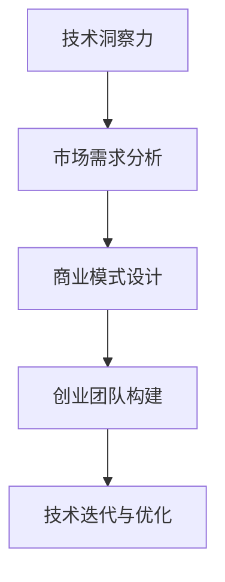

                 

## 1. 背景介绍

### 1.1 问题由来

随着科技的迅速发展，人工智能(AI)、机器学习(ML)、大数据、区块链等前沿技术正在改变各行各业的业务模式。这些技术不仅提升了企业的数据处理和决策能力，还催生了大量新技术和新产品。然而，技术转化与商业化的过程中，仍面临诸多挑战：技术落地难、商业盈利模式不清晰、用户需求难以把握等问题。

对于许多有志于进入前沿科技领域进行创业的技术人员来说，如何将所掌握的技术转化为实际的商业价值，成为了亟待解决的问题。本文旨在探讨如何利用技术洞察力，对前沿科技进行深入研究和商业化开发，为创业人员提供指引。

### 1.2 问题核心关键点

本文将围绕以下几个关键点进行深入讨论：

1. **技术洞察力**：理解技术趋势和底层原理，从根本上把握技术脉络。
2. **市场需求分析**：分析目标市场的真实需求，避免技术自嗨。
3. **商业模式设计**：设计创新、可持续的商业模式，最大化商业价值。
4. **创业团队构建**：组建跨学科的创业团队，互补技能和视野。
5. **技术迭代与优化**：持续进行技术迭代和优化，确保产品竞争力。

这些关键点相辅相成，共同构成了利用技术洞察力进行前沿科技创业的框架。

## 2. 核心概念与联系

### 2.1 核心概念概述

为更好地理解利用技术洞察力进行前沿科技创业的方法，本节将介绍几个关键概念：

- **技术洞察力**：指对技术趋势、潜在应用和底层原理的深刻理解。技术洞察力不仅关注技术的表面功能，更在于把握技术的内在机制和未来发展方向。

- **市场需求分析**：通过对目标市场的调查和分析，识别真实需求，并设计符合用户期待的产品和服务。

- **商业模式设计**：指围绕核心技术和产品，设计可行的盈利模式和业务流程，实现技术价值到商业价值的转化。

- **创业团队构建**：指根据产品和服务的特点，组建跨学科、多元化的创业团队，提升团队综合能力。

- **技术迭代与优化**：指持续进行技术研究和优化，确保产品与市场需求同步发展，增强产品竞争力。

这些概念之间的逻辑关系可以通过以下Mermaid流程图来展示：

这个流程图展示了各个概念之间的相互依赖和支撑关系。

## 3. 核心算法原理 & 具体操作步骤

### 3.1 算法原理概述

利用技术洞察力进行前沿科技创业，核心在于通过技术洞察力发现和把握技术趋势，分析市场需求，设计商业模式，构建创业团队，持续迭代优化产品。以下是对这一过程的详细阐述：

1. **技术洞察力发现**：通过深入研究现有技术文献、行业报告、技术会议等，理解技术发展脉络和未来趋势。
2. **市场需求分析**：通过市场调研、用户访谈、数据分析等方法，识别目标市场的需求和痛点。
3. **商业模式设计**：根据技术趋势和市场需求，设计符合用户需求和商业模式的产品和服务。
4. **创业团队构建**：根据项目需求，吸引和整合跨学科的优秀人才，形成互补的团队结构。
5. **技术迭代与优化**：持续进行技术研究和产品优化，保持产品竞争力和市场适应性。

### 3.2 算法步骤详解

#### 3.2.1 技术洞察力发现

1. **技术文献阅读**：广泛阅读行业内外的学术论文、技术博客、技术报告等，理解前沿技术的原理和应用。
2. **技术会议参加**：参加技术会议、黑客松、研讨会等活动，获取最新技术动态和行业趋势。
3. **专家交流**：与行业专家、技术大牛进行交流，获取第一手的技术见解和行业洞察。

#### 3.2.2 市场需求分析

1. **市场调研**：通过问卷调查、用户访谈等方式，收集目标市场的需求和痛点数据。
2. **数据分析**：使用数据分析工具（如Tableau、Python等），对收集的数据进行整理和分析，发现用户真实需求。
3. **竞品分析**：对竞争对手的产品进行深入分析，了解其优缺点，找到市场机会和差异化点。

#### 3.2.3 商业模式设计

1. **收入模型设计**：根据技术特点和市场需求，设计合适的收入模型，如订阅、广告、一次性销售等。
2. **用户路径设计**：设计用户从接触产品到最终购买的路径，确保产品易用性和用户体验。
3. **盈利预测**：基于市场调研和数据分析，进行盈利预测，评估商业模式的可行性。

#### 3.2.4 创业团队构建

1. **人才招聘**：根据项目需求，招聘具备相关技能和经验的人才，确保团队多样性。
2. **团队培训**：组织内部培训和技术分享，提升团队整体技术水平和业务能力。
3. **团队协作**：建立团队协作机制，确保信息透明和资源共享。

#### 3.2.5 技术迭代与优化

1. **持续研发**：定期进行技术研发和创新，保持技术领先性。
2. **用户反馈**：收集用户反馈，进行产品改进和优化。
3. **迭代发布**：持续发布新版本，确保产品与市场需求同步发展。

### 3.3 算法优缺点

利用技术洞察力进行前沿科技创业具有以下优点：

1. **技术领先**：通过深入研究技术趋势，把握前沿技术，保持技术领先性。
2. **市场敏锐**：通过市场需求分析，精准把握用户需求，设计符合市场的产品。
3. **商业可持**：通过设计合理的商业模式，实现技术和商业的良性循环。
4. **团队协作**：通过构建跨学科团队，提升团队综合能力，增强团队协作力。

然而，这一方法也存在一定的局限性：

1. **资源投入高**：技术洞察和市场需求分析需要大量资源投入，包括时间、资金、人力等。
2. **风险不确定**：市场需求和技术趋势都存在不确定性，创业项目可能面临失败的风险。
3. **市场竞争激烈**：前沿科技领域竞争激烈，如何突出重围，获得用户认可，是一个难题。

### 3.4 算法应用领域

利用技术洞察力进行前沿科技创业，在多个领域均有应用：

1. **人工智能**：通过AI技术洞察，开发智能推荐系统、智能客服、智能监控等产品。
2. **大数据**：通过大数据技术洞察，提供数据咨询、数据治理、数据分析等服务。
3. **区块链**：通过区块链技术洞察，开发数字身份认证、供应链溯源、智能合约等应用。
4. **物联网**：通过物联网技术洞察，开发智能家居、智能制造、智慧城市等解决方案。
5. **健康科技**：通过健康科技技术洞察，提供远程医疗、健康监测、智能健身等产品。

## 4. 数学模型和公式 & 详细讲解 & 举例说明

### 4.1 数学模型构建

在利用技术洞察力进行创业的过程中，涉及多个环节，包括技术洞察力发现、市场需求分析、商业模式设计、创业团队构建、技术迭代与优化等。这些环节可以通过数学模型进行刻画：

1. **技术洞察力发现**：使用指数模型描述技术趋势的发展速度，通过R&D投入预测技术成熟度。
2. **市场需求分析**：使用多元回归模型分析用户需求与产品特性的关系。
3. **商业模式设计**：使用线性规划模型设计收入模型，通过优化算法找到最优解。
4. **创业团队构建**：使用组合优化模型选择最优团队配置。
5. **技术迭代与优化**：使用时间序列模型预测技术迭代周期，通过迭代优化模型提高产品性能。

### 4.2 公式推导过程

以市场需求分析中的多元回归模型为例，推导其基本公式。

设市场需求为$y$，影响因素为$x_1, x_2, ..., x_n$，则多元回归模型可表示为：

$$ y = \beta_0 + \beta_1 x_1 + \beta_2 x_2 + ... + \beta_n x_n + \epsilon $$

其中，$\beta_i$为回归系数，$\epsilon$为误差项。

通过最小二乘法，可以求解回归系数$\beta_i$，使得预测值与真实值之间的误差最小化：

$$ \hat{\beta} = \arg\min_{\beta} \sum_{i=1}^n (y_i - \beta_0 - \beta_1 x_{i1} - \beta_2 x_{i2} - ... - \beta_n x_{in})^2 $$

求解上述优化问题，得到回归系数$\hat{\beta}$，进而得到市场需求预测模型。

### 4.3 案例分析与讲解

以区块链技术创业为例，分析如何利用技术洞察力进行市场和商业模式设计。

**技术洞察力发现**：区块链技术因其去中心化、透明性、可追溯性等特点，正在被应用于金融、供应链、医疗等多个领域。通过深入研究区块链技术原理和应用场景，可以洞察其未来发展趋势。

**市场需求分析**：通过市场调研和用户访谈，发现金融领域对于交易结算速度和安全性的需求非常迫切，供应链领域对于货物溯源和透明度的需求也很高。

**商业模式设计**：根据技术洞察力和市场需求，设计了基于区块链的智能合约和溯源平台，通过智能合约实现自动执行和高效结算，通过溯源平台实现货物信息透明和防伪。

**创业团队构建**：组建了包括区块链技术专家、金融行业专家和供应链管理专家的跨学科团队，确保技术研发和市场需求紧密结合。

**技术迭代与优化**：持续进行区块链技术研究和产品优化，确保平台性能和用户体验不断提升。

## 5. 项目实践：代码实例和详细解释说明

### 5.1 开发环境搭建

在进行前沿科技创业的实践中，开发环境搭建是非常重要的一步。以下是一些常用的开发工具和环境配置流程：

1. **开发工具选择**：选择适合的技术栈和开发工具，如Python、Java、JavaScript等。
2. **开发环境配置**：配置开发环境，包括IDE、版本控制系统、数据库等。
3. **云计算平台**：使用AWS、Azure、Google Cloud等云平台进行云资源部署。

### 5.2 源代码详细实现

以区块链智能合约平台为例，给出具体的代码实现步骤和解释。

1. **区块链平台选择**：选择以太坊或Hyperledger等区块链平台，进行开发环境搭建。
2. **智能合约编写**：使用Solidity或Go等语言编写智能合约，定义合约功能。
3. **平台部署**：将智能合约部署到区块链网络，确保合约可执行和可信。
4. **API接口设计**：设计API接口，提供外部访问和数据交互。

### 5.3 代码解读与分析

对上述代码实现步骤进行详细解读和分析：

1. **区块链平台搭建**：搭建以太坊或Hyperledger开发环境，配置智能合约开发工具。
2. **智能合约编写**：使用Solidity编写智能合约，定义合约功能，如自动执行交易、记录货物信息等。
3. **合约部署**：将智能合约部署到区块链网络，确保合约代码的可执行性和安全性。
4. **API接口设计**：设计API接口，提供外部访问，实现用户注册、货物溯源等功能。

### 5.4 运行结果展示

展示智能合约平台的关键功能和运行结果，包括合约执行情况、溯源信息展示等。

1. **合约执行情况**：展示智能合约的自动执行情况，包括交易成功率、结算速度等指标。
2. **溯源信息展示**：展示货物溯源信息，包括生产日期、产地、运输过程等详细信息。

## 6. 实际应用场景

### 6.1 智能合约平台

基于区块链的智能合约平台，可以应用于金融、供应链、医疗等多个领域，实现自动化交易、数据透明、智能合约等功能。例如，在金融领域，可以用于自动执行贷款、保险等金融合同，提高交易效率和安全性。

### 6.2 溯源平台

基于区块链的溯源平台，可以应用于食品、药品、电子产品等产品追溯，确保产品的真实性和安全性。例如，在食品领域，可以通过溯源平台实时监控食品生产、运输过程，保障食品安全。

### 6.3 智能合约平台

基于区块链的智能合约平台，可以应用于供应链管理、政府采购等场景，实现合同自动化执行、供应链透明化、数据不可篡改等。例如，在供应链领域，可以通过智能合约平台实现货物自动结算、货物流转追踪等功能。

## 7. 工具和资源推荐

### 7.1 学习资源推荐

1. **Coursera《区块链技术》课程**：由斯坦福大学开设的区块链技术课程，详细讲解区块链技术原理和应用场景。
2. **EdX《人工智能基础》课程**：由麻省理工学院开设的人工智能基础课程，涵盖人工智能的基本概念和算法。
3. **Google Developers 开发者文档**：提供全面的Google技术文档和API，帮助开发者进行前沿技术开发。
4. **GitHub 代码库**：提供全球最大的开源代码库，涵盖多种前沿技术项目和代码实现。
5. **Stack Overflow**：全球最大的开发者问答社区，提供丰富的技术讨论和问题解答。

### 7.2 开发工具推荐

1. **Python**：Python语言简洁高效，广泛应用于机器学习、数据分析、区块链等领域。
2. **Git**：版本控制系统，帮助开发者进行代码管理、协作开发。
3. **Docker**：容器化技术，提供可靠的开发和部署环境。
4. **Jupyter Notebook**：交互式开发环境，方便进行数据处理和算法开发。
5. **AWS**：云平台，提供丰富的云资源和云服务，方便进行大规模部署和扩展。

### 7.3 相关论文推荐

1. **Blockchain Technology: A Review**：详细介绍区块链技术的原理、应用和未来发展方向。
2. **Artificial Intelligence: A Modern Approach**：深入讲解人工智能技术的基本原理和最新进展。
3. **Machine Learning in Practice**：介绍机器学习技术在实际应用中的经典案例和实现方法。
4. **Deep Learning Specialization**：由Andrew Ng主讲的深度学习课程，涵盖深度学习的基本概念和应用。

## 8. 总结：未来发展趋势与挑战

### 8.1 总结

本文探讨了如何利用技术洞察力进行前沿科技创业的方法。首先通过技术洞察力发现和把握技术趋势，分析市场需求，设计商业模式，构建创业团队，持续迭代优化产品。这些步骤相辅相成，共同构成了前沿科技创业的完整流程。

通过本文的系统梳理，可以看到，利用技术洞察力进行前沿科技创业，需要技术、市场、商业、团队等多方面的协同合作，才能实现技术的落地和商业价值的最大化。

### 8.2 未来发展趋势

未来，利用技术洞察力进行前沿科技创业将呈现以下几个发展趋势：

1. **技术融合加速**：随着技术的不断发展，人工智能、大数据、区块链等技术将深度融合，形成更加强大的综合技术能力。
2. **跨界应用拓展**：前沿科技将更多应用于医疗、教育、环保等垂直行业，解决行业痛点，推动社会进步。
3. **人机协同提升**：通过技术洞察力，提升人机协同能力，实现更加智能化和人性化的产品和服务。
4. **商业模式创新**：未来商业模式将更加多样化，如共享经济、平台经济、社交电商等，形成更加灵活和可持续的商业模式。
5. **用户需求导向**：以用户需求为导向，进行技术研发和产品设计，提升用户体验和满意度。

### 8.3 面临的挑战

尽管利用技术洞察力进行前沿科技创业具有广阔前景，但仍面临诸多挑战：

1. **技术复杂性**：前沿科技涉及多种复杂技术，技术难度大、成本高。
2. **市场需求不确定**：市场需求和技术趋势存在不确定性，创业项目可能面临失败的风险。
3. **市场竞争激烈**：前沿科技领域竞争激烈，如何突出重围，获得用户认可，是一个难题。
4. **资金压力**：前沿科技创业需要大量的资金投入，资金压力较大。
5. **人才短缺**：前沿科技领域需要高水平的跨学科人才，人才短缺是一个普遍问题。

### 8.4 研究展望

未来的研究需要在以下几个方面寻求新的突破：

1. **技术深入研究**：进一步深入研究前沿技术的原理和应用，开发更加高效、可靠的技术方案。
2. **市场应用验证**：进行大规模的市场验证，确保技术应用符合市场需求，并不断优化产品。
3. **商业模型创新**：探索更多创新的商业模式，最大化商业价值和技术价值。
4. **人才招募培养**：通过多种方式吸引和培养高水平跨学科人才，提升团队综合能力。
5. **资金筹集管理**：通过多种渠道筹集资金，合理管理资金使用，确保项目顺利进行。

## 9. 附录：常见问题与解答

**Q1：如何进行技术洞察力发现？**

A: 技术洞察力发现需要广泛阅读技术文献、参加技术会议、与专家交流，获取技术趋势和应用场景的深刻理解。

**Q2：如何进行市场需求分析？**

A: 市场需求分析需要进行市场调研、用户访谈、数据分析，识别目标市场的需求和痛点，并通过回归模型进行数据分析。

**Q3：如何进行商业模式设计？**

A: 商业模式设计需要根据技术趋势和市场需求，设计合理的收入模型、用户路径和盈利预测。

**Q4：如何进行创业团队构建？**

A: 创业团队构建需要根据项目需求，招聘具备相关技能和经验的人才，并进行团队培训和协作机制建设。

**Q5：如何进行技术迭代与优化？**

A: 技术迭代与优化需要持续进行技术研发和产品优化，通过用户反馈进行迭代改进，确保产品与市场需求同步发展。

---

作者：禅与计算机程序设计艺术 / Zen and the Art of Computer Programming

