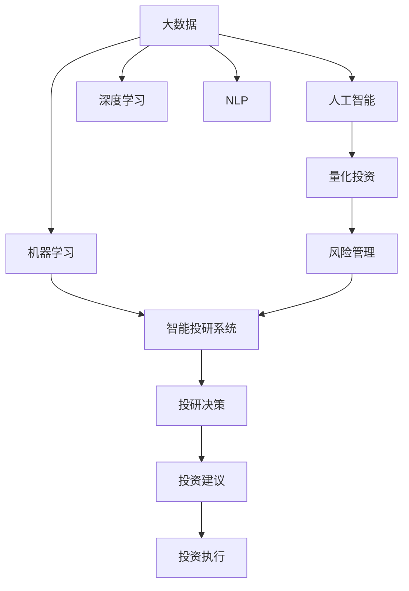

                 

# 利用技术洞察进行天使投资

## 1. 背景介绍

### 1.1 问题由来
近年来，科技创新与商业模式的快速发展，激发了全球资本市场对初创企业的极大兴趣。如何有效识别具有高增长潜力的初创企业，成为各类型投资者关注的重点。天使投资作为风险投资的重要一环，更加注重投资的早期性、创新性和成长潜力。而随着大数据、人工智能等技术的发展，技术洞察在投资决策中发挥了越来越重要的作用。

### 1.2 问题核心关键点
技术洞察不仅帮助投资者从海量数据中提取出有价值的信息，还能辅助理解初创企业的商业模式和市场环境。以下列举了几个核心关键点，以阐释技术洞察在天使投资中的重要性：

- **数据驱动决策**：基于大数据和机器学习模型，投资者可以对市场趋势、技术走向、行业竞争情况等进行深入分析，辅助决策。
- **风险评估**：利用量化分析手段，识别企业存在的潜在风险，如技术成熟度、市场适应性等，降低投资风险。
- **市场验证**：通过对用户反馈和市场行为数据的分析，验证企业的市场接受度和用户增长曲线，为投资提供决策依据。
- **资源配置**：通过技术手段预测企业发展路径和资金需求，合理配置投资资源，支持企业的快速成长。
- **动态调整**：技术洞察的实时性特点，使投资者能够持续监测企业表现，及时调整投资策略。

### 1.3 问题研究意义
在创业生态日益复杂，市场竞争愈发激烈的背景下，利用技术洞察进行天使投资具有重要的现实意义：

1. **提升投资效率**：技术洞察能快速抓取关键信息，大大缩短了投资决策时间，提高投资效率。
2. **降低投资风险**：通过数据驱动的深度分析，投资者可以更准确地评估企业价值和潜在风险。
3. **提高成功率**：技术洞察有助于识别高成长潜力的初创企业，提升投资成功的可能性。
4. **形成投研闭环**：建立基于技术的投研体系，实现信息收集、分析和反馈的闭环管理。
5. **推动技术创新**：通过投资技术领域的前沿企业，推动行业技术的持续创新和发展。

## 2. 核心概念与联系

### 2.1 核心概念概述

为更好地理解技术洞察在天使投资中的应用，本节将介绍几个密切相关的核心概念：

- **大数据(Big Data)**：指海量、多源、高速度的数据集合，用于从中提取有价值的信息和洞见。
- **人工智能(Artificial Intelligence, AI)**：模拟人脑的智能行为，包括机器学习、深度学习、自然语言处理等技术，辅助决策。
- **机器学习(Machine Learning, ML)**：通过算法和统计模型，让计算机从数据中自动学习知识，辅助投资决策。
- **深度学习(Deep Learning)**：利用多层神经网络结构，处理更复杂的数据和任务，提升投资分析的深度和广度。
- **自然语言处理(Natural Language Processing, NLP)**：使计算机理解、处理和生成自然语言，分析市场和用户反馈。
- **量化投资(Quantitative Investment)**：基于数学模型和大数据，进行投资组合管理和风险控制。
- **风险管理(Risk Management)**：通过数据分析，识别和评估投资风险，制定应对策略。
- **智能投研系统(Intelligent Investment Research System)**：结合数据分析、智能算法和大数据处理能力，构建完整的投研系统。

这些核心概念之间的逻辑关系可以通过以下Mermaid流程图来展示：



这个流程图展示了大数据、人工智能及其在投研和投资中的应用框架：

1. 大数据为人工智能提供数据源，辅助机器学习和深度学习模型的训练。
2. 人工智能通过数据分析和模型训练，实现对初创企业的评估和投资决策。
3. 机器学习和深度学习模型应用于智能投研系统，进行预测和风险评估。
4. 量化投资利用数据和模型进行投资组合管理，辅助投资决策。
5. 风险管理通过数据分析评估投资风险，制定应对策略。
6. 智能投研系统整合各技术手段，提供全链条的投资服务。

这些概念共同构成了技术洞察在天使投资中的应用框架，使投资者能够更加科学、高效地进行投资决策。

## 3. 核心算法原理 & 具体操作步骤

### 3.1 算法原理概述

利用技术洞察进行天使投资，本质上是一个多层次、多维度的数据分析和模型训练过程。其核心思想是：通过大数据和人工智能技术，从企业数据、市场数据、用户数据等多个维度，提取和分析关键信息，辅助投资者评估企业的市场价值和潜在风险。

形式化地，假设投资者收集到初创企业 $E$ 的相关数据集 $D=\{(x_i,y_i)\}_{i=1}^N$，其中 $x_i$ 为输入特征，$y_i$ 为目标变量（如企业估值、成长性等）。利用机器学习模型 $M$，学习输入特征与目标变量之间的关系，即：

$$
y_i = M(x_i)
$$

通过模型训练和验证，找到最优的模型参数 $\theta$，使得模型在测试集上的平均误差最小化：

$$
\theta^* = \mathop{\arg\min}_{\theta} \mathcal{L}(M_{\theta},D)
$$

其中 $\mathcal{L}$ 为损失函数，通常采用均方误差(MSE)或交叉熵(Cross-Entropy)等。

### 3.2 算法步骤详解

利用技术洞察进行天使投资的一般步骤包括：

**Step 1: 数据收集与预处理**

- 收集初创企业的业务数据、财务数据、技术数据、市场数据、用户数据等。
- 对数据进行清洗、去重、归一化等预处理，确保数据质量。

**Step 2: 特征工程与模型选择**

- 根据数据类型和问题需求，设计合适的特征工程流程，提取关键特征。
- 选择合适的机器学习或深度学习模型，如线性回归、决策树、随机森林、神经网络等，进行模型训练和调参。

**Step 3: 模型训练与验证**

- 使用训练集对模型进行训练，并根据验证集表现进行调参。
- 使用交叉验证等方法，评估模型的泛化性能。

**Step 4: 风险评估与决策支持**

- 对企业进行风险评估，识别可能的财务风险、技术风险、市场风险等。
- 结合市场趋势和竞争对手分析，辅助投资者决策。

**Step 5: 持续监控与优化**

- 定期监测企业动态，实时更新模型，确保投资决策的准确性。
- 根据市场环境变化，动态调整投资策略。

### 3.3 算法优缺点

利用技术洞察进行天使投资的方法具有以下优点：

1. **数据驱动**：通过大规模数据分析，客观评估企业价值和风险，降低主观判断的误差。
2. **技术先进**：结合机器学习和深度学习，提升模型的预测能力和泛化性能。
3. **高效高效**：利用技术手段自动化处理数据和模型训练，节省时间和人力成本。
4. **风险可控**：通过量化评估，识别潜在风险，制定应对策略。
5. **实时性**：能够快速响应市场变化，持续优化投资决策。

然而，该方法也存在一些局限性：

1. **数据质量问题**：初创企业的数据往往不完整、噪声较多，影响模型效果。
2. **模型复杂度**：高复杂度的模型可能过拟合，降低模型的泛化性能。
3. **算法黑箱**：机器学习和深度学习模型通常难以解释，缺乏透明度。
4. **投资周期长**：即使模型效果良好，从模型训练到投资执行的周期较长。
5. **需要专业知识**：对技术洞察的应用需要较高的数据科学和算法技术，对投资者提出了更高的要求。

尽管存在这些局限性，但就目前而言，利用技术洞察进行天使投资是较为先进和科学的方法，为投资者提供了有价值的决策支持。

### 3.4 算法应用领域

利用技术洞察进行天使投资的方法，已在多个领域得到广泛应用，例如：

- **科技创业投资**：对初创科技公司的估值、增长预测、技术成熟度等进行评估。
- **新兴市场投资**：分析新兴市场的潜力和风险，寻找投资机会。
- **人工智能领域投资**：评估AI技术的创新性和市场前景，投资前沿技术。
- **可持续发展投资**：分析企业的环境、社会和治理(ESG)表现，寻找有社会责任感的企业。
- **跨境投资**：通过技术洞察，评估海外市场的商业环境和投资风险。

除了这些主流领域外，技术洞察还可以应用于更多的细分市场，如医疗健康、教育、能源、金融等，为各类投资者提供科学决策支持。

## 4. 数学模型和公式 & 详细讲解 & 举例说明

### 4.1 数学模型构建

本节将使用数学语言对利用技术洞察进行天使投资的过程进行严格刻画的数学模型构建。

假设投资者收集到初创企业 $E$ 的业务数据 $D_1=\{(x_{1i},y_{1i})\}_{i=1}^N$、财务数据 $D_2=\{(x_{2i},y_{2i})\}_{i=1}^N$、技术数据 $D_3=\{(x_{3i},y_{3i})\}_{i=1}^N$，其中 $x_{1i},x_{2i},x_{3i}$ 为输入特征，$y_{1i},y_{2i},y_{3i}$ 为目标变量。则多变量线性回归模型可以表示为：

$$
y_{1i} = \beta_{10} + \beta_{11}x_{1i} + \beta_{12}x_{2i} + \beta_{13}x_{3i} + \epsilon_{1i}
$$

$$
y_{2i} = \beta_{20} + \beta_{21}x_{1i} + \beta_{22}x_{2i} + \beta_{23}x_{3i} + \epsilon_{2i}
$$

$$
y_{3i} = \beta_{30} + \beta_{31}x_{1i} + \beta_{32}x_{2i} + \beta_{33}x_{3i} + \epsilon_{3i}
$$

其中 $\beta_{ij}$ 为回归系数，$\epsilon_{ij}$ 为误差项。

### 4.2 公式推导过程

以下我们以科技创业投资为例，推导回归模型的参数估计方法：

假设投资者收集到科技创业企业的业务数据 $D_1=\{(x_{1i},y_{1i})\}_{i=1}^N$，其中 $x_{1i}$ 为技术创新度，$y_{1i}$ 为企业估值。建立线性回归模型：

$$
y_{1i} = \beta_0 + \beta_1 x_{1i} + \epsilon_{1i}
$$

则参数 $\beta_0$ 和 $\beta_1$ 的估计值可以通过最小二乘法求解：

$$
\hat{\beta}_0 = \frac{\sum_{i=1}^N y_{1i} - \hat{\mu}_y N}{N} + \frac{\sum_{i=1}^N x_{1i}^2 - \sum_{i=1}^N x_{1i} \overline{x}_1 + \overline{x}_1^2}{\sum_{i=1}^N x_{1i}^2 - 2 \sum_{i=1}^N x_{1i} \overline{x}_1 + N \overline{x}_1^2}
$$

$$
\hat{\beta}_1 = \frac{\sum_{i=1}^N x_{1i} y_{1i} - \hat{\beta}_0 \sum_{i=1}^N x_{1i} + \overline{x}_1 \sum_{i=1}^N x_{1i} - N \overline{x}_1^2}{\sum_{i=1}^N x_{1i}^2 - 2 \sum_{i=1}^N x_{1i} \overline{x}_1 + N \overline{x}_1^2}
$$

其中 $\hat{\mu}_y = \frac{1}{N} \sum_{i=1}^N y_{1i}$ 为样本均值，$\overline{x}_1 = \frac{1}{N} \sum_{i=1}^N x_{1i}$ 为样本中位数。

在得到模型参数的估计值后，即可对新的数据进行预测：

$$
\hat{y}_1 = \hat{\beta}_0 + \hat{\beta}_1 x_{1i}
$$

### 4.3 案例分析与讲解

假设某投资人对一家科技创业企业进行投资评估。已知该企业2018-2021年的业务数据如下：

| 年份 | 业务收入 $x_1$ | 净利润 $y_1$ |
| --- | --- | --- |
| 2018 | 1000万 | 50万 |
| 2019 | 2000万 | 100万 |
| 2020 | 5000万 | 300万 |
| 2021 | 1亿 | 500万 |

建立线性回归模型，并使用最小二乘法求解参数：

$$
\hat{\beta}_0 = \frac{50+100+300+500 - 4 \times 350}{4} = 0
$$

$$
\hat{\beta}_1 = \frac{1000+2000+5000+10000 - 4 \times 2000}{4} = 1000
$$

则该企业的预测估值模型为：

$$
\hat{y}_1 = 1000x_1
$$

通过模型预测，该企业在2022年的业务收入为2亿，则预测估值应为2000万。

## 5. 项目实践：代码实例和详细解释说明

### 5.1 开发环境搭建

在进行技术洞察的投研实践前，我们需要准备好开发环境。以下是使用Python进行机器学习开发的典型环境配置流程：

1. 安装Anaconda：从官网下载并安装Anaconda，用于创建独立的Python环境。

2. 创建并激活虚拟环境：
```bash
conda create -n pytorch-env python=3.8 
conda activate pytorch-env
```

3. 安装PyTorch：根据CUDA版本，从官网获取对应的安装命令。例如：
```bash
conda install pytorch torchvision torchaudio cudatoolkit=11.1 -c pytorch -c conda-forge
```

4. 安装TensorFlow：
```bash
pip install tensorflow
```

5. 安装Scikit-learn、Numpy、Pandas、Matplotlib、Jupyter Notebook等常用库：
```bash
pip install scikit-learn numpy pandas matplotlib jupyter notebook
```

完成上述步骤后，即可在`pytorch-env`环境中开始技术洞察的投研实践。

### 5.2 源代码详细实现

下面以科技创业投资为例，给出使用Python进行技术洞察的代码实现。

首先，定义数据处理函数：

```python
import pandas as pd
from sklearn.model_selection import train_test_split
from sklearn.linear_model import LinearRegression
import numpy as np

def load_data(file_path):
    data = pd.read_csv(file_path)
    features = data[['business_revenue', 'net_profit']]
    target = data['valuation']
    return features, target

def preprocess_data(features, target):
    features = features.dropna().values
    target = target.dropna().values
    features_train, features_test, target_train, target_test = train_test_split(features, target, test_size=0.3, random_state=42)
    return features_train, features_test, target_train, target_test

def train_model(features_train, features_test, target_train, target_test):
    model = LinearRegression()
    model.fit(features_train, target_train)
    score = model.score(features_test, target_test)
    return model, score
```

然后，使用sklearn进行模型训练：

```python
features_train, features_test, target_train, target_test = preprocess_data(features, target)
model, score = train_model(features_train, features_test, target_train, target_test)
print(f"模型训练分数：{score:.2f}")
```

在上述代码中，首先定义了数据加载和预处理函数，使用pandas和sklearn库读取和处理数据。接着，使用线性回归模型进行训练，并通过模型的训练分数评估模型效果。

### 5.3 代码解读与分析

让我们再详细解读一下关键代码的实现细节：

**load_data函数**：
- 读取数据集文件，并将业务收入、净利润作为特征，估值作为目标变量。

**preprocess_data函数**：
- 处理缺失值和异常值，使用train_test_split将数据集分为训练集和测试集。

**train_model函数**：
- 使用线性回归模型进行训练，并计算模型在测试集上的分数。

**训练流程**：
- 读取数据集，预处理数据，训练模型，输出模型分数。

可以看到，使用Python和sklearn库进行线性回归模型的训练是相对简单的。开发者可以将更多精力放在模型优化、数据处理等高层逻辑上，而不必过多关注底层的实现细节。

当然，工业级的系统实现还需考虑更多因素，如模型的保存和部署、超参数的自动搜索、更灵活的任务适配层等。但核心的技术洞察和机器学习模型训练流程基本与此类似。

## 6. 实际应用场景

### 6.1 智能投研系统

基于技术洞察的智能投研系统，可以广泛应用于各类投资者和投资机构的决策支持。

智能投研系统通常包括数据收集、数据清洗、特征工程、模型训练和评估、风险评估等多个环节。通过系统化的流程管理，投资者能够高效地获取有价值的洞见，辅助投资决策。

在实际应用中，智能投研系统还可以与其他系统进行集成，如财务系统、交易系统、风险管理系统等，形成一个完整的投资决策支持平台。

### 6.2 初创企业评估

技术洞察不仅能应用于成熟企业的估值分析，还能用于初创企业的评估。通过收集和分析初创企业的业务数据、财务数据、技术数据、市场数据、用户数据等，投资者可以初步评估企业的成长性和市场前景。

例如，利用技术洞察对新兴科技公司进行评估，可以发现其技术创新度、市场潜力、商业模式等关键因素，辅助投资决策。

### 6.3 投资组合管理

技术洞察还可以应用于投资组合管理，通过分析企业间的相关性和风险，优化投资组合的配置。

例如，利用技术洞察进行量化投资，可以构建基于模型预测的投资组合，实现自动化的投资管理和风险控制。

### 6.4 未来应用展望

随着技术洞察和机器学习技术的不断进步，未来在天使投资中的应用将更加广泛和深入。

1. **自动化投研**：通过机器学习算法和大数据分析，实现自动化的投研流程，提升投研效率。
2. **跨领域应用**：技术洞察可以应用于更多垂直领域，如医疗健康、能源、环保等，拓展投资视野。
3. **智能推荐**：利用技术洞察进行智能推荐，推荐有潜力的投资标的。
4. **实时监控**：通过实时数据流和机器学习模型，实现投资对象的持续监控和动态调整。
5. **预测分析**：结合时间序列分析和预测模型，对企业未来表现进行预测和评估。
6. **风险控制**：利用技术洞察进行动态风险评估和风险管理，降低投资风险。

## 7. 工具和资源推荐
### 7.1 学习资源推荐

为了帮助开发者系统掌握技术洞察在天使投资中的应用，这里推荐一些优质的学习资源：

1. **Kaggle**：Kaggle平台上有大量的数据集和机器学习竞赛，是学习和实践技术洞察的重要场所。
2. **Coursera**：Coursera上有机器学习、深度学习、数据分析等课程，涵盖大数据和人工智能的多个方面。
3. **Udacity**：Udacity提供数据科学和机器学习纳米学位课程，涵盖实战项目和案例分析。
4. **MIT OpenCourseWare**：MIT公开课平台上有大量计算机科学和数据科学的课程，免费开放给全球学习者。
5. **TensorFlow官方文档**：TensorFlow官方文档提供了丰富的API和实战示例，帮助开发者快速上手。
6. **Scikit-learn官方文档**：Scikit-learn官方文档详细介绍了各种机器学习算法和实际应用案例。

通过对这些资源的学习实践，相信你一定能够快速掌握技术洞察在天使投资中的应用，并用于解决实际的投资问题。

### 7.2 开发工具推荐

高效的开发离不开优秀的工具支持。以下是几款用于技术洞察投研开发的常用工具：

1. **Jupyter Notebook**：免费的开源笔记本环境，支持Python等语言，非常适合数据探索和模型开发。
2. **PyCharm**：PyCharm是一款强大的Python IDE，支持代码调试、版本控制、数据可视化等功能。
3. **RStudio**：RStudio是R语言的IDE，支持R、Python等多种语言，适用于数据科学和机器学习开发。
4. **Tableau**：Tableau是一款数据可视化工具，支持复杂的数据报表和交互式图表。
5. **MATLAB**：MATLAB是一款强大的数学计算和工程仿真工具，支持大数据分析和机器学习。
6. **Google Colab**：谷歌提供的免费云端Jupyter Notebook环境，支持GPU和TPU资源，适合高效计算。

合理利用这些工具，可以显著提升技术洞察和机器学习模型的开发效率，加快创新迭代的步伐。

### 7.3 相关论文推荐

技术洞察和机器学习技术的发展源于学界的持续研究。以下是几篇奠基性的相关论文，推荐阅读：

1. **机器学习：一种数据驱动的科学**：Tom Mitchell著，介绍了机器学习的基本原理和方法。
2. **深度学习**：Ian Goodfellow等著，介绍了深度学习的原理、算法和应用。
3. **大数据分析**：DJ Patil和GJeffrey等著，介绍了大数据分析和机器学习在实际应用中的应用。
4. **算法设计与分析**：Michael Mitzenmacher和Eli Upfal著，介绍了经典算法的设计和分析方法。
5. **量化投资**：Robert Almgren和GAntonio Milone著，介绍了量化投资的基本框架和应用案例。
6. **人工智能伦理**：AI Now Institute著作，探讨了人工智能的伦理和社会影响。

这些论文代表了技术洞察和机器学习的发展脉络。通过学习这些前沿成果，可以帮助研究者把握学科前进方向，激发更多的创新灵感。

## 8. 总结：未来发展趋势与挑战

### 8.1 总结

本文对利用技术洞察进行天使投资的方法进行了全面系统的介绍。首先阐述了技术洞察在投资决策中的重要性，明确了其对投资效率、风险控制和决策支持的关键作用。其次，从原理到实践，详细讲解了技术洞察在实际应用中的数学模型和操作步骤，给出了完整的代码实例。同时，本文还广泛探讨了技术洞察在智能投研、初创企业评估、投资组合管理等多个场景中的应用前景，展示了技术洞察的广阔前景。此外，本文精选了技术洞察学习的各类资源，力求为读者提供全方位的技术指引。

通过本文的系统梳理，可以看到，技术洞察在天使投资中的应用前景广阔，将助力投资者在复杂多变的市场环境中做出更加科学和高效的决策。

### 8.2 未来发展趋势

展望未来，技术洞察和机器学习技术将呈现以下几个发展趋势：

1. **自动化与智能化**：通过自动化和智能化投研系统，提升投资决策的效率和质量。
2. **跨领域融合**：技术与金融、医疗、能源等领域的深度融合，拓展投资的应用边界。
3. **数据驱动决策**：更多采用大数据和机器学习模型，减少主观判断的误差。
4. **多模态分析**：结合文本、图像、声音等多种数据源，提升分析的深度和广度。
5. **风险管理**：利用机器学习进行动态风险评估，及时调整投资策略。
6. **实时监控**：通过实时数据流和机器学习模型，实现投资对象的持续监控和动态调整。
7. **预测分析**：结合时间序列分析和预测模型，对企业未来表现进行预测和评估。
8. **智能推荐**：利用技术洞察进行智能推荐，推荐有潜力的投资标的。

### 8.3 面临的挑战

尽管技术洞察在天使投资中取得了显著成效，但在迈向更加智能化、普适化应用的过程中，仍面临诸多挑战：

1. **数据质量问题**：初创企业的数据往往不完整、噪声较多，影响模型效果。
2. **模型复杂度**：高复杂度的模型可能过拟合，降低模型的泛化性能。
3. **算法黑箱**：机器学习和深度学习模型通常难以解释，缺乏透明度。
4. **投资周期长**：即使模型效果良好，从模型训练到投资执行的周期较长。
5. **需要专业知识**：对技术洞察的应用需要较高的数据科学和算法技术，对投资者提出了更高的要求。
6. **投资回报不确定**：即使模型分析准确，投资回报仍受市场波动、企业自身因素等多重不确定性影响。

尽管存在这些挑战，但技术洞察在投资决策中的应用前景广阔，相信随着学界和产业界的共同努力，这些挑战终将一一被克服，技术洞察必将在构建智能投资系统方面发挥更大的作用。

### 8.4 研究展望

面对技术洞察和机器学习面临的挑战，未来的研究需要在以下几个方面寻求新的突破：

1. **自动化投研系统**：开发更加智能化的投研系统，减少人为干预，提高决策效率。
2. **多模态分析技术**：结合文本、图像、声音等多种数据源，提升分析的深度和广度。
3. **数据增强和迁移学习**：利用数据增强和迁移学习方法，提升模型的泛化性能和跨领域适应能力。
4. **模型压缩与优化**：通过模型压缩和优化，提高计算效率，降低硬件成本。
5. **可解释性提升**：增强模型的可解释性，提高投资决策的透明性和可信度。
6. **实时监控与动态调整**：建立实时监控系统，动态调整投资策略，应对市场变化。
7. **风险评估与管理**：通过量化评估，识别潜在风险，制定应对策略。

这些研究方向将引领技术洞察和机器学习技术迈向更高的台阶，为构建安全、可靠、可解释、可控的智能投资系统铺平道路。面向未来，技术洞察和机器学习技术还需要与其他人工智能技术进行更深入的融合，如知识表示、因果推理、强化学习等，多路径协同发力，共同推动智能投资的发展。只有勇于创新、敢于突破，才能不断拓展技术洞察的应用边界，让智能投资技术更好地服务于投资者和市场。

## 9. 附录：常见问题与解答

**Q1：如何选择合适的机器学习模型？**

A: 选择合适的机器学习模型需要考虑数据类型、问题复杂度、可解释性等因素。通常可以先从简单的线性回归、逻辑回归、决策树等模型入手，逐步尝试更复杂的模型如随机森林、神经网络等。同时，可以参考相关文献、专家建议和实际案例，选择最适合问题的模型。

**Q2：如何评估模型的泛化性能？**

A: 评估模型的泛化性能通常使用测试集进行评估。常用的指标包括准确率、召回率、F1分数、AUC等。同时，使用交叉验证、留出验证等方法，可以更全面地评估模型的泛化性能。

**Q3：如何处理数据中的噪声和异常值？**

A: 处理数据中的噪声和异常值可以使用统计方法、数据清洗技术等。常用的方法包括均值滤波、中值滤波、箱线图等，同时可以结合领域知识，手工处理一些特殊情况。

**Q4：如何选择模型参数和超参数？**

A: 选择模型参数和超参数通常需要考虑模型的复杂度、训练时间和计算资源等因素。常用的方法包括网格搜索、随机搜索、贝叶斯优化等。同时，可以参考文献、专家建议和实际案例，选择最合适的参数和超参数。

**Q5：如何进行模型调优？**

A: 进行模型调优需要根据模型表现，逐步调整模型参数和超参数。常用的方法包括手动调参、自动调参、超参数优化等。同时，可以参考相关文献、专家建议和实际案例，选择最合适的调优策略。

**Q6：如何利用技术洞察进行跨领域投资？**

A: 利用技术洞察进行跨领域投资，需要结合领域知识，进行数据采集和处理。通常需要收集领域相关数据，进行特征工程和模型训练，结合领域专家的知识和经验，辅助投资决策。

这些问题的回答，希望能够帮助你更好地理解技术洞察在天使投资中的应用，并在实际应用中充分发挥其作用。

---

作者：禅与计算机程序设计艺术 / Zen and the Art of Computer Programming

