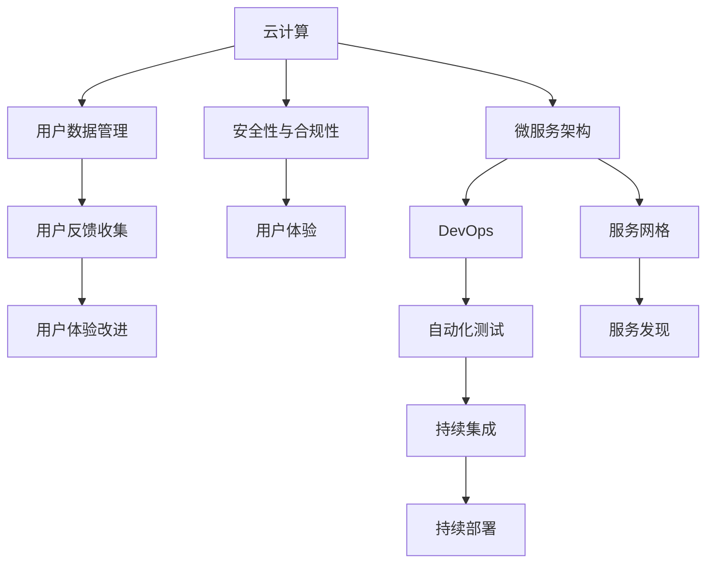

                 

## 1. 背景介绍

### 1.1 问题由来

随着云计算和互联网技术的迅速发展，软件即服务（SaaS）模式日益受到企业和用户的青睐。SaaS不仅大大降低了IT基础设施的建设和运维成本，而且极大地提升了软件部署和使用的便捷性。技术日新月异，如何在资源有限的条件下，快速高效地开发出高质量的SaaS产品，已成为IT领域的一大挑战。

### 1.2 问题核心关键点

- **云计算基础**：SaaS产品依赖于强大的云平台，如何选择合适的云服务供应商、构建稳定高效的后端架构，是SaaS产品成功的基础。
- **微服务架构**：现代SaaS系统通常采用微服务架构，如何设计合理的微服务组件，实现高性能、高可用、低耦合的系统，是微服务设计的核心。
- **DevOps实践**：DevOps实践极大地提升了SaaS产品的持续集成、持续交付和持续部署（CI/CD）能力，如何构建有效的DevOps流程，是实现快速迭代开发的关键。
- **安全性与合规性**：数据隐私和安全性是SaaS产品的重中之重，如何设计完备的安全策略和合规框架，确保用户数据安全，是SaaS产品的生命线。
- **用户体验**：用户体验是SaaS产品的灵魂，如何通过前端交互设计、用户研究和数据分析，打造易于使用、令人愉悦的用户体验，是SaaS产品成功的保障。

## 2. 核心概念与联系

### 2.1 核心概念概述

为了更好地理解如何利用技术能力创建SaaS产品，本节将介绍几个关键概念：

- **云计算**：基于互联网的计算服务，提供弹性、按需的计算资源，包括存储、网络、计算等，是SaaS产品的基础设施。
- **微服务架构**：将应用程序拆分为多个独立运行的微服务，每个微服务负责特定的功能，通过服务网格和服务发现机制实现高可用性和扩展性。
- **DevOps**：一种旨在结合软件开发（Dev）和运维（Ops）的实践和文化，通过自动化流程和工具，实现快速、可靠的软件交付。
- **安全性与合规性**：确保数据隐私和用户信息安全，遵守相关法律法规，是SaaS产品的基本要求。
- **用户体验（UX）**：关注用户与产品的互动体验，通过设计合理的界面、流程和交互，提升用户满意度。

这些概念通过Mermaid流程图进行连接，展示了它们在大规模SaaS产品开发中的应用：



这个流程图展示了各个概念之间的逻辑关系：

1. **云计算**：提供基础计算资源。
2. **微服务架构**：利用云计算资源构建可扩展的服务系统。
3. **DevOps**：自动化流程提升开发和部署效率。
4. **安全性与合规性**：确保用户数据安全和合规要求。
5. **用户体验**：通过用户反馈不断优化产品体验。

这些概念共同构成了SaaS产品的技术基础，缺一不可。

## 3. 核心算法原理 & 具体操作步骤

### 3.1 算法原理概述

SaaS产品的创建涉及多个技术领域，包括云计算、微服务架构、DevOps、安全性与合规性以及用户体验设计。本文将重点介绍如何利用这些技术构建高效的SaaS产品。

### 3.2 算法步骤详解

SaaS产品的创建通常包括以下几个关键步骤：

**Step 1: 确定需求与目标**

1. **市场调研**：分析目标市场的需求和竞争对手的产品，明确产品的独特卖点和目标用户群。
2. **功能规划**：根据市场调研结果，设计产品的核心功能和扩展功能。
3. **制定时间表**：确定项目的开发、测试、上线和迭代的时间表。

**Step 2: 选择云服务和开发框架**

1. **选择云服务**：根据需求选择合适的云服务供应商，如AWS、Azure、Google Cloud等，考虑其计算、存储、网络等资源。
2. **选择开发框架**：根据技术栈选择合适的开发框架，如Node.js、Python、Java等，以及相应的数据库和中间件。

**Step 3: 设计微服务架构**

1. **服务拆分**：将应用程序拆分为多个独立运行的微服务，每个微服务负责特定的功能。
2. **服务通信**：设计服务之间的通信协议，如REST、gRPC等，确保服务的灵活性和扩展性。
3. **服务发现与治理**：采用服务网格（如Istio）实现服务发现、负载均衡和断路器等机制。

**Step 4: 实施DevOps实践**

1. **持续集成（CI）**：使用Jenkins、GitLab CI等工具实现代码的自动化构建和测试。
2. **持续部署（CD）**：使用Docker、Kubernetes等容器和编排工具实现自动化部署和扩展。
3. **自动化测试**：编写单元测试、集成测试和端到端测试，确保代码质量和功能完整性。

**Step 5: 确保安全性与合规性**

1. **数据加密**：采用AES、RSA等加密算法保护数据传输和存储。
2. **身份认证和授权**：实现OAuth2、JWT等身份认证和授权机制，保护用户数据安全。
3. **审计与监控**：使用ELK Stack、Splunk等工具实现日志记录、安全审计和性能监控。

**Step 6: 提升用户体验**

1. **前端交互设计**：采用响应式设计和用户体验设计原则，提升界面美观和易用性。
2. **用户研究**：通过用户调研和行为分析，了解用户需求和行为模式。
3. **数据分析与优化**：采用数据分析工具如Google Analytics、Mixpanel等，持续优化产品体验。

### 3.3 算法优缺点

基于技术能力构建SaaS产品具有以下优点：

- **灵活性与可扩展性**：微服务架构和DevOps实践确保了系统的高可用性和扩展性。
- **快速迭代与交付**：DevOps流程大大缩短了产品开发和交付周期。
- **用户体验优化**：通过持续的用户研究和数据分析，不断优化用户体验。

同时，这些技术也存在一些缺点：

- **复杂性**：微服务架构和DevOps流程增加了系统设计和管理的复杂性。
- **成本**：初始阶段需要大量资金投入云计算资源和开发工具。
- **安全风险**：多服务架构和分布式系统增加了数据泄露和攻击的风险。

## 4. 数学模型和公式 & 详细讲解 & 举例说明

### 4.1 数学模型构建

SaaS产品的创建涉及多个技术领域的数学模型，以下重点介绍云资源需求预测模型的构建：

假设目标市场的需求为X，云资源（如CPU、内存）的需求为Y，则可以构建以下数学模型：

$$ Y = aX + b $$

其中，a和b为模型参数，需要通过实际数据进行训练和优化。

### 4.2 公式推导过程

- **数据准备**：收集目标市场的用户需求数据，如用户数量、请求量等。
- **模型训练**：使用线性回归算法对数据进行拟合，确定模型参数a和b。
- **模型验证**：使用交叉验证等方法对模型进行验证，确保其预测精度。
- **模型部署**：将训练好的模型集成到SaaS产品的资源分配模块，实时计算云资源需求。

### 4.3 案例分析与讲解

以一个电商SaaS产品为例，分析其云资源需求预测模型的构建过程：

- **需求数据收集**：收集电商平台的日均访问量、订单量等数据。
- **数据预处理**：将原始数据进行归一化和标准化处理，减少噪声和异常值的影响。
- **模型训练**：使用线性回归算法对处理后的数据进行拟合，确定模型参数a和b。
- **模型验证**：使用交叉验证等方法对模型进行验证，确保其预测精度。
- **模型部署**：将训练好的模型集成到SaaS产品的资源分配模块，实时计算云资源需求。

## 5. 项目实践：代码实例和详细解释说明

### 5.1 开发环境搭建

开发环境搭建通常包括以下几个步骤：

1. **环境配置**：安装操作系统和开发工具，如Node.js、Python、JDK等，以及相应的IDE（如IntelliJ IDEA、Visual Studio Code等）。
2. **云资源部署**：在云平台上创建虚拟机、数据库等基础设施资源，配置网络、存储等参数。
3. **代码仓库管理**：使用Git等版本控制工具管理代码库，确保团队协作和代码历史追踪。
4. **CI/CD配置**：配置Jenkins、GitLab CI等持续集成工具，自动化构建、测试和部署流程。

### 5.2 源代码详细实现

以下是一个使用Node.js和MongoDB实现的电商SaaS产品的代码示例：

```javascript
// 电商SaaS产品 - 订单模块
const express = require('express');
const router = express.Router();
const mongodb = require('mongodb');

// 连接MongoDB
const uri = 'mongodb://localhost:27017';
const client = new mongodb.MongoClient(uri);
client.connect(err => {
    if (err) throw err;
    const db = client.db('ecommerce');

    // 查询订单数据
    router.get('/orders', (req, res) => {
        const collection = db.collection('orders');
        collection.find({}).toArray((err, docs) => {
            if (err) throw err;
            res.json(docs);
        });
    });

    // 创建订单数据
    router.post('/orders', (req, res) => {
        const collection = db.collection('orders');
        const order = req.body;
        collection.insertOne(order, (err, result) => {
            if (err) throw err;
            res.json(result.ops);
        });
    });

    // 更新订单数据
    router.put('/orders/:id', (req, res) => {
        const collection = db.collection('orders');
        const id = req.params.id;
        const order = req.body;
        collection.updateOne({_id: id}, {$set: order}, (err, result) => {
            if (err) throw err;
            res.json(result);
        });
    });

    // 删除订单数据
    router.delete('/orders/:id', (req, res) => {
        const collection = db.collection('orders');
        const id = req.params.id;
        collection.deleteOne({_id: id}, (err, result) => {
            if (err) throw err;
            res.json(result);
        });
    });

    client.close();
});

module.exports = router;
```

### 5.3 代码解读与分析

上述代码实现了订单模块的CRUD操作，主要使用了Express框架和MongoDB数据库。

- **Express框架**：作为Node.js的Web框架，用于处理HTTP请求和响应，提供路由和中间件功能。
- **MongoDB数据库**：作为NoSQL数据库，用于存储电商订单数据，支持高效的查询和数据处理。

具体实现细节如下：

1. **连接MongoDB**：使用MongoDB客户端连接数据库，创建数据库实例。
2. **定义路由**：使用Express定义API路由，实现订单的查询、创建、更新和删除操作。
3. **数据操作**：使用MongoDB操作集合，实现数据的CRUD操作，并返回操作结果。

### 5.4 运行结果展示

运行上述代码后，即可在本地启动服务器，通过访问API接口进行订单管理。例如，使用Postman工具发送POST请求创建订单：

```
POST http://localhost:3000/orders
Content-Type: application/json

{
    "product_id": "123",
    "quantity": 2,
    "customer_id": "456"
}
```

服务器响应如下：

```json
{
    "_id": ObjectId("60a8f5b2d27e0c0d5d9a8bcd",
    "insertedCount": 1
}
```

## 6. 实际应用场景

### 6.1 电商应用

电商SaaS产品通过云资源需求预测模型，实时动态调整服务器资源，确保系统的高可用性和扩展性。例如，使用线性回归模型预测电商平台的日均访问量和订单量，根据预测结果自动扩展或缩减云资源。

### 6.2 金融服务

金融SaaS产品通过DevOps流程，实现快速迭代和交付，确保金融服务的安全性和稳定性。例如，使用Jenkins实现自动化构建和测试，通过Docker容器化技术实现快速部署和扩缩容。

### 6.3 教育培训

教育培训SaaS产品通过用户体验设计，提升学生和教师的交互体验，提高在线教育的质量和效果。例如，使用响应式设计和用户体验设计原则，优化前端页面布局和交互流程，确保学生和教师的使用便捷性。

### 6.4 未来应用展望

SaaS产品的未来发展将更加注重用户体验和个性化服务。随着人工智能和大数据技术的发展，SaaS产品将更加智能化和定制化，提供更精准的推荐和服务。例如，通过机器学习算法分析用户行为数据，实现个性化推荐和智能客服。

## 7. 工具和资源推荐

### 7.1 学习资源推荐

为了帮助开发者系统掌握SaaS产品的开发技术，以下是一些优质的学习资源：

1. **《云计算基础》系列课程**：介绍云计算的基本概念和常用技术，如AWS、Azure、Google Cloud等。
2. **《微服务架构设计与实现》课程**：讲解微服务架构的设计原则和实现方法，如Spring Cloud、Docker、Kubernetes等。
3. **《DevOps实践》系列文章**：介绍DevOps流程和工具，如Jenkins、GitLab CI、Docker等。
4. **《网络安全基础》课程**：讲解数据加密、身份认证、授权等网络安全技术，确保SaaS产品安全。
5. **《用户体验设计》课程**：介绍响应式设计、用户体验设计原则和工具，如Bootstrap、Sketch等。

通过学习这些资源，相信你一定能够掌握SaaS产品开发所需的关键技术，开发出高效、稳定、安全的SaaS产品。

### 7.2 开发工具推荐

SaaS产品的开发通常需要多种工具的支持，以下是一些推荐的开发工具：

1. **云平台**：AWS、Azure、Google Cloud等云平台，提供弹性计算和存储资源。
2. **容器化工具**：Docker、Kubernetes等容器化和编排工具，实现服务部署和管理。
3. **持续集成工具**：Jenkins、GitLab CI等持续集成工具，自动化构建和测试流程。
4. **DevOps工具**：Istio、Prometheus、Grafana等DevOps工具，提升系统运维和监控能力。
5. **数据库**：MongoDB、MySQL、PostgreSQL等数据库，支持数据存储和查询。

这些工具能够提升SaaS产品的开发和运维效率，帮助开发者快速迭代和优化产品。

### 7.3 相关论文推荐

SaaS产品的开发涉及多个技术领域，以下是几篇具有代表性的相关论文：

1. **《Cloud Computing: Concepts, Technology, and Architecture》**：介绍云计算的基本概念、技术和架构，是云计算领域的经典教材。
2. **《Microservices: Principles and Patterns for Building Scalable, Reliable Systems》**：讲解微服务架构的设计原则和实现方法，提供大量实际案例和示例代码。
3. **《Mastering DevOps: Designing and Implementing Distributed Systems》**：介绍DevOps流程和工具，提供丰富的实践经验和技巧。
4. **《Cybersecurity for Dummies》**：讲解网络安全的基本知识和实践，提供实用的安全策略和防护措施。
5. **《Designing with Users in Mind: The Practical Guide to User Experience》**：介绍用户体验设计的原则和实践，提供实用的设计方法和工具。

这些论文将有助于深入理解SaaS产品开发中的关键技术，提供理论支持和实践指导。

## 8. 总结：未来发展趋势与挑战

### 8.1 总结

本文对利用技术能力创建SaaS产品进行了全面系统的介绍。首先阐述了SaaS产品的开发背景和核心关键点，明确了云计算、微服务架构、DevOps、安全性与合规性以及用户体验设计的重要性。其次，从原理到实践，详细讲解了SaaS产品的开发步骤和技术细节，给出了具体的代码实现示例。同时，本文还探讨了SaaS产品在多个行业的应用前景，展示了SaaS产品的广阔发展空间。

通过本文的系统梳理，可以看到，利用技术能力构建SaaS产品，能够在资源有限的情况下，快速高效地开发出高质量、高可靠性的SaaS产品。SaaS产品的开发需要全面考虑技术、业务、用户体验等多个方面，只有不断优化各个环节，才能实现产品的成功交付和持续优化。

### 8.2 未来发展趋势

SaaS产品的未来发展将更加注重智能化和定制化：

1. **智能化**：随着人工智能和大数据技术的发展，SaaS产品将更加智能化，实现智能推荐、智能客服、智能分析等功能。
2. **定制化**：根据不同行业和企业的特点，提供定制化的解决方案，满足特定需求。
3. **自动化**：通过自动化流程和工具，实现持续集成、持续交付和持续部署（CI/CD），提升开发和运维效率。
4. **云计算与边缘计算融合**：云平台和边缘计算结合，实现数据本地处理和实时响应，提升用户体验。
5. **区块链与SaaS结合**：引入区块链技术，提升数据安全和透明度，增强用户信任。

这些趋势将推动SaaS产品向更加智能化、自动化和定制化的方向发展，为更多行业和企业提供高效、可靠、灵活的SaaS解决方案。

### 8.3 面临的挑战

虽然SaaS产品的发展前景广阔，但在实际应用中也面临一些挑战：

1. **技术复杂性**：微服务架构和DevOps流程增加了系统设计和管理的复杂性，需要技术团队具备较强的技术能力和经验。
2. **成本控制**：初始阶段需要大量资金投入云计算资源和开发工具，如何控制成本是一大挑战。
3. **数据安全和隐私**：多服务架构和分布式系统增加了数据泄露和攻击的风险，需要严格的数据安全和隐私保护措施。
4. **用户体验优化**：用户需求和行为模式多样，如何设计符合用户期望的用户体验，提升用户满意度，是一大难题。
5. **资源优化**：如何实现高效资源分配和利用，避免资源浪费，提升系统性能和成本效益，是一大挑战。

解决这些挑战需要技术团队不断学习和实践，探索新的技术和方法，提升SaaS产品的开发和运维水平。

### 8.4 研究展望

SaaS产品的研究展望主要集中在以下几个方向：

1. **人工智能与SaaS结合**：引入人工智能技术，提升SaaS产品的智能化水平，实现智能推荐、智能客服等功能。
2. **区块链与SaaS结合**：引入区块链技术，提升数据安全和透明度，增强用户信任。
3. **云计算与边缘计算融合**：云平台和边缘计算结合，实现数据本地处理和实时响应，提升用户体验。
4. **跨行业解决方案**：针对不同行业和企业的特点，提供定制化的SaaS解决方案，满足特定需求。
5. **自动化流程优化**：通过自动化流程和工具，实现持续集成、持续交付和持续部署（CI/CD），提升开发和运维效率。

这些研究方向的探索，将进一步推动SaaS产品的发展，为更多行业和企业提供高效、可靠、灵活的SaaS解决方案。

## 9. 附录：常见问题与解答

**Q1: 如何选择合适的云服务供应商？**

A: 选择合适的云服务供应商需要考虑以下因素：
1. **计算能力**：评估供应商的计算资源（CPU、内存、存储等）是否满足需求。
2. **网络带宽**：评估供应商的网络带宽是否满足数据传输需求。
3. **安全性**：评估供应商的安全措施是否完备，是否有数据加密、身份认证等安全机制。
4. **服务稳定性**：评估供应商的服务稳定性，是否有良好的SLA（服务级别协议）保障。
5. **价格和成本**：评估供应商的价格和成本，选择性价比最高的方案。

通过综合考虑这些因素，选择最符合自身需求的云服务供应商。

**Q2: 如何设计微服务架构？**

A: 设计微服务架构需要考虑以下几个方面：
1. **服务拆分**：根据业务功能将应用拆分为多个独立运行的微服务。
2. **服务通信**：设计服务之间的通信协议，如REST、gRPC等，确保服务的灵活性和扩展性。
3. **服务发现与治理**：采用服务网格（如Istio）实现服务发现、负载均衡和断路器等机制。
4. **分布式事务管理**：确保服务之间的数据一致性和事务处理。
5. **监控与日志**：设计监控和日志系统，实现服务状态监控和问题追踪。

通过合理的微服务设计，实现高可用性、高扩展性和低耦合性的系统架构。

**Q3: 如何提升SaaS产品的用户体验？**

A: 提升SaaS产品的用户体验需要考虑以下几个方面：
1. **响应式设计**：采用响应式设计原则，确保前端界面在不同设备上都能正常显示和操作。
2. **用户体验设计**：采用用户体验设计原则，优化页面布局、交互流程和元素设计，提升用户体验。
3. **用户研究**：通过用户调研和行为分析，了解用户需求和行为模式，优化用户体验。
4. **数据分析与优化**：使用数据分析工具如Google Analytics、Mixpanel等，持续优化产品体验。

通过不断优化用户体验，提升用户满意度和粘性，增强SaaS产品的市场竞争力。

**Q4: 如何确保SaaS产品的安全性与合规性？**

A: 确保SaaS产品的安全性与合规性需要考虑以下几个方面：
1. **数据加密**：采用AES、RSA等加密算法保护数据传输和存储。
2. **身份认证和授权**：实现OAuth2、JWT等身份认证和授权机制，保护用户数据安全。
3. **审计与监控**：使用ELK Stack、Splunk等工具实现日志记录、安全审计和性能监控。
4. **安全策略**：制定全面的安全策略，包括数据保护、访问控制、应急响应等。
5. **合规性**：遵守相关法律法规，如GDPR、CCPA等，确保用户数据合规。

通过综合考虑这些因素，确保SaaS产品的安全性与合规性，保护用户数据安全。

**Q5: 如何实现持续集成和持续部署（CI/CD）？**

A: 实现持续集成和持续部署（CI/CD）需要考虑以下几个方面：
1. **自动化构建**：使用Jenkins、GitLab CI等工具实现代码的自动化构建和测试。
2. **自动化测试**：编写单元测试、集成测试和端到端测试，确保代码质量和功能完整性。
3. **自动化部署**：使用Docker、Kubernetes等容器和编排工具实现自动化部署和扩展。
4. **持续监控**：使用ELK Stack、Splunk等工具实现持续监控和问题追踪。
5. **持续反馈**：通过用户反馈和数据分析，不断优化和改进产品。

通过自动化流程和工具，实现快速迭代和交付，提升开发和运维效率。

---

作者：禅与计算机程序设计艺术 / Zen and the Art of Computer Programming

