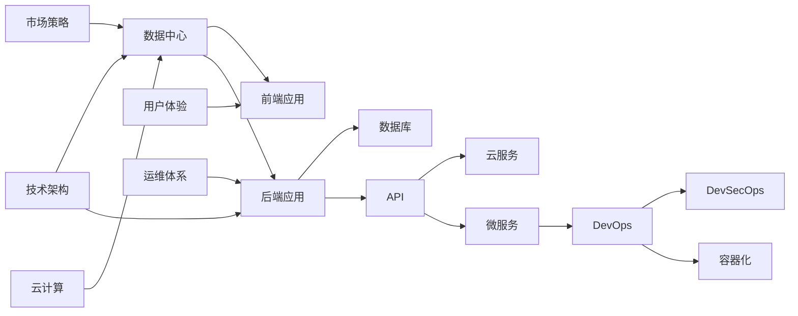

                 

# 利用技术能力创建SaaS产品

## 1. 背景介绍

### 1.1 问题由来

随着互联网的普及和云计算技术的成熟，软件即服务(SaaS)模式逐渐成为企业数字化转型的重要方向。SaaS产品基于云端资源，灵活部署，按需付费，打破了传统软件部署、运维的限制，帮助企业快速响应市场变化，降低IT投入成本。

然而，构建一个成功的SaaS产品不仅需要强大的技术支撑，还需要深入理解行业需求，注重用户体验设计，优化商业模式。如何在有限的资源下，快速、高效地创建出具备市场竞争力的SaaS产品，成为了当前技术开发者和管理者面临的重要挑战。

### 1.2 问题核心关键点

构建SaaS产品的关键在于综合应用多种技术能力，从产品设计、技术实现、市场运营等多个层面进行全方位的考量。具体来说，以下几个方面尤为关键：

1. **技术架构设计**：选择合适的技术栈，保证系统可扩展、易维护。
2. **产品功能设计**：针对目标用户需求，设计高效实用的功能模块。
3. **用户体验优化**：提升界面设计、操作流程的友好性，提高用户满意度。
4. **数据安全和隐私保护**：保障用户数据的安全性，建立用户信任。
5. **市场策略制定**：明确产品定位和营销策略，快速获得市场认可。
6. **运维和客服体系**：提供及时的技术支持和用户体验保障，提升客户满意度。

通过合理运用这些关键技术能力，可以帮助SaaS产品快速上线并持续优化，逐步建立市场影响力。

### 1.3 问题研究意义

SaaS产品的成功构建不仅关系到企业的业务转型和技术创新，还能够推动产业数字化进程，为社会带来更高效、便捷的服务。因此，深入探讨如何利用技术能力创建高效、易用的SaaS产品，具有重要的理论和实践意义：

1. **提升企业竞争力**：借助先进技术，降低开发和运维成本，提升产品交付速度和质量。
2. **加速产业创新**：推动各行各业数字化转型，为新兴产业的发展提供支撑。
3. **改善用户体验**：通过技术手段不断优化用户体验，提高用户粘性，增加用户满意度。
4. **构建市场壁垒**：通过技术创新和商业模式优化，形成市场竞争优势。
5. **保障数据安全**：通过技术手段保护用户数据安全，增强用户信任。

本文将从技术、产品、市场、运营等多个角度，全面解析如何利用技术能力构建成功的SaaS产品。

## 2. 核心概念与联系

### 2.1 核心概念概述

为更好地理解SaaS产品的创建过程，本节将介绍几个关键核心概念：

- **SaaS (Software as a Service)**：一种通过云端提供软件服务的技术模式，用户按需使用，无需前期硬件投资。
- **API (Application Programming Interface)**：应用程序接口，使不同系统能够交互通信，实现数据共享和服务集成。
- **DevOps (Development and Operations)**：开发运维一体化，强调代码开发和系统运维的紧密协作，提升软件交付效率和系统稳定性。
- **微服务架构 (Microservices Architecture)**：将单体应用拆分为多个小型服务，每个服务独立运行、独立扩展。
- **云计算 (Cloud Computing)**：基于互联网提供计算资源和服务的技术，支持SaaS产品的部署和运行。
- **DevSecOps (Development and Security and Operations)**：结合DevOps和信息安全，强调在开发和运维过程中融入安全理念。
- **容器化 (Containerization)**：通过容器技术实现软件环境的打包和部署，保证环境一致性。

这些概念构成了SaaS产品创建的基础框架，通过合理应用这些技术，可以构建出稳定、高效、可扩展的SaaS系统。

### 2.2 核心概念原理和架构的 Mermaid 流程图



这个流程图展示了SaaS产品创建的核心架构和关键流程。

- **数据中心(A)**：存储用户数据，提供数据处理和存储服务。
- **前端应用(B)**：提供用户界面，通过API与后端服务交互。
- **后端应用(C)**：实现核心业务逻辑，包括API接口、数据库连接等。
- **数据库(D)**：存储和管理用户数据。
- **API(E)**：提供前后端数据交互的桥梁。
- **云服务(F)**：基于云计算资源，提供弹性的计算和存储服务。
- **微服务(G)**：将后端应用拆分为多个小服务，提高系统灵活性和可扩展性。
- **DevOps(H)**：优化开发和运维流程，提升软件交付效率和系统稳定性。
- **DevSecOps(I)**：结合DevOps和信息安全，保障系统安全性。
- **容器化(J)**：通过容器技术实现环境一致性，简化部署和运维。
- **用户体验(K)**：优化前端界面和操作流程，提升用户体验。
- **技术架构(L)**：设计系统架构，包括服务拆分、数据存储、网络架构等。
- **市场策略(M)**：制定产品定位和市场推广策略，快速获得市场认可。
- **运维体系(N)**：提供及时的技术支持和用户体验保障。
- **云计算(O)**：基于互联网提供计算资源和服务，支持SaaS产品部署和运行。

这些概念和流程共同构成了SaaS产品创建的完整技术生态，涵盖从基础设施到用户体验的各个方面。

## 3. 核心算法原理 & 具体操作步骤

### 3.1 算法原理概述

构建SaaS产品的核心算法原理可以归纳为以下几个关键步骤：

1. **需求分析和功能设计**：明确产品需求，设计高效实用的功能模块。
2. **技术选型和架构设计**：选择适合的技术栈和架构模式，保证系统可扩展、易维护。
3. **数据模型和API设计**：设计合理的数据模型和API接口，支持数据交互和服务集成。
4. **系统开发和测试**：通过敏捷开发和自动化测试，确保软件质量和性能。
5. **部署和运维**：将系统部署到云平台，进行持续的运维和优化。
6. **用户反馈和迭代优化**：根据用户反馈进行产品迭代，不断提升用户体验。

这些步骤共同构成了一个完整的SaaS产品创建流程，每个步骤都需要综合运用多种技术能力。

### 3.2 算法步骤详解

以下详细介绍SaaS产品创建的具体操作步骤：

**Step 1: 需求分析和功能设计**

1. **市场调研**：通过问卷调查、竞品分析等方式，收集目标用户需求，确定产品定位。
2. **功能模块设计**：根据用户需求，设计高效实用的功能模块，如用户管理、订单处理、数据分析等。
3. **用户体验设计**：采用用户故事、线框图等工具，设计界面布局和操作流程，提升用户体验。

**Step 2: 技术选型和架构设计**

1. **技术栈选择**：根据功能需求和技术特点，选择合适的技术栈，如使用React或Vue构建前端，Node.js或Java构建后端。
2. **架构模式设计**：选择适合的应用架构模式，如单体应用、微服务架构、无服务器架构等。
3. **系统安全性设计**：采用DevSecOps理念，在设计阶段就融入安全性考虑，如使用HTTPS、Web应用防火墙等。

**Step 3: 数据模型和API设计**

1. **数据模型设计**：设计合理的数据模型，包括实体关系、字段类型等，保证数据存储和查询效率。
2. **API接口设计**：设计清晰、易用的API接口，支持数据的交互和服务集成。
3. **API安全设计**：采用OAuth2、JWT等认证和授权机制，保障API接口的安全性。

**Step 4: 系统开发和测试**

1. **敏捷开发**：采用敏捷开发方法，迭代开发功能模块，提高开发效率和软件质量。
2. **自动化测试**：编写单元测试、集成测试、端到端测试等自动化测试用例，确保系统稳定性和性能。
3. **CI/CD集成**：采用持续集成和持续部署(CI/CD)工具，自动化构建、测试和部署，提升交付效率。

**Step 5: 部署和运维**

1. **云平台选择**：选择适合的云平台，如AWS、Azure、阿里云等，部署系统环境。
2. **环境配置**：配置服务器、数据库、消息队列等基础设施，保证系统稳定运行。
3. **监控和告警**：通过日志、指标等手段，实时监控系统状态，设置告警机制，及时发现和解决故障。

**Step 6: 用户反馈和迭代优化**

1. **用户反馈收集**：通过反馈工具、用户调查等方式，收集用户意见和建议。
2. **功能迭代优化**：根据用户反馈，优化产品功能，提高用户体验。
3. **版本发布管理**：通过版本管理工具，发布新版本，保持产品更新和维护。

### 3.3 算法优缺点

SaaS产品创建过程中采用上述算法步骤，具有以下优点：

1. **可扩展性**：通过微服务架构和云计算资源，支持系统灵活扩展和弹性伸缩。
2. **易维护性**：模块化设计、容器化部署等手段，简化系统维护和升级。
3. **高可靠性**：DevOps和DevSecOps理念，保障系统稳定性和安全性。
4. **快速交付**：敏捷开发、CI/CD集成等手段，提升软件交付效率。

同时，也存在以下缺点：

1. **技术复杂性**：涉及多技术栈、多服务交互，技术实现较为复杂。
2. **成本投入**：云资源和运维成本较高，需要持续投入。
3. **安全风险**：系统安全性设计不足，可能导致数据泄露等风险。
4. **用户需求变化快**：市场需求快速变化，需要及时进行产品迭代。

### 3.4 算法应用领域

SaaS产品创建过程中采用的算法步骤，广泛适用于各种类型的SaaS产品，如CRM、ERP、HRM、CRM等。这些算法步骤不仅适用于SaaS产品，也适用于其他类型的软件系统开发。

## 4. 数学模型和公式 & 详细讲解 & 举例说明

### 4.1 数学模型构建

SaaS产品创建过程中涉及的数学模型和公式主要包括以下几个方面：

1. **需求分析模型**：通过问卷调查、市场分析等方式，构建用户需求模型，描述用户特征和行为。
2. **功能设计模型**：根据用户需求，设计功能模块，使用如UML、活动图等工具建模。
3. **技术选型模型**：根据技术栈和架构模式，构建技术选型模型，选择适合的技术方案。
4. **数据模型设计**：设计合理的数据模型，使用如实体关系图(ERD)等工具建模。
5. **API接口设计**：设计清晰的API接口，使用如RESTful API、Swagger等工具建模。
6. **系统性能模型**：通过性能测试和监控，构建系统性能模型，评估系统负载和响应时间。
7. **用户反馈模型**：通过用户调查和反馈工具，构建用户反馈模型，描述用户意见和建议。

### 4.2 公式推导过程

以下详细介绍部分公式的推导过程：

**用户需求模型**

设用户需求集合为$D=\{d_1,d_2,\dots,d_n\}$，其中$d_i$表示第$i$个用户需求。假设用户需求可以表示为$D=\{(d_1,v_1),(d_2,v_2),\dots,(d_n,v_n)\}$，其中$v_i$表示需求$d_i$的权重，权重值从0到1。

为了描述用户需求模型，可以定义需求权重向量$\mathbf{v}=[v_1,v_2,\dots,v_n]^T$，其中$v_i$表示需求$d_i$的权重。需求模型可以表示为：

$$
\mathbf{v} = \mathbf{W}\mathbf{u}
$$

其中$\mathbf{W}$为权重矩阵，$\mathbf{u}$为用户需求向量，$u_i=1$表示用户有需求$d_i$，$u_i=0$表示用户无需求$d_i$。

**系统性能模型**

假设系统性能指标为$P=(P_1,P_2,\dots,P_m)$，其中$P_i$表示第$i$个性能指标。设系统性能模型为$P=f(X)$，其中$X$为系统参数向量，$f$为性能函数。

为了评估系统性能，可以定义性能函数$f$为加权和函数：

$$
P = \sum_{i=1}^m a_i P_i
$$

其中$a_i$为性能指标$P_i$的权重，权重值从0到1。

**用户反馈模型**

设用户反馈集合为$F=\{f_1,f_2,\dots,f_n\}$，其中$f_i$表示第$i$个用户反馈。假设用户反馈可以表示为$F=\{(f_1,s_1),(f_2,s_2),\dots,(f_n,s_n)\}$，其中$s_i$表示反馈$f_i$的评分，评分为0到5的整数。

为了描述用户反馈模型，可以定义反馈评分向量$\mathbf{s}=[s_1,s_2,\dots,s_n]^T$，其中$s_i$表示反馈$f_i$的评分。反馈模型可以表示为：

$$
\mathbf{s} = \mathbf{W}_F \mathbf{u}_F
$$

其中$\mathbf{W}_F$为反馈权重矩阵，$\mathbf{u}_F$为用户反馈向量，$u_{Fi}=1$表示用户有反馈$f_i$，$u_{Fi}=0$表示用户无反馈$f_i$。

### 4.3 案例分析与讲解

以下通过一个具体案例，介绍SaaS产品创建过程中的数学模型和公式的应用。

假设我们正在创建一个基于云计算的HRM系统，其核心功能包括招聘管理、员工管理、绩效管理等。首先需要进行需求分析和功能设计：

1. **需求分析**：通过问卷调查和竞品分析，收集目标用户需求，确定产品定位。假设用户需求为招聘广告发布、简历管理、面试安排、员工考勤、绩效考核等。
2. **功能设计**：根据用户需求，设计高效实用的功能模块，如招聘管理模块、员工管理模块、绩效管理模块等。

接下来，进行技术选型和架构设计：

1. **技术栈选择**：选择适合的技术栈，如React构建前端，Node.js构建后端。
2. **架构模式设计**：采用微服务架构，将系统拆分为招聘、员工、绩效等微服务。
3. **系统安全性设计**：采用HTTPS、Web应用防火墙等安全措施，保障系统安全性。

然后，进行数据模型和API设计：

1. **数据模型设计**：设计合理的数据模型，如用户信息表、职位信息表、应聘者信息表等。
2. **API接口设计**：设计清晰的API接口，如用户登录API、职位发布API、简历提交API等。

进行系统开发和测试：

1. **敏捷开发**：采用敏捷开发方法，迭代开发功能模块，提高开发效率和软件质量。
2. **自动化测试**：编写单元测试、集成测试、端到端测试等自动化测试用例，确保系统稳定性和性能。
3. **CI/CD集成**：采用持续集成和持续部署工具，自动化构建、测试和部署，提升交付效率。

最后，进行部署和运维：

1. **云平台选择**：选择适合的云平台，如AWS、Azure、阿里云等，部署系统环境。
2. **环境配置**：配置服务器、数据库、消息队列等基础设施，保证系统稳定运行。
3. **监控和告警**：通过日志、指标等手段，实时监控系统状态，设置告警机制，及时发现和解决故障。

用户反馈和迭代优化：

1. **用户反馈收集**：通过反馈工具、用户调查等方式，收集用户意见和建议。
2. **功能迭代优化**：根据用户反馈，优化产品功能，提高用户体验。
3. **版本发布管理**：通过版本管理工具，发布新版本，保持产品更新和维护。

## 5. 项目实践：代码实例和详细解释说明

### 5.1 开发环境搭建

在进行SaaS产品创建实践前，我们需要准备好开发环境。以下是使用Python进行Django开发的环境配置流程：

1. 安装Anaconda：从官网下载并安装Anaconda，用于创建独立的Python环境。

2. 创建并激活虚拟环境：
```bash
conda create -n django-env python=3.8 
conda activate django-env
```

3. 安装Django：
```bash
pip install django
```

4. 安装必要的工具包：
```bash
pip install django-rest-framework psycopg2-binary numpy pandas scikit-learn matplotlib tqdm jupyter notebook ipython
```

完成上述步骤后，即可在`django-env`环境中开始SaaS产品创建实践。

### 5.2 源代码详细实现

下面我们以构建一个基于云平台的HRM系统为例，给出使用Django进行SaaS开发的PyTorch代码实现。

首先，定义数据库模型：

```python
from django.db import models
from django.contrib.auth.models import AbstractUser

class User(AbstractUser):
    pass

class Position(models.Model):
    name = models.CharField(max_length=50)
    description = models.TextField()

class Application(models.Model):
    applicant = models.ForeignKey(User, on_delete=models.CASCADE)
    position = models.ForeignKey(Position, on_delete=models.CASCADE)
    status = models.CharField(max_length=50)

class Interview(models.Model):
    applicant = models.ForeignKey(User, on_delete=models.CASCADE)
    position = models.ForeignKey(Position, on_delete=models.CASCADE)
    interviewer = models.ForeignKey(User, on_delete=models.CASCADE)
    time = models.DateTimeField()

class Attendance(models.Model):
    employee = models.ForeignKey(User, on_delete=models.CASCADE)
    date = models.DateField()
    hours = models.FloatField()

class Performance(models.Model):
    employee = models.ForeignKey(User, on_delete=models.CASCADE)
    year = models.IntegerField()
    score = models.FloatField()
```

然后，定义视图和API：

```python
from django.shortcuts import render
from django.http import JsonResponse

def user_login(request):
    # 用户登录视图
    pass

def position_list(request):
    # 职位列表API
    pass

def application_list(request):
    # 应聘者列表API
    pass

def interview_list(request):
    # 面试列表API
    pass

def attendance_list(request):
    # 考勤记录API
    pass

def performance_list(request):
    # 绩效记录API
    pass
```

最后，定义路由和URL：

```python
from django.urls import path
from . import views

urlpatterns = [
    path('login/', views.user_login),
    path('positions/', views.position_list),
    path('applications/', views.application_list),
    path('interviews/', views.interview_list),
    path('attendance/', views.attendance_list),
    path('performance/', views.performance_list),
]
```

以上代码实现了一个简单的HRM系统，包括用户登录、职位管理、应聘者管理、面试管理、考勤管理和绩效管理等功能模块。

### 5.3 代码解读与分析

让我们再详细解读一下关键代码的实现细节：

**数据库模型定义**：

- `User`类：继承自`django.contrib.auth.models.AbstractUser`，用于定义用户模型。
- `Position`类：定义职位信息表，包括职位名称和描述。
- `Application`类：定义应聘者信息表，包括应聘者、职位和应聘状态。
- `Interview`类：定义面试信息表，包括应聘者、职位和面试时间。
- `Attendance`类：定义考勤记录表，包括员工、日期和小时数。
- `Performance`类：定义绩效记录表，包括员工、年份和绩效分数。

**视图和API定义**：

- `user_login`视图：用户登录视图，用于处理用户登录请求。
- `position_list`API：职位列表API，用于获取职位列表。
- `application_list`API：应聘者列表API，用于获取应聘者列表。
- `interview_list`API：面试列表API，用于获取面试列表。
- `attendance_list`API：考勤记录API，用于获取考勤记录。
- `performance_list`API：绩效记录API，用于获取绩效记录。

**路由和URL定义**：

- `urlpatterns`列表：定义了系统的URL路由，包括登录、职位、应聘者、面试、考勤和绩效等模块。

完成上述代码实现后，即可在Django开发环境中运行系统，进行SaaS产品的构建和测试。

### 5.4 运行结果展示

在运行完系统后，可以通过浏览器访问各个API接口，获取数据和展示结果。例如，访问`http://localhost:8000/interviews/`，可以获取所有面试记录，以JSON格式返回。

## 6. 实际应用场景

### 6.1 智能客服系统

SaaS技术可以广泛应用于智能客服系统的构建。传统客服往往需要配备大量人力，高峰期响应缓慢，且一致性和专业性难以保证。而使用SaaS平台，可以7x24小时不间断服务，快速响应客户咨询，用自然流畅的语言解答各类常见问题。

在技术实现上，可以构建一个基于云平台的智能客服系统，通过API接口与第三方应用集成，提供自动回复、人工坐席、数据分析等功能。系统可以接入企业内部的历史客服对话记录，将问题和最佳答复构建成监督数据，在此基础上对模型进行微调。微调后的模型能够自动理解用户意图，匹配最合适的答案模板进行回复。对于客户提出的新问题，还可以接入检索系统实时搜索相关内容，动态组织生成回答。如此构建的智能客服系统，能大幅提升客户咨询体验和问题解决效率。

### 6.2 金融舆情监测

金融机构需要实时监测市场舆论动向，以便及时应对负面信息传播，规避金融风险。传统的人工监测方式成本高、效率低，难以应对网络时代海量信息爆发的挑战。SaaS平台可以通过API接口集成多个数据源，自动监测不同主题下的情感变化趋势，一旦发现负面信息激增等异常情况，系统便会自动预警，帮助金融机构快速应对潜在风险。

SaaS平台可以构建一个基于云平台的舆情监测系统，通过API接口获取新闻、社交媒体、论坛等数据，使用自然语言处理技术进行情感分析，判断文本属于何种情感类别。在情感分析的基础上，结合市场走势、公司业绩等多元数据，构建综合风险评估模型，输出风险预警信息。

### 6.3 个性化推荐系统

当前的推荐系统往往只依赖用户的历史行为数据进行物品推荐，无法深入理解用户的真实兴趣偏好。SaaS平台可以构建一个基于云平台的推荐系统，通过API接口获取用户行为数据和物品特征数据，使用机器学习算法进行用户画像和物品特征提取。

系统可以采用协同过滤、内容推荐等算法，预测用户对不同物品的兴趣度，推荐最符合用户偏好的物品。同时，可以构建多维度的用户画像，包括用户行为、社交网络、兴趣标签等，增强推荐的精准度和个性化。

## 7. 工具和资源推荐

### 7.1 学习资源推荐

为了帮助开发者系统掌握SaaS产品的创建技术，这里推荐一些优质的学习资源：

1. **Django官方文档**：Django框架的官方文档，提供了详细的开发指南和API文档，是学习SaaS开发的必备资料。

2. **AWS官方文档**：AWS云平台提供的官方文档，介绍了云服务、容器化、DevOps等技术，帮助开发者快速上手云环境构建和部署。

3. **Kubernetes官方文档**：Kubernetes容器编排工具的官方文档，介绍了容器化、部署、监控等技术，是学习SaaS运维管理的重要参考。

4. **GitHub Learning Lab**：GitHub提供的在线学习平台，提供了大量与SaaS开发相关的项目和教程，适合初学者入门。

5. **Udacity微服务课程**：Udacity提供的微服务架构课程，介绍了微服务、DevOps等技术，适合进阶学习。

6. **Coursera DevOps课程**：Coursera提供的DevOps课程，介绍了DevOps理念和实践，适合深入学习。

通过对这些资源的学习实践，相信你一定能够快速掌握SaaS产品的创建技术，并用于解决实际的业务问题。

### 7.2 开发工具推荐

高效的开发离不开优秀的工具支持。以下是几款用于SaaS产品创建的常用工具：

1. **Django框架**：一个强大的Python Web框架，支持数据库、模板、表单、认证等基础功能，适用于SaaS产品的开发。

2. **AWS云平台**：提供云存储、云计算、云服务等功能，支持SaaS产品的云环境构建和部署。

3. **Kubernetes**：一个开源的容器编排系统，支持容器化、部署、扩展等操作，适用于SaaS产品的运维管理。

4. **Prometheus**：一个开源的监控系统，支持实时监控和告警，适用于SaaS产品的性能监控。

5. **Jenkins**：一个开源的持续集成工具，支持自动化构建、测试和部署，适用于SaaS产品的CI/CD集成。

6. **GitLab**：一个开源的DevOps平台，支持代码管理、CI/CD、项目管理等功能，适用于SaaS产品的版本管理和项目管理。

合理利用这些工具，可以显著提升SaaS产品的开发效率，加快创新迭代的步伐。

### 7.3 相关论文推荐

SaaS产品的创建涉及多种技术能力的综合应用，相关的研究文献也相当丰富。以下是几篇奠基性的相关论文，推荐阅读：

1. **"SaaS as a Service: A Survey"**：一篇综述性论文，总结了SaaS产品的特征、应用、挑战和未来趋势，适合了解SaaS技术的基本概念和研究方向。

2. **"Cloud Computing and Software as a Service: A Survey"**：一篇关于云计算和SaaS的综述性论文，介绍了云计算技术、服务架构、安全等方面，适合理解SaaS技术的基础原理。

3. **"Microservices: A Service-Oriented Architecture for the Internet of Things"**：一篇关于微服务架构的论文，介绍了微服务架构的设计理念和实现方法，适合理解SaaS产品的架构模式。

4. **"Cloud-Native Software Development: The Practical Experience of Applying DevOps in a SaaS Provider"**：一篇关于DevOps在SaaS产品中的应用论文，介绍了DevOps理念、实践和效果，适合理解SaaS产品的开发运维流程。

5. **"Containerization and Cloud-Native Development: A Survey"**：一篇关于容器化和云原生技术的综述性论文，介绍了容器化技术、云原生架构、DevOps等方面，适合理解SaaS产品的运维部署技术。

这些论文代表了大规模SaaS产品创建的技术发展脉络，通过学习这些前沿成果，可以帮助研究者把握学科前进方向，激发更多的创新灵感。

## 8. 总结：未来发展趋势与挑战

### 8.1 总结

本文对利用技术能力创建SaaS产品进行了全面系统的介绍。首先阐述了SaaS产品的创建背景和意义，明确了在技术、产品、市场、运营等多个层面进行综合考量的重要性。其次，从需求分析、功能设计、技术选型、数据模型、API接口、系统开发、测试、部署、运维、用户反馈等多个步骤，详细讲解了SaaS产品创建的具体操作流程。最后，通过实际应用场景和工具资源推荐，展示了SaaS产品在实际应用中的广泛价值和应用前景。

通过本文的系统梳理，可以看到，SaaS产品的创建不仅是一个技术工程，更是一个跨领域的综合性挑战。合理利用技术能力，综合考虑业务需求和市场环境，才能构建出高效、易用的SaaS系统，满足用户需求，获得市场认可。

### 8.2 未来发展趋势

展望未来，SaaS产品的创建将呈现以下几个发展趋势：

1. **智能化应用普及**：SaaS产品将更多地融入人工智能技术，如自然语言处理、图像识别、语音识别等，提升系统智能化水平，提供更优质的用户体验。

2. **无服务器架构普及**：基于AWS Lambda、Azure Functions等无服务器架构，简化运维管理，提升交付效率和系统稳定性。

3. **微服务架构普及**：微服务架构将更广泛地应用于SaaS产品，支持系统灵活扩展和弹性伸缩，提升系统可维护性和可扩展性。

4. **DevSecOps全面普及**：DevSecOps理念将更深入地融入SaaS产品的开发和运维流程，保障系统安全性和稳定性。

5. **容器化管理普及**：基于Kubernetes等容器化管理工具，简化运维和扩展操作，提升系统可靠性和可管理性。

6. **数据驱动决策普及**：通过大数据分析和机器学习技术，支持SaaS产品进行数据驱动的决策，提升系统智能性和用户体验。

这些趋势凸显了SaaS产品创建的技术发展和应用前景，为SaaS产品带来了更广阔的发展空间。

### 8.3 面临的挑战

尽管SaaS产品的创建技术不断发展，但在构建高效、易用的SaaS系统时，仍面临诸多挑战：

1. **技术复杂性**：SaaS产品涉及多技术栈、多服务交互，技术实现较为复杂，需要持续学习和更新技术栈。

2. **成本投入高**：云资源和运维成本较高，需要持续投入，提升系统的稳定性和可扩展性。

3. **用户体验设计**：SaaS产品的用户体验设计需要不断优化，提升界面友好性和操作便捷性，增强用户粘性。

4. **数据安全和隐私**：SaaS系统需要保障用户数据的安全性，建立用户信任，避免数据泄露和滥用。

5. **市场竞争激烈**：SaaS市场竞争激烈，需要持续创新，提升产品竞争力和市场份额。

6. **用户需求变化快**：市场需求快速变化，需要及时进行产品迭代，保持系统更新和优化。

7. **技术团队建设**：需要建立专业的技术团队，包括前端开发、后端开发、运维管理、用户体验设计等多个角色，协同推进系统开发和运维。

这些挑战需要开发者和管理者共同应对，才能构建出高效、易用的SaaS产品，获得市场认可和用户满意。

### 8.4 研究展望

面对SaaS产品创建所面临的挑战，未来的研究需要在以下几个方面寻求新的突破：

1. **智能化技术应用**：探索将AI技术如自然语言处理、计算机视觉、语音识别等应用于SaaS产品，提升系统智能化水平。

2. **数据驱动决策**：结合大数据分析和机器学习技术，支持SaaS产品进行数据驱动的决策，提升系统智能性和用户体验。

3. **DevSecOps实践**：进一步深入DevSecOps理念，优化开发和运维流程，保障系统安全性和稳定性。

4. **无服务器架构**：探索基于无服务器架构的SaaS产品构建和部署方式，简化运维管理，提升交付效率和系统稳定性。

5. **微服务架构**：深入研究微服务架构的设计和应用，提升系统可维护性和可扩展性。

6. **用户体验设计**：通过用户调研和A/B测试等手段，不断优化用户体验设计，提升界面友好性和操作便捷性。

7. **容器化管理**：深入研究基于Kubernetes等容器化管理工具的系统部署和运维方法，提升系统可靠性和可管理性。

这些研究方向的探索，必将引领SaaS产品创建技术迈向更高的台阶，为构建高效、易用的SaaS系统提供坚实的技术支撑。

## 9. 附录：常见问题与解答

**Q1：SaaS产品如何实现高可用性？**

A: 高可用性是SaaS产品的重要指标，可以通过以下几个方面实现：

1. **多地区部署**：在多个地区部署SaaS产品，实现地域性冗余和负载均衡。

2. **弹性伸缩**：采用无服务器架构或容器化管理，根据用户流量动态调整资源配置，提升系统性能。

3. **数据备份和恢复**：定期备份数据，实现快速恢复，避免数据丢失。

4. **自动故障转移**：采用高可用架构，如主从复制、负载均衡等，实现自动故障转移和系统恢复。

5. **持续监控和告警**：实时监控系统状态，设置告警机制，及时发现和解决故障。

**Q2：SaaS产品如何实现高效的数据处理和存储？**

A: 高效的数据处理和存储是SaaS产品的重要要求，可以通过以下几个方面实现：

1. **分布式数据库**：采用分布式数据库如MySQL、PostgreSQL等，实现数据的高并发和高可用。

2. **数据缓存**：采用缓存技术如Redis、Memcached等，提高数据访问速度和系统性能。

3. **数据压缩**：采用数据压缩技术如Gzip、Snappy等，减少存储和传输成本。

4. **数据分区和分片**：采用数据分区和分片技术，实现数据的高效存储和管理。

5. **数据复制和备份**：定期备份数据，实现快速恢复和数据冗余。

**Q3：SaaS产品如何进行用户反馈收集和处理？**

A: 用户反馈是SaaS产品持续优化的重要依据，可以通过以下几个方面进行收集和处理：

1. **反馈工具**：提供简单易用的反馈工具，让用户方便地提交反馈信息。

2. **用户调查**：定期进行用户调查，收集用户意见和建议。

3. **数据分析**：通过数据分析工具如Tableau、Power BI等，分析用户行为和反馈数据。

4. **反馈处理**：建立专门的反馈处理团队，及时分析和处理用户反馈，优化产品功能。

5. **用户分组**：根据用户分类，分析不同用户群体的反馈，针对性地优化产品功能。

这些方法可以帮助SaaS产品不断提升用户体验，满足用户需求，保持市场竞争力。

**Q4：SaaS产品如何进行性能优化？**

A: 性能优化是SaaS产品的重要挑战，可以通过以下几个方面进行优化：

1. **代码优化**：优化代码实现，减少不必要的计算和数据传输，提升系统性能。

2. **缓存优化**：合理使用缓存技术，减少数据库查询，提升数据访问速度。

3. **索引优化**：优化数据库索引，提高查询效率，提升数据处理速度。

4. **负载均衡**：采用负载均衡技术，实现流量分摊，提升系统性能和可扩展性。

5. **CDN加速**：采用CDN技术，加速静态资源的访问，提升页面加载速度。

6. **异步处理**：采用异步处理技术，如消息队列、定时任务等，提高系统并发处理能力。

这些方法可以帮助SaaS产品提升性能，优化用户体验，保持系统稳定性和高效性。

**Q5：SaaS产品如何进行安全防护？**

A: 安全防护是SaaS产品的重要保障，可以通过以下几个方面进行防护：

1. **数据加密**：采用数据加密技术，保护用户数据安全。

2. **访问控制**：采用OAuth2、JWT等认证和授权机制，保障系统安全性。

3. **异常检测**：采用异常检测技术，如入侵检测系统(IDS)、入侵防御系统(IPS)等，防范安全威胁。

4. **安全监控**：通过日志、指标等手段，实时监控系统状态，发现和解决安全问题。

5. **安全培训**：定期进行安全培训，提高团队安全意识和防护能力。

6. **应急响应**：建立应急响应机制，快速应对安全事件，保障系统稳定性和可靠性。

这些方法可以帮助SaaS产品构建安全保障体系，防范安全威胁，保障用户数据安全。

---

作者：禅与计算机程序设计艺术 / Zen and the Art of Computer Programming

