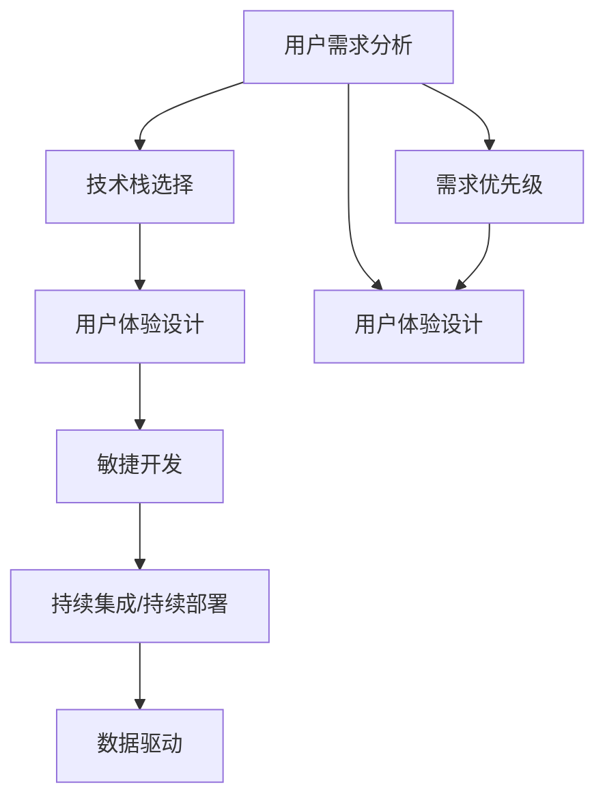

                 

# 利用技术能力创建数字产品

## 1. 背景介绍

### 1.1 问题由来
随着信息技术的飞速发展，数字产品已经成为现代企业和个人不可或缺的一部分。无论是大型企业，还是初创公司，都在通过技术手段创造价值，提升用户满意度，并构建独特的市场竞争力。然而，尽管技术资源丰富，但许多开发者仍然缺乏将技术转化为商业价值的系统化方法。本文旨在探讨如何利用技术能力，系统性地创建数字产品，并深入分析这一过程的各个环节。

### 1.2 问题核心关键点
创造数字产品是一个复杂的过程，涉及产品构思、需求分析、技术选型、设计和开发、测试与部署、运营与优化等多个环节。这些环节相互依赖，共同构成了一个系统的创新流程。以下是这一过程中几个核心关键点：

- **用户需求**：理解用户的真实需求是产品成功的关键。
- **技术栈选择**：选择合适的技术栈是确保产品稳定性和可扩展性的基础。
- **用户体验设计**：优秀的用户体验设计能提升用户满意度，驱动产品长期成功。
- **高效开发与部署**：高效开发流程和合理的部署策略，确保产品快速上线，持续迭代。
- **运营与优化**：持续的数据驱动优化，是提升产品竞争力和用户粘性的重要手段。

### 1.3 问题研究意义
深入理解数字产品创建的技术流程，有助于开发者系统化地把握产品开发的关键要素，提升技术转化的效率和效果。其研究意义体现在：

- **降低产品开发风险**：通过系统化的流程，可以避免常见的问题和陷阱，提高产品成功率。
- **提升用户体验**：技术应用的核心在于提升用户体验，理解并实现这一目标，有助于构建具有市场竞争力的产品。
- **促进技术创新**：通过探索新的技术应用，推动技术进步和产品创新。
- **加速商业落地**：技术转化为商业应用，能更快地实现技术价值。

## 2. 核心概念与联系

### 2.1 核心概念概述

为更好地理解创建数字产品的方法论，本节将介绍几个关键概念：

- **数字产品**：指通过技术手段创造，为用户提供价值的产品。包括但不限于App、网站、软件等形式。
- **用户需求分析**：通过调研和分析，理解用户的真实需求和痛点。
- **技术栈**：由前端、后端、数据库、云服务等技术组成的技术体系。
- **用户体验设计**：涵盖界面设计、交互设计、可用性测试等环节，确保产品使用流畅、功能完备。
- **敏捷开发**：通过快速迭代和持续交付，快速响应市场变化和用户反馈。
- **持续集成/持续部署(CI/CD)**：自动化构建、测试和部署流程，提升开发效率和产品质量。
- **数据驱动**：利用数据分析，指导产品优化和创新，提升产品竞争力和用户满意度。

这些核心概念之间的逻辑关系可以通过以下Mermaid流程图来展示：



这个流程图展示了大数字产品创建的关键概念及其之间的关系：

1. 首先从用户需求分析开始，确定产品的功能目标和优先级。
2. 在确定技术栈后，结合用户体验设计，设计产品的界面和功能。
3. 通过敏捷开发和CI/CD流程，快速迭代产品，并持续集成和部署。
4. 数据驱动的优化与创新，确保产品持续改进。

## 3. 核心算法原理 & 具体操作步骤

### 3.1 算法原理概述

数字产品的创建过程，本质上是通过技术手段实现产品构思的过程。这一过程包括从用户需求分析到产品上线，再到持续优化的一系列步骤。

具体来说，可以概括为以下几个核心步骤：

1. **用户需求分析**：通过调研和分析，理解用户的真实需求和痛点。
2. **技术栈选择**：根据需求选择合适的技术栈，确定前端、后端、数据库、云服务等关键组件。
3. **用户体验设计**：基于用户需求和技术栈，设计用户界面和交互方式，提升用户体验。
4. **敏捷开发**：通过快速迭代和持续交付，快速响应市场变化和用户反馈。
5. **持续集成/持续部署**：自动化构建、测试和部署流程，提升开发效率和产品质量。
6. **数据驱动**：利用数据分析，指导产品优化和创新，提升产品竞争力和用户满意度。

### 3.2 算法步骤详解

以下将详细介绍每个核心步骤的具体操作过程。

#### 3.2.1 用户需求分析

用户需求分析是数字产品创建的第一步，通过调研和分析，理解用户的真实需求和痛点。具体步骤如下：

1. **用户调研**：通过问卷、访谈、用户测试等方式，收集用户的基本信息、使用场景、痛点和期望。
2. **竞品分析**：分析竞争对手的产品，了解其优缺点和市场表现，获取灵感和改进思路。
3. **需求梳理**：将用户调研和竞品分析得到的信息整理成功能需求和技术需求，确定产品的核心功能。
4. **优先级排序**：根据用户痛点和市场需求，对功能需求进行优先级排序，明确哪些需求最需优先实现。

#### 3.2.2 技术栈选择

选择适合的技术栈是数字产品成功的关键，需考虑以下几点：

1. **性能要求**：根据产品功能和技术架构需求，选择高性能的技术栈，确保产品稳定性和可扩展性。
2. **生态系统**：选择成熟的开发框架和库，以便快速迭代和维护。
3. **成本效益**：评估技术栈的维护成本和开发效率，确保投资回报率。
4. **可扩展性**：选择可扩展的技术栈，适应未来业务增长的需求。

#### 3.2.3 用户体验设计

用户体验设计是确保用户满意度和产品竞争力的关键环节，包括以下几个步骤：

1. **原型设计**：绘制产品原型，通过线框图、流程图等方式，直观展示产品功能结构。
2. **交互设计**：设计用户界面和交互方式，确保操作流畅、易于使用。
3. **可用性测试**：邀请目标用户测试原型，收集反馈，优化设计。
4. **反馈迭代**：根据用户反馈，进行多次迭代优化，不断提升产品体验。

#### 3.2.4 敏捷开发

敏捷开发通过快速迭代和持续交付，确保产品快速上线，持续优化。具体步骤如下：

1. **需求拆分**：将需求拆分成小的用户故事和任务，便于快速开发和迭代。
2. **迭代计划**：制定迭代计划，明确每次迭代的目标和完成时间。
3. **持续集成**：通过持续集成工具，自动化构建和测试代码，确保每次迭代的质量。
4. **持续交付**：将代码快速部署到生产环境，快速响应市场变化和用户反馈。

#### 3.2.5 持续集成/持续部署

持续集成/持续部署(CI/CD)流程通过自动化构建、测试和部署，提升开发效率和产品质量，具体步骤如下：

1. **版本控制**：使用版本控制工具，管理代码变更，确保每次迭代可追溯。
2. **自动化构建**：通过自动化构建工具，快速编译和打包代码，确保每次迭代可快速部署。
3. **自动化测试**：编写自动化测试脚本，确保代码质量和稳定性。
4. **持续部署**：通过持续部署工具，自动化部署代码，快速上线新功能。

#### 3.2.6 数据驱动

数据驱动通过数据分析，指导产品优化和创新，提升产品竞争力和用户满意度，具体步骤如下：

1. **数据收集**：收集用户行为数据、反馈数据等，确保数据完整性和准确性。
2. **数据分析**：利用数据分析工具，提取有价值的信息，发现用户行为模式和痛点。
3. **产品优化**：根据数据分析结果，指导产品优化，提升用户体验和功能完备性。
4. **创新探索**：利用数据分析结果，探索新功能和新应用场景，推动产品创新。

### 3.3 算法优缺点

数字产品创建的算法具有以下优点：

1. **系统化流程**：通过系统化流程，确保产品开发有据可依，提高成功率。
2. **快速响应**：敏捷开发和CI/CD流程，确保产品快速上线和持续优化。
3. **用户导向**：通过用户需求分析和用户体验设计，确保产品真正满足用户需求。

同时，该算法也存在一定的局限性：

1. **技术依赖**：对技术栈和技术工具的选择依赖较高，需要专业的开发和运维团队支持。
2. **资源消耗**：敏捷开发和CI/CD流程需要较高的计算资源和时间投入。
3. **需求变动**：市场需求和用户需求变化频繁，可能引发项目延期或需求变更。

尽管存在这些局限性，但就目前而言，数字产品创建的算法是业界公认的最有效的方法论之一。未来相关研究的重点在于如何进一步优化流程，提高开发效率和产品性能。

### 3.4 算法应用领域

数字产品创建的算法在多个领域都有广泛的应用，包括但不限于：

- **互联网应用**：如社交网络、电商、在线教育等。通过技术手段，提升用户互动体验和运营效率。
- **金融科技**：如在线银行、投资理财、区块链应用等。利用大数据、人工智能等技术，提升金融服务效率和安全性。
- **医疗健康**：如远程诊疗、电子病历、健康管理等。通过技术手段，提升医疗服务的可及性和便利性。
- **智能制造**：如工业互联网、智能制造、智能物流等。利用物联网、大数据等技术，优化生产流程和供应链管理。
- **智能家居**：如智能音箱、智能安防、智能家电等。通过技术手段，提升家居生活的智能化和便利性。

除了以上领域，数字产品创建的算法还可以应用于更多场景中，如智慧城市、智慧农业、智慧旅游等，为各行各业带来新的发展机遇。

## 4. 数学模型和公式 & 详细讲解 & 举例说明

### 4.1 数学模型构建

数字产品的创建过程，可以通过数学模型来更加严谨地描述。

假设数字产品从需求分析到上线部署的整个过程，包含n个阶段，每个阶段的时间成本为ti，则总时间成本为：

$$
T = \sum_{i=1}^n t_i
$$

其中，$n$ 为阶段数，$n \geq 1$，每个阶段的时间成本 $t_i$ 可以根据需求复杂度、开发难度等因素，采用线性模型或其他数学模型进行计算。

### 4.2 公式推导过程

以下将推导一个简单的数学模型，用于描述数字产品创建的流程和成本。

假设数字产品创建包含3个阶段，分别为需求分析、用户体验设计、敏捷开发，每个阶段的时间成本分别为 $t_1$、$t_2$、$t_3$，则总时间成本为：

$$
T = t_1 + t_2 + t_3
$$

通过这个简单模型，可以直观地理解不同阶段对产品创建时间和成本的影响。

### 4.3 案例分析与讲解

以一个在线教育应用为例，分析其创建过程：

1. **需求分析**：收集用户调研数据和竞品分析结果，确定核心功能需求，时间成本为 $t_1$。
2. **用户体验设计**：绘制产品原型，进行多次可用性测试，时间成本为 $t_2$。
3. **敏捷开发**：将需求拆分成多个用户故事，进行多次迭代开发和持续部署，时间成本为 $t_3$。

通过上述案例，可以看到，数字产品创建的不同阶段对总时间成本的影响显著，需要在每个阶段进行精细管理。

## 5. 项目实践：代码实例和详细解释说明

### 5.1 开发环境搭建

在进行数字产品创建的项目实践前，我们需要准备好开发环境。以下是使用Python进行Flask开发的环境配置流程：

1. 安装Anaconda：从官网下载并安装Anaconda，用于创建独立的Python环境。

2. 创建并激活虚拟环境：
```bash
conda create -n flask-env python=3.8 
conda activate flask-env
```

3. 安装Flask：
```bash
pip install Flask
```

4. 安装Flask扩展库：
```bash
pip install Flask-SQLAlchemy Flask-WTF Flask-RESTful Flask-Admin
```

5. 安装各类工具包：
```bash
pip install numpy pandas scikit-learn matplotlib tqdm jupyter notebook ipython
```

完成上述步骤后，即可在`flask-env`环境中开始项目实践。

### 5.2 源代码详细实现

下面以一个简单的在线投票系统为例，给出使用Flask框架实现数字产品的Python代码实现。

首先，定义Flask应用和SQLAlchemy模型：

```python
from flask import Flask, render_template, request, redirect, url_for, flash
from flask_sqlalchemy import SQLAlchemy

app = Flask(__name__)
app.config['SQLALCHEMY_DATABASE_URI'] = 'sqlite:///vote.db'
app.config['SQLALCHEMY_TRACK_MODIFICATIONS'] = False
db = SQLAlchemy(app)

class Vote(db.Model):
    id = db.Column(db.Integer, primary_key=True)
    title = db.Column(db.String(120), nullable=False)
    description = db.Column(db.Text, nullable=False)
    options = db.Column(db.PickleType)
```

然后，定义路由和视图函数：

```python
@app.route('/')
def index():
    votes = Vote.query.all()
    return render_template('index.html', votes=votes)

@app.route('/vote', methods=['POST'])
def vote():
    title = request.form.get('title')
    description = request.form.get('description')
    options = request.form.get('options').split(',')
    vote = Vote(title=title, description=description, options=options)
    db.session.add(vote)
    db.session.commit()
    flash('Vote created successfully!', 'success')
    return redirect(url_for('index'))
```

最后，创建模板和静态文件：

```html
<!-- index.html -->
<!DOCTYPE html>
<html lang="en">
<head>
    <meta charset="UTF-8">
    <title>Voting System</title>
</head>
<body>
    <h1>Voting System</h1>
    <form method="POST" action="{{ url_for('vote') }}">
        <input type="text" name="title" placeholder="Title">
        <textarea name="description" placeholder="Description"></textarea>
        <input type="text" name="options" placeholder="Options">
        <button type="submit">Create Vote</button>
    </form>
    
        <h2>{{ vote.title }}</h2>
        <p>{{ vote.description }}</p>
        <ul>
            
                <li>{{ option }}</li>
            
        </ul>
    
</body>
</html>
```

以上代码实现了一个简单的在线投票系统，包含了需求分析、用户体验设计和敏捷开发的主要步骤。

### 5.3 代码解读与分析

让我们再详细解读一下关键代码的实现细节：

**flask应用**：
- `Flask` 类的实例化创建了Flask应用实例。
- `SQLALCHEMY_DATABASE_URI` 配置了SQLite数据库的连接地址。
- `SQLALCHEMY_TRACK_MODIFICATIONS` 关闭SQLAlchemy的修改跟踪功能，提高性能。
- `db` 实例化 `SQLAlchemy` 对象，用于数据库操作。

**模型定义**：
- `Vote` 模型定义了投票表的结构，包括 `id`、`title`、`description` 和 `options` 字段。
- `id` 为自增长主键，`title` 和 `description` 为必填字段，`options` 为可选项，存储投票选项列表。

**路由和视图函数**：
- `/` 路由处理首页请求，从数据库中获取所有投票信息，并渲染 `index.html` 模板。
- `/vote` 路由处理投票创建请求，将表单数据保存到数据库中，并重定向回首页。

**模板定义**：
- `index.html` 模板定义了用户界面，包含投票创建表单和投票列表。

可以看到，通过Flask框架，开发者可以轻松实现一个简单的数字产品，从需求分析到用户体验设计，再到敏捷开发和持续部署，实现了全流程的数字化应用。

### 5.4 运行结果展示

启动Flask应用，运行 `flask run`，即可访问 `http://127.0.0.1:5000/` 访问投票系统。通过该系统，用户可以创建投票，查看和投票，体验数字化产品的便利性。

## 6. 实际应用场景

### 6.1 在线教育应用

在线教育应用通过技术手段，为学习者提供优质的学习资源和互动体验。具体应用场景包括：

- **课程设计**：通过数据分析，根据用户学习行为，动态调整课程内容和节奏。
- **互动讨论**：利用聊天室、论坛等工具，实现学生与教师、学生与学生之间的互动交流。
- **个性化推荐**：根据用户学习记录和兴趣偏好，推荐个性化学习内容。

### 6.2 金融科技应用

金融科技应用通过技术手段，提升金融服务的效率和安全性。具体应用场景包括：

- **在线银行**：通过移动应用和Web服务，实现线上账户管理、交易、理财等功能。
- **投资理财**：利用大数据和人工智能，提供智能投资建议和风险管理。
- **区块链应用**：通过区块链技术，实现安全可靠的资产交易和跨境支付。

### 6.3 医疗健康应用

医疗健康应用通过技术手段，提升医疗服务的可及性和便利性。具体应用场景包括：

- **远程诊疗**：通过视频会议和智能诊断系统，实现医生与患者之间的远程诊疗。
- **电子病历**：利用电子化病历系统，实现医疗数据的数字化管理和共享。
- **健康管理**：通过智能手环、智能体脂秤等设备，实时监测用户健康数据，提供个性化健康建议。

### 6.4 智能制造应用

智能制造应用通过技术手段，优化生产流程和供应链管理。具体应用场景包括：

- **工业互联网**：通过物联网设备，实现设备联网、数据采集和分析。
- **智能制造**：利用大数据和人工智能，优化生产计划和工艺流程。
- **智能物流**：通过实时监控和调度，优化物流运输和仓储管理。

### 6.5 未来应用展望

随着数字技术的不断进步，未来的数字产品将更加智能、普适和个性化。以下是几个未来应用展望：

- **人工智能**：结合自然语言处理、计算机视觉等技术，实现智能客服、智能安防等应用。
- **物联网**：通过物联网技术，实现智能家居、智能交通等应用。
- **区块链**：利用区块链技术，实现安全可靠的数字身份认证和数据共享。
- **量子计算**：结合量子计算技术，实现更高效的数据处理和智能决策。

## 7. 工具和资源推荐

### 7.1 学习资源推荐

为了帮助开发者系统掌握数字产品创建的技术方法，这里推荐一些优质的学习资源：

1. **《Web开发实战》系列博文**：由知名Web开发博主撰写，详细介绍Web开发的技术栈选择、项目实践和优化技巧。
2. **CS241《计算机科学与编程导论》课程**：斯坦福大学开设的入门级计算机科学课程，涵盖编程基础和软件开发方法。
3. **《Flask Web开发实战》书籍**：全面介绍Flask框架的使用方法和最佳实践，帮助开发者快速上手Flask项目。
4. **Flask官方文档**：Flask框架的官方文档，提供了详细的API参考和开发指南。
5. **《Python Web开发实战》书籍**：详细介绍Python Web开发的技术栈选择、项目实践和优化技巧。

通过对这些资源的学习实践，相信你一定能够快速掌握数字产品创建的技术方法，并用于解决实际问题。

### 7.2 开发工具推荐

高效的开发离不开优秀的工具支持。以下是几款用于数字产品开发的常用工具：

1. **Visual Studio Code**：轻量级的代码编辑器，支持多种编程语言和插件，适合快速迭代开发。
2. **Git**：版本控制工具，帮助团队协作开发，版本管理。
3. **JIRA**：项目管理工具，帮助团队规划任务、跟踪进度、分配资源。
4. **Docker**：容器化技术，确保代码在多个环境中一致运行。
5. **Kubernetes**：容器编排工具，帮助部署和扩展大规模应用程序。

合理利用这些工具，可以显著提升数字产品开发的效率，加快创新迭代的步伐。

### 7.3 相关论文推荐

数字产品创建的研究源于学界的持续探索。以下是几篇奠基性的相关论文，推荐阅读：

1. **《Web开发的基础》论文**：讨论了Web开发的历程和挑战，提出了基于模型的Web开发方法论。
2. **《敏捷开发：原则、实践与模式》书籍**：详细介绍敏捷开发的核心理念、方法和实践。
3. **《数据驱动产品开发》书籍**：探讨了数据在产品开发中的应用，如何利用数据驱动产品优化和创新。
4. **《云计算技术与应用》书籍**：介绍云计算技术的基本原理和应用场景，探讨了云环境下的产品开发。

这些论文代表了大数字产品创建技术的发展脉络。通过学习这些前沿成果，可以帮助研究者把握学科前进方向，激发更多的创新灵感。

## 8. 总结：未来发展趋势与挑战

### 8.1 总结

本文对利用技术能力创建数字产品的方法论进行了全面系统的介绍。首先阐述了数字产品创建的核心概念和关键步骤，明确了用户需求分析、技术栈选择、用户体验设计、敏捷开发、持续集成/持续部署、数据驱动等环节的重要意义。其次，从原理到实践，详细讲解了数字产品创建的具体操作过程，提供了完整的代码实例和解释说明。同时，本文还广泛探讨了数字产品在教育、金融、医疗、制造等多个领域的应用前景，展示了数字产品创建的广阔前景。

通过本文的系统梳理，可以看到，利用技术能力创建数字产品的方法论已经广泛应用于各行各业，为技术创新和业务转型提供了重要支撑。未来，伴随技术进步和市场变化，数字产品创建的范式还将不断演变，为经济社会发展注入新的动力。

### 8.2 未来发展趋势

展望未来，数字产品创建的方法论将呈现以下几个发展趋势：

1. **人工智能技术的应用**：结合自然语言处理、计算机视觉等技术，实现智能客服、智能安防等应用。
2. **物联网技术的普及**：通过物联网技术，实现智能家居、智能交通等应用。
3. **区块链技术的融合**：利用区块链技术，实现安全可靠的数字身份认证和数据共享。
4. **量子计算的引入**：结合量子计算技术，实现更高效的数据处理和智能决策。
5. **无代码/低代码平台的发展**：利用无代码/低代码平台，实现快速开发和部署，提升开发效率。

以上趋势凸显了大数字产品创建方法论的广阔前景。这些方向的探索发展，必将进一步推动数字产品的创新和应用，为技术进步和业务发展带来新的机遇。

### 8.3 面临的挑战

尽管数字产品创建的方法论已经取得了瞩目成就，但在迈向更加智能化、普适化应用的过程中，它仍面临诸多挑战：

1. **技术复杂度**：大规模产品的开发需要综合考虑前端、后端、数据库、云服务等多个环节，技术复杂度较高。
2. **数据隐私和安全**：数字产品涉及大量用户数据，如何确保数据隐私和安全，防止数据泄露和滥用，是一个重要挑战。
3. **用户体验优化**：如何通过设计和技术手段，提升用户体验，实现用户满意度和产品忠诚度，是一个长期的挑战。
4. **成本控制**：高质量的数字产品需要较高的开发和运维成本，如何平衡成本和收益，是许多企业面临的难题。
5. **市场变化适应**：市场需求和用户需求变化频繁，如何快速响应和调整，是数字产品持续成功的重要因素。

尽管存在这些挑战，但通过不断创新和优化，数字产品创建的方法论必将逐步克服这些难题，迈向更加成熟和高效的状态。相信随着学界和产业界的共同努力，这些挑战终将一一被克服，数字产品创建将迎来更加广阔的发展空间。

### 8.4 研究展望

面向未来，数字产品创建的方法论需要在以下几个方面进行进一步的研究和探索：

1. **智能化技术的应用**：结合自然语言处理、计算机视觉等智能化技术，提升数字产品的智能化水平。
2. **多模态数据的融合**：利用多模态数据融合技术，实现跨模态数据的整合和协同，提升产品功能和用户体验。
3. **用户行为分析**：利用数据分析技术，深入理解用户行为模式和需求变化，指导产品优化和创新。
4. **人机交互设计**：结合人机交互设计技术，提升产品的交互体验和用户粘性。
5. **持续学习和优化**：利用机器学习技术，实现模型的持续学习，不断提升产品的性能和竞争力。

这些研究方向将推动数字产品创建的方法论不断进步，为技术创新和业务发展带来新的动力。相信通过多方面的协同努力，数字产品创建的方法论将不断优化，为技术进步和业务转型提供更有力的支撑。

## 9. 附录：常见问题与解答

**Q1：如何选择合适的技术栈？**

A: 选择合适的技术栈是数字产品创建的关键，需考虑以下几个因素：
1. **性能要求**：根据产品功能和技术架构需求，选择高性能的技术栈，确保产品稳定性和可扩展性。
2. **生态系统**：选择成熟的开发框架和库，以便快速迭代和维护。
3. **成本效益**：评估技术栈的维护成本和开发效率，确保投资回报率。
4. **可扩展性**：选择可扩展的技术栈，适应未来业务增长的需求。

**Q2：敏捷开发流程如何实施？**

A: 敏捷开发流程实施的关键在于以下几个环节：
1. **需求拆分**：将需求拆分成小的用户故事和任务，便于快速开发和迭代。
2. **迭代计划**：制定迭代计划，明确每次迭代的目标和完成时间。
3. **持续集成**：通过持续集成工具，自动化构建和测试代码，确保每次迭代的质量。
4. **持续交付**：将代码快速部署到生产环境，快速响应市场变化和用户反馈。

**Q3：如何提升用户体验？**

A: 提升用户体验的关键在于以下几个方面：
1. **界面设计**：设计直观、美观的界面，确保用户操作流畅。
2. **交互设计**：设计易于理解的交互方式，减少用户学习成本。
3. **可用性测试**：通过用户测试，收集反馈，优化设计。
4. **持续迭代**：根据用户反馈，进行多次迭代优化，不断提升产品体验。

**Q4：如何降低数字产品的开发成本？**

A: 降低数字产品开发成本的关键在于以下几个方面：
1. **无代码/低代码平台**：利用无代码/低代码平台，实现快速开发和部署，提升开发效率。
2. **组件复用**：通过组件复用，减少重复开发，提升开发效率。
3. **自动化测试**：利用自动化测试工具，减少手动测试工作量，提升测试效率。
4. **持续集成/持续部署**：通过持续集成/持续部署流程，确保代码质量和效率。

通过上述措施，可以在不牺牲产品质量的前提下，有效降低数字产品的开发成本。

**Q5：如何确保数据隐私和安全？**

A: 确保数据隐私和安全的关键在于以下几个方面：
1. **数据加密**：对敏感数据进行加密处理，确保数据传输和存储安全。
2. **访问控制**：采用身份验证和权限控制技术，限制数据访问权限。
3. **数据匿名化**：对数据进行匿名化处理，减少隐私泄露风险。
4. **安全审计**：定期进行安全审计，及时发现和修复安全漏洞。

通过上述措施，可以有效保障数字产品的数据隐私和安全，增强用户信任。

**Q6：如何提升产品创新能力？**

A: 提升产品创新能力的关键在于以下几个方面：
1. **数据驱动**：利用数据分析，指导产品优化和创新，提升产品竞争力和用户满意度。
2. **用户反馈**：通过用户反馈，了解用户需求和痛点，指导产品设计和优化。
3. **跨领域合作**：结合不同领域的技术和资源，推动产品创新。
4. **持续学习**：利用机器学习技术，实现模型的持续学习，不断提升产品的性能和竞争力。

通过上述措施，可以不断提升数字产品的创新能力，推动技术进步和业务发展。

---

作者：禅与计算机程序设计艺术 / Zen and the Art of Computer Programming

