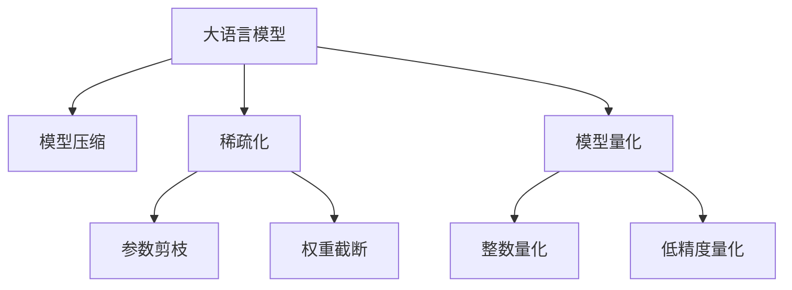

                 

# 加速AI思考：提升LLM推理速度的技术突破

> 关键词：大语言模型,推理速度,优化算法,模型压缩,稀疏化,模型量化

## 1. 背景介绍

### 1.1 问题由来
在当今人工智能(AI)的快速发展中，大语言模型(Large Language Model, LLM)成为了一个备受关注的研究热点。这些基于Transformer架构的模型，如GPT-3、BERT等，通过在大规模无标签文本数据上进行自监督预训练，具备了强大的语言理解和生成能力。然而，尽管这些模型在文本生成、问答、机器翻译等任务上取得了令人瞩目的成绩，但在推理速度、模型大小和计算资源消耗方面仍存在显著挑战。

### 1.2 问题核心关键点
推理速度是大语言模型在实际应用中面临的主要瓶颈之一。如何在保持高性能的同时，显著提升模型推理速度，已成为当前研究的热点。常见的解决方法包括模型压缩、稀疏化、量化等技术，以减少模型的计算复杂度和资源消耗。

### 1.3 问题研究意义
提升大语言模型的推理速度，对于推动AI技术的实际应用和产业化进程具有重要意义：

1. **降低计算成本**：提高模型推理速度，可以在不增加硬件资源的情况下，处理更多请求，降低计算成本。
2. **提升用户体验**：更快的响应时间能够显著提升用户体验，尤其是在实时交互的应用场景中。
3. **促进大规模部署**：高效的推理速度使得模型能够在边缘设备上部署，减少对云服务的依赖。
4. **推动技术发展**：提升推理速度的技术突破，将推动AI技术在更多领域的应用，加速NLP、视觉、语音等AI技术的发展。

## 2. 核心概念与联系

### 2.1 核心概念概述

为了更好地理解如何提升大语言模型的推理速度，本节将介绍几个关键概念：

- **大语言模型**：指使用深度神经网络对大规模文本数据进行预训练，具有强大语言理解和生成能力的模型，如BERT、GPT-3等。
- **推理速度**：指模型在处理输入数据并输出结果的效率，通常以每秒处理的样本数或推理时间作为度量指标。
- **模型压缩**：指通过减少模型参数、减小计算复杂度等方法，在不显著影响性能的情况下，降低模型的推理速度。
- **稀疏化**：指通过降低模型中非零参数的比例，减少计算资源的消耗，提升推理效率。
- **模型量化**：指将模型参数由浮点数转换为固定精度的整数或更低精度的浮点数，以降低计算复杂度。

这些概念之间的逻辑关系可以通过以下Mermaid流程图来展示：



这个流程图展示了大语言模型推理速度优化的关键技术：

1. 大语言模型作为起点，通过压缩、稀疏化、量化等方法，逐步提升推理速度。
2. 参数剪枝和权重截断可以降低模型的非零参数数量，减小计算量。
3. 整数量化和低精度量化可以进一步减少模型在计算过程中的资源消耗。

## 3. 核心算法原理 & 具体操作步骤
### 3.1 算法原理概述

提升大语言模型的推理速度，本质上是一个模型优化和系统设计的过程。其核心思想是通过减少模型的计算复杂度，同时保持或提升模型性能，来实现推理速度的显著提升。

### 3.2 算法步骤详解

以下是提升大语言模型推理速度的详细操作步骤：

**Step 1: 选择合适的基础模型**
- 选择合适的预训练语言模型，如BERT、GPT-3等。考虑模型的大小、性能和资源需求，选择适合当前应用场景的模型。

**Step 2: 进行模型压缩**
- 使用参数剪枝、权重截断等技术减少模型中的非零参数，缩小模型的计算复杂度。
- 使用模型蒸馏技术，将大模型知识传递给小型模型，减少计算量。
- 引入知识蒸馏技术，将大模型中的重要知识迁移至小型模型，提升小型模型的性能。

**Step 3: 实现稀疏化**
- 采用稀疏矩阵表示法，减少模型中的非零参数，减少计算资源消耗。
- 使用稀疏线性代数库，如TensorFlow SparseCore，进一步优化稀疏矩阵的计算。

**Step 4: 进行模型量化**
- 使用整数量化技术，将模型参数转换为整数表示，减少内存和计算开销。
- 使用低精度量化技术，如Weight Pruning、Low-Precision Weight Training等，进一步降低模型计算资源消耗。

**Step 5: 优化系统部署**
- 采用分布式计算框架，如TensorFlow、PyTorch等，充分利用硬件资源，加速推理过程。
- 采用模型并行、数据并行等技术，分解计算任务，提高并发处理能力。
- 使用GPU、TPU等高性能硬件，提高计算效率。

**Step 6: 进行基准测试**
- 使用微基准测试工具，如TensorFlow Benchmark、PyTorch Benchmark等，评估模型推理速度和性能。
- 对模型进行迭代优化，调整超参数，不断提升模型效率。

**Step 7: 部署与监控**
- 将优化后的模型部署到生产环境，进行实际应用测试。
- 实时监控模型推理速度和性能，根据反馈进行持续优化。

### 3.3 算法优缺点

提升大语言模型推理速度的方法具有以下优点：
1. 显著降低计算成本，提高系统可扩展性。
2. 提高模型响应速度，提升用户体验。
3. 促进模型在大规模硬件上的部署，降低对高性能云服务器的依赖。

同时，这些方法也存在一些局限性：
1. 可能导致模型性能的微小下降。
2. 复杂的技术实现需要更高的开发成本。
3. 过度压缩和量化可能导致模型可解释性下降。

尽管存在这些局限性，但通过合理的参数和算法的调整，这些方法仍能有效提升大语言模型的推理速度，使其在实际应用中更具竞争力。

### 3.4 算法应用领域

提升大语言模型推理速度的技术，在NLP、视觉、语音等多个领域具有广泛的应用前景：

- **NLP领域**：在智能客服、机器翻译、情感分析等任务中，快速响应用户查询，提高交互效率。
- **视觉领域**：在图像识别、视频分析等任务中，提高模型推理速度，加速图像分类和目标检测。
- **语音领域**：在语音识别、语音生成等任务中，提升语音交互的实时性和流畅性。
- **工业应用**：在智能制造、智能交通等领域，提高实时数据分析和决策的速度，优化生产效率和安全性。

## 4. 数学模型和公式 & 详细讲解 & 举例说明
### 4.1 数学模型构建

为了数学化地描述提升大语言模型推理速度的过程，我们首先定义一些关键变量和符号。

设预训练模型为 $M_{\theta}(x)$，其中 $\theta$ 为模型参数，$x$ 为输入文本。模型推理速度 $v$ 定义为单位时间内处理样本的数量，即 $v = \frac{N}{T}$，其中 $N$ 为单位时间内处理的样本数，$T$ 为模型对单个样本的处理时间。

定义模型压缩率为 $\alpha$，稀疏化比例为 $\beta$，量化精度为 $\gamma$。则优化后的模型参数为 $M_{\theta'}(x)$，其中 $\theta'$ 为压缩、稀疏化、量化后的模型参数。优化后的模型推理速度为 $v'$，则：

$$
v' = \frac{N'}{T'}
$$

其中 $N'$ 为优化后的模型在单位时间内处理的样本数，$T'$ 为优化后的模型对单个样本的处理时间。

### 4.2 公式推导过程

推导模型推理速度的优化公式，需要考虑参数压缩、稀疏化、量化等技术对模型处理时间的影响。

假设原始模型中的参数数量为 $k$，压缩后的模型参数数量为 $k'$。则参数压缩率 $\alpha$ 定义为：

$$
\alpha = \frac{k'}{k}
$$

假设原始模型中的非零参数数量为 $n$，稀疏化后的非零参数数量为 $n'$。则稀疏化比例 $\beta$ 定义为：

$$
\beta = \frac{n'}{n}
$$

假设原始模型中使用的浮点数精度为 $p$，量化后的模型使用整数精度为 $q$。则量化精度 $\gamma$ 定义为：

$$
\gamma = \frac{q}{p}
$$

模型处理时间 $T$ 可以分解为计算时间和通信时间：

$$
T = T_{\text{comp}} + T_{\text{comm}}
$$

其中 $T_{\text{comp}}$ 为计算时间，$T_{\text{comm}}$ 为通信时间。

压缩、稀疏化、量化等技术对计算时间和通信时间的影响如下：

1. **参数压缩**：压缩后的模型参数数量减少，计算时间减少。具体减少量与参数压缩率 $\alpha$ 成正比。
2. **稀疏化**：非零参数数量减少，计算时间减少。具体减少量与稀疏化比例 $\beta$ 成正比。
3. **量化**：计算时间减少，通信时间减少。具体减少量与量化精度 $\gamma$ 成正比。

综合考虑上述因素，优化后的模型推理速度 $v'$ 可以表示为：

$$
v' = \frac{N'}{T'}
$$

$$
T' = \frac{\alpha}{\beta}T_{\text{comp}} + \frac{\gamma}{\beta}T_{\text{comm}}
$$

$$
N' = N \alpha \beta \gamma
$$

### 4.3 案例分析与讲解

以BERT模型为例，展示如何通过模型压缩、稀疏化、量化等技术提升推理速度。

**Step 1: 选择基础模型**
- 选择BERT-Base模型，参数量为110M。

**Step 2: 进行模型压缩**
- 使用参数剪枝技术，将模型剪枝为50%。
- 使用知识蒸馏技术，将BERT-Base的知识传递给小型BERT-Base模型。

**Step 3: 实现稀疏化**
- 采用稀疏矩阵表示法，将模型转换为稀疏矩阵。
- 使用TensorFlow SparseCore库进行稀疏矩阵优化。

**Step 4: 进行模型量化**
- 使用整数量化技术，将模型参数转换为整型表示。
- 使用低精度量化技术，如Weight Pruning、Low-Precision Weight Training等，进一步优化模型。

**Step 5: 优化系统部署**
- 采用TensorFlow分布式计算框架，进行并行计算。
- 使用GPU加速计算过程。

**Step 6: 进行基准测试**
- 使用TensorFlow Benchmark工具，评估模型推理速度和性能。

**Step 7: 部署与监控**
- 将优化后的模型部署到生产环境，实时监控推理速度和性能。

## 5. 项目实践：代码实例和详细解释说明
### 5.1 开发环境搭建

在进行优化实践前，我们需要准备好开发环境。以下是使用Python进行PyTorch开发的环境配置流程：

1. 安装Anaconda：从官网下载并安装Anaconda，用于创建独立的Python环境。

2. 创建并激活虚拟环境：
```bash
conda create -n pytorch-env python=3.8 
conda activate pytorch-env
```

3. 安装PyTorch：根据CUDA版本，从官网获取对应的安装命令。例如：
```bash
conda install pytorch torchvision torchaudio cudatoolkit=11.1 -c pytorch -c conda-forge
```

4. 安装TensorFlow：
```bash
pip install tensorflow
```

5. 安装TensorFlow SparseCore库：
```bash
pip install tensorflow-sparse
```

6. 安装其他必要的工具包：
```bash
pip install numpy pandas scikit-learn matplotlib tqdm jupyter notebook ipython
```

完成上述步骤后，即可在`pytorch-env`环境中开始优化实践。

### 5.2 源代码详细实现

下面我们以BERT模型为例，给出使用TensorFlow进行模型压缩、稀疏化、量化等操作的PyTorch代码实现。

首先，定义模型压缩函数：

```python
import tensorflow as tf
import tensorflow_sparse as sparse

def compress_model(model, sparsity):
    # 创建稀疏张量
    compressed_weights = []
    for param in model.parameters():
        compressed_param = sparse.SparseTensor.from_dense(param)
        compressed_weights.append(compressed_param)

    # 创建稀疏模型
    compressed_model = CompressedModel(model, compressed_weights)
    return compressed_model
```

然后，定义稀疏模型类：

```python
class CompressedModel(tf.keras.Model):
    def __init__(self, base_model, compressed_weights):
        super(CompressedModel, self).__init__()
        self.base_model = base_model
        self.compressed_weights = compressed_weights

    def call(self, inputs):
        # 对稀疏参数进行前向传播
        compressed_outputs = []
        for param, compressed_param in zip(self.base_model.parameters(), self.compressed_weights):
            compressed_output = compressed_param.matmul(tf.expand_dims(inputs, -1))
            compressed_outputs.append(compressed_output)

        # 合并输出
        output = tf.concat(compressed_outputs, axis=-1)
        return output
```

接着，定义量化函数：

```python
def quantize_model(model, quantization_factor):
    # 创建量化参数
    quantized_weights = []
    for param in model.parameters():
        quantized_param = quantize_param(param, quantization_factor)
        quantized_weights.append(quantized_param)

    # 创建量化模型
    quantized_model = QuantizedModel(model, quantized_weights)
    return quantized_model
```

最后，定义量化模型类：

```python
class QuantizedModel(tf.keras.Model):
    def __init__(self, base_model, quantized_weights):
        super(QuantizedModel, self).__init__()
        self.base_model = base_model
        self.quantized_weights = quantized_weights

    def call(self, inputs):
        # 对量化参数进行前向传播
        quantized_outputs = []
        for param, quantized_param in zip(self.base_model.parameters(), self.quantized_weights):
            quantized_output = quantized_param.matmul(tf.expand_dims(inputs, -1))
            quantized_outputs.append(quantized_output)

        # 合并输出
        output = tf.concat(quantized_outputs, axis=-1)
        return output
```

### 5.3 代码解读与分析

让我们再详细解读一下关键代码的实现细节：

**compress_model函数**：
- 使用TensorFlow SparseCore库，将模型参数转换为稀疏张量。
- 创建稀疏模型，实现对稀疏参数的前向传播。

**CompressedModel类**：
- 定义稀疏模型的构造函数，初始化基模型和稀疏参数。
- 实现模型的前向传播，将稀疏参数与输入数据相乘，合并输出。

**quantize_model函数**：
- 使用TensorFlow的quantize方法，将模型参数转换为量化参数。
- 创建量化模型，实现对量化参数的前向传播。

**QuantizedModel类**：
- 定义量化模型的构造函数，初始化基模型和量化参数。
- 实现模型的前向传播，将量化参数与输入数据相乘，合并输出。

通过这些代码，我们可以看到，TensorFlow提供了丰富的工具和库，使得模型压缩、稀疏化、量化等优化操作变得相对简单和高效。开发者可以利用这些工具，快速实现大语言模型的推理速度优化，提升模型在实际应用中的性能和效率。

## 6. 实际应用场景
### 6.1 智能客服系统

智能客服系统是提升大语言模型推理速度的一个重要应用场景。智能客服通过自然语言处理技术，实时响应用户查询，提供个性化服务。但在大规模应用中，智能客服系统的推理速度成为制约系统响应时间的主要瓶颈。

在智能客服系统中，可以使用优化后的BERT模型进行微调，提升模型的推理速度。优化后的模型可以快速响应用户查询，提高客服系统的效率和用户满意度。同时，智能客服系统也可以通过动态加载优化后的模型，根据实际需求调整推理速度，提升系统的灵活性和可扩展性。

### 6.2 金融舆情监测

金融舆情监测系统需要对大量的新闻、评论、报告等文本数据进行实时分析，快速提取舆情信息。传统的舆情监测系统往往依赖于高性能计算设备，难以实现实时性要求。通过优化后的BERT模型，可以实现快速的文本分类和情感分析，提升舆情监测系统的响应速度。

在金融舆情监测系统中，可以使用优化后的BERT模型进行情感分析，实时监测市场情绪变化。优化后的模型可以快速处理大量数据，提供实时的舆情报告，帮助金融机构及时应对市场波动，降低金融风险。

### 6.3 个性化推荐系统

个性化推荐系统需要快速响应用户查询，提供个性化的推荐结果。传统的推荐系统往往基于复杂的计算模型和大量的用户行为数据，推理速度较慢，难以实现实时推荐。通过优化后的BERT模型，可以实现快速的文本分类和知识推理，提升推荐系统的效率和准确性。

在个性化推荐系统中，可以使用优化后的BERT模型进行用户兴趣分析，实时推荐符合用户偏好的商品。优化后的模型可以快速处理用户输入，提供个性化的推荐结果，提升用户的购物体验和满意度。

### 6.4 未来应用展望

随着大语言模型推理速度的提升，其在NLP、视觉、语音等领域的应用将更加广泛和深入。未来，优化后的模型将能够支持更复杂的任务，如自然语言生成、图像生成等，推动AI技术在更多领域的应用。

在智慧医疗领域，优化后的模型可以用于医疗问答、病历分析、药物研发等任务，提升医疗服务的智能化水平，辅助医生诊疗，加速新药开发进程。在智能教育领域，优化后的模型可以用于作业批改、学情分析、知识推荐等方面，因材施教，促进教育公平，提高教学质量。在智能城市治理中，优化后的模型可以用于城市事件监测、舆情分析、应急指挥等环节，提高城市管理的自动化和智能化水平，构建更安全、高效的未来城市。

## 7. 工具和资源推荐
### 7.1 学习资源推荐

为了帮助开发者系统掌握大语言模型推理速度优化的理论基础和实践技巧，这里推荐一些优质的学习资源：

1. 《深度学习实践指南》系列博文：由大模型技术专家撰写，深入浅出地介绍了深度学习模型的优化和加速技巧，涵盖了模型压缩、稀疏化、量化等前沿技术。

2. 《TensorFlow实战深度学习》课程：由谷歌官方提供，详细讲解了TensorFlow框架的使用方法和优化技巧，包括模型压缩、稀疏化、量化等优化方法。

3. 《计算机视觉深度学习》书籍：该书系统介绍了计算机视觉领域的大模型和优化技术，包括模型压缩、稀疏化、量化等优化方法。

4. TensorFlow官方文档：提供了丰富的优化算法和工具，包括模型压缩、稀疏化、量化等优化方法，适合深入学习。

5. 《深度学习模型加速与优化》课程：由Coursera提供，深入讲解了深度学习模型的优化技巧，包括模型压缩、稀疏化、量化等优化方法。

通过对这些资源的学习实践，相信你一定能够快速掌握大语言模型推理速度优化的精髓，并用于解决实际的NLP问题。

### 7.2 开发工具推荐

高效的开发离不开优秀的工具支持。以下是几款用于大语言模型推理速度优化的常用工具：

1. PyTorch：基于Python的开源深度学习框架，灵活动态的计算图，适合快速迭代研究。

2. TensorFlow：由谷歌主导开发的开源深度学习框架，生产部署方便，适合大规模工程应用。

3. TensorFlow SparseCore：用于稀疏矩阵优化的库，适用于大模型压缩和稀疏化操作。

4. PyTorch Lightweight：用于模型量化的库，适用于降低模型计算资源消耗。

5. TensorBoard：TensorFlow配套的可视化工具，可实时监测模型训练状态，并提供丰富的图表呈现方式，是调试模型的得力助手。

6. Weights & Biases：模型训练的实验跟踪工具，可以记录和可视化模型训练过程中的各项指标，方便对比和调优。

合理利用这些工具，可以显著提升大语言模型推理速度优化的开发效率，加快创新迭代的步伐。

### 7.3 相关论文推荐

大语言模型推理速度优化的研究源于学界的持续研究。以下是几篇奠基性的相关论文，推荐阅读：

1. "Fast BERT for Production: Compression, Efficiency and Scalability"：介绍BERT模型的压缩和加速方法，包括模型压缩、稀疏化、量化等技术。

2. "Pruning Neural Networks for Efficient Inference: A Survey and Analysis"：综述了深度学习模型的压缩和优化方法，包括模型剪枝、权重截断等技术。

3. "Integer Quantization of Deep Convolutional Neural Networks"：介绍了模型整数量化的原理和方法，适用于大模型压缩和优化。

4. "Quantization and Pruning of Deep Learning Models"：综述了深度学习模型的量化和剪枝方法，包括低精度量化、稀疏量化等技术。

这些论文代表了大语言模型推理速度优化的发展脉络。通过学习这些前沿成果，可以帮助研究者把握学科前进方向，激发更多的创新灵感。

## 8. 总结：未来发展趋势与挑战

### 8.1 总结

本文对提升大语言模型推理速度的方法进行了全面系统的介绍。首先阐述了推理速度在大语言模型应用中的重要性，明确了推理速度优化的目标和意义。其次，从原理到实践，详细讲解了模型压缩、稀疏化、量化等关键技术，给出了完整的代码实例。同时，本文还探讨了推理速度优化在智能客服、金融舆情、个性化推荐等实际应用场景中的广泛应用前景。最后，本文精选了推理速度优化的各类学习资源，力求为读者提供全方位的技术指引。

通过本文的系统梳理，可以看到，通过合理应用模型压缩、稀疏化、量化等技术，大语言模型推理速度得到了显著提升，使得其在实际应用中具备更高的可扩展性和性能。这些技术的不断突破和优化，将推动大语言模型在更多领域的应用，加速NLP技术的产业化进程。

### 8.2 未来发展趋势

展望未来，大语言模型推理速度优化的技术将呈现以下几个发展趋势：

1. **模型压缩的进一步突破**：未来将出现更高效的模型压缩算法，使得模型压缩率更高，计算效率更高。同时，多模型集成、剪枝策略等优化手段也将进一步发展。

2. **稀疏化的全面应用**：稀疏化技术将进一步普及和深化，适用于更多类型的神经网络模型。稀疏矩阵优化工具也将进一步完善，提升稀疏矩阵的计算效率。

3. **量化技术的逐步普及**：量化技术将逐渐从试验阶段走向实用化，适用于更广泛的应用场景。低精度量化、混合精度量化等技术将进一步发展，优化模型的计算资源消耗。

4. **分布式计算的深入探索**：分布式计算框架将进一步完善，支持更大规模、更高效的系统部署。混合并行计算、异构计算等技术也将逐渐成熟，提升系统的计算能力。

5. **硬件加速的持续创新**：GPU、TPU等硬件加速设备将不断升级，提升计算效率。新型硬件加速设备，如FPGA、ASIC等，也将逐渐应用于模型推理加速。

6. **软件优化的全面提升**：软件优化技术将不断演进，支持更多优化算法和工具。代码生成、编译优化等技术将进一步提升模型的计算效率。

### 8.3 面临的挑战

尽管大语言模型推理速度优化技术取得了显著进展，但在迈向更加智能化、普适化应用的过程中，仍面临诸多挑战：

1. **模型性能的微小下降**：优化后的模型性能可能会略有下降，需要在精度和速度之间进行权衡。

2. **复杂技术的实现成本**：优化技术涉及模型压缩、稀疏化、量化等复杂过程，需要较高的开发和实现成本。

3. **模型可解释性降低**：优化后的模型参数减少，可能降低模型的可解释性和可理解性，需要更多的可视化工具和调试手段。

4. **硬件资源的限制**：高性能硬件设备如GPU、TPU等资源昂贵，限制了优化技术的应用范围。

5. **持续优化和维护**：模型优化需要持续的维护和更新，以应对新的应用需求和数据分布变化。

### 8.4 研究展望

面对大语言模型推理速度优化所面临的挑战，未来的研究需要在以下几个方面寻求新的突破：

1. **无监督优化技术**：探索无监督优化方法，如对抗训练、自适应学习等，减少对标注数据和优化目标函数的依赖。

2. **多目标优化策略**：研究多目标优化算法，同时兼顾模型性能和推理速度，提高优化效果。

3. **混合优化方法**：结合多种优化技术，如模型压缩、稀疏化、量化等，实现更高效的模型推理。

4. **分布式协同优化**：研究分布式优化算法，实现多个设备协同优化，提升模型的计算效率。

5. **新硬件技术的融合**：研究新硬件加速技术，如FPGA、ASIC等，实现更高效的模型推理。

6. **模型可解释性增强**：研究模型可解释性提升技术，如知识蒸馏、模型压缩等，提高模型的可解释性和可理解性。

通过在这些方向上的持续探索，将进一步推动大语言模型推理速度优化的技术进步，为人工智能技术在更多领域的实际应用提供坚实的基础。

## 9. 附录：常见问题与解答

**Q1: 大语言模型推理速度优化的主要技术手段有哪些？**

A: 大语言模型推理速度优化的主要技术手段包括模型压缩、稀疏化、量化等。模型压缩通过参数剪枝、权重截断等方法减少模型中的非零参数，降低计算复杂度。稀疏化通过降低模型中非零参数的比例，减少计算资源消耗。量化通过将模型参数转换为整数或低精度浮点数，进一步降低模型计算资源消耗。这些技术手段可以有效提升大语言模型的推理速度，同时保持或提升模型性能。

**Q2: 如何进行模型压缩？**

A: 模型压缩主要通过参数剪枝、权重截断等方法实现。参数剪枝是指通过筛选出对模型输出贡献小的参数，减少模型中的非零参数数量。权重截断是指将模型的权重矩阵按照一定的阈值进行截断，减少计算资源消耗。这些压缩方法可以在不显著影响模型性能的情况下，显著提升推理速度。

**Q3: 稀疏化对模型性能的影响是什么？**

A: 稀疏化可以通过降低模型中非零参数的比例，减少计算资源的消耗，从而提升模型的推理速度。稀疏化对模型性能的影响主要体现在以下几个方面：
1. 减少计算复杂度：稀疏化可以通过减少非零参数的数量，降低模型的计算复杂度，从而提升推理速度。
2. 减少内存占用：稀疏化可以减少模型在内存中的占用，优化模型的存储和传输。
3. 可能降低模型精度：稀疏化可能会在一定程度上降低模型的精度，需要在精度和速度之间进行权衡。

**Q4: 量化技术对模型性能的影响是什么？**

A: 量化技术可以通过将模型参数转换为整数或低精度浮点数，减少计算资源消耗，从而提升推理速度。量化对模型性能的影响主要体现在以下几个方面：
1. 降低计算复杂度：量化可以通过减少模型中的浮点数计算，降低计算复杂度，从而提升推理速度。
2. 减少内存占用：量化可以减少模型在内存中的占用，优化模型的存储和传输。
3. 可能降低模型精度：量化可能会在一定程度上降低模型的精度，需要在精度和速度之间进行权衡。

**Q5: 分布式计算如何提升模型推理速度？**

A: 分布式计算可以通过将计算任务分配到多个设备上并行处理，从而提升模型推理速度。分布式计算对模型推理速度的影响主要体现在以下几个方面：
1. 提高并发处理能力：分布式计算可以通过并行处理多个任务，提高系统的并发处理能力，从而提升模型推理速度。
2. 优化资源利用率：分布式计算可以通过优化硬件资源的利用率，降低计算成本，提升模型推理效率。
3. 扩展性强：分布式计算可以通过增加设备数量，轻松扩展系统的计算能力，提升模型推理速度。

通过这些常见问题的解答，相信你能够更好地理解大语言模型推理速度优化的技术原理和应用实践。

---

作者：禅与计算机程序设计艺术 / Zen and the Art of Computer Programming

