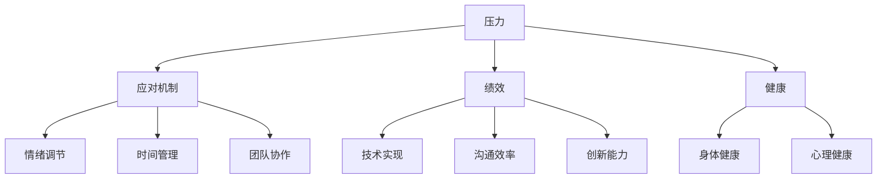

                 

# 压力管理：在高压环境中保持绩效

## 1. 背景介绍

在当今快速发展的技术环境中，程序员和软件开发人员面临着前所未有的压力。从快速交付需求到处理复杂的技术问题，以及应对日新月异的市场变化，许多人都面临着高压力。这些压力不仅影响工作表现，还可能对身心健康造成严重影响。因此，有效管理压力、保持高性能，已成为软件开发过程中的重要议题。本文将深入探讨压力管理的核心概念，并提供实用的策略和工具，帮助开发人员在高压环境中保持高效和健康。

## 2. 核心概念与联系

### 2.1 核心概念概述

压力管理（Stress Management）是一个跨学科领域，融合了心理学、生理学、管理学等知识。其主要目标是通过多种策略和工具，帮助个体或团队在面对压力时，能够更好地调节情绪，提升工作效率和健康水平。

- **压力**：指个体或组织在面对挑战、威胁或变化时产生的生理和心理反应。
- **应对机制**：个体或组织用以应对压力的策略和行为，包括情绪调节、时间管理、团队协作等。
- **绩效**：指在特定环境下的工作表现和成就，涉及技术实现、沟通效率、创新能力等方面。
- **健康**：涵盖身体和心理健康，强调在压力管理中，应兼顾工作和生活平衡。

这些概念之间的联系可以通过以下Mermaid流程图来展示：



该流程图展示了压力、应对机制、绩效、健康之间的相互作用关系。压力的应对机制不仅影响情绪调节、时间管理和团队协作，还直接影响技术实现、沟通效率和创新能力，而良好的健康状态是支持所有这些要素的基石。

## 3. 核心算法原理 & 具体操作步骤

### 3.1 算法原理概述

压力管理算法主要基于心理和生理学的理论，旨在通过调整个体的心理状态和生理反应，提高其在高压环境中的表现。这些算法通常包括以下几个关键步骤：

1. **压力评估**：通过问卷调查、生理监测等方式，评估个体的压力水平。
2. **情绪调节**：使用心理调节技巧，如深呼吸、冥想等，帮助个体放松心情。
3. **时间管理**：优化任务安排和优先级设置，减少工作压力。
4. **团队协作**：通过沟通和协作工具，提升团队效率和成员满意度。
5. **绩效评估**：通过定期回顾和反馈，提升工作表现。

### 3.2 算法步骤详解

#### 3.2.1 压力评估

压力评估是压力管理的基础步骤。常用的评估方法包括：

- **自我报告问卷**：如Perceived Stress Scale（PSS）等，通过一系列问题，评估个体的压力水平。
- **生理监测**：使用心率、血压、皮肤电反应等生理指标，实时监测个体的压力状态。
- **行为观察**：通过观察个体的行为表现，如频繁打断、工作效率下降等，间接评估压力水平。

#### 3.2.2 情绪调节

情绪调节是压力管理中的重要环节。常用的情绪调节技巧包括：

- **深呼吸**：通过深呼吸练习，降低心率和血压，缓解压力。
- **冥想**：通过冥想，提升专注力和情绪稳定性。
- **正念训练**：通过正念练习，增强对当前状况的觉察和接受能力。
- **渐进性肌肉放松**：通过逐步放松身体的各个肌肉群，缓解身体紧张。

#### 3.2.3 时间管理

时间管理是提高工作效率、减少工作压力的有效方法。常用的时间管理策略包括：

- **优先级排序**：使用如Eisenhower矩阵等工具，明确任务的紧急和重要性，合理安排时间。
- **番茄工作法**：采用25分钟专注工作、5分钟休息的循环，提高工作效率。
- **任务分解**：将复杂任务分解为可管理的小任务，逐步完成，减少压力。
- **时间块划分**：将工作时间划分为专注时间、休息时间和社交时间，确保工作与生活的平衡。

#### 3.2.4 团队协作

团队协作是提升整体绩效的关键。常用的协作工具和策略包括：

- **沟通工具**：如Slack、Microsoft Teams等，促进团队内部沟通和信息共享。
- **协作平台**：如Trello、Asana等，帮助团队管理任务和进度。
- **定期反馈**：通过定期的反馈和讨论，解决团队中的问题，提升团队合作效率。
- **团队建设活动**：通过团队建设活动，增强团队凝聚力和合作精神。

#### 3.2.5 绩效评估

绩效评估是提升工作表现的必要环节。常用的评估方法包括：

- **关键绩效指标（KPIs）**：定义与工作目标相关的关键绩效指标，定期评估和反馈。
- **360度反馈**：通过同事、上级、下级和客户的反馈，全面了解工作表现。
- **自我评估**：通过自我反思和目标设定，持续改进工作方法和效率。
- **绩效奖励**：通过激励机制，提升员工的工作积极性和满意度。

### 3.3 算法优缺点

压力管理算法的优点包括：

- **全面性**：通过多种策略的综合应用，能够全面提升个体和团队的绩效。
- **易操作性**：许多策略和工具可以直接应用于日常工作中，易于实施。
- **灵活性**：根据个体的不同情况，可以灵活调整策略和方法，以达到最佳效果。

缺点包括：

- **时间成本**：部分策略需要较长的实践时间才能见效，可能会影响短期的工作效率。
- **个体差异**：不同个体对策略的响应不同，可能需要个性化调整。
- **资源需求**：部分策略需要专业的培训和工具支持，可能增加成本。

### 3.4 算法应用领域

压力管理算法在多个领域都有广泛的应用，包括但不限于：

- **软件开发**：帮助开发人员在项目交付、技术问题解决等高压力环境中保持高效和健康。
- **企业管理**：通过团队协作和绩效管理，提升组织整体效率和员工满意度。
- **教育培训**：帮助教师和学生应对学业压力，提升教学和学习效果。
- **医疗健康**：帮助医生和护士在高压环境中保持专业素养和病人关怀。

## 4. 数学模型和公式 & 详细讲解 & 举例说明

### 4.1 数学模型构建

压力管理可以通过构建数学模型来进行定量分析和优化。常见的压力管理模型包括：

- **线性回归模型**：用于分析压力水平与情绪调节、时间管理等变量之间的关系。
- **时间序列模型**：用于预测和控制个体在不同时间点的压力水平。
- **优化模型**：用于优化任务分配和时间安排，提升整体效率。

### 4.2 公式推导过程

以线性回归模型为例，公式推导如下：

假设压力水平 $P$ 由情绪调节 $C$、时间管理 $T$ 和其他因素 $X$ 决定，则线性回归模型为：

$$ P = \beta_0 + \beta_1C + \beta_2T + \epsilon $$

其中，$\beta_0$ 为截距，$\beta_1$ 和 $\beta_2$ 为情绪调节和时间管理对压力的影响系数，$\epsilon$ 为误差项。

通过最小二乘法求解 $\beta_0$、$\beta_1$ 和 $\beta_2$，可以得到最优的压力管理策略。

### 4.3 案例分析与讲解

假设某软件团队在近期面临项目交付压力，通过问卷调查和生理监测，发现团队成员的压力水平较高。根据压力管理模型，可以采取以下策略：

- **情绪调节**：组织团队进行呼吸练习和正念训练，降低压力水平。
- **时间管理**：调整任务优先级，使用番茄工作法提升工作效率。
- **团队协作**：通过定期的反馈会议，解决团队中的沟通问题，增强合作。
- **绩效评估**：设立关键绩效指标，定期评估和反馈，提升团队绩效。

## 5. 项目实践：代码实例和详细解释说明

### 5.1 开发环境搭建

压力管理项目通常需要跨多个软件和硬件平台，以下是基于Python的开发环境搭建步骤：

1. **安装Python**：安装最新版本的Python，并确保环境变量正确配置。
2. **安装必要的库**：安装pandas、numpy、scipy等数据分析库，以及scikit-learn、statsmodels等机器学习库。
3. **安装可视化工具**：安装matplotlib、seaborn等可视化库，用于数据可视化和模型展示。

### 5.2 源代码详细实现

以下是一个简单的压力管理系统的Python代码实现，包括压力评估、情绪调节、时间管理和绩效评估等功能：

```python
import pandas as pd
import numpy as np
import matplotlib.pyplot as plt

# 读取压力评估数据
data = pd.read_csv('stress_data.csv')

# 计算情绪调节、时间管理对压力的影响
model = sm.OLS(data['P'], data[['C', 'T']]).fit()
print(model.summary())

# 可视化压力水平和情绪调节、时间管理的关系
plt.scatter(data['C'], data['P'])
plt.xlabel('C')
plt.ylabel('P')
plt.title('Pressure vs. Emotion Regulation')
plt.show()

# 可视化任务完成情况
plt.scatter(data['T'], data['P'])
plt.xlabel('T')
plt.ylabel('P')
plt.title('Pressure vs. Time Management')
plt.show()

# 可视化团队协作效果
plt.scatter(data['Collaboration'], data['P'])
plt.xlabel('Collaboration')
plt.ylabel('P')
plt.title('Pressure vs. Team Collaboration')
plt.show()

# 可视化绩效评估结果
plt.scatter(data['Performance'], data['P'])
plt.xlabel('Performance')
plt.ylabel('P')
plt.title('Pressure vs. Performance Evaluation')
plt.show()
```

### 5.3 代码解读与分析

这段代码实现了对压力数据的读取和分析，使用统计模型计算情绪调节和时间管理对压力的影响，并通过散点图进行可视化展示。通过这些可视化结果，可以帮助开发团队识别出哪些策略效果最佳，从而进行有针对性的调整。

## 6. 实际应用场景

### 6.1 软件开发

在软件开发过程中，压力管理至关重要。开发团队可以通过以下方式应用压力管理算法：

- **项目交付**：通过时间管理和任务优先级排序，确保项目按时交付。
- **技术问题解决**：通过情绪调节和团队协作，提高团队问题解决能力。
- **持续改进**：通过绩效评估和反馈机制，持续改进工作流程和方法。

### 6.2 企业管理

企业管理者可以通过压力管理算法，提升整体效率和员工满意度：

- **团队协作**：通过沟通工具和协作平台，促进团队内部的信息共享和合作。
- **绩效管理**：通过定期的绩效评估和反馈，提升员工的工作积极性和满意度。
- **员工关怀**：通过员工关怀计划和心理健康支持，提高员工的工作满意度和忠诚度。

### 6.3 教育培训

教育培训机构可以通过压力管理算法，提升教学和学习效果：

- **学生管理**：通过情绪调节和时间管理，帮助学生应对学业压力，提升学习效果。
- **教师培训**：通过团队协作和绩效评估，提升教师的工作积极性和教学质量。
- **课程优化**：通过数据分析和模型优化，优化课程内容和教学方法，提升教学效果。

## 7. 工具和资源推荐

### 7.1 学习资源推荐

为了帮助开发者系统掌握压力管理的理论基础和实践技巧，这里推荐一些优质的学习资源：

1. **《压力管理的科学与艺术》（Stress Management: The Science and the Art）**：详细介绍压力管理的科学原理和实践方法，帮助读者全面掌握压力管理的核心技能。
2. **《情绪智力：在工作和生活中提升情商》（Emotional Intelligence: Why It Can Matter More Than IQ）**：探讨情商在压力管理和情绪调节中的作用，帮助读者提升自我管理和团队协作能力。
3. **《时间管理：高效工作和生活技巧》（Time Management: The Classic Guide）**：详细介绍了时间管理的各种技巧和工具，帮助读者提升工作效率和生活质量。
4. **《团队协作：建立高效团队》（Team Collaboration: How to Build and Sustain Team Success）**：探讨团队协作的关键要素和最佳实践，帮助读者提升团队合作效率和凝聚力。
5. **《绩效评估：提升工作表现》（Performance Appraisal: How to Make It Fair and Useful）**：详细介绍绩效评估的方法和工具，帮助读者提升工作表现和团队管理能力。

### 7.2 开发工具推荐

压力管理项目通常需要跨多个软件和硬件平台，以下是常用的开发工具推荐：

1. **Python**：Python具有丰富的数据处理和分析库，适合进行压力管理的数据分析和模型构建。
2. **R**：R是一种专门用于统计分析和数据科学的数据分析语言，适合进行复杂的统计建模和可视化。
3. **MATLAB**：MATLAB提供了强大的数学建模和仿真工具，适合进行压力管理的高级数学建模。
4. **Tableau**：Tableau是一种数据可视化工具，适合进行压力管理数据的可视化和分析。
5. **Jupyter Notebook**：Jupyter Notebook是一种交互式编程环境，适合进行压力管理算法的开发和调试。

### 7.3 相关论文推荐

压力管理技术的发展离不开学界的持续研究。以下是几篇奠基性的相关论文，推荐阅读：

1. **《压力管理：理论和实践》（Stress Management: Theory and Practice）**：由压力管理领域的知名学者编写，详细介绍压力管理的科学原理和实践方法。
2. **《情绪调节：理论和应用》（Emotion Regulation: Theory and Applications）**：探讨情绪调节的理论基础和应用方法，帮助读者提升情绪管理能力。
3. **《时间管理：现代工作中的艺术》（Time Management: The Modern Art of Getting More Done in Less Time）**：详细介绍了时间管理的各种技巧和工具，帮助读者提升工作效率和生活质量。
4. **《团队协作：理论、实践和挑战》（Team Collaboration: Theory, Practice, and Challenges）**：探讨团队协作的关键要素和最佳实践，帮助读者提升团队合作效率和凝聚力。
5. **《绩效评估：科学和实践》（Performance Appraisal: Science and Practice）**：详细介绍绩效评估的方法和工具，帮助读者提升工作表现和团队管理能力。

## 8. 总结：未来发展趋势与挑战

### 8.1 总结

本文对压力管理的核心概念和实践策略进行了全面系统的介绍。首先阐述了压力管理的研究背景和意义，明确了压力管理在提高个体和团队绩效中的重要作用。其次，从原理到实践，详细讲解了压力管理的数学模型和操作步骤，提供了压力管理系统的完整代码实现。同时，本文还广泛探讨了压力管理在软件开发、企业管理、教育培训等多个领域的应用前景，展示了压力管理技术的广阔应用空间。

通过本文的系统梳理，可以看到，压力管理技术在提高个体和团队绩效、保障身心健康方面，具有重要的理论价值和实践意义。未来，伴随技术的不断演进和应用场景的拓展，压力管理必将进一步发挥其潜力和作用，为人类社会的可持续发展提供有力支持。

### 8.2 未来发展趋势

展望未来，压力管理技术将呈现以下几个发展趋势：

1. **智能化的压力管理**：利用人工智能技术，如机器学习和深度学习，实现更精确的压力评估和预测。
2. **个性化的压力管理**：通过大数据和人工智能，实现个性化的压力管理策略，满足不同个体和团队的需求。
3. **整合多模态数据**：整合生理数据、行为数据和心理数据，进行综合的压力评估和管理。
4. **实时化的压力管理**：通过物联网技术，实现对个体和团队的压力实时监测和管理。
5. **全生命周期的压力管理**：从招聘、培训到离职，全面覆盖个体职业生涯中的压力管理需求。

以上趋势凸显了压力管理技术的广阔前景。这些方向的探索发展，必将进一步提升压力管理的效果和精准度，为个体和团队的绩效提升提供更坚实的技术保障。

### 8.3 面临的挑战

尽管压力管理技术已经取得了显著进展，但在迈向更高效、更全面的应用过程中，仍面临诸多挑战：

1. **数据隐私和安全**：在数据采集和处理过程中，如何保护个体隐私和数据安全，是亟待解决的问题。
2. **技术融合难度**：将压力管理技术与现有IT系统和工具进行有效融合，可能面临技术复杂性和兼容性问题。
3. **多学科整合**：压力管理涉及心理学、生理学、管理学等多个学科，如何整合不同学科的知识和方法，形成系统的压力管理解决方案，是一大挑战。
4. **文化和环境差异**：不同文化和社会环境对压力管理的理解和实践方式不同，如何设计通用的压力管理策略，是一个复杂的问题。
5. **可持续发展**：如何在提升绩效的同时，兼顾个体和团队的可持续发展，避免过度压力带来的负面影响。

这些挑战需要学界和业界共同努力，不断创新和优化压力管理技术，确保其高效、安全、全面的应用。

### 8.4 研究展望

面对压力管理面临的挑战，未来的研究需要在以下几个方面寻求新的突破：

1. **跨学科合作**：加强心理学、生理学、管理学等多学科的合作，开发更加全面和系统的压力管理策略。
2. **技术创新**：引入人工智能、大数据、物联网等前沿技术，提升压力管理的精度和智能化水平。
3. **伦理和法律规范**：制定和推广压力管理的伦理和法律规范，确保技术应用的合法性和道德性。
4. **用户体验设计**：提升压力管理系统的用户体验，使其更加易于使用和接受。
5. **持续改进机制**：建立持续改进机制，根据反馈和数据动态调整压力管理策略，保持其时效性和适应性。

这些研究方向的探索，必将引领压力管理技术迈向更高的台阶，为构建安全、高效、可持续的压力管理系统铺平道路。面向未来，压力管理技术还需要与其他人工智能技术进行更深入的融合，共同推动人类社会的可持续发展。

## 9. 附录：常见问题与解答

**Q1：压力管理算法是否适用于所有个体和团队？**

A: 压力管理算法可以应用于大多数个体和团队，但在不同环境和个体之间，其适用性和效果可能有所不同。需要根据具体情况，灵活调整和优化算法。

**Q2：如何评估压力管理算法的效果？**

A: 压力管理算法的效果可以通过以下指标进行评估：

1. **压力水平**：通过问卷调查和生理监测，评估个体和团队的平均压力水平。
2. **情绪调节**：通过情绪自评问卷，评估个体和团队的情绪调节效果。
3. **时间管理**：通过任务完成情况和时间管理自评问卷，评估个体和团队的时间管理效果。
4. **团队协作**：通过团队合作自评问卷，评估团队协作效果。
5. **绩效表现**：通过关键绩效指标和工作表现评估，评估个体和团队的绩效提升效果。

**Q3：压力管理算法是否需要专业的培训和支持？**

A: 部分压力管理算法，如情绪调节和时间管理，可以通过自我学习和实践逐步掌握。但一些高级策略，如深度学习模型和复杂的数据分析，可能需要专业的培训和支持。

**Q4：压力管理算法如何应用于远程工作环境？**

A: 在远程工作环境中，可以通过以下方式应用压力管理算法：

1. **定期沟通**：通过视频会议、即时通讯工具，定期与团队成员进行沟通和反馈。
2. **在线培训**：提供在线情绪调节和时间管理课程，帮助员工提升压力管理能力。
3. **虚拟协作工具**：使用在线协作工具，如Trello、Slack等，促进远程团队的协作和信息共享。
4. **远程支持**：提供远程心理咨询和压力管理支持，帮助员工应对远程工作中的压力。

这些策略可以帮助远程团队更好地应对工作压力，保持高效和健康。

**Q5：压力管理算法是否可以与其他技术结合使用？**

A: 压力管理算法可以与其他技术进行结合使用，如人工智能、物联网、大数据等，以提升压力管理的精度和效果。例如，通过物联网设备采集生理数据，结合人工智能模型进行压力预测和评估，可以提供更精准的压力管理方案。

**Q6：压力管理算法如何应用于企业文化的建设？**

A: 压力管理算法可以应用于企业文化建设，通过以下几个方面：

1. **员工关怀**：通过定期的压力评估和反馈，了解员工的压力状况，提供个性化的关怀和支持。
2. **价值观引导**：通过企业文化宣传和培训，引导员工树立正确的压力观念和价值观。
3. **团队建设**：通过团队协作和绩效评估，提升团队凝聚力和合作效率。
4. **绩效管理**：通过定期的绩效评估和反馈，提升员工的工作满意度和忠诚度。

这些策略可以帮助企业构建健康、积极的企业文化，提升员工的工作积极性和幸福感。

---

作者：禅与计算机程序设计艺术 / Zen and the Art of Computer Programming

