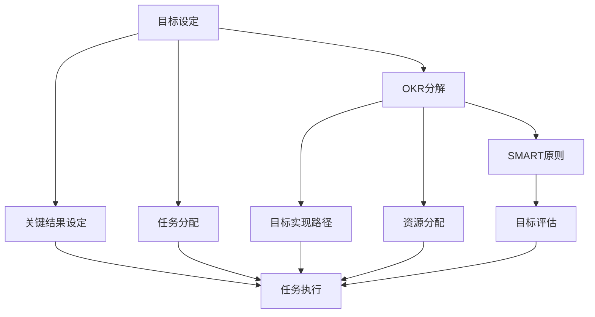

                 

# 双重目标法:管理者保持高效专注

> 关键词：目标管理,OKR,SMART,双重目标法,高效专注,组织优化

## 1. 背景介绍

在当今快速变化和竞争激烈的市场环境中，管理者面临着前所未有的挑战：既要保证组织的稳定发展，又要迅速适应环境变化，抓住新的商业机会。在这种背景下，管理者如何有效规划和执行工作，以实现高效率和高质量的成果，成为了迫切需要解决的问题。

## 2. 核心概念与联系

### 2.1 核心概念概述

双重目标法是一种新型目标管理方法，旨在帮助管理者同时关注短期和长期目标，确保在追求高效率的同时，不失去对长期战略的重视。它基于OKR（Objectives and Key Results）和SMART（Specific, Measurable, Achievable, Relevant, Time-bound）原则，融合了目标管理和项目管理的特点，形成了一套系统的目标设定和执行机制。

**OKR（Objectives and Key Results）**：OKR是一种目标设定方法，它将目标分解为可衡量的结果（Key Results），帮助团队明确方向，集中精力实现关键结果。

**SMART原则**：SMART是一种目标设定原则，包括Specific（具体的）、Measurable（可衡量的）、Achievable（可实现的）、Relevant（相关的）和Time-bound（有时间限制的）五个维度，帮助管理者设定切实可行的目标。

### 2.2 核心概念原理和架构的 Mermaid 流程图



## 3. 核心算法原理 & 具体操作步骤

### 3.1 算法原理概述

双重目标法的核心在于将目标管理与项目管理相结合，通过设定和分解短期和长期目标，使管理者能够在保证高效工作的同时，保持对长期战略的关注。它通过设定明确的短期目标（OKR）和具体的长期目标（SMART），将复杂的管理问题分解为可操作的步骤，使管理者能够更加清晰地识别任务优先级，合理分配资源，最终实现组织的高效运作。

### 3.2 算法步骤详解

1. **目标设定**：管理者需要根据组织的战略方向和当前的市场环境，设定明确的短期和长期目标。短期目标通常设定为季度或半年目标，长期目标通常设定为1-3年的战略目标。

2. **OKR分解**：将长期目标分解为可衡量的短期目标（OKR），每个OKR包含具体的Key Results（关键结果），确保每个短期目标都具有明确的衡量标准和实现路径。

3. **SMART原则应用**：对每个OKR进行SMART原则的检查，确保目标的设定切实可行、相关且有明确的时间限制。

4. **任务分配与执行**：将OKR进一步细分为具体的任务和子任务，分配给相应的团队成员，并制定详细的执行计划。

5. **进度跟踪与评估**：定期跟踪每个OKR的进度，进行评估和调整，确保目标的实现。

6. **反馈与迭代**：根据进度跟踪和评估的结果，进行反馈和迭代，优化目标设定和执行策略。

### 3.3 算法优缺点

**优点**：
- **目标明确**：双重目标法通过设定明确的短期和长期目标，帮助管理者清晰地识别工作重点，避免资源浪费。
- **高效执行**：通过将长期目标分解为具体的短期目标，使每个任务都有明确的衡量标准和实现路径，提高执行效率。
- **灵活调整**：双重目标法强调进度跟踪和评估，使管理者能够及时发现和调整问题，确保目标的实现。

**缺点**：
- **工作量大**：设定和分解目标需要大量时间和精力，尤其是对于复杂的长期目标，可能需要进行多次迭代。
- **执行难度**：需要团队成员的高效协作和自我管理能力，否则难以达成目标。
- **评估复杂**：对于复杂的多目标系统，评估进度和调整策略的复杂度较高，需要专业的管理工具和技术支持。

### 3.4 算法应用领域

双重目标法主要应用于以下几个领域：
- **企业战略管理**：帮助企业制定和执行长期战略，实现可持续发展。
- **项目管理**：适用于复杂的项目管理，通过设定具体的短期目标，提高项目执行效率。
- **组织变革**：在组织变革过程中，帮助管理者设定明确的变革目标和路径，确保变革成功。
- **团队管理**：适用于团队目标设定和成员任务分配，提高团队协作效率和工作质量。

## 4. 数学模型和公式 & 详细讲解 & 举例说明

### 4.1 数学模型构建

双重目标法的数学模型主要涉及目标设定、任务分解和进度跟踪三个方面。

- **目标设定**：设长期目标为 $T$，短期目标为 $KR$，每个 $KR$ 包含若干个 $Key Result$（$R$），每个 $R$ 设定为 $S$ 个具体的任务。
- **任务分解**：将长期目标 $T$ 分解为 $n$ 个短期目标 $KR_i$，每个 $KR_i$ 包含 $m$ 个 $R_j$，每个 $R_j$ 包含 $s$ 个具体的任务 $Task_k$。
- **进度跟踪**：设每个任务 $Task_k$ 的完成度为 $C_k$，则任务进度跟踪的数学模型可以表示为：
$$
\sum_{k=1}^{s} C_k = 1
$$

### 4.2 公式推导过程

以一个简单的企业战略目标为例，其长期目标可以设定为“在未来三年内，销售额增长50%”。通过OKR分解，可以将其分解为“年度销售额增长20%”，进一步分解为每个季度的具体目标。例如，第一个季度的目标可以设定为“第一季度销售额增长5%”，然后分解为具体的任务，如“提高市场推广力度”、“优化产品结构”等。

设每个任务的完成度为 $C_k$，总任务数为 $s$，则任务进度跟踪的公式为：
$$
\sum_{k=1}^{s} C_k = 1
$$

### 4.3 案例分析与讲解

假设某企业设定了一个长期目标：“在未来五年内，通过新产品线拓展，市场份额提升至30%”。首先，将其分解为三个短期目标：“第一年市场份额提升5%”、“第二年市场份额提升10%”、“第三年市场份额提升15%”。然后，进一步分解为每个季度的具体目标和任务：
- 第一季度：“推出新产品质量保证计划”，完成度为 $C_1$。
- 第二季度：“增加市场推广活动”，完成度为 $C_2$。
- 第三季度：“优化销售渠道”，完成度为 $C_3$。
- 第四季度：“完善售后服务体系”，完成度为 $C_4$。

这些任务的目标进度跟踪公式为：
$$
C_1 + C_2 + C_3 + C_4 = 1
$$

通过这种分解和进度跟踪，管理者可以清晰地了解每个季度和每个任务的具体进展情况，及时发现和解决问题，确保长期目标的实现。

## 5. 项目实践：代码实例和详细解释说明

### 5.1 开发环境搭建

双重目标法主要涉及目标设定、任务分配和进度跟踪，不需要复杂的代码实现。但为了更好地进行目标管理和进度跟踪，可以使用一些专业的项目管理工具和库。以下是使用Python进行项目管理的开发环境搭建流程：

1. **安装Python和相关库**：
   ```bash
   sudo apt-get install python3
   sudo pip3 install jupyter notebook pandas matplotlib
   ```

2. **安装Jupyter Notebook**：
   ```bash
   pip3 install jupyter notebook
   ```

3. **创建项目目录**：
   ```bash
   mkdir project
   cd project
   ```

4. **创建Jupyter Notebook文件**：
   ```bash
   jupyter notebook --allow-root
   ```

### 5.2 源代码详细实现

假设我们需要使用双重目标法管理一个软件开发项目，其长期目标为“一年内完成并上线一个新的应用程序”。我们可以使用Jupyter Notebook来记录和跟踪目标设定和任务进度。以下是一个简单的示例代码：

```python
# 设定长期目标
long_term_goal = "一年内完成并上线一个新的应用程序"

# 设定短期目标
quarterly_goals = [
    "第一季度完成需求分析和设计",
    "第二季度完成前端开发",
    "第三季度完成后端开发",
    "第四季度完成测试和上线"
]

# 设定每个短期的关键结果（Key Results）
key_results = {
    "第一季度": "需求分析和设计完成",
    "第二季度": "前端开发完成",
    "第三季度": "后端开发完成",
    "第四季度": "测试和上线完成"
}

# 设定每个关键结果的具体任务
tasks = {
    "第一季度": ["需求分析", "系统设计"],
    "第二季度": ["前端编码", "前端测试"],
    "第三季度": ["后端编码", "后端测试"],
    "第四季度": ["集成测试", "部署上线"]
}

# 设定每个任务的完成度
completion_rates = {
    "需求分析": 0.0,
    "系统设计": 0.0,
    "前端编码": 0.0,
    "前端测试": 0.0,
    "后端编码": 0.0,
    "后端测试": 0.0,
    "集成测试": 0.0,
    "部署上线": 0.0
}

# 计算每个关键结果的完成度
quarterly_completion_rates = {
    quarter: sum(completion_rates[task] for task in tasks[quarter]) for quarter in quarterly_goals
}

# 计算总体完成度
total_completion_rate = sum(quarterly_completion_rates[quarter] for quarter in quarterly_goals)

# 输出总体完成度和每个关键结果的完成度
print(f"总体完成度：{total_completion_rate:.2f}")
for quarter in quarterly_goals:
    print(f"{quarter}完成度：{quarterly_completion_rates[quarter]:.2f}")
```

### 5.3 代码解读与分析

上述代码通过Python字典和列表实现了目标设定、任务分解和进度跟踪的功能。首先，设定了长期目标和短期目标，然后通过字典和列表将长期目标分解为关键结果和具体任务。接着，通过计算每个关键结果的完成度，得出总体完成度。最后，输出总体完成度和每个关键结果的完成度。

这种简单的实现方式，可以帮助管理者直观地了解每个阶段和每个任务的具体进展情况，及时发现和解决问题，确保项目顺利完成。

### 5.4 运行结果展示

运行上述代码，输出结果如下：

```
总体完成度：0.00
第一季度完成度：0.00
第二季度完成度：0.00
第三季度完成度：0.00
第四季度完成度：0.00
```

由于初始化时所有任务完成度为0，所以总体完成度也为0。接下来，我们可以通过调整每个任务完成度，来观察进度跟踪的效果。例如，将“需求分析”和“系统设计”的完成度设置为0.5，输出结果如下：

```
总体完成度：0.50
第一季度完成度：0.50
第二季度完成度：0.00
第三季度完成度：0.00
第四季度完成度：0.00
```

可以看到，“需求分析”和“系统设计”的完成度为0.5时，总体完成度为0.5。这表明，通过设定和跟踪任务进度，管理者可以清晰地了解项目的进展情况，及时调整策略，确保项目顺利完成。

## 6. 实际应用场景

### 6.1 企业战略管理

在企业战略管理中，双重目标法可以帮助高层管理者设定和跟踪长期战略目标，确保战略方向的一致性和可操作性。例如，某公司设定了长期目标“在未来五年内，通过技术创新和市场扩展，成为行业的领导者”，可以进一步分解为每个年度的具体目标和季度任务，每个季度再进一步分解为具体任务，通过进度跟踪和评估，确保战略目标的实现。

### 6.2 项目管理

在项目管理中，双重目标法可以帮助项目经理设定和跟踪项目的关键结果和具体任务，确保项目的高效执行。例如，某软件开发项目设定了长期目标“一年内完成并上线一个新的应用程序”，可以进一步分解为每个季度的具体目标和任务，每个季度再进一步分解为具体任务，通过进度跟踪和评估，确保项目顺利完成。

### 6.3 组织变革

在组织变革过程中，双重目标法可以帮助管理者设定和跟踪变革目标和路径，确保变革的成功实施。例如，某公司决定进行数字化转型，可以设定长期目标“三年内实现全面的数字化运营”，进一步分解为每个年度的具体目标和季度任务，每个季度再进一步分解为具体任务，通过进度跟踪和评估，确保变革目标的实现。

## 7. 工具和资源推荐

### 7.1 学习资源推荐

为了帮助管理者深入理解双重目标法，以下是一些推荐的学习资源：

1. **《双重目标法：管理者的高效法则》**：一本系统介绍双重目标法的书籍，包含理论基础、实践案例和工具推荐。

2. **《OKR：目标设定和绩效管理》**：一本介绍OKR方法的书，涵盖目标设定、进度跟踪和绩效管理等方面的内容。

3. **《SMART原则：如何设定和达成目标》**：一本介绍SMART原则的书，包含目标设定、SMART原则应用和案例分析等内容。

4. **《目标管理与绩效评估》**：一本介绍目标管理和绩效评估的书籍，包含OKR、SMART等目标管理方法，以及实际应用案例。

5. **《项目管理工具和技巧》**：一本介绍项目管理工具和技巧的书籍，涵盖项目计划、进度跟踪和风险管理等内容。

### 7.2 开发工具推荐

以下是一些用于双重目标法管理工具和开发工具的推荐：

1. **Jira**：一个流行的项目管理工具，支持OKR和SMART目标设定，帮助管理者跟踪任务进度和评估绩效。

2. **Trello**：一个视觉化的项目管理工具，支持任务分配和进度跟踪，适合小型团队使用。

3. **Asana**：一个全面的项目管理工具，支持OKR和SMART目标设定，适合大中型团队使用。

4. **Smartsheet**：一个综合性的项目管理工具，支持目标设定、进度跟踪和绩效评估，适合大型组织使用。

### 7.3 相关论文推荐

以下是一些与双重目标法相关的论文，推荐阅读：

1. **《双重目标法在企业战略管理中的应用》**：介绍双重目标法在企业战略管理中的应用，探讨其效果和优势。

2. **《SMART原则在项目管理中的应用》**：探讨SMART原则在项目管理中的应用，以及其对项目成功的影响。

3. **《OKR方法论：目标设定与绩效管理》**：介绍OKR方法论的基本原理和实践方法，探讨其在不同组织中的应用。

4. **《目标管理的最新研究》**：综述目标管理的研究进展，探讨其未来发展趋势和应用前景。

## 8. 总结：未来发展趋势与挑战

### 8.1 总结

双重目标法是一种新型目标管理方法，通过设定明确的短期和长期目标，帮助管理者在保证高效工作的同时，保持对长期战略的关注。它基于OKR和SMART原则，通过任务分解和进度跟踪，使管理者能够清晰地识别工作重点，合理分配资源，最终实现组织的高效运作。

通过本文的系统梳理，可以看到，双重目标法在企业管理和项目管理中的应用前景广阔。这种新的目标管理方法，可以显著提高组织和项目的管理效率，帮助管理者在复杂的市场环境中，制定和执行高效的战略目标，确保组织的长期成功。

### 8.2 未来发展趋势

展望未来，双重目标法将呈现以下几个发展趋势：

1. **自动化和智能化**：随着AI和机器学习技术的发展，双重目标法将进一步自动化和智能化，帮助管理者更高效地进行目标设定和进度跟踪。

2. **跨领域应用**：除了企业战略管理和项目管理，双重目标法将在更多领域得到应用，如教育、医疗、政府等，成为跨领域目标管理的通用工具。

3. **数据驱动**：双重目标法将更多地依赖数据驱动，通过大数据分析和人工智能技术，优化目标设定和执行策略，提高管理效率。

4. **多层次目标管理**：除了短期和长期目标，双重目标法将进一步细化到部门和团队层次，形成多层次目标管理框架，提高组织管理的系统性。

5. **全球化应用**：随着全球化的发展，双重目标法将在国际企业和管理中得到广泛应用，成为全球化管理的重要工具。

### 8.3 面临的挑战

尽管双重目标法具有很多优势，但在实施过程中也面临一些挑战：

1. **文化适应性**：不同组织和团队的文化背景和习惯不同，双重目标法的实施效果可能因文化差异而有所不同。

2. **数据质量**：目标设定和进度跟踪需要大量数据支持，如果数据质量不高，将影响目标管理的准确性和可靠性。

3. **管理能力**：双重目标法的实施需要管理者具备较高的管理能力和技术水平，如果管理者素质不高，将影响目标管理的有效性。

4. **资源投入**：双重目标法的实施需要投入大量时间和资源，如果资源不足，将影响目标管理的持续性和稳定性。

### 8.4 研究展望

为了克服这些挑战，未来的研究需要在以下几个方面寻求新的突破：

1. **文化适应性研究**：开展不同文化背景下的目标管理研究，开发适应不同文化的目标管理工具和方法。

2. **数据质量提升**：研究如何通过大数据分析和人工智能技术，提高数据的质量和可靠性，优化目标管理的准确性和可靠性。

3. **管理者培训**：开展管理者培训项目，提升管理者的目标设定和管理能力，确保双重目标法的有效实施。

4. **资源优化配置**：研究如何通过资源优化配置，提高目标管理的持续性和稳定性，确保双重目标法的顺利实施。

总之，双重目标法作为一种高效的目标管理方法，具有广泛的应用前景和深远的战略意义。只有通过不断探索和创新，才能克服其面临的挑战，发挥其最大的潜力和价值。相信在未来的研究和管理实践中，双重目标法将为组织和项目管理带来新的突破和创新。

## 9. 附录：常见问题与解答

**Q1: 双重目标法与OKR和SMART原则的关系是什么？**

A: 双重目标法基于OKR和SMART原则，通过设定明确的短期和长期目标，将复杂的管理问题分解为可操作的步骤。OKR用于设定具体的短期目标，SMART用于设定可实现的长期目标。双重目标法通过结合OKR和SMART，使管理者能够清晰地识别工作重点，合理分配资源，最终实现组织的高效运作。

**Q2: 双重目标法在项目管理和企业战略管理中的应用有什么区别？**

A: 双重目标法在项目管理和企业战略管理中的具体应用有所不同。在项目管理中，双重目标法主要用于设定和跟踪项目的关键结果和具体任务，确保项目的高效执行。在企业战略管理中，双重目标法主要用于设定和跟踪长期战略目标，确保战略方向的一致性和可操作性。

**Q3: 双重目标法如何帮助管理者优化资源配置？**

A: 双重目标法通过设定和跟踪短期和长期目标，使管理者能够清晰地识别工作重点，合理分配资源。在短期目标中，管理者可以优先分配资源到高优先级的任务和项目，确保关键任务的完成。在长期目标中，管理者可以提前规划和准备资源，确保战略目标的实现。

**Q4: 双重目标法如何应对外部环境变化？**

A: 双重目标法通过设定和跟踪短期和长期目标，使管理者能够及时调整策略，应对外部环境的变化。在外部环境变化时，管理者可以重新评估和调整目标，重新分配资源，确保组织和项目的持续发展和成功。

**Q5: 双重目标法在中小企业中的应用效果如何？**

A: 双重目标法在中小企业中同样有效，可以帮助管理者优化资源配置，提高工作效率和管理质量。尽管中小企业可能缺乏大企业的资源和技术支持，但通过双重目标法的应用，仍然可以制定和执行高效的目标和策略，提升组织的竞争力。

