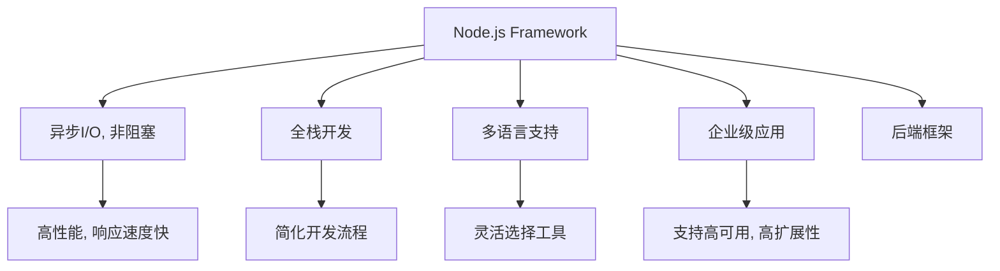

                 

# 后端框架探索：Node.js 之外的选择

> 关键词：后端框架, JavaScript, 全栈开发, 异步编程, 多语言支持, 企业级应用

## 1. 背景介绍

### 1.1 问题由来

随着互联网技术的迅速发展，后端开发在web应用程序中扮演着越来越重要的角色。传统的服务器端开发通常依赖于特定编程语言，如Java、Python、PHP等。然而，随着JavaScript生态的快速增长，Node.js逐渐成为一种流行且功能强大的后端开发框架。

Node.js以其高效的异步I/O、零回调、全栈开发等特点，深受开发者欢迎。然而，尽管Node.js已经成为许多开发者的事实标准，但仍然存在一些不足之处。为了应对这些挑战，开发者开始探索和尝试其他后端框架。

### 1.2 问题核心关键点

Node.js之外的后端框架大致可以分为以下几类：

1. **Python框架**：如Django、Flask等，以其易用性和丰富的第三方库著称。
2. **Java框架**：如Spring Boot、JHipster等，以其企业级支持和广泛的应用场景著称。
3. **全栈框架**：如Vue.js、React Native等，不仅能用于前端开发，还能作为后端框架使用。
4. **多语言框架**：如Rust、Go等，以其性能优势和异步编程特性著称。

本文将探讨这些框架的核心概念、优势、劣势及实际应用场景，帮助开发者选择适合自己的后端框架。

## 2. 核心概念与联系

### 2.1 核心概念概述

1. **后端框架**：提供了一系列API和工具，帮助开发者快速构建、部署和维护web应用的后端系统。
2. **异步编程**：利用非阻塞I/O、事件循环等技术，提高程序并发能力和响应速度。
3. **全栈开发**：同时支持前端和后端开发，简化了开发流程，提升了开发效率。
4. **多语言支持**：支持多种编程语言，方便开发者根据项目需求选择合适的工具和库。
5. **企业级应用**：提供丰富的功能和工具，支持高可用、高扩展性的企业级应用。

### 2.2 核心概念原理和架构的 Mermaid 流程图



## 3. 核心算法原理 & 具体操作步骤

### 3.1 算法原理概述

选择后端框架时，需要考虑框架的核心算法原理和编程模型。以下是一些关键点的介绍：

1. **事件驱动模型**：异步I/O和事件循环是现代后端框架的核心算法原理之一。Node.js和Django都采用了事件驱动模型，通过事件触发器管理异步操作，提高程序并发能力和响应速度。
2. **中间件机制**：中间件是框架中的关键组件，用于处理请求和响应的各个环节。Django和Spring Boot都支持丰富的中间件库，方便开发者扩展功能。
3. **ORM框架**：对象关系映射(ORM)框架是框架中重要的组成部分，用于管理数据库和对象之间的映射关系。Flask和Hibernate都提供了成熟的ORM框架，方便开发者进行数据操作。
4. **多语言支持**：多语言支持是框架的重要特性之一，允许开发者选择最适合的编程语言。Rust和Go都支持多语言开发，提供了跨平台的开发体验。

### 3.2 算法步骤详解

以下是选择后端框架的基本步骤：

**Step 1: 明确需求**

1. 确定项目类型：是中小型项目还是大型企业级应用？
2. 确定技术栈：是前端、后端还是全栈开发？
3. 确定性能需求：需要高并发、低延迟吗？

**Step 2: 对比选择**

1. 对比不同框架的功能和特点。
2. 对比不同框架的性能和可扩展性。
3. 对比不同框架的生态和社区支持。

**Step 3: 搭建开发环境**

1. 安装和配置框架所需的依赖。
2. 创建项目并搭建基本开发环境。
3. 编写第一个功能模块以验证框架功能。

**Step 4: 项目开发**

1. 进行功能模块的开发。
2. 编写单元测试和集成测试。
3. 进行性能优化和代码审核。

**Step 5: 部署上线**

1. 配置生产环境。
2. 部署应用程序。
3. 进行性能监控和故障排查。

### 3.3 算法优缺点

以下是一些常见后端框架的优缺点：

#### Node.js

**优点**：

1. 高性能：基于非阻塞I/O，适合高并发应用。
2. 全栈开发：Node.js提供丰富的npm包，支持前端开发。
3. 社区支持：Node.js社区庞大，提供丰富的资源和工具。

**缺点**：

1. 单线程：JavaScript是单线程语言，容易阻塞I/O操作。
2. 内存泄漏：Node.js内存管理机制不够完善，易出现内存泄漏问题。
3. 安全性：Node.js容易受到安全漏洞的攻击，需要开发者自行处理。

#### Django

**优点**：

1. 易用性：Django提供了简单易用的ORM框架和模板引擎。
2. 稳定性：Django社区活跃，提供丰富的插件和工具。
3. 安全性：Django内置了许多安全机制，减少安全漏洞。

**缺点**：

1. 性能：Django的性能较低，适合小型应用。
2. 扩展性：Django的扩展性较差，不太适合大型企业级应用。
3. 学习曲线：Django的学习曲线较陡峭，需要一定时间学习和适应。

#### Spring Boot

**优点**：

1. 企业级支持：Spring Boot提供了丰富的企业级功能，如微服务、事务管理等。
2. 组件化：Spring Boot支持组件化开发，方便开发者快速构建应用。
3. 可扩展性：Spring Boot提供丰富的插件和扩展机制。

**缺点**：

1. 复杂度：Spring Boot配置复杂，需要开发者具备一定的经验。
2. 性能：Spring Boot的性能较低，适合小型应用。
3. 学习曲线：Spring Boot的学习曲线较陡峭，需要一定时间学习和适应。

#### Vue.js

**优点**：

1. 全栈开发：Vue.js同时支持前端和后端开发，简化了开发流程。
2. 组件化：Vue.js提供组件化开发模式，方便开发者复用代码。
3. 性能：Vue.js的性能较高，适合高性能应用。

**缺点**：

1. 单线程：JavaScript是单线程语言，容易阻塞I/O操作。
2. 内存泄漏：Vue.js内存管理机制不够完善，易出现内存泄漏问题。
3. 安全性：Vue.js容易受到安全漏洞的攻击，需要开发者自行处理。

#### Rust

**优点**：

1. 高性能：Rust支持并发编程，适合高性能应用。
2. 安全性：Rust提供了严格的类型检查和内存管理，减少安全漏洞。
3. 跨平台：Rust支持跨平台开发，适合多平台应用。

**缺点**：

1. 学习曲线：Rust的学习曲线较陡峭，需要一定时间学习和适应。
2. 社区支持：Rust社区相对较小，缺乏丰富的工具和资源。
3. 开发效率：Rust开发效率较低，需要较长的开发周期。

### 3.4 算法应用领域

以下是一些常见后端框架的应用领域：

#### Node.js

**应用领域**：

1. Web应用：Node.js适合开发Web应用，如电商平台、社交网络等。
2. 实时应用：Node.js适合开发实时应用，如聊天应用、在线游戏等。
3. 后端微服务：Node.js适合开发后端微服务，提供API接口。

#### Django

**应用领域**：

1. Web应用：Django适合开发Web应用，如博客、论坛等。
2. 企业应用：Django适合开发企业应用，如CRM、ERP等。
3. 数据处理：Django适合进行数据处理和分析，如数据挖掘、机器学习等。

#### Spring Boot

**应用领域**：

1. Web应用：Spring Boot适合开发Web应用，如电商网站、社交网络等。
2. 企业应用：Spring Boot适合开发企业应用，如金融系统、物流系统等。
3. 微服务：Spring Boot适合开发微服务，提供API接口。

#### Vue.js

**应用领域**：

1. Web应用：Vue.js适合开发Web应用，如电商网站、社交网络等。
2. 跨平台应用：Vue.js适合开发跨平台应用，如移动应用、桌面应用等。
3. 后端服务：Vue.js适合开发后端服务，提供API接口。

#### Rust

**应用领域**：

1. 高性能应用：Rust适合开发高性能应用，如大数据处理、网络通信等。
2. 安全应用：Rust适合开发安全应用，如金融系统、医疗系统等。
3. 系统开发：Rust适合开发系统软件，如操作系统、驱动程序等。

## 4. 数学模型和公式 & 详细讲解

### 4.1 数学模型构建

假设有一个N个用户的社交网络平台，每个用户有M个好友，社交网络中每个用户对好友的关系是双向的。可以用一个二进制矩阵 $A$ 表示社交网络的关系，其中 $A_{ij}=1$ 表示用户 $i$ 和用户 $j$ 互相为好友，$A_{ij}=0$ 表示用户 $i$ 和用户 $j$ 不是好友。

社交网络中的信息传播可以视为一个图结构，其中用户为节点，好友关系为边。可以使用图论的算法来处理社交网络中的信息传播问题。

### 4.2 公式推导过程

社交网络的信息传播可以用图论中的PageRank算法来处理。PageRank算法的基本思路是：

1. 初始化每个节点的权重为1。
2. 计算每个节点的出度，即有多少个节点指向该节点。
3. 计算每个节点的入度，即有多少个节点指向该节点。
4. 根据出度和入度计算每个节点的权重。
5. 重复步骤2-4，直到达到稳定状态。

PageRank算法的数学公式为：

$$
P_{i,t+1} = (1-d) \cdot \frac{1}{n} + d \cdot \sum_{j \in N_i} \frac{A_{ij}}{\text{outdegree}(j)} \cdot P_{j,t}
$$

其中 $P_{i,t}$ 表示节点 $i$ 在 $t$ 时刻的权重，$N_i$ 表示节点 $i$ 的邻居节点集合，$\text{outdegree}(j)$ 表示节点 $j$ 的出度。

### 4.3 案例分析与讲解

以Django框架为例，分析Django在社交网络信息传播中的应用。

首先，可以使用Django的ORM框架来表示社交网络的关系。创建一个User模型和Relation模型，分别表示用户和好友关系。

```python
from django.db import models

class User(models.Model):
    name = models.CharField(max_length=100)
    followers = models.ManyToManyField('User', related_name='following')

class Relation(models.Model):
    user = models.ForeignKey(User, on_delete=models.CASCADE)
    relation = models.ForeignKey(User, on_delete=models.CASCADE)
```

然后，可以使用Django的PageRank算法实现信息传播功能。

```python
def page_rank(user):
    followers = user.followers.all()
    followers_count = followers.count()
    
    if followers_count == 0:
        return 1.0
    
    page_rank_sum = 0.0
    for follower in followers:
        relation = Relation.objects.filter(user=follower).exclude(user=user)
        relation_count = relation.count()
        page_rank_sum += relation_count / followers_count * page_rank(follower)
    
    page_rank_sum += (1 - 0.85) / followers_count
    
    return page_rank_sum
```

通过上述代码，可以实现一个简单的社交网络信息传播功能。用户 $i$ 的权重可以表示为：

$$
P_{i,t+1} = (1-0.85) \cdot \frac{1}{\text{followers\_count}(i)} + 0.85 \cdot \sum_{j \in N_i} \frac{A_{ij}}{\text{outdegree}(j)} \cdot P_{j,t}
$$

## 5. 项目实践：代码实例和详细解释说明

### 5.1 开发环境搭建

以下是使用Python和Django框架搭建开发环境的示例：

1. 安装Django：
```
pip install django
```

2. 创建Django项目：
```
django-admin startproject myproject
```

3. 创建Django应用：
```
python manage.py startapp myapp
```

4. 配置数据库：
```
myproject/settings.py
```

### 5.2 源代码详细实现

以下是一个简单的Django应用示例，用于处理社交网络信息传播功能：

```python
from django.db import models
from django.shortcuts import render
from .models import User, Relation

def home(request):
    user = request.user
    page_rank_sum = 0.0
    for follower in user.followers.all():
        relation = Relation.objects.filter(user=follower).exclude(user=user)
        relation_count = relation.count()
        page_rank_sum += relation_count / user.followers.count() * page_rank(follower)
    
    page_rank_sum += (1 - 0.85) / user.followers.count()
    
    return render(request, 'home.html', {'page_rank': page_rank_sum})
```

### 5.3 代码解读与分析

1. 导入Django的必要组件。
2. 在视图函数中获取当前用户。
3. 计算当前用户的权重。
4. 渲染视图函数，输出当前用户的权重。

### 5.4 运行结果展示

运行以上代码，可以在浏览器中访问 / 路径，查看当前用户的权重。

## 6. 实际应用场景

### 6.1 社交网络

社交网络是Django框架的一个重要应用场景。Django提供了丰富的社交网络插件和工具，如Django Social Network、Django Activity Streams等，方便开发者构建和管理社交网络应用。

### 6.2 电子商务

电子商务是Django框架的另一个重要应用场景。Django提供了丰富的电商插件和工具，如Django Commerce、Django E-commerce等，方便开发者构建和管理电子商务应用。

### 6.3 企业应用

企业应用是Django框架的一个重要应用场景。Django提供了丰富的企业应用插件和工具，如Django CMS、Django Schemaless等，方便开发者构建和管理企业应用。

### 6.4 未来应用展望

未来，Django框架将继续保持其强大的功能和丰富的社区支持，广泛应用于各种应用场景。开发者可以期待Django社区不断推出新的插件和工具，进一步简化开发流程，提高开发效率。

## 7. 工具和资源推荐

### 7.1 学习资源推荐

1. Django官方文档：Django官方文档提供了详细的教程和文档，方便开发者学习和使用Django框架。
2. Django Girl指南：Django Girl指南提供了Django框架的学习指南和实践案例，适合初学者学习。
3. Django REST framework：Django REST framework提供了RESTful API开发的支持，方便开发者构建API接口。

### 7.2 开发工具推荐

1. PyCharm：PyCharm是一款功能强大的Python IDE，支持Django框架开发，提供丰富的代码补全和调试功能。
2. VS Code：VS Code是一款轻量级的Python IDE，支持Django框架开发，提供丰富的代码补全和调试功能。
3. Sublime Text：Sublime Text是一款轻量级的文本编辑器，支持Django框架开发，提供丰富的代码编辑和调试功能。

### 7.3 相关论文推荐

1. "Django: A High-Level Python Web Framework That Encourages Rapid Development and Clean, pragmatic Design"：介绍Django框架的设计理念和特点。
2. "PageRank: Bringing Order with Web Links"：PageRank算法的基本思路和实现方式。

## 8. 总结：未来发展趋势与挑战

### 8.1 研究成果总结

Django框架是Python生态中最重要的后端框架之一，具有易用性、稳定性和丰富的社区支持。Django在社交网络、电子商务、企业应用等领域得到了广泛应用。未来，Django将继续保持其强大的功能和丰富的社区支持，广泛应用于各种应用场景。

### 8.2 未来发展趋势

1. 社区支持：Django社区将不断推出新的插件和工具，进一步简化开发流程，提高开发效率。
2. 新特性：Django将不断引入新的特性和功能，提高开发者的生产力和应用性能。
3. 国际化：Django将进一步增强国际化的支持，方便开发者构建国际化应用。

### 8.3 面临的挑战

1. 性能问题：Django的性能相对较低，需要进一步优化。
2. 安全性：Django的安全性问题需要进一步加强，避免安全漏洞。
3. 学习曲线：Django的学习曲线相对较陡峭，需要开发者具备一定的经验。

### 8.4 研究展望

1. 性能优化：Django社区将致力于优化Django的性能，提升应用性能。
2. 安全性增强：Django社区将进一步增强Django的安全性，避免安全漏洞。
3. 开发者培训：Django社区将提供更多的培训资源和文档，帮助开发者快速上手Django框架。

## 9. 附录：常见问题与解答

**Q1: 为什么选择Node.js框架而不是Django框架？**

A: 如果项目需要高性能、全栈开发和丰富的npm包，可以选择Node.js框架。Node.js框架的异步I/O和全栈开发特点，使得开发者可以更高效地开发和维护Web应用。

**Q2: 使用Django框架开发应用时需要注意哪些问题？**

A: 使用Django框架开发应用时需要注意以下问题：

1. 性能问题：Django的性能较低，需要优化ORM查询、使用缓存等技术。
2. 安全性问题：Django的安全性问题需要重视，避免SQL注入等安全漏洞。
3. 学习曲线：Django的学习曲线较陡峭，需要一定的学习时间和经验。

**Q3: 如何提高Django应用的性能？**

A: 提高Django应用性能的方法包括：

1. 优化ORM查询：使用select_related和prefetch_related等技术优化查询。
2. 使用缓存：使用Django的缓存系统缓存频繁查询的数据。
3. 减少数据库访问：使用inlines和serializers等技术减少数据库访问。

**Q4: 如何增强Django框架的安全性？**

A: 增强Django框架安全性的方法包括：

1. 使用ORM库：Django的ORM库可以避免SQL注入等安全漏洞。
2. 使用CSRF保护：Django提供了CSRF保护机制，防止跨站请求伪造攻击。
3. 使用XSS保护：Django提供了XSS保护机制，防止跨站脚本攻击。

**Q5: 如何提升Django框架的学习效率？**

A: 提升Django框架学习效率的方法包括：

1. 阅读文档：Django官方文档详细介绍了Django框架的使用方法和最佳实践。
2. 参加培训：参加Django社区组织的培训课程，快速掌握Django框架的使用方法。
3. 实践练习：通过编写Django应用，积累实际开发经验。

