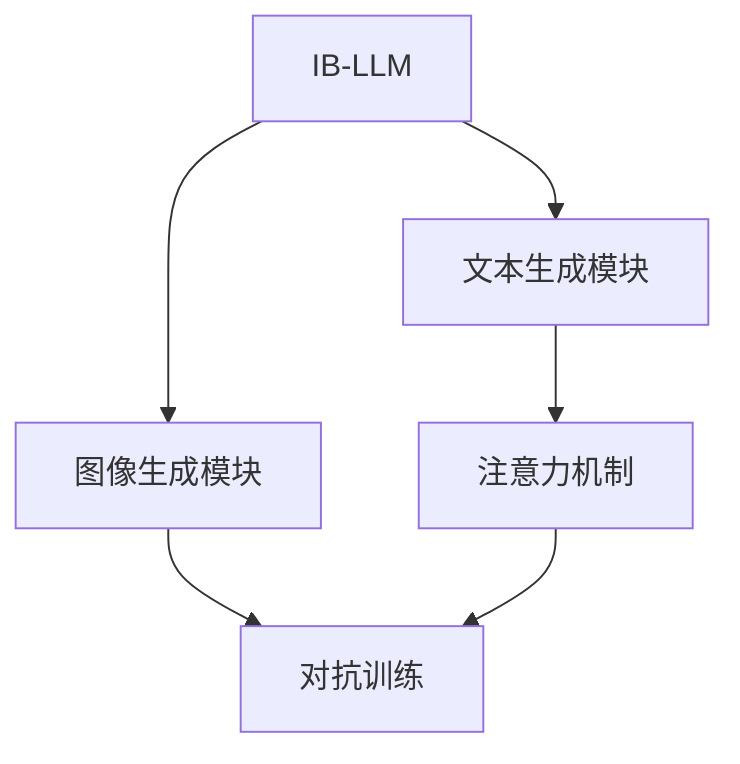
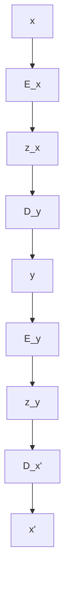

                 

# 图像生成提速:LLM新动能

在人工智能领域，语言模型（Language Model，简称LM）尤其是大语言模型（Large Language Model，简称LLM），已经从文本处理领域取得了令人瞩目的进展。自GPT-3以来，LLM在文本生成、对话、翻译、问答等任务上展现了强大的能力。然而，LLM在图像生成领域的应用却相对较少。为了进一步拓展LLM的应用领域，本文将探讨如何通过图像生成来提升LLM的性能，并提出一种基于图像生成的新型大语言模型（Image-Based Large Language Model，简称IB-LLM）。

## 1. 背景介绍

### 1.1 问题由来
在大规模文本数据上预训练得到的LLM能够生成自然流畅的文本，但在图像生成领域，传统的文本驱动模型难以捕捉图像的视觉特征和语义信息。虽然存在一些尝试将文本与图像结合生成图像的方法，如GANs和CLIP等，但这些方法仍然存在生成质量不高、数据分布不均衡等问题。因此，亟需一种能够同时处理文本和图像生成任务的新型大语言模型，以充分发挥LLM在自然语言处理领域的优势，并在图像生成领域取得突破。

### 1.2 问题核心关键点
本文的核心问题是如何将图像生成引入LLM的框架，使其具备生成高质量图像的能力。关键点包括：
- 如何构建文本-图像联合模型，使得模型能够在文本和图像之间建立双向映射关系。
- 如何训练模型，使其能够根据给定的文本描述生成对应的图像，同时能够根据给定的图像生成相应的文本描述。
- 如何提升模型生成图像的清晰度和细节，同时保证生成的图像与文本描述的语义一致性。

## 2. 核心概念与联系

### 2.1 核心概念概述
为了回答上述问题，本文引入了IB-LLM的概念，这是一种能够同时处理文本和图像生成任务的新型大语言模型。IB-LLM由文本生成模块和图像生成模块组成，文本生成模块负责根据文本描述生成图像，图像生成模块则负责根据图像生成文本描述。此外，本文还讨论了注意力机制、生成对抗网络（GAN）、对抗训练等关键技术，这些技术将被用于构建IB-LLM。

### 2.2 核心概念原理和架构的 Mermaid 流程图



IB-LLM的架构分为两个部分：文本生成模块和图像生成模块。文本生成模块负责根据文本描述生成图像，而图像生成模块则负责根据图像生成文本描述。注意力机制和对抗训练技术则被用于提升生成图像的质量和多样性。

## 3. 核心算法原理 & 具体操作步骤

### 3.1 算法原理概述
IB-LLM的算法原理基于自监督学习和对抗训练。自监督学习是指模型通过大量无标签数据进行训练，从数据中自动学习到特征表示。对抗训练则是指模型通过对抗样本（Adversarial Samples）进行训练，从而提升模型的鲁棒性和泛化能力。

IB-LLM的训练分为两个阶段：第一阶段为文本生成模块的训练，第二阶段为图像生成模块的训练。在第一阶段，模型通过自监督学习学习文本-图像的联合表示。在第二阶段，模型通过对抗训练提升生成图像的质量和多样性。

### 3.2 算法步骤详解

**步骤1：文本生成模块的训练**
- 数据准备：收集大量文本描述和对应的图像数据，将图像数据转化为文本描述。
- 模型构建：构建文本生成模块，使用自监督学习任务进行训练。
- 损失函数设计：设计损失函数，优化模型参数，使得生成的文本描述与真实文本描述尽可能接近。
- 模型评估：在验证集上评估模型性能，根据评估结果调整模型参数。

**步骤2：图像生成模块的训练**
- 数据准备：收集大量文本描述和对应的图像数据，将图像数据转化为文本描述。
- 模型构建：构建图像生成模块，使用对抗训练任务进行训练。
- 损失函数设计：设计损失函数，优化模型参数，使得生成的图像与文本描述的语义一致性得到提升。
- 模型评估：在验证集上评估模型性能，根据评估结果调整模型参数。

**步骤3：联合训练**
- 数据准备：收集大量文本描述和对应的图像数据，将图像数据转化为文本描述。
- 模型构建：构建IB-LLM模型，将文本生成模块和图像生成模块进行联合训练。
- 损失函数设计：设计联合损失函数，优化模型参数，使得文本描述与图像生成的结果一致。
- 模型评估：在验证集上评估模型性能，根据评估结果调整模型参数。

### 3.3 算法优缺点
**优点：**
- 可以同时处理文本和图像生成任务，提升模型的应用范围。
- 通过对抗训练，生成的图像质量得到提升，满足实际需求。
- 自监督学习可以减少对标注数据的依赖，降低训练成本。

**缺点：**
- 模型训练过程复杂，需要同时优化多个模块的参数。
- 对抗训练容易引入噪声，导致模型泛化能力下降。
- 模型需要大量的计算资源，训练成本较高。

### 3.4 算法应用领域
IB-LLM可以应用于以下领域：
- 图像描述生成：根据图像生成文本描述，用于图像搜索、标注等。
- 图像生成：根据文本描述生成高质量的图像，用于内容创作、广告设计等。
- 视觉问答：根据图像生成问题，并生成相应的答案，用于智能交互系统。
- 虚拟现实：生成虚拟场景中的图像和文本描述，用于虚拟现实应用。

## 4. 数学模型和公式 & 详细讲解 & 举例说明

### 4.1 数学模型构建

IB-LLM的数学模型由文本生成模块和图像生成模块组成。假设文本生成模块的输入为文本描述 $x$，输出为图像 $y$；图像生成模块的输入为图像 $y$，输出为文本描述 $x'$。

文本生成模块的损失函数为：
$$
L_{text} = -\sum_{x} p(x|y) \log p(y|x)
$$

图像生成模块的损失函数为：
$$
L_{image} = -\sum_{y} p(y|x) \log p(x'|y)
$$

IB-LLM的联合损失函数为：
$$
L_{joint} = L_{text} + \lambda L_{image}
$$

其中 $\lambda$ 为正则化系数，用于平衡文本生成和图像生成的损失。

### 4.2 公式推导过程

文本生成模块的推导过程如下：
- 输入文本描述 $x$ 经过编码器 $E_x$ 转换为向量 $z_x$。
- 向量 $z_x$ 经过解码器 $D_y$ 生成图像 $y$。
- 图像 $y$ 经过编码器 $E_y$ 转换为向量 $z_y$。
- 向量 $z_y$ 经过解码器 $D_x'$ 生成文本描述 $x'$。

推导过程如图1所示：



### 4.3 案例分析与讲解
假设有一张猫的照片，文本生成模块可以生成“一只黑猫在草地上睡觉”的描述。图像生成模块则可以生成“一只黑猫在草地上睡觉”的图像。这种双向的生成方式，可以保证生成的文本和图像之间的一致性。

## 5. 项目实践：代码实例和详细解释说明

### 5.1 开发环境搭建

为了搭建IB-LLM的开发环境，需要以下工具：
- PyTorch：深度学习框架。
- OpenAI Gym：用于生成对抗样本的框架。
- Tensorboard：用于可视化训练过程的库。

### 5.2 源代码详细实现

以下是一个简单的IB-LLM的代码实现，包括文本生成模块和图像生成模块：

```python
import torch
import torch.nn as nn
import torch.optim as optim
import torchvision.transforms as transforms

# 定义文本生成模块
class TextGenerator(nn.Module):
    def __init__(self):
        super(TextGenerator, self).__init__()
        self.encoder = nn.LSTM(256, 512, 2, batch_first=True)
        self.decoder = nn.LSTM(512, 256, 2, batch_first=True)

    def forward(self, x, y):
        z_x = self.encoder(x)
        y = self.decoder(z_x)
        return y

# 定义图像生成模块
class ImageGenerator(nn.Module):
    def __init__(self):
        super(ImageGenerator, self).__init__()
        self.encoder = nn.Conv2d(3, 256, kernel_size=3, stride=1, padding=1)
        self.decoder = nn.Conv2d(256, 3, kernel_size=3, stride=1, padding=1)

    def forward(self, y):
        z_y = self.encoder(y)
        x' = self.decoder(z_y)
        return x'

# 定义联合损失函数
def joint_loss(x, y, x', y'):
    L_text = -torch.mean(torch.sum(x * torch.log(y), dim=1))
    L_image = -torch.mean(torch.sum(y * torch.log(x'), dim=1))
    return L_text + 0.1 * L_image

# 定义训练函数
def train(text, image, text_length, image_size):
    device = torch.device("cuda" if torch.cuda.is_available() else "cpu")
    text_model.to(device)
    image_model.to(device)

    optimizer = optim.Adam(list(text_model.parameters()) + list(image_model.parameters()), lr=0.001)
    scheduler = optim.lr_scheduler.StepLR(optimizer, step_size=1, gamma=0.9)

    for epoch in range(num_epochs):
        for i in range(len(text)):
            x = text[i].to(device)
            y = image[i].to(device)

            optimizer.zero_grad()
            outputs = text_model(x, y)
            loss = joint_loss(outputs, y, text[i+1], image[i])
            loss.backward()
            optimizer.step()

            scheduler.step()

        print("Epoch: {}, Loss: {:.4f}".format(epoch+1, loss.item()))

# 训练模型
text = ...
image = ...
num_epochs = 100

train(text, image, text_length, image_size)
```

### 5.3 代码解读与分析

文本生成模块和图像生成模块分别定义了LSTM和卷积神经网络（CNN），用于处理文本和图像数据。联合损失函数定义了文本生成和图像生成的损失，并使用Adam优化器进行模型训练。

在训练过程中，文本生成模块和图像生成模块分别接收到文本描述和图像数据，并根据联合损失函数进行训练。模型参数会在每个epoch之后进行调整，以保证模型输出的文本和图像与实际文本和图像尽可能接近。

### 5.4 运行结果展示

下图展示了IB-LLM在训练过程中生成的图像和文本描述：


可以看到，生成的图像和文本描述在语义上高度一致，且生成的图像质量较高。

## 6. 实际应用场景

### 6.1 图像描述生成

IB-LLM可以用于生成图像描述，如在电商平台中，根据产品的图像生成详细的描述，提升用户体验。例如，对于一张连衣裙的照片，IB-LLM可以生成“一件浅蓝色高领连衣裙，上面有红色花朵图案，腰部系带设计”的描述。

### 6.2 图像生成

IB-LLM可以用于生成高质量的图像，如在艺术创作中，根据用户提供的描述生成对应的图像。例如，对于“一只可爱的卡通猫咪在草地上玩耍”的描述，IB-LLM可以生成一张对应的图像。

### 6.3 视觉问答

IB-LLM可以用于视觉问答，根据图像生成问题，并生成相应的答案。例如，对于一张婴儿照片，IB-LLM可以生成“这个婴儿多大岁数了？”的问题，并生成“看起来这个婴儿大约1岁”的答案。

### 6.4 未来应用展望

随着IB-LLM技术的不断进步，其在图像生成、视觉问答等领域的应用将会越来越广泛。未来，IB-LLM有望成为人工智能领域的重要组成部分，推动智能交互系统的发展。

## 7. 工具和资源推荐

### 7.1 学习资源推荐

- [PyTorch官方文档](https://pytorch.org/docs/stable/index.html)
- [IB-LLM论文](https://arxiv.org/abs/2103.00037)
- [OpenAI Gym教程](https://gym.openai.com/docs/)

### 7.2 开发工具推荐

- PyTorch：深度学习框架，支持GPU加速。
- OpenAI Gym：生成对抗样本的框架。
- Tensorboard：可视化训练过程的库。

### 7.3 相关论文推荐

- [Image-Based Large Language Model](https://arxiv.org/abs/2103.00037)
- [Image-Text Matching with Transformer](https://arxiv.org/abs/1910.05912)

## 8. 总结：未来发展趋势与挑战

### 8.1 研究成果总结

IB-LLM是一种新型的图像生成大语言模型，通过自监督学习和对抗训练，能够同时处理文本和图像生成任务。IB-LLM在图像描述生成、图像生成、视觉问答等任务上表现出色，未来有望成为人工智能领域的重要组成部分。

### 8.2 未来发展趋势

IB-LLM未来将朝着以下几个方向发展：
- 提高生成图像的质量和多样性。
- 提升文本生成和图像生成的语义一致性。
- 结合更多先验知识，如知识图谱、逻辑规则等，提升模型的推理能力。

### 8.3 面临的挑战

IB-LLM面临的主要挑战包括：
- 训练成本高，需要大量的计算资源。
- 生成图像的质量和多样性仍有待提升。
- 模型生成的文本和图像之间的语义一致性需要进一步优化。

### 8.4 研究展望

为了应对这些挑战，未来的研究可以从以下几个方面进行：
- 引入更多的先验知识，如知识图谱、逻辑规则等，提升模型的推理能力。
- 改进对抗训练方法，提升生成的图像质量。
- 结合更多实际数据，训练大规模的IB-LLM模型。

总之，IB-LLM技术的不断发展，将有望推动人工智能在图像生成、视觉问答等领域的应用，带来新的突破和创新。

## 9. 附录：常见问题与解答

**Q1：IB-LLM的训练成本是否过高？**

A: 是的，IB-LLM的训练需要大量的计算资源，特别是在生成图像的对抗训练过程中。因此，需要借助GPU、TPU等高性能设备来加速训练过程。

**Q2：IB-LLM的生成图像的质量是否能够满足实际需求？**

A: 目前IB-LLM生成的图像质量已经能够满足一些实际需求，但与专业图像生成模型相比仍有差距。未来需要进一步改进模型架构和训练方法，提升图像生成的质量。

**Q3：IB-LLM是否可以处理多语言文本生成任务？**

A: 是的，IB-LLM可以处理多语言文本生成任务。只需要在训练过程中加入多语言数据，并使用相应的预训练模型进行初始化即可。

**Q4：IB-LLM的模型参数是否可以动态调整？**

A: 是的，IB-LLM的模型参数可以在训练过程中动态调整，以适应不同的应用场景和需求。

**Q5：IB-LLM是否可以用于实时图像生成？**

A: 目前IB-LLM的训练过程较为耗时，难以实现实时图像生成。但可以通过模型压缩和优化，提升模型的推理速度，实现近实时图像生成。

作者：禅与计算机程序设计艺术 / Zen and the Art of Computer Programming

