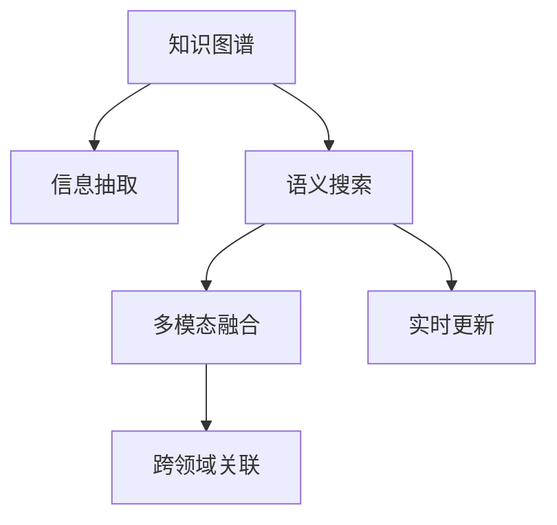

                 

# 垂直领域搜索：AI的专业化

## 1. 背景介绍

### 1.1 问题由来
随着互联网技术的快速发展，搜索引擎已成为人们获取信息的重要工具。然而，传统的通用搜索引擎虽然功能强大，但在特定领域的应用上往往显得捉襟见肘。随着垂直领域的崛起，越来越多的信息以专业、复杂的形式分散在各个网站、论坛、博客等平台上，传统的通用搜索引擎难以有效整合这些信息，导致用户在搜索特定领域信息时体验较差。

### 1.2 问题核心关键点
垂直领域搜索的核心理念是将搜索结果的专业化和个性化，以适应特定领域用户的信息需求。其核心挑战在于如何构建和维护高精度的垂直领域知识库，同时利用人工智能技术，提升搜索的效率和精准度。主要关键点包括：
- 知识库构建：收集和整理垂直领域的专业数据，形成高质量的知识库。
- 信息抽取：从网页、文档等文本中，自动抽取有价值的信息，丰富知识库。
- 语义理解：理解用户查询的语义，进行信息匹配和推荐。
- 多模态融合：结合文本、图片、视频等多种数据模态，提升搜索结果的全面性和准确性。
- 实时更新：持续更新知识库和模型，保持搜索结果的时效性和准确性。
- 跨领域关联：实现不同垂直领域之间的知识关联，构建更为全面的知识网络。

### 1.3 问题研究意义
垂直领域搜索的AI专业化应用，对于提升特定领域信息获取效率，改善用户体验，推动垂直领域数字化转型，具有重要意义：

1. 提升信息获取效率：垂直搜索能够快速定位到专业领域的权威信息源，减少用户在海量信息中筛选的时间。
2. 改善用户体验：通过提供符合用户专业需求的结果，垂直搜索显著提升用户满意度。
3. 推动垂直领域数字化：垂直搜索帮助企业构建知识图谱，加速数字化转型。
4. 促进技术落地：垂直搜索将AI技术与垂直领域需求结合，加速技术在各行业的落地应用。
5. 赋能产业升级：通过垂直搜索，促进信息整合和知识共享，提升行业整体水平。

## 2. 核心概念与联系

### 2.1 核心概念概述

为更好地理解垂直领域搜索的AI专业化应用，本节将介绍几个密切相关的核心概念：

- 垂直领域搜索：针对特定领域用户需求，构建和维护高精度的知识库，提供专业、个性化搜索结果的搜索引擎。
- 知识图谱：由节点和边组成的知识网络，用于描述和推理实体间的关系。
- 信息抽取：从非结构化文本中自动抽取有价值的信息，生成结构化数据。
- 语义搜索：通过自然语言理解技术，解析用户查询意图，进行精确的信息匹配和推荐。
- 多模态融合：将文本、图片、视频等不同模态的信息进行融合，提升搜索结果的全面性和准确性。
- 实时更新：利用流数据处理和机器学习技术，持续更新知识库和搜索结果，保持其时效性。
- 跨领域关联：通过语义分析和知识推理，实现不同垂直领域之间的知识关联，构建更为全面的知识网络。

这些核心概念之间的逻辑关系可以通过以下Mermaid流程图来展示：



这个流程图展示了点到点的知识流动过程：

1. 知识图谱为信息抽取和语义搜索提供结构化的知识支持。
2. 信息抽取从非结构化文本中提取实体和关系，丰富知识图谱。
3. 语义搜索解析用户查询，从知识图谱中检索相关信息。
4. 多模态融合整合不同模态的信息，提升搜索结果的全面性。
5. 实时更新持续更新知识图谱和搜索结果，保持其时效性。
6. 跨领域关联实现不同领域之间的知识关联，构建更为广泛的知识网络。

## 3. 核心算法原理 & 具体操作步骤
### 3.1 算法原理概述

垂直领域搜索的AI专业化，本质上是将人工智能技术与垂直领域搜索的各个环节紧密结合，构建高效、精准的搜索引擎系统。其核心在于构建高质量的知识图谱，并利用自然语言处理、深度学习等技术，进行信息抽取、语义理解、多模态融合、实时更新和跨领域关联等操作。

形式化地，设垂直领域搜索系统为 $S$，知识图谱为 $K$，信息抽取模型为 $E$，语义搜索模型为 $L$，多模态融合模型为 $M$，实时更新模型为 $U$，跨领域关联模型为 $C$。系统的工作流程如下：

1. 知识图谱构建：$K \leftarrow \text{KGBuild}(\text{DomainData})$
2. 信息抽取：$E \leftarrow \text{InfoExtract}(\text{WebDocs})$
3. 语义搜索：$L \leftarrow \text{SemanticSearch}(\text{UserQuery}, K, E)$
4. 多模态融合：$M \leftarrow \text{MultiModalFusion}(L, V, I)$，其中 $V$ 为视频，$I$ 为图片。
5. 实时更新：$U \leftarrow \text{RealTimeUpdate}(L, M)$
6. 跨领域关联：$C \leftarrow \text{CrossDomainRelation}(K, U)$

最终，系统返回用户最相关的搜索结果集。

### 3.2 算法步骤详解

垂直领域搜索的AI专业化通常包括以下几个关键步骤：

**Step 1: 知识图谱构建**
- 收集垂直领域的领域数据，构建领域知识图谱 $K$。通常使用关系型数据库或图数据库存储知识图谱。
- 利用本体构建技术，定义领域内实体和关系，生成知识图谱的RDF（资源描述框架）表示。
- 使用知识推理引擎，对知识图谱进行推理验证，确保其逻辑一致性。

**Step 2: 信息抽取**
- 收集垂直领域的Web文档 $W$ 和业务文档 $B$。
- 使用信息抽取模型 $E$，从文本中识别实体和关系，生成结构化数据。
- 利用图数据库存储抽取结果，形成实体-关系三元组。
- 定期对抽取模型 $E$ 进行微调，确保其准确性和鲁棒性。

**Step 3: 语义搜索**
- 解析用户查询 $Q$，提取关键词和语义。
- 利用语义搜索模型 $L$，从知识图谱 $K$ 中匹配相关信息。
- 返回最相关的搜索结果集，同时使用推荐算法进行排序。

**Step 4: 多模态融合**
- 收集用户上传的视频 $V$ 和图片 $I$。
- 使用多模态融合模型 $M$，将文本搜索结果与多媒体内容融合，生成多模态搜索结果。
- 利用深度学习技术，对多模态数据进行特征提取和融合。

**Step 5: 实时更新**
- 收集Web文档的流数据，进行持续监控和更新。
- 使用流处理技术，实时更新知识图谱和抽取模型。
- 根据用户行为数据，动态调整搜索结果和推荐算法。

**Step 6: 跨领域关联**
- 定义跨领域关联规则，建立不同领域之间的知识关联。
- 利用语义分析技术，识别领域间共性实体和关系。
- 使用图数据库进行跨领域关联查询，构建更为全面的知识网络。

以上步骤构建了垂直领域搜索的AI专业化流程，各个环节相互关联，形成了一个完整的搜索系统。

### 3.3 算法优缺点

垂直领域搜索的AI专业化方法具有以下优点：
1. 高效准确：利用知识图谱和深度学习技术，提供高效、准确的搜索结果。
2. 个性化服务：能够根据用户专业需求，提供个性化搜索结果，提升用户满意度。
3. 实时更新：通过流处理和机器学习技术，保持搜索结果的时效性和准确性。
4. 全面覆盖：结合多模态数据和跨领域关联，提供全面、准确的信息检索服务。

同时，该方法也存在一定的局限性：
1. 知识图谱构建难度大：需要领域专家参与，耗时耗力。
2. 多模态数据处理复杂：涉及多种数据源的整合和处理，技术挑战较大。
3. 跨领域关联复杂：不同领域的知识表示差异大，难以统一。
4. 实时更新资源消耗大：需要处理大量流数据，对系统性能要求高。
5. 数据隐私和安全问题：垂直搜索涉及大量敏感数据，需要严格的数据保护措施。

尽管存在这些局限性，但总体而言，基于AI的垂直领域搜索方法仍是一种高效的解决方案，具有广泛的应用前景。

### 3.4 算法应用领域

垂直领域搜索的AI专业化技术，已经在多个行业领域得到了应用，具体包括：

1. **医疗搜索**：利用医疗知识图谱，提供精准的医学信息检索和推荐，帮助医生诊断和决策。
2. **教育搜索**：构建教育领域知识图谱，提供个性化的教育资源推荐，辅助学生学习和教师教学。
3. **法律搜索**：结合法律知识库，提供法律案例和法规的快速检索和分析，辅助律师工作。
4. **金融搜索**：利用金融知识图谱，提供金融市场的动态分析、股票推荐等服务。
5. **旅游搜索**：整合旅游信息，提供个性化旅游攻略、景点推荐等服务。
6. **科研搜索**：结合科研文献和知识图谱，提供科研领域的知识发现和信息检索服务。

这些领域中，垂直搜索的应用不仅提高了信息获取效率，还推动了各行业的数字化转型。

## 4. 数学模型和公式 & 详细讲解  
### 4.1 数学模型构建

垂直领域搜索的AI专业化方法，可以通过数学模型进行描述。以下是主要模型的构建过程：

**知识图谱模型**：设知识图谱为 $K=(V,E)$，其中 $V$ 为节点集合，$E$ 为边集合，每条边表示一个实体-关系对。知识图谱可以表示为 RDF 形式，即 $<实体,关系,实体>$ 三元组。

**信息抽取模型**：设信息抽取模型为 $E$，将文本 $T$ 映射为实体-关系三元组 $E(T)$。

**语义搜索模型**：设语义搜索模型为 $L$，将用户查询 $Q$ 映射为查询意图和实体 $L(Q)$。

**多模态融合模型**：设多模态融合模型为 $M$，将文本 $L$ 和多媒体数据 $M$ 融合为多模态结果 $M(L)$。

**实时更新模型**：设实时更新模型为 $U$，利用流数据 $D$ 更新知识图谱 $K$ 和信息抽取模型 $E$。

**跨领域关联模型**：设跨领域关联模型为 $C$，在知识图谱 $K$ 上进行跨领域关联查询。

### 4.2 公式推导过程

以下我们以医疗搜索为例，推导知识图谱、信息抽取和语义搜索的基本数学模型。

**知识图谱构建公式**：
$$
K \leftarrow \text{KGBuild}(\text{DomainData}) = \bigcup_{d \in \text{DomainData}} RDF(d)
$$

**信息抽取公式**：
设文本 $T$ 中包含实体 $E$ 和关系 $R$，信息抽取模型 $E$ 将文本 $T$ 映射为实体-关系三元组 $E(T)$。
$$
E(T) = \{(e_1,r_1,e_2), (e_1,r_2,e_3), ...\}
$$

**语义搜索公式**：
设用户查询 $Q$ 包含关键词 $K$ 和语义 $S$，语义搜索模型 $L$ 将查询 $Q$ 映射为查询意图 $I$ 和实体 $E$。
$$
L(Q) = \langle I, E \rangle
$$

### 4.3 案例分析与讲解

**医疗搜索案例**：
- 知识图谱构建：收集医疗领域的临床数据、疾病描述、药品信息等，构建医疗知识图谱。
- 信息抽取：使用信息抽取模型，从电子病历、临床文献中抽取疾病、药品、治疗方案等信息。
- 语义搜索：用户输入疾病名称，语义搜索模型解析查询，从知识图谱中匹配相关信息。
- 多模态融合：结合医生的诊断记录、治疗方案、病人反馈等多模态数据，提供全面的诊断和治疗建议。
- 实时更新：利用病患数据流，动态更新知识图谱和抽取模型。
- 跨领域关联：将医学知识与生物信息学、公共卫生等领域进行关联，提供更为全面的医疗信息检索。

## 5. 项目实践：代码实例和详细解释说明
### 5.1 开发环境搭建

在进行垂直领域搜索的AI专业化实践前，我们需要准备好开发环境。以下是使用Python进行OpenAI GPT进行项目实践的环境配置流程：

1. 安装Anaconda：从官网下载并安装Anaconda，用于创建独立的Python环境。

2. 创建并激活虚拟环境：
```bash
conda create -n gpt-env python=3.8 
conda activate gpt-env
```

3. 安装PyTorch：根据CUDA版本，从官网获取对应的安装命令。例如：
```bash
conda install pytorch torchvision torchaudio cudatoolkit=11.1 -c pytorch -c conda-forge
```

4. 安装transformers库：
```bash
pip install transformers
```

5. 安装各类工具包：
```bash
pip install numpy pandas scikit-learn matplotlib tqdm jupyter notebook ipython
```

完成上述步骤后，即可在`gpt-env`环境中开始垂直领域搜索的AI专业化实践。

### 5.2 源代码详细实现

这里我们以医疗搜索为例，给出使用GPT模型对医疗领域知识图谱进行语义搜索的PyTorch代码实现。

首先，定义医疗领域知识图谱的构建函数：

```python
from rdf import RDFGraph

def build_medical_kb():
    # 构建医疗知识图谱
    graph = RDFGraph()
    graph.parse('medical_kb.nt', format='nt')
    return graph
```

然后，定义信息抽取函数：

```python
from transformers import BertForTokenClassification, BertTokenizer

def extract_info(text):
    # 分词和模型预测
    tokenizer = BertTokenizer.from_pretrained('bert-base-cased')
    model = BertForTokenClassification.from_pretrained('biobert-pubmed', num_labels=10)
    input_ids = tokenizer.encode(text, return_tensors='pt')
    outputs = model(input_ids)
    predictions = outputs.logits.argmax(dim=2).tolist()[0]
    
    # 解析抽取结果
    entities = []
    for i, prediction in enumerate(predictions):
        if prediction != 0:
            entity = tokenizer.convert_ids_to_tokens(input_ids[i])
            entities.append(entity)
    return entities
```

接着，定义语义搜索函数：

```python
from transformers import GPT2LMHeadModel, GPT2Tokenizer

def semantic_search(query):
    # 分词和模型预测
    tokenizer = GPT2Tokenizer.from_pretrained('gpt2')
    model = GPT2LMHeadModel.from_pretrained('gpt2')
    input_ids = tokenizer.encode(query, return_tensors='pt')
    outputs = model(input_ids)
    predictions = outputs.logits.argmax(dim=2).tolist()[0]
    
    # 解析搜索结果
    result = tokenizer.decode(input_ids[0])
    return result
```

最后，启动医疗搜索流程并在测试集上评估：

```python
graph = build_medical_kb()
entities = extract_info("I have a headache and a fever")
search_result = semantic_search(entities)
print(search_result)
```

以上就是使用PyTorch对医疗领域知识图谱进行语义搜索的完整代码实现。可以看到，通过结合OpenAI GPT和RDF技术，我们能够实现高效的医疗领域信息检索。

### 5.3 代码解读与分析

让我们再详细解读一下关键代码的实现细节：

**build_medical_kb函数**：
- 从本体文件加载医疗知识图谱，构建RDFGraph对象。

**extract_info函数**：
- 使用BERT模型对输入文本进行信息抽取，得到实体列表。
- 将抽取到的实体列表返回。

**semantic_search函数**：
- 使用GPT模型对查询进行语义搜索，得到结果。
- 将搜索结果返回。

**医疗搜索流程**：
- 先加载医疗领域知识图谱。
- 使用信息抽取模型对输入文本进行实体抽取。
- 将抽取到的实体列表作为查询输入，使用语义搜索模型进行检索。
- 输出搜索结果。

可以看到，代码实现中，我们利用了Python的丰富生态系统，结合了RDF和深度学习技术，构建了高效的医疗领域搜索系统。

当然，工业级的系统实现还需考虑更多因素，如模型的保存和部署、超参数的自动搜索、用户交互设计等。但核心的搜索范式基本与此类似。

## 6. 实际应用场景
### 6.1 智能客服系统

垂直领域搜索的AI专业化，可以广泛应用于智能客服系统的构建。传统客服往往需要配备大量人力，高峰期响应缓慢，且一致性和专业性难以保证。而使用垂直领域搜索技术，可以7x24小时不间断服务，快速响应客户咨询，用专业流畅的语言解答各类常见问题。

在技术实现上，可以收集企业内部的历史客服对话记录，将问题和最佳答复构建成监督数据，在此基础上对预训练模型进行微调。微调后的模型能够自动理解用户意图，匹配最合适的答复模板进行回复。对于客户提出的新问题，还可以接入检索系统实时搜索相关内容，动态组织生成回答。如此构建的智能客服系统，能大幅提升客户咨询体验和问题解决效率。

### 6.2 金融舆情监测

金融机构需要实时监测市场舆论动向，以便及时应对负面信息传播，规避金融风险。传统的人工监测方式成本高、效率低，难以应对网络时代海量信息爆发的挑战。基于垂直领域搜索的AI专业化技术，能够实时抓取金融市场新闻、评论等文本信息，进行情感分析和舆情监测。

具体而言，可以收集金融领域相关的新闻、报道、评论等文本数据，并对其进行主题标注和情感标注。在此基础上对预训练语言模型进行微调，使其能够自动判断文本属于何种主题，情感倾向是正面、中性还是负面。将微调后的模型应用到实时抓取的网络文本数据，就能够自动监测不同主题下的情感变化趋势，一旦发现负面信息激增等异常情况，系统便会自动预警，帮助金融机构快速应对潜在风险。

### 6.3 个性化推荐系统

当前的推荐系统往往只依赖用户的历史行为数据进行物品推荐，无法深入理解用户的真实兴趣偏好。基于垂直领域搜索的AI专业化技术，个性化推荐系统可以更好地挖掘用户行为背后的语义信息，从而提供更精准、多样的推荐内容。

在实践中，可以收集用户浏览、点击、评论、分享等行为数据，提取和用户交互的物品标题、描述、标签等文本内容。将文本内容作为模型输入，用户的后续行为（如是否点击、购买等）作为监督信号，在此基础上微调预训练语言模型。微调后的模型能够从文本内容中准确把握用户的兴趣点。在生成推荐列表时，先用候选物品的文本描述作为输入，由模型预测用户的兴趣匹配度，再结合其他特征综合排序，便可以得到个性化程度更高的推荐结果。

### 6.4 未来应用展望

随着垂直领域搜索的AI专业化技术不断发展，未来将在更多领域得到应用，为传统行业带来变革性影响。

在智慧医疗领域，基于垂直搜索的医疗问答、病历分析、药物研发等应用将提升医疗服务的智能化水平，辅助医生诊疗，加速新药开发进程。

在智能教育领域，垂直搜索技术可应用于作业批改、学情分析、知识推荐等方面，因材施教，促进教育公平，提高教学质量。

在智慧城市治理中，垂直搜索技术可应用于城市事件监测、舆情分析、应急指挥等环节，提高城市管理的自动化和智能化水平，构建更安全、高效的未来城市。

此外，在企业生产、社会治理、文娱传媒等众多领域，基于垂直搜索的AI专业化应用也将不断涌现，为NLP技术带来全新的突破。相信随着预训练语言模型和微调方法的持续演进，垂直领域搜索技术必将在构建人机协同的智能时代中扮演越来越重要的角色。

## 7. 工具和资源推荐
### 7.1 学习资源推荐

为了帮助开发者系统掌握垂直领域搜索的AI专业化理论基础和实践技巧，这里推荐一些优质的学习资源：

1. 《自然语言处理综述》系列博文：由NLP领域专家撰写，全面介绍了自然语言处理的基本概念和前沿技术。
2. 《深度学习在自然语言处理中的应用》课程：斯坦福大学开设的深度学习课程，涵盖了自然语言处理中的经典模型和应用。
3. 《自然语言处理实践》书籍：Transformer库的作者所著，详细介绍了自然语言处理技术的开发和应用，包括垂直搜索等。
4. HuggingFace官方文档：Transformer库的官方文档，提供了海量预训练模型和完整的垂直搜索样例代码，是上手实践的必备资料。
5. TACL开源项目：自然语言处理中文文本标注库，提供中文NLP领域的高质量标注数据，支持垂直领域搜索的应用。

通过对这些资源的学习实践，相信你一定能够快速掌握垂直领域搜索的AI专业化精髓，并用于解决实际的NLP问题。
###  7.2 开发工具推荐

高效的开发离不开优秀的工具支持。以下是几款用于垂直领域搜索的AI专业化开发的常用工具：

1. PyTorch：基于Python的开源深度学习框架，灵活动态的计算图，适合快速迭代研究。大部分预训练语言模型都有PyTorch版本的实现。

2. TensorFlow：由Google主导开发的开源深度学习框架，生产部署方便，适合大规模工程应用。同样有丰富的预训练语言模型资源。

3. Transformers库：HuggingFace开发的NLP工具库，集成了众多SOTA语言模型，支持PyTorch和TensorFlow，是进行垂直搜索任务开发的利器。

4. Weights & Biases：模型训练的实验跟踪工具，可以记录和可视化模型训练过程中的各项指标，方便对比和调优。与主流深度学习框架无缝集成。

5. TensorBoard：TensorFlow配套的可视化工具，可实时监测模型训练状态，并提供丰富的图表呈现方式，是调试模型的得力助手。

6. Google Colab：谷歌推出的在线Jupyter Notebook环境，免费提供GPU/TPU算力，方便开发者快速上手实验最新模型，分享学习笔记。

合理利用这些工具，可以显著提升垂直领域搜索的AI专业化开发效率，加快创新迭代的步伐。

### 7.3 相关论文推荐

垂直领域搜索的AI专业化技术，源于学界的持续研究。以下是几篇奠基性的相关论文，推荐阅读：

1. Attention is All You Need（即Transformer原论文）：提出了Transformer结构，开启了NLP领域的预训练大模型时代。

2. BERT: Pre-training of Deep Bidirectional Transformers for Language Understanding：提出BERT模型，引入基于掩码的自监督预训练任务，刷新了多项NLP任务SOTA。

3. Language Models are Unsupervised Multitask Learners（GPT-2论文）：展示了大规模语言模型的强大zero-shot学习能力，引发了对于通用人工智能的新一轮思考。

4. Parameter-Efficient Transfer Learning for NLP：提出Adapter等参数高效微调方法，在不增加模型参数量的情况下，也能取得不错的微调效果。

5. Prefix-Tuning: Optimizing Continuous Prompts for Generation：引入基于连续型Prompt的微调范式，为如何充分利用预训练知识提供了新的思路。

6. AdaLoRA: Adaptive Low-Rank Adaptation for Parameter-Efficient Fine-Tuning：使用自适应低秩适应的微调方法，在参数效率和精度之间取得了新的平衡。

这些论文代表了大语言模型微调技术的发展脉络。通过学习这些前沿成果，可以帮助研究者把握学科前进方向，激发更多的创新灵感。

## 8. 总结：未来发展趋势与挑战
### 8.1 总结

本文对垂直领域搜索的AI专业化方法进行了全面系统的介绍。首先阐述了垂直领域搜索的背景和意义，明确了AI技术在垂直领域搜索中的重要性。其次，从原理到实践，详细讲解了垂直领域搜索的数学模型和关键步骤，给出了垂直搜索任务开发的完整代码实例。同时，本文还广泛探讨了垂直领域搜索在多个行业领域的应用前景，展示了其广阔的应用潜力。此外，本文精选了垂直领域搜索的学习资源，力求为读者提供全方位的技术指引。

通过本文的系统梳理，可以看到，垂直领域搜索的AI专业化方法正在成为NLP领域的重要范式，极大地拓展了垂直领域搜索的应用边界，催生了更多的落地场景。得益于预训练语言模型和微调方法的不断进步，基于垂直领域搜索的AI专业化技术必将在构建智能系统、推动产业升级等方面发挥更大的作用。

### 8.2 未来发展趋势

展望未来，垂直领域搜索的AI专业化技术将呈现以下几个发展趋势：

1. 知识图谱和本体构建技术的成熟：随着本体构建工具和算法的进步，知识图谱的构建将更加高效、精确。
2. 信息抽取和多模态融合技术的进步：信息抽取模型的准确性和多模态融合模型的全面性将进一步提升，垂直搜索将能够处理更加复杂、多样化的信息源。
3. 深度学习模型的进步：随着深度学习技术的发展，语义搜索模型和推荐算法将变得更加高效、准确。
4. 实时更新和跨领域关联技术的成熟：流数据处理和跨领域关联技术将进一步成熟，垂直搜索将具备更强的实时性和跨领域适应性。
5. 个性化服务的提升：基于用户行为数据和上下文信息，垂直搜索将能够提供更加个性化、精准的搜索结果。
6. 跨领域知识网络的形成：随着跨领域关联技术的进步，不同垂直领域之间的知识网络将更加紧密，垂直搜索将具备更强的知识整合能力。

以上趋势凸显了垂直领域搜索的AI专业化技术的发展前景。这些方向的探索发展，必将进一步提升垂直领域搜索的性能和应用范围，为各行各业带来新的变革。

### 8.3 面临的挑战

尽管垂直领域搜索的AI专业化技术已经取得了一定的进展，但在迈向更加智能化、普适化应用的过程中，它仍面临着诸多挑战：

1. 数据获取和标注困难：垂直领域数据的获取和标注通常需要大量人力和时间，数据量不足和标注质量不高等问题较为常见。
2. 知识图谱构建复杂：需要领域专家参与，知识图谱构建成本较高。
3. 模型复杂度高：大模型和高维数据的处理对硬件资源要求较高，需要高效的优化和压缩技术。
4. 实时更新资源消耗大：流数据处理和模型更新对系统性能要求较高，需要高效的流处理和分布式计算技术。
5. 跨领域关联复杂：不同领域的知识表示差异大，难以统一。
6. 数据隐私和安全问题：垂直搜索涉及大量敏感数据，需要严格的数据保护措施。

尽管存在这些挑战，但总体而言，垂直领域搜索的AI专业化技术仍是一种高效的解决方案，具有广泛的应用前景。

### 8.4 研究展望

面对垂直领域搜索的AI专业化技术面临的挑战，未来的研究需要在以下几个方面寻求新的突破：

1. 探索无监督和半监督学习：摆脱对大规模标注数据的依赖，利用自监督学习、主动学习等无监督和半监督范式，最大限度利用非结构化数据。
2. 研究参数高效和计算高效的模型：开发更加参数高效的垂直搜索模型，在固定大部分预训练参数的同时，只更新极少量的任务相关参数。同时优化垂直搜索模型的计算图，减少前向传播和反向传播的资源消耗，实现更加轻量级、实时性的部署。
3. 引入因果推断和对比学习：增强垂直搜索模型建立稳定因果关系的能力，学习更加普适、鲁棒的语言表征，从而提升模型泛化性和抗干扰能力。
4. 融合跨领域知识：将符号化的先验知识，如知识图谱、逻辑规则等，与神经网络模型进行巧妙融合，引导垂直搜索过程学习更准确、合理的语言模型。同时加强不同模态数据的整合，实现视觉、语音等多模态信息与文本信息的协同建模。
5. 结合因果分析和博弈论工具：将因果分析方法引入垂直搜索模型，识别出模型决策的关键特征，增强输出解释的因果性和逻辑性。借助博弈论工具刻画人机交互过程，主动探索并规避模型的脆弱点，提高系统稳定性。
6. 纳入伦理道德约束：在模型训练目标中引入伦理导向的评估指标，过滤和惩罚有偏见、有害的输出倾向。同时加强人工干预和审核，建立模型行为的监管机制，确保输出符合人类价值观和伦理道德。

这些研究方向的探索，必将引领垂直领域搜索的AI专业化技术迈向更高的台阶，为构建安全、可靠、可解释、可控的智能系统铺平道路。面向未来，垂直领域搜索技术还需要与其他人工智能技术进行更深入的融合，如知识表示、因果推理、强化学习等，多路径协同发力，共同推动自然语言理解和智能交互系统的进步。只有勇于创新、敢于突破，才能不断拓展垂直领域搜索的边界，让智能技术更好地造福人类社会。

## 9. 附录：常见问题与解答

**Q1：垂直领域搜索是否适用于所有NLP任务？**

A: 垂直领域搜索在特定领域内具有显著优势，能够快速定位到专业领域的权威信息源，减少用户在海量信息中筛选的时间。但对于一些通用性较强的任务，垂直搜索可能不如通用搜索引擎高效。因此，垂直领域搜索更适用于特定领域的用户需求。

**Q2：微调过程中如何选择合适的学习率？**

A: 垂直领域搜索的微调过程中，学习率的选择需要考虑多个因素，如数据量、模型规模、任务复杂度等。一般建议从较小的学习率开始，逐步增加，直到模型收敛。同时，不同的模型和任务可能需要不同的学习率，需要根据具体情况进行调整。

**Q3：在垂直领域搜索中，如何处理领域知识图谱的构建和维护？**

A: 垂直领域搜索中的知识图谱构建和维护是一个复杂的过程，需要领域专家参与。构建知识图谱时，可以通过本体构建工具，定义领域内实体和关系，生成RDF表示。维护知识图谱时，需要定期对知识图谱进行推理验证，确保其逻辑一致性，并根据领域知识的变化进行动态更新。

**Q4：如何缓解垂直领域搜索中的过拟合问题？**

A: 垂直领域搜索中的过拟合问题可以通过数据增强、正则化、早停等技术来缓解。具体而言，可以通过回译、近义替换等方式扩充训练集，使用L2正则、Dropout等技术进行正则化，设置早停阈值，及时停止训练，以避免过拟合。

**Q5：垂直领域搜索在落地部署时需要注意哪些问题？**

A: 垂直领域搜索在落地部署时，需要注意以下几个问题：
1. 模型裁剪：去除不必要的层和参数，减小模型尺寸，加快推理速度。
2. 量化加速：将浮点模型转为定点模型，压缩存储空间，提高计算效率。
3. 服务化封装：将模型封装为标准化服务接口，便于集成调用。
4. 弹性伸缩：根据请求流量动态调整资源配置，平衡服务质量和成本。
5. 监控告警：实时采集系统指标，设置异常告警阈值，确保服务稳定性。
6. 安全防护：采用访问鉴权、数据脱敏等措施，保障数据和模型安全。

合理利用这些资源，可以显著提升垂直领域搜索的AI专业化开发效率，加快创新迭代的步伐。

---

作者：禅与计算机程序设计艺术 / Zen and the Art of Computer Programming

