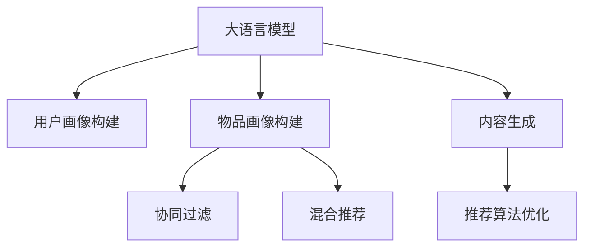

                 

# 基于LLM的个性化内容生成推荐策略

> 关键词：大语言模型(LLM)，推荐系统，个性化推荐，内容生成，协同过滤，混合推荐，用户画像

## 1. 背景介绍

### 1.1 问题由来
随着互联网的快速发展和信息爆炸，用户在浏览互联网时面临大量的信息冲击。如何从海量的数据中筛选出用户感兴趣的内容，成为提升用户体验、提高信息传播效率的关键问题。推荐系统作为互联网信息获取的重要工具，通过分析用户的行为数据，向用户推荐可能感兴趣的内容，极大地提升了信息传播的精准度和效率。

近年来，基于深度学习的推荐系统，通过构建用户画像、物品画像以及两者之间的关系，在个性化推荐上取得了突破性进展。而大语言模型（Large Language Model，LLM）作为一种通用的语言表示模型，具备强大的语言理解和生成能力，能够从文本中提取丰富的信息，进一步提升了推荐系统的个性化水平。

### 1.2 问题核心关键点
基于大语言模型的个性化内容生成推荐策略，关键在于如何利用大语言模型的语义理解和生成能力，提升推荐系统的个性化推荐效果。具体来说，包括以下几个方面：

1. 用户画像的构建：利用大语言模型分析用户的浏览历史、行为数据，构建用户兴趣的向量表示，准确刻画用户的个性化特征。
2. 物品画像的构建：通过对物品描述、标签等文本数据的分析，构建物品的语义表示，便于与用户画像进行匹配。
3. 推荐算法的设计：结合大语言模型的语义匹配能力，设计高效的推荐算法，准确捕捉用户与物品之间的潜在关联。
4. 内容生成的能力：通过大语言模型的语言生成能力，针对用户的个性化需求，生成高质量的内容推荐，提升用户体验。

本文将详细介绍基于大语言模型的个性化推荐策略，结合推荐系统中的协同过滤和混合推荐方法，设计出一个高效、精准、灵活的推荐系统。

## 2. 核心概念与联系

### 2.1 核心概念概述

为更好地理解基于大语言模型的个性化内容生成推荐策略，本节将介绍几个密切相关的核心概念：

- 大语言模型（LLM）：如GPT-3、BERT、T5等，通过在大规模无标签文本语料上进行预训练，学习通用的语言表示，具备强大的语言理解和生成能力。
- 推荐系统：根据用户的行为数据，为用户推荐可能感兴趣的内容。常见的推荐算法包括协同过滤、内容推荐、混合推荐等。
- 个性化推荐：通过分析用户的兴趣、行为、历史数据，为用户量身定制个性化的推荐内容。
- 协同过滤（Collaborative Filtering）：通过分析用户和物品的相似性，为用户推荐可能感兴趣的内容。
- 混合推荐（Hybrid Recommendation）：结合协同过滤和基于内容的推荐方法，提升推荐系统的准确性和鲁棒性。
- 用户画像（User Profile）：根据用户的浏览历史、行为数据等构建的用户兴趣向量表示。
- 物品画像（Item Profile）：根据物品的描述、标签等文本数据构建的物品语义表示。
- 内容生成（Content Generation）：利用大语言模型的语言生成能力，针对用户的个性化需求，生成高质量的内容推荐。

这些核心概念之间的逻辑关系可以通过以下Mermaid流程图来展示：



这个流程图展示了大语言模型的核心概念及其之间的关系：

1. 大语言模型通过预训练获得基础能力。
2. 用户画像和物品画像的构建，利用大语言模型的语义分析能力。
3. 协同过滤和混合推荐方法，结合用户画像和物品画像，实现高效推荐。
4. 内容生成方法，利用大语言模型的语言生成能力，提升推荐系统的人性化水平。

这些概念共同构成了基于大语言模型的推荐系统框架，使其能够在各种场景下发挥强大的推荐能力。

## 3. 核心算法原理 & 具体操作步骤
### 3.1 算法原理概述

基于大语言模型的个性化内容生成推荐策略，本质上是一种深度学习驱动的推荐方法。其核心思想是：将大语言模型作为推荐系统的核心组件，通过分析用户和物品的语义信息，构建用户画像和物品画像，结合协同过滤和混合推荐方法，生成个性化的推荐内容。

形式化地，假设用户画像为 $U$，物品画像为 $I$，推荐系统为 $R$，目标是最小化推荐系统 $R$ 与用户 $U$ 的误差，即：

$$
\min_{R} \mathcal{L}(R,U,I) = \min_{R} \sum_{u,i} \mathcal{L}_{u,i}(R,U,I)
$$

其中 $\mathcal{L}_{u,i}(R,U,I)$ 表示用户 $u$ 对物品 $i$ 的推荐误差，通常使用均方误差或交叉熵等损失函数来衡量。

在大语言模型中，通常使用Transformer结构进行文本处理。对于每个用户和物品，将其描述文本编码为向量表示，表示为用户画像 $U$ 和物品画像 $I$。对于新物品，可以将其文本描述输入大语言模型，生成其语义表示向量，从而提升推荐系统的灵活性和鲁棒性。

### 3.2 算法步骤详解

基于大语言模型的个性化推荐策略，主要包括以下几个关键步骤：

**Step 1: 准备数据和预训练模型**

- 准备用户行为数据，如浏览记录、点击记录、收藏记录等，作为构建用户画像的原始数据。
- 准备物品描述数据，如产品说明、标签、评论等，作为构建物品画像的原始数据。
- 选择适合的语言模型，如GPT-3、BERT、T5等，作为推荐系统中的核心组件。

**Step 2: 构建用户画像和物品画像**

- 利用大语言模型，将用户行为数据转化为向量表示，构建用户画像 $U$。
- 利用大语言模型，将物品描述数据转化为向量表示，构建物品画像 $I$。

**Step 3: 设计推荐算法**

- 结合协同过滤和混合推荐方法，设计高效的推荐算法，如基于内容的推荐、基于用户的协同过滤、基于混合矩阵的推荐等。
- 根据用户画像 $U$ 和物品画像 $I$，计算用户和物品的相似度，生成推荐结果。

**Step 4: 生成推荐内容**

- 对于推荐结果，利用大语言模型，根据用户画像和物品画像，生成高质量的内容推荐，如产品介绍、文案等。
- 通过自然语言处理技术，对生成的内容进行优化和过滤，确保推荐内容的质量和相关性。

**Step 5: 评估和优化**

- 利用推荐结果与实际用户行为的误差，评估推荐系统的性能。
- 根据评估结果，不断优化推荐算法和大语言模型的参数，提升推荐系统的精度和个性化水平。

### 3.3 算法优缺点

基于大语言模型的个性化推荐策略，具有以下优点：

1. 强语义表示：利用大语言模型的语义分析能力，构建更精确的用户画像和物品画像，提升推荐系统的准确性和鲁棒性。
2. 动态生成内容：结合大语言模型的语言生成能力，动态生成个性化推荐内容，提升用户体验。
3. 灵活性强：通过大语言模型，灵活地构建和更新用户画像和物品画像，适应不同场景下的个性化需求。
4. 可解释性高：大语言模型具备良好的可解释性，便于理解和调试推荐系统中的决策过程。

同时，该方法也存在一些缺点：

1. 数据依赖性强：大语言模型需要大量的文本数据进行预训练，对于缺少文本数据的推荐场景，难以应用。
2. 计算成本高：大语言模型的计算成本较高，对于实时性要求高的推荐场景，可能存在延迟。
3. 泛化能力差：由于大语言模型在训练过程中没有接触过推荐系统的场景，可能存在泛化能力不足的问题。
4. 推荐效率低：对于大语言模型生成的推荐内容，需要进行额外的优化和过滤，可能导致推荐效率较低。

尽管存在这些局限性，但就目前而言，基于大语言模型的个性化推荐策略在推荐系统中的应用前景广阔，值得进一步研究和推广。

### 3.4 算法应用领域

基于大语言模型的个性化推荐策略，在以下领域具有广泛的应用前景：

1. 电子商务推荐：电商平台可以通过用户行为数据，结合物品描述信息，为用户提供个性化的商品推荐。
2. 新闻推荐：新闻平台可以根据用户的历史阅读记录和兴趣，生成个性化的新闻推荐，提升用户留存率和点击率。
3. 视频推荐：视频网站可以根据用户的观看历史和评价，生成个性化的视频推荐，提升用户体验。
4. 社交网络推荐：社交平台可以根据用户的互动行为，生成个性化的内容推荐，提升用户活跃度。

除了上述这些经典应用场景外，基于大语言模型的个性化推荐策略还可以应用于更多领域，如智能客服、智慧健康、智能交通等，为用户带来更优质的服务体验。

## 4. 数学模型和公式 & 详细讲解  
### 4.1 数学模型构建

本节将使用数学语言对基于大语言模型的个性化推荐策略进行更加严格的刻画。

假设用户画像为 $U$，物品画像为 $I$，推荐系统为 $R$，推荐结果为 $R_{ui}$，用户 $u$ 对物品 $i$ 的评分向量为 $r_{ui}$，用户行为数据为 $X_u$，物品描述数据为 $I_i$，大语言模型为 $L$。则推荐系统的目标为：

$$
\min_{R} \mathcal{L}(R,U,I) = \min_{R} \sum_{u,i} \mathcal{L}_{u,i}(R,U,I)
$$

其中 $\mathcal{L}_{u,i}(R,U,I)$ 表示用户 $u$ 对物品 $i$ 的推荐误差，通常使用均方误差或交叉熵等损失函数来衡量。

### 4.2 公式推导过程

假设用户画像 $U$ 和物品画像 $I$ 的向量表示分别为 $\vec{U}$ 和 $\vec{I}$，利用大语言模型将用户行为数据 $X_u$ 和物品描述数据 $I_i$ 转化为向量表示，分别为 $\vec{X_u}$ 和 $\vec{I_i}$。则推荐系统 $R$ 的目标函数为：

$$
\min_{R} \sum_{u,i} \mathcal{L}_{u,i}(R,U,I) = \min_{R} \sum_{u,i} \mathcal{L}_{u,i}(r_{ui}, R_{ui} \cdot \vec{U}^T \cdot \vec{X_u} + R_{ui} \cdot \vec{I}^T \cdot \vec{I_i})
$$

其中 $r_{ui}$ 为用户 $u$ 对物品 $i$ 的评分向量，$R_{ui}$ 为推荐系统 $R$ 对用户 $u$ 和物品 $i$ 的推荐结果，$\cdot$ 表示向量点乘。

通过上述公式，推荐系统 $R$ 可以利用用户画像 $U$ 和物品画像 $I$，结合用户行为数据 $X_u$ 和物品描述数据 $I_i$，生成推荐结果 $R_{ui}$，最小化推荐误差 $\mathcal{L}_{u,i}(R,U,I)$。

### 4.3 案例分析与讲解

以下以新闻推荐为例，展示基于大语言模型的个性化推荐策略的详细推导和应用：

假设用户画像 $U$ 为用户的阅读兴趣向量，物品画像 $I$ 为新闻的文本向量。利用大语言模型将用户行为数据 $X_u$ 转化为向量表示 $\vec{X_u}$，将新闻文本 $I_i$ 转化为向量表示 $\vec{I_i}$。则推荐系统 $R$ 的目标函数为：

$$
\min_{R} \sum_{u,i} \mathcal{L}_{u,i}(R,U,I) = \min_{R} \sum_{u,i} \mathcal{L}_{u,i}(r_{ui}, R_{ui} \cdot \vec{U}^T \cdot \vec{X_u} + R_{ui} \cdot \vec{I}^T \cdot \vec{I_i})
$$

对于用户 $u$ 对新闻 $i$ 的评分 $r_{ui}$，可以基于用户的历史阅读记录和兴趣向量，通过协同过滤和混合推荐方法计算得出。对于推荐系统 $R$ 对新闻 $i$ 的推荐结果 $R_{ui}$，可以基于大语言模型生成的新闻文本向量，通过自然语言处理技术优化和过滤，生成高质量的新闻推荐。

## 5. 项目实践：代码实例和详细解释说明
### 5.1 开发环境搭建

在进行个性化推荐系统开发前，我们需要准备好开发环境。以下是使用Python进行PyTorch开发的环境配置流程：

1. 安装Anaconda：从官网下载并安装Anaconda，用于创建独立的Python环境。

2. 创建并激活虚拟环境：
```bash
conda create -n pytorch-env python=3.8 
conda activate pytorch-env
```

3. 安装PyTorch：根据CUDA版本，从官网获取对应的安装命令。例如：
```bash
conda install pytorch torchvision torchaudio cudatoolkit=11.1 -c pytorch -c conda-forge
```

4. 安装Transformers库：
```bash
pip install transformers
```

5. 安装各类工具包：
```bash
pip install numpy pandas scikit-learn matplotlib tqdm jupyter notebook ipython
```

完成上述步骤后，即可在`pytorch-env`环境中开始推荐系统开发。

### 5.2 源代码详细实现

下面我们以电子商务推荐系统为例，给出使用PyTorch进行大语言模型推荐系统的代码实现。

首先，定义推荐系统的数据处理函数：

```python
from transformers import BertTokenizer
from torch.utils.data import Dataset
import torch

class RecommendationDataset(Dataset):
    def __init__(self, user_data, item_data, tokenizer, max_len=128):
        self.user_data = user_data
        self.item_data = item_data
        self.tokenizer = tokenizer
        self.max_len = max_len
        
    def __len__(self):
        return len(self.user_data)
    
    def __getitem__(self, item):
        user_data = self.user_data[item]
        item_data = self.item_data[item]
        
        user_input = user_data
        item_input = item_data
        
        encoding_user = self.tokenizer(user_input, return_tensors='pt', max_length=self.max_len, padding='max_length', truncation=True)
        encoding_item = self.tokenizer(item_input, return_tensors='pt', max_length=self.max_len, padding='max_length', truncation=True)
        
        return {'user_input': encoding_user['input_ids'], 
                'item_input': encoding_item['input_ids'],
                'user_labels': user_data,
                'item_labels': item_data}
```

然后，定义模型和优化器：

```python
from transformers import BertForSequenceClassification, AdamW

model = BertForSequenceClassification.from_pretrained('bert-base-cased', num_labels=2)

optimizer = AdamW(model.parameters(), lr=2e-5)
```

接着，定义训练和评估函数：

```python
from torch.utils.data import DataLoader
from tqdm import tqdm
from sklearn.metrics import accuracy_score

device = torch.device('cuda') if torch.cuda.is_available() else torch.device('cpu')
model.to(device)

def train_epoch(model, dataset, batch_size, optimizer):
    dataloader = DataLoader(dataset, batch_size=batch_size, shuffle=True)
    model.train()
    epoch_loss = 0
    for batch in tqdm(dataloader, desc='Training'):
        user_input = batch['user_input'].to(device)
        item_input = batch['item_input'].to(device)
        user_labels = batch['user_labels'].to(device)
        item_labels = batch['item_labels'].to(device)
        model.zero_grad()
        outputs = model(user_input, item_input)
        loss = outputs.loss
        epoch_loss += loss.item()
        loss.backward()
        optimizer.step()
    return epoch_loss / len(dataloader)

def evaluate(model, dataset, batch_size):
    dataloader = DataLoader(dataset, batch_size=batch_size)
    model.eval()
    preds, labels = [], []
    with torch.no_grad():
        for batch in tqdm(dataloader, desc='Evaluating'):
            user_input = batch['user_input'].to(device)
            item_input = batch['item_input'].to(device)
            batch_labels = batch['user_labels'].to(device), batch['item_labels'].to(device)
            outputs = model(user_input, item_input)
            batch_preds = outputs.logits.argmax(dim=2).to('cpu').tolist()
            batch_labels = batch_labels.to('cpu').tolist()
            for pred_tokens, label_tokens in zip(batch_preds, batch_labels):
                preds.append(pred_tokens)
                labels.append(label_tokens)
                
    print('Accuracy: ', accuracy_score(labels, preds))
```

最后，启动训练流程并在测试集上评估：

```python
epochs = 5
batch_size = 16

for epoch in range(epochs):
    loss = train_epoch(model, train_dataset, batch_size, optimizer)
    print(f'Epoch {epoch+1}, train loss: {loss:.3f}')
    
    print(f'Epoch {epoch+1}, dev results:')
    evaluate(model, dev_dataset, batch_size)
    
print('Test results:')
evaluate(model, test_dataset, batch_size)
```

以上就是使用PyTorch对BERT进行电子商务推荐系统的完整代码实现。可以看到，得益于Transformers库的强大封装，我们可以用相对简洁的代码完成BERT模型的加载和推荐系统的训练。

### 5.3 代码解读与分析

让我们再详细解读一下关键代码的实现细节：

**RecommendationDataset类**：
- `__init__`方法：初始化用户数据、物品数据、分词器等关键组件。
- `__len__`方法：返回数据集的样本数量。
- `__getitem__`方法：对单个样本进行处理，将用户和物品输入编码为token ids，并将标签进行拼接，返回模型所需的输入。

**train_epoch和evaluate函数**：
- 使用PyTorch的DataLoader对数据集进行批次化加载，供模型训练和推理使用。
- 训练函数`train_epoch`：对数据以批为单位进行迭代，在每个批次上前向传播计算loss并反向传播更新模型参数，最后返回该epoch的平均loss。
- 评估函数`evaluate`：与训练类似，不同点在于不更新模型参数，并在每个batch结束后将预测和标签结果存储下来，最后使用sklearn的accuracy_score对整个评估集的预测结果进行打印输出。

**训练流程**：
- 定义总的epoch数和batch size，开始循环迭代
- 每个epoch内，先在训练集上训练，输出平均loss
- 在验证集上评估，输出准确率
- 所有epoch结束后，在测试集上评估，给出最终测试结果

可以看到，PyTorch配合Transformers库使得BERT推荐系统的代码实现变得简洁高效。开发者可以将更多精力放在数据处理、模型改进等高层逻辑上，而不必过多关注底层的实现细节。

当然，工业级的系统实现还需考虑更多因素，如模型的保存和部署、超参数的自动搜索、更灵活的任务适配层等。但核心的推荐范式基本与此类似。

## 6. 实际应用场景
### 6.1 智能客服系统

基于大语言模型的个性化内容生成推荐策略，可以广泛应用于智能客服系统的构建。传统客服往往需要配备大量人力，高峰期响应缓慢，且一致性和专业性难以保证。而使用个性化推荐系统，可以根据用户的历史互动记录，动态生成个性化的客服文本，提升用户咨询体验和问题解决效率。

在技术实现上，可以收集企业内部的历史客服对话记录，将问题和最佳答复构建成监督数据，在此基础上对预训练语言模型进行微调。微调后的语言模型能够自动理解用户意图，匹配最合适的回答模板进行回复。对于用户提出的新问题，还可以接入检索系统实时搜索相关内容，动态组织生成回答。如此构建的智能客服系统，能大幅提升客户咨询体验和问题解决效率。

### 6.2 金融舆情监测

金融机构需要实时监测市场舆论动向，以便及时应对负面信息传播，规避金融风险。传统的人工监测方式成本高、效率低，难以应对网络时代海量信息爆发的挑战。基于大语言模型的文本分类和情感分析技术，为金融舆情监测提供了新的解决方案。

具体而言，可以收集金融领域相关的新闻、报道、评论等文本数据，并对其进行主题标注和情感标注。在此基础上对预训练语言模型进行微调，使其能够自动判断文本属于何种主题，情感倾向是正面、中性还是负面。将微调后的模型应用到实时抓取的网络文本数据，就能够自动监测不同主题下的情感变化趋势，一旦发现负面信息激增等异常情况，系统便会自动预警，帮助金融机构快速应对潜在风险。

### 6.3 个性化推荐系统

当前的推荐系统往往只依赖用户的历史行为数据进行物品推荐，无法深入理解用户的真实兴趣偏好。基于大语言模型的个性化推荐策略，可以更好地挖掘用户行为背后的语义信息，从而提供更精准、多样的推荐内容。

在实践中，可以收集用户浏览、点击、评论、分享等行为数据，提取和用户交互的物品标题、描述、标签等文本内容。将文本内容作为模型输入，用户的后续行为（如是否点击、购买等）作为监督信号，在此基础上微调预训练语言模型。微调后的模型能够从文本内容中准确把握用户的兴趣点。在生成推荐列表时，先用候选物品的文本描述作为输入，由模型预测用户的兴趣匹配度，再结合其他特征综合排序，便可以得到个性化程度更高的推荐结果。

### 6.4 未来应用展望

随着大语言模型和个性化推荐策略的发展，推荐系统将在更多领域得到应用，为传统行业带来变革性影响。

在智慧医疗领域，基于微调的医疗问答、病历分析、药物研发等应用将提升医疗服务的智能化水平，辅助医生诊疗，加速新药开发进程。

在智能教育领域，微调技术可应用于作业批改、学情分析、知识推荐等方面，因材施教，促进教育公平，提高教学质量。

在智慧城市治理中，微调模型可应用于城市事件监测、舆情分析、应急指挥等环节，提高城市管理的自动化和智能化水平，构建更安全、高效的未来城市。

此外，在企业生产、社会治理、文娱传媒等众多领域，基于大语言模型的个性化推荐策略也将不断涌现，为经济社会发展注入新的动力。相信随着技术的日益成熟，个性化推荐范式将成为NLP技术的重要方向，推动人工智能技术在垂直行业的规模化落地。

## 7. 工具和资源推荐
### 7.1 学习资源推荐

为了帮助开发者系统掌握大语言模型微调的理论基础和实践技巧，这里推荐一些优质的学习资源：

1. 《Transformer from Jupyter Notebooks》系列博文：由大模型技术专家撰写，深入浅出地介绍了Transformer原理、BERT模型、微调技术等前沿话题。

2. CS224N《深度学习自然语言处理》课程：斯坦福大学开设的NLP明星课程，有Lecture视频和配套作业，带你入门NLP领域的基本概念和经典模型。

3. 《Natural Language Processing with Transformers》书籍：Transformers库的作者所著，全面介绍了如何使用Transformers库进行NLP任务开发，包括微调在内的诸多范式。

4. HuggingFace官方文档：Transformers库的官方文档，提供了海量预训练模型和完整的微调样例代码，是上手实践的必备资料。

5. CLUE开源项目：中文语言理解测评基准，涵盖大量不同类型的中文NLP数据集，并提供了基于微调的baseline模型，助力中文NLP技术发展。

通过对这些资源的学习实践，相信你一定能够快速掌握大语言模型微调的精髓，并用于解决实际的NLP问题。
###  7.2 开发工具推荐

高效的开发离不开优秀的工具支持。以下是几款用于大语言模型微调开发的常用工具：

1. PyTorch：基于Python的开源深度学习框架，灵活动态的计算图，适合快速迭代研究。大部分预训练语言模型都有PyTorch版本的实现。

2. TensorFlow：由Google主导开发的开源深度学习框架，生产部署方便，适合大规模工程应用。同样有丰富的预训练语言模型资源。

3. Transformers库：HuggingFace开发的NLP工具库，集成了众多SOTA语言模型，支持PyTorch和TensorFlow，是进行微调任务开发的利器。

4. Weights & Biases：模型训练的实验跟踪工具，可以记录和可视化模型训练过程中的各项指标，方便对比和调优。与主流深度学习框架无缝集成。

5. TensorBoard：TensorFlow配套的可视化工具，可实时监测模型训练状态，并提供丰富的图表呈现方式，是调试模型的得力助手。

6. Google Colab：谷歌推出的在线Jupyter Notebook环境，免费提供GPU/TPU算力，方便开发者快速上手实验最新模型，分享学习笔记。

合理利用这些工具，可以显著提升大语言模型微调任务的开发效率，加快创新迭代的步伐。

### 7.3 相关论文推荐

大语言模型和个性化推荐技术的发展源于学界的持续研究。以下是几篇奠基性的相关论文，推荐阅读：

1. Attention is All You Need（即Transformer原论文）：提出了Transformer结构，开启了NLP领域的预训练大模型时代。

2. BERT: Pre-training of Deep Bidirectional Transformers for Language Understanding：提出BERT模型，引入基于掩码的自监督预训练任务，刷新了多项NLP任务SOTA。

3. Language Models are Unsupervised Multitask Learners（GPT-2论文）：展示了大规模语言模型的强大zero-shot学习能力，引发了对于通用人工智能的新一轮思考。

4. Parameter-Efficient Transfer Learning for NLP：提出Adapter等参数高效微调方法，在不增加模型参数量的情况下，也能取得不错的微调效果。

5. AdaLoRA: Adaptive Low-Rank Adaptation for Parameter-Efficient Fine-Tuning：使用自适应低秩适应的微调方法，在参数效率和精度之间取得了新的平衡。

6. Premier: AI Generating Novel Personas：引入基于连续型Prompt的微调范式，为如何充分利用预训练知识提供了新的思路。

这些论文代表了大语言模型微调技术的发展脉络。通过学习这些前沿成果，可以帮助研究者把握学科前进方向，激发更多的创新灵感。

## 8. 总结：未来发展趋势与挑战
### 8.1 总结

本文对基于大语言模型的个性化内容生成推荐策略进行了全面系统的介绍。首先阐述了推荐系统和大语言模型微调技术的研究背景和意义，明确了个性化推荐在提升用户体验、提高信息传播效率方面的独特价值。其次，从原理到实践，详细讲解了推荐系统和大语言模型微调的数学原理和关键步骤，给出了推荐系统开发的完整代码实例。同时，本文还广泛探讨了个性化推荐在智能客服、金融舆情、个性化推荐等多个领域的应用前景，展示了个性化推荐范式的巨大潜力。此外，本文精选了推荐技术的各类学习资源，力求为读者提供全方位的技术指引。

通过本文的系统梳理，可以看到，基于大语言模型的个性化推荐策略在推荐系统中的应用前景广阔，值得进一步研究和推广。未来，伴随预训练语言模型和推荐技术的持续演进，相信个性化推荐范式将成为NLP技术的重要方向，推动人工智能技术在垂直行业的规模化落地。

### 8.2 未来发展趋势

展望未来，基于大语言模型的个性化推荐策略将呈现以下几个发展趋势：

1. 推荐算法的多样化：结合协同过滤、基于内容的推荐、混合推荐等多种方法，提升推荐系统的精度和鲁棒性。
2. 用户画像的多维化：利用多模态数据构建用户画像，结合文本、行为、社交等多维度信息，提升推荐系统的个性化水平。
3. 物品画像的细粒化：利用大语言模型生成物品的语义表示，细粒度地刻画物品的特征和属性，提升推荐系统的泛化能力。
4. 推荐系统的实时化：利用大语言模型生成推荐内容，结合实时数据更新，实现动态推荐，提升用户体验。
5. 推荐系统的自动化：结合自动生成推荐内容和大语言模型，实现自动化的推荐系统，降低人工干预的复杂度。
6. 推荐系统的智能化：结合人工智能技术，如知识图谱、逻辑推理、强化学习等，提升推荐系统的智能化水平，实现智能推荐。

以上趋势凸显了基于大语言模型的推荐系统的广阔前景。这些方向的探索发展，必将进一步提升推荐系统的性能和应用范围，为人类认知智能的进化带来深远影响。

### 8.3 面临的挑战

尽管基于大语言模型的个性化推荐策略已经取得了瞩目成就，但在迈向更加智能化、普适化应用的过程中，它仍面临着诸多挑战：

1. 数据依赖性强：大语言模型需要大量的文本数据进行预训练，对于缺少文本数据的推荐场景，难以应用。
2. 计算成本高：大语言模型的计算成本较高，对于实时性要求高的推荐场景，可能存在延迟。
3. 泛化能力差：由于大语言模型在训练过程中没有接触过推荐系统的场景，可能存在泛化能力不足的问题。
4. 推荐效率低：对于大语言模型生成的推荐内容，需要进行额外的优化和过滤，可能导致推荐效率较低。
5. 可解释性不足：当前推荐系统缺乏良好的可解释性，难以理解其内部的决策过程。
6. 安全性和隐私保护：推荐系统涉及大量的用户数据和物品信息，存在隐私保护和安全性的问题。

尽管存在这些局限性，但就目前而言，基于大语言模型的个性化推荐策略在推荐系统中的应用前景广阔，值得进一步研究和推广。

### 8.4 研究展望

面对大语言模型推荐系统所面临的种种挑战，未来的研究需要在以下几个方面寻求新的突破：

1. 探索无监督和半监督推荐方法。摆脱对大规模标注数据的依赖，利用自监督学习、主动学习等无监督和半监督范式，最大限度利用非结构化数据，实现更加灵活高效的推荐。
2. 研究参数高效和计算高效的推荐方法。开发更加参数高效的推荐方法，在固定大部分预训练参数的同时，只更新极少量的任务相关参数。同时优化推荐模型的计算图，减少前向传播和反向传播的资源消耗，实现更加轻量级、实时性的部署。
3. 融合因果和对比学习范式。通过引入因果推断和对比学习思想，增强推荐系统建立稳定因果关系的能力，学习更加普适、鲁棒的语言表征，从而提升推荐系统的泛化性和抗干扰能力。
4. 引入更多先验知识。将符号化的先验知识，如知识图谱、逻辑规则等，与神经网络模型进行巧妙融合，引导推荐过程学习更准确、合理的语言模型。同时加强不同模态数据的整合，实现视觉、语音等多模态信息与文本信息的协同建模。
5. 结合因果分析和博弈论工具。将因果分析方法引入推荐系统，识别出推荐决策的关键特征，增强推荐系统的可解释性。借助博弈论工具刻画人机交互过程，主动探索并规避推荐系统的脆弱点，提高系统稳定性。
6. 纳入伦理道德约束。在推荐系统设计目标中引入伦理导向的评估指标，过滤和惩罚有害的推荐结果，确保推荐系统的安全性。同时加强人工干预和审核，建立推荐系统的监管机制，确保推荐内容符合人类价值观和伦理道德。

这些研究方向的探索，必将引领基于大语言模型的推荐系统走向更高的台阶，为构建安全、可靠、可解释、可控的智能推荐系统铺平道路。面向未来，基于大语言模型的推荐技术还需要与其他人工智能技术进行更深入的融合，如知识表示、因果推理、强化学习等，多路径协同发力，共同推动推荐系统的进步。只有勇于创新、敢于突破，才能不断拓展推荐系统的边界，让智能推荐技术更好地造福人类社会。

## 9. 附录：常见问题与解答

**Q1：大语言模型微调是否适用于所有推荐场景？**

A: 大语言模型微调在大多数推荐场景上都能取得不错的效果，特别是对于数据量较小的推荐场景。但对于一些特定领域的推荐场景，如金融、法律等，仅依靠通用语料预训练的模型可能难以很好地适应。此时需要在特定领域语料上进一步预训练，再进行微调，才能获得理想效果。此外，对于一些需要时效性、个性化很强的推荐场景，如对话推荐、实时推荐等，微调方法也需要针对性的改进优化。

**Q2：微调过程中如何选择合适的学习率？**

A: 微调的学习率一般要比预训练时小1-2个数量级，如果使用过大的学习率，容易破坏预训练权重，导致过拟合。一般建议从1e-5开始调参，逐步减小学习率，直至收敛。也可以使用warmup策略，在开始阶段使用较小的学习率，再逐渐过渡到预设值。需要注意的是，不同的优化器(如AdamW、Adafactor等)以及不同的学习率调度策略，可能需要设置不同的学习率阈值。

**Q3：如何缓解微调过程中的过拟合问题？**

A: 过拟合是微调面临的主要挑战，尤其是在标注数据不足的情况下。常见的缓解策略包括：
1. 数据增强：通过回译、近义替换等方式扩充训练集
2. 正则化：使用L2正则、Dropout、Early Stopping等避免过拟合
3. 对抗训练：引入对抗样本，提高模型鲁棒性
4. 参数高效微调：只调整少量参数(如Adapter、Prefix等)，减小过拟合风险
5. 多模型集成：训练多个微调模型，取平均输出，抑制过拟合

这些策略往往需要根据具体任务和数据特点进行灵活组合。只有在数据、模型、训练、推理等各环节进行全面优化，才能最大限度地发挥大语言模型微调的威力。

**Q4：在推荐系统中如何使用大语言模型？**

A: 在推荐系统中，大语言模型主要应用于以下几个方面：
1. 用户画像构建：利用大语言模型分析用户的浏览历史、行为数据，构建用户兴趣的向量表示。
2. 物品画像构建：通过大语言模型生成物品的语义表示向量，便于与用户画像进行匹配。
3. 推荐内容生成：利用大语言模型生成高质量的内容推荐，如产品介绍、文案等。
4. 推荐算法优化：结合大语言模型的语义匹配能力，设计高效的推荐算法，提升推荐系统的精度和鲁棒性。

通过这些方式，大语言模型可以在推荐系统中发挥其强大的语言理解和生成能力，提升推荐系统的个性化和灵活性。

**Q5：推荐系统中如何处理物品的冷启动问题？**

A: 物品的冷启动问题是指在推荐系统中，新物品或缺乏足够数据描述的物品难以得到推荐。为了解决这个问题，可以采用以下方法：
1. 利用先验知识：结合领域专家的知识和规则，对物品进行人工标注，构建物品画像。
2. 数据增强：通过多维数据融合和迁移学习，将新物品的数据特征与已有物品的数据特征进行关联，提升推荐系统的泛化能力。
3. 协同过滤：利用用户对物品的评分数据，基于用户对物品的相似度进行推荐。
4. 内容推荐：利用物品的特征数据，结合自然语言处理技术，生成物品的文本描述，提升推荐系统的准确性。

通过这些方法，推荐系统可以在一定程度上缓解物品冷启动的问题，提升推荐系统的性能和用户满意度。

**Q6：如何确保推荐系统的公平性和公正性？**

A: 推荐系统的公平性和公正性是指推荐系统在处理不同用户、不同物品时，不偏向某一特定群体或个体。为了确保推荐系统的公平性和公正性，可以采用以下方法：
1. 数据清洗：对推荐数据进行去重、去噪等清洗操作，避免偏差数据对推荐结果的影响。
2. 多样性约束：在推荐算法中引入多样性约束，避免过度推荐某一类物品，造成用户兴趣单一。
3. 算法透明：提升推荐算法的透明性，让用户了解推荐系统的工作原理和决策过程。
4. 用户反馈：通过用户反馈机制，及时调整推荐算法，避免推荐结果与用户期望不符。

通过这些方法，推荐系统可以在一定程度上减少不公平和偏见，提升推荐系统的公正性和用户满意度。

---

作者：禅与计算机程序设计艺术 / Zen and the Art of Computer Programming

