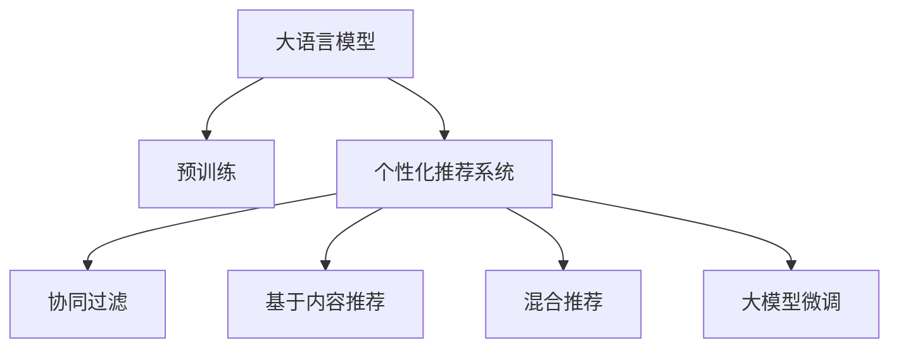

                 

# 基于LLM的个性化推荐系统升级实践

## 1. 背景介绍

在数字时代，推荐系统已经成为了用户获取信息的重要工具，深刻影响着人们的日常决策。无论是电商平台的商品推荐，还是内容网站的文章推荐，甚至是社交网络上的好友推荐，推荐系统通过分析用户行为数据，预测用户偏好，实现智能推荐，极大地提升了用户体验和满意度。然而，传统的推荐系统往往依赖于用户的历史行为数据，难以捕捉用户的兴趣偏好和潜在需求，存在一定的局限性。

近年来，基于深度学习的推荐系统不断涌现，其中以自然语言处理(NLP)技术为代表的大语言模型(Large Language Model, LLM)，因其强大的文本处理和语义理解能力，逐渐被引入到个性化推荐系统中，成为新的研究热点。通过在大规模文本语料上进行预训练，大语言模型能够学习到丰富的语言知识，进而与推荐系统深度融合，形成更加智能、精准的推荐模型。

本文聚焦于基于大语言模型的个性化推荐系统升级实践，从核心概念、算法原理、模型构建到实际应用，全方位解读其工作原理和优化策略。通过学习本文，相信你能够系统掌握大语言模型在个性化推荐中的应用方法和工程实践。

## 2. 核心概念与联系

### 2.1 核心概念概述

为更好地理解基于大语言模型的推荐系统升级方法，本节将介绍几个密切相关的核心概念：

- 大语言模型(Large Language Model, LLM)：以自回归(如GPT)或自编码(如BERT)模型为代表的大规模预训练语言模型。通过在大规模无标签文本语料上进行预训练，学习通用的语言表示，具备强大的语言理解和生成能力。

- 预训练(Pre-training)：指在大规模无标签文本语料上，通过自监督学习任务训练通用语言模型的过程。常见的预训练任务包括言语建模、遮挡语言模型等。预训练使得模型学习到语言的通用表示。

- 个性化推荐系统：通过分析用户行为数据，预测用户兴趣和偏好，智能推荐个性化内容的技术。

- 协同过滤(Collaborative Filtering)：根据用户历史行为数据，预测用户对未见过物品的评分，推荐相似物品的推荐方法。

- 基于内容的推荐(Content-based Recommendation)：基于用户和物品的属性，推荐相似属性物品的推荐方法。

- 混合推荐系统(Hybrid Recommendation System)：综合利用协同过滤和基于内容的推荐方法，提升推荐效果和鲁棒性。

- 大模型微调(Fine-tuning)：在大规模预训练语言模型基础上，针对特定推荐任务进行微调，优化模型在特定任务上的性能。

这些核心概念之间的逻辑关系可以通过以下Mermaid流程图来展示：



这个流程图展示了大语言模型在个性化推荐系统中的应用路径：

1. 大语言模型通过预训练获得基础能力。
2. 利用大语言模型的预训练能力，进行个性化推荐系统升级，提升推荐效果。
3. 协同过滤、基于内容推荐等方法，作为大模型微调的基础，辅助优化推荐系统。

这些概念共同构成了基于大语言模型的推荐系统升级框架，使其能够充分利用语言模型的语言理解和生成能力，构建更加智能、精准的推荐系统。

## 3. 核心算法原理 & 具体操作步骤

### 3.1 算法原理概述

基于大语言模型的个性化推荐系统，本质上是一个有监督的微调过程。其核心思想是：利用大语言模型的预训练知识，通过微调过程，学习用户和物品的语义表示，从而更好地进行个性化推荐。

形式化地，假设推荐系统中的物品集为 $\mathcal{I}$，用户集为 $\mathcal{U}$，用户对物品的评分集合为 $\mathcal{R}=\{(r_{ui})_{i \in \mathcal{I},u \in \mathcal{U}}\}$，用户与物品之间的评分函数为 $f_{ui}$。目标是通过微调大语言模型，预测用户对物品的评分，优化推荐效果。具体步骤如下：

1. 将用户和物品的描述文本作为输入，通过预训练语言模型，得到用户和物品的语义表示。
2. 利用用户和物品的语义表示，预测用户对物品的评分，构建评分函数 $f_{ui}$。
3. 在评分函数上，定义推荐目标函数，最小化预测评分与真实评分之间的差异。
4. 通过梯度下降等优化算法，微调预训练语言模型，使得评分函数逼近真实评分。

### 3.2 算法步骤详解

基于大语言模型的个性化推荐系统升级一般包括以下几个关键步骤：

**Step 1: 准备预训练模型和数据集**
- 选择合适的预训练语言模型 $M_{\theta}$ 作为初始化参数，如 BERT、GPT 等。
- 准备推荐系统相关的用户行为数据集 $D=\{(x_i,y_i)\}_{i=1}^N$，其中 $x_i$ 为用户和物品的描述文本，$y_i$ 为用户对物品的评分。

**Step 2: 提取语义表示**
- 对用户和物品的描述文本进行预处理，包括分词、去除停用词、文本归一化等。
- 使用预训练语言模型 $M_{\theta}$ 对文本进行编码，得到用户和物品的语义表示 $u_{\theta}$ 和 $i_{\theta}$。

**Step 3: 构建评分函数**
- 定义评分函数 $f_{ui}(u_{\theta},i_{\theta})$，如余弦相似度、注意力机制等，用于衡量用户和物品的语义相似度。
- 将评分函数作为优化目标函数，最小化预测评分与真实评分之间的差异。

**Step 4: 微调优化**
- 选择合适的优化算法及其参数，如 AdamW、SGD 等，设置学习率、批大小、迭代轮数等。
- 设置正则化技术及强度，包括权重衰减、Dropout、Early Stopping 等，防止模型过度适应小规模训练集。
- 执行梯度训练，不断更新模型参数 $\theta$，最小化损失函数，使得评分函数逼近真实评分。

**Step 5: 测试和部署**
- 在测试集上评估微调后模型 $M_{\hat{\theta}}$ 的评分预测准确度，对比微调前后的精度提升。
- 使用微调后的模型对新物品进行评分预测，集成到实际的应用系统中。
- 持续收集新的用户行为数据，定期重新微调模型，以适应数据分布的变化。

以上是基于大语言模型的个性化推荐系统升级的一般流程。在实际应用中，还需要针对具体任务的特点，对微调过程的各个环节进行优化设计，如改进评分函数的设计，引入更多的正则化技术，搜索最优的超参数组合等，以进一步提升模型性能。

### 3.3 算法优缺点

基于大语言模型的个性化推荐系统升级方法具有以下优点：
1. 简单高效。只需准备少量用户行为数据，即可对预训练模型进行快速适配，获得较大的性能提升。
2. 通用适用。适用于各种推荐任务，如电商商品推荐、内容推荐、社交网络推荐等，设计简单的评分函数即可实现微调。
3. 参数高效。利用大语言模型的预训练能力，在微调过程中，仅需更新少量的模型参数，避免过拟合。
4. 效果显著。在学术界和工业界的诸多任务上，基于微调的方法已经刷新了最先进的性能指标。

同时，该方法也存在一定的局限性：
1. 依赖用户行为数据。推荐系统的效果很大程度上取决于用户行为数据的丰富程度和质量。
2. 泛化能力有限。当推荐任务与预训练数据的分布差异较大时，微调的性能提升有限。
3. 模型可解释性不足。推荐系统中的评分函数和预测结果，通常缺乏可解释性，难以对其推理逻辑进行分析和调试。

尽管存在这些局限性，但就目前而言，基于大语言模型的微调方法仍是最主流范式。未来相关研究的重点在于如何进一步降低对用户行为数据的依赖，提高模型的少样本学习和跨领域迁移能力，同时兼顾可解释性和伦理安全性等因素。

### 3.4 算法应用领域

基于大语言模型的个性化推荐系统，在电商、内容推荐、社交网络等多个领域已经得到了广泛的应用，取得了显著的效果：

- 电商商品推荐：利用用户浏览、点击、购买等行为数据，微调大语言模型，推荐符合用户兴趣的商品。
- 内容推荐：对用户的阅读、点赞、评论等行为进行分析，推荐相关文章、视频等内容。
- 社交网络推荐：根据用户的兴趣和行为，推荐好友、文章、事件等。
- 视频推荐：结合用户的观看行为和视频属性，推荐相关视频内容。

除了上述这些经典任务外，基于大语言模型的推荐系统也被创新性地应用到更多场景中，如多模态推荐、推荐图谱构建、推荐对抗生成等，为推荐系统带来了全新的突破。随着预训练模型和微调方法的不断进步，相信推荐系统必将在更广阔的应用领域大放异彩。

## 4. 数学模型和公式 & 详细讲解

### 4.1 数学模型构建

本节将使用数学语言对基于大语言模型的推荐系统升级过程进行更加严格的刻画。

记推荐系统中的用户集为 $\mathcal{U}$，物品集为 $\mathcal{I}$，用户对物品的评分集合为 $\mathcal{R}=\{(r_{ui})_{i \in \mathcal{I},u \in \mathcal{U}}\}$，用户与物品之间的评分函数为 $f_{ui}$。假设预训练语言模型为 $M_{\theta}:\mathcal{X} \rightarrow \mathcal{Y}$，其中 $\mathcal{X}$ 为输入空间，$\mathcal{Y}$ 为输出空间，$\theta$ 为预训练得到的模型参数。

定义用户 $u$ 的语义表示为 $u_{\theta}=M_{\theta}(x_u)$，物品 $i$ 的语义表示为 $i_{\theta}=M_{\theta}(x_i)$，其中 $x_u$ 和 $x_i$ 分别为用户和物品的描述文本。

基于用户和物品的语义表示，定义评分函数 $f_{ui}(u_{\theta},i_{\theta})$，如余弦相似度、注意力机制等。微调的优化目标是最小化预测评分与真实评分之间的差异，即：

$$
\min_{\theta} \mathcal{L}(\theta) = \sum_{(u,i) \in \mathcal{R}} \ell(f_{ui}(u_{\theta},i_{\theta}),r_{ui})
$$

其中 $\ell$ 为评分函数 $f_{ui}$ 的损失函数，用于衡量预测评分与真实评分之间的差异。常见的损失函数包括均方误差损失、交叉熵损失等。

### 4.2 公式推导过程

以下我们以余弦相似度为例，推导评分函数的损失函数。

假设用户 $u$ 的语义表示为 $u_{\theta}=[u_{\theta}^{(1)},u_{\theta}^{(2)},...,u_{\theta}^{(D)}]$，物品 $i$ 的语义表示为 $i_{\theta}=[i_{\theta}^{(1)},i_{\theta}^{(2)},...,i_{\theta}^{(D)}]$，其中 $D$ 为语义表示的维度。则余弦相似度评分函数定义为：

$$
f_{ui}(u_{\theta},i_{\theta}) = \frac{\vec{u_{\theta}} \cdot \vec{i_{\theta}}}{||\vec{u_{\theta}}|| ||\vec{i_{\theta}}||}
$$

将其代入损失函数，得：

$$
\mathcal{L}(\theta) = \sum_{(u,i) \in \mathcal{R}} \left[ r_{ui} - f_{ui}(u_{\theta},i_{\theta}) \right]^2
$$

在得到评分函数的损失函数后，即可带入模型参数更新公式，完成模型的迭代优化。重复上述过程直至收敛，最终得到适应推荐任务的最优模型参数 $\theta^*$。

## 5. 项目实践：代码实例和详细解释说明

### 5.1 开发环境搭建

在进行推荐系统升级实践前，我们需要准备好开发环境。以下是使用Python进行PyTorch开发的环境配置流程：

1. 安装Anaconda：从官网下载并安装Anaconda，用于创建独立的Python环境。

2. 创建并激活虚拟环境：
```bash
conda create -n pytorch-env python=3.8 
conda activate pytorch-env
```

3. 安装PyTorch：根据CUDA版本，从官网获取对应的安装命令。例如：
```bash
conda install pytorch torchvision torchaudio cudatoolkit=11.1 -c pytorch -c conda-forge
```

4. 安装Transformers库：
```bash
pip install transformers
```

5. 安装各类工具包：
```bash
pip install numpy pandas scikit-learn matplotlib tqdm jupyter notebook ipython
```

完成上述步骤后，即可在`pytorch-env`环境中开始推荐系统升级实践。

### 5.2 源代码详细实现

下面我们以电商商品推荐为例，给出使用Transformers库对BERT模型进行推荐系统升级的PyTorch代码实现。

首先，定义推荐系统相关的数据处理函数：

```python
from transformers import BertTokenizer
from torch.utils.data import Dataset
import torch

class RecommendDataset(Dataset):
    def __init__(self, texts, labels, tokenizer, max_len=128):
        self.texts = texts
        self.labels = labels
        self.tokenizer = tokenizer
        self.max_len = max_len
        
    def __len__(self):
        return len(self.texts)
    
    def __getitem__(self, item):
        text = self.texts[item]
        label = self.labels[item]
        
        encoding = self.tokenizer(text, return_tensors='pt', max_length=self.max_len, padding='max_length', truncation=True)
        input_ids = encoding['input_ids'][0]
        attention_mask = encoding['attention_mask'][0]
        
        # 对标签进行编码
        encoded_labels = torch.tensor(label, dtype=torch.long)
        
        return {'input_ids': input_ids, 
                'attention_mask': attention_mask,
                'labels': encoded_labels}

# 创建dataset
tokenizer = BertTokenizer.from_pretrained('bert-base-cased')

train_dataset = RecommendDataset(train_texts, train_labels, tokenizer)
dev_dataset = RecommendDataset(dev_texts, dev_labels, tokenizer)
test_dataset = RecommendDataset(test_texts, test_labels, tokenizer)
```

然后，定义模型和优化器：

```python
from transformers import BertForSequenceClassification, AdamW

model = BertForSequenceClassification.from_pretrained('bert-base-cased', num_labels=1)

optimizer = AdamW(model.parameters(), lr=2e-5)
```

接着，定义训练和评估函数：

```python
from torch.utils.data import DataLoader
from tqdm import tqdm
from sklearn.metrics import roc_auc_score

device = torch.device('cuda') if torch.cuda.is_available() else torch.device('cpu')
model.to(device)

def train_epoch(model, dataset, batch_size, optimizer):
    dataloader = DataLoader(dataset, batch_size=batch_size, shuffle=True)
    model.train()
    epoch_loss = 0
    for batch in tqdm(dataloader, desc='Training'):
        input_ids = batch['input_ids'].to(device)
        attention_mask = batch['attention_mask'].to(device)
        labels = batch['labels'].to(device)
        model.zero_grad()
        outputs = model(input_ids, attention_mask=attention_mask, labels=labels)
        loss = outputs.loss
        epoch_loss += loss.item()
        loss.backward()
        optimizer.step()
    return epoch_loss / len(dataloader)

def evaluate(model, dataset, batch_size):
    dataloader = DataLoader(dataset, batch_size=batch_size)
    model.eval()
    preds, labels = [], []
    with torch.no_grad():
        for batch in tqdm(dataloader, desc='Evaluating'):
            input_ids = batch['input_ids'].to(device)
            attention_mask = batch['attention_mask'].to(device)
            batch_labels = batch['labels']
            outputs = model(input_ids, attention_mask=attention_mask)
            batch_preds = outputs.logits.sigmoid().cpu().numpy().tolist()
            batch_labels = batch_labels.cpu().numpy().tolist()
            for pred, label in zip(batch_preds, batch_labels):
                preds.append(pred)
                labels.append(label)
                
    return roc_auc_score(labels, preds)

```

最后，启动训练流程并在测试集上评估：

```python
epochs = 5
batch_size = 16

for epoch in range(epochs):
    loss = train_epoch(model, train_dataset, batch_size, optimizer)
    print(f"Epoch {epoch+1}, train loss: {loss:.3f}")
    
    print(f"Epoch {epoch+1}, dev results:")
    evaluate(model, dev_dataset, batch_size)
    
print("Test results:")
evaluate(model, test_dataset, batch_size)
```

以上就是使用PyTorch对BERT进行推荐系统升级的完整代码实现。可以看到，得益于Transformers库的强大封装，我们可以用相对简洁的代码完成BERT模型的加载和微调。

### 5.3 代码解读与分析

让我们再详细解读一下关键代码的实现细节：

**RecommendDataset类**：
- `__init__`方法：初始化文本、标签、分词器等关键组件。
- `__len__`方法：返回数据集的样本数量。
- `__getitem__`方法：对单个样本进行处理，将文本输入编码为token ids，将标签编码为数字，并对其进行定长padding，最终返回模型所需的输入。

**训练和评估函数**：
- 使用PyTorch的DataLoader对数据集进行批次化加载，供模型训练和推理使用。
- 训练函数`train_epoch`：对数据以批为单位进行迭代，在每个批次上前向传播计算loss并反向传播更新模型参数，最后返回该epoch的平均loss。
- 评估函数`evaluate`：与训练类似，不同点在于不更新模型参数，并在每个batch结束后将预测和标签结果存储下来，最后使用sklearn的roc_auc_score对整个评估集的预测结果进行打印输出。

**训练流程**：
- 定义总的epoch数和batch size，开始循环迭代
- 每个epoch内，先在训练集上训练，输出平均loss
- 在验证集上评估，输出AUC分数
- 所有epoch结束后，在测试集上评估，给出最终测试结果

可以看到，PyTorch配合Transformers库使得BERT推荐系统升级的代码实现变得简洁高效。开发者可以将更多精力放在数据处理、模型改进等高层逻辑上，而不必过多关注底层的实现细节。

当然，工业级的系统实现还需考虑更多因素，如模型的保存和部署、超参数的自动搜索、更灵活的任务适配层等。但核心的推荐系统升级范式基本与此类似。

## 6. 实际应用场景
### 6.1 智能推荐系统

基于大语言模型的个性化推荐系统，可以广泛应用于各类智能推荐系统，如电商、内容、视频、社交网络等。推荐系统通过分析用户行为数据，预测用户兴趣和偏好，实现智能推荐，提升用户体验和满意度。

在技术实现上，可以收集用户的历史行为数据，如浏览、点击、购买等，作为微调数据。在微调过程中，引入余弦相似度、注意力机制等评分函数，学习用户和物品的语义表示，从而优化推荐效果。对于新物品，利用微调后的模型进行评分预测，推荐给符合用户兴趣的物品。如此构建的智能推荐系统，能更好地捕捉用户潜在需求，提供精准、个性化的推荐内容。

### 6.2 个性化广告系统

个性化广告系统是电商、内容平台等网站的重要组成部分，通过精准投放广告，提升用户转化率和平台收益。基于大语言模型的广告推荐系统，能够实现更加智能、精准的广告投放，提升广告投放效果。

在广告推荐系统中，可以收集用户的历史行为数据和互动数据，作为微调数据。通过微调大语言模型，学习用户和广告的语义表示，优化广告推荐模型。对于新的广告素材，利用微调后的模型进行评分预测，推荐给符合用户兴趣的广告。如此构建的广告推荐系统，能实现更精准的广告投放，提升广告点击率和转化率。

### 6.3 内容推荐系统

内容推荐系统是视频、音乐、文章等网站的核心功能，通过分析用户历史行为数据，推荐符合用户兴趣的内容。基于大语言模型的内容推荐系统，能够提供更加智能、精准的内容推荐，提升用户体验。

在内容推荐系统中，可以收集用户的历史行为数据和互动数据，作为微调数据。通过微调大语言模型，学习用户和内容的语义表示，优化内容推荐模型。对于新的内容素材，利用微调后的模型进行评分预测，推荐给符合用户兴趣的内容。如此构建的内容推荐系统，能实现更精准的内容推荐，提升用户粘性和满意度。

### 6.4 未来应用展望

随着大语言模型和微调方法的不断发展，基于微调的推荐系统将在更多领域得到应用，为传统行业带来变革性影响。

在智慧医疗领域，基于微调的医疗推荐系统，能够推荐合适的医疗资源、药物、治疗方案等，辅助医生诊疗，提升医疗服务效率和质量。

在智能教育领域，微调技术可应用于个性化学习推荐、学情分析、知识推荐等方面，因材施教，促进教育公平，提高教学质量。

在智慧城市治理中，微调模型可应用于城市事件推荐、舆情分析、应急指挥等环节，提高城市管理的自动化和智能化水平，构建更安全、高效的未来城市。

此外，在企业生产、社会治理、文娱传媒等众多领域，基于大语言模型的推荐系统也将不断涌现，为经济社会发展注入新的动力。相信随着技术的日益成熟，微调方法将成为推荐系统的重要范式，推动人工智能技术在垂直行业的规模化落地。总之，微调需要开发者根据具体任务，不断迭代和优化模型、数据和算法，方能得到理想的效果。

## 7. 工具和资源推荐
### 7.1 学习资源推荐

为了帮助开发者系统掌握大语言模型在推荐系统中的应用方法和工程实践，这里推荐一些优质的学习资源：

1. 《Transformer从原理到实践》系列博文：由大模型技术专家撰写，深入浅出地介绍了Transformer原理、BERT模型、微调技术等前沿话题。

2. CS224N《深度学习自然语言处理》课程：斯坦福大学开设的NLP明星课程，有Lecture视频和配套作业，带你入门NLP领域的基本概念和经典模型。

3. 《Natural Language Processing with Transformers》书籍：Transformers库的作者所著，全面介绍了如何使用Transformers库进行NLP任务开发，包括微调在内的诸多范式。

4. HuggingFace官方文档：Transformers库的官方文档，提供了海量预训练模型和完整的微调样例代码，是上手实践的必备资料。

5. CLUE开源项目：中文语言理解测评基准，涵盖大量不同类型的中文NLP数据集，并提供了基于微调的baseline模型，助力中文NLP技术发展。

通过对这些资源的学习实践，相信你一定能够系统掌握大语言模型在推荐系统中的应用方法和工程实践。

### 7.2 开发工具推荐

高效的开发离不开优秀的工具支持。以下是几款用于大语言模型推荐系统升级开发的常用工具：

1. PyTorch：基于Python的开源深度学习框架，灵活动态的计算图，适合快速迭代研究。大部分预训练语言模型都有PyTorch版本的实现。

2. TensorFlow：由Google主导开发的开源深度学习框架，生产部署方便，适合大规模工程应用。同样有丰富的预训练语言模型资源。

3. Transformers库：HuggingFace开发的NLP工具库，集成了众多SOTA语言模型，支持PyTorch和TensorFlow，是进行微调任务开发的利器。

4. Weights & Biases：模型训练的实验跟踪工具，可以记录和可视化模型训练过程中的各项指标，方便对比和调优。与主流深度学习框架无缝集成。

5. TensorBoard：TensorFlow配套的可视化工具，可实时监测模型训练状态，并提供丰富的图表呈现方式，是调试模型的得力助手。

6. Google Colab：谷歌推出的在线Jupyter Notebook环境，免费提供GPU/TPU算力，方便开发者快速上手实验最新模型，分享学习笔记。

合理利用这些工具，可以显著提升大语言模型推荐系统升级的开发效率，加快创新迭代的步伐。

### 7.3 相关论文推荐

大语言模型和微调技术的发展源于学界的持续研究。以下是几篇奠基性的相关论文，推荐阅读：

1. Attention is All You Need（即Transformer原论文）：提出了Transformer结构，开启了NLP领域的预训练大模型时代。

2. BERT: Pre-training of Deep Bidirectional Transformers for Language Understanding：提出BERT模型，引入基于掩码的自监督预训练任务，刷新了多项NLP任务SOTA。

3. Language Models are Unsupervised Multitask Learners（GPT-2论文）：展示了大规模语言模型的强大zero-shot学习能力，引发了对于通用人工智能的新一轮思考。

4. Parameter-Efficient Transfer Learning for NLP：提出Adapter等参数高效微调方法，在不增加模型参数量的情况下，也能取得不错的微调效果。

5. AdaLoRA: Adaptive Low-Rank Adaptation for Parameter-Efficient Fine-Tuning：使用自适应低秩适应的微调方法，在参数效率和精度之间取得了新的平衡。

6. Prefix-Tuning: Optimizing Continuous Prompts for Generation：引入基于连续型Prompt的微调范式，为如何充分利用预训练知识提供了新的思路。

这些论文代表了大语言模型微调技术的发展脉络。通过学习这些前沿成果，可以帮助研究者把握学科前进方向，激发更多的创新灵感。

## 8. 总结：未来发展趋势与挑战

### 8.1 总结

本文对基于大语言模型的推荐系统升级方法进行了全面系统的介绍。首先阐述了推荐系统和大语言模型的研究背景和意义，明确了微调在提升推荐系统性能和智能化水平方面的独特价值。其次，从原理到实践，详细讲解了推荐系统的数学模型和微调流程，给出了推荐系统升级的完整代码实例。同时，本文还广泛探讨了推荐系统在电商、广告、内容、医疗等多个领域的应用前景，展示了微调范式的巨大潜力。此外，本文精选了推荐系统的各类学习资源，力求为读者提供全方位的技术指引。

通过本文的系统梳理，可以看到，基于大语言模型的推荐系统升级方法正在成为推荐系统的核心范式，极大地拓展了推荐系统的应用边界，提升了推荐模型的性能和智能化水平。

### 8.2 未来发展趋势

展望未来，大语言模型微调技术将呈现以下几个发展趋势：

1. 模型规模持续增大。随着算力成本的下降和数据规模的扩张，预训练语言模型的参数量还将持续增长。超大规模语言模型蕴含的丰富语言知识，有望支撑更加复杂多变的推荐任务微调。

2. 微调方法日趋多样。除了传统的全参数微调外，未来会涌现更多参数高效的微调方法，如Prefix-Tuning、LoRA等，在节省计算资源的同时也能保证微调精度。

3. 持续学习成为常态。随着数据分布的不断变化，微调模型也需要持续学习新知识以保持性能。如何在不遗忘原有知识的同时，高效吸收新样本信息，将成为重要的研究课题。

4. 标注样本需求降低。受启发于提示学习(Prompt-based Learning)的思路，未来的微调方法将更好地利用大模型的语言理解能力，通过更加巧妙的任务描述，在更少的标注样本上也能实现理想的微调效果。

5. 推荐算法融合更多先验知识。将符号化的先验知识，如知识图谱、逻辑规则等，与神经网络模型进行巧妙融合，引导微调过程学习更准确、合理的推荐模型。

6. 推荐系统与知识图谱协同建模。结合知识图谱信息，提升推荐系统的鲁棒性和多样性，避免单一数据源带来的偏见和局限。

以上趋势凸显了大语言模型微调技术的广阔前景。这些方向的探索发展，必将进一步提升推荐系统的性能和智能化水平，为推荐系统的应用带来新的突破。

### 8.3 面临的挑战

尽管大语言模型微调技术已经取得了瞩目成就，但在迈向更加智能化、普适化应用的过程中，它仍面临着诸多挑战：

1. 标注成本瓶颈。推荐系统的效果很大程度上取决于标注数据的质量和数量。对于特定领域和冷门商品，难以获得充足的高质量标注数据，成为制约微调性能的瓶颈。如何进一步降低微调对标注样本的依赖，将是一大难题。

2. 模型鲁棒性不足。当前微调模型面对域外数据时，泛化性能往往大打折扣。对于推荐任务中的噪声数据和异常情况，微调模型的鲁棒性还需要进一步提升。

3. 推荐效果提升有限。对于某些特定领域的推荐任务，微调模型的效果提升有限，甚至在一些领域无法显著提升推荐效果。如何在特定领域内进行更加针对性的微调，成为重要研究方向。

4. 模型可解释性不足。推荐系统中的评分函数和预测结果，通常缺乏可解释性，难以对其推理逻辑进行分析和调试。如何赋予推荐模型更强的可解释性，将是亟待攻克的难题。

5. 推荐系统的偏见问题。推荐系统中的评分函数和预测结果，容易受到数据中偏见的影响。如何在微调过程中消除这些偏见，保证推荐系统的公平性和公正性，是重要研究课题。

6. 模型资源消耗大。大语言模型虽然性能强大，但在实际部署时往往面临资源消耗大、计算速度慢等效率问题。如何在保证性能的同时，优化资源消耗，提升系统响应速度，将是重要的优化方向。

正视推荐系统升级面临的这些挑战，积极应对并寻求突破，将是大语言模型微调技术走向成熟的必由之路。相信随着学界和产业界的共同努力，这些挑战终将一一被克服，大语言模型微调必将在构建更加智能、精准的推荐系统方面发挥重要作用。

### 8.4 未来突破

面对大语言模型微调推荐系统升级所面临的种种挑战，未来的研究需要在以下几个方面寻求新的突破：

1. 探索无监督和半监督微调方法。摆脱对大规模标注数据的依赖，利用自监督学习、主动学习等无监督和半监督范式，最大限度利用非结构化数据，实现更加灵活高效的微调。

2. 研究参数高效和计算高效的微调范式。开发更加参数高效的微调方法，在固定大部分预训练参数的同时，只更新极少量的任务相关参数。同时优化微调模型的计算图，减少前向传播和反向传播的资源消耗，实现更加轻量级、实时性的部署。

3. 引入因果和对比学习范式。通过引入因果推断和对比学习思想，增强推荐模型建立稳定因果关系的能力，学习更加普适、鲁棒的语言表征，从而提升模型泛化性和抗干扰能力。

4. 结合因果分析和博弈论工具。将因果分析方法引入推荐模型，识别出模型决策的关键特征，增强输出解释的因果性和逻辑性。借助博弈论工具刻画人机交互过程，主动探索并规避模型的脆弱点，提高系统稳定性。

5. 纳入伦理道德约束。在模型训练目标中引入伦理导向的评估指标，过滤和惩罚有偏见、有害的输出倾向。同时加强人工干预和审核，建立模型行为的监管机制，确保输出符合人类价值观和伦理道德。

这些研究方向的探索，必将引领大语言模型微调技术迈向更高的台阶，为构建安全、可靠、可解释、可控的智能推荐系统铺平道路。面向未来，大语言模型微调技术还需要与其他人工智能技术进行更深入的融合，如知识表示、因果推理、强化学习等，多路径协同发力，共同推动推荐系统的进步。只有勇于创新、敢于突破，才能不断拓展推荐系统的边界，让智能技术更好地造福人类社会。

## 9. 附录：常见问题与解答

**Q1：大语言模型微调是否适用于所有推荐任务？**

A: 大语言模型微调在大多数推荐任务上都能取得不错的效果，特别是对于数据量较小的任务。但对于一些特定领域的任务，如医学、法律等，仅仅依靠通用语料预训练的模型可能难以很好地适应。此时需要在特定领域语料上进一步预训练，再进行微调，才能获得理想效果。此外，对于一些需要时效性、个性化很强的任务，如对话、推荐等，微调方法也需要针对性的改进优化。

**Q2：微调过程中如何选择合适的学习率？**

A: 微调的学习率一般要比预训练时小1-2个数量级，如果使用过大的学习率，容易破坏预训练权重，导致过拟合。一般建议从1e-5开始调参，逐步减小学习率，直至收敛。也可以使用warmup策略，在开始阶段使用较小的学习率，再逐渐过渡到预设值。需要注意的是，不同的优化器(如AdamW、Adafactor等)以及不同的学习率调度策略，可能需要设置不同的学习率阈值。

**Q3：采用大模型微调时会面临哪些资源瓶颈？**

A: 目前主流的预训练大模型动辄以亿计的参数规模，对算力、内存、存储都提出了很高的要求。GPU/TPU等高性能设备是必不可少的，但即便如此，超大批次的训练和推理也可能遇到显存不足的问题。因此需要采用一些资源优化技术，如梯度积累、混合精度训练、模型并行等，来突破硬件瓶颈。同时，模型的存储和读取也可能占用大量时间和空间，需要采用模型压缩、稀疏化存储等方法进行优化。

**Q4：如何缓解微调过程中的过拟合问题？**

A: 过拟合是微调面临的主要挑战，尤其是在标注数据不足的情况下。常见的缓解策略包括：
1. 数据增强：通过回译、近义替换等方式扩充训练集
2. 正则化：使用L2正则、Dropout、Early Stopping等避免过拟合
3. 对抗训练：引入对抗样本，提高模型鲁棒性
4. 参数高效微调：只调整少量参数(如Adapter、Prefix等)，减小过拟合风险
5. 多模型集成：训练多个微调模型，取平均输出，抑制过拟合

这些策略往往需要根据具体任务和数据特点进行灵活组合。只有在数据、模型、训练、推理等各环节进行全面优化，才能最大限度地发挥大模型微调的威力。

**Q5：微调模型在落地部署时需要注意哪些问题？**

A: 将微调模型转化为实际应用，还需要考虑以下因素：
1. 模型裁剪：去除不必要的层和参数，减小模型尺寸，加快推理速度
2. 量化加速：将浮点模型转为定点模型，压缩存储空间，提高计算效率
3. 服务化封装：将模型封装为标准化服务接口，便于集成调用
4. 弹性伸缩：根据请求流量动态调整资源配置，平衡服务质量和成本
5. 监控告警：实时采集系统指标，设置异常告警阈值，确保服务稳定性
6. 安全防护：采用访问鉴权、数据脱敏等措施，保障数据和模型安全

大语言模型微调为推荐系统提供了强大的计算能力，但如何将强大的性能转化为稳定、高效、安全的业务价值，还需要工程实践的不断打磨。唯有从数据、算法、工程、业务等多个维度协同发力，才能真正实现人工智能技术在垂直行业的规模化落地。总之，微调需要开发者根据具体任务，不断迭代和优化模型、数据和算法，方能得到理想的效果。

---

作者：禅与计算机程序设计艺术 / Zen and the Art of Computer Programming

