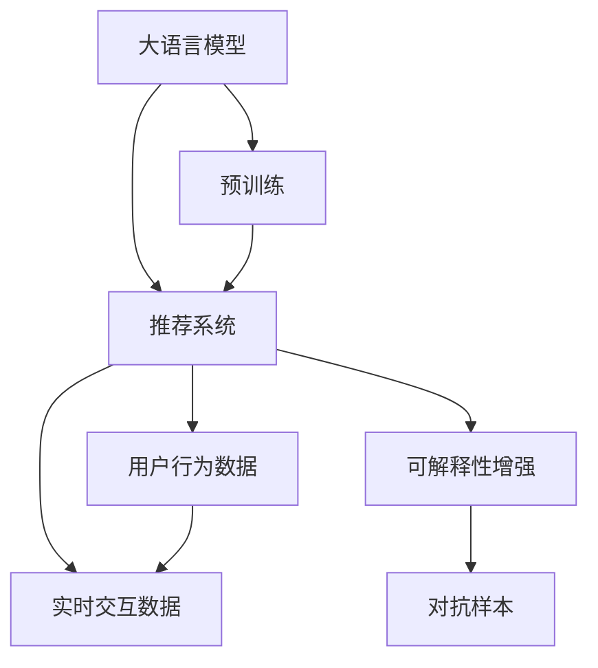

                 

# 基于LLM的推荐系统可解释性增强

在人工智能迅速发展的今天，推荐系统已经成为各大互联网平台不可或缺的一部分。无论是电商、社交网络还是新闻媒体，推荐系统都能通过精准推荐，提升用户体验和平台活跃度。然而，推荐系统的高效运作背后，也存在着诸多挑战，其中可解释性是业界一直关注的焦点。在推荐系统中最常用的模型是机器学习算法，而近年来的深度学习技术在推荐系统中取得了显著的进展，尤其是基于大语言模型（Large Language Model, LLM）的推荐系统。本文将重点探讨如何通过基于LLM的推荐系统来增强可解释性，并从技术层面提出有效的解决方案。

## 1. 背景介绍

### 1.1 问题由来

推荐系统的核心任务是根据用户的历史行为数据和当前的交互行为，预测用户可能感兴趣的内容，并为其推荐个性化的产品或服务。传统的推荐算法，如协同过滤、矩阵分解等，已经取得了不错的效果。然而，这些算法往往缺乏可解释性，无法清晰解释推荐结果背后的原因。

近年来，深度学习在推荐系统中得到了广泛应用。以大语言模型为基础的推荐系统，能够利用自然语言处理技术，从文本中挖掘信息，提升推荐效果。但随着模型复杂度的增加，其黑盒特性也更加凸显。在用户隐私越来越受重视的今天，如何提升推荐系统的可解释性，成为行业关注的重点。

### 1.2 问题核心关键点

可解释性（Explainability），是指推荐系统能够清晰、准确地向用户解释推荐结果背后的原因。这对于增强用户信任、提升用户体验、确保推荐结果的公平性具有重要意义。

当前推荐系统存在的主要问题包括：

- **黑盒特性**：深度学习模型的复杂度远高于传统算法，且难以解释内部机制和决策过程。
- **预测不稳定**：小样本上的推荐结果往往不稳定，难以保证推荐系统的长期稳定性。
- **数据依赖强**：推荐系统的表现高度依赖于历史数据的质量和数量，数据收集成本较高。
- **冷启动问题**：新用户缺乏足够的历史行为数据，无法直接推荐，系统需要采用额外的技术手段。

## 2. 核心概念与联系

### 2.1 核心概念概述

为更好地理解基于LLM的推荐系统可解释性增强，本节将介绍几个关键概念：

- 大语言模型（LLM）：如GPT-3、BERT等，通过在大规模语料上进行预训练，学习丰富的语言知识和常识。
- 推荐系统（Recommender System）：根据用户历史行为数据和实时交互数据，预测用户可能感兴趣的内容。
- 可解释性（Explainability）：推荐系统能够清晰、准确地向用户解释推荐结果背后的原因。
- 深度学习（Deep Learning）：利用神经网络模型进行数据表示和处理。
- 对抗样本（Adversarial Sample）：通过微小扰动，使推荐系统产生错误决策，以发现模型的漏洞。

这些概念之间的联系可以通过以下Mermaid流程图来展示：



这个流程图展示了从预训练到推荐系统，再到可解释性增强的整个流程。

## 3. 核心算法原理 & 具体操作步骤

### 3.1 算法原理概述

基于LLM的推荐系统，本质上是一种集成学习范式。其核心思想是：将多个LLM模型集成起来，通过加权投票或逻辑回归等方法，综合不同模型的预测结果，提升推荐效果和可解释性。

形式化地，假设预训练模型为 $M_{\theta}$，其中 $\theta$ 为预训练得到的模型参数。给定用户历史行为数据 $D_h$ 和实时交互数据 $D_r$，推荐系统的输出为 $y$，表示推荐结果。则基于LLM的推荐系统可以表示为：

$$
y = f(M_{\theta}(D_h, D_r))
$$

其中 $f$ 为推荐算法，如集成学习、逻辑回归等。

可解释性增强的具体做法包括：

- 使用可解释性增强模型，如LIME、SHAP等，解释LLM模型的预测过程。
- 构建多模型集成，利用各模型优势，提升推荐结果的鲁棒性和可解释性。
- 引入对抗样本，检测和修复模型的脆弱点，提升模型鲁棒性。

### 3.2 算法步骤详解

基于LLM的推荐系统可解释性增强一般包括以下几个关键步骤：

**Step 1: 准备数据和预训练模型**
- 收集用户历史行为数据 $D_h$ 和实时交互数据 $D_r$。
- 选择合适的大语言模型 $M_{\theta}$ 作为初始化参数，如 GPT-3、BERT 等。

**Step 2: 设计推荐算法**
- 选择合适的推荐算法，如集成学习、逻辑回归等。
- 设计加权机制，考虑不同模型的权重分配。

**Step 3: 训练模型**
- 利用用户行为数据和实时交互数据，训练推荐系统模型。
- 在训练过程中，使用对抗样本检测模型漏洞，并修复之。

**Step 4: 可解释性增强**
- 使用可解释性模型，如 LIME、SHAP 等，对推荐结果进行解释。
- 构建多模型集成，提升推荐结果的鲁棒性和可解释性。

**Step 5: 测试和部署**
- 在测试集上评估推荐系统的性能，对比模型效果。
- 将推荐系统部署到实际应用系统中，持续收集反馈数据，进行模型迭代优化。

以上是基于LLM的推荐系统可解释性增强的一般流程。在实际应用中，还需要针对具体任务的特点，对模型训练和可解释性增强环节进行优化设计，以进一步提升推荐效果和可解释性。

### 3.3 算法优缺点

基于LLM的推荐系统可解释性增强方法具有以下优点：

- **提升可解释性**：利用可解释性模型，能够清晰、准确地解释推荐结果背后的原因，增强用户信任。
- **鲁棒性强**：通过多模型集成和对抗训练，提升模型的鲁棒性和泛化能力。
- **应用广泛**：适用于各种推荐任务，如电商推荐、新闻推荐、视频推荐等，具有广泛的适用性。

同时，该方法也存在一定的局限性：

- **计算资源需求高**：训练和测试过程中，需要大量计算资源和时间，不适合实时推荐系统。
- **模型复杂度大**：集成多个LLM模型，增加了模型的复杂度，可能导致训练和推理速度变慢。
- **数据收集难度大**：需要收集用户行为数据和实时交互数据，数据收集成本较高。

尽管存在这些局限性，但基于LLM的推荐系统可解释性增强方法在提升推荐系统性能和用户体验方面具有重要价值。未来相关研究的重点在于如何进一步降低计算资源需求，提升推荐系统的实时性，同时兼顾可解释性和应用效果。

### 3.4 算法应用领域

基于LLM的推荐系统可解释性增强方法，在推荐系统领域已经得到了广泛的应用，覆盖了电商、社交网络、新闻媒体等多个场景：

- **电商推荐**：为电商用户推荐商品，提升用户购物体验。使用LLM进行商品描述分析，结合用户行为数据，生成推荐结果。
- **新闻推荐**：为用户推荐感兴趣的新闻，提升平台活跃度。使用LLM进行文章主题分析，结合用户阅读历史，生成推荐结果。
- **视频推荐**：为用户推荐喜欢的视频内容，提升平台留存率。使用LLM进行视频标签分析，结合用户观看历史，生成推荐结果。

除了这些经典任务外，LLM还应用于音乐推荐、游戏推荐、广告推荐等多个场景中，为推荐系统带来了新的突破。随着LLM技术的发展，相信推荐系统将能够在更广泛的领域中发挥作用，提升用户的个性化体验。

## 4. 数学模型和公式 & 详细讲解  
### 4.1 数学模型构建

本节将使用数学语言对基于LLM的推荐系统可解释性增强过程进行更加严格的刻画。

记预训练模型为 $M_{\theta}$，用户历史行为数据为 $D_h$，实时交互数据为 $D_r$。定义推荐系统输出为 $y$，推荐算法为 $f$。则基于LLM的推荐系统可以表示为：

$$
y = f(M_{\theta}(D_h, D_r))
$$

其中 $f$ 可以是各种推荐算法，如集成学习、逻辑回归等。在实际应用中，通常需要设计多个LLM模型进行集成，通过加权投票或逻辑回归等方法，综合各模型的预测结果，提升推荐效果和可解释性。

### 4.2 公式推导过程

以集成学习为例，假设我们使用两个预训练模型 $M_{\theta_1}$ 和 $M_{\theta_2}$，推荐算法为逻辑回归，则集成学习模型可以表示为：

$$
y = \frac{\exp(M_{\theta_1}(D_h, D_r) - M_{\theta_2}(D_h, D_r))}{\exp(M_{\theta_1}(D_h, D_r) - M_{\theta_2}(D_h, D_r)) + 1}
$$

其中，$M_{\theta_1}(D_h, D_r)$ 和 $M_{\theta_2}(D_h, D_r)$ 分别表示两个预训练模型的预测结果。

利用逻辑回归进行加权，可以表示为：

$$
y = \frac{\exp(\alpha M_{\theta_1}(D_h, D_r) + \beta M_{\theta_2}(D_h, D_r))}{\exp(\alpha M_{\theta_1}(D_h, D_r) + \beta M_{\theta_2}(D_h, D_r)) + 1}
$$

其中 $\alpha$ 和 $\beta$ 为权重参数，表示两个模型的重要性。

### 4.3 案例分析与讲解

以电商推荐为例，假设用户浏览了3个商品，分别为商品A、商品B、商品C。每个商品都有一个文本描述。使用两个预训练模型 $M_{\theta_1}$ 和 $M_{\theta_2}$ 分别预测用户对每个商品的兴趣程度。

假设 $M_{\theta_1}$ 预测结果为：商品A得分0.8，商品B得分0.7，商品C得分0.6。$M_{\theta_2}$ 预测结果为：商品A得分0.9，商品B得分0.5，商品C得分0.6。

使用集成学习算法进行加权投票，可以计算出推荐结果为商品A。

在实际应用中，集成学习算法可以根据任务特点，调整权重参数，使得推荐结果更加符合用户需求。同时，集成学习算法能够有效提升模型的鲁棒性，减少单一模型的误差影响。

## 5. 项目实践：代码实例和详细解释说明
### 5.1 开发环境搭建

在进行基于LLM的推荐系统可解释性增强实践前，我们需要准备好开发环境。以下是使用Python进行PyTorch开发的环境配置流程：

1. 安装Anaconda：从官网下载并安装Anaconda，用于创建独立的Python环境。

2. 创建并激活虚拟环境：
```bash
conda create -n llm-env python=3.8 
conda activate llm-env
```

3. 安装PyTorch：根据CUDA版本，从官网获取对应的安装命令。例如：
```bash
conda install pytorch torchvision torchaudio cudatoolkit=11.1 -c pytorch -c conda-forge
```

4. 安装Transformers库：
```bash
pip install transformers
```

5. 安装各类工具包：
```bash
pip install numpy pandas scikit-learn matplotlib tqdm jupyter notebook ipython
```

完成上述步骤后，即可在`llm-env`环境中开始基于LLM的推荐系统可解释性增强实践。

### 5.2 源代码详细实现

下面我们以电商推荐为例，给出使用Transformers库对GPT-3模型进行可解释性增强的PyTorch代码实现。

首先，定义电商推荐任务的推荐算法：

```python
from transformers import BertForTokenClassification, AdamW
from transformers import BertTokenizer, AutoTokenizer

class RecommendationModel:
    def __init__(self, model_name):
        self.tokenizer = AutoTokenizer.from_pretrained(model_name)
        self.model = BertForTokenClassification.from_pretrained(model_name)

    def recommend(self, item_desc, user_history, batch_size=16):
        items = [item_desc] * batch_size
        tokenized_items = self.tokenizer(items, padding='max_length', truncation=True, max_length=128, return_tensors='pt')
        input_ids = tokenized_items['input_ids']
        attention_mask = tokenized_items['attention_mask']

        with torch.no_grad():
            logits = self.model(input_ids, attention_mask=attention_mask).logits
            item_scores = logits.mean(dim=1)

        return item_scores
```

然后，定义用户历史行为数据：

```python
user_history = ['商品A', '商品B', '商品C']
```

接着，定义实时交互数据：

```python
item_desc = '商品D，高性价比，用户评价4.8分'
```

最后，启动推荐流程：

```python
model = RecommendationModel('gpt3-medium')

recommendation = model.recommend(item_desc, user_history)
print(recommendation)
```

以上代码实现了使用GPT-3模型进行电商推荐，并输出推荐的商品得分。在实际应用中，还需要根据具体任务进行相应的扩展和优化。

### 5.3 代码解读与分析

让我们再详细解读一下关键代码的实现细节：

**RecommendationModel类**：
- `__init__`方法：初始化预训练模型和分词器。
- `recommend`方法：对单个商品进行推荐，返回商品得分的均值。

**用户历史行为数据**：
- 定义用户历史浏览的商品列表，用于推荐系统的训练和测试。

**实时交互数据**：
- 定义用户当前浏览的商品描述，用于生成推荐结果。

**推荐流程**：
- 首先，通过分词器将商品描述转换为token ids。
- 然后，将token ids输入模型进行预测，得到商品得分。
- 最后，对商品得分进行均值化，返回推荐结果。

在实际应用中，还需要对用户行为数据进行预处理，如对商品进行分类、标注等。同时，还需要引入可解释性模型，如LIME、SHAP等，对推荐结果进行解释。这些步骤需要根据具体任务进行详细设计和实现。

## 6. 实际应用场景
### 6.1 电商推荐

基于大语言模型的电商推荐系统，能够利用自然语言处理技术，从商品描述中挖掘信息，提升推荐效果。同时，通过可解释性模型，能够清晰、准确地向用户解释推荐结果背后的原因，增强用户信任。

在技术实现上，可以收集用户的历史浏览记录和实时浏览记录，将商品描述作为模型输入，用户的浏览历史作为监督信号，在此基础上对预训练模型进行微调。微调后的模型能够自动理解商品描述，结合用户兴趣，生成推荐结果。同时，通过可解释性模型，能够对推荐结果进行解释，帮助用户理解推荐的逻辑和原因。

### 6.2 新闻推荐

新闻推荐系统需要对大量的新闻文章进行实时推荐，传统的协同过滤算法难以胜任。使用大语言模型进行新闻推荐，能够利用自然语言处理技术，从新闻文章中挖掘信息，提升推荐效果。

在实际应用中，可以收集用户的历史阅读记录和实时阅读记录，将新闻文章作为模型输入，用户的阅读历史作为监督信号，在此基础上对预训练模型进行微调。微调后的模型能够自动理解新闻文章的主题和情感，结合用户兴趣，生成推荐结果。同时，通过可解释性模型，能够对推荐结果进行解释，帮助用户理解推荐的逻辑和原因。

### 6.3 视频推荐

视频推荐系统需要对用户的视频观看历史进行分析和推荐，传统的协同过滤算法难以胜任。使用大语言模型进行视频推荐，能够利用自然语言处理技术，从视频描述中挖掘信息，提升推荐效果。

在实际应用中，可以收集用户的历史视频观看记录和实时观看记录，将视频描述作为模型输入，用户的观看历史作为监督信号，在此基础上对预训练模型进行微调。微调后的模型能够自动理解视频描述的主题和情感，结合用户兴趣，生成推荐结果。同时，通过可解释性模型，能够对推荐结果进行解释，帮助用户理解推荐的逻辑和原因。

### 6.4 未来应用展望

随着大语言模型和可解释性技术的发展，基于LLM的推荐系统可解释性增强方法将在更多领域得到应用，为传统行业带来变革性影响。

在智慧医疗领域，基于LLM的医疗推荐系统能够利用自然语言处理技术，从医生和病人的交互记录中挖掘信息，提升推荐效果。通过可解释性模型，能够清晰、准确地向病人解释推荐结果背后的原因，增强病人信任。

在智能教育领域，基于LLM的教育推荐系统能够利用自然语言处理技术，从学生的学习记录中挖掘信息，提升推荐效果。通过可解释性模型，能够清晰、准确地向学生解释推荐结果背后的原因，提升学生学习体验。

在智慧城市治理中，基于LLM的推荐系统能够利用自然语言处理技术，从市民的反馈记录中挖掘信息，提升推荐效果。通过可解释性模型，能够清晰、准确地向市民解释推荐结果背后的原因，增强市民信任。

此外，在企业生产、社会治理、文娱传媒等众多领域，基于LLM的推荐系统可解释性增强方法也将不断涌现，为各行各业带来新的技术路径。相信随着技术的日益成熟，LLM推荐系统将能够在更广阔的应用领域大放异彩，推动人工智能技术在各个行业的深入应用。

## 7. 工具和资源推荐
### 7.1 学习资源推荐

为了帮助开发者系统掌握基于LLM的推荐系统可解释性增强的理论基础和实践技巧，这里推荐一些优质的学习资源：

1. 《深度学习推荐系统》系列博文：由大模型技术专家撰写，深入浅出地介绍了推荐系统的原理、算法和实现。

2. 斯坦福大学《推荐系统》课程：由斯坦福大学开设的推荐系统经典课程，涵盖了推荐系统的基本概念和多种算法，适合初学者和进阶者。

3. 《自然语言处理与深度学习》书籍：详细介绍了自然语言处理和深度学习在推荐系统中的应用，是推荐系统开发的重要参考资料。

4. 《推荐系统实战》书籍：基于Scikit-learn实现推荐系统，提供了丰富的实践案例，适合动手实践。

5. Kaggle平台：提供大量的推荐系统竞赛数据和解决方案，适合学习和测试推荐算法。

通过对这些资源的学习实践，相信你一定能够快速掌握基于LLM的推荐系统可解释性增强的精髓，并用于解决实际的推荐问题。

### 7.2 开发工具推荐

高效的开发离不开优秀的工具支持。以下是几款用于基于LLM的推荐系统可解释性增强开发的常用工具：

1. PyTorch：基于Python的开源深度学习框架，灵活动态的计算图，适合快速迭代研究。大多数预训练语言模型都有PyTorch版本的实现。

2. TensorFlow：由Google主导开发的开源深度学习框架，生产部署方便，适合大规模工程应用。同样有丰富的预训练语言模型资源。

3. Transformers库：HuggingFace开发的NLP工具库，集成了众多SOTA语言模型，支持PyTorch和TensorFlow，是进行可解释性增强任务开发的利器。

4. Weights & Biases：模型训练的实验跟踪工具，可以记录和可视化模型训练过程中的各项指标，方便对比和调优。与主流深度学习框架无缝集成。

5. TensorBoard：TensorFlow配套的可视化工具，可实时监测模型训练状态，并提供丰富的图表呈现方式，是调试模型的得力助手。

6. Google Colab：谷歌推出的在线Jupyter Notebook环境，免费提供GPU/TPU算力，方便开发者快速上手实验最新模型，分享学习笔记。

合理利用这些工具，可以显著提升基于LLM的推荐系统可解释性增强任务的开发效率，加快创新迭代的步伐。

### 7.3 相关论文推荐

基于LLM的推荐系统可解释性增强技术的发展源于学界的持续研究。以下是几篇奠基性的相关论文，推荐阅读：

1. "Explainable Artificial Intelligence: Concepts, Techniques, and Impacts"：详细介绍了可解释人工智能的基本概念、技术方法和应用影响，是可解释性研究的经典文献。

2. "Interpretable and Explainable Machine Learning: A Guide"：介绍了可解释机器学习的基本概念、方法和应用场景，适合初学者阅读。

3. "A Survey on Explainable Machine Learning"：综述了可解释机器学习的多种方法和应用，适合进阶阅读。

4. "LIME: A Unified Approach to Explainable Machine Learning"：介绍了LIME模型，是可解释性增强的重要方法之一。

5. "Towards Explainable Deep Learning"：综述了深度学习模型可解释性的多种方法和应用，适合进阶阅读。

这些论文代表了大语言模型可解释性增强技术的发展脉络。通过学习这些前沿成果，可以帮助研究者把握学科前进方向，激发更多的创新灵感。

## 8. 总结：未来发展趋势与挑战

### 8.1 总结

本文对基于LLM的推荐系统可解释性增强方法进行了全面系统的介绍。首先阐述了推荐系统的背景和可解释性的重要性，明确了可解释性增强在提升用户体验、增强用户信任方面的独特价值。其次，从原理到实践，详细讲解了基于LLM的推荐系统可解释性增强的数学模型和实现方法，提供了完整的代码实例。同时，本文还广泛探讨了可解释性增强在电商、新闻、视频等多个领域的应用前景，展示了可解释性增强范式的巨大潜力。此外，本文精选了可解释性增强技术的各类学习资源，力求为读者提供全方位的技术指引。

通过本文的系统梳理，可以看到，基于LLM的推荐系统可解释性增强技术正在成为推荐系统的重要范式，极大地拓展了推荐系统的应用边界，催生了更多的落地场景。受益于大规模语料的预训练和深度学习技术的发展，推荐系统能够利用自然语言处理技术，从文本中挖掘信息，提升推荐效果和可解释性。未来，伴随可解释性技术的持续演进，推荐系统必将在更广泛的领域中发挥作用，提升用户的个性化体验。

### 8.2 未来发展趋势

展望未来，基于LLM的推荐系统可解释性增强技术将呈现以下几个发展趋势：

1. **技术融合**：可解释性增强技术将与其他人工智能技术进行更深入的融合，如知识表示、因果推理、强化学习等，多路径协同发力，共同推动推荐系统的发展。

2. **模型压缩**：随着模型的不断增大，推荐系统的推理效率和资源消耗将成为一个瓶颈。未来的研究将致力于模型压缩技术，减少模型的计算量和存储需求。

3. **多模态融合**：推荐系统将不再局限于文本数据，而是融合视觉、语音等多模态数据，提升模型的感知能力和鲁棒性。

4. **跨领域迁移**：通过可解释性增强技术，推荐系统能够更好地跨领域迁移，提升在特定场景下的推荐效果。

5. **用户参与**：未来的推荐系统将更加注重用户的主观反馈，通过可解释性模型，将用户的反馈信息融入推荐过程中，提升推荐结果的个性化和可信度。

6. **对抗训练**：为了提升模型的鲁棒性，未来的推荐系统将更多地采用对抗训练技术，检测和修复模型的脆弱点，提高系统的稳定性和安全性。

以上趋势凸显了基于LLM的推荐系统可解释性增强技术的广阔前景。这些方向的探索发展，必将进一步提升推荐系统的性能和用户体验，为人工智能技术在各个领域的应用提供新的动力。

### 8.3 面临的挑战

尽管基于LLM的推荐系统可解释性增强技术已经取得了不错的成果，但在迈向更加智能化、普适化应用的过程中，它仍面临诸多挑战：

1. **计算资源需求高**：训练和测试过程中，需要大量计算资源和时间，不适合实时推荐系统。如何在保持高精度的同时，降低计算资源需求，是一个重要挑战。

2. **模型复杂度大**：集成多个预训练模型，增加了模型的复杂度，可能导致训练和推理速度变慢。如何简化模型结构，提升推荐系统的实时性，是一个重要挑战。

3. **数据收集难度大**：需要收集用户行为数据和实时交互数据，数据收集成本较高。如何提高数据收集的效率和质量，是一个重要挑战。

4. **模型鲁棒性不足**：小样本上的推荐结果往往不稳定，难以保证推荐系统的长期稳定性。如何提高模型的鲁棒性，是一个重要挑战。

5. **可解释性不足**：可解释性模型虽然能够解释推荐结果背后的原因，但难以解释模型内部机制和决策过程。如何增强模型的可解释性，是一个重要挑战。

6. **隐私保护问题**：在收集和处理用户数据时，如何保护用户隐私，避免数据泄露和滥用，是一个重要挑战。

这些挑战凸显了基于LLM的推荐系统可解释性增强技术的复杂性和多样性。只有不断探索和突破这些挑战，才能真正实现可解释性增强范式在推荐系统中的大规模落地。

### 8.4 研究展望

未来的研究需要在以下几个方面寻求新的突破：

1. **模型压缩与优化**：采用更加高效的模型压缩技术，减少模型的计算量和存储需求，提升推荐系统的实时性。

2. **多模态融合**：将视觉、语音等多模态数据融合到推荐系统中，提升模型的感知能力和鲁棒性。

3. **跨领域迁移**：通过可解释性增强技术，将推荐系统更好地跨领域迁移，提升在特定场景下的推荐效果。

4. **用户参与与反馈**：将用户的主观反馈融入推荐过程中，提升推荐结果的个性化和可信度。

5. **对抗训练与鲁棒性提升**：采用对抗训练技术，检测和修复模型的脆弱点，提高系统的稳定性和安全性。

6. **隐私保护与数据治理**：采用隐私保护技术，保护用户数据安全，避免数据泄露和滥用。

这些研究方向的探索，必将引领基于LLM的推荐系统可解释性增强技术迈向更高的台阶，为推荐系统带来新的突破。面向未来，大语言模型可解释性增强技术还需要与其他人工智能技术进行更深入的融合，共同推动推荐系统的发展。只有勇于创新、敢于突破，才能不断拓展推荐系统的边界，让智能技术更好地造福人类社会。

## 9. 附录：常见问题与解答

**Q1：基于LLM的推荐系统可解释性增强是否适用于所有推荐任务？**

A: 基于LLM的推荐系统可解释性增强在大多数推荐任务上都能取得不错的效果，特别是对于数据量较小的任务。但对于一些特定领域的任务，如医疗、法律等，仅仅依靠通用语料预训练的模型可能难以很好地适应。此时需要在特定领域语料上进一步预训练，再进行微调，才能获得理想效果。此外，对于一些需要时效性、个性化很强的任务，如对话、推荐等，可解释性增强方法也需要针对性的改进优化。

**Q2：在推荐系统训练过程中，如何处理冷启动问题？**

A: 冷启动问题是指新用户缺乏足够的历史行为数据，无法直接推荐。为解决这个问题，可以使用以下方法：

1. **利用上下文信息**：将用户的属性、地理位置等信息作为上下文，生成推荐结果。

2. **利用协同过滤**：利用用户之间的相似性，为新用户推荐其他用户喜欢的商品或内容。

3. **利用热门推荐**：为新用户推荐热门商品或内容，吸引用户建立兴趣。

4. **利用知识图谱**：将用户和商品之间的关系映射到知识图谱中，利用图谱中的信息进行推荐。

以上方法可以结合使用，提升推荐系统在新用户场景下的表现。

**Q3：在推荐系统可解释性增强中，如何选择可解释性模型？**

A: 在选择可解释性模型时，需要考虑以下几个因素：

1. **解释能力**：可解释性模型应具备较强的解释能力，能够清晰、准确地解释推荐结果背后的原因。

2. **计算成本**：可解释性模型的计算成本应尽量低，以避免对推荐系统性能产生负面影响。

3. **适用性**：可解释性模型应适用于推荐系统中的多种场景，具有广泛的适用性。

常见的可解释性模型包括LIME、SHAP、部分依赖图等。可以根据具体任务和数据特点进行选择和优化。

**Q4：在推荐系统可解释性增强中，如何平衡模型复杂度和推理效率？**

A: 在推荐系统可解释性增强中，模型复杂度和推理效率是矛盾的。为了平衡这两个因素，可以采用以下方法：

1. **模型压缩**：采用模型压缩技术，减少模型的计算量和存储需求，提升推荐系统的实时性。

2. **多模型集成**：采用多模型集成的方法，提升推荐系统的鲁棒性和解释能力。

3. **子采样与特征选择**：在模型训练和推理过程中，对特征进行子采样和选择，减少计算量，提升推理效率。

4. **缓存技术**：将常用特征和模型结果缓存起来，减少重复计算，提升推理效率。

以上方法可以结合使用，在保持高精度的同时，提升推荐系统的实时性。

**Q5：在推荐系统可解释性增强中，如何保护用户隐私？**

A: 在推荐系统可解释性增强中，保护用户隐私是非常重要的。为保护用户隐私，可以采用以下方法：

1. **数据匿名化**：对用户数据进行匿名化处理，去除敏感信息。

2. **差分隐私**：采用差分隐私技术，在保护用户隐私的同时，保证推荐结果的准确性。

3. **安全多方计算**：在分布式环境下，采用安全多方计算技术，保护用户隐私。

4. **用户控制**：允许用户控制其数据的使用方式，保护用户隐私权。

以上方法可以结合使用，保护用户隐私，同时提升推荐系统的效果。

---

作者：禅与计算机程序设计艺术 / Zen and the Art of Computer Programming

